# README for Startup Web Application assignment, made by Calvin Pugmire (C4LV1NPU6):


# Assignment submission notes:


## 1/23/23 (C4LV1NPU6):

This is the directory for the startup web application.

Access in VS code has been achieved.
Access in GitHub has been achieved.
Merge change part #1.
Merge change part #2.

GitHub is a great way to backup my code. Pulling and pushing changes seem to be limited to the console on my computer. The console seems to be the best way for me to deal with the backup/syncing aspect of coding in this class.


## 1/26/23 (C4LV1NPU6):

Start up deliverable - specification:

Have you ever wanted to take part in a lightbike battle from the hit movie "Tron: Legacy", or wondered which of your friends you could beat in a head-to-head? The Tron Lightbike Battle application makes it so you and your friends can live out your Grid dreams. Any player can fight any other player in decisive 1v1s. Additionally, each player can easily keep track of their wins, losses, and position on the world-wide scoreboard!


Key features:
-Secure login over HTTPS.
-Ability to play the Tron Lightbike Battle game with any other user.
-Ability to see personal match history and number of wins and losses.
-Ability to see total wins and losses from all users displayed in realtime on a world-wide scoreboard.
-Personal match history, wins, and losses for all users are persistently stored.


## 1/27/23 (C4LV1NPU6):

Set up a web server with AWS.

I found it interesting that it costs you the same amount regardless of whether your server is running or not running (at least when using an elastic IP address).

Browser address: http://3.15.70.3

Remote shell command: ssh -i ~/Desktop/finish.delete.Open\ Tabs/,schoolwork/CS\ 260/production.pem ubuntu@3.15.70.3


## 1/30/23 (C4LV1NPU6):

Set up domain name with AWS.

I found it interesting that my preferred domain name wasn't taken yet.

Domain name: http://startup.lightbikebattle.click/


## 2/2/23 (C4LV1NPU6):

Secured web server communication by configuring Caddy to request a certificate from Let's Encrypt for the domain name.

I found it interesting that we didn't start with https.

Host name: https://startup.lightbikebattle.click/


## 2/6/23 (C4LV1NPU6):

Set up official HTML website.

I found it interesting that I had to change my startup URL from cs260game.lightbikebattle.click to startup.lightbikebattle.click.

Site name: https://lightbikebattle.click/

Website deploy command: ./deployWebsite.sh -k ~/Desktop/finish.delete.Open\ Tabs/,schoolwork/CS\ 260/production.pem -h lightbikebattle.click


## 2/6/23 (C4LV1NPU6):

Set up Simon HTML sub-website.

I learned how to implement the Simon Game web application using only HTML. This included the layout and functions for the about, home, play, and scores pages. It was a lot of information but I studied it and copied it perfectly.

Sub-site name: https://simon.lightbikebattle.click/

Sub-site deploy command: ./deployFiles.sh -k ~/Desktop/finish.delete.Open\ Tabs/,schoolwork/CS\ 260/production.pem -h lightbikebattle.click -s simon


## 2/10/23 (C4LV1NPU6):

Made CSS Practice project. Can be used in Startup App's website.

I found the typing animation interesting.

CSSP CodePen URL: https://codepen.io/C4LV1NPU6/pen/WNKVodL


## 2/13/23 (C4LV1NPU6):

Made CSS Flex project. Can be used in Startup App's website.

I found it interesting how HTML passes variables to CSS.

CSSF CodePen URL: https://codepen.io/C4LV1NPU6/pen/dyqbwwB


## 2/15/23 (C4LV1NPU6):

Set up Simon CSS sub-website.

I learned how to implement the Simon Game web application using HTML and CSS. This included the layout and appearances for the about, home, play, and scores pages. It was a lot of information but I studied it and copied it perfectly.

Sub-site name: https://simon.lightbikebattle.click/

Sub-site deploy command: ./deployFiles.sh -k ~/Desktop/finish.delete.Open\ Tabs/,schoolwork/CS\ 260/production.pem -h lightbikebattle.click -s simon


## 2/20/23 (C4LV1NPU6):

Set up Startup HTML+CSS sub-website.

I learned how to implement the Startup web application using HTML and CSS. This included the layout and appearances for the main game page. It was a lot of information but I used my Codepen prototype so it didn't take super long.

Sub-site name: https://startup.lightbikebattle.click/

Sub-site deploy command: ./deployFiles.sh -k ~/Desktop/finish.delete.Open\ Tabs/,schoolwork/CS\ 260/,Access\ Info/production.pem -h lightbikebattle.click -s startup

Website deploy command: ./deployWebsite.sh -k ~/Desktop/finish.delete.Open\ Tabs/,schoolwork/CS\ 260/,Access\ Info/production.pem -h lightbikebattle.click

Sub-site deploy command: ./deployFiles.sh -k ~/Desktop/finish.delete.Open\ Tabs/,schoolwork/CS\ 260/,Access\ Info/production.pem -h lightbikebattle.click -s simon


## 2/22/23 (C4LV1NPU6):

Made JavaScript Functions+Arrows+Arrays+Objects+Classes projects. Arrays can be used in Startup App's website.

I found it interesting that you can pass functions as parameters. I found it interesting that the writers of JS decided to let functions be first order objects, especially since not many other languages do it. I found the syntax for arrays in JS interesting, I expected it to be more like how it is in Java. I found it interesting how objects are a lot like dictionaries in Python.

JavaScript Arrays(+Loops+Conditionals) CodePen URL: https://codepen.io/C4LV1NPU6/pen/VwGaNqP


## 2/25/23 (C4LV1NPU6):

Made JavaScript Expressions+Rest+Spread+Destructuring+Exceptions projects. Exceptions can be used in Startup App's website.

I found it interesting that an easier way of doing regular expression operations hasn't been made in JavaScript like how it has in other programming languages. I found it interesting (and nice) that JavaScript has a shorthand for doing rest+spread operations. I find it interesting (and handy) that you can use destructuring with rest. I found it interesting (and helpful) that throwing an exception skips the rest of your code so you don't have to do it yourself with an unwieldy set of nested if/else statements.

JavaScript Exceptions CodePen URL: https://codepen.io/C4LV1NPU6/pen/LYJRawg


## 2/26/23 (C4LV1NPU6):

Made JavaScript DOM project. Can be used in Startup App's website.

I found it interesting that there was no direct reference to using setHTML() for safely injecting HTML.

JavaScript DOM CodePen URL: https://codepen.io/C4LV1NPU6/pen/bGxBgJN


## 2/26/23 (C4LV1NPU6):

Set up Simon JavaScript sub-website.

I learned how to implement the Simon Game web application using HTML, CSS, and JavaScript. This included the layout, appearances, and functionality for the about, home, play, and scores pages. It was a lot of information but I studied it and copied it perfectly.

Sub-site name: https://simon.lightbikebattle.click/

Sub-site deploy command: ./deployFiles.sh -k ~/Desktop/finish.delete.Open\ Tabs/,schoolwork/CS\ 260/,Access\ Info/production.pem -h lightbikebattle.click -s simon


## 3/10/23 (C4LV1NPU6):

Set up Startup HTML+CSS+JavaScript sub-website.

I learned how to implement my Startup web application using HTML, CSS, and JavaScript. This included the layout, appearances, and functionality for the login/register and main/game pages. It was a lot of information but I used my Codepen prototype so it didn't take super long.

Sub-site name: https://startup.lightbikebattle.click/

Sub-site deploy command: ./deployFiles.sh -k ~/Desktop/finish.delete.Open\ Tabs/,schoolwork/CS\ 260/,Access\ Info/production.pem -h lightbikebattle.click -s startup


## 3/11/23 (C4LV1NPU6):

Made WebService Fetch project.

I found it interesting that you can use response.value inside the stringify function instead of having to dig out the value variable afterwards.

WebService Fetch CodePen URL: https://codepen.io/C4LV1NPU6/pen/xxapoKg


## 3/16/23 (C4LV1NPU6):

Set up Simon WebService sub-website.

I learned how to implement the Simon Game web application using HTML, CSS, JavaScript and WebService. This included the layout, appearances, functionality for the about, home, play, and scores pages. It was a lot of information but I studied it and copied it perfectly.

Sub-site name: https://simon.lightbikebattle.click/

Sub-site deploy command: ./deployService.sh -k ~/Desktop/finish.delete.Open\ Tabs/,schoolwork/CS\ 260/,Access\ Info/production.pem -h lightbikebattle.click -s simon


## 3/21/23 (C4LV1NPU6):

Set up Simon DataBase sub-website.

I learned how to implement the Simon Game web application using HTML, CSS, JavaScript, WebService and DataBase. This included the layout, appearances, functionality and storage for the about, home, play, and scores pages. It was a lot of information but I studied it and copied it perfectly.

Sub-site name: https://simon.lightbikebattle.click/

Sub-site deploy command: ./deployService.sh -k ~/Desktop/finish.delete.Open\ Tabs/,schoolwork/CS\ 260/,Access\ Info/production.pem -h lightbikebattle.click -s simon


## 3/23/23 (C4LV1NPU6):

Set up Simon login sub-website.

I learned how to implement the login functionality for the Simon Game web application. This included the layout, appearance, functionality and storage of users for the game's login functionality. It was a lot of information but I studied it and copied it perfectly.

Sub-site name: https://simon.lightbikebattle.click/

Sub-site deploy command: ./deployService.sh -k ~/Desktop/finish.delete.Open\ Tabs/,schoolwork/CS\ 260/,Access\ Info/production.pem -h lightbikebattle.click -s simon


## 3/23/23 (C4LV1NPU6):

Set up Simon WebSocket sub-website.

I learned how to implement the WebSocket functionality for the Simon Game web application. This included the layout, appearance and functionality for the game's updates-from-other-players feature. It was a lot of information but I studied it and copied it perfectly.

Sub-site name: https://simon.lightbikebattle.click/

Sub-site deploy command: ./deployService.sh -k ~/Desktop/finish.delete.Open\ Tabs/,schoolwork/CS\ 260/,Access\ Info/production.pem -h lightbikebattle.click -s simon


## 3/30/23 (C4LV1NPU6):

Made React Reactivity project. Can be used in Startup App's website.

I find it interesting that we're using React instead of JS.

React Reactivity CodePen URL: https://codepen.io/C4LV1NPU6/pen/XWPwYPP


## 4/1/23 (C4LV1NPU6):

Made React CLI project. Can be used in Startup App's website.

I found it interesting how editable the React CLI is.

Basic commands: npm start, npm run build.


## 4/3/23 (C4LV1NPU6):

Made React Router project. Can be used in Startup App's website.

I found it interesting how React does not have a standard router package.

React Reactivity CodePen URL: https://codepen.io/C4LV1NPU6/pen/BaOXvdx


## 4/3/23 (C4LV1NPU6):

Set up Simon React sub-website.

I learned how to implement the React functionality for the Simon Game web application. This included the layout, appearance and functionality for all of the game's features. It was a lot of information but I studied, executed and copied it perfectly.

Sub-site name: https://simon.lightbikebattle.click/

Sub-site deploy command: ./deployReact.sh -k ~/Desktop/finish.delete.Open\ Tabs/,schoolwork/CS\ 260/,Access\ Info/production.pem -h lightbikebattle.click -s simon


## 4/6/23 (C4LV1NPU6):

Set up Startup Service sub-website.

I learned how to further implement my Startup web application using services, node.js, mongodb, authentication, and webSockets. Implemented the login/register -> lobby selection -> game pages and their functionality. Implemented persistent storage for users/accounts. Implemented peer-to-peer communication via 1v1 multiplayer. It was fun but it took me a very long time (30 hours).

Sub-site name: https://startup.lightbikebattle.click/

Sub-site deploy command: ./deployService.sh -k ~/Desktop/finish.delete.Open\ Tabs/,schoolwork/CS\ 260/,Access\ Info/production.pem -h lightbikebattle.click -s startup


# Class+Reading notes:


# AWS Account

Before we get started with anything else, you need to create an account with Amazon Web Services (AWS). You want to do this as soon as possible as you will need it for much of the work in this course and it might take some time to authorize your account.

There are lots of other great vendors out there, but AWS is by far the leader in the space and so it is good for you to get experience with them. Follow these instructions on how to an [account with AWS](https://aws.amazon.com/premiumsupport/knowledge-center/create-and-activate-aws-account/). When you create your account make sure you remember your account ID so that you can use it when you log in to the AWS browser console.

## What is this going to cost you?

There is no cost to create an account with AWS, you only pay for what you use, and in many cases they will give you a significant starting credit, and [some services are free](https://aws.amazon.com/free) for a short period of time or monthly usage. The services we are going to use include the following:

| Service        | Purpose                              | Estimated Cost (subject to change)                                                                                     |
| -------------- | ------------------------------------ | ---------------------------------------------------------------------------------------------------------------------- |
| EC2            | Server                               | t3.nano $0.0052 an hour ($3.50/month), t3.micro $0.0104 an hour ($7.00/month), t3.small $0.0208 an hour ($14.00/month) |
| EC2 Elastic IP | Keep your IP address between reboots | First one is free if you keep it associated with a running server. $0.0052 an hour otherwise.                          |
| Route 53       | Domain name                          | $3/year for `click` TLD. More for others                                                                               |
| Route 53       | DNS records                          | $0.50 a month for each root domain                                                                                     |
|                |                                      | Estimated total: `$15` - `$50` for the course. Much cheaper than a textbook.                                           |

There are lots of ways to get free usage of services. For example, as of when this was written, you can get a 750 hours a month, for the first 12 months, of a Linux t2.micro server instance.

## ☑ Assignment

1. Create your AWS [account](https://aws.amazon.com/premiumsupport/knowledge-center/create-and-activate-aws-account/)
2. Create a browser bookmark for your AWS browser console page that contains your account ID. That way you will be able to access your account quickly.

Once you are done, go over to the assignments page in Canvas and submit that you have completed this.


# Introduction to web programming


Web programming skills are among the most valuable ones that you can learn within the field of computer science. With web programming you can construct applications that are accessible on phones, tablets, desktops, kiosks, car dashboards, and even refrigerators. You can provide data and services to the entire planet. Every business and industry needs what web programming provides. Taking the time to acquire these skills, no matter what career you eventually pursue, will open doors to you that otherwise would be inaccessible.

Web programming skills evolve very quickly. There are some fundamental concepts that serve as a foundation for understanding, but the details of building modern web applications change constantly. For that reason, you should approach the subject of web programming, not to learn a specific technology, because that will already be out of date by the time you finish this instruction, but to learn how to learn web programming.

## Learning philosophy

The key to learning how to be an exceptional web programmer rests in you ability to continually improve in four areas.


1. **`Technology`** - You need to know the technology. The better you know it the better you will be able to leverage its abilities and apply it correctly. Knowing who the experts are, and discerning between meaningful technology and fads, driven by marketeers, allows you quickly find the valuable and avoid the distractions. Knowing technology will enable you to find the right tool for the job, maximize its performance, and automate its execution.
1. **`Art`** - Making a visually attractive web application requires artistic skills. However, there is just as much art in making them usable, efficient, and maintainable. Knowing how to organize and sculpt your code is incredibly artistic. Well designed systems are often referred to as beautiful or elegant, and a reflection of the creativity of their authors.
1. **`Social`** - Web applications are rarely created and used by one person. Usually you build an application for a large group of customers, and they almost always are created by a team of contributors with different backgrounds and roles. The ability for that team to work together and interact with customers is essential. These are social skills. The more skilled you are at talking, writing, reading, presenting, expressing body language, projecting a good appearance, and most importantly, listening, the more successful you will be.
1. **`Discovery`** - Having a mind that is always questioning will make all the difference. Simply doing the job is not enough. Wanting to know why the job is useful, searching for alternative directions, digging into the inner workings of a black box, and questioning accepted facts are all where progress is made. Cultivating a love for life long learning will take you from adequate to exceptional.

> “When hiring we look for the ability to collaborate, creativity, curiosity, and expertiseâ€
>
> — Tim Cook, ([source](https://appleinsider.com/articles/22/10/03/if-you-want-to-work-for-apple-you-need-these-four-traits))

## Making mistakes

Making mistakes is a key component for learning. Recognizing and embracing the power of making mistakes will help you learn faster, and at a deeper level. Just decide that you are going to make mistakes and that is fine, even preferable. Many of the most important discoveries of all time were a result of making and understanding mistakes. No one learns to walk without falling down. With that said, you should acquire a framework where you can make mistakes while minimizing their ability to slow your progress. Things such as version repositories, notebooks, simulations, working with peers, automation, and reproducibility are all useful for safely making mistakes.

Whenever you approach something new, approach it with the attitude that you will learn by making mistakes. This will keep them from being a barrier to your progress.

> “To make no mistakes is not in the power of man; but from their errors and mistakes the wise and good learn wisdom for the future.â€
>
> — Plutarch

## Welcome to `Start Up 260`!

The class should have the energy of a start up. We are on the cutting edge of technology. We are building applications to change the world. We even have no funding and will work long hours. Sounds like a start up to me. I will do my best to bring all my energy to our time together, and hope you will do likewise. Together, as a team, we are going to have a lot of fun.


# Demonstration

Before we start digging into creating web servers and talking about protocols let's give you a taste of what web programming technologies can do. In this example we display a card with a rotating border. When you click on the card the text changes.


You don't need to worry about the detail about how this all works. The point of this demonstration is just to give you a taste of the amazing things you can do with very little code. However, there are three technologies that make this work: HTML, CSS, and JavaScript.

The HTML looks like the following and basically has a simple card with text in it.

```html
<body>
  <div class="card" onclick="titleClick()">Click Here</div>
</body>
```

The JavaScript handles when you click on the card and changes the text.

```js
function titleClick() {
  document.querySelector('.card').textContent = 'Wow! Magic!';
}
```

The CSS is a bit more complex to cover in detail, but it basically handles the styling and animation. For example, the CSS for the card specifies the width and height, where it is positioned, what font to use, and what color it should be.

```css
.card {
  background: #191c29;
  width: var(--card-width);
  height: var(--card-height);
  padding: 3px;
  position: relative;
  border-radius: 6px;
  justify-content: center;
  align-items: center;
  text-align: center;
  display: flex;
  font-size: 3em;
  color: #7383d7;
  font-family: cursive;
  cursor: pointer;
}
```

The rotating border is animated with the following CSS that tells what colors to use and how to infinitely animate it between 0 and 360 degrees over 2.5 seconds.

```css
.card::before {
  background-image: linear-gradient(
    var(--rotate),
    #5ddcff,
    #3c67e3 43%,
    #4e00c2
  );
  animation: spin 2.5s linear infinite;
}

@keyframes spin {
  0% {
    --rotate: 0deg;
  }
  100% {
    --rotate: 360deg;
  }
}
```

If you would like to see the complete code listing and play with the code you can do this on [CodePen](https://codepen.io/leesjensen/pen/KKBwYKR). We will talk a lot about how this code like this works and what CodePen is later in the instruction.


# A brief history of web programming

Having a basic knowledge of the history of web programming helps you to understand why we have the assortment of technologies that you will be working with. There has been three distinct phases that make up this history.

1. The formation of the internet that supports the communication of web applications
1. The creation of HTML and HTTP that made it possible to shared hyperlinked documents (Web 1.0).
1. The creation of CSS and JavaScript that enabled interactive web applications (Web 2.0).

## The Internet

The essential first step to enabling what we now call web programming was the formation of a global communications network that was reliable and publicly available. This was made possible when the United States Department of Defense created the ARPANET as a means of sharing information between universities doing defense related research.


— ARPANET access points in the 1970s (**Source**: _Wikipedia_)

ARPANET was defined with the goal of withstanding a nuclear attack. This led to the implementation of a redundantly connected graph of computing devices. Within that network, two computers communicate by dynamically discovering a path to each other without the help of a single central authority.

In the 1980s the National Science Foundation continued the expansion of the network, and commercial enterprises began to make significant contributions. This eventually led to the Internet as we know it today, as the world went online as part of a massive explosion of consumer participation in the early 1990s. This was followed by another exponential increase in the 2000s as smart phones and appliances became common.

The management of the Internet is controlled by two major organizations. The Internet Engineering Task Force (IETF) defines the technical standards that specify how the physical network communicates. The Internet Corporation for Assigned Names and Numbers (ICANN) oversees both the Internet Protocol ([IP](https://en.wikipedia.org/wiki/Internet_Protocol)) address space, and the Domain Name System ([DNS](https://en.wikipedia.org/wiki/Domain_Name_System)). These two databases form the address book of the Internet. When the United States government transitioned control of these governing bodies to a global community of non-profit stake holders in 2016, the Internet became a worldwide asset free from any specific political control.

## Hypertext Markup Language (HTML)


> “I just had to take the hypertext idea and connect it to the TCP and DNS ideas and—ta-da!—the World Wide Web.â€
>
> — Tim Berners-Lee, (**Source**: _Answers for Young People_)

Starting in 1980, Tim Berners-Lee was working at the research laboratory Cern. He was tasked with building a system that would allow researchers to share documents between remote academic institutions. Realizing that the ARPANET provided the necessary connectivity, he defined the protocols for document sharing that formed the underpinning of what would be termed the World Wide Web. Berners-Lee named the document format the HyperText Markup Language ([HTML](https://en.wikipedia.org/wiki/HTML)) based on inspiration from the digital publishing industry's Standard Generalized Markup Language (SGML). One of the key innovations of HTML was the idea that documents could be interconnected with what he termed hyperlinks to allow immediate access to related documents. In 1990 he put all the pieces together and built the world's first web server on his desktop NeXT computer. You can visit a reproduction of the first web site at [info.cern.ch](http://info.cern.ch/).


— First web server (**Source**: _Cern_)

Originally, HTML contained only 18 elements, or tags. The latest version of HTML has now grown to over 100. The initial explosion of elements was caused in part by browser vendors racing to create differentiating functionality in order to gain market share. Since 1996 the HTML specification has been controlled by the [W3C](https://www.w3.org/). The following is an example of a simple HTML document.

```html
<html>
  <body>
    <p>Hello world!</p>
  </body>
</html>
```

## HTTP and URL

While HTML was an incredible step forward, Berners-Lee also made other significant contributions. This included the definition of the HyperText Transfer Protocol ([HTTP](https://en.wikipedia.org/wiki/Hypertext_Transfer_Protocol)) and the Uniform Resource Locator ([URL](https://en.wikipedia.org/wiki/URL)). These two definitions specify how web documents are addressed and transmitted across the Internet. The following gives an example of a URL and HTTP request.

```http
http://info.cern.ch/hypertext/WWW/Helping.html
```

```http
GET /hypertext/WWW/Helping.html HTTP/1.1
Host: info.cern.ch
Accept: text/html
```

## Cascading Style Sheets (CSS)

Cascading Style Sheets ([CSS](https://en.wikipedia.org/wiki/CSS)) was first proposed in 1994 by HÃ¥kon Wium Lie, a contemporary of Berners-Lee at CERN, in order to give HTML documents visual styling independent of the content's structure. Before the introduction of CSS, HTML was going down the path of hard coding the visual appearance of the content with HTML elements. This would have resulted in a single visual style for the entire web that was completely defined by the browser vendors.


> “If we hadn’t developed CSS, we could have ended up with the web being a giant fax machineâ€
>
> — Håkon Wium Lie (**Source**: _Medium.com_)

By 1996 CSS became a standard and all the major browsers began to implement the functionality. Unfortunately, for the first years of CSS the same proprietary wars that plagued HTML also affected CSS. Much of the work on version 2.1 was to remove error and make all the features of CSS compatible. Here is a simple example of CSS that defines the white spacing, color, and shadowing of paragraph text.

```css
p {
  margin: 0;
  padding: 20px 0;
  color: #00539f;
  text-shadow: 3px 3px 1px black;
}
```

The ability of CSS to style a web page has increased significantly from its original implementation. With modern CSS a web programmer can import fonts, animate HTML elements, respond to user actions, and dynamically alter the entire layout of the page based on the size of a device and its orientation.

## JavaScript

In 1995 Netscape (the maker of the popular browser Navigator) decided to add the ability to script web pages. The initial implementation was led by Brendan Eich and given the name JavaScript. JavaScript turned the previously static web into an interactive experience where a web page could dynamically change based upon a user's interaction.


> “Always bet on JSâ€
>
> — Brendan Eich (**Source**: _brendaneich.github.io_)

In 1996 Netscape turned control of JavaScript over to ECMA International in an attempt to standardize the definition of the language. At that point JavaScript officially became know as ECMAScript, although it is still commonly referred to as JavaScript.

Here is an example of a simple JavaScript program that combines variables and prints out the result.

```js
const join = (...a) => {
  return a.reduce((accumulator, currentValue) => accumulator + currentValue);
};

console.log(join(1, 2));
console.log(join('hello', ' ', 'world', '!'));
```

The first decade of JavaScript was turbulent as each of the major browser vendors attempted to introduce new proprietary features in order to gain market share. Eventually in 2009 the major vendors agreed on the ECMAScript 5 standard and in 2015 ECMAScript 6 was released as the last major feature upgrade. Since then minor releases have taken the year of their release as their version number.

### JavaScript outside the browser

In 2009 Ryan Dahl created Node.js as the first successful application for deploying JavaScript outside of a browser. This changed the mindset of JavaScript as purely a browser technology to one that is leveraged across an entire technology stack.

Other important milestones in the history of JavaScript include the 2013 standardization of the common object notation JSON, a typed variant named TypeScript in 2012, and the introduction of numerous transpilers for converting other languages into compatible ECMAScript.

## What's next?

Looking forward, there are many exciting opportunities, as well as problems to solve. This includes addressing topics like application complexity, device diversity, internationalization, security, privacy, data ownership, environmental impact, global authorization identity, performance, and accessibility.

The only thing certain is that you have an opportunity to be a big part of it. One important lesson you can learn from these early pioneers, is that with web programming, a single person can change the world. I hope to see your face on this history page one day.


# Asking questions

📖 **Required reading**: [Stack Overflow - How to ask a good question](https://stackoverflow.com/help/how-to-ask)

## Contact information

- Use this [invitation link](https://discord.gg/x2WMN8y5XQ) to join class Discord server
- Consult this [document](https://docs.google.com/spreadsheets/d/1g1AMtgvyfSwMgp85QcwHuy0mVR-nN3bIGI6XNEJWB1U/edit?usp=sharing) to view the TA schedule
- In-person TAs are located in 1066 TMCB cube #4
- Professor Jensen office hours: 2264 TMCB, MWF 2:00-2:45 PM

| Who        | How                 | Where                  | When                            |
| ---------- | ------------------- | ---------------------- | ------------------------------- |
| TA         | Online or in person | Discord, TA Office     | TA Schedule                     |
| Instructor | Online or in person | Discord, Class, Office | Office Hours, Class Times       |
| Peers      | Online or in person | Discord, Class         | Depends on how friendly you are |

## Who to ask questions

You have a lot of resources to help you find answers. Here is the order that you should use them.

1. **Yourself** - You will learn more and find great satisfaction in answering your own question. When you feel like you need help with a question the first thing you should do is stop, take a breath, and think. Can you think of a way that you can answer this yourself? Can you break apart the problem into smaller pieces and find the answer by solving just a part of the question? Can you simplify the problem by ruling everything out except one variable and then answering that? You will be surprised how often, and quickly, you will find the answer.
1. **The Oracle** - Google is your friend. Think like a web page and use search terms that are unique to the web page you are hoping to find. Avoid terms that are common or used by different industries. With web programming, especially the technologies in this instruction, it will be very rare that you cannot find your answer with Google. The trick will be to make sure that the answer is credible, and that it is relevant. Answers for older, or newer, version of a technology will send you down a rabbit hole.
1. **Peers** - You have a whole class full of friends. We are all in this together. Get on Discord or talk to someone in class. More than likely there is someone with the same question as you. However, you should also **assume** that the question has already been asked. Use the search functionality of Discord. Make sure you are in the right channel. Look up at the previous discussions to see if the answer is already there. If all that fails then ask the question.
1. **TA** - These are smart people who have been where you are and want to help you succeed. Check the TA hours and contact them on Discord or in person. Respect their time by researching the question and come prepared to ask a clear question.
1. **Instructor** - The instructor is there for **you**. Asking for help in class, after class, or during office hours has a good chance of helping you find an answer. This is especially true if you have already tried the other methods. If the instructor can't help you then at least you will get to know each other better.

## How to ask questions

Learning how to ask questions might be the most important thing you learn. The better your question, the better your answer will be. Otherwise you end up with an answer like 42, and you do not even know what you were asking.

1. Clearly define and phrase your question. Sometimes this alone will give you an answer.
1. Use the clearly defined question to research for more information.
1. Give ample background. Assume the person you are asking is not looking at your computer, doesn't know what you are working on, and doesn't know what you know. Because they don't. Saying "It doesn't work" provides no value. It isn't even a question. Instead give the background in as much detail as possible. Explain what you tried already and what the result was.
1. Screen shots and captured output is helpful.
1. Give a reproduction path.
1. Use proper grammar and proof read your question.
1. Respond to feedback.
1. Give thanks even if you didn't find the help you were hoping for.

Here is a good template to follow when asking a question:

> When working on assignment `A`, I was successfully able to do `1`, `2`, and `3`, but then I did `B`, as instructed by `C`, and got the result `D`, with an error of `E`. I was expecting `F`. I thought maybe `G` or `H` might be the problem, but I saw that `J` already tried that without success as discussed here on `K`. Any help is greatly appreciated.

## Pay it forward

Always remember how it felt to receive help. Actively look for opportunities to help others in a kind respectful way. After all, that is the Gospel of Jesus Christ at its core. We are a team. We are better together.


# Discord

Peer learning provides a great opportunity to build social, team building, skills. Take advantage of any chance you get to work with other learners, in and out of, class. By discussing with your peers you learn more as you ask, and answer questions. Nothing completes the learning cycle better than teaching someone else.

We use the peer chat service [Discord](https://discord.com/) to ask and answer questions, as well as get online help from the TAs and Instructor.

Use the following invite to join our discussion server:

> [https://discord.gg/x2WMN8y5XQ](https://discord.gg/x2WMN8y5XQ)

From a desktop computer you can use Discord from your browser. From your phone you will need to install the application from the app store.

If you have never used Discord before you will need to create a free account. Take a minute to also set up your avatar.

## A brief tour

Discord is organized by servers and channels. If you used the above invite link you should already be subscribed to our server. Discord supports text (with the ability to share images) and video chat. You can also share your screen so that you can walk through problems with others.

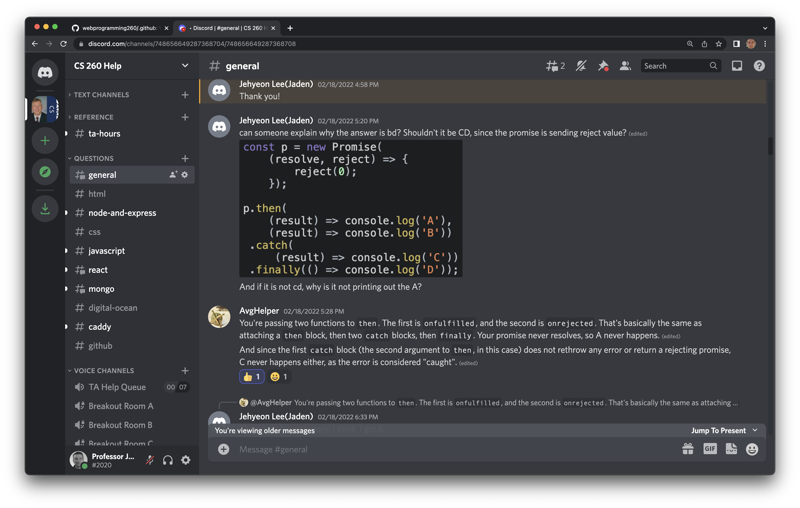

### Questions

Our server contains the following channels for asking and answering questions.

- caddy
- github
- html
- css
- javascript
- node and express
- react
- mongo
- general

You should use the channel that is most appropriate for your discussion. Do not ask questions in multiple channels. Only use `general` if it really is not specific to another channel.

âš  Make sure you review the instruction on [asking questions](../askingQuestions/askingQuestions.md) before you start asking questions.

### Online TAs

Under the voice channels you will see the TA chat rooms. When a TA is working (check the schedule for hours) you will see them here. Start by joining the `TA Help Queue`. When a TA becomes available they will move you into one of the breakout rooms.

## ☑ Assignment

Get on the Discord server. Pick a channel that sounds interesting and read through some discussions. Find a good web programming related meme add it to `text channels > memes`. When you are done submit what you found interesting with Discord and make a suggestion about how we could use it better to the Canvas assignment.


# Start up application

The focus of this course is to help you understand the technologies necessary to launch a web application start up. Towards this goal you will build your very own `start up` application. The actual application you build is entirely up to you, but it must successfully demonstrate the technologies we focus on.

The course is divided into distinct milestones. At each milestone you will evolve your start up application to take on more and more functionality. You start with a conceptual design document and then build a structural shell for the application using HTML. Next comes styling with CSS, interactivity with JavaScript, using third party web services, hosting your own web service, database connectivity for persistent storage, converting to a web framework with React, peer to peer communication with WebSockets, and finally a full mobile application using Progressing Web Application (PWA).

The Simon application is meant to give you an example for how to build your start up application. Use Simon as a chance to experiment with things you are considering doing with your start up application.

Immediately start thinking about what you would like to build. What you do for your start up application is completely up to you. So make it something that is interesting to you. It doesn't have to be complex. In fact **simple is usually better**. Dream big, but pick a very small minimal viable product for your start up application.

## Deliverables

You will turn in five deliverable versions of your start up application.

1. Design
1. HTML and CSS
1. JavaScript
1. Web service with database support
1. WebSocket and PWA

Grab a class peer and join forces using pair programming techniques. Your creative energy will help motivate each other when the nights get long.

You can change your project as the class progresses, but each milestone submission must includes all the functionality defined by the previous milestones. For that reason, it is suggested that you do not change your project, and carefully consider your project from the beginning, as the longer you go, the more expensive it will be to repeat your previous work.

## Ideas

Some ideas for possible projects include:

- Simple game like connect four or chess
- Peer chat
- Photo sharing
- Shared story authoring
- Book reviews
- Geo-location sharing
- News sharing
- Favorite website sharing
- Group voting
- Group calendaring
- Fitness tracking

Creativity is usually more important than complexity, and basic implementations of each of the course technologies is sufficient to demonstrate your mastery.

## Example

Here is an [example startup application](https://startup.cs260.click) that demonstrates the level of complexity that your application should represent.


## Demo day

At the end of class we will conduct a demo day for the best projects. Those selected for the demo day will be awarded additional credit for the exceptional work. The top presenters will be given the coveted Ghirardelli award.


# Let's play Simon


In 1978 Milton-Bradley, now Hasbro, released an electronic game named [Simon](<https://en.wikipedia.org/wiki/Simon_(game)>). It was cutting edge at the time since there were so few electronic games, and all the cool kids had one. I did not. So now I get my revenge.

We are going to build a peer to peer multiplayer web application modeled after Simon. We will build it together by adding new functionality every time we learn a new technology. The example version of code and production deployment for each iteration will be available to you. Your job will be to review the example and then build your version. If it looks very much like the example that is fine. Just make sure you are learning how it works. The less you copy/paste, and the more you write it yourself, the more you will learn. This is true, even if you are just looking at the example and typing most of what you see. The goal is to make you think about every line of code. Ask, "why is it done this way?" and "Is there a better way?". You will be surprised with the detailed understanding you will get. If your version looks very different than the example that the is also fine. Just make sure the major technology is represented.

Using what you learn from Simon you should be able to apply the same technologies to your start up application.

You can play the example production release [here](https://simon.cs260.click).

The following are the different technologies we are going to demonstrate with our Simon iterations.

| Iteration                         | Code                                                                 | Production release                              |
| --------------------------------- | -------------------------------------------------------------------- | ----------------------------------------------- |
| Simon HTML                        | [code](https://github.com/webprogramming260/simon-html#readme)       | [example](https://simon-html.cs260.click)       |
| Simon CSS                         | [code](https://github.com/webprogramming260/simon-css#readme)        | [example](https://simon-css.cs260.click)        |
| Simon JavaScript                  | [code](https://github.com/webprogramming260/simon-javascript#readme) | [example](https://simon-javascript.cs260.click) |
| Simon Service                     | [code](https://github.com/webprogramming260/simon-service#readme)    | [example](https://simon-service.cs260.click)    |
| Simon DB                          | [code](https://github.com/webprogramming260/simon-db#readme)         | [example](https://simon-db.cs260.click)         |
| Simon Login                       | [code](https://github.com/webprogramming260/simon-login#readme)      | [example](https://simon-login.cs260.click)      |
| Simon WebSocket                   | [code](https://github.com/webprogramming260/simon-websocket#readme)  | [example](https://simon-websocket.cs260.click)  |
| Simon React                       | [code](https://github.com/webprogramming260/simon-react#readme)      | [example](https://simon-react.cs260.click)      |
| Simon Progressive Web Application | [code](https://github.com/webprogramming260/simon-pwa#readme)        | [example](https://simon-pwa.cs260.click)        |


# Pair Programming

📖 **Required reading**: [MartinFowler.com](https://martinfowler.com/articles/on-pair-programming.html)

One of the objectives of this course is to improve your social skills. Working with peers is a great way to do that. You are encouraged to work on your start up application with a classmate as you practice what is known as `pair programming`. Pair programming gained popularity over twenty years ago and is commonly practiced in the industry.

> “for a … cost of about 15%, pair programming improves design quality, reduces defects, reduces staffing risk, enhances technical skills, improves team communications and is considered more enjoyable at statistically significant levels.â€
>
> — Alistair Cockburn

It is important to understand that pair programming is not simply working together, and it is **definitely not** division of labour. It is not a time saving technique. Both parties must be present whenever work is done. Pair programming follows a very specific process where one member of the pair is the driver and the other is the navigator. The Navigator researches and outlines the overall design. The driver handles the keyboard and controls the tactical implementation details. After a reasonable milestone is achieved, or time period (~30 minutes) is exceeded, the driver and navigator switch. It is also important to celebrate milestones together. Cookies work great as motivational rewards.

If done correctly the pair will learn from each other and produce a much better result. If you want to try pair programming (and you are highly encourage to do so) then introduce yourself to others in the class and see if they are interested. You can also use the `pair-programming` channel on Discord to reach out and find a partner.

Once you find a partner read the [MartinFolwer.com article](https://martinfowler.com/articles/on-pair-programming.html) together so that you both have the same understanding and expectations.

âš  Note: when you turn in an project that you build together as a pair, make sure you include all parties in your application footer. Your GitHub commit history should also represent commits from everyone associated with the creation of the assignment. That means you may need to change who is logged in if you are sharing a computer when you do your commits.


# Technology stack

The collection of technologies that you use to create or deliver you web application is called a technology stack. it is a stack because they usually layer one on top of each other. Generally at the top of the stack is your web framework. This includes possibilities such as Angular, React, Vue, or Svelte. The web framework then communicates with one or more web services to provide authentication, business, data, and persistent storage. The web service then uses backend services such as caching, database, logging, and monitoring.

Here is what our stack looks like. React for the web framework, talking to Caddy as the web server hosted on AWS, running web services with Node.js, and MongoDB as the database hosted on MongoDB Atlas.


The key with a tech stack is the realization that there is no one answer, and the answer continually evolves. Usually you will use what the company you work for has invested in. Migrating to a new stack is very expensive and error prone. So learning how to maximize your effectiveness, regardless of the technology, will make you very valuable. Being discontent because the latest new toy is not being used, will usually cause an unnecessary disruption to the team. However, if you can validate that a change in the tech stack with produce significant monetary, performance, or security gains, then you will greatly benefit your team.

## Complex technology stack

He is an example of a tech stack from a small web application company. You can see that there are dozens of technologies used to make the application work. When you build a commercial stack you want to be very careful about the pieces you choose. Dependability, support, scalability, performance, and security are all important factors. You also want to consider development productivity factors such as documentation, ease of use, common acceptance, community support, build times, and testing integration.


# The Console

📖 **Required reading**: [MDN Command line crash course](https://developer.mozilla.org/en-US/docs/Learn/Tools_and_testing/Understanding_client-side_tools/Command_line)

Before the creation of graphical user interfaces, all computing systems were simple console environments consisting as of a prompt for inputting a command and the display of the command output. All of the original programming tools ran as console application. The console tradition is still actively used by professional developers and most programming tools execute within a console window.

Also know as the command line, shell, or terminal, the console window is an essential web development tool. The console provides access to the file system and allows for the execution of command line applications.

There are many console applications that you can chose from. All operating systems come with a default console, but you will probably want to install one in order to get the best experience. Here is an example of [Warp](https://www.warp.dev/) running on a Mac.

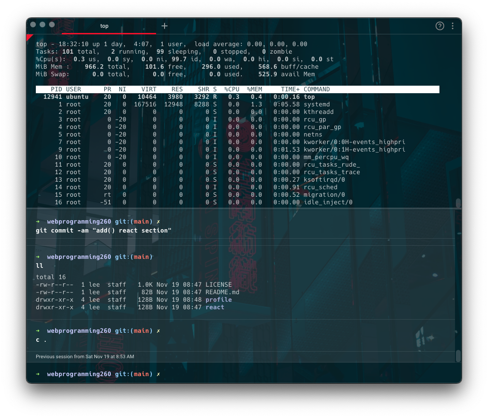

## Make sure you have a console application

In order for you to successfully use the console for web programming it must be [POSIX](https://en.wikipedia.org/wiki/POSIX) compliant. POSIX compliance means that it supports a standard set of console commands. Both Mac and Linix support POSIX. That means any necessary console commands will work on those operating systems. On Microsoft Windows, you can get a reasonable approximation of a POSIX compliant console by installing [Git Bash](https://git-scm.com/download/win).

âš  If you are using Windows and do not already have a POSIX compliant console application installed, then install [Git Bash](https://git-scm.com/download/win) before continuing. When installing use all the default settings.

Open your console application and make sure you can run a simple POSIX compliant command such as `printf hello`. If this displays hello then you are on the right track.

## Viewing the file system

One of the primary purposes of a console application is to view the files on the computer. The files on a computer are organized into a tree structure of nodes called directories. At any given point in time your console is located at one of the directories in the file system. You can see which directory you are in with the `pwd` (present working directory) command.

```sh
➜  pwd

/Users/student/byu//webprogramming260
```

You can list all of the files in the directory with `ls` (list files). Most command line applications take parameters that are specified after you type the application name. For example, `ls` can list all files (even hidden ones) in a long format if you provide the parameter `-la`.

```sh
➜ ls -la

total 16
-rw-r--r--  1 lee  staff   1.0K Nov 19 08:47 LICENSE
-rw-r--r--  1 lee  staff    82B Nov 19 08:47 README.md
drwxr-xr-x  4 lee  staff   128B Nov 19 08:48 profile
drwxr-xr-x  4 lee  staff   128B Nov 19 08:47 react
```

## Executing commands

The other primary purpose of the console is to execute commands. You already did this in the previous section when you executed commands for working with the file system. However, console commands can perform many different operations. Here are some basic commands that you show experiment with.

- **echo** - Output the parameters of the command
- **cd** - Change directory
- **mkdir** - Make directory
- **rmdir** - Remove directory
- **rm** - Remove file(s)
- **mv** - Move file(s)
- **cp** - Copy files
- **ls** - List files
- **curl** - Command line client URL browser
- **grep** - Regular expression search
- **find** - Find files
- **top** - View running processes with CPU and memory usage
- **df** - View disk statistics
- **cat** - Output the contents of a file
- **less** - Interactively output the contents of a file
- **wc** - Count the words in a file
- **ps** - View the currently running processes
- **kill** - Kill a currently running process
- **sudo** - Execute a command as a super user (admin)
- **ssh** - Create a secure shell on a remote computer
- **scp** - Securely copy files to a remote computer
- **history** - Show the history of commands
- **ping** - Check if a website is up
- **tracert** - Trace the connections to a website
- **dig** - Show the DNS information for a domain
- **man** - Look up a command in the manual

You can also chain the input and output of commands using special characters

- `|` - Take the output from the command on the left and _pipe_, or pass, it to the command on the right
- `>` - Redirect output to a file. Appends if the file exists
- `>>` - Redirect output to a file. Overwrites the file if it exists

For example, you can list the files in a directory, pipe it into `grep` to search for files created in Nov, and then pipe that into `wc` to count the number of files found with a date of Nov.

```
ls -l | grep ' Nov ' | wc -l
```

There are also keystrokes that have special meaning in the console.

- `CTRL-R` - Use type ahead to find previous commands
- `CTRL-C` - Kill the currently running command

## ☑ Assignment

Experiment with console commands. Open a console window and create a junk directory that you can play with by executing the command `mkdir junk` (make directory). Then execute the command `cd junk` to change into that directory. Try the following sequence of commands:

```sh
mkdir junk
cd junk
pwd
ls
ls -la
ls ../
echo "hello world" > test.txt
ls -l
cat test.txt
cp test.txt other.txt
ls
cat test.txt >> other.txt
less other.txt # press `q` to exit less
rm test.txt
ls
cd ..
ls
rm -rf junk
ls
```

The better you get at working with the console the more efficient your programming will be. When you are done experimenting, submit a description of something you found interesting to the Canvas assignment.


# Editors

The code editor is the workspace of a web application developer. Deeply learning an editor that makes you efficient and flexible will pay significant dividends in your ability to deliver quality work and greatly reduce frustration. A good editor should feel like a friend. If you are constantly arguing with your editor, then perhaps you need a relationship adjustment.

For your work with this instruction I would highly suggest you use two editors. The first one, Visual Studio Code, is your main editor for daily coding activities. The second one, is VI. You will use VI when you are shelled into your production environment and need a simple, but powerful, console based editor for quickly editing text files.

## Visual Studio Code


**Website**: [VS Code](https://code.visualstudio.com/)

Created by Microsoft, Visual Studio Code (VS Code), is free and supported by a large community of open source developers. The [2021 Stack Overflow](https://insights.stackoverflow.com/survey/2021#section-most-popular-technologies-integrated-development-environment) developer survey put VS Code as the number one choice for 71% of professional developers.


VS Code is both simple to use, incredibly flexible, and powerful. At its most basic level it represents files in a given directory on the left and a space on the right for editing files. VS Code then adds excellent git support, auto-formatting, auto-suggestions, and debugging support for JavaScript right out of the box. You can easily install a language server extension most major programming languages that provide coding, building, and debugging support. From there you have your choice of thousands of extensions to add whatever functionality you would like. This includes extensions such as an auto-reloading HTTP server for hosting your project code locally in a browser, an image editor, a spell checker, hex editor, testing frameworks, linters, code prettier, or even docker container management to compartmentalize your development of different projects.

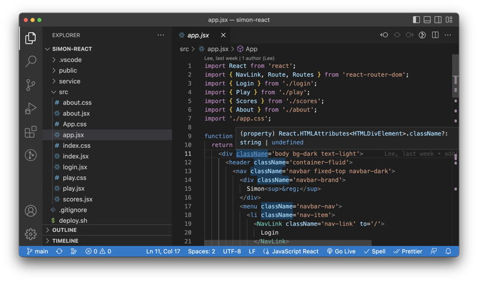

So unless you are already a master of some other development environment, it is highly suggested you go and [install VS Code right now](https://code.visualstudio.com/).

### Live Server extension

The VS Code Live Server extension is great for building web applications. You are going to build a lot of HTML, CSS, and JavaScript. You can do much of this on CodePen, but for your projects you are going to be working in your development environment. This means you will have a GitHub repository cloned to your personal development computer. When you open VS Code to the directory where your repository is located you can start creating HTML, CSS, and JavaScript, but when you want to see your code working you need to actually run a web server to deliver your files to the browser. That is where the Live Server extension comes in handy. With the press of the `Go Live` button on the bottom right status bar, your entire project directory is served up through your browser. Additionally, if you make any changes to a file the browser will automatically be updated.

To install the Live Server extension, open up VS Code and follow these three steps.

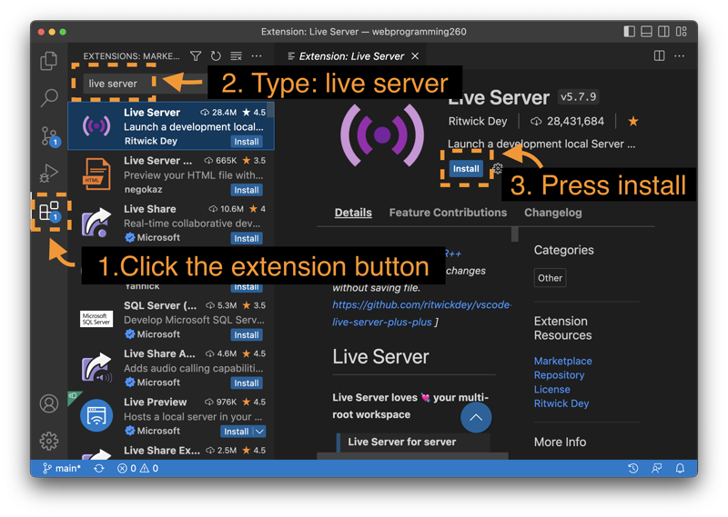

Congratulations! You have joined the 28 million other users already enjoying this extension. You can test it by opening VS Code, creating a new file named `index.html` and pasting `<h1>hello<h1>` into the file. Then save the file and press the `Go Live` button. This will launch your browser and display the rendered `index.html` file. If you make changes to your file and save it, the browser will automatically be updated to display your changes.

### GitLens

The basic support that VS Code offers for working with `git` is sufficient for most tasks, but if you really want to unleash the power of git, consider installing the `GitLens` extension. It makes reviewing the commit history, stashing, merging, and comparing so much easier. With over 18 million users, you might enjoy joining the party.

## VI


VI, or technically vim, is one of the oldest console editors. It is extremely powerful and some incredibly talented software engineers use it as their sole development environment. The reason why you should learn VI is that it is available on every Linux server and can do anything that you will need. With that said it has a bit of an initial learning curve. However, once you have memorized a few basic commands you will be able to get around easily. If you take some time to really learn VI, you might find a new essential tool.

There are lots of tutorials for VI here are a few based on how you like to learn.

- [Textual](https://www.linuxfoundation.org/blog/blog/classic-sysadmin-vim-101-a-beginners-guide-to-vim)
- [Video](https://youtu.be/RZ4p-saaQkc)
- [Interactive](https://www.openvim.com/)
- [Game](https://vim-adventures.com/)
- `Console` - Type `vimtutor` in your console

Additionally, the following instruction walk you through the basics and give you a few important commands to get started.

To use VI, open your console and change directory to one that holds some code you want to work on. For example, if you wanted to edit `index.html` you would type type:

```sh
vi index.html
```


What you will immediately notice is that there is no menu bar or navigation aids. Instead, VI works entirely by keyboard commands. There are two modes in VI, command mode and insert mode. When you open VI, you are in command mode and all of the command keystrokes will work. To edit a document, use the command `i` to enter insert mode. Now your keystrokes will modify the document. To exit insert mode and type commands again, press `ESC`.

The following short list of commands should allow you to do most of what you will ever want to do.

| keystroke | meaning                                                                                                                                        |
| --------- | ---------------------------------------------------------------------------------------------------------------------------------------------- |
| `:h`      | help                                                                                                                                           |
| `i`       | enter insert mode. This will allow you to type and delete text. Use ESC to exit insert mode. No other commands will work while in insert mode. |
| `u`       | undo                                                                                                                                           |
| `CTRL-r`  | redo                                                                                                                                           |
| `gg`      | go to beginning of file                                                                                                                        |
| `G`       | go to end of file                                                                                                                              |
| `/`       | search for text that you type after /                                                                                                          |
| `n`       | next search match                                                                                                                              |
| `N`       | previous search match                                                                                                                          |
| `v`       | visually select text                                                                                                                           |
| `y`       | yank or copy selected text to clipboard                                                                                                        |
| `p`       | paste clipboard                                                                                                                                |
| `CTRL-wv` | Split window vertically                                                                                                                        |
| `CTRL-ww` | Toggle windows                                                                                                                                 |
| `CTRL-wq` | Close current window                                                                                                                           |
| `:e`      | Open a file. Type ahead available. If you open a directory you can navigate it in the window                                                   |
| `:w`      | write file (save)                                                                                                                              |
| `:q`      | quit. Use `:q!` to exit without saving                                                                                                         |

The great thing about learning these commands is that you will find that they work with a lot of the POSIX console programs. For example, with the file viewing utility `less` you can use `G` and `gg` to jump to the top and bottom of a file. Here is a [cheat sheet](https://vim.rtorr.com/) if you want to see all the commands.

### VI humor

> How do you generate a random string?
>
> Put a web developer in front of VI and tell them to save & exit.


# Git


Incredibly [Linus Torvalds](https://en.wikipedia.org/wiki/Linus_Torvalds), the creator of Linux, was fed up with the proprietary version control software that he was using to track the code for the Linux kernel and so over a weekend he built Git, the world's most popular version control system.


> “Talk is cheap. Show me the code.â€
>
> — Linus Torvalds

## Installing Git

Before we can talk about Git you need to make sure it is installed in your development environment. Open a console and type `git --version`.

```sh
➜  git --version
git version 2.32.0 (Apple Git-132)
```

If you do not see something like that, then you need to follow these [instructions](https://git-scm.com/book/en/v2/Getting-Started-Installing-Git) to install Git.

## What is Git?

Git provides two valuable functions. First, it allows you to track versions of files in a directory. Second, it allows you to clone all of those versions to a different location, usually to a different computer. We are going to focus on tracking versions in this instruction and cover cloning repositories when we talk later about GitHub.

You can track file versions of any files in a directory by initializing Git for that directory. You can do this right now by creating a new directory in a console window and initializing it as a Git repository.

```sh
➜  mkdir playingWithGit
➜  cd playingWithGit
➜  git init
```

If you list all files in the directory you will see that you now have a hidden directory named `.git`.

```sh
➜  ls -la
total 0
drwxr-xr-x   3 lee  staff    96 Dec  1 22:59 .
drwxr-xr-x+ 54 lee  staff  1728 Dec  1 23:00 ..
drwxr-xr-x   9 lee  staff   288 Dec  1 22:59 .git
```

The `.git` directory is where all of the versions get stored. Now use the `echo` command to create a file so that we can see how versioning works. After creating the new file, use `git status` to tell you what git is doing.

```sh
➜ echo hello world > hello.txt
➜ git status

On branch master
No commits yet
Untracked files:
  (use "git add <file>..." to include in what will be committed)
	hello.txt

nothing added to commit but untracked files present (use "git add" to track)
```

Git status tells you that it detects a new file named `hello.txt`, but it isn't currently tracking versions for that file. To begin tracking versions you need to add it. Usually you track all files in a repository directory and so you can tell Git to track everything that it doesn't know about with `git add .`. Follow this with another call to `git status`.

```sh
➜  git add .
➜  git status

On branch master
No commits yet
Changes to be committed:
  (use "git rm --cached <file>..." to unstage)
	new file:   hello.txt
```

Now Git tells us that it has `staged` the file `hello.txt` and it is ready to be committed as a version in the repository. We commit a version with the `commit` command. We always want to have a meaningful comment about the version we are committing and so we use the `-m` parameter to provide a message that will live with the version. Follow this with another call to `git status`.

```sh
➜  git commit -m "initial draft"
[master (root-commit) d43b07b] initial draft
 1 file changed, 1 insertion(+)
 create mode 100644 hello.txt

➜  git status
On branch master
nothing to commit, working tree clean
```

Congratulations! You have just committed your first file to a Git repository. It is important to note that we were only working with a single file in this example. However, a commit can represent multiple files. You just need to add them all before you execute the commit. Also, note that the point of the stage (add) step, is so that you can commit some files while still leaving other modified file out of the commit.

Let's make an edit to our file and commit it again. This time we will tell Git that we want to add all the tracked modified files to our commit by including the `-a` parameter along with our message parameter.

```sh
➜  echo goodbye world > hello.txt

➜  git commit -am "changed greeting to reflect the present mood"

[master e65f983] changed greeting to reflect the present mood
 1 file changed, 1 insertion(+), 1 deletion(-)
```

Now that we have a couple versions in our repository we can view the versions with the `git log` command.

```sh
➜  git log

commit e65f9833ca8ee366d0d9c1676a91b1a977dab441 (HEAD -> master)
Author: Lee
Date:   Thu Dec 1 23:32:22 2022 -0700

    changed greeting to reflect the present mood

commit d43b07b8890f52defb31507211ba78785bf6dccf
Author: Lee
Date:   Thu Dec 1 23:29:11 2022 -0700

    initial draft
```

This shows both commits with the associated comments.

## Commit SHA

Every commit has a unique identifier that is generated by hashing the file along with the timestamp using the SHA hashing algorithm. You can always refer to a specific commit in your version history by using its SHA. For example, if we want to temporarily switch back to a previous version to see what it contains we can use the `checkout` command. You only need to provide the first few characters of the SHA.

```sh
➜  git checkout d43b07b8890f

Note: switching to 'd43b07b8890f'.
HEAD is now at d43b07b initial draft

➜  cat hello.txt
hello world
```

The above output omits a big message saying that you are no longer looking at the latest version, but the important thing is that you can see that we are now looking at our old version. To get back to the top of the version chain, use the `checkout` command and reference the branch name, which is by default `master`.

```sh
➜  git checkout master
Previous HEAD position was d43b07b initial draft
Switched to branch 'master'

➜  cat hello.txt
goodbye world
```

Now we are back to our latest version.

The following diagram shows how your commits move from your working directory, to staging them for a commit, and then committing them to a repository.

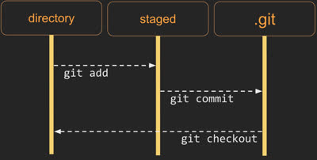

A commit is a full snapshot of what was staged from your directory at the time of the commit. That means all of the files contained in the commit were reverted when you executed the checkout command. Since we only had one file in our commit, it looks like we are only flipping that file around, but basically you can think of it as a time machine for the entire directory.

## Diff

Most of the time you don't want to reverse back to an earlier commit. Instead you just want to compare the differences between commits. We can do that with the `diff` command. You can specify two SHAs that you would like to compare, or you can use the HEAD variable which points to the top of the commit change. To refer to earlier commits you just add `~` and the numerical distance from head that you want to reference. In this case we will compare HEAD and HEAD~1.

```sh
➜  git diff HEAD HEAD~1
```

```diff
diff --git a/hello.txt b/hello.txt
index 3b18e51..eeee2af 100644
--- a/hello.txt
+++ b/hello.txt
@@ -1 +1 @@
-hello world
+goodbye world
```

You can see that we made a change to `hello.txt` by removing `hello world` and adding `goodbye world`.

## Branches

Git supports the ability to branch your code. This allows you to work on variations of the code while still allowing progress on the main branch. For example, if you wanted to work on a new feature named `A` without interrupting work on the master branch, you would use the `git branch A` command and start working on the `A` branch with the `git checkout A` command. Now commits can be down to both the master and the `A` branch. When you want to combine the work done on both branches you us checkout the master branch and execute `git merge A`. If you decide you want to abandon the new feature then you just don't ever merge it back into the master branch.

Here is a demonstration of this working on the visualization tool provided by [git-school.github.io](https://git-school.github.io/visualizing-git/).

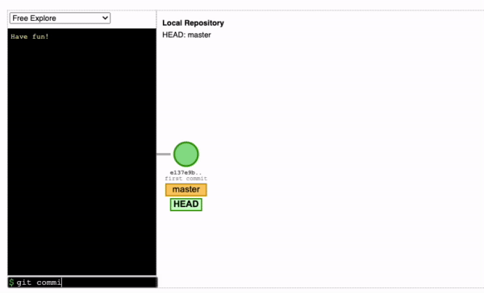

## Commit often

You will be required to have at least 4 commits for each project that you submit in order to get full credit. Commonly, this will be an initial commit that contains empty project files, followed by commits at each functional milestone, and then a final commit for the working project. Committing your code often is an important practice for you to develop. It protects you from losing your work, allows access from anywhere, makes it so you can quickly share changes, reduces conflicts with your peers, and enables you to efficiently explore different possibilities. This also enables others to review the progression of your development efforts in order to prove the originality of your work.

Remember to make meaningful commit messages that describe the **what** and **why** of the changes made. Here is a [good post](https://www.freecodecamp.org/news/how-to-write-better-git-commit-messages/) on how make meaningful commit messages.

## Binary files

You can store any type of file in Git, but be aware that if you store large binary files, such as images or videos, you are storing a copy of that file each time you make a change to it. For example, suppose you use Git to track the changes you make to a video production project. Every time you save a change to your 10 GB video file you store a complete copy of the file. That means 10 commits of the video file will store 100 GB of data in your repository.

## VS Code and Git

Knowing how to use Git from the console is a very valuable skill. Git offers a wide variety of functionality such as creating branches of the repository, temporarily stashing changes, and cloning repositories to other machines.

However, by using a tool like VS Code you can hide all of the complexity of the command line and use a visual interface instead.

Here we see VS Code, with the GitLens extension installed, looking at the directory we have been working in. On the left you see all the commits we have previously created. We can edit our `hello.txt` file and VS Code will automatically detect the change and set it up for us to commit. VS Code will even put a marking on the left side of the edited text to show us what line we have changed. We can click on the staged file, in the commit area, and see the differences before we commit. Since they look good, we add a comment, and press commit. The new commit immediately shows up in our list of commits. We can use the visual diff again to click through all of the previous versions.


Underneath the covers, the GitLens extension is running Git commands just like we did on the command line, but using a visual tool makes working with versions much easier. Take some time and play with adding files, modifying them, committing, and diffing. You want to get to the point where this is second nature so that you can easily experiment and make mistakes, knowing that with Git, you can always easily recover.


# GitHub


📖 **Required reading**:

- [GitHub create a repo](https://docs.github.com/en/get-started/quickstart/create-a-repo)
- [GitHub cloning a repo](https://docs.github.com/en/repositories/creating-and-managing-repositories/cloning-a-repository)
- [GitHub personal access tokens](https://docs.github.com/en/authentication/keeping-your-account-and-data-secure/creating-a-personal-access-token)

When we introduced `Git`, we said that Git provides two things, 1) Version tracking in a repository, and 2) the ability to clone a copy of the repository to a different location. You can clone repositories between computers used by your development team, but the management of cloning repositories is much easier when you use a cloud based service such as `GitHub`.

GitHub was launched in 2008 by a small group of developers that wanted to make code collaboration easy. GitHub was acquired by Microsoft in 2018 for $7.5 billion. Since its beginning as a simple web application for cloning and storing Git repositories, GitHub has added functionality for hosting websites, supporting community pull requests, tracking issues, hosting codespaces, running continuous deployment processes, managing projects, and even AI driven code generation.

We are going to use GitHub for three things.

1. Hosting all of this instruction. Because it is hosted on GitHub you can generate pull requests when you see things that need improvement.
1. Publicly hosting your project repositories. This creates a backup copy of your code, demonstrates your progress with your commit history, allows for reviews of your code, and makes it so you can collaborate with your peers.
1. Keeping notes about what you have learned and things you want to remember.

## Creating a GitHub account

If you do not already have a GitHub account then go and [create one now](https://github.com). GitHub provides a free version of their services that will more than cover your usage in this class. Chances are that once you start using GitHub you will use this account for many years to come, both for personal and professional projects.

## Creating and cloning a repository

While you can create a repository in your development environment using `git init` and then connect it to an upstream repository on GitHub, it is always easier to create your repository first on GitHub and then clone it to your development environment. That way your repositories are automatically linked to each other.

To create a repository in GitHub, log into your account, select the `Repositories` tab, and press `New repository`. You then specify a unique repository name, give a description, indicate that you want it to be public, add a default README.md file, and choose a license.


Every repository in GitHub has a unique URL assigned to it. Assuming the repository is public, anyone with the URL can clone it to their development environment. A repository clone is an exact copy of the repository including all of the commits, comments, and SHAs. It also configures the clone to know what the remote source is so that you can use Git commands to keep them in sync as changes are made.


You clone a repository by providing the GitHub repository's URL as a parameter to the `git clone` command from in a console window. You can get a copy of the URL from the repository's GitHub page and clicking on the green `Code` button, and then clicking on the copy button next to the HTTPS url.

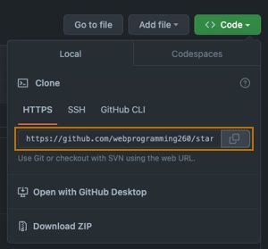

When you clone a repository it is placed in a subdirectory named with the name of the repository. So make sure you are in the directory where you keep all of your source repositories before you run the command.

```sh
➜  git clone https://github.com/webprogramming260/startup-example.git

Cloning into 'startup-example'...
remote: Total 4 (delta 0), reused 0 (delta 0), pack-reused 0
Receiving objects: 100% (4/4), done.

➜  cd startup-example
```

## Making changes

You can now make changes to the files in the repository and commit those changes. As you create new commits you want to push those changes back up to the GitHub clone of the repository so that the repositories are are in sync with each other. This is done with the `push` Git command. Once you have pushed the new commits then your peers who have cloned the repository can pull the commits down using the `pull` Git command.


The following demonstrates console commands for making a change to the README.md file, committing it, and then pushing it up to GitHub. Of course you can also do this using the Git interface of VS Code.

```sh
➜  printf "\nChange from my development environment!\n" >> README.md

➜  git commit -am "update(notes) thoughts about start up applications"

➜  git push
```

This is the pattern that you want to make a reflexive part of your development process.

1. Pull the repository's latest changes from GitHub (`git pull`)
1. Make changes to the code
1. Commit the changes (`git commit`)
1. Push the changes to GitHub (`git push`)

âš  Note: The first time you make a push request to a repository Git will ask you how you want to identify yourself and what credential (e.g. password) to use in order to authenticate with GitHub. You will need to create a [Personal Access Token](https://docs.github.com/en/authentication/keeping-your-account-and-data-secure/creating-a-personal-access-token) and provide that as your password.

After pushing changes GitHub, you then view the changes on GitHub with your browser. In the example above, you would see the changes to the `README.md` file. You can also edit and commit changes directly from GitHub. When looking at a repository file on GitHub you will see a little pencil in the top right hand corner of the file. If you press that you will enter edit mode. You use that to modify the file and then commit the changes with an appropriate comment.


Now that there is a commit that GitHub has that you do not have in your development environment. If we run the `fetch` Git command, you will get the latest information about the changes on GitHub without actually changing your local repository. We then run the `status` Git command to see the differences between the clones and see that we are missing a commit. You can pull it down using the `pull` Git command. You can also use the Git functionality in VS Code to view the status and sync up your repository.

```sh
➜  git fetch
➜  git status
Your branch is behind 'origin/main' by 1 commit, and can be fast-forwarded.
  (use "git pull" to update your local branch)

➜  git pull
Updating d13a9ce..cafe81a
Fast-forward
 README.md | 4 +++-
 1 file changed, 3 insertions(+), 1 deletion(-)
```

After running the pull command, your development clone and the GitHub clone are now the same.

## Handling merge conflicts

By pushing and pulling often, everyone keeps an up to date copy of the repository. This is important so that you don't run into merging problems caused by two peers modifying the exact same code. Merging only becomes something you have to deal with when two people modify the exact same line of code. However, when you have two peers working together you are always going to have a merge conflict at some point in time and so let's discuss how to handle this.

We can simulate a merge conflict by editing a line in a file and committing the file in your development environment, and before pushing that change, modifying the same line using GitHub. Now, run `fetch` and `status` again in your console.

```sh
➜  git fetch
➜  git status
Your branch and 'origin/main' have diverged,
and have 1 and 1 different commits each, respectively.
  (use "git pull" to merge the remote branch into yours)
```

This shows that the cloned repositories have diverged from each other. Normally this is fine and we can just push and pull the different commits, but if we do that this time we will get an error because the exact same line was changed in the two different commits.

```sh
➜  git pull

Auto-merging README.md
CONFLICT (content): Merge conflict in README.md
Automatic merge failed; fix conflicts and then commit the result.
```

We now need to resolve the merge conflict that it says has happened with our `README.md` file. If you are using VS Code with the GitLens extension installed it will visually walk you through this process. However, so you can understand what is going on, we will do this using the console. The first step is to open up `README.md` in an editor. You will see that git has injected lines that highlight where the conflict is. Both your local change and the change made on GitHub are included.

```diff
An example start up application

Change from my development environment!

Change from GitHub

<<<<<<< HEAD
Conflict change made in development environment
=======
Conflict change made in GitHub
>>>>>>> b9f4c53c91eff509993d7291e60148f903827de0
```

We resolve the conflict by modifying the file to remove the textual conflict delimiters and modifying the file to keep the changes we want. When we are done editing, our file contains what we want from both commits.

```md
# startup-example

An example start up application

Change from my development environment and from GitHub
```

Now that the conflict is resolved we commit our resolution and push up the result.

```sh
➜  git commit -am "merge(notes) combined both edits"
➜  git push
```

If you go look at the file again on GitHub you will see the additional commit in the history and the result of our merge in the file content.

## Keeping notes

Keeping notes of what you have learned and things that you want to remember is an essential step for accelerating your web programming skills. GitHub supports the inclusion of a file with the special name `README.md` in the root of your repository. This file uses `Markdown` syntax. If you have not used Markdown before, then take some time to [learn how to use it](https://docs.github.com/en/get-started/writing-on-github/getting-started-with-writing-and-formatting-on-github/basic-writing-and-formatting-syntax). For this course you will use your start up application's README.md file and your website's README.md to keep notes.

## Pull requests

GitHub allows you to create a fork of any repository on GitHub. You just push the `fork` button from the repository's GitHub page. This will copy the repository to your GitHub account. This is similar to cloning a repository to your development environment, but it clones to GitHub instead. You can then make modifications to the repository and push the changes as a pull request. This notifies the original repository's owner that a request is being made to enhance the original repository. The owner can review your changes and if appropriate commit the changes into the original. This is how open source communities manage development from a volunteer group of global developers.

In this class, if you notice something in the instruction that needs to be enhanced, feel free to fork the repo, and make a pull request. This will give you experience with this practice and improve the instruction for others at the same time. Plus your name will be include as a contributor. How cool is that!

# ☑ Assignment

Do the following steps to set up your `Start up application repository` in GitHub and clone it to your development environment.

1. Create a GitHub account if you do not already have one.
1. Create a repository, named `startup`, for your start up application. Your project must be public. Select the option for a default README.md file. This is where you will also keep all of your notes for things that you learn and want to remember.
1. Clone the repository to your development environment, by getting the repository's URL, and using `git clone`.
1. Open up the repository directory in VS Code and modify the README.md file.
1. Use the Git functionality of VS Code to commit your changes and push them to GitHub.
1. In GitHub modify your README.md file and commit the changes.
1. In VS Code pull down and review the changes.
1. Make another change to the README.md file on GitHub and commit the change.
1. Before you pull the changes to your development environment, change the same line in the README.md file and commit the change.
1. Attempt to pull the GitHub changes to your development environment. Note and resolve the merge conflict. Commit the merged changes. Push the merge commit.
1. On GitHub observe the resolved merge.
1. Make your first notes in your README.md file about what you learned from this assignment. Commit and push your notes to GitHub.

When you are done, provide the URL of your GitHub start up repository, along with a comment about something you found interesting, to the Canvas assignment.


# Development and production environments

When working on a commercial web application, it is critical to separate where you `develop` your application, from where the `production` release of your application is made publicly available. Often times there are more environments than this, such as staging, internal testing, and external testing environments. If your company is seeking third party security certification (such as SOC2 compliance) they will require that these environments are strictly separated from each other. A developer will not have access to the production environment in order to prevent a developer from nefariously manipulating an entire company asset. Instead automated integration processes, called continuously integration (`CI`) processes, checkout the application code, lint it, build it, test it, stage it, test it more, and then finally, if everything checks out, pushes the application to the production environment, and notifies the different departments in the company of the release.

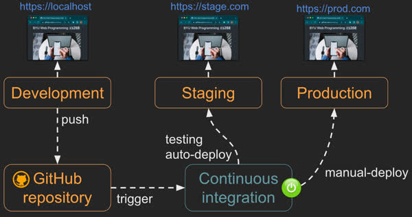

For our work, you will use and manage both your `development` (your personal computer) and `production` (your AWS server) environments. However, you should never consider your production environment as a place to develop, or experiment with, your application. You may shell into the production environment to configure your server or to debug a production problem, but the deployment of your application should happen using an automated CI process. For our CI process, we will use a very simple console shell script.

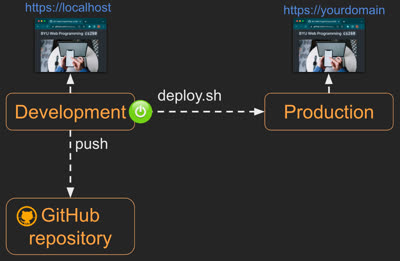

## Deployment

The advantage of using an automated deployment process is that it is reproducible. You don't delete a file, or misconfigure something with an accidental keystroke. Also, having a automated script encourages you to iterate quickly because it is so much easier to deploy your code. You can add a small feature, deploy it out to production, and get feedback within minutes from your users.

Our deployment scripts change with each new technology that we have to deploy. Initially, they just copy up a directory of HTML files, but soon they include the ability modify the configuration of your web server, run transpiler tools, and bundle your code into a deployable package.

You run a deployment script from a console window in your development environment with a command like the following.

```sh
./deploy.sh -k ~/prod.pem -h yourdomain.click -s simon
```

The `-k` parameter provide the credential file necessary to access your production environment. The `-h` parameter is the domain name of your production environment. The `-s` parameter represents the name of the application you are deploying (either `simon` or `startup`).

This will make more sense as we gradually build up our technologies but we can discuss our simon-service deployment script as an example of what they will do. You can view the [entire file here](https://github.com/webprogramming260/simon-service/blob/main/deployService.sh), but we will explain each step below. It isn't critical that you deeply understand everything in the script, but the more you do understand the easier it will be for you to track down and fix problems when they arise.

The first part of the script simply parses the command line parameters so that we can pass in the production environment's security key (or PEM key), the hostname of your domain, and the name of the service you are deploying.

```sh
while getopts k:h:s: flag
do
    case "${flag}" in
        k) key=${OPTARG};;
        h) hostname=${OPTARG};;
        s) service=${OPTARG};;
    esac
done

if [[ -z "$key" || -z "$hostname" || -z "$service" ]]; then
    printf "\nMissing required parameter.\n"
    printf "  syntax: deployService.sh -k <pem key file> -h <hostname> -s <service>\n\n"
    exit 1
fi

printf "\n----> Deploying $service to $hostname with $key\n"
```

Next the script copies all of the applicable source files into a distribution directory (`dist`) in preparation for copying that directory to your production server.

```sh
# Step 1
printf "\n----> Build the distribution package\n"
rm -rf dist
mkdir dist
cp -r application dist
cp *.js dist
cp package* dist
```

The target directory on your production environment is deleted so that the new one can replace it. This is done by executing commands remotely using the secure shell program (`ssh`).

```sh
# Step 2
printf "\n----> Clearing out previous distribution on the target\n"
ssh -i $key ubuntu@$hostname << ENDSSH
rm -rf services/${service}
mkdir -p services/${service}
ENDSSH
```

The distribution directory is then copied to the production environment using the secure copy program (`scp`).

```sh
# Step 3
printf "\n----> Copy the distribution package to the target\n"
scp -r -i $key dist/* ubuntu@$hostname:services/$service
```

We then use `ssh` again to execute some commands on the production environment. This installs the node packages with `npm install` and restarts the service daemon (`PM2`) that runs our web application in the production environment.

```sh
# Step 4
printf "\n----> Deploy the service on the target\n"
ssh -i $key ubuntu@$hostname << ENDSSH
cd services/${service}
npm install
pm2 restart ${service}
ENDSSH
```

Finally we clean up our development environment by deleting the distribution package.

```sh
# Step 5
printf "\n----> Removing local copy of the distribution package\n"
rm -rf dist
```

Can you imagine if you had to do all of that by hand every time? You would dread deploying and would most likely make several time consuming mistakes during the process.

A deployment script exist for each of the Simon projects and you can use them, as is, for your start up application as long as you are doing similar type of deployment actions.

If you want to learn more about shell scripting you can [read this tutorial](https://ryanstutorials.net/bash-scripting-tutorial/bash-script.php). Shell scripting is a powerful tool for automating common development tasks and is well worth adding to your bucket of skills.


# CodePen

This course makes extensive use of the coding sandbox website [CodePen](https://codepen.io). âš  You must create a free account on CodePen if you do not already have one. With your account you can experiment with HTML, CSS, JavaScript, and React. These experiments are saved in a "pen". Every pen has a unique URL.

The power of CodePen is that it immediately renders your code in the preview window. This makes it so you can reduce a problem to something small, quickly iterate ideas, and immediately see what the impact is. CodePen also serves as a portfolio of what you have learned so that you can review it later or share it with others.

When working with assignment that use CodePen to submit your work, you will do the following steps:

1. Either create a new pen, or fork an existing example pen.
1. Conduct the experiment as defined by the assignment.
1. Save your assignment periodically so that you don't loose any work. In order to keep your CodePen account organized you should consider using pen collections for different technologies.
1. Submit the pen's URL in Canvas along with a description on some interesting thing that you learned.


In addition to using CodePen to complete assignments, it is a great place to find coding examples. Browsing CodePen will expose you to new ideas from their large community of contributors. You might consider making a daily habit of finding and reviewing a pen. If you find a really interesting pen then share it with others on Discord.

## ☑ Assignment

Find an interesting pen that someone else has created. Fork the pen and make a minor change. Save the pen. Submit your CodePen URL, along with a description of what you found interesting, to the Canvas assignment.


# Start up deliverable - specification

Your start up application demonstrates your mastery of the instruction presented by this course. Make sure you put significant effort into coming up with a simple yet interesting idea. Your application needs to demonstrate the use of HTML, CSS, JavaScript, calling web services, providing web services, authentication, storing data persistently, using web sockets for peer to peer communication, and running as a progressive web application.

Create an elevator pitch for your application. Something that would excite an investment firm if you happen to catch a ride up the elevator with one of their representatives. Or maybe just sound cool to your friends if they are your target audience. This should be no more than a paragraph in length.

Then sketch out what the application looks like. You can use a tool like [NinjaMock.com](https://ninjamock.com/) to quickly produce a rough layout, or Google docs, or plain old paper works fine too (just take pictures for your submission).

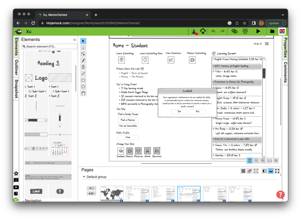

Here is an [example design](https://github.com/webprogramming260/startup-example/blob/main/README.md).

## ☑ Assignment

Update the README.md file for your start up GitHub repository that you created in the earlier instruction to include your elevator pitch. Include the pitch paragraph, key features, and images.

Make sure you push your changes to the file so that it can be reviewed.

Submit the URL for your GitHub start up repository to the Canvas assignment.

## Grading Rubric

- 10% - Notes in your start up Git repository README.md that include your elevator pitch and key features
- 45% - A concise, compelling, elevator pitch
- 45% - One or more rough sketches of your application


# The internet

📖 **Suggested reading**:

- [MDN How does the Internet work?](https://developer.mozilla.org/en-US/docs/Learn/Common_questions/How_does_the_Internet_work)
- [YouTube The Internet in 5 Minutes](https://youtu.be/7_LPdttKXPc)

The internet globally connects independent networks and computing devices using the TCP/IP model. Understanding the basics of how the internet works provides you with a mental model for effectively creating web applications. At the top of the TCP/IP protocol is the application layer. It represents user functionality, such as the web (HTTP), mail (SMTP), files (FTP), remote shell (SSH), and chat (IRC). Underneath that is the transport layer which breaks the application layer's information into small chunks and sends the data. The actual connection is made using the internet layer. This finds the device you want to talk to and keeps the connection alive. Finally, at the bottom of the model is the link layer which deals with the physical connections and hardware.

### [TCP/IP](https://en.wikipedia.org/wiki/Internet_protocol_suite) layers

| Layer       | Example         | Purpose                               |
| ----------- | --------------- | ------------------------------------- |
| Application | HTTP            | Functionality like web browsing       |
| Transport   | TCP             | Moving connection information packets |
| Internet    | IP              | Establishing connections              |
| Link        | Fiber, hardware | Physical connections                  |

## Connections

When one device what to talk to another it must have an IP address. For example, `128.187.16.184` is BYU's address. Usually, human users prefer a symbolic name over an IP address. The symbolic name is called a domain name. Domain names are converted to IP address by doing a lookup in the Domain Name System (DNS). You can look up the IP address for any domain name using the `dig` console utility.

```sh
➜  dig byu.edu

byu.edu.		5755	IN	A	128.187.16.184
```

With the IP address you connect to the device it represents by first asking for a connection route to the device. A connection route consists of many hops across the network until the destination is dynamically discovered and the connection established. With the connection the transport and application layers start exchanging data.

You can determine the hops in a connection using the `traceroute` console utility. In the following example, we trace the route between a home computer and BYU. In the result you see the first address `192.168.1.1`. This is the address of the network router the home computer is connected to. From there it goes through a couple devices that do not identify themselves and then hits the Google Fiber gateway. Google Fiber is the internet service provider, or ISP, for the requesting device. Then we jump through a few more unidentified devices before finally arriving at BYU (`128.187.16.184`).

**Traceroute**

```sh
➜  traceroute byu.edu

traceroute to byu.edu (128.187.16.184), 64 hops max, 52 byte packets
 1  192.168.1.1 (192.168.1.1)  10.942 ms  4.055 ms  4.694 ms
 2  * * *
 3  * * *
 4  192-119-18-212.mci.googlefiber.net (192.119.18.212)  5.369 ms  5.576 ms  6.456 ms
 5  216.21.171.197 (216.21.171.197)  6.283 ms  6.767 ms  5.532 ms
 6  * * *
 7  * * *
 8  * * *
 9  byu.com (128.187.16.184)  7.544 ms !X *  40.231 ms !X

```

If I run traceroute again I might see a slightly different route since every connection through the internet is dynamically calculated. The ability to discover a route makes the internet resilient when network devices fail or disappear from the network.


# Web servers

A web server is a computing device that is hosting a web service that knows how to accept incoming internet connections and speak the HTTP application protocol.

## Monolithic web servers

In the early days of web programming, you would buy a massive, complex, expensive, software program that spoke HTTP and installed on a hardware server. The package of server and software was considered the web server because the web service software was the only thing running on the server.

When Berners-Lee wrote his first web server it only served up static HTML files. This soon advanced so that they allowed dynamic functionality, including the ability to generate all the HTML on demand in response to a users interaction. That facilitated what we now know as modern web applications.

## Combining web and application services

Today, most modern programming languages include libraries that provide the ability to make connections and serve up HTTP. For example, here is a simple Go language program that is a fully functioning web service.

```go
package main

import (
	"net/http"
)

func main() {
	// Serve up files found in the public_html directory
	fs := http.FileServer(http.Dir("./public_html"))
	http.Handle("/", fs)

	// Listen for HTTP requests
	http.ListenAndServe(":3000", nil)
}
```

Being able to easily create web services makes it easy to completely drop the monolithic web server concept and just build web services right into your web application. With our simple `go` example we can add a function that responds with the current time, when the `/api/time` resource is requested.

```go
package main

import (
	"fmt"
	"io"
	"net/http"
	"time"
)

func getTime(w http.ResponseWriter, r *http.Request) {
	io.WriteString(w, time.Now().String())
}

func main() {
	// Serve up files found in the public_html directory
	fs := http.FileServer(http.Dir("./public_html"))
	http.Handle("/", fs)

	// Dynamically provide data
	http.HandleFunc("/api/time", getTime)

	// Listen for HTTP requests
	fmt.Println(http.ListenAndServe(":3000", nil))
}
```

We can run that web service code, and use the console application `Curl` to make an HTTP request and see the time response.

```sh
➜  curl localhost:3000/api/time

2022-12-03 09:50:37.391983 -0700
```

## Web service gateways

Since it is so easy to build web services it is common to find multiple web services running on the same computing device. The trick is exposing the multiple services in a way that a connection can be made to each of them. Every network device allows for separate network connections by referring to a unique port number. Each service on the device starts up on a different port. In the example above, the `go` web service was using port 80. So you could just have a user access each service by referring to the port it was launched on. However, this makes it difficult for the user of the services to remember what port matches to which service. To resolve this we introduce a service gateway, or sometimes called a reverse proxy, that is itself a simple web service that listens on the common HTTP port 443. The gateway then looks at the request and maps it to the other services running on a different ports.

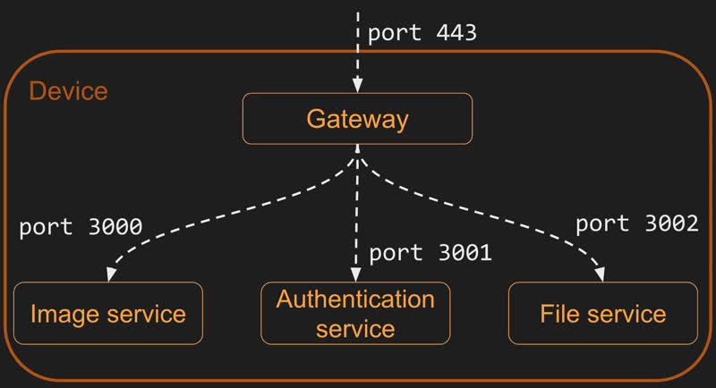

Our web server will use the application `Caddy` as the gateway to our services. The details of how Caddy works will be given later.

## Microservices

Web services that provide a single functional purpose are referred to as microservices. By partitioning functionality into small logical chucks, you can develop and manage them independently from other functionality in a larger system. They can also handle large fluctuations in user demand by simply running more and more stateless copies of the microservice from multiple virtual servers hosted in a dynamic cloud environment. For example, one microservice for generating your genealogical family tree might be able to handle 1,000 users concurrently. So in order to support 1 million users, you just deploy 1,000 instances of the service running on scalable virtual hardware.

## Serverless

The idea of microservices naturally evolved into the world of `serverless` functionality where the server is conceptually removed from the architecture and you just write a function that speaks HTTP. That function is loaded through an gateway that maps a web request to the function. The gateway automatically scales the hardware needed to host the serverless function based on demand. This reduces what the web application developer needs to think about down to a single independent function.


# Amazon Web Services - EC2

Now that you know all about web servers, it is time for you to rent your own. In theory you could contact your ISP and lease an IP address that you would then associate with your laptop. This would make your laptop into a web server, but this has the downside of requiring your laptop to always be available, have enough bandwidth to support your millions of fans, and creates a significant security risk for your laptop. Instead we want to use a cloud provider that can give you an inexpensive small computer that you can experiment with and throw away any time that you would like. This is actually exactly what many web companies do with their core business and so it should work fine for you.

We are going to use Amazon Web Services (AWS) for your work with in this course. There are lots of other great vendors out there, but AWS is by far the leader in the space and so it is good for you to get experience with them. This will require you to have an [account with AWS](https://aws.amazon.com/premiumsupport/knowledge-center/create-and-activate-aws-account/). When you create your account make sure you remember your account ID so that you can use it when you log in to the AWS browser console.

## What is this going to cost you?

There is no cost to create an account with AWS, you only pay for what you use, and in many cases they will give you a significant starting credit, and [some services are free](https://aws.amazon.com/free) for a short period of time or monthly usage. The services we are going to use include the following:

| Service        | Purpose                              | Estimated Cost (subject to change)                                                                                     |
| -------------- | ------------------------------------ | ---------------------------------------------------------------------------------------------------------------------- |
| EC2            | Server                               | t3.nano $0.0052 an hour ($3.50/month), t3.micro $0.0104 an hour ($7.00/month), t3.small $0.0208 an hour ($14.00/month) |
| EC2 Elastic IP | Keep your IP address between reboots | First one is free if you keep it associated with a running server. $0.0052 an hour otherwise.                          |
| Route 53       | Domain name                          | $3/year for `click` TLD. More for others                                                                               |
| Route 53       | DNS records                          | $0.50 a month for each root domain                                                                                     |
|                |                                      | Estimated total: `$15` - `$50` for the course. Much cheaper than a textbook.                                           |

As mentioned before, there are lots of ways to get free usage of services. For example, as of when this was written, you can get a 750 hours a month, for the first 12 months, of a Linux t3.micro server instance.

## AWS Credit Grants and AWS Educate Starter Account

AWS has a couple of programs to help students try out their services. If you don't want to supply a credit card you can enroll in a 3rd party administrated program called AWS Educate Starter Account. This program allows you to create an account that comes with a $75 credit and doesn't require a credit card. Alternatively, if you already have an AWS account or want to just get a regular account without the hassle of involving a 3rd party, you can apply for a $100 grant from AWS and apply it to your account.

Refer to [this article](https://it.newschool.edu/services/learning-resources/aws-amazon-web-services/claim-your-aws-educate-grant) for the details on these programs.

## Creating an AWS server instance

Once you have an AWS account it is time to create your web server.

âš  Note that the AWS interface changes all of the time and so the images given below may not match what you see. However, the concepts they represent should all be there in some shape or form.

1. Open the AWS console in your browser and log in.
1. Navigate to the EC2 service.
1. Select the option to `Launch instance`.
1. Give your instance a meaningful name. Perhaps use a convention such as [owner]-[purpose]-[version].

   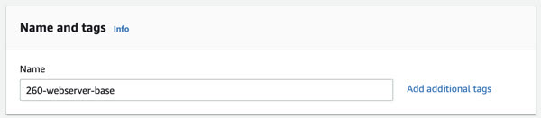

1. We have created an Amazon Machine Image (AMI) for you to use as the base for your server. It has Ubuntu, Node.js, Caddy Server, and PM2 built right in so that you do not have to install them. Paste this AMI ID (`ami-0809a0cb9b76bf010`) into the search box and press enter.

   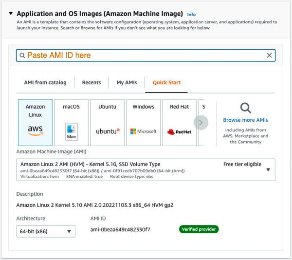

   This should display the information about the class AMI. If the AMI ID matches `ami-0809a0cb9b76bf010` select it.

   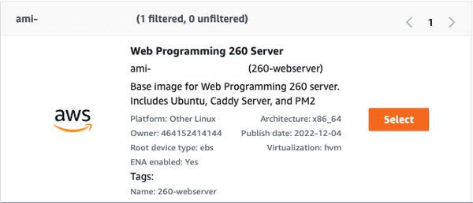

1. Select t3.nano or t3.micro for the instance type. You can always change this later if your server is running slow and needs more power.

   

1. Create a new key pair. Make sure you save the key pair to your development environment. This needs to be safe in a place that is not publicly accessible and that you won't accidentally delete or commit to a GitHub repository. You will need this every time you secure shell (ssh) into this server (production environment). Note that you don't have to create a new key pair every time you launch an instance. You can use one that you created previously so that all of the servers you create can be accessed with the same key file.

   

1. For the network settings, make sure the `auto-assign public IP` address is enabled. For the `Firewall (security group)` select the option to `Create security group` if this is the first server that you are creating. Allow SSH, HTTP, and HTTPS traffic from anywhere. If you have created a server before then you already have a security group that you can use and you should not clutter up your account with additional ones. In that case use the option to `Select existing security group` and select the name of the exiting security group.

   A security group represents the rules for allowing access to your servers. Security group rules specify both the port that is accessible on your server, and the source IP address that requests are allowed from. For example, you could allow only port 443 (the secure HTTPS port) from your development environment's IP address. However, doing so would mean that your web application would not be available from any other computer. You can learn more about security groups from the [AWS documentation](https://docs.aws.amazon.com/vpc/latest/userguide/VPC_SecurityGroups.html).

   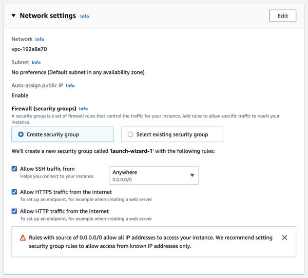

1. In the `Advanced details` change the `Credit specification` to `Unlimited`. This allows your `T class` (throttled class) server to keep using CPU even though it has exceeded its current credit limit. You do incur a minimal charge for when this happens, but the alternative is to always spend more for a larger instance, or to have your server lock up when it hits the limit. For the minimal use that your server will see, you should not normally exceed your limit, but it is nice to not have your server die if you do. Even if you do temporarily exceed the limit the charges will be mere pennies per hour.

   

1. Select the option to `Launch instance`.

It will take a couple minutes for the instance to start up, but once it is marked as `running` it is close to being ready. Look at the properties for the instance and copy the public IP address.

Open your browser and paste the public IP address for your server in the location bar along with the prefix `http://`. For example:

```sh
http://3.22.63.37
```

If the server has started up then you should see the following. Otherwise wait a little bit and refresh your browser again. If the server is marked as running and it has been longer than 5 minutes then there is a problem.

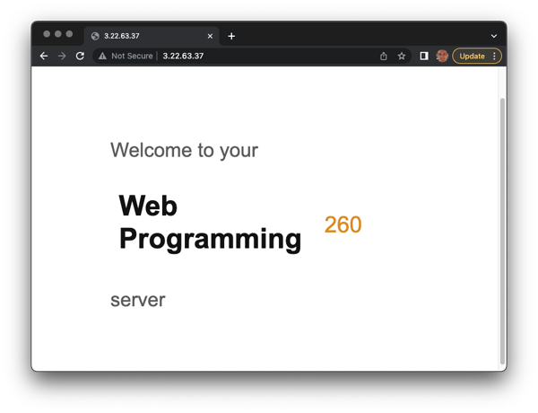

If that is what you see then congratulations. You are now running your very own web server that the whole world can see! Time to celebrate with cookies.

## SSH into your server

New let's remote shell into your server and see what is under the hood. Go to your console window and use SSH to shell into the server. You will need to supply the public IP address (copied from the EC2 instance details) and the location of your key pair file that you created/used when you launched your instance. Hopefully you saved that off to a safe location in your development environment, otherwise you will need to terminate your instance and create a new one, with a new key.

```sh
➜  ssh -i [key pair file] ubuntu@[ip address]
```

For example,

```sh
➜  ssh -i ~/keys/production.pem ubuntu@53.104.2.123
```

âš  You may get a warning that your key pair file permissions are too open. If so then you can restrict the permissions on your file so that they are not accessible to all uses by running the `chmod` console command:

```sh
 `chmod  600 [key pair file]`
```

âš  As it connects to the server it might will warn you that it hasn't seen this server before. You can confidently say yes since you are sure of the identity of this server.

Once it has connected you are now looking at a console window for the web server that you just launched and you should be in the ubuntu user's home directory. If you run `ls -l` you should see the following.

```sh
➜  ls -l

total 4
lrwxrwxrwx 1 ubuntu ubuntu   20 Nov 17 23:03 Caddyfile -> /etc/caddy/Caddyfile
lrwxrwxrwx 1 ubuntu ubuntu   16 Nov 17 03:42 public_html -> /usr/share/caddy
drwxrwxr-x 6 ubuntu ubuntu 4096 Nov 30 22:42 services
```

The `Caddyfile` is the configuration file for your web service gateway. The `public_html` directory contains all of the static files that your are serving up directly through Caddy when using it as a web service. We will cover Caddy configuration in a later instruction. The `services` directory is the place where you are going to install all of your web services once you build them.

Once you are done poking around on your server you can exit the remote shell by running the `exit` command. That is everything. You will only change a few configuration settings on your server in the future. Usually changes to the server are always done using an automated continuous integration process.

## Keeping the same public IP address

You can stop your server at any time. Don't confuse this with terminating your server which completely destroys it. Stopping your server just powers down the device. This is nice because you don't have to pay for it while it is stopped. However, every time you stop and start your server it we will be assigned a new public IP address. It is important to keep the same public IP address so that you, and others, can always browse to the same place, and more importantly so that when you create your domain name you can assign it to an address that never changes.

You have two choices in order to keep the same public IP address.

1. Never stop your server.
2. Assign an elastic IP address to your server so that it keeps the same address even if you stop it.

Your first elastic IP address is free. However, the catch is that it is only free while the server instance it is assigned to is running. While your server is not running you are charged $0.005/hr. This is the same cost for running a t3.nano server instance. So if you assign an elastic IP address, you don't save any money unless you running a more powerful instance, and are stopping your instance when you, or the TAs, don't need it.

We would suggest that you do both options. Keep your server running and associate an elastic IP. That way if you do need to reboot it for some reason, you will still keep the same IP address and it doesn't cost you anything more either way.

Here is how you [assign an elastic IP address](https://docs.aws.amazon.com/AWSEC2/latest/UserGuide/elastic-ip-addresses-eip.html0) to your server instance.

1. Open the AWS console in your browser and log in.
1. Navigate to the EC2 service.
1. From the menu on the left select `Network & Security|Elastic IPs`.
1. Press the `Allocate Elastic IP address` button.
1. Press the `Allocate` button.
1. Select the newly displayed allocated address and press the `Actions` button.
1. Select the `Associate Elastic IP address` option.

   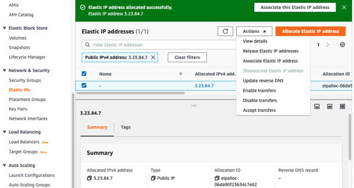

1. Click on the `Instance` box and select your server instance.
1. Press `Associate`.

Assigning an elastic IP address will change the IP address for your server, but it will not change again until you release the elastic IP address. You do terminate your server and create a new one you can again associate the same elastic IP address with your new server.

Note that your elastic IP address is allocated until your release it, not until you terminate your instance. So make sure you release it when you no longer need it. Otherwise you will get a nasty $3 bill every month.

## What size of server should you use?

The `t3.nano` instance size has just enough memory and CPU to meet the requirements of this course if you are careful. However, if you find that your server is running slowly or erratically, you should consider upgrading to a larger instance size. If you have an elastic IP address you can change your instance size whenever you would like and you won't loose your public IP address. You can even stop your server when no one is using it. This is useful because you don't get charged for your server when it is stopped.

## ☑ Assignment

1. Create your AWS account.
1. Create an EC2 instance using the class AMI (`ami-0809a0cb9b76bf010`).
1. Assign an elastic IP address (highly suggested).
1. Test that you can see the default class web page from a browser using the server's public IP address.

Submit a URL using your web server's public IP address, along with a comment about something you found interesting, to the Canvas assignment.

Don't forget to update your GitHub start up repository README.md with all of the things you learned and want to remember. This might include the IP address of your server and the command to remote shell into your server. Do not include the contents of your PEM file, passwords, or keys in your notes.


# Domain names

📖 **Suggested reading**: [MDN What is a Domain Name](https://developer.mozilla.org/en-US/docs/Learn/Common_questions/What_is_a_domain_name)

In the instruction about the internet we showed how an IP address can be referenced by a domain name. You can get the IP address for any domain using the `dig` console utility. Notice that in the following example there are actually multiple IP addresses associated with the domain name `amazon.com`. This allows for redundancy in case one of the IP addresses fails to successfully resolve to a valid connection because the server listening at that IP address is not responding.

```sh
➜  dig amazon.com

amazon.com.		126	IN	A	205.251.242.103
amazon.com.		126	IN	A	52.94.236.248
amazon.com.		126	IN	A	54.239.28.85
```

A domain name is simply a text string that follows a specific naming convention and is listed in a special database called the domain name registry.

Domain names are broken up into a root domain, with one or more possible subdomain prefixes. The root domain is represented by a secondary level domain and a top level domain. The top level domain (TLD) represent things like `com`, `edu`, or `click`. So a root domain would look something like `byu.edu`, `google.com`, or `cs260.click`. The [possible list of TLDs](https://www.icann.org/resources/pages/tlds-2012-02-25-en) is controlled by ICANN, one of the governing boards of the internet.

The owner of a root domain can create any number of subdomains off the root domain. Each subdomain may resolve to a different IP address. So the owner of `cs260.click` can have subdomains for travel (`travel.cs260.click`), finance (`finance.cs260.click`), or a blog (`blog.cs260.click`).

You can get information about a domain name from the domain name registry using the `whois` console utility.

```yaml
➜  whois byu.edu

Domain Name: BYU.EDU

Registrant:
	Brigham Young University
	3009 ITB
	2027 ITB
	Provo, UT 84602
	USA

Administrative Contact:
	Mark Longhurst
	Brigham Young University
	Office of Information Technology
	1208 ITB
	Provo, UT 84602
	USA
	+1.8014220488
	markl@byu.edu

Technical Contact:
	Brent Goodman
	Brigham Young University
	Office of Information Technology
	1203J ITB
	Provo, UT 84602
	USA
	+1.8014227782
	dnsmaster@byu.edu

Domain record activated:    19-Jan-1987
Domain record last updated: 11-Jul-2022
Domain expires:             31-Jul-2025
```

This provides information such as a technical contact to talk to if there is a problem with the domain, and an administrative contact to talk to if you want to buy the domain. Maybe we should talk to Mark and see if he is willing to sell.

## DNS

Once a domain name is in the registry it can be listed with a domain name system (DNS) server and associated with an IP address. Of course you must also lease the IP address before you can use it to uniquely identify a device on the internet, but that is a topic for another time. Every DNS server in the world references a few special DNS servers that are considered the `authoritative name servers` for associating a domain name with an IP address.

The DNS database records that facilitate the mapping of domain names to IP addresses come in several flavors. The main ones we are concerned with are the `address` (`A`) and the `canonical name` (`CNAME`) records. An `A` record is a straight mapping from domain name to IP address. A `CNAME` record maps one domain name to another domain name. This acts as a domain name alias. You would use a CNAME to do things like map `byu.com` to the same IP address as `byu.edu` so that either one could be used.

When you enter a domain name into a browser, the browser first checks to see if it has the name already in its cache of names. If it does not, it contacts a DNS server and gets the IP address. The DNS server also keeps a cache of names. If the domain name is not in the cache, it will request the name from an `authoritative name server`. If the authority does not know the name then you get an unknown domain name error. If the process does resolve, then the browser makes the HTTP connection to the associated IP address.

As you can see, there is a lot of levels of name caching. This is done for performance reasons, but it also can be frustrating when you are trying to update the information associated with your domain name. This is where the `time to live` (`TTL`) setting for a domain record comes into play. You can set this to be something short like 5 minutes or as long as several days. The different caching layers should then honor the TTL and clear their cache after the requested period has passed.

## Buying a domain name

You can pay to lease an unused domain name for a specific period of time. Before the lease expires, you have the right to extend the lease for an additional amount of time. The cost to buy the domain varies from something like $e to $200 a year. Buying, or sub-leasing, an existing domain name from a private party can be very expensive, and so you are better off buying something obscure like `idigfor.gold` (currently available for only $101). This is one reason why companies have such strange names these days.


# Amazon Web Services - Route 53

Referring to a web server by its IP address, is fine for development, but it is not going to work for most users. Additionally, you want to create a secure (HTTPS) connection to your application, and that is not possible with just an IP address. Instead you want to use a domain name to represent your web application. That way you can make it easy to remember and also secure. In order for you to do this you need to buy a domain name, and then create DNS records with a DNS (Domain Name System) server.

`Route 53` is the AWS service that handles everything DNS related. With Route 53 you can buy a domain name, host your domain on their DNS servers, and create DNS records.

âš  You should already have an account with AWS from your work to rent a EC2 server instance. If you haven't done that work then go and create your account and server following the previous instruction.

## Purchasing a domain name

AWS provides extensive documentation for all their services. You can find the documentation for [Registering a new domain](https://docs.aws.amazon.com/Route53/latest/DeveloperGuide/domain-register.html) on their website. However, you may find the simplified directions below easier to follow, but if you run into trouble, or have additional questions, refer to the official documentation. Remember that you are leasing a domain name for a year, and so make sure it is a name that you would like. Also note that AWS credits do not apply to purchase of domain names.

1. Open the AWS console in your browser and log in.
1. Navigate to the `Route 53` service.
1. Select the `Domains > Registered domains` option from the menu on the left.
1. Push the `Register Domain` option.
1. Select the TLD that you want. AWS currently offers the `.click` TLD for $3 and `.link` for $5.
1. Put your desired root domain into the search box and press the `Check` button to see if it is available. Common one or two word phrases are almost always taken. For example, `260.click` is taken, but `webprogramming260.click` is not. Keep searching until you find one you like.
1. Press `Add to cart`.

   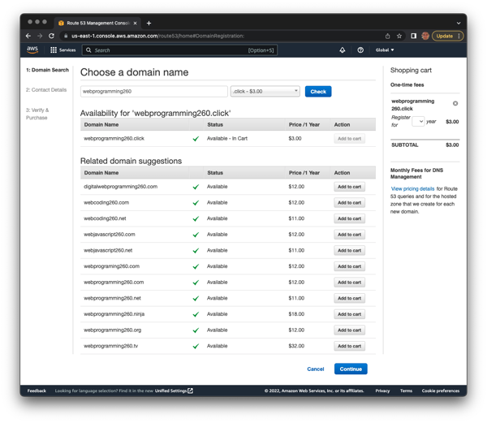

1. Fill out the contact details. This information is sent to the authorized DNS registrar and is what shows up to the world for your domain name. Once registration is complete you can see this information using the console program `whois`. Make sure you fill in this information correctly. If you are using new contact information that a registry has never seen before it will require you to verify the email address. Follow the steps to verify your address.
1. Press `Continue`.
1. Review everything and press `Complete Order`

It may take a while before your purchase is completed, but when it is the Route 53 service dashboard will show that you have a `hosted zone` for your domain name.

## Manage your DNS records

Now that you own a domain name you can use it to create DNS records that will map domain names to IP addresses (A records) or other domain names (CNAME records). For the purposes of this class, you want your root domain name, and any subdomain of your root domain, to map to the IP address of the web server you created previously.

You will need the public IP address for your server. You can get the public IP address by opening the AWS browser console and viewing the details of your server on the EC2 service page.

âš  Note that the AWS browser console interface changes all of the time and so the directions below may not match exactly, but similar functionality should be there in some shape or form.

1. Open the AWS console in your browser and log in.
1. Navigate to the `Route 53` service.
1. Select the `Hosted zones` option from the menu on the left.
1. You should see your domain name listed here. If it doesn't then the registration did not complete, or it is still pending. In that case go review the information found under `Domains > Pending requests`.
1. Click on your domain name to view the details. This should display existing DNS records with types such as `NS`, and `SOA`.
1. First we will create our root domain DNS record. This will associate your domain name with your server's IP address and make it so you can use your domain name in the browser to navigate to your server.
   1. Press the `Create record` button.
   1. In the Value box enter the public IP address of your server.
   1. Press `Create records`
   1. A new `A` type record should appear in your list of records that represents the root domain name and your server's public IP address.
1. Next we will create a DNS record that will map to your server for any subdomain of your root domain name. This is made possible because DNS allows you to specify wildcards for a DNS record.
   1. Press the `Create record` button.
   1. In the `Record name` box enter the text `*`. This wildcard represents that any subdomain, that is not explicitly defined by another DNS record, will match this record.
   1. In the `Value` box enter the public IP address of your server.
   1. Press `Create records`
   1. A new `A` type record should appear in your list of records that represents the wildcard subdomain name and your server's public IP address.

Your DNS records should look similar to the following when you are done.


By defining both a record for your root domain and a wildcard record for any subdomain of your root domain you can now navigate to your server with either your domain name or a subdomain. For example, if you purchased the domain name `myfunkychickens.click` you could reach your server by navigating your browser to `myfunkychickens.click`, `simon.myfunkychickens.click`, or `startup.myfunkychickens.click`.

Open your browser and paste your domain in the location bar along with the prefix `http://`. For example:

```sh
http://myfunkychickens.click
```

This should show your web server's default page just like it did when you used the IP address.

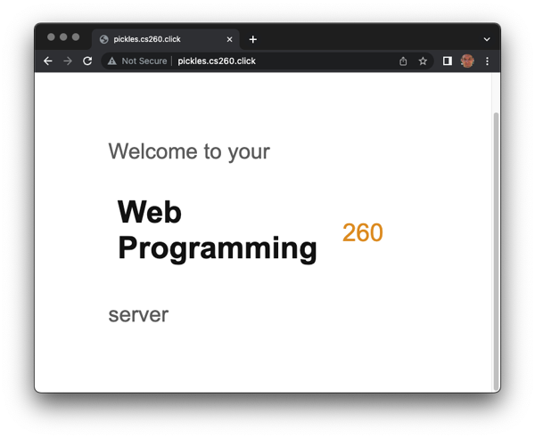

Note that your browser will warn you that the website is not secure. We will resolve that in future instruction when we configure Caddy to generate you a website certificate.

## Other record types

The additional `NS` and `SOA` type records that were listed for your domain name are important for working with DNS. These records were created automatically for you when you registered your domain name. The name server (`NS`) record contains the names of the authoritative name servers that authorize you to place DNS records in this DNS server. Those same authoritative name servers are listed with the registrar that you leased your domain name from. That way the authoritative name server can verify that the DNS records and the DNS registration match and are authorized to represent the domain name when defining DNS records. Otherwise a hacker could just add DNS records and take over your domain name.

The start of authority (`SOA`) record provides contact information about the owner of this domain name.

## ☑ Assignment

1. Open the AWS browser console and log in.
1. Use Route 53 to purchase a domain name.
1. Set up your DNS records using Route 53. Make sure you have a record representing your root domain name, and a wild card subdomain.
1. Test that you can access your server using your domain name and any subdomain name.

Submit a URL for web server's domain name, along with a comment about something you found interesting, to the Canvas assignment.

Don't forget to update your GitHub start up repository README.md with all of the things you learned and want to remember.


# Caddy


Caddy is a web service that listens for incoming HTTP requests. Caddy then either serves up the requested static files or routes the request to another web service. This ability to route requests is called a `gateway`, or `reverse proxy`, and allows you to expose multiple web services (i.e. your project services) as a single external web service (i.e. Caddy).

For this course, we use Caddy for the following reasons.

- Caddy handles all of the creation and rotation of web certificates. This allows us to easily support HTTPS.
- Caddy serves up all of your static HTML, CSS, and JavaScript files. All of your early application work will be hosted as static files.
- Caddy acts as a gateway for subdomain requests to your Simon and start up application services. For example, when a request is made to `simon.yourdomain` Caddy will proxy the request to the Simon application running with node.js as an internal web service.

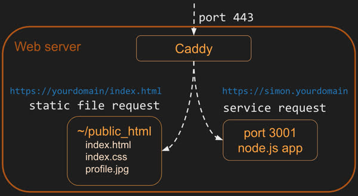

Caddy is preinstalled and configured on your server and so you do not need to do anything specifically with it other than configure your root domain name.

## Important Caddy files

As part of the installation of Caddy we created two links in the Ubuntu user's home directory that point to the key Caddy configuration files. There links were created in the home directory so that you do not have to hunt around your server looking for these files.

- **Configuration file**: `~/Caddyfile`

  Contains the definitions for routing HTTP requests that Caddy receives. This is used to determine the location where static HTML files are loaded from, and also to proxy requests into the services you will create later. Except for when you configure the domain name of your server, you should never have to modify this file manually. However, it is good to know how it works in case things go wrong. You can read about this in the [Caddy Server documentation](https://caddyserver.com/docs/caddyfile).

- **HTML files**: `~/public_html`

  This is the directory of files that Caddy servers up when requests are made to the root or your web server. This is configured in the Caddyfile discussed above. If you actually look at the Caddyfile you will see that the static file server is mapped to `/usr/share/caddy`. That is the location that the file link in the Ubuntu user's home directory, `~/public_html`, is pointing to.

  ```
  :80 {
        root * /usr/share/caddy
        file_server
  }
  ```

  Therefore, according to this configuration, whenever Caddy receives an HTTP request for any domain name on port 80 it will use the path of the request to find a corresponding file in this directory. For example, a request for `http://yourdomainname/index.html` will look for a file named `index.html` in the `public_html` directory.


# Caddy Install


Caddy is preinstalled and configured on your server and so you do not need to do anything specifically with it.

However, if you are interested here in the information about how it was installed and configured.

## Install

In order to install Caddy,

1. Use ssh to get a console window on your server
1. Install Caddy using the following commands.

   ```
   sudo apt update -y && apt upgrade -y

   sudo apt install -y debian-keyring debian-archive-keyring apt-transport-https

   sudo curl -1sLf 'https://dl.cloudsmith.io/public/caddy/stable/gpg.key' | sudo gpg --dearmor -o /usr/share/keyrings/caddy-stable-archive-keyring.gpg

   sudo curl -1sLf 'https://dl.cloudsmith.io/public/caddy/stable/debian.deb.txt' | sudo tee /etc/apt/sources.list.d/caddy-stable.list

   sudo apt update

   sudo apt install caddy
   ```

[Tutorial on installing Caddy](https://www.hostnextra.com/kb/how-to-install-caddy-on-ubuntu-20-04/)

## Important Caddy file locations

In your ssh console window to your server view the contents of the following locations so you can be familiar with how Caddy installed.

- **Caddy HTML files**: /usr/share/caddy
- **Caddy program**: /usr/bin/caddy
- **Caddy website configuration file**: /etc/caddy/`Caddyfile`

## Make it easy to know where your files are

We want to make it easy to get to the files we need to configure Caddy and so we are going to create some linux symbolic links in our user directory so that we can easily find them.

In your ssh console window to your server make sure you are in your home directory (`cd ~`) and then create a link to the `Caddyfile`.

```
ln -s /etc/caddy/Caddyfile Caddyfile
```

Give your user rights to the directory that Caddy uses to host HTML files and then create a link in your user directory for easy access.

```
sudo chown ubuntu /usr/share/caddy /usr/share/caddy/index.html

ln -s /usr/share/caddy public_html
```

## Modify the Caddyfile

The `Caddyfile` contains all of the information for controlling how Caddy hosts information.

We want to change the hostname in the `Caddyfile` so that Caddy will generate a certificate and handle HTTPS requests. You must have a DNS record pointing to your server before this change is made otherwise Caddy cannot verify that you own the server.

```
sudo vi ~/Caddyfile
```

Replace `:80` with your domain name.

```
:80 {
        root * /usr/share/caddy

        file_server
}
```

After saving the Caddy file restart Caddy

```
sudo service caddy restart
```


# HTTPS, TLS, and web certificates

To this point you have been accessing your web server using HTTP. If you notice your browser has been yelling at you that your connection is `âš  Not Secure` from the location bar.


During the first couple decades of the web, it was pretty common for websites to simply use HTTP (non-secure hypertext transport protocol) since it was difficult, non-performant, and expensive to secure the connection. Additionally, most websites just provided access to documents and so it didn't need to protect user's information. Usually, only websites that were doing commerce needed a secure connection. That all changed when computers got faster and the web moved from simple document servers (Web 1.0) to full on web applications (Web 2.0) that accepted information from users and displayed that information within the application. Without a secure connection anyone that had access to the network traffic, at any point, from the user's computer to the server handling the request could easily capture all the data sent in either direction. Remember when we used the console program `traceroute` to show you how many computers your connection goes through. You definitely do not want those computers to have access to your user's sensitive information.

## HTTPS and TLS

The secure version of HTTP is called Secure Hypertext Transport Protocol (`HTTPS`). This is basically HTTP with a negotiated secure connection that happens before any data is exchanged. Having a secure connection means that all the data is encrypted using the [TLS protocol](https://developer.mozilla.org/en-US/docs/Web/Security/Transport_Layer_Security). TLS is sometimes referred to by a now unsecure predecessor protocol named SSL. TLS works by negotiating a shared secret that is then used to encrypt data. You can see the actual negotiation that happens by using the console browser based application `curl`, along with the `-v` parameter to see the verbose output of the HTTPS exchange. The `> /dev/null` redirection throws away the actual HTTP response, since we only care about the negotiation, by redirecting the output to the null device.

```sh
➜  curl -v -s https://byu.edu > /dev/null

*   Trying 128.187.16.184:443...
* Connected to byu.edu (128.187.16.184) port 443 (#0)
* ALPN: offers h2
* ALPN: offers http/1.1
*  CAfile: /etc/ssl/cert.pem
*  CApath: none
* (304) (OUT), TLS handshake, Client hello (1):
} [312 bytes data]
* (304) (IN), TLS handshake, Server hello (2):
{ [122 bytes data]
* (304) (IN), TLS handshake, Unknown (8):
{ [25 bytes data]
* (304) (IN), TLS handshake, Certificate (11):
{ [3211 bytes data]
* (304) (IN), TLS handshake, CERT verify (15):
{ [520 bytes data]
* (304) (IN), TLS handshake, Finished (20):
{ [52 bytes data]
* (304) (OUT), TLS handshake, Finished (20):
} [52 bytes data]
* SSL connection using TLSv1.3 / AEAD-AES256-GCM-SHA384
* ALPN: server accepted http/1.1
* Server certificate:
*  subject: C=US; ST=Utah; L=Provo; O=Brigham Young University; CN=*.byu.edu
*  start date: Jan 24 00:00:00 2022 GMT
*  expire date: Jan 24 23:59:59 2023 GMT
*  subjectAltName: host "byu.edu" matched cert's "byu.edu"
*  issuer: C=US; O=DigiCert Inc; CN=DigiCert TLS RSA SHA256 2020 CA1
*  SSL certificate verify ok.
```

You can see that the negotiation is fairly complex as it involves multiple steps in the handshake. A core piece of the handshake is the exchange of a web certificate that identifies the domain name of the server creating the secure connection. The browser will compare the certificate domain name to the one represented in the URL and if they don't match, or the certificate is invalid or out of date, it will display a massive warning.

In the example above we asked for `byu.edu` and got a valid certificate for byu.edu and so everything looks great.

## Web certificates

Web certificates are generated by a trusted 3rd party using public/private key encryption. The certificate issuer is responsible for verifying that the certificate owner actually owns the domain name represented by the certificate. Once you have a certificate for your domain name, you can serve the certificate from your web server and then the browser can validate the certificate by using the public keys of the certificate issuer.

Until about 2014 it would cost you hundreds of dollars a year to get a web certificate, and you needed a certificate for every domain and subdomain that you owned. That would cost, even a small company, thousands of dollars a year because the certificates needed to be renewed in order to ensure that it still represented the owner of the domain name and to limit the impact of a stolen certificate.

That all changed when two Mozilla employees created a non-profit called `Let's Encrypt` with the goal of creating trusted web certificates for free. This effectively broke the monopoly that the trusted web certificate issuers had on the industry.

Now using a service like `Let's Encrypt`, and the IETF standard [ACME protocol](https://en.wikipedia.org/wiki/Automatic_Certificate_Management_Environment) that they pioneered, anyone who owns a domain name, can dynamically generate and renew a certificate for free. This incredible contribution of critical web technology has made the web safer, and more reliable, for everyone.

## Enabling HTTPS

Modern browsers now expect web servers to exclusively use HTTPS for all communication. In fact, the next version of HTTP (v3) only supports secure connections. For this reason, you should always support HTTPS for any web application that you build.

You can obtain, and renew, a web certificate by enabling the ACME protocol for your web server and communicating with Let's Encrypt to generate the needed certificates. This is not difficult to do and may languages such as Rust, Node.js, or Go support this functionality by simply including an additional library.

### Caddy

For our work we are using the web service Caddy to act as a gateway to our different services and to host our static web application files. Caddy has ACME support built into it by default, and so all you need to do is configure Caddy with the domain name for your web server. Here are the steps to take.

âš  Note that this is one of the few modification that you will manually make to your web server. Most other production changes are completed with automated continuous integration processes.

1. Open a console window.
1. Use the `ssh` console program to shell into your production environment server.

   ```sh
   ➜  ssh -i [key pair file] ubuntu@[yourdomainnamehere]
   ```

   for example,

   ```sh
   ➜  ssh -i ~/keys/production.pem ubuntu@myfunkychickens.click
   ```

1. Edit Caddy's configuration (`Caddyfile`) file found in the ubuntu user's home directory. Note that since this file is owned by the root user you need to use `sudo` to elevate your user to have the rights to change the file.

   ```sh
   ➜  cd ~
   ➜  sudo vi Caddyfile
   ```

1. Modify the Caddy rule for handling requests to port 80 (HTTP), to instead handle request for your domain name. By not specifying a port the rule will serve up files using port 443 (HTTPS), and any request to port 80 will automatically redirect the browser to port 443. Replace `:80` with your domain name (e.g. `myfunkychickens.click`).

1. Modify the Caddy rules that route the traffic for the two web applications that we will build. To do this replace the two places where `yourdomain` appears with your domain name (e.g. `myfunkychickens.click`).

1. Review the Caddyfile to make sure it looks right. If your domain name was `myfunkychickens.click` it would look like the following.

   ```sh
   myfunkychickens.click {
      root * /usr/share/caddy
      file_server
      header Cache-Control no-store
      header -etag
      header -server
      }


   startup.myfunkychickens.click {
      reverse_proxy * localhost:4000
      header Cache-Control no-store
      header -server
      header -etag
      header Access-Control-Allow-Origin *
   }

   simon.myfunkychickens.click {
      reverse_proxy * localhost:3000
      header Cache-Control no-store
      header -server
      header -etag
      header Access-Control-Allow-Origin *
   }
   ```

1. Save the file and exit VI (`:wq`)

1. Restart Caddy so that your changes take effect.

   ```sh
   sudo service caddy restart
   ```

If you open your browser and navigate to your domain name you will now see that the browser is displaying a lock icon, using HTTPS, and your certificate has been automatically requested by Caddy and issued by Let's Encrypt.


## ☑ Assignment

Secure your web server communication by configuring Caddy to request a certificate from Let's Encrypt for you domain name.

Submit a URL for web server's hostname, along with a comment about something you found interesting, to the Canvas assignment.

Don't forget to update your GitHub start up repository README.md with all of the things you learned and want to remember.


# Hypertext Markup Language


📖 **Suggested reading**:

- [MDN HTML](https://developer.mozilla.org/en-US/docs/Web/HTML)
- [W3C specification](https://html.spec.whatwg.org/multipage/) - This official specification is only for reference

HyperText Markup Language (HTML) provides the foundational content structure that all web applications build on. HTML was originally designed to be a publishing format for web documents, or pages. From that original definition web programmers have morphed the `web page` concept into a `web application` where a page now represents either a `single page application` (SPA) or a large group of hyperlinked pages that form a `multi-page application` (MPA). By itself HTML is amazing, but to create a full web application we will need other technologies to style (CSS) our pages and make them interactive (JavaScript). For now, we will focus on creating the content structure with HTML.

Here is an example of a simple HTML document.

```html
Hello world
```

The first thing you noticed is that this looks like a simple text document. That is because text is valid HTML. In order to provide structure to our text we need to introduce the concept of `elements` and their associated `tag` representation.

## Elements and tags

HTML `elements` are represented with enclosing `tags` that may enclose other elements or text. For example, the paragraph element, and its associated tag (`p`), designate that the text is a structural paragraph of text. When we talk about tags we are referring to a delimited textual name that we use to designate the start and end of an HTML element as it appears in an HTML document. Tags are delimited with the less than (`<`) and greater than (`>`) symbols. A closing tag will also have a backslash (`/`) before its name.

```html
<p>Hello world</p>
```

We can continue adding structure to the page with additional elements. Each of these elements may contain other elements that provide the structure of our web page. The `html` element represents the top level page structure. The `head` element contains metadata about the page and the page title. The `body` element represents the content structure. The `main` element represents the main content structure, as opposed to things like headers, footers, asides, and navigation content. These additional elements result in the following HTML page.

```html
<html>
  <head>
    <title>My First Page</title>
  </head>
  <body>
    <main>
      <p>Hello world</p>
    </main>
  </body>
</html>
```

However, when we `render` the HTML in a browser it would look exactly the same as our original simple text example. The reason for that is that HTML is almost completely about structure. The visual appearance of the web page won't really change until we start styling the page with CSS.


## Attributes

Every HTML element may have attributes. Attributes describe the specific details of the element. For example, the `id` attribute gives a unique ID to the element so that you can distinguish it from other elements. The `class` attribute is another common element attribute that designates the element as being classified into a named group of elements. Attributes are written inside the element tag with a name followed by an optional value. You can use either single quotes (`'`) or double quotes (`"`) to delimit attribute values.

```html
<p id="hello" class="greeting">Hello world</p>
```

## Hyperlinks

One of the core features that made the web so successful was the ability to create hyperlinks that take you from one page to another another with a simple click. A hyperlink in HTML is represented with an anchor (`a`) element that has an attribute containing the address of the hyperlink reference (`href`). A hyperlink to BYU's home page looks like this:

```html
<a href="https://byu.edu">Go to the Y</a>
```

## Complete example

HTML defines a header (`<!DOCTYPE html>`) that tells the browser the type and version of the document. You should always include this at the top of the HTML file. We can now add the header, some attributes, and more content to our document for a full example.

```html
<!DOCTYPE html>
<html lang="en">
  <body>
    <main>
      <h1>Hello world</h1>
      <p class="introduction">
        HTML welcomes you to the amazing world of
        <span class="topic">web programming</span>.
      </p>
      <p class="question">What will this mean to you?</p>
      <p class="assignment">Learn more <a href="instruction.html">here</a>.</p>
    </main>
  </body>
</html>
```


Notice that the rendered document has almost no styling. That is because the entire purpose of HTML is to provide content and structure. The layout of the content is left almost entirely up to Cascading Stylesheets (CSS). When styling was introduced with CSS, all of the HTML elements that defined style such as font, strike, and plaintext were deprecated.

## Common elements

Modern HTML contains over 100 different elements. Here is a short list of HTML elements that you will commonly see.

| element   | meaning                                                                |
| --------- | ---------------------------------------------------------------------- |
| `html`    | The page container                                                     |
| `head`    | Header information                                                     |
| `title`   | Title of the page                                                      |
| `meta`    | Metadata for the page such as character set or viewport settings       |
| `script`  | JavaScript reference. Either a external reference, or inline           |
| `include` | External content reference                                             |
| `body`    | The entire content body of the page                                    |
| `header`  | Header of the main content                                             |
| `footer`  | Footer of the main content                                             |
| `nav`     | Navigational inputs                                                    |
| `main`    | Main content of the page                                               |
| `section` | A section of the main content                                          |
| `aside`   | Aside content from the main content                                    |
| `div`     | A block division of content                                            |
| `span`    | An inline span of content                                              |
| `h<1-9>`  | Text heading. From h1, the highest level, down to h9, the lowest level |
| `p`       | A paragraph of text                                                    |
| `b`       | Bring attention                                                        |
| `table`   | Table                                                                  |
| `tr`      | Table row                                                              |
| `th`      | Table header                                                           |
| `td`      | Table data                                                             |
| `ol,ul`   | Ordered or unordered list                                              |
| `li`      | List item                                                              |
| `a`       | Anchor the text to a hyperlink                                         |
| `img`     | Graphical image reference                                              |
| `dialog`  | Interactive component such as a confirmation                           |
| `form`    | A collection of user input                                             |
| `input`   | User input field                                                       |
| `audio`   | Audio content                                                          |
| `video`   | Video content                                                          |
| `svg`     | Scalable vector graphic content                                        |
| `iframe`  | Inline frame of another HTML page                                      |

## Comments

You can include comments in your HTML files by starting the comment with `<!--` and ending it with `-->`. Any text withing a comment block will be completely ignored when the browser renders it.

```html
<!-- commented text -->
```

## Special characters

HTML uses several reserved characters for defining its file format. If you want to use those characters in your content then you need to escape them using the `entity` syntax. For example, to display a less than symbol (`<`) you would instead use the less than entity (`&lt;`). You can also use the entity syntax to represent any unicode character.

| Character | Entity        |
| --------- | ------------- |
| &amp;     | &amp;amp;     |
| <         | &amp;lt;      |
| >         | &amp;gt;      |
| "         | &quot;        |
| '         | &apos;        |
| &#128512; | &amp;#128512; |

## HTML Versions

Understanding when different HTML features were introduced helps you know what has been around for a long time and probably supported by all browsers, and what is new and may not work everywhere. HTML is pretty stable, but it is still good to check a website like [MDN](https://developer.mozilla.org/en-US/docs/Web/HTML/Element/p#browser_compatibility) or [canIUse](https://caniuse.com/mdn-html_elements_p) to make sure.

| Year | Version | Features                                  |
| ---- | ------- | ----------------------------------------- |
| 1990 | HTML1   | format tags                               |
| 1995 | HTML2   | tables, internationalization              |
| 1997 | HTML3   | MathML, CSS, frame tags                   |
| 1999 | HTML4   | external CSS                              |
| 2014 | HTML5   | email, password, media, and semantic tags |

## Rendering HTML

You can save any HTML file to your computer's disk and then open the file using your browser. You can also open the HTML file in VS Code and use the Live Server extension to display the HTML. Another way to easily play with HTML is to use a sandbox like [CodePen](https://codepen.io). However, when you use CodePen it is not necessary to supply the HTML DocType header or the root `html` element since CodePen already assumes you are providing HTML. Here is our example HTML document rendered in CodePen.


## ☑ Assignment

Create a fork of this [codePen](https://codepen.io/leesjensen/pen/abKYRqN) and experiment.

When you are done submit your CodePen URL, along with a comment about something you found interesting, to the Canvas assignment.

Don't forget to update your GitHub start up repository README.md with all of the things you learned and want to remember.


# HTML structure elements

The two major purposes of HTML is to provide structure and content to your web application. Some of the common HTML structural elements include `body`, `header`, `footer`, `main`, `section` `aside`, `p`, `table`, `ol/ul`, `div`, and `span`. We demonstrate the use of each element with the following HTML document. It starts with the top level content `body`. The body has three children, a `header`, `main`, and `footer`. Each of the body children then contains other structural content.

The `header` contains a `p`aragraph with a `span`, and a `nav`igation containing multiple `div`isions of sub-content.

The `main` contains multiple `section`s that contain either an unordered list (`ul`) or a `table`. Main also contains an `aside` for content that does not fit the content flow of the sections.

The `footer` has a content division with a single span.

```html
<body>
  <p>Body</p>
  <header>
    <p>Header - <span>Span</span></p>
    <nav>
      Navigation
      <div>Div</div>
      <div>Div</div>
    </nav>
  </header>

  <main>
    <section>
      <p>Section</p>
      <ul>
        <li>List</li>
        <li>List</li>
        <li>List</li>
      </ul>
    </section>
    <section>
      <p>Section</p>
      <table>
        <tr>
          <th>Table</th>
          <th>Table</th>
          <th>Table</th>
        </tr>
        <tr>
          <td>table</td>
          <td>table</td>
          <td>table</td>
        </tr>
      </table>
    </section>
    <aside>
      <p>Aside</p>
    </aside>
  </main>

  <footer>
    <div>Footer - <span>Span</span></div>
  </footer>
</body>
```

If we rendered this HTML, and added just a bit of styling, so we can see how they related to each other, we would see the following.

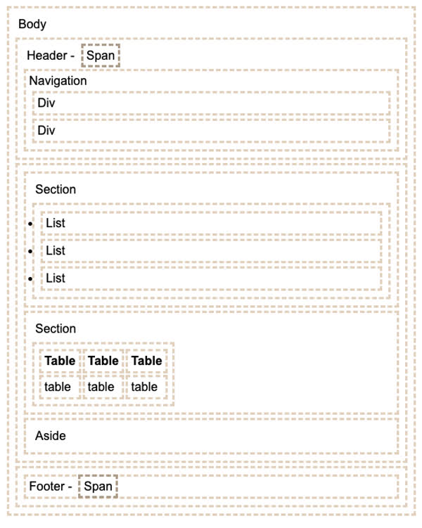

Properly representing the page structure using the elements is important not only so it makes logical sense to a programmer, but also so that automated tools like search indexing crawlers and accessibility screen readers can correctly interpret the document.

## Block and inline

There is a distinction between structure elements that are block vs inline. A block element is meant to be a distinct block in the flow of the content structure. An inline element is meant to be inline with the content flow of a block element. In other words, inline elements do not disrupt the flow of a block element's content. For example, the block element `div` (division) could have an inline element `b` in order to bring attention to a portion of its sub-text. Likewise a `p` (paragraph) element could have a `span` to mark the paragraph's sub-text as a person's name.

```html
<div>He said <b>don't</b> cross the beams.</div>

<p>
  Authors such as <span>ee cummings</span> often used unconventional structure.
</p>
```

## ☑ Assignment

Create a fork of this [CodePen](https://codepen.io/leesjensen/pen/GRGBqbw) and experiment.

When you are done submit your CodePen URL, along with a comment about something you found interesting, to the Canvas assignment.


# HTML input elements

📖 **Suggested reading**: [MDN Input element](https://developer.mozilla.org/en-US/docs/Web/HTML/Element/input)

From the very early days of HTML it contained elements for accepting the input of user data. These elements include the following:

| Element    | Meaning                          | Example                                        |
| ---------- | -------------------------------- | ---------------------------------------------- |
| `form`     | Input container and submission   | `<form action="form.html" method="post">`      |
| `fieldset` | Labeled input grouping           | `<fieldset> ... </fieldset>`                   |
| `input`    | Multiple types of user input     | `<input type="" />`                            |
| `select`   | Selection dropdown               | `<select><option>1</option></select>`          |
| `optgroup` | Grouped selection dropdown       | `<optgroup><option>1</option></optgroup>`      |
| `option`   | Selection option                 | `<option selected>option2</option>`            |
| `textarea` | Multiline text input             | `<textarea></textarea>`                        |
| `label`    | Individual input label           | `<label for="range">Range: </label>`           |
| `output`   | Output of input                  | `<output for="range">0</output>`               |
| `meter`    | Display value with a known range | `<meter min="0" max="100" value="50"></meter>` |

## Form element

The main purpose of the `form` element is to submit the values of the inputs it contains. Before JavaScript was introduced the `form` container element was essential because it was the only way for the browser to send the input data to a web server as part of a request to process the input and generate a new web page displaying the result of the input. With JavaScript we have much more control over input data and what is done with it. For example, in a single page application the JavaScript will dynamically rebuild the HTML elements to reflect the results of the user interaction. With this ability the data may not even be sent to the server. This greatly reduces the necessity of the `form` element, but it is often still used simply as a container. Just remember that you are not required to have a form element to use input elements.

Here is an example of a simple form that submits the value of a `textarea` element.

```html
<form action="submission.html" method="post">
  <label for="ta">TextArea: </label>
  <textarea id="ta" name="ta-id">
Some text
  </textarea>
  <button type="submit">Submit</button>
</form>
```

Pressing the submit button sends the following data to the web server. The browser generates the data by combining the textarea's `name` attribute with the current value of the textarea.

```
ta-id=Some+text
```

## Input element

The input element represents many different input types. You set the type of input with the `type` attribute. There are several different types to choose from. This includes different flavors of textual, numeric, date, and color inputs.

| Type           | Meaning                           |
| -------------- | --------------------------------- |
| text           | Single line textual value         |
| password       | Obscured password                 |
| email          | Email address                     |
| tel            | Telephone number                  |
| url            | URL address                       |
| number         | Numerical value                   |
| checkbox       | Inclusive selection               |
| radio          | Exclusive selection               |
| range          | Range limited number              |
| date           | Year, month, day                  |
| datetime-local | Date and time                     |
| month          | Year, month                       |
| week           | Week of year                      |
| color          | Color                             |
| file           | Local file                        |
| submit         | button to trigger form submission |

In order to create an input you specify the desired `type` attribute along with any other attribute associated with that specific input. Here is an example of a checked radio button and its associated label.

```html
<label for="checkbox1">Check me</label>
<input type="checkbox" name="varCheckbox" value="checkbox1" checked />
```

Most input elements share some common attributes. These include the following.

| Attribute | Meaning                                                                             |
| --------- | ----------------------------------------------------------------------------------- |
| name      | The name of the input. This is submitted as the name of the input if used in a form |
| disabled  | Disables the ability for the user to interact with the input                        |
| value     | The initial value of the input                                                      |
| required  | Signifies that a value is required in order to be valid                             |

The following shows what the inputs look like when rendered. Don't worry about how clunky they look right out of the box. We will fix that when we start styling things with CSS.


## Validating input

Several of the input elements have validation built into them. This means that they will not accept a value that is not for example, a number, a URL, outside of a range, or an email address. You can also specify the `required` attribute on an input element to mark it as requiring a value before it can be submitted. The `pattern` attribute exists on `text`, `search`, `url`, `tel`, `email`, and `password` inputs. When present, the pattern attribute provides a regular expression that must match for the input to be considered as valid.

You should also have validation built into your JavaScript that checks input data to ensures everything is valid before it is submitted. All of the input elements support functions for determining their validation state. Additionally, there are CSS style selectors for visualizing the validity of the input. In order to have a good user experience, it is critical that you provide sufficient user feedback early in the input process. A good design will give feedback as, or before, the user begins to input. A poor design will keep the user guessing as to why the data is not being accepted, or even if it was accepted.

## ☑ Assignment

This [CodePen](https://codepen.io/leesjensen/pen/dyVdNej) demonstrates all of the major input elements. Fork the pen and experiment.

When you are done submit your CodePen URL, along with a comment about something you found interesting, to the Canvas assignment.


# HTML media elements

The HTML elements that represent media include `img`, `audio`, `video`, `svg`, and `canvas`. The `img`, `audio`, and `video` elements are all simple references to an external file, but `svg` and `canvas` both contain the code for render a visual image that can even be animated.

## External media

The media tags that reference external media all take a URL as an attribute. The path represented by the URL can either be a relative path or full path. A full path includes the protocol, domain name, and path to the file.

```html
https://images.pexels.com/photos/164170/pexels-photo-164170.jpeg
```

A relative path references a file that is served from the same location as the HTML page rendering the element. You want to make the path is as relative as possible so that you can move your code around without having to actually adjust all of the external page references. For example, if your HTML page is located in a directory with a subdirectory named `images` that contains a file named `photo.jpg` you would use a relative path as follows.

```html
images/photo.jpg
```

### Image

To include an image in your content you use the `img` element and specify the `src` attribute with the URL to the source image.
In order to support accessibility, you should also include an `alt` attribute that describes the image. A full img element would look like the following.

```html

```


### Audio

To include an audio file in your content you use the `audio` element and specify the `src` attribute with the URL to the source image. You can include the `controls` attribute if you want the user to be able to control the audio playback. If you do not display the controls then there is no visual representation of the audio in the rendered page. The `autoplay` attribute starts the audio playing as soon as the audio file is loaded, and the `loop` attribute keeps it playing over and over.

âš  Note that automatically playing audio is strongly discouraged unless you provide a way for the user to opt-in to that behavior.

```html
<audio controls src="README/testAudio.mp3"></audio>
```


### Video

To include a video in your content you use the `video` element and specify the `src` attribute with the URL to the source video. Like the audio element you can include the `controls` or `autoplay` attributes

âš  Note that you may need to include the `crossorigin="anonymous"` attribute if you are requesting files from a different domain than the one serving your content.

```html
<video controls width="300" crossorigin="anonymous">
  <source
    src="https://commondatastorage.googleapis.com/gtv-videos-bucket/sample/BigBuckBunny.mp4"
  />
</video>
```


## Internal media

The internal media elements `svg` and `canvas` allow you to actually create images directly within your HTML.

### Scalable Vector Graphics (SVG)

SVG is an extremely powerful and widely supported way to render graphics inline in your HTML. An example SVG graphic that draws a black border and a red circle looks like this:

```html
<svg
  viewBox="0 0 300 200"
  xmlns="http://www.w3.org/2000/svg"
  stroke="red"
  fill="red"
  style="border: 1px solid #000000"
>
  <circle cx="150" cy="100" r="50" />
</svg>
```


When combined with JavaScript and CSS you can produce some amazing visualizations. Checkout this [CodePen](https://codepen.io/leesjensen/pen/mdKjMLY) for an example.

Consult the [MDN documentation](https://developer.mozilla.org/en-US/docs/Web/SVG) if you are interested in learning more about SVG.

### Canvas

The `canvas` element was introduced to HTML in order to facilitate 2D drawing and animation. The HTML for the canvas element is fairly simple, but actually drawing on the canvas requires JavaScript support. Here again, is our simple red dot example.

```html
<canvas
  id="canvasDemo"
  width="300"
  height="200"
  style="border: 1px solid #000000"
></canvas>
<script>
  const ctx = document.getElementById('canvasDemo').getContext('2d');
  ctx.beginPath();
  ctx.arc(150, 100, 50, 0, 2 * Math.PI);
  ctx.fillStyle = 'red';
  ctx.strokeStyle = 'red';
  ctx.fill();
  ctx.stroke();
</script>
```

If you would like to see some examples of complex canvas renderings check out these examples on CodePen.

- [Neon Hexagon](https://codepen.io/leesjensen/pen/QWxBMrE)
- [Particles](https://codepen.io/leesjensen/pen/vYraJRP)
- [Ribbons 2](https://codepen.io/leesjensen/pen/wvXxqja)

## ☑ Assignment

This [CodePen](https://codepen.io/leesjensen/pen/OJEwgBa) demonstrates the different media elements. Fork the pen and experiment.

When you are done submit your CodePen URL, along with a comment about something you found interesting, to the Canvas assignment.


# HTML website

Now that you know how HTML works it is time to put it to use and create your first website. When you are done you will have created the home page for all of the work that you do in this class. To get started take the following steps.

1. Verify that you server is still running and that the default web programming 260 page is being displayed. If it is not then you need to complete, or review, the steps for setting your server.

   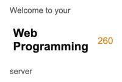

   âš  Do not continue until this works.

1. [Fork this repository](https://github.com/webprogramming260/website-html/fork) and clone it to your development environment. For information about how to fork a GitHub repository read [this documentation](https://docs.github.com/en/get-started/quickstart/fork-a-repo). For information about cloning a repository refer back to the instruction on GitHub.
1. The repository contains four important files, `index.html`, `index.css`, `profile.png` and `deployWebsite.sh`. `index.html` contains a template HTML document. `deployWebsite.sh` contains a console shell script for deploying a new home page to your website. `index.css` and `profile.png` are files that will be utilized by `index.html` to enhance the look of the home page with styling and an image. Open up your fork of the repository and review these files.
1. Modify `index.html` to personalize it to yourself. Don't worry about making it look pretty at this point. You are only trying to get the content and structure right. You can come back later and style it with CSS and make it interactive with JavaScript.
1. Give a brief profile description about yourself.
1. Include links to the CodePens for your assignments.
1. Replace the `profile.png` image with an image of yourself. Make sure the image is small (< 100 KB) so that you don't eat up your production server's limited hard drive space. If the file is not a PNG then make sure you change the file name and the `src` attribute in the `img` element.
1. Review the contents of `deployWebsite.sh` and make sure you understand what it is doing. The bulk of the script is just to read the parameters that are passed to it. The only thing it actually does is call `scp` (secure copy) to copy all files from the current directory to your server's `public_html` directory. The `public_html` directory is the location where Caddy (your web server) looks for static pages to host.
1. In a console window, change directory to your project directory, run the `deployWebsite.sh` script to push your changes to your deployment environment. This script takes two parameters, the PEM file to allow secure access to your server, and your server's domain name.

   ```sh
   ./deployWebsite.sh  -k <yourpemkey> -h <yourdomain>
   ```

   For example,

   ```sh
   ./deployWebsite.sh  -k ~/keys/production.pem -h funkychickens.click
   ```

   âš  Make sure you run the script in the project directory where the script resides.

1. Open a browser window and verify that your new home page is showing up for your domain. The following is an example of what your website might look like.

   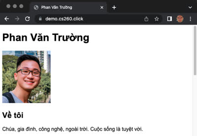

1. Submit the URL for your website to the Canvas assignment along with something you found interesting about this assignment.

Now, whenever you add a new project to your website you can just update the files contained in this repository and run the deployment script again. This way you can keep your website up to date with your progress through the instruction. If you do this throughout the class you will end up with a great portfolio that you can demonstrate to others.


# Simon HTML


This deliverable demonstrates the use of basic HTML elements for structure, basic formatting, input, output, links, and drawing.

Because we are not using any CSS for styling we are limited on how visually pleasing our application is. Do not worry about that. At this point we are simply trying to provide structure and content that we will later style and make interactive.

The application has a login (home), game play, high scores, and about page. Each page contains a header that provides navigation between the pages, and a footer that references the source repository.

You can view this application running here: [Example Simon HTML](https://simon-html.cs260.click)


## Study this code

Get familiar with what the example code teaches.

- Clone the repository to your development environment.

  ```sh
  git clone https://github.com/webprogramming260/simon-html.git
  ```

- Review the code and get comfortable with everything it represents.
- View the code in your browser by hosting it using the VS Code Live Server extension.
- Make modifications to the code as desired. Experiment and see what happens.

## Make your own version

Now it is time to start creating your own version of Simon. The main purpose of this work is to get familiar with building applications using the technology discussed in the course. With that knowledge you can then create something original in your start up project. It is not important for you to spend time exploring alternative designs and architectures for the Simon project, although you are welcome to do so if you would like. The only requirement is that you understand the concepts and reproduce as reasonable copy of Simon. You will do all of your work in a single GitHub repository named `simon`. With each technology you will add more code to your Simon repository. When you are done your Git history should show the entire evolution of your work on your Simon application.

- Create a new repository named `simon` in your GitHub account.
- Clone the repository to your development environment.
- In your `simon` directory create your own version of the application. Refer to the example class application repository for guidance. Remember that you do not create an originaloriginal work. Just focus on learning the concepts that the example project provides. However, you will learn more if you type everything out, and not just copy and paste the code.
- Set the footer link to point to your code repository. (e.g. https://github.com/youraccount/simon)
- Periodically commit and push your code to your repository as you hit different milestones. (4 commits are required for full credit.)
- Periodically deploy to your production environment using a copy of the `deployFiles.sh` script found in the [example class application](https://github.com/webprogramming260/simon-html/blob/main/deployFiles.sh). Take some time to understand how the script works. The script does three things. Deletes any previous deployment for simon, copies up all of the files found in the project directory, and makes sure Caddy is hosting the files under the `simon` subdomain of your domain (e.g. simon.yourdomain.click).

  ```sh
  ./deployFiles.sh -k <yourpemkey> -h <yourdomain> -s simon
  ```

  For example,

  ```sh
  ./deployFiles.sh -k ~/keys/production.pem -h yourdomain.click -s simon
  ```

  âš  Make sure you run `deployFiles.sh` from the console in your project directory.

- Update your `start up` repository README.md to record and reflect on what you learned.
- When you have completed your version. Do a final push of your code and deploy to your production environment using the `deployFiles.sh` script.
- Make sure your project is visible from your production environment (e.g. https://simon.yourdomain.click).
- Submit the URL to your production environment for grading using the Canvas assignment page.

## Grading Rubric

- 40% - Multiple HTML pages connected with hyperlinks
- 40% - Proper use of HTML structural elements, header elements, and doctype
- 10% - At least four Git commits for the project (Initial, milestone, ..., milestone, final)
- 10% - Notes in your `start up` repository README.md about what you have learned


# Cascading Style Sheets


📖 **Suggested reading**: [MDN CSS](https://developer.mozilla.org/en-US/docs/Web/CSS)

Cascading Style Sheets (CSS) converts the structure and content of HTML into a vibrant, responsive, experience. The initial objective of CSS was to simply style the HTML based upon the desires of the user, developer, and browser. In modern web applications CSS styling focuses more on helping the developer create complex renderings of dynamic content that is responsive to the actions of the user and the device the application is render on. With CSS a web programmer can animate the page, deploy custom fonts, respond to user actions, and dynamically alter the entire layout of the page based on the size of a device and its orientation.

Functionally, CSS is primarily concerned with defining `rulesets`, or simply a `rules`. A rule is comprised of a `selector` that selects the elements to apply the rule to, and one or more `declarations` that represent the `property` to style with the given `property value`.

For example, consider the following rule.

```css
p {
  font-family: sans-serif;
  font-size: 2em;
  color: navy;
  text-shadow: 3px 3px 1px #cccccc;
}
```

The selector `p` selects all paragraph elements in the HTML document. The four specified declarations then: 1) change the font to use a san-serif font, 2) increase the font size to be twice as big as the default font, 3) change the text color to be navy, and 4) create a gray shadow for the text. The result looks like this.


## Associating CSS with HTML

There are three ways that you can associate CSS with HTML. The first way is to use the `style` attribute of an HTML element and explicitly assign one or more declarations.

```html
<p style="color:green">CSS</p>
```

The next way to associate CSS is to use the HTML `style` element to define CSS rules within the HTML document. The `style` element should appear in the `head` element of the document so that the rules apply to all elements of the document.

```html
<head>
  <style>
    p {
      color: green;
    }
  </style>
</head>
<body>
  <p>CSS</p>
</body>
```

The final way to associate CSS is to use the HTML `link` element to create a hyperlink reference to an external file containing CSS rules. The `link` element must appear in the `head` element of the document.

```html
<link rel="stylesheet" href="styles.css" />
```

**styles.css**

```css
p {
  color: green;
}
```

All of the above examples are equivalent, but using the `link` element usually is the preferred way to define CSS.

## Cascading styles

Because elements inherit the rules applied to their parents you often end up with the same declaration property applied to a single element multiple times. For example, we might set color property for all `body` elements to be red, and then `paragraph` elements to be green, and then `span` elements to be blue, and finally use a style element on a specific `span` to be black.

```html
<body>
  <p><span style="color:black">CSS</span></p>
</body>
```

```css
body {
  color: red;
}
p {
  color: green;
}
span {
  color: blue;
}
```

In this case, the rules cascade down from the highest nodes in the DOM tree to the lowest level. Any declaration property defined at a lower level will override the higher declaration. You can see this happening if you use the browser's debugger. In Chrome right click on the element and select `inspect`. You can then click on each element in the debugger and see what the value of the color property is. For the case defined above you will see that each of the higher level declarations is crossed out until you get to the style explicitly defined on the element.


## The box model

CSS defines everything as boxes. When you apply styles, you are applying them to a region of the display that is a rectangular box. Within an element's box there are several internal boxes. The innermost box holds the element's content. This is where things like the text or image of an element is displayed. Next comes the padding. The padding will inherit things like the background color. After padding is the border, which has properties like color, thickness and line style. The final box is the margin. The margin is considered external to the actual styling of the box and therefore only represents whitespace. It is important to understand each of these boxes so that you can achieve the desired visual result by applying the proper CSS declaration.

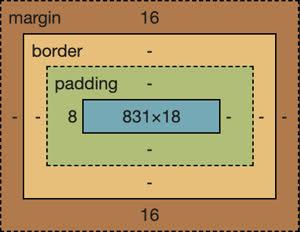

By default, the width and height of an element is defined by the width and height of the content box. You can change the `box-sizing` CSS property from the default value of `content-box` to `border-box` in order to redefine the width and height to also include the padding and the border. This often makes it easier to style elements when their visual size matches their actual size.

## CSS Versions

As with HTML, CSS has evolved significantly over the years. The following version table gives you an idea of when certain features were added and therefore how stable the support for them are.

| Year      | Version | Features                                                                                   |
| --------- | ------- | ------------------------------------------------------------------------------------------ |
| 1996      | CSS1    | selectors, font, color, background, alignment, margin, border, padding                     |
| 1998      | CSS2    | positioning, z-index, bidirectional text, shadows                                          |
| 2011      | CSS2.1  | removed incompatible features                                                              |
| 1999-2021 | CSS3    | enhancements for media, box, background, borders, color, template, multi-column, selectors |

Beginning with CSS3 the specification was divided into modules so that they could be implemented at different levels of maturity. Whether these modules will culminate in a CSS4 specification has not yet been decided.


# CSS Selectors

📖 **Suggested reading**: [MDN CSS selectors](https://developer.mozilla.org/en-US/docs/Web/CSS/CSS_Selectors)

The first step in understanding CSS is mastering how to select the elements that a CSS rule applies to. The CSS rule selector can take many forms. In order to explain the most common selectors we need some demonstration HTML. Let's image a simple document describing the departments in a university. In our case we have a physics and a chemistry department. The information provided is very sparse, but the structure provided by the HTML is enough to work with.

```html
<body>
  <h1>Departments</h1>
  <p>welcome message</p>
  <section id="physics">
    <h2>Physics</h2>
    <p class="introduction">Introduction</p>
    <p>Text</p>
    <p class="summary">Summary</p>
  </section>
  <section id="chemistry">
    <h2>Chemistry</h2>
    <p class="introduction">Introduction</p>
    <p>Text</p>
    <p class="summary">Summary</p>
  </section>
</body>
```

By default every browser defines a base set of styles that it applies to all HTML. This varies slightly from browser to browser, but for the most part our document would render like this using the base browser styles.

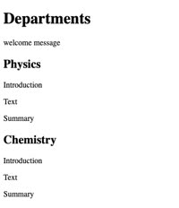

We would like to style our document so that it looks like this when we are done.


## Element type selector

To start things off, we want to make all elements in the document use a sans-serif font. We can do this by using an element name selector. By selecting the `body` element we will cascade our declaration down to all the children of the body, which is the whole document.

```css
body {
  font-family: sans-serif;
}
```

Note that we could also use the wildcard element name selector (`*`) to select all elements, but for our needs the `body` element will work just fine.

We can also use element name selectors to give a bottom border to the top level heading (`h1`), as well as modify the section elements to pop out with a gray background and some white space in the padding and margins.

```css
h1 {
  border-bottom: thin black solid;
}

section {
  background: #eeeeee;
  padding: 0.25em;
  margin-bottom: 0.5em;
}
```

## Combinators

Next we want to change the color of the second level headings (`h2`), but we only want to do that within the sections for each department. To make that happen we can provide a `descendant combinator` that is defined with a space delimited list of values where each item in the list is a descendant of the previous item. So our selector would be all `h2` elements that are descendants of `section` elements.

```css
section h2 {
  color: #004400;
}
```

There are other types of combinators that you can use. These include the following.

| Combinator       | Meaning                    | Example        | Description                                |
| ---------------- | -------------------------- | -------------- | ------------------------------------------ |
| Descendant       | A list of descendants      | `body section` | Any section that is a descendant of a body |
| Child            | A list of direct children  | `section > p`  | Any p that is a direct child of a section  |
| General sibling  | A list of siblings         | `p ~ div`      | Any p that has a div sibling               |
| Adjacent sibling | A list of adjacent sibling | `p + div`      | Any p that has an adjacent div sibling     |

We can use the general sibling combinator to increase the whitespace padding on the left of paragraphs that are siblings of a level two heading.

```css
h2 ~ p {
  padding-left: 0.5em;
}
```

## Class selector

The next selector we will use is the class selector. Remember that any element can have zero or more classification applied to it. For example, our document has a class of `introduction` applied to the first paragraph, and a class of `summary` applied to the final paragraph of each section. If we want to bold the summary paragraphs we would supply the class name summary prefixed with a period (`.summary`).

```css
.summary {
  font-weight: bold;
}
```

You can also combine the element name and class selectors to select all paragraphs with a class of summary.

```css
p.summary {
  font-weight: bold;
}
```

## ID selector

ID selectors reference the ID of an element. All IDs should be unique within an HTML document and so this select targets a specific element. To use the ID selector you prefix the ID with the hash symbol (`#`). We would like to showcase our physics department by putting a thin purple border along the left side of the physics section.

```css
#physics {
  border-left: solid 1em purple;
}
```

## Attribute selector

Attribute selectors allow you to select elements based upon their attributes. You use an attribute selector to select any element with a given attribute (`a[href]`). You can also specify a required value for an attribute (`a[href="./fish.png"]`) in order for the selector to match. Attribute selectors also support wildcards such as the ability to select attribute values containing specific text (`p[href*="https://"]).

```css
p[class='summary'] {
  color: red;
}
```

For a full description of attribute selections refer to [MDN](https://developer.mozilla.org/en-US/docs/Web/CSS/Attribute_selectors).

## Pseudo selector

CSS also defines a significant list of pseudo selectors which select based on positional relationships, mouse interactions, hyperlink visitation states, and attributes. We will give just one example. Suppose we what our purple highlight bar to appear only when the mouse hovers over the text. To accomplish this we can change our ID selector to select whenever a section is hovered over.

```css
section:hover {
  border-left: solid 1em purple;
}
```

You can find out more about pseudo selectors on [MDN](https://developer.mozilla.org/en-US/docs/Web/CSS/Pseudo-classes).

## Example source

The example HTML and CSS for this instruction is available on [CodePen](https://codepen.io/leesjensen/pen/NWzByav). You are encouraged to fork and experiment with it.


# CSS Declarations

📖 **Suggested reading**: [MDN reference section on properties](https://developer.mozilla.org/en-US/docs/Web/CSS/Reference)

CSS rule declarations specify a property and value to assign when the rule selector matches one or more elements. There are legions of possible properties defined for modifying the style of an HTML document. For our purposes we will discuss just a few of the more commonly used ones so that you can get a feel for wide variety of functionality they represent.

| Property           | Value                              | Example             | Discussion                                                                     |
| ------------------ | ---------------------------------- | ------------------- | ------------------------------------------------------------------------------ |
| background-color   | color                              | `red`               | Fill the background color                                                      |
| border             | color width style                  | `#fad solid medium` | Sets the border using shorthand where any or all of the values may be provided |
| border-radius      | unit                               | `50%`               | The size of the border radius                                                  |
| box-shadow         | x-offset y-offset blu-radius color | `2px 2px 2px gray`  | Creates a shadow                                                               |
| columns            | number                             | `3`                 | Number of textual columns                                                      |
| column-rule        | color width style                  | `solid thin black`  | Sets the border used between columns using border shorthand                    |
| color              | color                              | `rgb(128, 0, 0)`    | Sets the text color                                                            |
| cursor             | type                               | `grab`              | Sets the cursor to display when hovering over the element                      |
| display            | type                               | `none`              | Defines how to display the element and its children                            |
| filter             | filter-function                    | `grayscale(30%)`    | Applies a visual filter                                                        |
| float              | direction                          | `right`             | Places the element to the left or right in the flow                            |
| flex               |                                    |                     | Flex layout. Used for responsive design                                        |
| font               | family size style                  | `Arial 1.2em bold`  | Defines the text font using shorthand                                          |
| grid               |                                    |                     | Grid layout. Used for responsive design                                        |
| height             | unit                               | `.25em`             | Sets the height of the box                                                     |
| margin             | unit                               | `5px 5px 0 0`       | Sets the margin spacing                                                        |
| max-[width/height] | unit                               | `20%`               | Restricts the width or height to no more than the unit                         |
| min-[width/height] | unit                               | `10vh`              | Restricts the width or height to no less than the unit                         |
| opacity            | number                             | `.9`                | Sets how opaque the element is                                                 |
| overflow           | [visible/hidden/scroll/auto]       | `scroll`            | Defines what happens when the content does not fix in its box                  |
| position           | [static/relative/absolute/sticky]  | `absolute`          | Defines how the element is positioned in the document                          |
| padding            | unit                               | `1em 2em`           | Sets the padding spacing                                                       |
| left               | unit                               | `10rem`             | The horizontal value of a positioned element                                   |
| text-align         | [start/end/center/justify]         | `end`               | Defines how the text is aligned in the element                                 |
| top                | unit                               | `50px`              | The vertical value of a positioned element                                     |
| transform          | transform-function                 | `rotate(0.5turn)`   | Applies a transformation to the element                                        |
| width              | unit                               | `25vmin`            | Sets the width of the box                                                      |
| z-index            | number                             | `100`               | Controls the positioning of the element on the z axis                          |

This [CodePen](https://codepen.io/leesjensen/pen/rNKrgKQ) demonstrates the use of many of the above declarations.

## Units

📖 **Suggested reading**: [MDN Values and units](https://developer.mozilla.org/en-US/docs/Learn/CSS/Building_blocks/Values_and_units)

You can use a variety of units when defining the size of a CSS property. For example, a the width of an element can be defined using absolute units such as the number of pixels (`px`) or inches (`in`). You can also use relative units such as a percentage of the parent element (`50%`), a percentage of a minimum viewport dimension (`25vmin`), or a multiplier of the size of the letter m (`1.5rem`) as defined by the root element.

```css
p {
  width: 25%;
  height: 30vh;
}
```

Here is a list of the most commonly used units. All of the units are prefixed with a number when used as a property value.

| Unit | Description                                                      |
| ---- | ---------------------------------------------------------------- |
| px   | The number of pixels                                             |
| pt   | The number of points (1/72 of an inch)                           |
| in   | The number of inches                                             |
| cm   | The number of centimeters                                        |
| %    | A percentage of the parent element                               |
| em   | A multiplier of the width of the letter `m` in the parent's font |
| rem  | A multiplier of the width of the letter `m` in the root's font   |
| ex   | A multiplier of the height of the element's font                 |
| vw   | A percentage of the viewport's width                             |
| vh   | A percentage of the viewport's height                            |
| vmin | A percentage of the viewport's smaller dimension                 |
| vmax | A percentage of the viewport's larger dimension                  |

## Color

📖 **Suggested reading**: [MDN Applying color](https://developer.mozilla.org/en-US/docs/Web/CSS/CSS_Colors/Applying_color)

CSS defines multiple ways to describe color, ranging from representations familiar to programmers and ones familiar to layout designers and artists.

| Method       | Example                   | Description                                                                                                                                                                                                       |
| ------------ | ------------------------- | ----------------------------------------------------------------------------------------------------------------------------------------------------------------------------------------------------------------- |
| keyword      | `red`                     | A set of predefined colors (e.g. white, cornflowerblue, darkslateblue)                                                                                                                                            |
| RGB hex      | `#00FFAA22` or `#0FA2`    | Red, green, and blue as a hexadecimal number, with an optional alpha opacity                                                                                                                                      |
| RGB function | `rbg(50%, 255, 128, 0.5)` | Red, green, and blue as a percentage or number between 0 and 255, with an optional alpha opacity percentage                                                                                                       |
| HSL          | `hsl(180, 30%, 90%, 0.5)` | Hue, saturation, and light, with an optional opacity percentage. Hue is the position on the 365 degree color wheel (red is 0 and 255). Saturation is how gray the color is, and light is how bright the color is. |


# CSS Fonts

📖 **Suggested reading**: [MDN Web fonts](https://developer.mozilla.org/en-US/docs/Learn/CSS/Styling_text/Web_fonts)

Choosing appropriate fonts is a key web application design characteristic. A beautiful modern font will make your application enjoyable to use. Picking a hard to read font, an overused font, or using too many fonts will turn users away.

The CSS `font-family` property defines what fonts should be used. The property value represents an ordered list of fonts. The first font in the list that is available will be used. This ability to select from a list of fonts is important because different operating systems have different default fonts and your first choice may not be available.

## Font families

There are four major families of fonts: `Serif`, `san-serif`, `fixed`, and `symbol`. A serif is a small stroke attached to the ends of a character's major strokes. Serif fonts have the extra strokes, san-serif fonts do not. Fixed fonts characters all are the same size. This is useful for lining up text when doing things like coding or display tabular data. Symbol fonts represent non-language characters such as arrows or emojis.

## Importing fonts

In addition to referencing standard fonts found on the user's computer you can specify a font that you provide with your application. That way your application is guaranteed to always look the same. In order to have the browser load a font you use the `@font-face` rule and provide the font name and source location.

```css
@font-face {
  font-family: 'Quicksand';
  src: url('https://cs260.click/fonts/quicksand.woff2');
}

p {
  font-family: Quicksand;
}
```

If you do not want to host font files on your server, then you can load them from a font provider. For example, Google provides a large selection of [open source fonts](https://fonts.google.com/) that you can use without paying any royalties. The easiest way to use Google fonts is to use a CSS import statement to reference the Google Font Service. This will automatically generate the CSS for importing the font.

```css
@import url('https://fonts.googleapis.com/css2?family=Rubik Microbe&display=swap');

p {
  font-family: 'Rubik Microbe';
}
```

This [CodePen](https://codepen.io/leesjensen/pen/zYaLgVW) provides an example of importing fonts.


# CSS Animation

📖 **Suggested reading**: [MDN Animation](https://developer.mozilla.org/en-US/docs/Web/CSS/CSS_Animations/Using_CSS_animations)

Using CSS to animate your components is an easy way to make your application feel alive and interactive. You create CSS animations using the `animation` properties and defining `keyframes` for what the element should look like a different times in the animation. Let's walk through an example.

We have a paragraph of centered text and we want it to zoom in until its size is 20% of the view height.

```css
p {
  text-align: center;
  font-size: 20vh;
}
```

To make this happen we specify that we are animating the selected elements by adding the `animation-name` property with a value of demo. This name refers to the name of the `keyframes` that we will specify in a minute. The keyframes tell what CSS properites should be applied at different key points in the animation sequence. We also add an `animation-duration` property in order to specify that the animation should last for three seconds.

```css
p {
  text-align: center;
  font-size: 20vh;

  animation-name: demo;
  animation-duration: 3s;
}
```

Now we are ready to create the keyframes. We don't have to define what happens at every millisecond of the animation. Instead we only need to define the key points and CSS will generate a smooth transition to move from one keyframe to another. In our case we simply want to start with text that is invisible and have it zoom into the full final size. We can do this with two frames that are designated with the keywords `from` and `to`.

```css
@keyframes demo {
  from {
    font-size: 0vh;
  }

  to {
    font-size: 20vh;
  }
}
```

That's every thing we need to do. However, let's made one more addition. It would look better if towards the end, the paragraph bounce out a little bigger than its final size. We can accommodate that by adding another key frame that happens 95 percent through the animation.

```css
@keyframes demo {
  from {
    font-size: 0vh;
  }

  95% {
    font-size: 21vh;
  }

  to {
    font-size: 20vh;
  }
}
```


You can see this animation working with this [CodePen](https://codepen.io/leesjensen/pen/LYrJEwX).

Animation is not just for pushing buttons or making text float around. Here is an example of [animating a watch](https://codepen.io/leesjensen/pen/MWBjXNq) using only HTML and CSS.


CodePen has a lot of CSS animation examples that you can experiment with. Here is a simple one with [floating clouds](https://codepen.io/leesjensen/pen/wvXEaRq) that I found interesting. If you find an interesting one share it with us on Discord.


# CSS Practice

Now that you know how to create CSS rules using selectors to apply declarations to HTML elements, it's time to experiment and see what you can come up with. Create a CodePen that uses multiple CSS rules to style an HTML page. Include some sort of simple animation.

If you are looking for inspiration then here is one of my [favorite animations](https://codepen.io/leesjensen/pen/gOXZwEZ), this [animated burger menu](https://codepen.io/leesjensen/pen/bGKxVEv) is pretty incredible, and here is a [home page](https://codepen.io/leesjensen/pen/jOKvbrv) that is pure HTML and CSS. Don't feel like you need to build anything this complex but try and take things a little beyond your current abilities.

## ☑ Assignment

When you are done upload the URL of your CodePen with a description of what you found interesting to the Canvas assignment.

Don't forget to update your GitHub start up repository README.md with all of the things you learned and want to remember.


# Responsive design

📖 **Suggested reading**: [MDN Responsive design](https://developer.mozilla.org/en-US/docs/Learn/CSS/CSS_layout/Responsive_Design)

Modern web applications are expected to run well on a large variety of computing devices. This includes everything from desktops, to mobile phones, to shopping kiosks, to car dashboards. This ability to reconfigure the interface so the application accommodates and takes advantage of the screen's size and orientation is called `responsive design`.

Much of HTML and CSS is already fluid due to the fact that it responds to the browser window being resized. For example a paragraph element will resize when the browser window is resized. However, the following features can completely change the layout of the application based on the device's size and orientation.

## Viewport meta tag

When smart mobile devices started gaining popularity they began to be used to view websites. However, the websites were optimized for desktop displays and not little tiny mobile screens. To solve this mobile browsers automatically started scaling the website so that it looked better on a small screen. Unfortunately, as web applications started being responsive to the screen size, the mobile browser's scaling got in the way. The solution is to include a meta tag in the `head` element of all your HTML pages. This tells the browser to not scale the page.

```html
<meta name="viewport" content="width=device-width,initial-scale=1" />
```

## Media queries

One of the main CSS features for creating responsive applications is the `@media` selector. This selector dynamically detects the size and orientation of the device and applies CSS rules to represent the structure of the HTML in a way that accommodates the change.

We can use the `@media` selector to tell us which side of the screen (technically the viewport) is the longest. A media query takes one or more predicates separated by boolean operators. In our case we simply want to know if the screen is oriented in portrait mode (short side on top) or not. If it is then we transform all of our div elements by rotating them 270 degrees.

```css
@media (orientation: portrait) {
  div {
    transform: rotate(270deg);
  }
}
```

We can demonstrate the result of applying the media selector by using the browser's debugger and switching into phone and responsive mode. You can also use this [CodePen](https://codepen.io/leesjensen/pen/rNKZOva) and play with it yourself by simply resizing the browser's window.

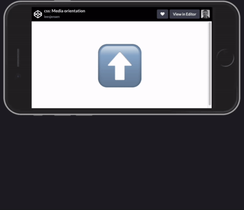

You can also use media queries to make entire pieces of your application disappear, or move to a different location. For example, if we had an aside that was helpful when the screen is wide, but took up too much room when the screen got narrow, we could use the following media query to make it disappear.

```css
@media (orientation: portrait) {
  aside {
    display: none;
  }
}
```

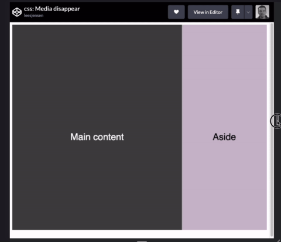

Here is the [CodePen](https://codepen.io/leesjensen/pen/NWzLGmJ) for this example.

## Grid and Flexbox

The final two responsive technologies that we want to discuss are Grid and Flexbox. These are both CSS display modes that automatically respond to screen sizes to position and resize their child elements. We will discuss each of these in detail in the following instruction.


# CSS Grid

**Recommend reading**: [MDN Grid](https://developer.mozilla.org/en-US/docs/Web/CSS/CSS_Grid_Layout/Basic_Concepts_of_Grid_Layout)

The `grid` display layout is useful when you want to display a group of child elements in a responsive grid. We start with a container element that has a bunch of child elements.

```html
<div class="container">
  <div class="card"></div>
  <div class="card"></div>
  <div class="card"></div>
  <div class="card"></div>
  <div class="card"></div>
  <div class="card"></div>
  <div class="card"></div>
  <div class="card"></div>
  <div class="card"></div>
</div>
```

We turn this into a responsive grid by including a CSS `display` property with the value of `grid` on the container element. This tells the browser that all of the children of this element are to be displayed in a grid flow. The next property, `grid-template-columns`, specifies that the layout of the grid columns. In this example we say that we want to repeatedly define each column to auto-fill the parent element's width with children that are resized to a minimum of 300 pixels and a maximum of one equal fractional unit (`1fr`) of the grid width. A fractional unit is dynamically computed by splitting up the parent element's width into equal parts for each of the children.

We finish off the grid configuration by saying that we want all rows to be exactly 300 pixels high with the `grid-auto-rows` property and the use the `grid-gap` property to say that we want at least a 1 em gap between our grid items.

```css
.container {
  display: grid;
  grid-template-columns: repeat(auto-fill, minmax(300px, 1fr));
  grid-auto-rows: 300px;
  grid-gap: 1em;
}
```

Here is what the finished product looks like.


You can experiment with the source on [CodePen](https://codepen.io/leesjensen/pen/GRGXoWP).


# CSS Flexbox

**Recommend reading**: [MDN Flexbox](https://developer.mozilla.org/en-US/docs/Web/CSS/CSS_Flexible_Box_Layout/Basic_Concepts_of_Flexbox)

The `flex` display layout is useful when you want to partition your application into areas that responsively move around as the window resizes or the orientation changes. In order to demonstrate the power of flex we will build an application that has a header, footer, and a main content area that is split into two sections, with controls of the left and content on the right.

So we can visualize our design by quickly sketching it out.

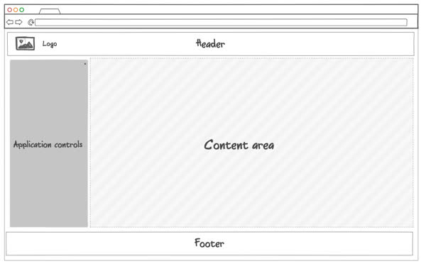

Next we build our structural HTML to match our design.

```html
<body>
  <header>
    <h1>CSS flex &amp; media query</h1>
  </header>
  <main>
    <section>
      <h2>Controls</h2>
    </section>
    <section>
      <h2>Content</h2>
    </section>
  </main>
  <footer>
    <h2>Footer</h2>
  </footer>
</body>
```

Now we can use Flexbox to make it all come alive. We make the body element into a responsive flexbox by including the CSS `display` property with the value of `flex`. This tells the browser that all of the children of this element are to be displayed in a flex flow. We want our top level flexbox children to be column oriented and so we add the `flex-direction` property with a value of `column`. We then add some simple other declarations to zero out the margin and fill the entire viewport with our application frame.

```css
body {
  display: flex;
  flex-direction: column;
  margin: 0;
  height: 100vh;
}
```

To get the division of space for the flexbox children correct we add the following flex properties to each of the children.

- **header** - `flex: 0 80px` - Zero means it will not grow and 80px means it has a starting basis height of 80 pixels. This creates a fixed size box.
- **footer** - `flex: 0 30px` - Like the header it will not grow and has a height of 30 pixels.
- **main** - `flex: 1` - One means it will get one fractional unit of growth, and since it is the only child with a non-zero growth value, it will get all the remaining space. Main also gets some additional properties because with want it to also be a flexbox container for the controls and content area. So we set its display to be `flex` and specify the `flex-direction` to be row so that the children are oriented side by side.

```css
header {
  flex: 0 80px;
  background: hsl(223, 57%, 38%);
}

footer {
  flex: 0 30px;
  background: hsl(180, 10%, 10%);
}

main {
  flex: 1;
  display: flex;
  flex-direction: row;
}
```

Now we just need to add CSS to the control and content areas represented by the two child section elements. We want the controls to have 25% of the space and the content to have the remaining. So we set the `flex` property value to 1 and 3 respectively. That means that the controls get one unit of space and the content gets three units of space. No matter how we resize things this ratio will responsively remain.

```css
section:nth-child(1) {
  flex: 1;
  background-color: hsl(180, 10%, 80%);
}
section:nth-child(2) {
  flex: 3;
  background-color: white;
}
```

## Media Query

That completes our original design, but we also want to handle small screen sizes. To do this, we add some media queries that drop the header and footer if the viewport gets too short, and orients the main sections as rows if it gets too narrow.

To support the narrow screen (portrait mode), we include a media query that detects when we are in portrait orientation and sets the `flex-direction` of the main element to be column instead of row. This causes the children to be stacked on top of each other instead of side by side.

To handle making our header and footer disappear when the screen is to short to display them, we use a media query that triggers when our viewport height has a maximum value of 700 pixels. When that is true we change the `display` property for both the header and the footer to `none` so that they will be hidden. When that happens the main element becomes the only child and since it has a flex value of 1, it takes over everything.

```css
@media (orientation: portrait) {
  main {
    flex-direction: column;
  }
}

@media (max-height: 700px) {
  header {
    display: none;
  }
  footer {
    display: none;
  }
}
```

Here is what the finished application looks like.

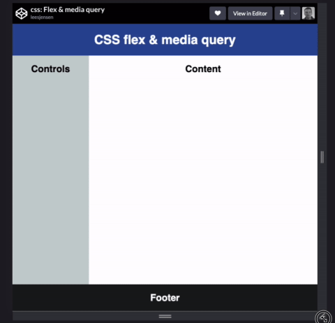

You can experiment with this on [CodePen](https://codepen.io/leesjensen/pen/MWOVYpZ).

## ☑ Assignment

Now it is your turn to build a fully responsive application. You can use Grid and/or Flexbox along with media queries to build something that stretches you. After you are done experimenting with the above example, take some time to sketch out your design. Once you are done coding, submit your CodePen URL, along with a comment about something you found interesting, to the Canvas assignment.

Don't forget to update your GitHub start up repository README.md with all of the things you learned and want to remember.


# Debugging CSS

📖 **Suggested reading**: [MDN Debugging CSS](https://developer.mozilla.org/en-US/docs/Learn/CSS/Building_blocks/Debugging_CSS)

CSS is extremely powerful, but sometimes is can be very frustrating to figure out why your page is not rendering the way that you expect. To help you understand why things are rendering the way that are you can use the browser's developer tool to inspect the CSS properties and visualize the HTML layout. Using the Google Chrome debugger you can access the developer tools by right click on the HTML page element that you want to debug and select the `inspect` option. We will demonstrate this by creating a directory that contains HTML (`index.html`) with a paragraph of text, and a CSS file (`index.css`) that uses flex to center the text in the CSS.

```html
<!DOCTYPE html>
<html lang="en">
  <head>
    <meta name="viewport" content="width=device-width, initial-scale=1.0" />
    <link rel="stylesheet" type="text/css" href="index.css" />
  </head>
  <body>
    <p>Center text in centered element</p>
  </body>
</html>
```

```css
* {
  border: thick solid blue;
  box-sizing: border-box;
  padding: 0.2em;
  margin: 0;
  font-size: 24px;
  font-family: Arial;
}

html {
  height: 100%;
}

body {
  display: flex;
  align-items: center;
  justify-content: center;
  height: 100%;
  overflow: hidden;
}

p {
  width: 50%;
  height: 50%;
  display: flex;
  align-items: center;
  text-align: center;
}
```

Open the directory with VS Code and use the Live Server extension to view the HTML in the Chrome browser. In the browser, right click on the text and select `inspect`. This will open the debugger window and display the `Elements` tab. As you move your cursor over the the different elements you will visually see what the padding, borders, and margins are set to. The `Styles` pane shows all of the CSS properties applied to the currently selected element. If you scroll down the the bottom of the styles pane you will see the CSS box. By moving the cursor over the different parts of the CSS box it will highlight the different box parts in the browser window.


You can change any of the CSS properties, and even add new properties, directly in the debugger. This allows you to see what each property is contributing and change them to see how that impacts the rendering. This is a great way to figure out what CSS works best without having to continually change the CSS file and refresh the browser.

This example has a small problem. Each element has with a blue border and some padding. But the body element does not render any padding at the bottom. Inspecting the body element and looking at the CSS box reveals that the default margin for the elements is pushing the body element down so that the padding overflows into its parent element. We can fix this by setting the margin for elements to be zero.


Experiment with debugging and altering the CSS. Note that you can open up any website and use the debugger to see how they implemented their design and even do temporary alterations to the CSS properties to see how that impacts the display. Debugging other people's code is a great way to learn how to improve your CSS skills.


# CSS Frameworks

CSS frameworks provide functions and components that commonly appear in web applications. As web developers built more and more web applications they began to use the same patterns over and over. They combined these patterns into a shared package of code and contributed it to the world as open source repositories. This helped not only decrease the time to develop an application, but created a common user experience for the web in general.

Today, there are lots of different open source CSS frameworks available to choose from. Many of them contain the same types of functionality, but they all bring something a little different to the table.

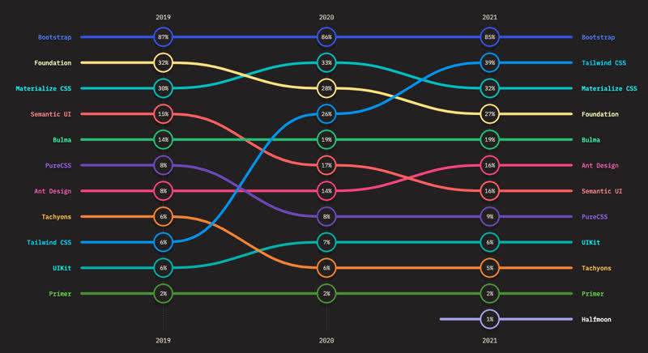

\- **Source**: [_StateOfCSS CSS framework poll_](https://2021.stateofcss.com/en-US/technologies/css-frameworks)

## Tailwind

A new rising contender in the CSS framework space is [Tailwind CSS](https://tailwindcss.com/) and its associated component library [Tailwind UI](https://tailwindui.com/). In the last StateOfCSS poll, Tailwind gained an impressive 40% general usage ranking, all within the last three years. Tailwind takes a different approach than traditional CSS frameworks. Instead of using large, rich, CSS rulesets to compartmentalize styling and functionality, it uses smaller definitions that are applied specifically to individual HTML elements. This moves much of the CSS representation out of the CSS file and directly into the HTML.

```html
<div class="pt-6 md:p-8 text-center md:text-left space-y-4">
  
  <p class="text-lg font-medium">“Tailwind CSSâ€</p>
</div>
```

## Bootstrap

📖 **Required reading**: [Getting started with Bootstrap](https://getbootstrap.com/docs/5.2/getting-started/introduction/)

The reigning champion for CSS frameworks is [Bootstrap](https://getbootstrap.com/). Bootstrap has been supported by an active and vibrant community for over a decade and contains many lessons learned from real world applications. The major downside of Bootstrap is its own success. Because it is so popular, Bootstrap defines the de facto look and feel of websites. This is great for user experience continuity, but it makes it difficult for a website to grab the attention of new users.

### Getting bootstrap

You can integrate Bootstrap into your web applications simply by referencing the Bootstrap CSS files from their [content delivery network](https://getbootstrap.com/docs/5.2/getting-started/introduction/#cdn-links) (CDN). You then add the HTML link elements to your head element like this.

```html
<!DOCTYPE html>
<html lang="en">
  <head>
    <meta name="viewport" content="width=device-width, initial-scale=1" />
    <link
      href="https://cdn.jsdelivr.net/npm/bootstrap@5.2.3/dist/css/bootstrap.min.css"
      rel="stylesheet"
      integrity="sha384-rbsA2VBKQhggwzxH7pPCaAqO46MgnOM80zW1RWuH61DGLwZJEdK2Kadq2F9CUG65"
      crossorigin="anonymous"
    />
  </head>
  <body>
    ...
  </body>
</html>
```

If you are going to use Bootstrap components that require JavaScript (carousel, buttons, and more), you will also need to include Bootstrap's JavaScript module. You add this by putting the following at the end of your HTML body element.

```html
<body>
  ...

  <script
    src="https://cdn.jsdelivr.net/npm/bootstrap@5.2.3/dist/js/bootstrap.bundle.min.js"
    integrity="sha384-kenU1KFdBIe4zVF0s0G1M5b4hcpxyD9F7jL+jjXkk+Q2h455rYXK/7HAuoJl+0I4"
    crossorigin="anonymous"
  ></script>
</body>
```

Later on, when we introduce the idea of bundling your application, you will want to use the Node Package Manager (NPM) to download Bootstrap and include it in your source code so that you don't have to rely on someone else's server to provide you with a vital piece of your application. To include Bootstrap in your application using NPM you would run the following from your console.

```sh
npm install bootstrap@5.2.3
```

âš  Note that those links are version specific (version 5 in this case). You will want to get the latest version links when you begin building your application.

### Using bootstrap

Once you have Bootstrap linked in your HTML files you can begin using the components it provides. Let's start with a simple button. When we use the Bootstrap `btn` CSS class, the button gets a nice looking rounded appearance. The Bootstrap `btn-primary` CSS class shades the button with the current primary color for the application, which by default is blue. The following demonstrates the difference between a Bootstrap style button and a plain vanilla button. Functionally they both work exactly the same. The Bootstrap button is just a lot easier on the eyes.

```html
<button type="button" class="btn btn-primary">Bootstrap</button>
<button type="button">Plain</button>
```


This [CodePen](https://codepen.io/leesjensen/pen/JjZavjW) demonstrates the use of all the major Bootstrap components. Notice the rich diversity of functionality it provides and that it is fully responsive to changes in the viewport size. The image below only captures a few of the components.

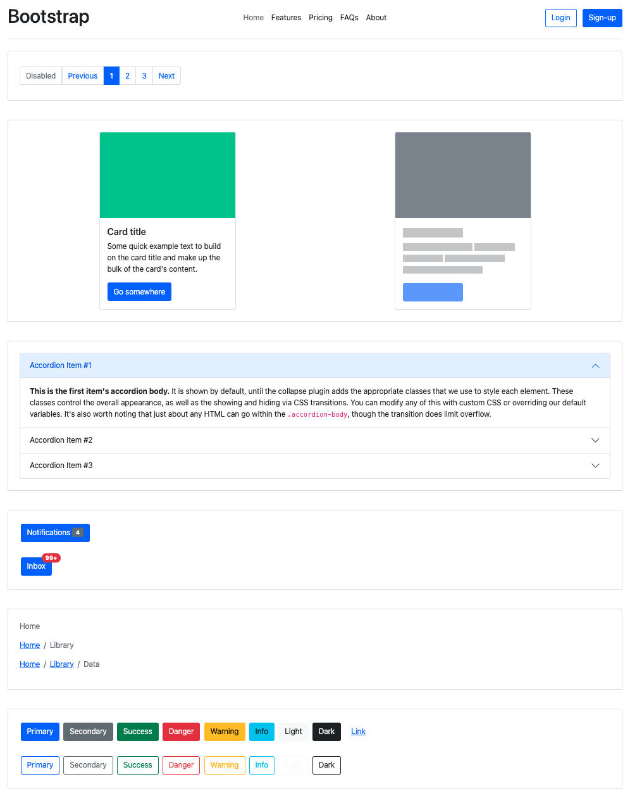

## ☑ Assignment

Now that you have experience with Bootstrap you can build a simple home page using Bootstrap components. Fork this [CodePen](https://codepen.io/leesjensen/pen/wvXEmVQ) and experiment with it. Remove the components it demonstrates and replace it with some other Bootstrap components. When you are done upload the URL of your CodePen with a description of what you found interesting to the Canvas assignment.


# Simon CSS


This application deliverable demonstrates the use of basic CSS for styling and a responsive design.

The addition of CSS makes our application visually appealing and adds intuitive user interface elements, but it is still not functional due to the lack of interactivity. We will add that in the next deliverable when we introduce JavaScript.

This deliverable adds a single CSS file (`main.css`) that contains the CSS for the entire application. Each of the HTML files references the CSS file using the `link` element.

```html
<link rel="stylesheet" href="main.css" />
```

As the application gets more complicated we will break up the CSS into individual files that correspond to the component they style.

You can view this application running here: [Example Simon CSS](https://simon-css.cs260.click)


## Study this code

Get familiar with what the example code teaches.

- Clone the repository to your development environment.

  ```sh
  git clone https://github.com/webprogramming260/simon-css.git
  ```

- Review the code and get comfortable with everything it represents.
- View the code in your browser by hosting it using the VS Code Live Server extension.
- Make modifications to the code as desired. Experiment and see what happens.

## Make your own version

- Using VS Code, open the `simon` directory for the repository you used for the last Simon assignment.
- Modify the project to use CSS and the Bootstrap CSS framework. Refer to the example class application repository for guidance. Remember that you do not need to create an original work. Just focus on learning the concepts that the example project provides. However, you will learn more if you type everything out, and not just copy and paste the code.
- Set the footer link to point to your code repository. (e.g. https://github.com/youraccount/simon)
- Periodically commit and push your code to your repository as you hit different milestones. (4 commits are required for full credit.)
- Periodically deploy to your production environment using a copy of the `deployFiles.sh` script found in the [example class application](https://github.com/webprogramming260/simon-css/blob/main/deployFiles.sh). Take some time to understand how it works. This is the same script that you used for the Simon HTML version.

  ```sh
  ./deployFiles.sh -k <yourpemkey> -h <yourdomain> -s simon
  ```

  For example,

  ```sh
  ./deployFiles.sh -k ~/keys/production.pem -h yourdomain.click -s simon
  ```

- Update your `start up` repository README.md to record and reflect on what you learned.
- When you have completed your version. Do a final push of your code and deploy to your production environment using the `deployFiles.sh` script.
- Make sure your project is visible from your production environment (e.g. https://simon.yourdomain.click).
- Submit the URL to your production environment for grading using the Canvas assignment page.

## Grading Rubric

- 40% - Extensive use of CSS selectors and declarations
- 30% - Visually appealing interface
- 10% - Use of the CSS framework Bootstrap
- 10% - At least four Git commits for the project (Initial, milestone, ..., milestone, final)
- 10% - Notes in your `start up` repository README.md about what you have learned


# UX design

Properly considering the user experience (UX) of your application will make all the difference in your success. Focusing first on technology, cost, or revenue tends to lead to an unsatisfying user experience. Instead you want to consider why someone is using your application, how they want to interact, how visually appealing it is, and how easy it is to get something done.

## Design as a story

It is often useful to think of user experience as a story. Consider the background plot, the user entering the stage, interacting with other actors, and getting the audience to applaud. At first this may sound a bit strange, but applications are not used in a vacuum. There is always a reason someone is using your application. If you can clearly define that background plot, then the experience will better match the user's expectation. Likewise, if you know what results in a satisfied audience, then you build the application experience around delivering that result.

Consider the tourism application for the city of Philadelphia. They know a user visits the site because they want to have an experience in Philadelphia. The application immediately provides a time relevant proposal for that experience. All the navigation options for having a successful experience (events, food, deals, and trip planning) are immediately accessible. Just looking at the initial imagery conveys the excitement of engaging in the application.


> Source: [visitphilly](https://www.visitphilly.com/)

## Simplicity

Google broke all the rules for web application design when they released their homepage in 1998.

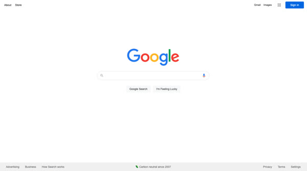

> Source: Google.com 2022

Previous to that, it was common for app designers to pile everything they could into the initial view of the application. This includes multiple advertisements, navigation options, lots of hyperlinks, and color choices. Here is an example from a competitor around the same time period.


> Source: Lycos.com 1999

The key point of this example, is that simplicity attracts user's attention and engages them in the application experience. Building off of Google's positive reaction, other major applications immediately followed their example. Here is the initial experience when visiting facebook's application for the first time. Notice that it simply states the purpose of the application and invites the user to create an account.


> Source: facebook.com

Simplicity doesn't requires a blank page. Simplicity can also be visually stimulating with beautiful imagery and simple navigation options.


> Source: [Nomadic Tribe](https://nomadictribe.com/)

You can also include significant amounts of content. You just need to keep things focused on a single purpose. For example, creating an account, viewing images, or beginning your travel experience. Below is the Pinterest application landing page. Even though the viewport is cluttered with images, they are all working towards the same purpose of demonstrating the value of the application.


## Consistency

There is a tension that exists with web applications between being consistent with how other applications work and being unique so that your experience stands out. What you want to avoid is being so different that a user has to think hard in order to use your application. This is usually avoided by using the standard conventions that a user expects to find on a web application. The following image describes the `standard layout` and navigation controls of an application.

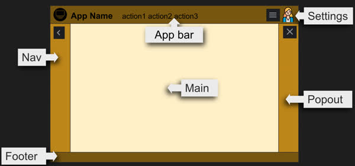

What a `standard layout` is defined to be will migrate over time as new trends in application fashion seek to make things look fresh. However, if you follow current trends, your users are more likely to engage in your application.

One easy way to build an application that uses current design trends is to use a web framework that provides standard layouts, colors, and iconography. Here is an example of a template application built using a web framework with just a few minutes of work.


## Navigation

A user should never get lost while using your application. To help orient your user you want to carefully design the flow of the application and provide the proper navigational controls.

| Navigation Controls | Description                                           |
| ------------------- | ----------------------------------------------------- |
| App controls        | User settings, payment, and help controls             |
| Device controls     | Device specific controls such as back, next, and home |
| Breadcrumb          | A path of the user's walk through the application     |
| Common actions      | Direct links to locations based on the current view   |

### Application map

The first step in building your application should be to design an application map that has all the views that you will present to the user. This helps clarify the functional pieces of the application and their relationship to each other. For example, if you were building a music player you might start with a landing page that displays some marketing information and allows the user to create an account or login. If the user is already logged in, then they start with a dashboard that shows recent or suggested songs. From there they can either search the music catalog, navigate to a collection of songs based on a playlist, album, or artist, or go to an individual song.


If your application map starts looking like a governmental bureaucracy then you probably want to reconsider the interrelation of functionality. A convoluted application map is a strong indicator that the user experience with be likewise convoluted.

### Device controls

With a concise application map in place, you can design navigational controls that allow the user to successfully use the application. To begin with, you want to make sure the navigational controls provided by the device are completely supported. When your application is hosted in a browser the previous and next buttons should take the user through the stack of visited views. If your application is hosted on a mobile device then the conventions of that device should work properly. For example, on an Android device swiping left and right should navigate the application views backward or forwards.

### Breadcrumb

You always want to indicate where the user is, where they came from, and where they can go. You can do this with a `breadcrumb` control that lists the path the user took to get to where they are.

`Dashboard > Beatles > Abbey Road > Come Together`

A breadcrumb quickly orients the user and also allows them to jump up the navigational path.

### Common actions

You also want to anticipate where a user would commonly want to go based upon the view that they are in. For example, if they are playing a song by one artist, it is common that they will want to view related artists. Therefore you want to provide a navigational link that will take them to a search view with a prepopulated query for related artists.

Commonly accessed views should always be accessible from a standard location. For example, the user settings should always be on the top right, and the breadcrumb should always be on the top left. (Those locations get switched if using a Right-To-Left language.)

You want to partition a large application into functional areas and place links for each area in the navigation bar at the top of the application. For example, if we added the ability to create music to our music application, you would want links that switched between listening to and creating music.

## Colors

One of the first things you should consider as you design your application is the color scheme that you will employ. This usually involves picking a a primary, secondary, and focus color.


> Source: paletton.com

There are lots of tools out there that help you create a color scheme. These will let you chose monochromatic, adjacent, or triadic color schemes. You can then spin and adjust a color wheel until you get what you are looking for. With your scheme selected you can export the colors directly to CSS rulesets.

Some free tools you should explore include [Paletton](https://paletton.com/) and [Adobe](https://color.adobe.com/create/color-wheel).

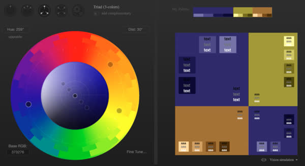

> Source: paletton.com

With your core colors selected, you can use different shades of the colors to reduce the starkness of the limited number of colors without turning your application into a rainbow.


Just make sure you stick with your color scheme and even consider it when selecting font colors and images.

## Typography

A great font will make your application easy on your user's eyes and increase their attention span. Since fonts have been around since the Gutenberg Press, there is some serious history to them. The following shows the different attributes of a font.


> Source: material.io

You can classify fonts into the following groups.

| Font Class  | Example                                               | Meaning                             |
| ----------- | ----------------------------------------------------- | ----------------------------------- |
| San Serif   |       | Only major strokes                  |
| Serif       |              | Minor strokes off the major strokes |
| Monospace   |      | All letters have the same size      |
| Handwriting |  | Cursive strokes                     |

> Source: material.io

When picking fonts you usually want to restrict the number of fonts to three or less. You also want to use them consistently. For example, it is common to use a San Serif font for buttons, navigation links, and body text. Serif fonts are used for paragraph headings. Monospaced fonts are for coding examples or text than need alignment.

If you are looking for royalty free fonts that you can use in your application, you should checkout [Google's open collection](https://fonts.google.com/about) of fonts.


## Iconography

Because users will recognize standard icons, you can decrease the learning curve for your application if you use standard web icons to identify common functionality. For example, most users will immediately identify the following three icons as the menu, sharing, and close actions.


Icons not only exploit user recognition, but they also save limited display space, and provide a visually pleasing alternative to text. The important thing is that you pick a set that includes standard icons and that you use them for their intended purpose. Icons become an anti-pattern when they are used to represent something that is contrary to their common usage.


> Source: material.io

There are lots of standard icon packages that you can choose from. This includes packages such as [Font Awesome](https://fontawesome.com/), [Bootstrap Icons](https://icons.getbootstrap.com/), [Material Icons](http://google.github.io/material-design-icons/), Flat [Color Icons](https://github.com/icons8/flat-color-icons), and [Ant Design Icons](https://github.com/ant-design/ant-design-icons)

## Text

You want to be consistent in the size of the text that you use as well as the number of characters displayed on a line. Commonly there are five different catagories of text sizes used by an application. These include the following.

| Purpose        | Size     |
| -------------- | -------- |
| Page title     | 96 px    |
| Titles         | 48-20 px |
| Text           | 16 px    |
| Secondary text | 14 px    |
| Input          | 16 px    |

These sizes are just suggestions but they serve as a good place to start. If you are using an application framework then they will have default text sizes defined. The important thing is that you are consistent with the sizing. Titles should not be one size for a particular view and a different size on another one. Inconsistency confuses the user and makes the application feel haphazardly designed.

### Limiting line length

Limiting the number of characters displayed on a line makes it easier to read paragraphs of text. The browser will automatically wrap text based on the viewport width, but having a line spread across a 4K monitor that is hundreds of characters long will make your application look clunky and drive the user crazy as they try and find the start of the next line in a long paragraph.

Instead you want to specify a maximum width for your paragraphs. Usually a width of 60 to 80 characters is optimal. You can set this with the `max-width` property set to something like `35em`. The `em` unit is the approximately the width of the `m` character in the font and so about half of an 'm' is about the average character width.

The following shows the visual and cognitive impact of different line lengths.

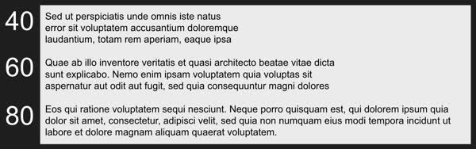

## Internationalization

Designing a global international application requires careful consideration from the beginning. Attempting to internationalize a complex, mature application after it has a domestic presence is very difficult.

One of the most important aspects to consider is the translation of textual content and the ability of the user to select their desired language.

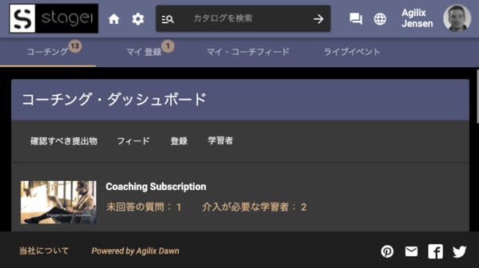

Successful translation also requires the text to be rendered properly. For example, several languages are read from right to left. Therefore the content, and the application itself, must be displayed in that orientation.


Likewise the format for displaying dates, times, numbers, and currency varies greatly between nationalities. This includes country specific currency symbols (¥, $, €, or ฿), the order of date fields (MM/DD/YY or DD/MM/YY), and numerical separators (1,000.50 or 1.000,50).

Iconography can also be a concern. An owl in the United States represents wisdom, but in some Asian countries it symbolizes stupidity. Icons that carry religious representations can be even more disruptive.

Proper international design requires thought across the full technology stack. If data is not properly passed, stored, and rendered at every level of the stack it will fail to properly work globally. For example, dates and times should always be stored in a format that properly represents time zones (e.g. ISO 8601) and rendered based upon the user's location. That way when users do things like global calendering or traveling between countries their data is not corrupted.

## Space

Introducing space around your application content helps to create focus and lessing the effort a user has to exert in order to interpret the presented information.


Consider the following example, where whitespace is used to create focus on the brand, imagery, and call to action.


> Source: Prototypr.org

Here is another example where whitespace brings the user's attention to specific text that teases the user and leads them down to the explanatory text, followed by actions the user can take to learn more.


> Source: MadeBySofa.com

Consider the same content with all of the whitespace removed. This is of course extreme, but it demonstrates the power that whitespace has.

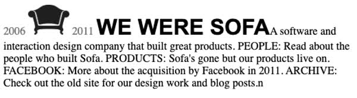

## Interaction

Making your application interactive is a powerful way to engage the user and increase retention. Interaction can be as simple as gathering and displaying the user's name or avatar, or as complex as letting the user completely drive the application based on the choices they make.

Here is an example of purchasing a car where the user can interactively see what their car will look like based upon their desires.


> Source: bmw.com

Interaction makes the application come alive and invests the user in the result of their efforts.

## Images

It is often said that a picture can save a thousand words. Including images in your application can convey deeper understanding, make it more visually appealing, and draw a user into the application. The following example, helps the user know exactly what a product looks like and what it might look like when they use it. The contrast of colors in the image helps the product to pop and further suggest its value.


> Source: Burberry.com

Avoid using images that are only used as space fillers. Display space is too limited to waste on an image that doesn't add significant value. For example, the following image dominates the display of a technical article about CORS. However, it was only chosen because it matched the color scheme of the application and the title contains the work `talk` in it, but two people talking trough a tin can has nothing to do with CORS. Now the user has to scroll past the distracting image to get to the content. Instead, either omit the image, or include one that serves to clarify the purpose of CORS. That way your images are visually appealing, and provides information that furthers the story you are trying to tell.


> Source: medium.com

## Animation

Animation can help make your application come alive, but it also helps confirm choices, demonstrate progress, and focus attention.


However, too much animation can physically make your users sick. Here is an example


> Source: fireart.studio

## Decision fatigue

You need to consider the impact of the choices that you present to a user. [Hick's Law](https://en.wikipedia.org/wiki/Hick%27s_law) states that the time necessary to make a decision increases logarithmically with the number of choices presented. That doesn't mean that you should not provide options to the user, but that you should limit the number of choices given at any point in time.

For example, the process of building a pizza involves many steps. First you must pick the location you want to order from, then the pizza size, cheese, meats, and veggies. Finally you need to provide payment. Each of those choices require a lot of input from the user, and so limiting the number of choices displayed at one time will help reduce decision fatigue and you will have better odds of them completing the ordering process.


> Source: Papa Johns

## Device aware

Modern devices allow a web application to interact in many sophisticated ways. This includes abilities such as installing to the devices desktop, determining the devices geographical location, displaying notifications, detecting the acceleration of the device, using the camera, and accessing the user's contacts. The more seamless the application is integrated with the device the more intuitive and useful the application will be.

The following shows an application suggesting that the user add the application to the device's home screen. This makes it so a user can access the application without having to navigate to the application's URL.


## Device size and orientation

Properly reorienting and altering the functionality of the application interface based upon the size and orientation of the display is especially important on mobile devices. The following shows an application that provides a course on how to tie knots. The default view for the course shows the video on the left and an interactive transcript on the right.


When the device is rotated the application automatically orients itself and moves the interactive transcript below the video in order to maximize the available space. The user can also display the table of contents on the left or the peer chat on the right. Because the device's display is large enough to show the content, even in portrait orientation, the table of contents or chat panes can also occupy a portion of the display. This allows the instructional content to still be visible while the functionality of the other panes are utilized.

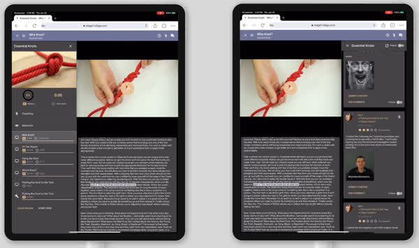

On a smaller device, such as a mobile phone, the table of contents or chat panes completely replace the content. The user can then click on the `X` icon to return to the instructional content. That ability to restrict the focus to a single functional purpose, maximizes the use of the limited space without losing the context of the content the user is viewing.


THe following website demonstrates what happens when an application fails to properly adapt to the orientation of the device. When viewed in portrait mode the application only uses a small portion of the display to show a health warning, but when rotated, the warning completely occupies the display. This creates a confusing experience where the original context of the application is obscured, and leaves the user wondering what should be done next.

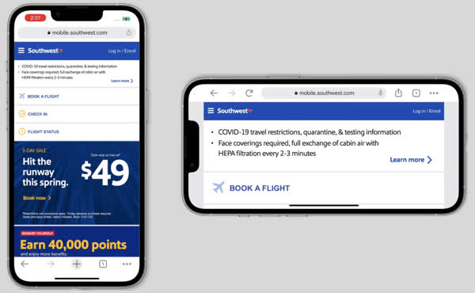

## Performance

📖 **Suggesting reading**:

- [Google site performance](https://www.youtube.com/watch?v=OpMfx_Zie2g)
- [MDN Performance](https://developer.mozilla.org/en-US/docs/Web/Performance)

Application performance is an important aspect of your design that often gets overlooked until it is too late. Your application can be visually stunning, have intuitive navigation, and amazing interactivity, but if it takes minutes to load or react the a user's actions, it will completely fail. Many studies have analyzed the relationship between performance and user retention. One [study](https://www.thinkwithgoogle.com/marketing-strategies/app-and-mobile/mobile-page-speed-new-industry-benchmarks/) showed that as load times increase from one second to five seconds it causes 90% of the users to bounce, or leave, the application.


> Source: thinkwithgoogle.com

You need to set performance goals for your application and consistently monitor how your application is doing. Generally you want your application to load in under a second. However, with modern single page web applications it can take several seconds to do the initial load. You can mitigate the appearance of a slow application by giving the impression of progress, by partially loading some content or displaying a loading animation.

The Chrome debugging tools provide a lot of help for diagnosing your application performance. The network tab will show you the size of your application files and the amount of time it takes to transfer them.

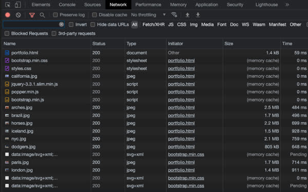

You can use the Chrome debugging Lighthouse tool to run an analysis of your application. This will give you an average performance rating based upon the initial load time, longest content paint, and time before the user can interact with the page.


## Short circuit

Sometimes factors such as network latency will impact the performance of your application or make it partially unavailable. You want to consider how you can create a meaningful experience for your users even when you cannot provide full functionality. For example, your application might relay on a third party service for processing payment before they can access the application. Rather than deny the user access when the payment service is down, you could collect the payment information and attempt to process it later. In the meantime the user is allowed to continue working. If later, the payment processing fails, then you handle the problem just as if their credit card was cancelled after accepting payment.

This ability to provide an alternative path, is sometimes called short circuit or fallback functionality. This removes barriers from your application that otherwise would turn away customers, and they are usually are not difficult to implement. You just need to consider each functional piece of your application and provide an alternative if that functionality is not available.

## Accessibility

📖 **Suggesting reading**: [MDN Accessibility](https://developer.mozilla.org/en-US/docs/Web/Accessibility)

Your application needs to appeal to a diverse population of users. This means that you need to design for users with different accessibility needs, including users with visual, physical, and audible impairments.

You can help users with visual impairments by considering color blindness when selecting your color scheme, providing high contrast themes, and supporting screen readers. Video and audio transcripts, along with visual animation helps users that need audio assistance. Providing keyboard shortcuts and making sure input elements are accessible in the proper order will help users with different physical abilities.

| Ability  | Application features                                    |
| -------- | ------------------------------------------------------- |
| Visual   | High contrast themes, color selection, screen readers   |
| Audio    | Closed captions, textual alternatives, visual animation |
| Physical | Keyboard navigation, element ordering                   |

Many of the accessibility tools that users employ require that your HTML is well structured and has attributes that support [WAI-ARIA](https://developer.mozilla.org/en-US/docs/Learn/Accessibility/WAI-ARIA_basics) standards. Make sure you understand the proper use of elements and aria when you design a production application.

## Legal

Like it or not, applications must consider applicable regulation and the possibility of legal action. For example, by violating GDPR [Amazon was fined $887](https://www.cnbc.com/2021/07/30/amazon-hit-with-fine-by-eu-privacy-watchdog-.html) million in 2021 for violating the privacy of its customers. In another case [Domino's Pizza](https://www.cnbc.com/2019/10/07/dominos-supreme-court.html) was found to be violating the American's with Disabilities Act (ADA) because a blind man could not order a pizza by using a screen reader.

Central to the core of many legal codes is the concept of Personally Identifiable Information (PII). While the strict interpretation of what PII is differs by industry, it generally relates to any data that can be directly ascribed to an identifiably individual.

Every industry and local has different legal constraints. You should be aware of the major legislation that impacts your application. Here are some laws that impact applications within the jurisdiction of the United States of America.

### HIPA

The Health Insurance Portability and Accountability Act (HIPAA) stipulates the management of medical records. It includes provisions that give control to the individual with regard to access and sharing of records. Specifically it restricts how relatives, courts, and insurance companies may obtain medical records.

### FERPA

The Family Educational Rights and Privacy Act (FERPA) defines how student data can be stored, shared, and accessed. FERPA defines the concept of an `education record` and then specifies who can view and contribute to that record.

### ADA

The Americans with Disabilities Act (ADA) seeks to prohibit discrimination against individuals with diverse accessibility needs. The act was originally intended to cover physical environments, but recent case law has extended the interpretation of the law to cover electronic access.

### GDPR

The General Data Protection Regulation (GDPR) impacts all applications that are used by members of the European Union. The main purpose of GDPR is intended to protect the privacy of users. Among other things, GDPR requires applications to get approval from the user before their data can be stored or shared. It also requires the application to provide the ability to delete all of the users data and to be able to transfer their data to competing applications.

## Walls

There are many types of walls that hinder a user's experience with an application. Some walls are caused by poor design or business decisions, and others are a result of unavoidable external pressures such as governmental regulation or security concerns.

If you can learn to recognize user experience walls then there is a good change that you can remove them or decrease their negative impact.

### Complexity

As applications mature it is common for them to grow in complexity as more and more features are introduced.

> A primary cause of complexity is that software vendors uncritically adopt almost any feature that users want.
>
> — Niklaus Wirth

The following image is from GitHub. An important action that a developer needs to do is create a Personal Access Token in order to work with repositories. However, GitHub has buried the UI for creating the token somewhere in their setting (account, user, and repository) pages. Assuming you are able to find the right setting page, you are then confronted with dozens of setting categories. After clicking through all of these options a user will wonder why such an important activity is buried so deeply in the application.

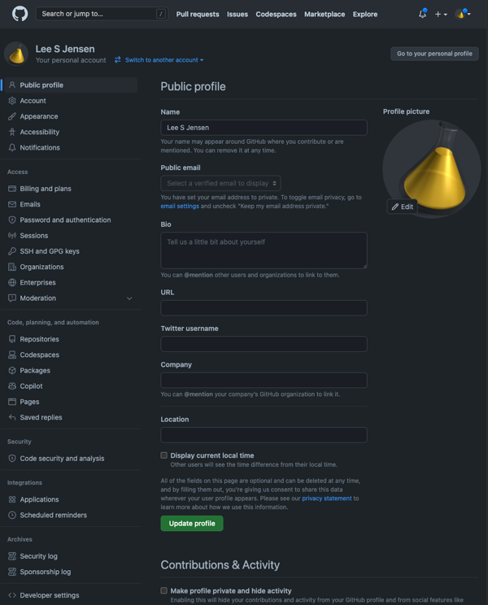

### Payment

Some walls, such as receiving payment, are unavoidable for the success of the application. However, consideration should be made to move the wall to the point where it is required. Before a user hits a payment wall they should have the opportunity to see the value of what they are purchasing. Even better, is if the user is able to invest significant effort and content to the application before payment is required. For example, the application may allow the user to create a limited number of documents before they have to enter payment information.


> Source: sitepoint.com

Once payment is required, the process for entering payment information needs to be as effortless as possible. The best option is to have them not enter information at all, and instead use an associated credential like Apple Pay or Google Wallet to authorize payment based on the already authenticated user. Beyond that, a single text box that accepts, and authorizes, a credit card number is better than dozens of text boxes that must be completed before payment is made. You also want to remember payment information so that you don't need to repeatedly as the user for input. This enables you to provide your application as a subscription service, or to execute single click purchases for future payments.

### Application Failure

Application failure is a reality that any good application design needs to address. An application that has a reputation of repeatedly presenting the user with a failure wall will have a hard time retaining users. The most basic solution to handling a failure is to present a message to the user apologizing for what went wrong. The user will be slightly less annoyed if you can explain what went wrong, provide a possible remedy, or explain the expected duration of the failure.

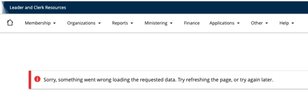

Alternative solutions for handling failure include providing fallback functionality, automatically notifying the user when the failure has been resolved, or providing a status page where the user can go to see what is being done about the problem.

Proactive solutions include designing an application that has multiple redundant regional deployments that automatically failover when one region experiences problems, or designing the application so that it can run offline with cached data.

### Security

Security walls occur when you have to interact with the user in order to authenticate them. The security walls you present should be proportional to the value of the resource you are trying to secure. Banking application should have strong security walls that provide actual protection for the user's data. An application that gives away free kitten videos should have a minimal security wall if any.

You need to consider both the frequency and complexity of your security wall. If the user feels that the security wall is too onerous for the value that the application is providing, they will find another solution. Likewise if the user feels that there is not enough security then they will not trust you with their data.

Here is an example of an application for learning how to code. They need a user's email so that they can store course progress, but they don't even ask for a password because the email address is enough to uniquely identify the user. Authentication occurs when the user provides the security code that is emailed to the address that they provided. From then on the application remembers the email address. If the user accesses the application on a different device then the user just needs to do another once-per-device authentication.


> Source: freecodecamp.com

This a much lower wall than an application that requires you to log in repeatedly every 30 minutes.

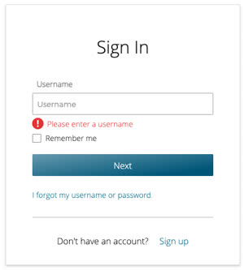

A [CAPTCHA](https://en.wikipedia.org/wiki/CAPTCHA) is a common way to verify that a user is a human. While this may be necessary for the success of your application, it is an example of a wall that provides no value to the user and will always lessen the application experience. This is especially true for a difficult CAPTCHA such as typing in unreadable text, or entering the number of mosquitos displayed in a jungle picture.


### Legal

Legal walls usually only protect the application vendor and provide little or no value to the user. GDPR inspired cookie notifications are one example of this.

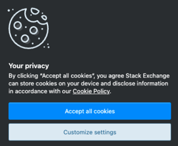

Another common example of a legal wall is an application that requires the acceptance of terms and conditions before you can use the application. You want to minimize the impact of legal walls as much as possible since they lessen the user's experience and encourages the user to question why a legal consent is required in the first place.

## ☑ Assignment

Keep a look out for web applications that demonstrate good and bad design. When you find one that is particularly interesting, submit the URL of the application, along with a comment about what you found interesting, to the Canvas assignment.


# Start up deliverable - HTML and CSS

Now that you have learned the basics of HTML and CSS, is time to create the initial version of your startup application. The main things you should focus on in this deliverable include creating the right HTML structure, and the correct styling with CSS. The application doesn't have to do anything. This will happen when you add JavaScript in the next deliverable.

You must use the same start up GitHub repository that you created in the earlier instruction. Update the README.md file with things that you learn as you work on your start up. As you make changes to your HTML and CSS commit those changes and push them to GitHub. You will need at least four commits to get full credit, but in reality you should have many more than that. If you are using pair programming then your commit history should reflect contributions from all contributing peers.

Remember to use the `Live Server VS Code extension` to see what your code looks like in the browser. Also use the browser's debugger window to debug your CSS.

Once you have developed your application to where you want it, you need to release it to your production environment. **Copy** the `deployFiles.sh` script from the [Simon CSS repository](https://github.com/webprogramming260/simon-css/blob/main/deployFiles.sh) to your start up repository and use `startup` for the service parameter (`-s`)

```sh
./deployFiles.sh -k <yourpemkey> -h <yourdomain> -s startup
```

For example,

```sh
./deployFiles.sh -k ~/keys/production.pem -h yourdomain.click -s startup
```

Doing this will make this deliverable of your start up available from `https://startup.yourdomainname`.

### Update your website's home page

You should also update your website's home page with a link to your project so that you can access everything you have done for this class from the home page. This will make a great portfolio of all your work in this class. You can easily do this by modifying the index.html file that is part of the website-html repository that you created in the earlier instruction and deploying it using the script found in that repository. Make sure you run this script from a console where your working directory is the website-html repository and not your start up repository.

```sh
./deployWebsite.sh  -k <yourpemkey> -h <yourdomain>
```

## ☑ Assignment

1. Create the HTML and CSS deliverable of your start up application. Make sure all authors of the code are attributed in the application and that there is a link to your GitHub repository.
1. Periodically commit and push your code to GitHub.
1. Periodically update your start up repository's README.md file to reflect what you have learned and want to remember.
1. Push your final version of your project to GitHub.
1. Deploy your start up application to your production environment (your server).
1. Make sure your application is available from your production environment.
1. Upload the URL to your start up application to the Canvas assignment.

## Grading Rubric

- 30% - Properly structured HTML.
- 30% - Properly styled CSS.
- 20% - Your start up application is hosted on your web server and is accessible using a subdomain of your domain name over HTTPS.
- 10% - Multiple Git commits with meaningful comments.
- 10% - Notes in your start up Git repository README.md file documenting what you have learned using HTML and CSS.

## Go celebrate

You did it! This is a significant milestone. Time to grab some friends, show them what you did, and celebrate with cookies.


# JavaScript introduction


📖 **Suggested reading**:

- [MDN JavaScript](https://developer.mozilla.org/en-US/docs/Web/JavaScript)
- [ECMA specification](https://tc39.es/ecma262/) - This official specification is only for reference

Officially known as ECMAScript, JavaScript is a weakly typed language based upon concepts found in C, Java, and Scheme. It is by far the most used programming language in the world. It runs on every web browser, is commonly used as a web server language, and for creating serverless functions. In this instruction we will cover the basic parts of the language necessary to create a reasonable website. There are many features of the language that will not be discussed and you should take time to dig into the corners of the language as time allows. The more effectively you understand JavaScript, the better web programmer you will be.

Typically JavaScript is executed using an interpreter at runtime instead of compiling it into a machine specific binary at build time. This has the advantage of making JavaScript very portable, but also allows for many errors, such as using an undefined variable. These types of errors commonly only get discovered when the program crashes during execution.

## JavaScript Versions

The following table describes the version history of JavaScript. You don't need to worry too much about versions right now, but this is important to be aware of since browser compatibility is always an issue when developing a web application. When considering the use of a JavaScript feature you should consult websites like [MDN](https://developer.mozilla.org/en-US/docs/Mozilla/Add-ons/WebExtensions/Browser_support_for_JavaScript_APIs) or [CanIUse](https://caniuse.com/) to see how well the feature is supported.

| Year | Version | Features                                                                                                                  |
| ---- | ------- | ------------------------------------------------------------------------------------------------------------------------- |
| 1997 | ES1     | types, functions                                                                                                          |
| 1999 | ES3     | regex, exceptions, switch                                                                                                 |
| 2009 | ES5     | json, array iteration                                                                                                     |
| 2015 | ES6     | let/const, default params, classes, template literals, destructuring, generators, promises, modules, internationalization |
| 2016 | ES2016  | array.includes                                                                                                            |
| 2017 | ES2017  | async/await                                                                                                               |
| 2018 | ES2018  | rest/spread, promise.finally                                                                                              |
| 2019 | ES2019  | string.trim                                                                                                               |
| 2020 | ES2020  | ?? operator                                                                                                               |

## Getting started

Let's start with a basic example. The following JavaScript will concatenate three strings together and then throw away the result. Not very useful, but JavaScript doesn't complain much.

```js
'Hello' + ' ' + 'world';
```

Only slightly more complex is to call a function with the result of our concatenated string. In this case we call the JavaScript runtime's built in function `console.log` to output the string to the debugger console.

```js
console.log('Hello' + ' ' + 'world');
// OUTPUT: Hello world
```

You can also write your own functions.

```js
function join(a, b) {
  return a + ' ' + b;
}

console.log(join('Hello', 'world'));
// OUTPUT: Hello world
```

## Comments

You can comment your JavaScript with either line or block comments.

```js
// Line comment

/*
Block comment
*/
```

## Code delimiters

While not technically required in most cases, it is considered good form to end JavaScript statements with a semicolon (`;`). Code blocks, and their resulting scope, are defined with curly braces (`{ }`).

## Playgrounds

Before we go any further we need a way for you to write and run JavaScript yourself. There are two easy ways to do this.

1. Use an online sandbox like [CodePen](https://codepen.io). With CodePen you can write whatever JavaScript you would like and immediately see the results. Make sure you display the CodePen's Console window if your JavaScript is using the console.log function.

   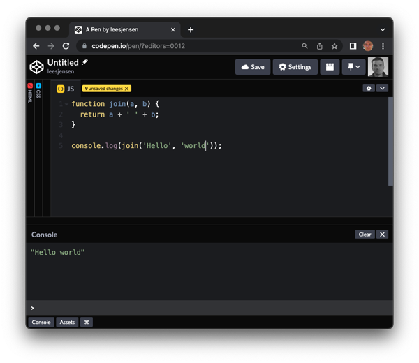

1. Use your browser's debugger. For example, if you open Chrome and press `F12` the debugger will display. Select the `Console` menu option. This will display a JavaScript interpreter where you can write and execute your code.

   
   
## Examples

You can see an example of all the JavaScript we talk about in this instruction with this [HTML page](https://htmlpreview.github.io/?https://github.com/webprogramming260/.github/blob/main/profile/javascript/introduction/introduction.html).


# JavaScript console

📖 **Suggested reading**: [MDN JavaScript Console](https://developer.mozilla.org/en-US/docs/Web/API/console)

The JavaScript console object provides interaction with the JavaScript runtime's debugger console. This usage of console should not be confused with your operating system's console (AKA terminal or command line). The console object provides functionality for outputting the value of text and objects, running timers, and counting iterations. These are useful debugging tools when you can actually execute your code in an interactive debugger (such as VS Code).

## Log

The basic usage of the console object is to output a log message.

```js
console.log('hello');
// OUTPUT: hello
```

You can create formatted messages in the log parameter.

```js
console.log('hello %s', 'world');
// OUTPUT: hello world
```

You can even specify CSS declarations in order to style the log output.

```js
console.log('%c JavaScript Demo', 'font-size:1.5em; color:green;');
// OUTPUT: JavaScript Demo //in large green text
```

## Timers

If you are trying to see how long a piece of code is running you can wrap it with `time` and `timeEnd` calls and it will output the duration between the `time` and `timeEnd` calls.

```js
console.time('demo time');
// ... some code that takes a long time.
console.timeEnd('demo time');
// OUTPUT: demo time: 9762.74 ms
```

## Count

To see how many times a block of code is called you can use the `count` function.

```js
console.count('a');
// OUTPUT: a: 1
console.count('a');
// OUTPUT: a: 2
console.count('b');
// OUTPUT: b: 1
```


# Adding JavaScript to HTML

You can insert JavaScript into HTML either by directly including it in the HTML within the content of a `<script>` element, or using by the `src` attribute of the script element to reference an external JavaScript file.

**index.js**

```js
function sayHello() {
  console.log('hello');
}
```

**index.html**

```html
<head>
  <script src="javascript.js"></script>
</head>
<body>
  <button onclick="sayHello()">Say Hello</button>
  <button onclick="sayGoodbye()">Say Goodbye</button>
  <script>
    function sayGoodbye() {
      alert('Goodbye');
    }
  </script>
</body>
```

Notice that we call the `sayHello` and `sayGoodbye` JavaScript functions from the HTML in the `onclick` attribute of the button element. Special attributes like `onclick` automatically create event listeners for different DOM events that call the code contained in the attribute's value. The code specified by the attribute value can be a simple call to a function or any JavaScript code.

```html
<button onClick="let i=1;i++;console.log(i)">press me</button>
<!-- OUTPUT: 2 -->
```


# JavaScript type and construct

📖 **Suggested reading**: [MDN Data types and structures](https://developer.mozilla.org/en-US/docs/Web/JavaScript/Data_structures)

## Declaring variables

Variables are declared using either the `let` or `const` keyword. `let` allows you to change the value of the variable while `const` will cause an error if you attempt to change it.

```js
let x = 1;

const y = 2;
```

âš  Originally JavaScript used the keyword `var` to define variables. This has been deprecated because they cause hard to detect errors in code related to the scope of the variable. You should avoid `var` and always declare your variables either with `let` or `const`.

## Type

JavaScript defines several primitives types.

| Type        | Meaning                                                    |
| ----------- | ---------------------------------------------------------- |
| `Null`      | The type of a variable that has not been assigned a value. |
| `Undefined` | The type of a variable that has not been defined.          |
| `Boolean`   | true or false.                                             |
| `Number`    | A 64 bit signed number.                                    |
| `BigInt`    | A number of arbitrary magnitude.                           |
| `String`    | A textual sequence of characters.                          |
| `Symbol`    | A unique value.                                            |

Of these types Boolean, Number, and String are the types commonly thought of when creating variables. However, variables may commonly refer to the Null or Undefined primitive. Because JavaScript does not enforce the declaration of a variable before you use it, it is entirely possible for a variable to have the type of undefined.

In addition to the above primitives, JavaScript defines several object types. Some of the more commonly used objects include the following.

| Type       | Use                                                                                    | Example                  |
| ---------- | -------------------------------------------------------------------------------------- | ------------------------ |
| `Object`   | A collection of properties represented by name value pairs. Values can be of any type. | `{a:3, b:'fish'}`        |
| `Function` | An object that has the ability to be called.                                           | `function a() {}`        |
| `Date`     | Calendar dates and times.                                                              | `new Date('1995-12-17')` |
| `Array`    | An ordered sequence of any type.                                                       | `[3, 'fish']`            |
| `Map`      | A collection of key value pairs that support efficient lookups.                        | `new Map()`              |
| `JSON`     | A lightweight data-interchange format used to share information across programs.       | `{"a":3, "b":"fish"}`    |

## Common operators

When dealing with a number variable, JavaScript supports standard mathematical operators like `+` (add), `-` (subtract), `*` (multiply), `/` (divide), and `===` (equality). For string variables, JavaScript support `+` (concatenation) and `===` (equality).

## Type conversions

JavaScript is a weakly typed language. That means that a variable always has a type, but the variable can change type when it is assigned a new value, or that types can be automatically converted based upon the context that they are used in. Sometime the results of automatic conversions can be unexpected from programmers who are use to strongly typed languages. Consider the following examples.

```js
2 + '3';
// OUTPUT: '23'
2 * '3';
// OUTPUT: 6
[2] + [3];
// OUTPUT: '23'
true + null;
// OUTPUT: 1
true + undefined;
// OUTPUT: NaN
```

Getting unexpected results is especially common when dealing with the [equality](https://developer.mozilla.org/en-US/docs/Web/JavaScript/Equality_comparisons_and_sameness) operator.

```js
1 == '1';
// OUTPUT: true
null == undefined;
// OUTPUT: true
'' == false;
// OUTPUT: true
```

âš  The unexpected results happen in JavaScript because it uses [complex rules](https://developer.mozilla.org/en-US/docs/Web/JavaScript/Equality_comparisons_and_sameness#strict_equality_using) for defining equality that depend upon the conversion of a type to a boolean value. You will sometimes hear this referred to as [falsy](https://developer.mozilla.org/en-US/docs/Glossary/Falsy) and truthy evaluations. To remove this confusion, JavaScript introduced the strict equality (===) and inequality (!==) operators. The strict operators skip the type conversion when computing equality. This results in the following.

```js
1 === '1';
// OUTPUT: false
null === undefined;
// OUTPUT: false
'' === false;
// OUTPUT: false
```

Because strict equality is considered more intuitive, it is almost always preferred and should be used in your code.

## Conditionals

JavaScript support many common programming language conditional constructs. This includes `if`, `else`, and `if else`. Here are some examples.

```js
if (a === 1) {
  //...
} else if (b === 2) {
  //...
} else {
  //...
}
```

You can also use the ternary operator. This provides a compact `if else` representation.

```js
a === 1 ? console.log(1) : console.log('not 1');
```

You can use boolean operations in the expression to create complex predicates. Common boolean operators include `&&` (and), `||` (or), and `!` (not).

```js
if (true && (!false || true)) {
  //...
}
```

### Loops

JavaScript support many common programming language looping constructs. This includes `for`, `for in`, `for of`, `while`, `do while`, and `switch`. Here are some examples.

### for

Note the introduction of the common post increment operation (`i++`) for adding one to a number.

```js
for (let i = 0; i < 2; i++) {
  console.log(i);
}
// OUTPUT: 0 1
```

### do while

```js
let i = 0;
do {
  console.log(i);
  i++;
} while (i < 2);
// OUTPUT: 0 1
```

### while

```js
let i = 0;
while (i < 2) {
  console.log(i);
  i++;
}
// OUTPUT: 0 1
```

### for in

The `for in` statement iterates over an object's property names.

```js
const obj = { a: 1, b: 'fish' };
for (const name in obj) {
  console.log(name);
}
// OUTPUT: a
// OUTPUT: b
```

For arrays the object's name is the array index.

```js
const arr = ['a', 'b'];
for (const name in arr) {
  console.log(name);
}
// OUTPUT: 0
// OUTPUT: 1
```

### for of

The `for of` statement iterates over an iterable's (Array, Map, Set, ...) property values.

```js
const arr = ['a', 'b'];
for (const val of arr) {
  console.log(val);
}
// OUTPUT: 'a'
// OUTPUT: 'b'
```

### Break and continue

All of the looping constructs demonstrated above allow for either a `break` or `continue` statement to abort or advance the loop.

```js
let i = 0;
while (true) {
  console.log(i);
  if (i === 0) {
    i++;
    continue;
  } else {
    break;
  }
}
// OUTPUT: 0 1
```

## ☑ Assignment

Create a CodePen that uses conditional and loop statements.

When you are done submit your CodePen URL, along with a comment about something you found interesting, to the Canvas assignment.


# JavaScript string

📖 **Suggested reading**: [MDN String](https://developer.mozilla.org/en-US/docs/Web/JavaScript/Reference/Global_Objects/String)

Strings are a primitive type in JavaScript. A string variable is specified by surround a sequence of characters with single quotes (`'`), double quotes (`"`), or backticks (\`). The meaning of single or double quotes are equivalent, but the backtick defines a string literal that may contain JavaScript that is evaluated in place and concatenated into the string. A string literal replacement specifier is declared with a dollar sign followed by a curly brace pair. Anything inside the curly braces is evaluated as JavaScript. You can also use backticks to create multiline strings without having to explicitly escape the newline characters using `\n`.

```js
'single quotes text';
'double quotes text';

const l = 'literal';
console.log(`string ${l + (1 + 1)} text`);
// OUTPUT: string literal2 text
```

## Unicode support

JavaScript supports Unicode by defining a string as a 16-bit unsigned integer that represents UTF-16 strings. Unicode support allows JavaScript to represent most languages spoken on the planet. This includes those that are read from right to left.

> حجر
>
> أقول لهذا الحجر: أنا أنت. Ùيقول: لستَ مرناً الى هذا الحدّ. أقول: قلبي مثلك؟ Ùيقول:

However, there are several important steps you must take in order to make your web application fully internationalized. This includes handling of currency, time, dates, iconography, units of measure, keyboard layouts, and respecting local customs. Read this [article on the W3C website](https://www.w3.org/standards/webdesign/i18n) to learn more about internationalization.

## String functions

The string object has several interesting functions associated with it. Here are some of the commonly used ones.

| Function    | Meaning                                                      |
| ----------- | ------------------------------------------------------------ |
| length      | The number of characters in the string                       |
| indexOf     | The starting index of a given substring                      |
| split       | Split the string into an array on the given delimiter string |
| startsWith  | True if the string has a given prefix                        |
| endsWith    | True if the string has a given suffix                        |
| toLowerCase | Converts all characters to lowercase                         |

```js
const s = 'Example:조선글';

console.log(s.length);
// OUTPUT: 11
console.log(s.indexOf('조선글'));
// OUTPUT: 8
console.log(s.split(':'));
// OUTPUT: ['Example', '조선글']
console.log(s.startsWith('Ex'));
// OUTPUT: true
console.log(s.endsWith('조선글'));
// OUTPUT: false
console.log(s.toLowerCase());
// OUTPUT: example:조선글
```


# Functions

📖 **Suggested reading**: [MDN Functions](https://developer.mozilla.org/en-US/docs/Web/JavaScript/Reference/Functions)

In JavaScript functions are first class objects. That means that they can be assigned a name, passed as a parameter, returned as a result, and referenced from an object or array just like any other variable.

The basic syntax of a function begins with the `function` keyword followed by zero or more parameters and a body that may contain zero or more return statements. The return statement my return a single value. Note that there are no type declarations, as the type is always inferred by the assignment of the value to the parameter.

```js
function hello(who) {
  return 'hello ' + who;
}

console.log(hello('world'));
// OUTPUT: hello world
```

A function without a return value usually exists to produce some side effect like modifying a parameter or interacting with an external program. In the following example the side effect of the function is to output text to the debugger console.

```js
function hello(who) {
  who.count++;
  console.log('hello ' + who.name);
}

hello({ name: 'world', count: 0 });
// OUTPUT: hello world
```

## Function parameters

When a function is called, the caller may choose what parameters to provide. If a parameter is not provided then the value of the parameter is `undefined` when the function executes.

In addition to explicitly passing the value of a parameter to a function, the function can define a default value. This is done by assigning a value to the parameter in the function declaration.

```js
function labeler(value, title = 'title') {
  console.log(`${title}=${value}`);
}

labeler();
// OUTPUT: title=undefined

labeler('fish');
// OUTPUT: title=fish

labeler('fish', 'animal');
// OUTPUT: animal=fish
```

## Anonymous functions

Functions in JavaScript are commonly assigned to a variable so that they can be passed as a parameter to some other function or stored as an object property. To easily support this common use you can define a function anonymously and assign it to a variable.

```js
// Function that takes a function as a parameter
function doMath(operation, a, b) {
  return operation(a, b);
}

// Anonymous function assigned to a variable
const add = function (a, b) {
  return a + b;
};

console.log(doMath(add, 5, 3));
// OUTPUT: 8

// Anonymous function assigned to a parameter
console.log(
  doMath(
    function (a, b) {
      return a - b;
    },
    5,
    3
  )
);
// OUTPUT: 2
```

## Creating, passing, and returning functions

Here are examples of assigning functions to variables, as well as using functions as parameters and return values.

```js
// Anonymous declaration of the function that is later assigned to a variable
const add = function (a, b) {
  return a + b;
};

// Function that logs as a side effect of its execution
function labeler(label, value) {
  console.log(label + '=' + value);
}

// Function that takes a function as a parameter and then executes the function as a side effect
function addAndLabel(labeler, label, adder, a, b) {
  labeler(label, adder(a, b));
}

// Passing a function to a function
addAndLabel(labeler, 'a+b', add, 1, 3);
// OUTPUT: a+b=4

// Function that returns a function
function labelMaker(label) {
  return function (value) {
    console.log(label + '=' + value);
  };
}

// Assign a function from the return value of the function
const nameLabeler = labelMaker('name');

// Calling the returned function
nameLabeler('value');
// OUTPUT: name=value
```

## Inner functions

Functions can also be declared inside other functions. This allows you to modularize your code without always exposing private details.

```js
function labeler(value) {
  function stringLabeler(value) {
    console.log('string=' + value);
  }
  function numberLabeler(value) {
    console.log('number=' + value);
  }

  if (typeof value == 'string') {
    stringLabeler(value);
  } else if (typeof value == 'number') {
    numberLabeler(value);
  }
}

labeler(5);
// OUTPUT: number=5

labeler('fish');
// OUTPUT: string=fish
```

## ☑ Assignment

Create a CodePen that uses all of the concepts related to functions. This includes writing standard, inner, and anonymous functions, as well as passing parameters and returning values.

When you are done submit your CodePen URL, along with a comment about something you found interesting, to the Canvas assignment.


# JavaScript arrow function

Because functions are first order objects in JavaScript they can be declared anywhere and passed as parameters. This results in code with lots of anonymous functions cluttering things up. To make the code more compact the `arrow` syntax was created. This syntax replaces the need for the `function` keyword with the symbols `=>` placed after the parameter declaration. The enclosing curly braces are also optional.

This is a function in arrow syntax that takes no parameters and always returns 3.

```js
() => 3;
```

The following two invocations of sort are equivalent.

```js
const a = [1, 2, 3, 4];

// standard function syntax
a.sort(function (a, b) {
  return a - b;
});

// arrow function syntax
a.sort((a, b) => a - b);
```

Besides being compact, the `arrow` function syntax has some important semantic differences from the standard function syntax. This includes restrictions that arrow functions cannot be used for constructors or iterator generators.

## Return values

Arrow functions also have special rules for the `return` keyword. The return keyword is optional if no curly braces are provided for the function and it contains a single expression. In that case the result of the expression is automatically returned. If curly braces are provided then the arrow function behaves just like a standard function.

```js
() => 3;
// RETURNS: 3

() => {
  3;
};
// RETURNS: undefined

() => {
  return 3;
};
// RETURNS: 3
```

## This pointer

Next, arrow functions inherit the `this` pointer from the scope of where it is created. This makes what is know as a `closure`. A closure allows a function to continue referencing its creation scope, even after it has passed out of that scope. This can be tricky to wrap your head around, and we discuss it in detail when we later talk about JavaScript `scope`. For now consider the following example.

The function `makeClosure` returns an anonymous function using the arrow syntax. Notice that the `a` parameter is overridden, a new `b` variable is created, and both `a` and `b` are referenced in the arrow function. Because of that reference, they are both part of the closure for the returned function.

```js
function makeClosure(a) {
  a = 'a2';
  const b = 'b2';
  return () => [a, b];
}
```

Next, we declare the variables `a` and `b` at the top level scope, and call `makeClosure` with `a`.

```js
const a = 'a';
const b = 'b';

const closure = makeClosure(a);
```

Now, when we call `closure` function it will output the values contained in scope where it was created instead of the current values of the variables.

```js
console.log(closure());
// OUTPUT: ['a2', 'b2']

console.log(a, b);
// OUTPUT: 'a' 'b'
```

Closures provide a valuable property when we do things like execute JavaScript within the scope of an HTML page, because it can remember the values of variables when the function was created instead of what they are when they are executed.

## ☑ Assignment

Create a CodePen that uses the arrow function.

When you are done submit your CodePen URL, along with a comment about something you found interesting, to the Canvas assignment.


# JavaScript array

📖 **Suggested reading**: [MDN Array](https://developer.mozilla.org/en-US/docs/Web/JavaScript/Reference/Global_Objects/Array)

JavaScript array objects represent a sequence of other objects and primitives. You can reference the members of the array using a zero based index. You can create an array with the Array constructor or using the array literal notation shown below.

```js
const a = [1, 2, 3];
console.log(a[1]);
// OUTPUT: 2

console.log(a.length);
// OUTPUT: 3
```

## Object functions

The Array object has several interesting static functions associated with it. Here are some of the interesting ones.

| Function | Meaning                                                   | Example                       |
| -------- | --------------------------------------------------------- | ----------------------------- |
| push     | Add an item to the end of the array                       | `a.push(4)`                   |
| pop      | Remove an item from the end of the array                  | `x = a.pop`                   |
| slice    | Return a sub-array                                        | `a.slice(1,-1)`               |
| sort     | Run a function sort an array in place                     | `a.sort((a,b) => b-a)`        |
| values   | Creates an iterator for use with a `for of` loop          | `for (i of a.values()) {...}` |
| find     | Find the first item satisfied by a test function          | `a.find(i => i < 2)`          |
| forEach  | Run a function on each array item                         | `a.forEach(console.log)`      |
| reduce   | Run a function to reduce each array item to a single item | `a.reduce((a, c) => a + c)`   |
| map      | Run a function to map an array to a new array             | `a.map(i => i+i)`             |
| filter   | Run a function to remove items                            | `a.filter(i => i%2)`          |
| every    | Run a function to test if all items match                 | `a.every(i => i < 3)`         |
| some     | Run a function to test if any items match                 | `a.some(i => 1 < 1)`          |

```js
const a = [1, 2, 3];

console.log(a.map((i) => i + i));
// OUTPUT: [2,4,6]
console.log(a.reduce((a, c) => a + c));
// OUTPUT: 6
console.log(a.sort((a, b) => b - a));
// OUTPUT: [3,2,1]

a.push(4);
console.log(a.length);
// OUTPUT: 4
```

## ☑ Assignment

Create a CodePen that uses arrays.

When you are done submit your CodePen URL, along with a comment about something you found interesting, to the Canvas assignment.


# JavaScript object and classes

📖 **Suggested reading**: [MDN Classes in JavaScript](https://developer.mozilla.org/en-US/docs/Learn/JavaScript/Objects/Classes_in_JavaScript)

A JavaScript object represents a collection of name value pairs referred to as properties. The property name must be of type String or Symbol, but the value can be of any type. Objects also have common object-oriented functionality such as constructors, a this pointer, static properties and functions, and inheritance.

Objects can be created with the new operator. This causes the object's constructor to be called. Once declared you can add properties to the object by simply referencing the property name in an assignment. Any type of variable can be assigned to a property. This includes a sub-object, array, or function. The properties of an object can be referenced either with dot (`obj.prop`) or bracket notation (`obj['prop']`).

```js
const obj = new Object();

obj.c = [1, 2, 3];
obj.hello = function () {
  console.log('hello');
};

console.log(obj);
// OUTPUT: {a: 3, b: 'fish', c: [1,2,3], hello: func}
```

The ability to dynamically modify an object is incredibly useful when manipulating data with an indeterminate structure.

âš  Note the different uses of the term `object`. Object can refer to the standard JavaScript objects (e.g. `Promise, Map, Object, Function, Date, ...`), or it can refer specifically to the JavaScript Object object (i.e. `new Object()`), or it can refer to any JavaScript object you create (e.g. `{a:'a', b:2}` ). This overloaded usage can be a bit confusing.

## Object-literals

You can also declare a variable of object type with the `object-literal` syntax. This syntax allows you to provide the initial composition of the object.

```js
const obj = {
  a: 3,
  b: 'fish',
};
```

## Object functions

Object has several interesting static functions associated with it. Here are some of the commonly used ones.

| Function | Meaning                             |
| -------- | ----------------------------------- |
| entries  | Returns an array of key value pairs |
| keys     | Returns an array of keys            |
| values   | Returns an array of values          |

```js
const obj = {
  a: 3,
  b: 'fish',
};

console.log(Object.entries(obj));
// OUTPUT: [['a', 3], ['b', 'fish']]
console.log(Object.keys(obj));
// OUTPUT: ['a', 'b']
console.log(Object.values(obj));
// OUTPUT: [3, 'fish']
```

## Constructor

Any function that returns an object is considered a `constructor` and can be invoked with the `new` operator.

```js
function Person(name) {
  return {
    name: name,
  };
}

const p = new Person('Eich');
console.log(p);
// OUTPUT: {name: 'Eich'}
```

Because objects can have any type of property value you can create methods on the object as part of its encapsulation.

```js
function Person(name) {
  return {
    name: name,
    log: function () {
      console.log('My name is ' + this.name);
    },
  };
}

const p = new Person('Eich');
p.log();
// OUTPUT: My name is Eich
```

## This pointer

Notice in the last example the use of the keyword `this` when we referred to the name property (`this.name`). The meaning of `this` depends upon the scope of where it is used, but in the context of an object it refers to a pointer to the object. We will talk more about the `this` pointer in the instruction on scope.

## Classes

You can use classes to define objects. Using a class clarifies the intent to create a reusable component rather than a one off object. Class declarations looks similar to declaring an object, but classes have an explicit constructor and assumed function declarations. The person object from above would look like the following when converted to a class.

```js
class Person {
  constructor(name) {
    this.name = name;
  }

  log() {
    console.log('My name is ' + this.name);
  }
}

const p = new Person('Eich');
p.log();
// OUTPUT: My name is Eich
```

You can make properties and functions of classes private by prefixing them with a `#`.

```js
class Person {
  #name;

  constructor(name) {
    this.#name = name;
  }
}

const p = new Person('Eich');
p.#name = 'Lie';
// OUTPUT: Uncaught SyntaxError: Private field '#name' must be declared in an enclosing class
```

## Inheritance

Classes can be extended by using the `extends` keyword to define inheritance. Parameters that need to be passed to the parent class are delivered using the `super` function. Any functions defined on the child that have the same name as the parent override the parent's implementation. A parent's function can be explicitly accessed using the `super` keyword.

```js
class Person {
  constructor(name) {
    this.name = name;
  }

  print() {
    return 'My name is ' + this.name;
  }
}

class Employee extends Person {
  constructor(name, position) {
    super(name);
    this.position = position;
  }

  print() {
    return super.print() + '. I am a ' + this.position;
  }
}

const e = new Employee('Eich', 'programmer');
console.log(e.print());
// OUTPUT: My name is Eich. I am a programmer
```

## ☑ Assignment

Create a CodePen that uses objects and classes.

When you are done submit your CodePen URL, along with a comment about something you found interesting, to the Canvas assignment.

Don't forget to update your GitHub start up repository README.md with all of the things you learned and want to remember.


# JSON

📖 **Suggested reading**:

- (MDN JSON)[https://developer.mozilla.org/en-US/docs/Web/JavaScript/Reference/Global_Objects/JSON]
- (Douglas Crockford: The JSON Saga)[https://www.youtube.com/watch?v=-C-JoyNuQJs]

JavaScript Object Notation (JSON) was conceived by Douglas Crockford in 2001 while working at Yahoo! JSON, pronounced like the name Jason, received official standardization in 2013 and 2017 (ECMA-404, [RFC 8259](https://datatracker.ietf.org/doc/html/rfc8259)).

JSON provides a simple, and yet effective way, to share and store data. By design JSON is easily convertible to, and from, JavaScript objects. This make it a very convenient data format when working with web technologies. Because of its simplicity, standardization, and compatibility with JavaScript, JSON has become one of the world's most popular data formats.

## Format

A JSON document contains one of the following data types:

| Type    | Example                 |
| ------- | ----------------------- |
| string  | "crockford"             |
| number  | 42                      |
| boolean | true                    |
| array   | [null,42,"crockford"]   |
| object  | {"a":1,"b":"crockford"} |
| null    | null                    |

Most commonly, a JSON document contains an object. Objects contain zero or more key value pairs. The key is always a string, and the value must be one of the valid JSON data types. Key value pairs are delimited with commas. Curly braces delimit an object, square braces and commas delimit arrays, and strings are always delimited with double quotes.

Here is an example of a JSON document.

```json
{
  "class": {
    "title": "web programming",
    "description": "Amazing"
  },
  "enrollment": ["Marco", "Jana", "ÙَاطÙÙ…ÙŽØ©"],
  "start": "2025-02-01",
  "end": null
}
```

JSON is always encoded with [UTF-8](https://en.wikipedia.org/wiki/UTF-8). This allows for the representation of global data.

## Converting to JavaScript

You can convert JSON to, and from, JavaScript using the `JSON.parse` and `JSON.stringify` functions.

```js
const obj = { a: 2, b: 'crockford', c: undefined };
const json = JSON.stringify(obj);
const objFromJson = JSON.parse(json);

console.log(obj, json, objFromJson);

// OUTPUT:
// {a: 2, b: 'crockford', c: undefined}
// {"a":2, "b":"crockford"}
// {a: 2, b: 'crockford'}
```

Note that in this example, JSON cannot represent the JavaScript `undefined` object and so it gets dropped when converting from JavaScript to JSON.


# JavaScript regular expressions

📖 **Suggested reading**: [MDN Regular expressions](https://developer.mozilla.org/en-US/docs/Web/JavaScript/Guide/Regular_Expressions)

Regular expression support is built right into JavaScript. If you are not familiar with regular expressions, you can think of them as textual pattern matchers. You use a regular expression to find text in a string so that you can replace it, or simply to know that it exists.

You can create a regular expression using the class constructor or a regular expression literal.

```js
const objRegex = new RegExp('ab*', 'i');
const literalRegex = /ab*/i;
```

The `string` class has several functions that accept regular expressions. This includes `match`, `replace`, `search`, and `split`. For a quick test to see if there is a match you can use the regular expression object's `test` function.

```js
const petRegex = /(dog)|(cat)|(bird)/gim;
const text = 'Both cats and dogs are pets, but not rocks.';

text.match(petRegex);
// RETURNS: ['cat', 'dog']

text.replace(petRegex, 'animal');
// RETURNS: Both animals and animals are pets, but not rocks.

petRegex.test(text);
// RETURNS: true
```

## ☑ Assignment

Create a CodePen that uses regular expressions.

When you are done submit your CodePen URL, along with a comment about something you found interesting, to the Canvas assignment.


# JavaScript rest and spread

📖 **Suggested reading**:

- [MDN Rest](https://developer.mozilla.org/en-US/docs/Web/JavaScript/Reference/Functions/rest_parameters)
- [MDN Spread](https://developer.mozilla.org/en-US/docs/Web/JavaScript/Reference/Operators/Spread_syntax)

## Rest

Sometimes you want a function to take an unknown number of parameters. For example, if you wanted to write a function that checks to see if some number in a list is equal to a given number. You could write this using an array.

```js
function hasNumber(test, numbers) {
  return numbers.some((i) => i === test);
}

const a = [1, 2, 3];
hasNumber(2, a);
// RETURNS: true
```

However sometimes you don't have an array to work with. In this case you could create one on the fly.

```js
function hasTwo(a, b, c) {
  return hasNumber(2, [a, b, c]);
}
```

But JavaScript provides the `rest` syntax to make this easier. Think of it as a parameter that contains the `rest` of the parameters. To turn the last parameter of any function into a `rest` parameter you prefix it with three periods. You can then you can call it with any number of parameters and they are all automatically combined into an array.

```js
function hasNumber(test, ...numbers) {
  return numbers.some((i) => i === test);
}

hasNumber(2, 1, 2, 3);
// RETURNS: true
```

Note that you can only make the last parameter a `rest` parameter. Otherwise JavaScript would not know which parameters to combine into the array.

Technically speaking, `rest` allows JavaScript to provide what is called variadic functions.

## Spread

Spread does the opposite of rest. It take an object that is iterable (e.g. array or string) and expands it into a function's parameters. Consider the following.

```js
function person(firstName, lastName) {
  return { first: firstName, last: lastName };
}

const p = person(...['Ryan', 'Dahl']);
console.log(p);
// OUTPUT: {first: 'Ryan', last: 'Dahl'}
```

## ☑ Assignment

Create a CodePen that uses both rest and spread.

When you are done submit your CodePen URL, along with a comment about something you found interesting, to the Canvas assignment.


# JavaScript destructuring

📖 **Suggested reading**: [MDN Destructuring](https://developer.mozilla.org/en-US/docs/Web/JavaScript/Reference/Operators/Destructuring_assignment)

Destructuring, not to be confused with destructing, is the process of pulling individual items out of an existing one, or removing structure. You can do this with either arrays or objects. This is helpful when you only care about a few items in the original structure.

An example of destructuring arrays looks like the following.

```js
const a = [1, 2, 4, 5];

// destructure the first two items from a, into the new variables b and c
const [b, c] = a;

console.log(b, c);
// OUTPUT: 1, 2
```

Note that even though it looks like you are declaring an array with the syntax on the left side of the expression, it is only specifying that you want to destructure those values out of the array.

You can also combine multiple items from the original object using rest syntax.

```js
const [b, c, ...others] = a;

console.log(b, c, others);
// OUTPUT: 1, 2, [4,5]
```

This works in a similar manner for objects. Except with arrays, the assignment of the associated value was assumed by the positions in the two arrays. When object destructuring, you explicitly specify the properties you want to pull from the source object.

```js
const o = { a: 1, b: 'animals', c: ['fish', 'cats'] };

const { a, c } = o;

console.log(a, c);
// OUTPUT 1, ['fish', 'cats']
```

You can also map the names to new variables instead of just using the original property names.

```js
const o = { a: 1, b: 'animals', c: ['fish', 'cats'] };

const { a: count, b: type } = o;

console.log(count, type);
// OUTPUT 1, animals
```

Default values may also be provided for missing ones.

```js
const { a, b = 22 } = {};
const [c = 44] = [];

console.log(a, b, c);
// OUTPUT: undefined, 22, 44
```

Note that all of the above examples created new constant variables, but you can also use destructuring to reassign existing variables.

```js
let a = 22;

[a] = [1, 2, 3];

console.log(a);
// OUTPUT: a
```

## ☑ Assignment

Create a CodePen that uses both array and object destructuring.

When you are done submit your CodePen URL, along with a comment about something you found interesting, to the Canvas assignment.

Don't forget to update your GitHub start up repository README.md with all of the things you learned and want to remember.


# JavaScript exceptions

📖 **Suggested reading**: [MDN try...catch](https://developer.mozilla.org/en-US/docs/Web/JavaScript/Reference/Statements/try...catch)

JavaStript supports exception handling using the `try catch` and `throw` syntax. An exception can be triggered whenever your code generates an exception using the `throw` keyword, or whenever an exception is generated by the JavaScript runtime. For example, when an undefined variable is used.

To catch a thrown exception, you wrap a code block with the `try` keyword, and follow the try block with a `catch` block. If within the try block, including any functions that block calls, an exception is thrown then all of the code after the throw is ignored, the call stack is unwound, and the catch block is called.

In addition to a catch block, you can specify a `finally` block that is always called whenever the `try` block is exited regardless if an exception was ever thrown.

The basic syntax looks like the following.

```js
try {
  // normal execution code
} catch (err) {
  // exception handling code
} finally {
  // always called code
}
```

For example:

```js
function connectDatabase() {
  throw new Error('connection error');
}

try {
  connectDatabase();
  console.log('never executed');
} catch (err) {
  console.log(err);
} finally {
  console.log('always executed');
}

// OUTPUT: Error: connection error
//         always executed
```

âš  When first using exception handling it is tempting to use it as way to handle normal flows of execution. For example, throwing a `file not found` exception when it is common for users to request nonexistent files. Throwing exceptions should only happen when something truly exceptional occurs. For example, a `file not found` exception when the file is required for your code to run, such as a required configuration file. You code will be easier to debug, and your logs more meaningful if you restrict exceptions to truly exceptional situations.

## Fallbacks

The fallback pattern is commonly implemented using exception handling. To implement the fallback pattern you put the normal feature path in a try block and then provide a fallback implementation in the catch block. For example, normally you would get the high scores for a game by making a network request, but if the network is not available then a locally cached version of the last available scores is used. By providing a fallback, you can always return something, even if the desired feature is temporarily unavailable.

```js
function getScores() {
  try {
    const scores = scoringService.getScores();
    // store the scores so that we can use them later if the network is not available
    window.localStorage.setItem('scores', scores);
    return scores;
  } catch {
    return window.localStorage.getItem('scores');
  }
}
```

## ☑ Assignment

Create a CodePen that uses exception handling.

When you are done submit your CodePen URL, along with a comment about something you found interesting, to the Canvas assignment.


# Scope

📖 **Suggested reading**:

- [MDN Scope](https://developer.mozilla.org/en-US/docs/Glossary/Scope)
- [MDN this](https://developer.mozilla.org/en-US/docs/Web/JavaScript/Reference/Operators/this)
- [MDN Closures](https://developer.mozilla.org/en-US/docs/Web/JavaScript/Closures)

Understanding JavaScript scope is essential for making your programs run as you expect. Scope is defined as the variables that are visible in the current context of execution. JavaScript has four different types of scope:

1. **Gobal** - Visible to all code
1. **Module** - Visible to all code running in a module
1. **Function** - Visible within a function
1. **Block** - Visible within a block of code delimited by curly braces

## Var

Initially JavaScript used the keyword `var` to declare a variable. The problem with var, unlike `const` or `let`, is that it ignores block scope. Variables declared with `var` are always logically hoisted to the top of the function. For example, the following code shows the same variable name being used within different enclosing scopes. However, because var ignores block scope the for loop is simply assigning a new value to `x` rather than declaring a new variable that has the same name.

```js
var x = 10;
console.log('start', x);

for (var x = 0; x < 1; x++) {
  console.log('middle', x);
}

console.log('end', x);

// OUTPUT: start 10
//         middle 0
//         end 1
```

âš  There are few cases where it makes sense to use `var`. It is strongly suggested that you only use `const` and `let` unless you fully are understand why you are using `var`.

## This

The keyword `this` represents a variable that points to an object that contains the context within the scope of the currently executing line of code. The `this` variable is automatically declared and you can reference `this` anywhere in a JavaScript program. Because the value of `this` depends upon the context in which it is referenced, there are three different context that this can refer to:

1. **Global** - When `this` is referenced outside a function or object it refers to the `globalThis` object. The globalThis object represents the context for runtime environment. For example, when running in a browser, globalThis refers to the browser's window object.
1. **Function** - When `this` is referenced in a function it refers to the object that owns the function. That is either an object you defined or globalThis if the function is defined outside of an object. Note that when running is JavaScript strict mode, a global function's this variable is undefined instead of globalThis.
1. **Object** - When `this` is referenced in a object it refers to the object.

```js
'use strict';

// global scope
console.log('global:', this);
console.log('globalThis:', globalThis);

// function scope for a global function
function globalFunc() {
  console.log('globalFunctionThis:', this);
}
globalFunc();

// object scope
class ScopeTest {
  constructor() {
    console.log('objectThis:', this);
  }

  // function scope for an object function
  objectFunc() {
    console.log('objectFunctionThis:', this);
  }
}

new ScopeTest().objectFunc();
```

Running the above code in a browser results in the following.

```
global: Window
globalThis: Window
globalFunctionThis: undefined
objectThis: ScopeTest
objectFunctionThis: ScopeTest
```

Note that if we were not using JavaScript strict mode then globalFunctionThis would refer to Window.

## Closure

A closure is defined as a function and its surrounding state. That means whatever variables are accessible when a function is created are available inside of that function. This holds true even if you pass the function outside of the scope of its original creation.

Here is an example of a function that is created as part of an object. That means that function has access to the object's this pointer.

```js
globalThis.x = 'global';

const obj = {
  x: 'object',
  f: function () {
    console.log(this.x);
  },
};

obj.f();
// OUTPUT: object
```

Arrow functions are a bit different because they inherit the this pointer of their creation context. So if we change our previous example to return an arrow function, then this pointer at the time of creation will be globalThis.

```js
globalThis.x = 'global';

const obj = {
  x: 'object',
  f: () => console.log(this.x),
};

obj.f();
// OUTPUT: global
```

However, if we make function in our object that **returns** an arrow function, then the this pointer will be the object's this pointer since that was the active context at the time the arrow function was created.

```js
globalThis.x = 'global';

const obj = {
  x: 'object',
  make: function () {
    return () => console.log(this.x);
  },
};

const f = obj.make();
f();
// OUTPUT: object
```


# JavaScript modules

📖 **Suggested reading**: [MDN JavaScript modules](https://developer.mozilla.org/en-US/docs/Web/JavaScript/Guide/Modules)

JavaScript modules allow for the partitioning and sharing of code. Initially JavaScript had no support for modules. Node.js, a server side JavaScript execution application, introduced the concept of modules in order to support the importing of packages of JavaScript from third party providers.

JavaScript got full module support with ES6, and they have become the standard module representation as [browser support](https://caniuse.com/es6-module-dynamic-import) for JavaScript modules is now almost universal.

In order to differentiate the two implementations, Node.js modules are called CommonJS modules and JavaScript modules are called ES modules.

Because of the complex history of modules they can be a confusing topic, but it is well worth the time to understand how they work as they are a core piece of a web programmer's toolkit.


# Document Object Model

📖 **Suggested reading**:

- [MDN Introduction to the DOM](https://developer.mozilla.org/en-US/docs/Web/API/Document_Object_Model/Introduction)
- [W3C DOM specification](https://www.w3.org/TR/REC-DOM-Level-1/level-one-core.html) - This official specification is only for reference

The Document Object Model (DOM) is an object representation of the HTML elements that the browser uses to render the display. The browser also exposes the DOM to external code so that you can write programs that dynamically manipulate the HTML.

The browser provides access to the DOM through a global variable name `document` that points to the root element of the DOM. If you open the browser's debugger console window and type the variable name `document` you will see the DOM for the document the browser is currently rendering.

```html
> document

<!DOCTYPE html>
<html lang="en">
  <head>
    ...
  </head>
  <body>
    ...
  </body>
</html>
```

For everything in an HTML document there is a node in the DOM. This includes elements, attributes, text, comments, and whitespace. All of these nodes form a big tree, with the document node at the top.


## Accessing the DOM

Every element in an HTML document implements the DOM Element interface, which is derived from the DOM Node interface. The [DOM Element Interface](https://developer.mozilla.org/en-US/docs/Web/API/Element) provides the means for iterating child elements, accessing the parent element, and manipulating the element's attributes. From your JavaScript code, you can start with the `document` variable and walk through the every element in the tree.

```js
function displayElement(el) {
  console.log(el.tagName);
  for (const child of el.children) {
    displayElement(child);
  }
}

displayElement(document);
```

You can provide a CSS selector to the `querySelectorAll` function in order to select elements from the document. The `textContent` property contains all of the element's text. You can even access a textual representation of an element's HTML content with the `innerHTML` property.

```js
const listElements = document.querySelectorAll('p');
for (const el of listElements) {
  console.log(el.textContent);
}
```

## Modifying the DOM

The DOM supports the ability insert, modify, or delete the elements in the DOM. To create a new element you first create the element on the DOM document. You then insert the new element into the DOM tree by appending it to an existing element in the tree.

```js
function insertChild(parentSelector, text) {
  const newChild = document.createElement('div');
  newChild.textContent = text;

  const parentElement = document.querySelector(parentSelector);
  parentElement.appendChild(newChild);
}

insertChild('#courses', 'new course');
```

To delete elements call the `removeChild` function on the parent element.

```js
function deleteChild(parentSelector) {
  const el = document.querySelector(parentSelector);
  el.parentElement.removeChild(el);
}

deleteChild('#courses div');
```

## Injecting HTML

The DOM also allows you to inject entire blocks of HTML into an element. The following code finds the first `div` element in the DOM and replaces all the HTML it contains.

```js
const el = document.querySelector('div');
el.innerHTML = '<div class="injected"><b>Hello</b>!</div>';
```

However, directly injecting HTML as a block of text is a common attack vector for hackers. If an untrusted party can inject JavaScript anywhere in your application then that JavaScript can represent itself as the current user of the application. The attacker can then make requests for sensitive data, monitor activity, and steal credentials. The example below shows how the img element can be used to launch an attack as soon as the page is loaded.

```html

```

Make sure that if you are injected HTML that it cannot be manipulated by a user. Common injection paths include HTML input controls, URL parameters, and HTTP headers. Either sanitize any HTML that contains variables, or simply use DOM manipulation functions instead of using `innerHTML`.

## Event Listeners

All DOM elements support the ability to attach a function that gets called when an event occurs on the element. These functions are called [event listeners](https://developer.mozilla.org/en-US/docs/Web/API/EventTarget/addEventListener). Here is an example of an event listener that gets called when an element gets clicked.

```js
const submitDataEl = document.querySelector('#submitData');
submitDataEl.addEventListener('click', function (event) {
  console.log(event.type);
});
```

There are lots of possible events that you can add a listener to. This includes things like mouse, keyboard, scrolling, animation, video, audio, WebSocket, and clipboard events. You can see the full list on [MDN](https://developer.mozilla.org/en-US/docs/Web/Events).

## ☑ Assignment

This [CodePen](https://codepen.io/leesjensen/pen/RwJJZBb) dynamically manipulates the DOM using JavaScript. Create a fork of the pen and take some time to experiment with it. Then make your own codePen that manipulates the DOM.

When you are done submit your CodePen URL, along with a comment about something you found interesting, to the Canvas assignment.

Don't forget to update your GitHub start up repository README.md with all of the things you learned and want to remember.


# Promises

📖 **Suggested reading**:

- [MDN Using Promises](https://developer.mozilla.org/en-US/docs/Web/JavaScript/Guide/Using_promises)
- [MDN Promise](https://developer.mozilla.org/en-US/docs/Web/JavaScript/Reference/Global_Objects/Promise)

JavaScript executes as a single threaded application. That means there is only ever one piece of code executing at the same time. However, the fact that it does not execute concurrently does not mean that it does not execute in parallel. You can asynchronously execute code with the use of a JavaScript `Promise`. Because the execution is asynchronous the promise object can be in one of three states at any given point in time.

1. **pending** - Currently running asynchronously
1. **fulfilled** - Completed successfully
1. **rejected** - Failed to complete

You create a promise by calling the Promise object constructor and passing it an executor function that runs the asynchronous operation. Executing asynchronously means that promise constructor may return before the promise executor function runs.

We can demonstrate asynchronous execution by using the standard JavaScript `setTimeout` function to create a delay in the execution of the code. The setTimeout function takes the number of milliseconds to wait and a function to call after that amount of time has expired. We call the delay function in a for loop in the promise executor and also a for loop outside the promise so that both code blocks are running in parallel.

```js
const delay = (msg, wait) => {
  setTimeout(() => {
    console.log(msg, wait);
  }, 1000 * wait);
};

new Promise((resolve, reject) => {
  // Code executing in the promise
  for (let i = 0; i < 3; i++) {
    delay('In promise', i);
  }
});

// Code executing after the promise
for (let i = 0; i < 3; i++) {
  delay('After promise', i);
}

// OUTPUT:
//   In promise 0
//   After promise 0
//   In promise 1
//   After promise 1
//   In promise 2
//   After promise 2
```

## Resolving and rejecting

Now that we know how to use a promise to execute asynchronously, we need to be able to set the state to `fulfilled` when things complete correctly, or to `rejected` when an error happens. The promise executor function takes two functions as parameters, `resolve` and `reject`. Calling `resolve` sets the promise to the `fulfilled` state, and calling `reject` sets the promise to the `rejected` state.

Consider the following "coin toss" promise that waits ten seconds and then has a fifty percent chance of resolving or rejecting.

```js
const coinToss = new Promise((resolve, reject) => {
  setTimeout(() => {
    if (Math.random() > 0.5) {
      resolve('success');
    } else {
      reject('error');
    }
  }, 10000);
});
```

If you log the coinToss promise object to the console immediately after calling the constructor, it will display that it is in the `pending` state.

```js
console.log(coinToss);
// OUTPUT: Promise {<pending>}
```

If you then wait ten seconds and the log the coinToss promise object again, the state will either show as `fulfilled` or `rejected` depending upon the way the coin landed.

```js
console.log(coinToss);
// OUTPUT: Promise {<fulfilled>}
```

## Then, catch, finally

With the ability to asynchronously execute and set the resulting state, we now need a way to generically do something with the result of a promise after it resolves. This is done with functionality similar to exception handling. The promise object has three functions: `then`, `catch`, and `finally`. The `then` function is called if the promise is fulfilled, `catch` is called if the promise is `rejected`, and `finally` is always called after all the processing is completed.

We can rework our coinToss example and make it so 10 percent of the time the coin falls off the table and resolves to the rejected state. Otherwise the promise resolves to fulfilled with a result of either `heads` or `tails`.

```js
const coinToss = new Promise((resolve, reject) => {
  setTimeout(() => {
    if (Math.random() > 0.1) {
      resolve(Math.random() > 0.5 ? 'heads' : 'tails');
    } else {
      reject('fell off table');
    }
  }, 10000);
});
```

We then chain the `then`, `catch` and `finally` functions to the coinToss object in order to handle each of the possible results.

```js
coinToss
  .then((result) => console.log(`Coin toss result: ${result}`))
  .catch((err) => console.log(`Error: ${result}`))
  .finally(() => console.log('Toss completed'));

// OUTPUT:
//    Coin toss result: tails
//    Toss completed
```

## The observer pattern

Promises are the standard way to do asynchronous processing in JavaScript, but they are not the only way. The `Observer` pattern, popularized by web programming frameworks such as `Angular`, use a model called `Observer`. The major difference between Observers and Promises is that Promises immediately begin to execute when the Promise is created, but Observers form a pipeline that you then pass an execution object into. This allows Observers to be reused, and the result of executing an Observable to be saved as a history of a particular execution.

## ☑ Assignment

This [CodePen](https://codepen.io/leesjensen/pen/RwJJKwj) uses promises to order pizzas. Create a fork of the pen and take some time to experiment with it. Then create your own example of using promises.

When you are done submit your CodePen URL, along with a comment about something you found interesting, to the Canvas assignment.


# JavaScript Async/await

📖 **Suggested reading**: [MDN async function](https://developer.mozilla.org/en-US/docs/Web/JavaScript/Reference/Statements/async_function)

JavaScript Promise objects are great for asynchronous execution, but as developers began build large systems with promises they started wanting a more concise representation. This was provided with the introduction of the `async/await` syntax. The `await` keyword wraps the execution of a promise and removed the need to chain functions. The `await` expression will block until the promise state moves to `fulfilled`, or throws an exception if the state moves to `rejected`. For example, if we have a function that returns a coin toss promise.

```js
const tossCoin = () => {
  return new Promise((resolve, reject) => {
    setTimeout(() => {
      if (Math.random() > 0.1) {
        resolve(Math.random() > 0.5 ? 'heads' : 'tails');
      } else {
        reject('fell off table');
      }
    }, 1000);
  });
};
```

We can create equivalent executions with either a promise `then/catch` chain, or an `await` with a `try/catch` block.

**then/catch chain version**

```js
tossCoin()
  .then((result) => {
    console.log(result);
  })
  .catch(() => {
    console.error('failure');
  });
```

**async, try/catch version**

```js
try {
  const result = await tossCoin();
  console.log(result);
} catch {
  console.error('failure');
}
```

## Async

One important restriction for working with `await` is that you cannot call await unless it is called at the top level of the JavaScript, or is in a function that is defined with the `async` keyword. Applying the `async` keyword transforms the function so that it returns a promise that will resolve to the value that was previously returned by the function. Basically this turns any function into an asynchronous function, so that it can in turn make asynchronous requests.

This can be demonstrated with a function that makes animal noises. Notice that the return value is a simple string.

```js
function cow() {
  return 'moo';
}
console.log(cow());
// OUTPUT: moo
```

If we designate the function to be asynchronous then the return value becomes a promise that is immediately resolved and have a value that is the return value of the function.

```js
async function cow() {
  return 'moo';
}
console.log(cow());
// OUTPUT: Promise {<fulfilled>: 'moo'}
```

We then change the cow function to explicitly create a promise instead of using the automatically resolved promise that the await keyword generates if the return value of the function is not already a promise.

```js
async function cow() {
  return new Promise((resolve) => {
    resolve('moo');
  });
}
console.log(cow());
// OUTPUT: Promise {<pending>}
```

You can see that the promise is in the pending state because the promise's execution function has not yet resolved.

## ☑ Assignment

This [CodePen](https://codepen.io/leesjensen/pen/KKeevVg) uses async/await to order pizzas. Create a fork of the pen and take some time to experiment with it. Then copy the codePen you created for promises and transform it to use async/await.

When you are done submit your CodePen URL, along with a comment about something you found interesting, to the Canvas assignment.


# Debugging JavaScript

📖 **Suggested reading**: [MDN Console](https://developer.mozilla.org/en-US/docs/Learn/Common_questions/What_are_browser_developer_tools)

It is inevitable that your code is going to have problems, or bugs, at some point. That may be while you are originally authoring it, working on other code that changes assumed dependencies, or while enhancing the code with new functionality.

Learning how to quickly discover, and resolve, bugs will greatly increase your value as a web developer. Additionally, debugging skills can also be used during the development process. By following a pattern of writing a block of code and then stepping through, or debugging, the block gives you confidence that the block is working as desired before moving onto the next block.

## Console debugging

📖 **Suggested reading**: [MDN Console](https://developer.mozilla.org/en-US/docs/Web/API/console)

One of the simplest ways to debug your JavaScript code is to insert `console.log` functions that output the state of the code as it executes. For example, we can create a simple web application that has an HTML and JavaScript file that demonstrates the difference between `let` and `var`. By inserting `console.log` statements into the code, we can see what the value of each variable is as the code executes.

**index.html**

```html
<body>
  <h1>Debugging</h1>
  <script src="index.js"></script>
</body>
```

**index.js**

```js
var varCount = 20;
let letCount = 20;

console.log('Initial - var: %d, let: %d', varCount, letCount);

for (var varCount = 1; varCount < 2; varCount++) {
  for (let letCount = 1; letCount < 2; letCount++) {
    console.log('Loop - var: %d, let: %d', varCount, letCount);
  }
}

const h1El = document.querySelector('h1');
h1El.textContent = `Result - var:${varCount}, let:${letCount}`;
console.log('Final - var: %d, let: %d', varCount, letCount);
```

Take the following steps to see the result of console debugging.

1. Create the above files in a test directory named testConsole
1. Open the testConsole directory in VS Code
1. Run index.html using the VS Code Live Server extension
1. Open the Chrome browser debugger (press `F12`)
1. Select the `Console` tab
1. Refresh the browser

You should see the following result.

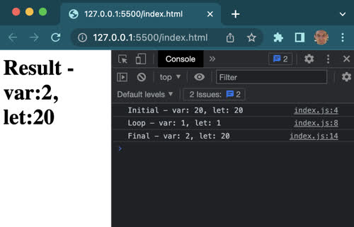

You can use the debugger console window to inspect variables without using the console.log function from your code. For example, if you type varCount in the console window it will print out the current value of varCount. You can also execute JavaScript directly in the console window. For example, if you type `varCount = 50` and press `Enter` it will change the current value of varCount.


## Browser debugging

Console.log debugging is great for times when you just need to quickly see what is going on in your code, but to really understand the code as it executes you want to use the full capabilities of the browser's debugger.

Using the same setup we used for console.log debugging, open up Chrome's browser debugger, but this time select the source tab. This will display the source files that comprise the currently rendered content.


You can either select `index.js` from the source view on the left, or press `CTRL-P` (on Windows) or `⌘-P` (on Mac) and then select `index.js` from the list that pops up. Then set a breakpoint on line 4 by clicking on the line number on the left of the displayed source code. This makes it so that the execution of code will pause whenever that line is executed. Refreshing the browser window will cause `index.js` to reload and pause on the breakpoint.


With the browser paused in the debugger you can move your mouse cursor over a variable to see its value, see what variables are in scope, set watches on variables, or use the console to interact with the code.

This gives you complete control to inspect what the JavaScript code is doing and experiment with possible alternative directions for the code. Take some time to poke around in the debugger. Learning how to exploit its functionality will make you a much better web developer.


# Simon JavaScript


This deliverable demonstrates the use of basic JavaScript for interactivity. This addition makes the application completely functional. The application has a login (home), game play, high scores, and about page. Each page contains a header that provides navigation between the pages, and a footer that references the source repository.

## Adding JavaScript

The major changes to the application include the introduction of `login.js`, `play.js`, and `scores.js`. When a user enters their login name, `login.js` puts that name in the browser's local storage so that it is available the next time they use the application. `play.js` controls all the game interactions and stores the resulting score in the browser's local storage. `scores.js` retrieves the high scores from local storage so that they can be displayed.

You can view this application running here: [Example Simon JavaScript](https://simon-javascript.cs260.click)


## Study this code

Get familiar with what the example code teaches.

- Clone the repository to your development environment.

  ```sh
  git clone https://github.com/webprogramming260/simon-javascript.git
  ```

- Review the code and get comfortable with everything it represents.
- View the code in your browser by hosting it using the VS Code Live Server extension.
- Make modifications to the code as desired. Experiment and see what happens.

## Make your own version

- Using VS Code, open the `simon` directory for the repository you used for the last Simon assignment.
- Modify the project to use JavaScript. Refer to the example class application repository for guidance. Remember that you do not need to create an original work. Just focus on learning the concepts that the example project provides. However, you will learn more if you type everything out, and not just copy and paste the code.
- Set the footer link to point to your code repository. (e.g. https://github.com/yourname/simon)
- Periodically commit and push your code to your repository as you hit different milestones. (4 commits are required for full credit.)
- Periodically deploy to your production environment using a copy of the `deployFiles.sh` script found in the [example class application](https://github.com/webprogramming260/simon-javascript/blob/main/deployFiles.sh). Take some time to understand how it works.

  ```sh
  ./deployFiles.sh -k <yourpemkey> -h <yourdomain> -s simon
  ```

  For example,

  ```sh
  ./deployFiles.sh -k ~/keys/production.pem -h yourdomain.click -s simon
  ```

- Update your `start up` repository README.md to record and reflect on what you learned.
- When you have completed your version. Do a final push of your code and deploy to your production environment using the `deployFiles.sh` script.
- Make sure your project is visible from your production environment (e.g. https://simon.yourdomain.click).
- Submit the URL to your production environment for grading using the Canvas assignment page.

## Grading Rubric

- 60% - Valid game play
- 20% - Capture and store username in scores
- 10% - At least four Git commits for the project (Initial, milestone, ..., milestone, final)
- 10% - Notes in your `start up` repository README.md about what you have learned


# Start up deliverable - JavaScript

Now that you have learned how to make an application interactive, it is time to add some JavaScript to your start up application. The main thing you should focus on in this deliverable is making your application minimally viable. The application doesn't have to do everything it will do once you are done, but it should be completely usable to some extent at this point.

You must use the same start up GitHub repository that you created with your earlier start up deliverables. Update the README.md file with things that you learn as you work on your start up. As you make changes to your HTML, CSS, and JavaScript commit those changes and push them to GitHub. You will need at least four commits to get full credit, but in reality you should have many more than that. If you are using pair programming then your commit history should reflect contributions from all contributing peers.

Remember to use the `VS Code Live Server` extension to see what your code looks like in the browser. Also use the browser's debugger window to debug your CSS and JavaScript.

Once you have developed your application to where you want it, you need to release it to your production environment. **Replace** your previous start up deployment script with a copy of the `deployService.sh` script from the [Simon JavaScript repository](https://github.com/webprogramming260/simon-javascript/blob/main/deployFiles.sh) and use `startup` for the service parameter (`-s`)

```sh
./deployService.sh -k <yourpemkey> -h <yourdomain> -s startup
```

For example,

```sh
./deployService.sh -k ~/keys/production.pem -h yourdomain.click -s startup
```

Doing this will make this deliverable of your start up available from `https://startup.yourdomainname`.

## ☑ Assignment

1. Add significant use of JavaScript to your start up application. Make sure all authors of the code are attributed in the application and that there is a link to your GitHub repository.
1. Periodically commit and push your code to GitHub.
1. Periodically update your start up repository's README.md file to reflect what you have learned and want to remember.
1. Push your final version of your project to GitHub.
1. Deploy your start up application to your production environment (your server).
1. Make sure your application is available from your production environment.
1. Upload the URL to your start up application to the Canvas assignment.

## Grading Rubric

- 60% - Significant use of JavaScript to create a minimally viable working application.
- 20% - Your start up application is hosted on your web server and is accessible using a subdomain of your domain name using HTTPS.
- 10% - Multiple Git commits with meaningful comments.
- 10% - Notes in your start up Git repository README.md file documenting what you have learned using JavaScript.

## Go celebrate

You did it! This is a significant milestone. Time to grab some friends, show them what you did, and celebrate with ice cream.


# Web services introduction

Up to this point, your entire application is loaded from your web server and ran on the user's browser. It starts when the browser requests the `index.html` file from the web server. The `index.html`, in turn references other HTML, CSS, JavaScript, or image files. All of these files, that are running on the browser, comprise the `front-end` of your application.

Notice that when the front-end requests the application files from the web server it is using the HTTPS protocol. All web programming requests between devices use HTTPS to exchange data.

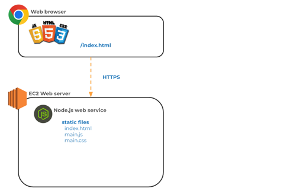

From our front-end Javascript we can make requests to external services running anywhere in the world. This allows us to get external data, such as an inspirational quote, that we then inject into the DOM for the user to read. To make a web service request, we supply the URL of the web service to the `fetch` function that is built into the browser.

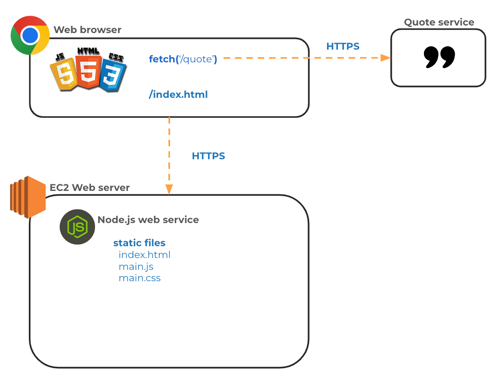

The next step in building a full stack web application, is to create our own web service. Our web service will provide the static front-end files along with functions to handle `fetch` requests for things like storing data persistently, providing security, running tasks, executing application logic that you don't want your user to be able to see, and communicating with other users. The functionality provided by your web service represents the `back-end` of your application.

Generally the functions provided by a web service are called `endpoints`, or sometimes APIs. You access the web service endpoints from your front-end JavaScript with the fetch function. In the picture below, the back-end web service is not only providing the static files that make up the front-end, but also providing the web service endpoints that the front-end calls to do things like get a user, create a user, or get high scores.

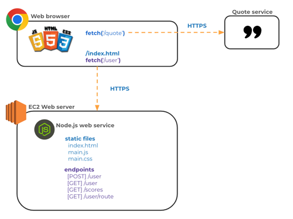

The back-end web service can also use `fetch` to make requests to other web services. For example, in the image below the front-end uses fetch to request the user's data from the back-end web service. The back-end then uses fetch to call two other web services, one to get the user's data from the database, and another one to request subway routes that are near the user's home. That data is then combined together by the back-end web service and returned to the front-end for display in the browser.

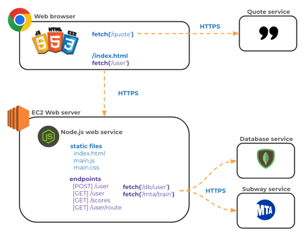

In following instruction we will discuss, how to use fetch, HTTP, URLs, and build a web service using the Node.js application. With all of this in place your application will be a full stack application comprised of both a front-end and a back-end.


# URL

📖 **Deeper dive reading**: [MDN What is a URL](https://developer.mozilla.org/en-US/docs/Learn/Common_questions/What_is_a_URL)

The Uniform Resource Locator (URL) represents the location of a web resource. A web resource can be anything, such as a web page, font, image, video stream, database record, or JSON object. It can also be completely ephemeral, such as a visitation counter, or gaming session.

Looking at the different parts of a URL is a good way to understand what it represents. Here is an example URL that represents the summary of accepted CS 260 BYU students that is accessible using secure HTTP.

```js
https://byu.edu:443/cs/260/student?filter=accepted#summary
```

The URL syntax uses the following convention. Notice the delimiting punctuation between the parts of the URL. Most parts of the URL are optional. The only ones that are required are the scheme, and the domain name.

```yaml
<scheme>://<domain name>:<port>/<path>?<parameters>#<anchor>
```

| Part        | Example                              | Meaning                                                                                                                                                                                                                                                                             |
| ----------- | ------------------------------------ | ----------------------------------------------------------------------------------------------------------------------------------------------------------------------------------------------------------------------------------------------------------------------------------- |
| Scheme      | https                                | The protocol required to ask for the resource. For web applications, this is usually HTTPS. But it could be any internet protocol such as FTP or MAILTO.                                                                                                                            |
| Domain name | byu.edu                              | The domain name that owns the resource represented by the URL.                                                                                                                                                                                                                      |
| Port        | 3000                                 | The port specifies the numbered network port used to connect to the domain server. Lower number ports are reserved for common internet protocols, higher number ports can be used for any purpose. The default port is 80 if the scheme is HTTP, or 443 if the scheme is HTTPS.     |
| Path        | /school/byu/user/8014                | The path to the resource on the domain. The resource does not have to physically be located on the file system with this path. It can be a logical path representing endpoint parameters, a database table, or an object schema.                                                    |
| Parameters  | filter=names&highlight=intro,summary | The parameters represent a list of key value pairs. Usually it provides additional qualifiers on the resource represented by the path. This might be a filter on the returned resource or how to highlight the resource. The parameters are also sometimes called the query string. |
| Anchor      | summary                              | The anchor usually represents an sub-location in the resource. For HTML pages this represents a request for the browser to automatically scroll to the element with an ID that matches the anchor. The anchor is also sometimes called the hash, or fragment ID.                    |

Technically you can also provide a user name and password before the domain name. This was used historically to authenticate access, but for security reasons this is deprecated. However, you will still see this convention for URLs that represent database connection strings.

## URL, URN, and URI

You will sometimes hear the use of URN or URI when talking about web resources. A Uniform Resource Name (URN) is a unique resource name that does not specify location information. For example, a book URN might be `urn:isbn:10,0765350386`. A Uniform Resource Identifier (URI) is a general resource identifier that could refer to either a URL and URN. With web programming you are almost always talking about URLs and therefore you should not use the more general URI.


# Ports

When you connect to a device on the internet you need both an IP address and a numbered port. Port numbers allow a single device to support multiple protocols (e.g. HTTP, HTTPS, FTP, or SSH) as well as different types of services (e.g. search, document, or authentication). The ports may be exposed externally, or they may only be used internally on the device. For example, the HTTPS port (443) might allow the world to connect, the SSH port (22) might only allow computers at your school, and a service defined port (say 3000) may only allow access to processes running on the device.

The internet governing body, IANA, defines the standard usage for port numbers. Ports from 0 to 1023 represent standard protocols. Generally a web service should avoid these ports unless it is providing the protocol represented by the standard. Ports from 1024 to 49151 represent ports that have been assigned to requesting entities. However, it is very common for these ports to be used by services running internally on a device. Ports from 49152 to 65535 are considered dynamic and are used to create dynamic connections to a device. [Here](https://www.iana.org/assignments/service-names-port-numbers/service-names-port-numbers.xhtml) is the link to IANA's registry.

Here is a list of common port numbers that you might come across.

| Port | Protocol                                                                                           |
| ---- | -------------------------------------------------------------------------------------------------- |
| 20   | File Transfer Protocol (FTP) for data transfer                                                     |
| 22   | Secure Shell (SSH) for connecting to remote devices                                                |
| 25   | Simple Mail Transfer Protocol (SMTP) for sending email                                             |
| 53   | Domain Name System (DNS) for looking up IP addresses                                               |
| 80   | Hypertext Transfer Protocol (HTTP) for web requests                                                |
| 110  | Post Office Protocol (POP3) for retrieving email                                                   |
| 123  | Network Time Protocol (NTP) for managing time                                                      |
| 161  | Simple Network Management Protocol (SNMP) for managing network devices such as routers or printers |
| 194  | Internet Relay Chat (IRC) for chatting                                                             |
| 443  | HTTP Secure (HTTPS) for secure web requests                                                        |

## Your ports

As an example of how ports are used we can look at your web server. When you built your web server you externally exposed port 22 so that you could use SSH to open a remote console on the server, port 443 for secure HTTP communication, and port 80 for unsecure HTTP communication.


Your web service, Caddy, is listening on ports 80 and 443. When Caddy gets a request on port 80, it automatically redirects the request to port 443 so that a secure connection is used. When Caddy gets a request on port 443 it examines the path provided in the HTTP request (as defined by the URL) and if the path matches a static file, it reads the file off disk and returns it. If the HTTP path matches one of the definitions it has for a gateway service, Caddy makes a connection on that service's port (e.g. 3000 or 4000) and passes the request to the service.

Internally on your web server, you can have as many web services running as you would like. However, you must make sure that each one uses a different port to communicate on. You run your Simon service on port 3000 and therefore **cannot** use port 3000 for your start up service. Instead you use port 4000 for your start up service. It does not matter what high range port you use. It only matters that you are consistent and that they are only used by one service.


# HTTP

📖 **Deeper dive reading**: [MDN An overview of HTTP](https://developer.mozilla.org/en-US/docs/Web/HTTP/Overview)

HTTP is how the web talks. When a web browser makes a request to a web server it does it using the HTTP protocol. In previous instruction we discussed how to use HTTP. Now, we will talk about the internals of HTTP. Just like becoming fluent in a foreign language make a visit to another country more enjoyable, understanding how to speak HTTP helps you communicate effectively when talking on the web.

When a web client (e.g. a web browser) and a web server talk they exchange HTTP requests and responses. The browser will make an HTTP request and the server will generate an HTTP response. You can see the HTTP exchange by using the browser's debugger or by using a console tool like Curl. For example, in your console you can use curl to make the following request.

```sh
curl -v -s http://info.cern.ch/hypertext/WWW/Helping.html
```

### Request

The HTTP request for the above command would look like the following.

```http
GET /hypertext/WWW/Helping.html HTTP/1.1
Host: info.cern.ch
Accept: text/html
```

An HTTP request has this general syntax.

```yaml
<verb> <url path, parameters, anchor> <version>
[<header key: value>]*
[

  <body>
]
```

The first line of the HTTP request contains the `verb` of the request, followed by the path, parameters, and anchor of the URL, and finally the version of HTTP being used. The following lines are optional headers that are defined by key value pairs. After the headers you have an optional body. The body start is delimited from the headers with two new lines.

In the above example, we are asking to `GET` a resource found at the path `/hypertext/WWW/Helping.html`. The version used by the request is `HTTP/1.1`. This is followed by two headers. The first specifies the requested host (i.e. domain name). The second specifies what type of resources the client will accept. The resource type is always a [MIME type](https://developer.mozilla.org/en-US/docs/Web/HTTP/Basics_of_HTTP/MIME_types) as defined by internet governing body IANA. In this case we are asking for HTML.

### Response

The response to the above request looks like this.

```yaml
HTTP/1.1 200 OK
Date: Tue, 06 Dec 2022 21:54:42 GMT
Server: Apache
Last-Modified: Thu, 29 Oct 1992 11:15:20 GMT
ETag: "5f0-28f29422b8200"
Accept-Ranges: bytes
Content-Length: 1520
Connection: close
Content-Type: text/html

<TITLE>Helping -- /WWW</TITLE>
<NEXTID 7>
<H1>How can I help?</H1>There are lots of ways you can help if you are interested in seeing
the <A NAME=4 HREF=TheProject.html>web</A> grow and be even more useful...
```

An HTTP response has the following syntax.

```yaml
<version> <status code> <status string>
[<header key: value>]*
[

  <body>
]
```

You can see that the response syntax is similar to the request syntax. The major difference is that the first line represents the version and the status of the response.

Understanding the meaning of the common HTTP verbs, status codes, and headers is important for you to understand, as you will use them in developing a web application. Take some time to internalize the following common values.

## Verbs

There are several verbs that describe what the HTTP request is asking for. The list below only describes the most common ones.

| Verb    | Meaning                                                                                                                                                                                                                                                  |
| ------- | -------------------------------------------------------------------------------------------------------------------------------------------------------------------------------------------------------------------------------------------------------- |
| GET     | Get the requested resource. This can represent a request to get a single resource or a resource representing a list of resources.                                                                                                                        |
| POST    | Create a new resource. The body of the request contains the resource. The response should include a unique ID of the newly created resource.                                                                                                             |
| PUT     | Update a resource. Either the URL path, HTTP header, or body must contain the unique ID of the resource being updated. The body of the request should contain the updated resource. The body of the response may contain the resulting updated resource. |
| DELETE  | Delete a resource. Either the URL path or HTTP header must contain the unique ID of the resource to delete.                                                                                                                                              |
| OPTIONS | Get metadata about a resource. Usually only HTTP headers are returned. The resource itself is not returned.                                                                                                                                              |

## Status codes

It is important that you use the standard HTTP status codes in your HTTP responses so that the client of a request can know how to interpret the response. The codes are partitioned into five blocks.

- 1xx - Informational.
- 2xx - Success.
- 3xx - Redirect to some other location, or that the previously cached resource is still valid.
- 4xx - Client errors. The request is invalid.
- 5xx - Server errors. The request cannot be satisfied due to an error on the server.

Within those ranges here are some of the more common codes. See the [MDN documentation](https://developer.mozilla.org/en-US/docs/Web/HTTP/Status) for a full description of status codes.

| Code | Text                                                                                 | Meaning                                                                                                                           |
| ---- | ------------------------------------------------------------------------------------ | --------------------------------------------------------------------------------------------------------------------------------- |
| 100  | Continue                                                                             | The service is working on the request                                                                                             |
| 200  | Success                                                                              | The requested resource was found and returned as appropriate.                                                                     |
| 201  | Created                                                                              | The request was successful and a new resource was created.                                                                        |
| 204  | No Content                                                                           | The request was successful but no resource is returned.                                                                           |
| 304  | Not Modified                                                                         | The cached version of the resource is still valid.                                                                                |
| 307  | Permanent redirect                                                                   | The resource is no longer at the requested location. The new location is specified in the response location header.               |
| 308  | Temporary redirect                                                                   | The resource is temporarily located at a different location. The temporary location is specified in the response location header. |
| 400  | Bad request                                                                          | The request was malformed or invalid.                                                                                             |
| 401  | Unauthorized                                                                         | The request did not provide a valid authentication token.                                                                         |
| 403  | Forbidden                                                                            | The provided authentication token is not authorized for the resource.                                                             |
| 404  | Not found                                                                            | An unknown resource was requested.                                                                                                |
| 408  | Request timeout                                                                      | The request takes too long.                                                                                                       |
| 409  | Conflict                                                                             | The provided resource represents an out of date version of the resource.                                                          |
| 418  | [I'm a teapot](https://en.wikipedia.org/wiki/Hyper_Text_Coffee_Pot_Control_Protocol) | The service refuses to brew coffee in a teapot.                                                                                   |
| 429  | Too many requests                                                                    | The client is making too many requests in too short of a time period.                                                             |
| 500  | Internal server error                                                                | The server failed to properly process the request.                                                                                |
| 503  | Service unavailable                                                                  | The server is temporarily down. The client should try again with an exponential back off.                                         |

## Headers

📖 **Deeper dive reading**: [MDN HTTP headers](https://developer.mozilla.org/en-US/docs/Web/HTTP/Headers)

HTTP headers specify metadata about a request or response. This includes things like how to handle security, caching, data formats, and cookies. Some common headers that you will use include the following.

| Header                      | Example                              | Meaning                                                                                                                                                                        |
| --------------------------- | ------------------------------------ | ------------------------------------------------------------------------------------------------------------------------------------------------------------------------------ |
| Authorization               | Bearer bGciOiJIUzI1NiIsI             | A token that authorized the user making the request.                                                                                                                           |
| Accept                      | image/\*                             | What content format the client accepts. This may include wildcards.                                                                                                            |
| Content-Type                | text/html; charset=utf-8             | The format of the response content. These are described using standard [MIME](https://developer.mozilla.org/en-US/docs/Web/HTTP/Basics_of_HTTP/MIME_types/Common_types) types. |
| Cookie                      | SessionID=39s8cgj34; csrftoken=9dck2 | Key value pairs that are generated by the server and stored on the client.                                                                                                     |
| Host                        | info.cern.ch                         | The domain name of the server. This is required in all requests.                                                                                                               |
| Origin                      | cs260.click                          | Identifies the origin that caused the request. A host may only allow requests from specific origins.                                                                           |
| Access-Control-Allow-Origin | https://cs260.click                  | Server response of what origins can make a request. This may include a wildcard.                                                                                               |
| Content-Length              | 368                                  | The number of bytes contained in the response.                                                                                                                                 |
| Cache-Control               | public, max-age=604800               | Tells the client how it can cache the response.                                                                                                                                |
| User-Agent                  | Mozilla/5.0 (Macintosh)              | The client application making the request.                                                                                                                                     |

## Body

The format of the body of an HTTP request or response is defined by the `Content-Type` header. For example, it may be HTML text (text/html), a binary image format (image/png), JSON (application/json), or JavaScript (text/javascript). A client may specify what formats it accepts using the `accept` header.

## Cookies


📖 **Deeper dive reading**: [MDN Using HTTP cookies](https://developer.mozilla.org/en-US/docs/Web/HTTP/Cookies)

HTTP itself is stateless. This means that one HTTP request does not know anything about a previous or future request. However, that does not mean that a server or client cannot track state across requests. One common method for tracking state is the `cookie`. Cookies are generated by a server and passed to the client as an HTTP header.

```http
HTTP/2 200
Set-Cookie: myAppCookie=tasty; SameSite=Strict; Secure; HttpOnly
```

The client then caches the cookie and returns it as an HTTP header back to the server on subsequent requests.

```http
HTTP/2 200
Cookie: myAppCookie=tasty
```

This allows the server to remember things like the language preference of the user, or the user's authentication credentials. A server can also use cookies to track, and share, everything that a user does. However, there is nothing inherently evil about cookies, the problem comes from web applications that use them as a means to violate a user's privacy or inappropriately monetize their data.

## HTTP Versions

HTTP continually evolves in order to increase performance and support new types of applications. You can read about the evolution of HTTP on [MDN](https://developer.mozilla.org/en-US/docs/Web/HTTP/Basics_of_HTTP/Evolution_of_HTTP).

| Year | Version | Features                                        |
| ---- | ------- | ----------------------------------------------- |
| 1990 | HTTP0.9 | one line, no versions, only get                 |
| 1996 | HTTP1   | get/post, header, status codes, content-type    |
| 1997 | HTTP1.1 | put/patch/delete/options, persistent connection |
| 2015 | HTTP2   | multiplex, server push, binary representation   |
| 2022 | HTTP3   | QUIC for transport protocol, always encrypted   |


# SOP and CORS

📖 **Deeper dive reading**:

- [MDN Same origin policy](https://developer.mozilla.org/en-US/docs/Web/Security/Same-origin_policy)
- [MDN Cross origin resource sharing](https://developer.mozilla.org/en-US/docs/Web/HTTP/CORS)

Security should always be on your mind when you are working with the web. The ability to provide services to a global audience makes the information on the web very valuable, and therefore an attractive target for nefarious parties. When website architecture and browser clients were still in their infancy they allowed JavaScript to make requests from one domain while displaying a website from a different domain. These are called cross-origin requests.

Consider the following example. An attacker sends out an email with a link to a hacker website (`byu.iinstructure.com`) that is similar to the real course website. Notice the additional `i`. If the hacker website could request anything from the real website then it could make itself appear and act just like the real education website. All it would have to do is request images, html, and login endpoints from the course's website and display the results on the hacker website. This would give the hacker access to everything the user did.

To combat this problem the `Same Origin Policy` (SOP) was created. Simply stated SOP only allows JavaScript to make requests to a domain if it is the same domain that the user is currently viewing. A request from `byu.iinstructure.com` for service endpoints that are made to `byu.instructure.com` would fail because the domains do not match. This provides significant security, but it also introduces complications when building web applications. For example, if you want build a service that any web application can use it would also violate the SOP and fail. In order to address this, the concept of Cross Origin Resource Sharing (CORS) was invented.

CORS allows the client (e.g. browser) to specify the origin of a request and then let the server respond with what origins are allowed. The server may say that all origins are allowed, for example if they are a general purpose image provider, or only a specific origin is allowed, for example if they are a bank's authentication service. If the server doesn't specify what origin is allowed then the browser assumes that it must be the same origin.

Going back to our hacker example, the HTTP request from the hacker site (`byu.iinstructure.com`) to the course's authentication service (`byu.instructure.com`) would look like the following.

```http
GET /api/auth/login HTTP/2
Host: byu.instructure.com
Origin: https://byu.iinstructure.com
```

In response the banking website would return:

```http
HTTP/2 200 OK
Access-Control-Allow-Origin: https://byu.instructure.com
```

The browser would then see that the actual origin of the request does not match the allowed origin and so the browser blocks the response and generates an error.

Notice that with CORS, it is the browser that is protecting the user from accessing the banking website's authentication endpoint from the wrong origin. CORS is only meant to alert the user that something nefarious is being attempted. A hacker can still proxy requests through their own server to the banking website and completely ignore the `Access-Control-Allow-Origin` header. Therefore the banking website needs to implement its own precautions to stop a hacker for using its services inappropriately.

## Using third party services

When you make requests to your own web services you are always on the same origin and so you will not violate the SOP. However, if you want to make requests to a different domain than the one your web application is hosted on, then you need to make sure that domain allows requests as defined by the `Access-Control-Allow-Origin` header it returns. For example, if I have JavaScript in my web application loaded from `cs260.click` that makes a fetch request for an image from the website `i.picsum.photos` the browser will fail the request with an HTTP status code of 403 and an error message that CORS has blocked the request.


That happens because `i.picsum.photos` does not return an `Access-Control-Allow-Origin` header. Without a header the browser assumes that all requests must be made from the same origin.

If your web application instead makes a service request to `icanhazdadjoke.com` to get a joke, that request will succeed because `icanhazdadjoke.com` returns an `Access-Control-Allow-Origin` header with a value of `*` meaning that any origin can make requests to this service.

```http
HTTP/2 200
access-control-allow-origin: *

Did you hear about the bread factory burning down? They say the business is toast.
```

This would have also succeeded if the HTTP header had explicitly listed your web application domain. For example, if you make your request from the origin `cs260.click` the following response would also satisfy CORS.

```http
HTTP/2 200
access-control-allow-origin: https://cs260.click

I’ll tell you something about German sausages, they’re the wurst
```

This all means that you need to test the services you want to use before you include them in your application. Make sure they are responding with `*` or your calling origin. If they do not then you will not be able to use them.


# Fetch

🔑 **Recommended reading**: [MDN Using the Fetch API](https://developer.mozilla.org/en-US/docs/Web/API/Fetch_API/Using_Fetch)

The ability to make HTTP requests from JavaScript is one of the main technologies that changed the web from static content pages (Web 1.0) to one of web applications (Web 2.0) that fully interact with the user. Microsoft introduced the first API for making HTTP requests from JavaScript with the [XMLHttpRequest API](https://developer.mozilla.org/en-US/docs/Web/API/XMLHttpRequest).

Today, the [fetch API](https://developer.mozilla.org/en-US/docs/Web/API/Fetch_API) is the preferred way to make HTTP requests. The `fetch` function is built into the browser's JavaScript runtime. This means you can call it from JavaScript code running in a browser.

The basic usage of fetch takes a URL and returns a promise. The promise `then` function takes a callback function that is asynchronously called when the requested URL content is obtained. If the returned content is of type `application/json` you can use the `json` function on the response object to convert it to a JavaScript object.

The following example makes a fetch request to get and display an inspirational quote.

```js
fetch('https://api.quotable.io/random')
  .then((response) => response.json())
  .then((jsonResponse) => {
    console.log(jsonResponse);
  });
```

**Response**

```js
{
  content: 'Never put off till tomorrow what you can do today.',
  author: 'Thomas Jefferson',
};
```

To do a POST request you populate the options parameter with the HTTP method and headers.

```js
fetch('https://jsonplaceholder.typicode.com/posts', {
  method: 'POST',
  body: JSON.stringify({
    title: 'test title',
    body: 'test body',
    userId: 1,
  }),
  headers: {
    'Content-type': 'application/json; charset=UTF-8',
  },
})
  .then((response) => response.json())
  .then((jsonResponse) => {
    console.log(jsonResponse);
  });
```

## ☑ Assignment

Create a fork of this [CodePen](https://codepen.io/leesjensen/pen/ExRoqPz) and experiment.

Replace the quotable service call with a different one. Here are some suggestions.

- **Quote** - https://api.quotable.io/random
- **Random user** - https://randomuser.me/api/
- **Jokes** - https://api.chucknorris.io/jokes/random
- **GitHub user** - https://api.github.com/users/octocat
- **Photos** - https://picsum.photos/id/0/info

When you are done submit your CodePen URL, along with a comment about something you found interesting, to the Canvas assignment.

Don't forget to update your GitHub start up repository README.md with all of the things you learned and want to remember.


# Service design

Web services provide the interactive functionality of your web application. They commonly authenticate users, track their session state, provide, store, and analyze data, connect peers, and aggregate user information. Making your web service easy to use, performant, and extensible are factors that determine the success of your application. A good design will result in increased productivity, satisfied users, and lower processing costs.

## Model and sequence diagrams

When first considering your service design it is helpful to model the application's primary objects and the interactions of the objects. You should attempt to stay as close to the model that is in your user's mind as possible. Avoid introducing a model that focuses on programming constructs and infrastructure. For example, a chat program should model participants, conversations, and messages. It should not model user devices, network connections, and data blobs.

Once you have defined your primary objects you can create sequence diagrams that show how the objects interact with each other. This will help clarify your model and define the necessary endpoints. You can use a simple tool like [SequenceDiagram.org](https://sequencediagram.org/index.html#initialData=C4S2BsFMAIGEAsCGxqIA5oFCcQY2APYBO0AguCLpDvsdAEIEBG25lkAtAHwDKkRAN34AuPikQDEIcIiZRMjJtz6CRY1JOmz5igDy6OHFUKLC2VDVJlzq5yPsPGRDZpa03Md5fxOjgiIhRcAgA7EwBnZBBQ6AB3MHgXFj0DIx8RWFCIqJiiSABHAFdIcJQQglAAM0ockIVmb1VTUlwqNBQ7aGCw-kjQUPqlXnTTHkQAT2gAIgAJSHBwAinoQjIKKkwnIm47YVn5xeXKogIAWySgA) to create and share diagrams.

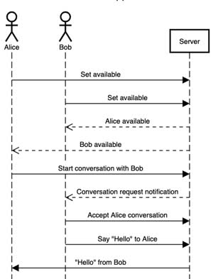

## Leveraging HTTP

Web services are usually provided over HTTP, and so HTTP greatly influences the design of the service. The HTTP verbs such as GET, POST, PUT, and DELETE often mirror the designed actions of a web service. For example, a web service for managing comments might list the comments (GET), create a comment (POST), update a comment (PUT), and delete a comment (DELETE). Likewise, the MIME content types defined by IANA are a natural fit for defining the types of content that you want to provide (e.g. HTML, PNG, MP3, and MP4). The goal is to leverage those technologies as much as possible so that you don't have to recreate the functionality they provide and instead take advantage of the significant networking infrastructure built up around HTTP. This includes caching servers that increase your performance, edge servers that bring your content closer, and replication servers that provide redundant copies of your content and make your application more resilient to network failures.

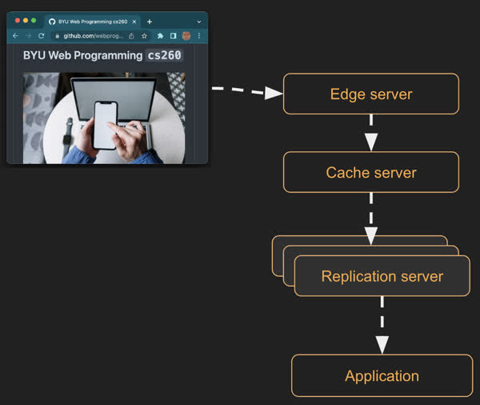

## Endpoints

A web service is usually divided up into multiple service endpoints. Each endpoint provides a single functional purpose. All of the criteria that you would apply to creating well designed code functions also applies when exposing service endpoints.

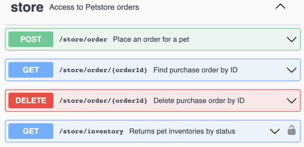

âš  Note that service endpoints are often called an Application Programming Interface (API). This is a throwback to old desktop applications and the programming interfaces that they exposed. Sometimes the term API refers to the entire collection of endpoints, and sometimes it is used to refer to a single endpoint.

Here are some things you should consider when designing your service's endpoints.

- **Grammatical** - With HTTP everything is a resource (think noun or object). You act on the resource with an HTTP verb. For example, you might have an order resource that is contained in a store resource. You then create, get, update, and delete order resources on the store resource.
- **Readable** - The resource you are referencing with an HTTP request should be clearly readable in the URL path. For example, an order resource might contain the path to both the order and store where the order resource resides: `/store/provo/order/28502`. This makes it easier to remember how to use the endpoint because it is human readable.
- **Discoverable** - As you expose resources that contain other resources you can provide the endpoints for the aggregated resources. This makes it so someone using your endpoints only needs to remember the top level endpoint and then they can discover everything else. For example, if you have a store endpoint that returns information about a store you can include an endpoint for working with a store in the response.

  ```http
  GET /store/provo  HTTP/2
  ```

  ```json
  {
    "id": "provo",
    "address": "Cougar blvd",
    "orders": "https://cs260.click/store/provo/orders",
    "employees": "https://cs260.click/store/provo/employees"
  }
  ```

- **Compatible** - When you build your endpoints you want to make it so that you can add new functionality without breaking existing clients. Usually this means that the clients of your service endpoints should ignore anything that they don't understand. Consider the two following JSON response versions.

  **Version 1**

  ```js
  {
    "name": "John Taylor"
  }
  ```

  **Version 2**

  ```js
  {
    "name": "John Taylor",
    "givenName": "John",
    "familyName": "Taylor"
  }
  ```

  By adding a new representation of the `name` field, you provide new functionality for clients that know how to use the new fields without harming older clients that ignore the new fields and simply use the old representation. This is all done without officially versioning the endpoint.

  If you are fortunate enough to be able to control all of your client code you can mark the `name` field as depreciated and in a future version remove it once all of the clients have upgraded. Usually you want to keep compatibility with at least one previous version of the endpoint so that there is enough time for all of the clients to migrate before compatibility is removed.

- **Simple** - Keeping your endpoints focused on the primary resources of your application helps to avoid the temptation to add endpoints that duplicate or create parallel access to primary resources. It is very helpful to write some simple class and sequence diagrams that outline your primary resources before you begin coding. These resources should focus on the actual resources of the system you are modeling. They should not focus on the data structure or devices used to host the resources. There should only be one way to act on a resource. Endpoints should only do one thing.

- **Documented** - The [Open API Specification](https://spec.openapis.org/oas/latest.html) is a good example of tooling that helps create, use, and maintain documentation of your service endpoints. It is highly suggested that you make use of such tools in order to provide client libraries for your endpoints and a sandbox for experimentation. Creating an initial draft of your endpoint documentation before you begin coding will help you mentally clarify your design and produce a better final result. Providing access to your endpoint documentation along with your production system helps with client implementations and facilitates easier maintenance of the service. The [Swagger Petstore](https://petstore.swagger.io/) example documentation is a reasonable example to follow.

There are many models for exposing endpoints. We will consider three common ones, RPC, REST, and GraphQL.

## RPC

Remote Procedure Calls (RPC) expose service endpoints as simple function calls. When RPC is used over HTTP it usually just leverages the POST HTTP verb. The actual verb and subject of the function call is represented by the function name. For example, `deleteOrder` or `updateOrder`. The name of the function is either the entire path of the URL or a parameter in the POST body.

```http
POST /updateOrder HTTP/2

{"id": 2197, "date": "20220505"}
```

or

```http
POST /rpc HTTP/2

{"cmd":"updateOrder", "params":{"id": 2197, "date": "20220505"}}
```

One advantage of RPC is that it maps directly to function calls that might exist within the server. This could also be considered a disadvantage as it directly exposes the inner workings of the service, and thus creates a coupling between the endpoints and the implementation.

## REST

Representational State Transfer (REST) attempts to take advantage of the foundational principles of HTTP. This is not surprising considering the principle author of REST, Roy Fielding, was also a contributor to the HTTP specification. REST HTTP verbs always act upon a resource. Operations on a resource impact the state of the resource as it is transferred by a REST endpoint call. This allows for the caching functionality of HTTP to work optimally. For example, GET will always return the same resource until a PUT is executed on the resource. When PUT is used, the cached resource is replaced with the updated resource.

With REST the updateOrder endpoint would look like the following.

```http
PUT /order/2197 HTTP/2

{"date": "20220505"}
```

Where the proper HTTP verb is used and the URL path uniquely identifies the resource. These seem like small differences, but maximizing HTTP pays dividends by making it easy for HTTP infrastructure, such as caching, to work properly.

There are several other pieces of [Fielding's dissertation](https://www.ics.uci.edu/~fielding/pubs/dissertation/top.htm) on REST, such as hypermedia, that are often quoted as being required for a truly "restful" implementation, and these are just as often ignored.

## GraphQL

GraphQL focuses on the manipulation of data instead of a function call (RPC) or a resource (REST). The heart of GraphQL is a query that specifies the desired data and how it should be joined and filtered. GraphQL was developed to address frustration concerning the massive number of REST, or RPC calls, that a web application client needed to make in order to support even a simple UI widget.

Instead of making a call for getting a store, and then a bunch of calls for getting the store's orders and employees, GraphQL would send a single query that would request all of that information in one big JSON response. The server would examine the query, join the desired data, and then filter out anything that was not wanted.

Here is an example GraphQL query.

```graphql
query {
  getOrder(id: "2197") {
    orders(filter: { date: { allofterms: "20220505" } }) {
      store
      description
      orderedBy
    }
  }
}
```

GraphQL helps to remove a lot of the logic for parsing endpoints and mapping requests to specific resources. Basically in GraphQL there is only one endpoint. The query endpoint.

The downside of that flexibility is that the client now has significant power to consume resources on the server. There is no clear boundary on what, how much, or how complicated the aggregation of data is. It also is difficult for the server to implement authorization rights to data as they have to be baked into the data schema. However, there are standards for how to define a complex schema. Common GraphQL packages provide support for schema implementations along with database adaptors for query support.


# Node.js


In 2009 Ryan Dahl created `Node.js`. It was the first successful application for deploying JavaScript outside of a browser. This changed the JavaScript mindset from a browser technology to one that could run on the server as well. This means that JavaScript can power your entire technology stack. One language to rule them all. Node.js is often just referred to as Node, and is currently maintained by the [Open.js Foundation](https://openjsf.org/).


> “You can never understand everything. But, you should push yourself to understand the systemâ€
>
> — Ryan Dahl

Browsers run JavaScript using a JavaScript interpreter and execution engine. For example, Chromium based browsers all use the [V8](https://v8.dev/) engine created by Google. Node.js simply took the V8 engine and ran it inside of a console application. When you run a JavaScript program in Chrome or Node.js, it is V8 that reads your code and executes it. With either program wrapping V8, the result is the same.

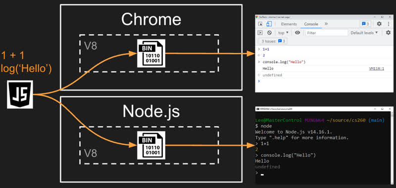

## Installing NVM and Node.js

Your production environment web server comes with Node.js already install. However, you will need to install Node.js in your development environment if you have not already. The easiest way to install Node.js is to first install the `Node Version Manager` (NVM) and use it to install, and manage, Node.js.

### Installing on Windows

If you are using Windows, then follow the installation instructions from the [windows-nvm](https://github.com/coreybutler/nvm-windows#installation--upgrades) repository. Click on `latest installer` and then scroll down to the `Assets` and download and execute nvm-setup.exe. Once the installation is complete, you will need to open a new console window so that it gets the updated path that includes NVM.

In the console application install the long term support (LTS) version of Node.

```sh
➜ nvm install lts
➜ nvm use lts
```

### Installing on Linux or MacOS

If you are using Linux or MacOS then you can install NVM with the following console commands.

```sh
➜ curl -o- https://raw.githubusercontent.com/nvm-sh/nvm/v0.39.3/install.sh | bash

➜ . ~/.nvm/nvm.sh
```

In the console application install the long term support (LTS) version of Node.

```sh
➜ nvm install --lts
```

## Checking that Node is installed

The node.js console application is simply called `node`. You can verify that Node is working correctly by running node with the `-v` parameter. Note that your version might be different than what is shown here. As long as it is a LTS version you should be fine.

```sh
➜ node -v
v18.13.0
```

## Running programs

You can execute a line of JavaScript with Node.js from your console with the `-e` parameter.

```sh
➜  node -e "console.log(1+1)"
2
```

However, to do real work you need to execute an entire project composed of dozens or even hundreds of JavaScript files. You do this by creating a single starting JavaScript file, named something like `main.js`, that references the code found in the rest your project. You then execute your code by running `node` with main.js as a parameter. For example, with the following JavaScript saved to a file named `main.js`

```js
function countdown() {
  let i = 0;
  while (i++ < 5) {
    console.log(`Counting ... ${i}`);
  }
}

countdown();
```

We can execute the JavaScript by passed the file to node, and receive the following result.

```sh
➜  node main.js
Counting ... 1
Counting ... 2
Counting ... 3
Counting ... 4
Counting ... 5
```

You can also run node in interpretive mode by executing it without any parameters and then typing your JavaScript code directly into the interpreter.

```sh
➜ node
Welcome to Node.js v16.15.1.
> 1+1
2
> console.log('hello')
hello
```

## Node package manager

While you could write all of the JavaScript for everything you need, it is always helpful to use preexisting packages of JavaScript for implementing common tasks. To load a package using Node.js you must take two steps. First install the package locally on your machine using the Node Package Manager (NPM), and then include a `require` statement in your code that references the package name. NPM is automatically installed when you installed Node.js.

NPM knows how to access a massive repository of preexisting packages. You can search for packages on the [NPM website](https://www.npmjs.com/). However, before you start using NPM to install packages you need to initialize you code to use NPM. This is done by creating a directory that will contain your JavaScript and then running `npm init`. NPM will step you through a series of questions about the project you are creating. You can press the return key for each of questions if you want to accept the defaults. If you are always going to accept all of the defaults you can use `npm init -y` and skip the Q&A.

```sh
➜  mkdir npmtest
➜  cd npmtest
➜  npm init -y
```

## Package.json

If you list the files in directory you will notice that it has created a file named `package.json`. This file contains three main things: 1) Metadata about your project such as its name and the default entry JavaScript file, 2) commands that you can execute to do things like run, test, or distribute your code, and 3) packages that this project depends upon. With NPM initialized to work with your project, you can now use it to install a node package. As a simple example, we will install a package that knows how to tell jokes. This package is called `give-me-a-joke`. You can search for it on the [NPM website](https://www.npmjs.com/), see how often it is installed, examine the source code, and learn about who created it. You install the package using `npm install` followed by the name of the package.

```sh
➜  npm install give-me-a-joke
```

If you again examine the contents of the `package.json` file you will see a reference to the newly installed package dependency. If you decide you no longer want a package dependency you can always remove it with the `npm uninstall <package name here>` console command.

âš  Note that when you start installing package dependencies NPM will create an additional file named `package-lock.json` and a directory named `node-modules` in your project directory. The `node-modules` directory contains the actual JavaScript for the package and all of its dependent packages. As you install several packages this directory will start to get very large. You do **not** want to check this directory into your source control system since it is so large and can be rebuilt using the information contained in the `package.json` and `package-lock.json` files. So make sure you include `node-modules` in your `.gitignore` file.

When you clone your source code from GitHub to a new location, just run `npm install` in the project directory. This will cause NPM to download all of the previously installed packages and recreate the `node-modules` directory. The `package-lock.json` file tracks the version of the package that you installed. That way if rebuild your `node-modules` directory you will have the version of the package you initially installed and not the latest available version, which might not be compatible with your code.

With NPM and the joke package installed, you can now use the package in a JavaScript file by referencing the package name as a parameter to the `require` function. This is then followed by a call the joke object's `getRandomDadJoke` function to actually generate a joke.

```js
const giveMeAJoke = require('give-me-a-joke');
giveMeAJoke.getRandomDadJoke((joke) => {
  console.log(joke);
});
```

If we run this code using node we get the following result.

```sh
➜  node main.js
What do you call a fish with no eyes? A fsh.
```

This may seem like a lot of work but after you do it a few times it will begin to feel natural. Just remember the main steps.

1. Create your project directory
1. Initialize it for use with NPM by running `npm init -y`
1. Make sure `.gitignore` file contains `node-modules`
1. Install any desired packages with `npm install <package name here>`
1. Add `require('<package name here>')` to your JavaScript code
1. Run your code with `node main.js`

## Creating a web service

With JavaScript we can write code that listens on a server port (e.g. 8080), receives HTTP requests, processes them, and then responds. We can use this to create a simple web service that we then execute using Node.js.

The following example first initializes the use of NPM and installs the package `http`. The http package contains the functionality for listening on server ports and manipulating HTTP requests.

```sh
➜ mkdir webservicetest
➜ cd webservicetest
➜ npm init -y
➜ npm install http
```

Now we can create our HTTP server using the `http.createServer` function and provide it with a callback function that takes a request (`req`) and response (`res`) object. That function is called whenever the server receives an HTTP request. In our example, the callback always returns the same HTML snippet, with a status code of 200, and a Content-Type header, no matter what request is made. Basically this is just a simple dynamically generated HTML page. A real web service would examine the HTTP path and return meaningful content based upon the purpose of the endpoint.

The `server.listen` call starts listening on port 8080 and blocks until the program is terminated.

```js
const http = require('http');
const server = http.createServer(function (req, res) {
  res.writeHead(200, { 'Content-Type': 'text/html' });
  res.write('<h1>Hello Node.js!</h1>');
  res.end();
});

server.listen(8080, () => {
  console.log(`Web service listening on port 8080`);
});
```

We execute the program by passing our JavaScript to Node. If the service starts up correctly then it should look like the following.

```sh
➜ node main.js
Web service listening on port 8080
```

You can now open you browser and point it to `localhost:8080` and view the result. The interaction between the JavaScript, node, and the browser looks like this.

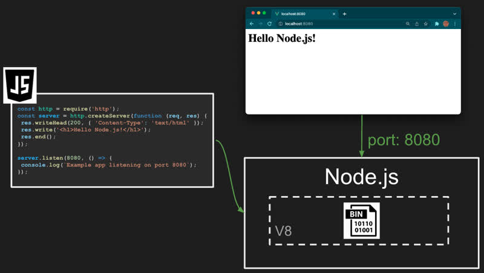

You can kill the process by pressing `CTRL-C` in the console.

## Deno and Bun

You should be aware that Ryan has created a successor to Node.js called [`Deno`](https://deno.land/). This version is more compliant with advances in ECMAScript and has significant performance enhancements. There are also competitor server JavaScript applications. One of the more interesting rising stars is called [`Bun`](https://bun.sh/). If you have the time you should learn about them.

# ☑ Assignment

Install Node.js in your development environment and run the following console commands to make sure it is running correctly.

```sh
➜ node -v
➜ npm -g list
➜ nvm ls
```

Then create, and run, a simple web service using the instructions given above. Change the HTML output to something that reflects your personality.

When you are done copy your code to CodePen submit the CodePen URL, along with a comment about something you found interesting, to the Canvas assignment.

Note that your Node.js code will not work in CodePen, but by saving it there, you will have a persistent copy of it.


# Express


📖 **Deeper dive reading**: [MDN Express/Node introduction](https://developer.mozilla.org/en-US/docs/Learn/Server-side/Express_Nodejs/Introduction)

In the previous instruction you saw how to use Node.js to create a simple web server. This works great for little projects where you are trying to quickly serve up some web content, but to build a production ready application you need a framework with a bit more functionality for easily implementing a full web service. This is where the Node package `Express` come in. Express provides support for:

1. Routing requests for service endpoints
1. Manipulating HTTP requests with JSON body content
1. Generating HTTP responses
1. Using `middleware` to add functionality

Express was created by TJ Holowaychuk and is currently maintained by the [Open.js Foundation](https://openjsf.org/).


> “People tell you to not reinvent things, but I think you should … it will teach you thingsâ€
>
> — TJ Holowaychuk

Everything in Express revolves around creating and using HTTP routing and middleware functions.
You create an Express application by using NPM to install the Express package and then calling the `express` constructor to create the express application and listen for HTTP requests on a desired port.

```sh
➜ npm install express
```

```js
const express = require('express');
const app = express();

app.listen(8080);
```

With the app object you can now add HTTP routing and middleware functions to the application.

## Defining routes

HTTP endpoints are implemented in Express by defining routes that call a function based upon an HTTP path. The Express app object supports all of the HTTP verbs as functions on the object. For example, if you want to have a route function that handles an HTTP GET request for the URL path `/store/provo` you would call the `get` method on the app.

```js
app.get('/store/provo', (req, res, next) => {
  res.send({ name: 'provo' });
});
```

The `get` function takes two parameters, a URL path matching pattern, and a callback function that is invoked when the pattern matches. The path matching parameter is used to match against the URL path of an incoming HTTP request.

The callback function has three parameters that represent the HTTP request object (`req`), the HTTP response object (`res`), and the `next` routing function that Express expects to be called if this routing function wants another function to generate a response.

The express app compares the routing function patterns in the order that they are added to the Express app object. So if you have two routing functions with patterns that both match, the first one that was added will be called and given the next matching function in the `next` parameter.

In our example above we hard coded the store name to be `provo`. A real store endpoint would allow any store name to be provided as a parameter in the path. Express supports path parameters by prefixing the parameter name with a colon (`:`). Express creates a map of path parameters and populates it with the matching values found in the URL path. You then reference the parameters using the `req.params` object. Using this pattern you can rewrite our getStore endpoint as follows.

```js
app.get('/store/:storeName', (req, res, next) => {
  res.send({ name: req.params.storeName });
});
```

If we run our JavaScript using node we can see the result when make an HTTP request using curl.

```sh
➜ curl localhost:8080/store/orem
{"name":"orem"}
```

If you wanted an endpoint that used the POST or DELETE HTTP verb then you just use the `post` or `delete` function on the Express app object.

The route path can also include a limited wildcard syntax or even full regular expressions in path pattern. Here are a couple route functions using different pattern syntax.

```js
// Wildcard - matches /store/x and /star/y
app.put('/st*/:storeName', (req, res) => res.send({ update: req.params.storeName }));

// Pure regular expression
app.delete(/\/store\/(.+)/, (req, res) => res.send({ delete: req.params[0] }));
```

Notice that in these examples the `next` parameter was omitted. Since we are not calling `next` we do not need to include it as a parameter. However, if you do not call next then no following middleware functions will be invoked for the request.

## Using middleware

📖 **Deeper dive reading**: [Express Middleware](https://expressjs.com/en/resources/middleware.html)

The standard [Mediator/Middleware](https://www.patterns.dev/posts/mediator-pattern/) design pattern has two pieces: A mediator and middleware. Middleware represents componentized pieces of functionality. The mediator loads the middleware components and determines their order of execution. When a request comes to the mediator it then passes the request around to the middleware components. Following this pattern, Express is the mediator, and middleware functions are the middleware components.

Express comes with a standard set of middleware functions. These provide functionality like routing, authentication, CORS, sessions, serving static web files, cookies, and logging. Some middleware functions are provided by default, and other ones must be installed using NPM before you can use it. You can also write your own middleware functions and use them with Express.

A middleware function looks very similar to a routing function. That is because routing functions are also middleware functions. The only difference is that routing functions are only called if the associated pattern matches. Middleware functions are always called for every HTTP request unless a preceding middleware function does not call `next`. A middleware function has the following pattern:

```js
function middlewareName(req, res, next)
```

The middleware function parameters represent the HTTP request object (`req`), the HTTP response object (`res`), and the `next` middleware function to pass processing to. You should usually call the `next` function after completing processing so that the next middleware function can execute.


### Creating your own middleware

As an example of writing your own middleware, you can create a function that logs out the URL of the request and then passes on processing to the next middleware function.

```js
app.use((req, res, next) => {
  console.log(req.originalUrl);
  next();
});
```

Remember that the order that you add your middleware to the Express app object controls the order that the middleware functions are called. Any middleware that does not call the next function after doing its processing, stops the middleware chain from continuing.

### Builtin middleware

In addition to creating your own middleware functions, you can use a built-in middleware function. Here is an example of using the `static` middleware function. This middleware responds with static files, found in a given directory, that match the request URL.

```js
app.use(express.static('public'));
```

Now if you create a subdirectory in your project directory and name it `public` you can serve up any static content that you would like. For example, you could create an `index.html` file that is the default content for your web service. Then when you call your web service without any path the index.html file will be returned.

### Third party middleware

You can also use third party middleware functions by using NPM to install the package and including the package in your JavaScript with the `require` function. The following uses the `cookie-parser` package to simplify the generation and access of cookies.

```sh
➜ npm install cookie-parser
```

```js
const cookieParser = require('cookie-parser');

app.use(cookieParser());

app.post('/cookie/:name/:value', (req, res, next) => {
  res.cookie(req.params.name, req.params.value);
  res.send({ cookie: `${req.params.name}:${req.params.value}` });
});

app.get('/cookie', (req, res, next) => {
  res.send({ cookie: req.cookies });
});
```

It is common for middleware functions to add fields and functions to the `req` and `res` object so that other middleware can access the functionality they provide. You see this happening when the cookie-parser middleware adds the `req.cookies` object for reading cookies, and also adds the `res.cookie` function in order to make it easy to add a cookie to a response.

## Error handling middleware

You can also add middleware for handling errors that occur. Error middleware looks similar to other middleware functions, but it takes an additional `err` parameter that contains the error.

```js
function errorMiddlewareName(err, req, res, next)
```

If you wanted to add a simple error handler for anything that might go wrong while process HTTP requests you could add the following.

```js
app.use(function (err, req, res, next) {
  res.status(500).send({ type: err.name, message: err.message });
});
```

We can test that our error middleware is getting used by adding a new endpoint that generates an error.

```js
app.get('/error', (req, res, next) => {
  throw new Error('Trouble in river city');
});
```

Now if we use curl to call our error endpoint we can see that the response comes from the error middleware.

```sh
➜ curl localhost:8080/error
{"type":"Error","message":"Trouble in river city"}
```

## Putting it all together

Here is a full example of our web service built using Express.

```js
const express = require('express');
const cookieParser = require('cookie-parser');
const app = express();

// Third party middleware - Cookies
app.use(cookieParser());

app.post('/cookie/:name/:value', (req, res, next) => {
  res.cookie(req.params.name, req.params.value);
  res.send({ cookie: `${req.params.name}:${req.params.value}` });
});

app.get('/cookie', (req, res, next) => {
  res.send({ cookie: req.cookies });
});

// Creating your own middleware - logging
app.use((req, res, next) => {
  console.log(req.originalUrl);
  next();
});

// Built in middleware - Static file hosting
app.use(express.static('public'));

// Routing middleware
app.get('/store/:storeName', (req, res) => {
  res.send({ name: req.params.storeName });
});

app.put('/st*/:storeName', (req, res) => res.send({ update: req.params.storeName }));

app.delete(/\/store\/(.+)/, (req, res) => res.send({ delete: req.params[0] }));

// Error middleware
app.get('/error', (req, res, next) => {
  throw new Error('Trouble in river city');
});

app.use(function (err, req, res, next) {
  res.status(500).send({ type: err.name, message: err.message });
});

// Listening to a network port
const port = 8080;
app.listen(port, function () {
  console.log(`Listening on port ${port}`);
});
```

# ☑ Assignment

Create a web service with Express using the following steps.

1. Open your console.
1. Create a directory named testExpress, and change into that directory

   ```sh
   mkdir testExpress
   cd testExpress
   ```

1. Initialize the directory for use with NPM.

   ```sh
   npm init -y
   ```

1. Install the `express` and `cookie-parser` packages.

   ```sh
   npm install express cookie-parser
   ```

1. Create a file named `index.js` and paste the example code given above.
1. Create a directory named `public` and add an index.html file with some basic html to the directory.

   ```sh
   mkdir public
   print '<h1>Hello express</h1>' > public/index.html
   ```

1. Run your web service using node (`node index.js`)

   ```sh
   node index.js
   ```

1. Open another console window and use Curl to try out your web service by making requests to the endpoints.

   ```sh
   curl localhost:8080
   curl localhost:8080/error
   curl localhost:8080/store/orem
   curl -X PUT localhost:8080/st/orem
   curl -X DELETE localhost:8080/store/orem
   curl -X POST -c cookies.txt localhost:8080/cookie/express/tj
   curl -b cookies.txt localhost:8080/cookie
   ```

1. Develop a mental model in your head about what these commands are doing and how your service is responding. Perhaps creating a [sequence diagram](https://sequencediagram.org/index.html#initialData=C4S2BsFMAIGVIE4DcQGMYCVIEcCukBnYAgKBIENVgB7BaAYVwXDMeYFoA+eZNSALmgBtAAoBVACoBdaAHois2pAC2JAHbVgMBCADmAC2DRqAMziIU6fuQAONgHQ3cwABQByecABUs-kSUAcuTKkG4ANAA6atAuCDhh0HEEAJTQALyciYT2BJBqACYuUQDe0Lg2+eRagnHYjuQIwQQ5NHFBIdAAvsnJANwkbOAAPEPs7DyWAtDFAETllVoz-DNKyjOdJEA) will help clarify the interaction if it is still unclear.

   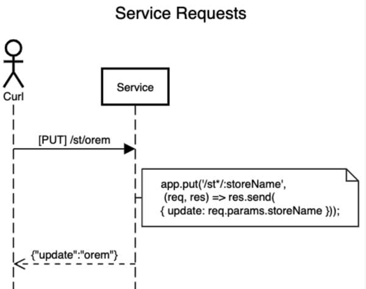

When you are done write a description of something you found interesting to the Canvas assignment.


# Debugging Node.js

📖 **Deeper dive reading**: [Node.js debugging in VS Code](https://code.visualstudio.com/docs/nodejs/nodejs-debugging)

Previously your JavaScript debugging was done using the browser's debugging tools as it executed in the browser. Now that you are writing JavaScript that runs using Node.js you need a way to debug your code without the help of browser. One great way to do that is to use the debugging tools built into VS Code. To debug JavaScript in VS Code you first need some JavaScript to debug. Open up VS Code and create a new file named `main.js` and paste the following code into the file.

```js
let x = 1 + 1;

console.log(x);

function double(x) {
  return x * 2;
}

x = double(x);

console.log(x);
```

You can now debug `main.js` in VS Code by executing the `Start Debugging` command by pressing `F5`. The first time you run this, VS Code will ask you what debugger you want to use. Select `node.js`.

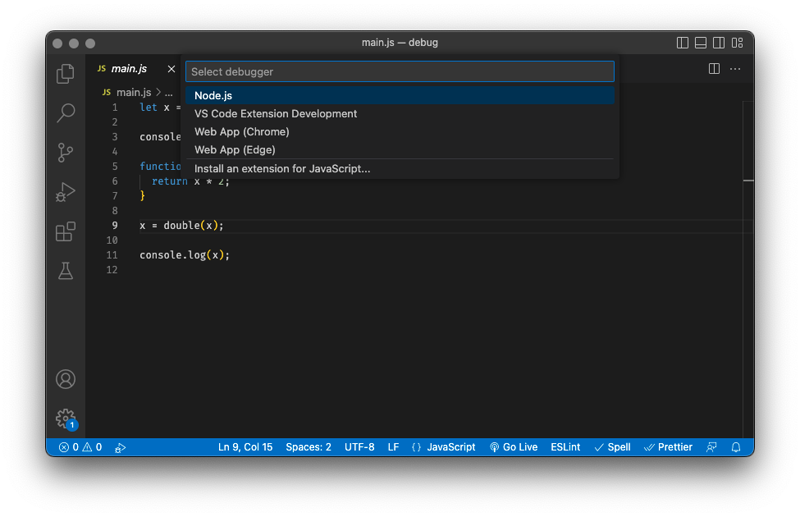

The code will execute and the debug console window will automatically open to show you the debugger output where you can see the results of the two console.log statements found in the code.

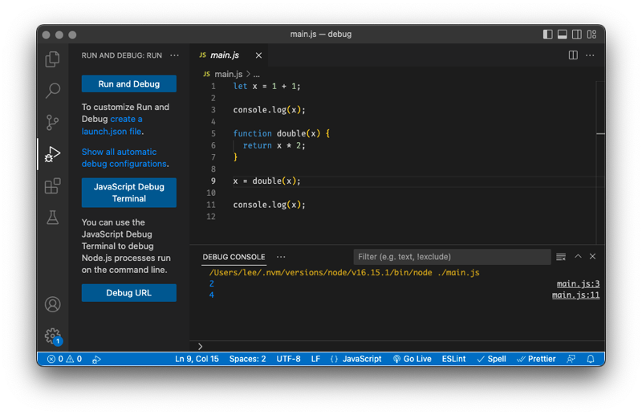

You can pause execution of the code by setting a breakpoint. Move your cursor over to the far left side of the editor window. As you hover on the left side of the line numbers you will see a red dot appear. Click on the dot to set the breakpoint.

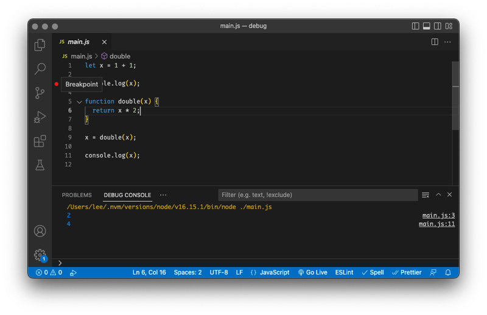

Now start the debugger again by pressing `F5`. The code will start running, but pause on the line with the breakpoint. You can then see the values of variables by looking at the variable window on the left, or by hovering your mouse over the variable you would like to inspect.

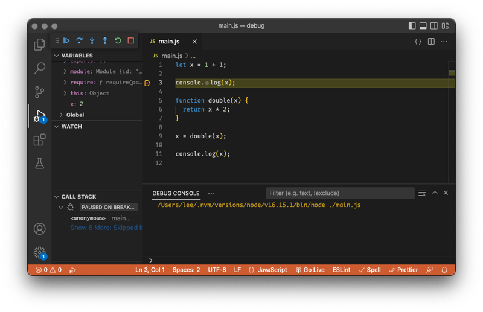

You can continue execution of the code by pressing `F10` to step to the next line, `F11` to step into a function call, or `F5` to continue running from the current line. When the last line of code executes the debugger will automatically exit and you will need to press `F5` to start it running again. You can stop debugging at any time by pressing `SHIFT-F5`.

Experiment with this simple file until you are comfortable running the debugger, setting breakpoints, and inspecting variables.

## Debugging a Node.js web service

In order to debug a web service running under Node.js we first need to write our code. Replace the code in your main.js file with the following.

```js
const express = require('express');
const app = express();

app.get('/*', (req, res) => {
  res.send({ url: req.originalUrl });
});

const port = 8080;
app.listen(port, function () {
  console.log(`Listening on port ${port}`);
});
```

Switch to your console application and run `npm init -y` and `npm install express` from your code directory so that we can use the Express package to write a simple web service.

Now we are ready to debug again. Set a breakpoint on the getStore endpoint callback (line 5) and the app.listen call (line 9). Start debugging by pressing `F5`. The debugger should stop on the listen call where you can inspect the `app` variable. Press `F5` again to continue running. Now open up your browser and set the location to `localhost:8080`. This should hit the breakpoint on the endpoint. Take some time to inspect the `req` object. You should be able to see what the HTTP method is, what parameters are provided, and what the path currently is. Press `F5` to continue.

Your browser should display the JSON object, containing the URL, that you returned from your endpoint. Now change the URL in the browser to include a path and some query parameters. Something like `http://localhost:8080/fish/taco?order=2`. Requesting that URL should cause your breakpoint to hit again where you can see the URL changes reflected in the req object.

Now, instead of pressing `F5` to continue, press `F11` to step into the `res.send` function. This will take you out of your code and into the express code that handles sending a response. Because you installed the Express package using NPM, all of Express' source code is sitting in the `node_modules` directory. You can also set breakpoints there, examine variables, and step into functions. Debugging into popular packages is a great way to learn how to code by seeing how really good programmers do things. Take some time to walk around Holowaychuk's code and see if you can understand what it is doing.

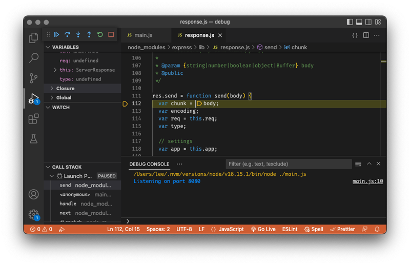

## Nodemon

Once you start writing complex web applications you will find yourself making changes in the middle of debugging sessions and you would like have node restart automatically and update the browser as the changes are saved. This seems like a simple thing, but over the course of hundreds of changes, every second you can save really starts to add up.

The [Nodemon package](https://www.npmjs.com/package/nodemon) is basically a wrapper around node that watches for files in the project directory to change. When it detects that you saved something it will automatically restart node.

If you would like to experiment with this then take the following steps. First install Nodemon globally so that you can use it to debug all of your projects.

```sh
npm install -g nodemon
```

Then, because VS Code does not know how to launch nodemon automatically, you need create a VS Code launch configuration. In VS Code press `CTRL-SHIFT-P` (on Windows) or `⌘-⇧-P` (on Mac) and type the command `Debug: Add configuration`. This will then ask you what type of configuration you would like to create. Type `Node.js` and select the `Node.js: Nodemon setup` option. in the launch configuration file at it creates, change the program from `app.js` to `main.js` (or whatever the main JavaScript file is for your application) and save the configuration file.

Now when you press `F5` to start debugging it will run Nodemon instead of Node.js and your changes will automatically update your application when you save.


# PM2

When you run a program from the console the program will automatically terminate when you close the console or if the computer restarts. In order to keep programs running after a shutdown you need to register it as a `daemon`. The term daemon comes from the idea of something that is always there working in the background. Hopefully you only have good daemons running in your background.

We want our web services to continue running as a daemon. We would also like a easy way to start and stop our services. That is what [Process Manager 2](https://pm2.keymetrics.io/docs/usage/quick-start/) (PM2) does.

PM2 is already installed on your production server as part of the AWS AMI that you selected when you launched your server. Additionally, the deployment scripts found with the Simon projects automatically modify PM2 to register and restart your web services. That means you should not need to do anything with PM2. However, if you run into problems such as your services are not running, then here are some commands that you might find useful.

You can SSH into your server and see PM2 in action by running the following command.

```sh
pm2 ls
```

This should print out the two services, simon and startup, that are configured to run on your web server.

You can try some of the other commands, but only if you understand what they are doing. Using them incorrectly could cause your web services to stop working.

| Command                                                    | Purpose                                                                          |
| ---------------------------------------------------------- | -------------------------------------------------------------------------------- |
| **pm2 ls**                                                 | List all of the hosted node processes                                            |
| **pm2 monit**                                              | Visual monitor                                                                   |
| **pm2 start index.js -n simon**                            | Add a new process with an explicit name                                          |
| **pm2 start index.js -n startup -- 4000**                  | Add a new process with an explicit name and port parameter                       |
| **pm2 stop simon**                                         | Stop a process                                                                   |
| **pm2 restart simon**                                      | Restart a process                                                                |
| **pm2 delete simon**                                       | Delete a process from being hosted                                               |
| **pm2 delete all**                                         | Delete all processes                                                             |
| **pm2 save**                                               | Save the current processes across reboot                                         |
| **pm2 restart all**                                        | Reload all of the processes                                                      |
| **pm2 restart simon-react --update-env**                   | Reload process and update the node version to the current environment definition |
| **pm2 update**                                             | Reload pm2                                                                       |
| **pm2 start env.js --watch --ignore-watch="node_modules"** | Automatically reload service when index.js changes                               |
| **pm2 describe simon**                                     | Describe detailed process information                                            |
| **pm2 startup**                                            | Displays the command to run to keep PM2 running after a reboot.                  |
| **pm2 logs simon**                                         | Display process logs                                                             |
| **pm2 env 0**                                              | Display environment variables for process. Use `ls` to get the process ID        |

## Registering a new web service

If you want to setup another subdomain that accesses a different web service on your web server, you need to follow these steps.

1. Add the rule to the Caddyfile to tell it how to direct requests for the domain.
2. Create a directory and add the files for the web service.
3. Configure PM2 to host the web service.

### Modify Caddyfile

SSH into your server.

Copy the section for the start up subdomain and alter it so that it represents the desired subdomain and give it a different port number that is not currently used on your server. For example:

```sh
tacos.cs260.click {
  reverse_proxy _ localhost:5000
  header Cache-Control none
  header -server
  header Access-Control-Allow-Origin *
}
```

This tells Caddy that when it gets a request for tacos.cs260.click it will act as a proxy for those requests and pass them on to the web service that is listening on the same machine (localhost), on port 5000. The other settings tell Caddy to return headers that disable caching, hide the fact that Caddy is the server (no reason to tell hackers anything about your server), and to allow any other origin server to make endpoint requests to this subdomain (basically disabling CORS). Depending on what your web service does you may want different settings.

Restart Caddy to cause it to load the new settings.

```sh
sudo service caddy restart
```

Now Caddy will attempt to proxy the requests, but there is no web service listening on port 5000 and so you will get an error from Caddy if you make a request to tacos.cs260.click.

### Create the web service

Copy the ~/services/startup directory to a directory that represents the purpose of your service. For example:

cp -r ~/services/startup ~/services/tacos

If you list the directory you should see an `index.js` file that is the main JavaScript file for your web service. It has the code to listen on the designated network port and respond to requests. The following is the JavaScript that causes the web service to listen on a port that is provided as an argument to the command line.

```js
const port = process.argv.length > 2 ? process.argv[2] : 3000;
app.listen(port, () => {
  console.log(`Listening on port ${port}`);
});
```

There is also a directory named `public` that has static HTML/CSS/JavaScript files that your web service will respond with when requested. The index.js file enables this with the following code:

```js
app.use(express.static('public'));
```

You can start up the web service, listening on port 5000, using Node as follows.

```sh
node index.js 5000
```

You can now access your web service through the browser, or curl.

```sh
curl https://tacos.cs260.click
```

Caddy will receive the request and map the subdomain name, tacos.cs260.click, to a request for https://localhost:5000. Your web service is listening on port 5000 and so it receives the request and responds.

Stop your web service by pressing CTRL-C in the SSH console that you used to start the service. Now your browser request for your subdomain should return an error again.

### Configure PM2 to host the web service

The problem with running your web service from the console with `node index.js 5000`, is that as soon as you close your SSH session it will terminate all processes you started in that session, including your web service. Instead you need something that is always running in the background to run your web service. This is where daemons come into play. The daemon we use to do this is called PM2.

From your SSH console session run:

```sh
pm2 ls
```

This will list the web services that you already have registered with PM2. To run your newly created web service under PM2, make sure you are in your service directory, and run the command similar to the following, with the service name and port substituted to your desired values:

```sh
cd ~/services/tacos
pm2 start index.js -n tacos -- 5000
pm2 save
```

If you run `pm2 ls` again you should see your web service listed. You can now access your subdomain in the browser and see the proper response. PM2 will keep running your service even after you exit your SSH session.


# UI testing

[Test driven development](https://www.freecodecamp.org/news/test-driven-development-what-it-is-and-what-it-is-not-41fa6bca02a2/) (TDD) is a proven methodology for accelerating application creation, protecting against regression bugs, and demonstrating correctness. TDD for console based applications and server based code is fairly straight forward. Web application UI code is significantly more complex to test, and using automated tests to drive your UI development is even more difficult.

The problem is that a browser is required to execute UI code. That means you have to actually test the application in the browser. Additionally, every one of the major browsers behaves slightly differently, viewport size makes a big difference, all the code executes asynchronously, network disruptions are common, and then there is the human factor. A human will interact with the browser in very unexpected ways. Clicking where they shouldn't, clicking rapidly, randomly refreshing the browser, flushing cache, not flushing cache, leaving the application up for days on end, switching between tabs, opening the application multiple times, logging in on different tabs, logging out of one tab while still using the application on another tab, or ... on and on. And we haven't even talked about running all the different browsers on all of the possible devices.

Of course the alternative to not test your code doesn't work either. That only means that you have to manually test everything every time you make any change, or you let your users test everything. That is not a good recipe for long term success.

Fortunately this is a problem that many strong players have been working on for decades now, and the solutions, while not perfect, are getting better and better. We will look at two of these solutions. One is for executing automated tests in the browser, and the other is for testing on different browsers and devices.

## Automating the browser - Playwright

📖 **Deeper dive reading**: [Playwright and VS Code](https://playwright.dev/docs/getting-started-VSCode)

No one understands the difficulty of testing applications in a browser better than the companies that build web browsers. They have to test every possible use of HTML, CSS, and JavaScript that a user could think of. There is no way that manual testing is going to work and so early on they started putting hooks into their browsers that allowed them to be driven from automated external processes. [Selenium](https://www.selenium.dev/) was introduced in 2004 as the first popular tool to automate the browser. However, Selenium is generally considered to be flaky and slow. Flakiness means that a test fails in unpredictably, unreproducible, ways. When you need thousands of tests to pass before you can deploy a new feature, even a little flakiness becomes a big problem. If those tests take hours to run then you have an even bigger problem.

The market now has lots of alternatives when considering which automated browser framework to use. State of JS includes statistics on how popular these frameworks are. With frameworks coming and going all of the time, one telling statistic is the frameworks ability to retain users.


— Retention of browser based testing frameworks (**Source**: _2021.stateofjs.com_)

For the purposes of this instruction, we could pick any of the top contenders. However, we are going to pick a newcomer, [Playwright](https://playwright.dev/). Playwright has some major advantages. It is backed by Microsoft, it integrates really well with VS Code, and it runs as a Node.js process. It is also considered one of the least flaky of the testing frameworks.

As a demonstration of using Playwright, consider the following simplified HTML file containing a button that changes the paragraph text. The button calls a JavaScript function defined in a script element located in the HTML file.

```HTML
<body>
  <p id="welcome" data-testid="msg">Hello world</p>
  <button onclick="changeWelcome()">change welcome</button>
  <script>
    function changeWelcome() {
      const welcomeEl = document.querySelector('#welcome');
      welcomeEl.textContent = 'I feel welcomed';
    }
  </script>
</body>
```

First, you need to install Playwright. In your project directory, use NPM to download the playwright packages, install the browser drivers, configure your project, and create a couple example test files.

```sh
npm init playwright@latest
```

Next, you want to install the Playwright extension for VS Code. Go to the extensions tab in VS Code and search for, and install, `Playwright Test for VSCode`.

You can now write your first Playwright test. Take the following and paste it over the `tests/example.spec.js` file that the Playwright install created.

```js
import { test, expect } from '@playwright/test';

test('testWelcomeButton', async ({ page }) => {
  // Navigate to the welcome page
  await page.goto('http://localhost:5500/');

  // Get the target element and make sure it is in the correct starting state
  const hello = page.getByTestId('msg');
  await expect(hello).toHaveText('Hello world');

  // Press the button
  const changeBtn = page.getByRole('button', { name: 'change welcome' });
  await changeBtn.click();

  // Expect that the change happened correctly
  await expect(hello).toHaveText('I feel not welcomed');
});
```

This test makes sure you can successfully navigate to the desired page, that the page contains the desired elements, that you can press the button and the text changes as expected.

Before you run the test, you actually need your application running for the test to execute against. You can do this by using the VS Code Live Server extension, or if you are testing a Node.js based service then run `npm run start`. You can actually add configuration to your tests so that your application is started when your tests run, but for now, just start up your application before you run the test.

To run the test in VS Code, select the `Test Explorer` tab. You should see your test listed in the explorer. Select the `example.spec.ts` test and press the play button. This will start the test, launch a browser, run the test code to interact with the browser, and display the result. In this case our test fails because it is expecting the resulting test to be `I feel not welcomed` when it actually displays `I feel welcomed`.

The following image should be similar to what you see. You can see the listing of tests on the left and the JavaScript based test in the editor window on the right. When a test fails the editor window displays a clear description of what went wrong. You can even debug the tests as they execute just like you would any other Node.js based JavaScript execution.

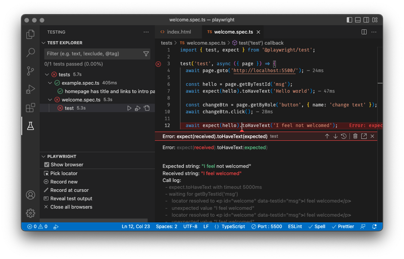

You can fix the test by either changing `index.html` or `test/example.spec.js` so that the text matches. Once you have done that you can run the test again and the test explorer should display a green check box.

This is just a simple example of the powerful functionality of Playwright. You are encouraged to explore its functionality and even add some tests to your projects. Once you have gained some competency with Playwright you will find that you can write your code faster and feel more confident when changing things around.

## Testing various devices - Browser Stack

With the ability to run automated UI tests, we now turn our attention to testing on the multitude of various devices. There are several services out there that help with this. One of these is [BrowserStack](https://www.browserstack.com/). BrowserStack lets you pick from a long list of physical devices that you can run interactively, or use when driving automated tests with Selenium. The image below only shows a partial list of iPhone devices. BrowserStack also has devices for Android, Mac, and Windows.

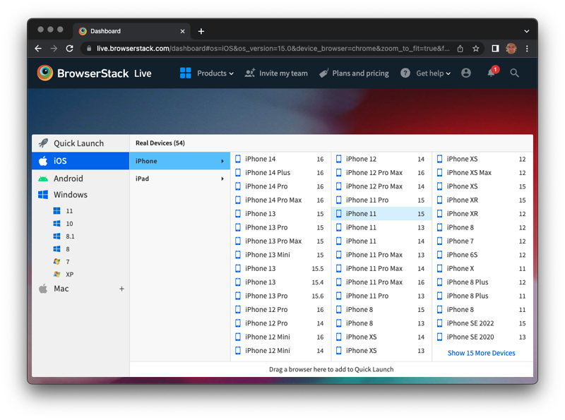

When you launch a device it connects the browser interface to a physical device hosted in a data center. You can then use the device to reproduce user reported problems, or validate that your implementation works on that specific device. The following image shows the use of BrowserStack to experiment with an iPhone 14 running iOS 16.

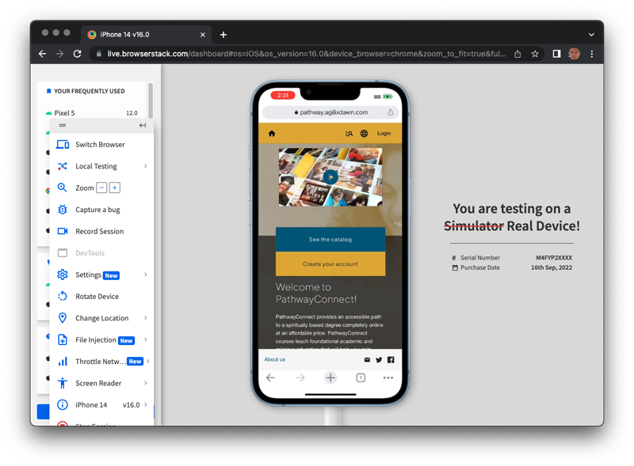

BrowserStack offers free trials if you would like to see how your start up application works on a specific device.


# Endpoint testing

Using test driven development (TDD) for testing service endpoints is a common industry practice. Testing services is usually easier than writing UI tests because it does not require a browser. However, it does still take effort to learn how to write tests that are effective and efficient. Making this a standard part of your development process will give you a significant advantage as you progress in your professional career.

As demonstrated by the following [State of JS](https://2021.stateofjs.com/en-US/libraries/testing/) survey, there are lots of good testing packages that work well with Express driven services. We are going to look at the current champion [Jest](https://jestjs.io/).

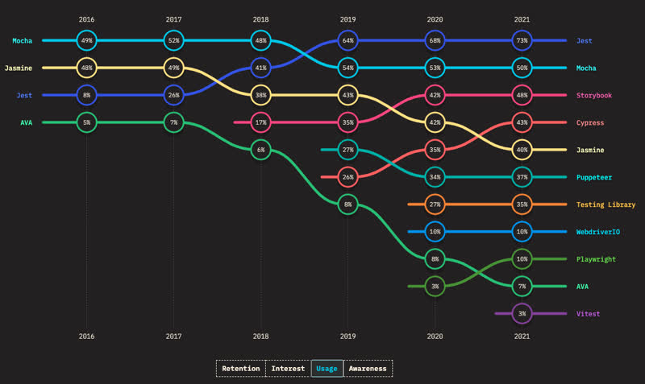

To get started with Jest we need a simple web service. In a console window, create a test directory, install Express, and open up VS Code.

```sh
mkdir testJest
cd testJest
npm init -y
npm install express
code .
```

Now create a file named `server.js` and use Express to create an application with two endpoints. One to get a store (getStore), and another to update a store.

**server.js**

```js
const express = require('express');
const app = express();

app.use(express.json());

// Endpoints
app.get('/store/:storeName', (req, res) => {
  res.send({ name: req.params.storeName });
});

app.put('/store/:storeName', (req, res) => {
  req.body.updated = true;
  res.send(req.body);
});

module.exports = app;
```

In order to allow Jest to start up the HTTP server when running tests, we initialize the application a little bit differently than we have in the past. Normally, we would have just started listening on the Express app object after we defined our endpoints. Instead we export the Express app object from our `server.js` file and then import the app object in the `index.js` file that is used to run our service.

**index.js**

```js
const app = require('./server');

const port = 8080;
app.listen(port, function () {
  console.log(`Listening on port ${port}`);
});
```

Breaking apart the definition of the service from the starting of the service allows us to start the service both when we run normally and also when using our testing framework.

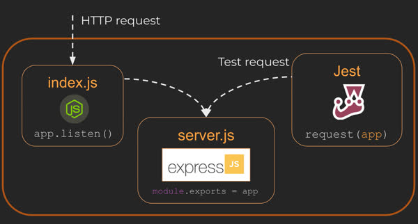

You can test that the service is working properly by running the service in the VS Code debugger and pressing F5 while viewing the index.js file. Then open a browser and navigate to `http://localhost:8080/store/provo`. Stop the debugging session once you have demonstrated that the service is working correctly.

To launch the service using Jest we create another file that has a suffix of `.test.js`. Any file with that suffix is considered a testing file and will automatically be discovered by Jest and examined for tests to run.

## A simple test

Before we write tests for our endpoints we will write a simple test that demonstrates how Jest works. A test is created by calling the Jest `test` function. Note that you don't need to include a `require` statement to import Jest functions into your code. Jest will automatically import itself when it discovers a test file.

Let's make our first test by creating a file named `store.test.js` and pasting in the following code.

**store.test.js**

```js
test('that equal values are equal', () => {
  expect(false).toBe(true);
});
```

The `test` function takes a description as the first parameter. The description is meant to be human readable. In this case it reads: "test that equal values are equal". The second parameter is the function to call. Our function just calls the Jest `expect` function and chains it to the `toBe` function. You can read this as "expect false to be true", which is of course is not true, but we want to see our test fail the first time we run it. We will fix this later so that we can show what happens when a test succeeds.

In order to run the test we need to install the Jest package using NPM. From the console install the package. The `-D` parameter tells NPM to install Jest as a development package. That keeps it from being included when we do production release builds.

```sh
npm install jest -D
```

Now, replace the `scripts` section of the `package.json` file with a new command that will run our tests with Jest.

```json
"scripts": {
  "test": "jest"
},
```

With that in place we can run the `test` command and our test will execute. Notice that Jest shows exactly where the test failed and what expected values were not received.

```sh
➜ npm run test

 FAIL  ./store.test.js
  ✕ that unequal values are not equal (1 ms)

  â— that unequal values are not equal

    expect(received).toBe(expected) // Object.is equality

    Expected: true
    Received: false

      3 |
      4 | test('that unequal values are not equal', () => {
    > 5 |   expect(false).toBe(true);
        |                 ^
      6 | });
      7 |
      8 | // describe('endpoints', () => {

      at Object.toBe (store.test.js:5:17)

Tests:       1 failed, 1 total
```

We can then fix our test by rewriting it so that the expected value matches the provided value.

**store.test.js**

```js
test('that equal values are equal', () => {
  expect(true).toBe(true);
});
```

This time when we run the test it passes.

```sh
➜  npm run test

 PASS  ./store.test.js
  ✓ that equal values are equal (1 ms)

Tests:       1 passed, 1 total
```

Note that this example didn't actually test any of our code, but it does demonstrate how easy it is to write tests. A real test function would call code in your program. Let's do this by actually making calls to our endpoints.

## Testing endpoints

To test our endpoints we need another package so that we can make HTTP requests without having to actually send them over the network. This is done with the NPM package called `supertest`. Go ahead and install this now.

```sh
npm install supertest -D
```

We can then alter `store.test.js` to import our Express service and also the request function from supertest that we will use to make HTTP requests.

To make an HTTP request you pass the Express app to the supertest request function and then chain on the HTTP verb function that you want to call, along with the endpoint path. You can then chain on as many `expect` functions as you would like. In the following example we will expect an HTTP status code of 200 (OK), and that the body of the response contains the object that we expect the endpoint to return.

If something goes wrong, the `end` function will contain an error and we pass the error along to the `done` function. Otherwise we just call `done` without the error.

**store.test.js**

```js
const request = require('supertest');
const app = require('./server');

test('getStore returns the desired store', (done) => {
  request(app)
    .get('/store/provo')
    .expect(200)
    .expect({ name: 'provo' })
    .end((err) => (err ? done(err) : done()));
});
```

When we run this test we see that it passes without error.

```sh
➜  npm run test

 PASS  ./store.test.js
  ✓ getStore returns the desired store (16 ms)

Test Suites: 1 passed, 1 total
Tests:       1 passed, 1 total
Snapshots:   0 total
Time:        0.237 s, estimated 1 s
```

You can change the test to expect a status code of 500 (Server Error) if you want to see the test fail. You can also change the endpoint code to return a 201 status code (Created) and also see the test fail.

Now We can add a test for the updateStore endpoint. To do this we can copy the getStore endpoint, change the description, change the HTTP function verb to `put`, and send the body of the put request using the chained `send` function.

```js
const request = require('supertest');
const app = require('./server');

test('updateStore saves the correct values', (done) => {
  request(app)
    .put('/store/provo')
    .send({ items: ['fish', 'milk'] })
    .expect(200)
    .expect({ items: ['fish', 'milk'], updated: true })
    .end((err) => (err ? done(err) : done()));
});

test('getStore returns the desired store', (done) => {
  request(app)
    .get('/store/provo')
    .expect(200)
    .expect({ name: 'provo' })
    .end((err) => (err ? done(err) : done()));
});
```

The great thing about test driven development (TDD) is that you can actually write your tests first and then write your code based upon the design represented by the tests. When your tests pass you know your code is complete. Additionally, when you make later modifications to your code you can simply run your tests again. If they pass then you can be confident that your code is still working without having to manually test everything yourself. With systems that have hundreds of endpoints and hundreds of thousands of lines of code, TDD becomes an indispensible part of the development process.


# Simon Service


This deliverable demonstrates converting the JavaScript application into a web application by implementing a web service that listens on a network port for HTTP requests. The web service provide endpoints for getting and updating the scores. The application also uses a couple third party endpoints to display inspirational quotes on the about page and show a random header image.

We will use Node.js and Express to create our HTTP service.

You can view this application running here: [Example Simon Service](https://simon-service.cs260.click)

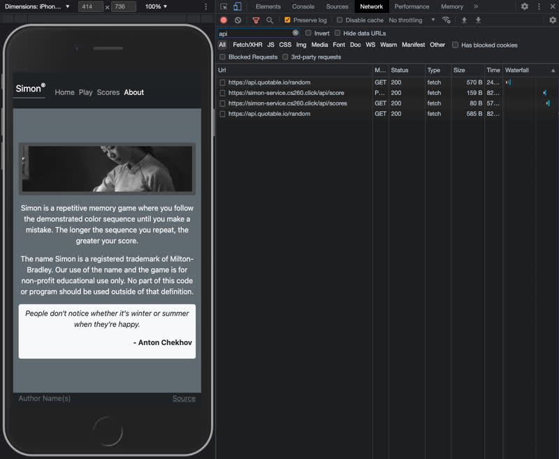

## Service endpoint definitions

Here is our design, documented using curl commands, for the two endpoints that the Simon web service provides.

**GetScores** - Get the latest high scores.

```sh
curl -X GET /api/scores

#Response
{ "scores":[
  {"name":"Harvey", "score":"337", "date":"2022/11/20"},
  {"name":"ë„윤 ì´", "score":"95", "date":"2019/05/20"}
]}
```

**SubmitScore** - Submit a score for consideration in the list of high scores.

```sh
curl -X POST /api/score -d '{"name":"Harvey", "score":"337", "date":"2022/11/20"}'

#Response
{ "scores":[
  {"name":"Harvey", "score":"337", "date":"2022/11/20"},
  {"name":"ë„윤 ì´", "score":"95", "date":"2019/05/20"}
]}
```

## Third party endpoints

The about.js file contains code for making calls to third party endpoints using fetch. We make one call to `picsum.photos` to get a random picture and another to `quotable.io` to get a random quote. Once the endpoint asynchronously returns, the DOM is updated with the requested data. Here is an example of the quote endpoint call.

```js
function displayQuote(data) {
  fetch('https://api.quotable.io/random')
    .then((response) => response.json())
    .then((data) => {
      const containerEl = document.querySelector('#quote');

      const quoteEl = document.createElement('p');
      quoteEl.classList.add('quote');
      const authorEl = document.createElement('p');
      authorEl.classList.add('author');

      quoteEl.textContent = data.content;
      authorEl.textContent = data.author;

      containerEl.appendChild(quoteEl);
      containerEl.appendChild(authorEl);
    });
}
```

## Steps to convert Simon to a service

Converting Simon to a service involved the following steps.

1. Move all the previous deliverable code files (_.html, _.js, \*.css, favicon.ico, and assets) into a sub-directory named `public`. We will use the HTTP Node.js based service to host the front-end application files. This is done with the static file middleware that we will add our service `index.js`.

   ```js
   app.use(express.static('public'));
   ```

   When running our service the static file middleware takes care of reading the front-end code from the `public` directory and returning it to the browser. The service only directly handles the endpoint requests.

   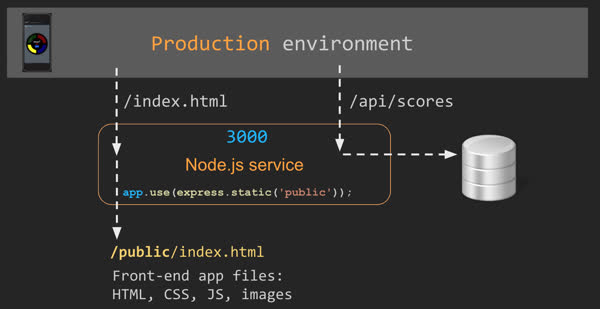

1. Within the project directory run `npm init -y`. This configures the directory to work with **node.js**.
1. Modify or create `.gitignore` to ignore `node_modules`.
1. Install the Express package by running `npm install express`. This will write the Express package dependency in the `package.json` file and install all the Express code to the `node_modules` directory.
1. Create a file named `index.js` in the root of the project. This is the entry point that **node.js** will call when you run your web service.
1. Add the basic Express JavaScript code needed to host the application static content and the desired endpoints.

   ```js
   const express = require('express');
   const app = express();

   // The service port. In production the front-end code is statically hosted by the service on the same port.
   const port = process.argv.length > 2 ? process.argv[2] : 3000;

   // JSON body parsing using built-in middleware
   app.use(express.json());

   // Serve up the front-end static content hosting
   app.use(express.static('public'));

   // Router for service endpoints
   const apiRouter = express.Router();
   app.use(`/api`, apiRouter);

   // GetScores
   apiRouter.get('/scores', (_req, res) => {
     res.send(scores);
   });

   // SubmitScore
   apiRouter.post('/score', (req, res) => {
     scores = updateScores(req.body, scores);
     res.send(scores);
   });

   // Return the application's default page if the path is unknown
   app.use((_req, res) => {
     res.sendFile('index.html', { root: 'public' });
   });

   app.listen(port, () => {
     console.log(`Listening on port ${port}`);
   });
   ```

1. Modify the Simon application code to make service endpoint requests to our newly created HTTP service code.

   ```js
   async function loadScores() {
     const response = await fetch("/api/scores")
     const scores = await response.json()

     // Modify the DOM to display the scores
   ```

## Study this code

Get familiar with what the example code teaches.

- Clone the repository to your development environment.

  ```sh
  git clone https://github.com/webprogramming260/simon-service.git
  ```

- Review the code and get comfortable with everything it represents.
- View the code in your browser by hosting it from a VS Code debug session.
- Use the browser's dev tools to set breakpoints in the code and step through it each line.
- Make modifications to the code as desired. Experiment and see what happens.

## Deploy to production

- Deploy to your production environment using a copy of the `deployService.sh` script found in the [example class application](https://github.com/webprogramming260/simon-service/blob/main/deployService.sh). Take some time to understand how it works.

  ```sh
  ./deployService.sh -k <yourpemkey> -h <yourdomain> -s simon
  ```

  For example,

  ```sh
  ./deployService.sh -k ~/keys/production.pem -h yourdomain.click -s simon
  ```

  âš  **NOTE** - The deployment script for this project is different than pervious deployment scripts since it needs to set up the Node.js service for your backend code, and copy your front-end code to the `public` directory. You also want to make sure that your node.js HTTP service code for Simon is configured to listen on port 3000. When you deploy your Start Up you want to make sure that code is configured to listen on port 4000.

- Update your `start up` repository README.md to record and reflect on what you learned.
- Make sure your project is visible from your production environment (e.g. https://simon.yourdomain.click).
- Submit the URL to your production environment for grading using the Canvas assignment page.

## Grading Rubric

- 50% - Simon Service to your production environment
- 50% - Notes in your `start up` repository README.md about what you have learned


# Storage services

Web applications commonly need to store files associated with the application or the users of the application. This includes files such as images, user uploads, documents, and movies. Files usually have an ID, some metadata, and the bytes representing the file itself. These can be stored using a database service, but usually that is overkill and a simpler solution will be cheaper.

It might be tempting to store files directly on your server. This is usually a bad idea for several reasons.

1. Your server has limited drive space. If you server runs out of drive space your entire application will fail.
1. You should consider your server as being ephemeral, or temporary. It can be thrown away and replaced by a copy at any time. If you start storing files on the server, then your server has state that cannot be easily replaced.
1. You need backup copies of your application and user files. If you only have one copy of your files on your server, then they will disappears when your server disappears, and you must always assume that your server will disappear.

Instead you want to use a storage service that is specifically designed to support production storage and delivery of files.

## AWS S3

There are many such solutions out there, but one of the most popular ones is [AWS S3](https://aws.amazon.com/s3/). S3 provides the following advantages:

1. It has unlimited capacity
1. You only pay for the storage that you use
1. It is optimized for global access
1. It keeps multiple redundant copies of every file
1. You can version the files
1. It is performant
1. It supports metadata tags
1. You can make your files publicly available directly from S3
1. You can keep your files private and only accessible to your application

In this course we will not be using an storage services for the Simon project. If however, you want to use S3 as the storage service for your Start Up application then you need to learn how to use the AWS SDK. You can find detailed information about using AWS S3 with Node.js on the [AWS website](https://docs.aws.amazon.com/sdk-for-javascript/v2/developer-guide/getting-started-nodejs.html). Generally, the steps you need to take include:

1. Creating a S3 bucket to store your data in.
1. Getting credentials so that your application can access the bucket.
1. [Using](https://docs.aws.amazon.com/sdk-for-javascript/v2/developer-guide/setting-credentials-node.html) the credentials in your application.
1. Using the [SDK](https://docs.aws.amazon.com/sdk-for-javascript/v2/developer-guide/s3-example-creating-buckets.html) to write, list, read, and delete files from the bucket.

âš  Make sure that you do not include your credentials in your code. If you check your credentials into your GitHub repository they will immediately be stolen and used by hackers to take over your AWS account. This may result in significant monetary damage to you.


# Data services

Web applications commonly need to store application and user data persistently. The data can be many things, but it is usually a representation of complex interrelated objects. This includes this like a user profile, organizational structure, game play information, usage history, billing information, peer relationship, library catalog, and so forth.

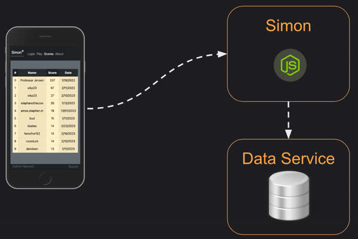

Historically SQL databases have served as the general purpose data service solution, but starting around 2010 specialty data services that better support document, graph, JSON, time, sequence, and key-value pair data began to take significant roles in applications from major companies. These data services are often called NoSQL solutions because they do not use the general purpose relational database paradigms popularized by SQL databases. However, they all have very different underlying data structures, strengths, and weaknesses. That means that you should not simply split all of the possible data services into two narrowly defined boxes, SQL and NoSQL, when you are considering the right data service for your application.

Here is a list of some of the popular data services that are available.

| Service       | Specialty             |
| ------------- | --------------------- |
| MySQL         | Relational queries    |
| Redis         | Memory cached objects |
| ElasticSearch | Ranked free text      |
| MongoDB       | JSON objects          |
| DynamoDB      | Key value pairs       |
| Neo4J         | Graph based data      |
| InfluxDB      | Time series data      |

## MongoDB


For the projects in this course that require data services, we will use `MongoDB`. Mongo increases developer productivity by using JSON objects as its core data model. This makes it easy to have an application that uses JSON from the top to the bottom of the technology stack. A mongo database is made up of one or more collections that each contain JSON documents. You can think of a collection as a large array of JavaScript objects, each with a unique ID. The following is a sample of a collection of houses that are for rent.

```js
[
  {
    _id: '62300f5316f7f58839c811de',
    name: 'Lovely Loft',
    summary: 'A charming loft in Paris',
    beds: 1,
    last_review: {
      $date: '2022-03-15T04:06:17.766Z',
    },
    price: 3000,
  },
  {
    _id: '623010b97f1fed0a2df311f8',
    name: 'Infinite Views',
    summary: 'Modern home with infinite views from the infinity pool',
    property_type: 'House',
    beds: 5,
    price: 250,
  },
];
```

Unlike relational databases that require a rigid table definition where each column must be strictly typed and defined beforehand, Mongo has no strict schema requirements. Each document in the collection usually follows a similar schema, but each document may have specialized fields that are present, and common fields that are missing. This allows the schema of a collection to morph organically as the data model of the application evolves. To add a new field to a Mongo collection you just start insert the field into the documents as desired. If the field is not present, or has a different type in some documents, then the document simply doesn't match the query criteria when the field is referenced.

The query syntax for Mongo also follow a JavaScript inspired flavor. Consider the following queries on the houses for rent collection that was shown above.

```js
// find all houses
db.house.find();

// find houses with two or more bedrooms
db.house.find({ beds: { $gte: 2 } });

// find houses that are available with less than three beds
db.house.find({ status: 'available', beds: { $lt: 3 } });

// find houses with either less than three beds or less than $1000 a night
db.house.find({ $or: [(beds: { $lt: 3 }), (price: { $lt: 1000 })] });

// find houses with the text 'modern' or 'beach' in the summary
db.house.find({ summary: /(modern|beach)/i });
```

### Using MongoDB in your application

📖 **Deeper dive reading**: [MongoDB tutorial](https://www.mongodb.com/developer/languages/javascript/node-crud-tutorial/)

The first step to using Mongo in your application is to install the `mongodb` package using NPM.

```sh
➜ npm install mongodb
```

With that done you then use the `MongoClient` object to make a client connection to the database server. This requires a username, password, and the hostname of the database server.

```js
const { MongoClient } = require('mongodb');

const userName = 'holowaychuk';
const password = 'express';
const hostname = 'mongodb.com';

const uri = `mongodb+srv://${userName}:${password}@${hostname}`;

const client = new MongoClient(uri);
```

With the client connection you can then get a database object and from that a collection object. The collection object allows you to insert, and query for, documents. You do not have to do anything special to insert a JavaScript object as a Mongo document. You just call the `insertOne` function on the collection object and pass it the JavaScript object. When you insert a document, if the database or collection does not exists, Mongo will automatically create them for you. When the document is inserted into the collection it will automatically be assigned a unique ID.

```js
const collection = client.db('rental').collection('house');

const house = {
  name: 'Beachfront views',
  summary: 'From your bedroom to the beach, no shoes required',
  property_type: 'Condo',
  beds: 1,
};
await collection.insertOne(house);
```

To query for documents you use the `find` function on the collection object. Note that the find function is asynchronous and so we use the `await` keyword to wait for the promise to resolve before we write them out to the console.

```js
const cursor = collection.find();
const rentals = await cursor.toArray();
rentals.forEach((i) => console.log(i));
```

If you do not supply any parameters to the `find` function then it will return all documents in the collection. In this case we only get back the single document that we previously inserted. Notice that the automatically generated ID is returned with the document.

**Output**

```js
[
  {
    _id: new ObjectId('639a96398f8de594e198fc13'),
    name: 'Beachfront views',
    summary: 'From your bedroom to the beach, no shoes required',
    property_type: 'Condo',
    beds: 1,
  },
];
```

You can provide a query and options to the `find` function. In the example below we query for a `property_type` of Condo that has less than two bedrooms. We also specify the options to sort by descending price, and limit our results to the first 10 documents.

```js
const query = { property_type: 'Condo', beds: { $lt: 2 } };

const options = {
  sort: { price: -1 },
  limit: 10,
};

const cursor = collection.find(query, options);
const rentals = await cursor.toArray();
rentals.forEach((i) => console.log(i));
```

The query matches the document that we previously inserted and so we get the same result as before.

There is a lot more functionality that MongoDB provides, but this is enough to get you started. If you are interested you can explore the tutorials on their [website](https://www.mongodb.com/docs/).

## Managed services

Historically each application development team would have developers that managed the data service. Those developers would acquisition hardware, install the database software, monitor the memory, cpu, and disk space, control the data schema, and handle migrations and upgrades. Much of this work has now moved to services that are hosted and managed by a 3rd party. This relieves the development team from much of the day to day maintenance. The team can instead focus more on the application and less on the infrastructure. With a managed data service you simply supply the data and the service grows, or shrinks, to support the desired capacity and performance criteria.

### MongoDB Atlas

All of the major cloud providers offer multiple data services. For this class we will use the data service provided by MongoDB called [Atlas](https://www.mongodb.com/atlas/database). No credit card or payment is required to setup and use Atlas, as long as you stick to the shared cluster environment.

[](https://www.mongodb.com/atlas/database)

âš  This [video tutorial](https://www.youtube.com/watch?v=daIH4o75KE8) will step you through the process of creating your account and setting up your database. You really want to watch this video. Note that some of the Atlas website interface may be slightly different, but the basic concepts should all be there is some shape or form. The main steps you need to take are:

1. Create your account.
1. Create a database cluster.
1. Create your root database user credentials. Remember these for later use.
1. âš  Set network access to your database to be available from anywhere.
   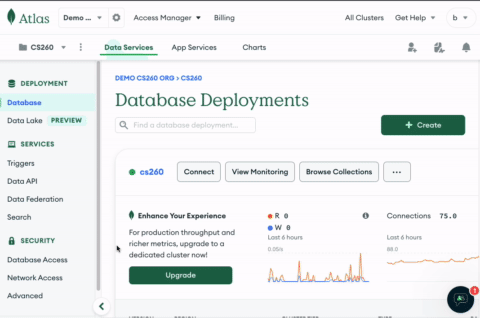
1. Copy the connection string and use the information in your code.
1. Save the connection and credential information in your production and development environments as instructed above.

You can always find the connection string to your Atlas cluster by pressing the `Connect` button from your Database > DataServices view.

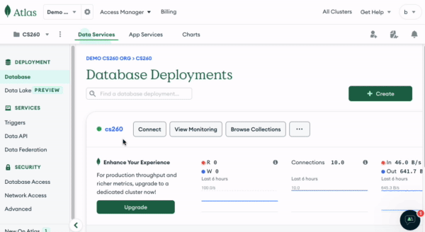

## Keeping your keys out of your code

You need to protect your credentials for connecting to your Mongo database. One common mistake is to check them into your code and then post it to a public GitHub repository. Instead you can load your credentials when the application executes. One common way to do that is to read them from environment variables. The JavaScript `process.env` object provides access to the environment.

```Javascript
const userName = process.env.MONGOUSER;
const password = process.env.MONGOPASSWORD;
const hostname = process.env.MONGOHOSTNAME;

if (!userName) {
  throw Error("Database not configured. Set environment variables");
}
```

Following this pattern requires you to set these variables in your development and production environments before you can successfully execute.

### Setting environment variables for your **production** environment

For your production environment, you will add your MongoDB Atlas credentials by using SSH to your server.

```sh
➜  ssh -i [key pair file] ubuntu@[yourdomainnamehere]
```

for example,

```sh
➜  ssh -i ~/keys/production.pem ubuntu@myfunkychickens.click
```

Then open up the global environment settings file `/etc/environment`.

```
sudo vi /etc/environment
```

In the environment file you will find that the credentials are already set to access the class demo MongoDB server. You want to replace those values with your own values so that your data will be stored in your server.

```sh
export MONGOUSER=<yourmongodbusername>
export MONGOPASSWORD=<yourmongodbpassword>
export MONGOHOSTNAME=<yourmongodbhostname>
```

When you are done modifying the `/etc/environment` with your MongoDB username, password, and hostname, save the file. It will look something like the following.

```sh
export MONGOUSER=cs260mongo
export MONGOPASSWORD=toomanysecrets
export MONGOHOSTNAME=cs260.nan123cs.mongodb.net
```

Exit your SSH session and reconnect again so that the environment variables are active in the console window you are using.

You then need to tell your Simon and Start Up services to use the new values found in the environment file. To do this you need to tell our service daemon, PM2, to reload its stored environment for all services that it manages. You then need to tell PM2 to save the new configuration so that it will persist when your server restarts. Run these commands from a SSH session on your production server.

```sh
pm2 restart all --update-env
pm2 save
```

### Setting environment variables for your **development** environment

For your development environment add the same environment variables. Depending on what operating system and console you are using, how you add the variables will be different.

**`Linux`**

1. Modify the /etc/environment file to include the three environment variable export statements as defined above.

**`Mac`**

1. Modify your shell resource file to include three environment variable export statements defined above. If you are using Zsh then the file is: `~/.zshrc`. If you are using Bash then the file is: `~/.bashrc`.

**`Windows`**

1. From the Start Menu search for "system environment variables" in the search bar
1. Go to the Advanced Tab
1. Click on Environment Variables
1. Under SYSTEM variables click on NEW
1. Add each variable individually into the variables information and click APPLY and OK
1. Restart program needing the variables

If necessary consult the documentation for the operating system, or console shell, you are using for the details on how to set environment variables.

## Using Mongo from your code

With that all done, you should be good to use Atlas from both your development and production environments. You can test that things are working correctly with the following example.

```js
const { MongoClient } = require('mongodb');

// Read the credentials from environment variables so that you do not accidentally check in your credentials
const userName = process.env.MONGOUSER;
const password = process.env.MONGOPASSWORD;
const hostname = process.env.MONGOHOSTNAME;

async function main() {
  // Connect to the database cluster
  const url = `mongodb+srv://${userName}:${password}@${hostname}`;
  const client = new MongoClient(url);
  const collection = client.db('rental').collection('house');

  // Insert a document
  const house = {
    name: 'Beachfront views',
    summary: 'From your bedroom to the beach, no shoes required',
    property_type: 'Condo',
    beds: 1,
  };
  await collection.insertOne(house);

  // Query the documents
  const query = { property_type: 'Condo', beds: { $lt: 2 } };
  const options = {
    sort: { score: -1 },
    limit: 10,
  };

  const cursor = collection.find(query, options);
  const rentals = await cursor.toArray();
  rentals.forEach((i) => console.log(i));
}

main().catch(console.error);
```

To execute the above example, do the following:

1. Create a directory called `mongoTest`
1. Save the above content to a file named `main.js`
1. Run `npm init -y`
1. Run `npm install mongodb`
1. Run `node main.js`.

This should output something like the following if everything is working correctly.

```js
{
_id: new ObjectId("639b51b74ef1e953b884ca5b"),
name: 'Beachfront views',
summary: 'From your bedroom to the beach, no shoes required',
property_type: 'Condo',
beds: 1
}
```

# ☑ Assignment

First, set up your MongoDB Atlas database service. Then use the instructions aboveRun the example program for testing that you have things set up correctly.

When you are done submit the connection string for your Atlas database cluster, along with a comment about something you found interesting, to the Canvas assignment.

Here is an example connection string:

```
mongodb+srv://<user>:<password>@cs260.xiu1cqz.mongodb.net/
```

⚠ Do not include the user or password for your cluster in the connection string. (Unless you want some extra special data added to your applications 😉.)


# Simon DB


This deliverable demonstrates using a database service, MongoDB, to persistently save data. Our web service will call the database service to save high scores. This creates a third layer in our Simon technology stack.

1. Client application - Simple HTML/CSS/JavaScript
1. Web service - Caddy, Node.js, Express
1. Database service - MongoDB

You can view this application running here: [Example Simon DB](https://simon-db.cs260.click). Although you won't be able to see any difference from the `simon-service` version, because the only difference is that when the `simon-db` service is restarted it doesn't lose its high score data because it is saved persistently in the database.

## Connecting to the database

We use a cloud service called MongoDB Atlas for our database service. Once we are connected to Atlas, we can make service calls to MongoDB from our web service. This involves specifying the database service endpoint and making services calls like the following.

```Javascript
const { MongoClient } = require('mongodb');

const url = `mongodb+srv://${userName}:${password}@${hostname}`;
const client = new MongoClient(url);
client.connect(err => {
  const collection = client.db("test").collection("devices");

  // ... perform actions on the DB collection

  client.close();
});

```

## Create a MongoDB Atlas cluster

Before you can start writing your own code you need to get a MongoDB Atlas account and create a database cluster that you can use as your database service. If you have not done that yet go back and review the instruction on data services.

## Handling credentials

Make sure you follow the instruction given previously about providing and protecting your MongoDB credentials using environment variables.

## Working with the database

The `database.js` file contains the functions for getting and adding high scores. The database functions are called from the `getScores` and `submitScores` endpoints found in `index.js`.

## Study this code

Get familiar with what this code teaches.

- Clone the repository to your development environment.
  ```sh
  git clone https://github.com/webprogramming260/simon-db.git
  ```
- Set up your environment variables with your Atlas credentials.
- Review the code and get comfortable with everything it represents.
- View the code in your browser by hosting it from a VS Code debug session.
- See how data is populated in the database by viewing the contents of the database using the MongoDB Atlas console.
- Make modifications to the code as desired. Experiment and see what happens.

## Deploy to production

- Deploy to your production environment using a copy of the `deployService.sh` script found in the [example class application](https://github.com/webprogramming260/simon-db/blob/main/deployService.sh). Take some time to understand how it works.

  ```sh
  ./deployService.sh -k <yourpemkey> -h <yourdomain> -s simon
  ```

  For example,

  ```sh
  ./deployService.sh -k ~/keys/production.pem -h yourdomain.click -s simon
  ```

- Update your `start up` repository README.md to record and reflect on what you learned.
- Make sure your project is visible from your production environment (e.g. https://simon.yourdomain.click).
- Submit the URL to your production environment for grading using the Canvas assignment page.

## Grading Rubric

- 25% - Simon DB deployed to your production environment
- 25% - Your Atlas DB credentials properly stored in your production environment
- 50% - Notes in your start up repository README.md about what you have learned


# Authorization services

If your application is going to remember a user's data then it will need a way to uniquely associate the data with a particular credential. That usually means that you `authenticate` a user by asking for information, such as an email address and password. You then remember, for some period of time, that the user has authenticated by storing an `authentication token` on the user's device. Often that token is stored in a [cookie](https://developer.mozilla.org/en-US/docs/Web/HTTP/Headers/Cookie) that is passed back to your web service on each request. The service can now associate data that the user supplies with a unique identifier that corresponds to their authorization token.


Determining what a user is `authorized` to do in your application is also important. For example, you might have different roles in your application such as Administrators, Editors, and Customers. Once you have the ability to authenticate a user and store information about that user, you can also store the authorization for the user. A simple application might have a single field that represents the role of the user. The service code would then use that role to allow, limit, or prevent what a service endpoint does. A complex web application will usually have very powerful authorization representation that controls the user's access to every part of the application. For example, an Editor role might have authorization only to work on content that they created or were invited to.

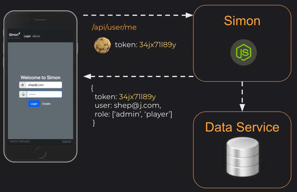

As you might imagine, authentication and authorization can become very complex, very quickly. It is also a primary target for a hacker. If they can bypass the authentication or escalate what they are authorized to do then they can gain control of your application. Additionally, constantly forcing users to authenticate in a secure way causes users to not want to use an application. This creates opposing priorities. Keep the system secure or make it easy to use.

In an attempt to remove the complexity of authentication and authorization from your application many service providers and package developers have created solutions that you can use. Assuming that you are using a trusted, well tested, service this is an attractive option because it removes the cost of building, testing, and managing that critical infrastructure yourself.

Authorization services often use standard protocols for authenticating and authorizing. These include standards such as [OAuth](https://en.wikipedia.org/wiki/OAuth), [SAML](https://en.wikipedia.org/wiki/Security_Assertion_Markup_Language), and [OIDC](https://en.wikipedia.org/wiki/OpenID). Additionally, they usually support concepts like `Single Sign On` (SSO) and Federated Login. Single sign on allows a user to use the same credentials for multiple web applications. For example, you can login into GitHub using your Google credentials. Federated login allows a user to login once and then the authentication token reused to automatically log the user into multiple websites. For example, logging into Gmail allows you to also use Google Docs and YouTube without logging in again.

For this course we will implement our own authentication using a simple a simple email/password design. Knowing how to implement a simple authentication design will help you appreciate what authentication services provide. If you want to experiment with different authorization services you might consider [AWS Cognito](https://aws.amazon.com/cognito/), or [Google Firebase](https://firebase.google.com/docs/auth).


# Account creation and login

The first step towards supporting authentication in your web application is providing a way for users to uniquely identify themselves. This usually requires two service endpoints. One to initially `create` an authentication credential, and a second to authenticate, or `login`, on future visits. Once a user is authenticated we can control access to other endpoints. For example, web services often have a `getMe` endpoint that gives information about the currently authenticated user. We will implement this endpoint to demonstrate that authentication is actually working correctly.

## Endpoint design

Using HTTP we can map out the design of each of our endpoints.

### Create authentication endpoint

This takes an email and password and returns a cookie containing the authentication token and user ID. If the email already exists it returns a 409 (conflict) status code.

```http
POST /auth/create HTTP/2
Content-Type: application/json

{
  "email":"marta@id.com",
  "password":"toomanysecrets"
}
```

```http
HTTP/2 200 OK
Content-Type: application/json
Set-Cookie: auth=tokenHere

{
  "id":"337"
}
```

### Login authentication endpoint

This takes an email and password and returns a cookie containing the authentication token and user ID. If the email does not exist or the password is bad it returns a 401 (unauthorized) status code.

```http
POST /auth/login HTTP/2
Content-Type: application/json

{
  "email":"marta@id.com",
  "password":"toomanysecrets"
}
```

```http
HTTP/2 200 OK
Content-Type: application/json
Set-Cookie: auth=tokenHere

{
  "id":"337"
}

```

### GetMe endpoint

This uses the authentication token stored in the cookie to look up and return information about the authenticated user. If the token or user do not exist it returns a 401 (unauthorized) status code.

```http
GET /user/me HTTP/2
Cookie: auth=tokenHere
```

```http
HTTP/2 200 OK
Content-Type: application/json

{
  "email":"marta@id.com"
}

```

## Web service

With our service endpoints designed, we can now build our web service using Express.

```js
const express = require('express');
const app = express();

app.post('/auth/create', async (req, res) => {
  res.send({ id: 'user@id.com' });
});

app.post('/auth/login', async (req, res) => {
  res.send({ id: 'user@id.com' });
});

const port = 8080;
app.listen(port, function () {
  console.log(`Listening on port ${port}`);
});
```

Follow these steps, and then add in the code from the sections that follow. There is a copy of the final version of the example at the end of this instruction. If you get lost, or things are not working as expected, refer to the final version.

1. Create a directory called `authTest` that we will work in.
1. Save the above content to a file named `main.js`. This is our starting web service.
1. Run `npm init -y` to initial the project to work with node.js.
1. Run `npm install express cookie-parser mongodb uuid bcrypt` to install all of the packages we are going to use.
1. Run `node main.js` or press `F5` in VS Code to start up the web service.
1. You can now open a console window and use curl to try out one of the endpoints.

   ```sh
   ➜  curl -X POST localhost:8080/auth/create

   {"id":"user@id.com"}
   ```

## Handling requests

With our basic service created, we can now implement the create authentication endpoint. The first step is to read the credentials from the body of the HTTP request. Since the body is designed to contain JSON we need to tell Express that it should parse HTTP requests, with a content type of `application/json`, automatically into a JavaScript object. We do this by using the `express.json` middleware. We can then read the email and password directly out of the `req.body` object. We can test that this is working by temporarily including them in the response.

```js
app.use(express.json());

app.post('/auth/create', (req, res) => {
  res.send({
    id: 'user@id.com',
    email: req.body.email,
    password: req.body.password,
  });
});
```

```sh
➜  curl -X POST localhost:8080/auth/create -H 'Content-Type:application/json' -d '{"email":"marta@id.com", "password":"toomanysecrets"}'

{"id":"user@id.com","email":"marta@id.com","password":"toomanysecrets"}
```

Now that we have proven that we can parse the request bodies correctly, we can change the code to add a check to see if we already have a user with that email address. If we do, then we immediately return a 409 (conflict) status code. Otherwise we create a new user and return the user ID.

```js
app.post('/auth/create', async (req, res) => {
  if (await getUser(req.body.email)) {
    res.status(409).send({ msg: 'Existing user' });
  } else {
    const user = await createUser(req.body.email, req.body.password);
    res.send({
      id: user._id,
    });
  }
});
```

## Using the database

We want to persistently store our users in Mongo and so we need to set up our code to connect to and use the database. This code is explained in the instruction on data services if you want to review what it is doing.

```js
const { MongoClient } = require('mongodb');

const userName = process.env.MONGOUSER;
const password = process.env.MONGOPASSWORD;
const hostname = process.env.MONGOHOSTNAME;

const url = `mongodb+srv://${userName}:${password}@${hostname}`;
const client = new MongoClient(url);
const collection = client.db('authTest').collection('user');
```

With a Mongo collection object we can implement the `getUser` and `createUser` functions.

```js
function getUser(email) {
  return collection.findOne({ email: email });
}

async function createUser(email, password) {
  const user = {
    email: email,
    password: password,
    token: 'xxx',
  };
  return collection.insertOne(user);
}
```

But, we are missing a couple of things. We need to a real authentication token, and we cannot simply store a clear text password in our database.

## Generating authentication tokens

To generate a reasonable authentication token we use the `uuid` package. [UUID](https://en.wikipedia.org/wiki/Universally_unique_identifier) stands for Universally Unique Identifier, and it does a really good job creating a hard to guess, random, unique ID.

```js
const uuid = require('uuid');

token: uuid.v4();
```

## Securing passwords

Next we need to securely store our passwords. Failing to do so is a major security concern. If, and it has happened to many major companies, a hacker is able to access the database, they will have the passwords for all of your users. This may not seem like a big deal if your application is not very valuable, but users often reuse passwords. That means you will also provide the hacker with the means to attack the user on many other websites.

So instead of storing the password directly, we want to cryptographically hash the password so that we never store the actual password. When we want to validate a password during login, we can hash the login password and compare it to our stored hash of the password.

To hash our passwords we will use the `bcrypt` package. This creates a very secure one way hash of the password. If you are interested in understanding how [bcrypt](https://en.wikipedia.org/wiki/Bcrypt) works, it is definitely worth the time.

```js
const bcrypt = require('bcrypt');

async function createUser(email, password) {
  // Hash the password before we insert it into the database
  const passwordHash = await bcrypt.hash(password, 10);

  const user = {
    email: email,
    password: passwordHash,
    token: uuid.v4(),
  };
  await collection.insertOne(user);

  return user;
}
```

## Passing authentication tokens

We now need to pass our generated authentication token to the browser when the login endpoint is called, and get it back on subsequent requests. To do this we use HTTP cookies. The `cookie-parser` package provides middleware for cookies and so we will leverage that.

We import the `cookieParser` object and then tell our app to use it. When a user is successfully created, or logs in, we set the cookie header. Since we are storing an authentication token in the cookie we want to make it as secure as possible, and so we use the `httpOnly`, `secure`, and `sameSite` options.

- `httpOnly` tells the browser to not allow JavaScript running on the browser to read the cookie.
- `secure` requires HTTPS to be used when sending the cookie back to the server.
- `sameSite` will only return the cookie to the domain that generated it.

```js
const cookieParser = require('cookie-parser');

// Use the cookie parser middleware
app.use(cookieParser());

apiRouter.post('/auth/create', async (req, res) => {
  if (await DB.getUser(req.body.email)) {
    res.status(409).send({ msg: 'Existing user' });
  } else {
    const user = await DB.createUser(req.body.email, req.body.password);

    // Set the cookie
    setAuthCookie(res, user.token);

    res.send({
      id: user._id,
    });
  }
});

function setAuthCookie(res, authToken) {
  res.cookie('token', authToken, {
    secure: true,
    httpOnly: true,
    sameSite: 'strict',
  });
}
```

## Login endpoint

The login authorization endpoint needs to get the hashed password from the database, compare it to the provided password using `bcrypt.compare`, and if successful set the authentication token in the cookie. If the password does not match, or there is no user with the given email, the endpoint returns status 401 (unauthorized).

```js
app.post('/auth/login', async (req, res) => {
  const user = await getUser(req.body.email);
  if (user) {
    if (await bcrypt.compare(req.body.password, user.password)) {
      setAuthCookie(res, user.token);
      res.send({ id: user._id });
      return;
    }
  }
  res.status(401).send({ msg: 'Unauthorized' });
});
```

## GetMe endpoint

With everything in place to create credentials and login using the credentials, we can now implement the `getMe` endpoint to demonstrate that it all actually works. To implement this we get the user object from the database by querying on the authentication token. If there is not an authentication token, or there is no user with that token, we return status 401 (unauthorized).

```js
app.get('/user/me', async (req, res) => {
  authToken = req.cookies['token'];
  const user = await collection.findOne({ token: authToken });
  if (user) {
    res.send({ email: user.email });
    return;
  }
  res.status(401).send({ msg: 'Unauthorized' });
});
```

## Final code

Here is the full example code.

```js
const { MongoClient } = require('mongodb');
const uuid = require('uuid');
const bcrypt = require('bcrypt');
const cookieParser = require('cookie-parser');
const express = require('express');
const app = express();

const userName = process.env.MONGOUSER;
const password = process.env.MONGOPASSWORD;
const hostname = process.env.MONGOHOSTNAME;

const url = `mongodb+srv://${userName}:${password}@${hostname}`;
const client = new MongoClient(url);
const collection = client.db('authTest').collection('user');

app.use(cookieParser());
app.use(express.json());

// createAuthorization from the given credentials
app.post('/auth/create', async (req, res) => {
  if (await getUser(req.body.email)) {
    res.status(409).send({ msg: 'Existing user' });
  } else {
    const user = await createUser(req.body.email, req.body.password);
    setAuthCookie(res, user.token);
    res.send({
      id: user._id,
    });
  }
});

// loginAuthorization from the given credentials
app.post('/auth/login', async (req, res) => {
  const user = await getUser(req.body.email);
  if (user) {
    if (await bcrypt.compare(req.body.password, user.password)) {
      setAuthCookie(res, user.token);
      res.send({ id: user._id });
      return;
    }
  }
  res.status(401).send({ msg: 'Unauthorized' });
});

// getMe for the currently authenticated user
app.get('/user/me', async (req, res) => {
  authToken = req.cookies['token'];
  const user = await collection.findOne({ token: authToken });
  if (user) {
    res.send({ email: user.email });
    return;
  }
  res.status(401).send({ msg: 'Unauthorized' });
});

function getUser(email) {
  return collection.findOne({ email: email });
}

async function createUser(email, password) {
  const passwordHash = await bcrypt.hash(password, 10);
  const user = {
    email: email,
    password: passwordHash,
    token: uuid.v4(),
  };
  await collection.insertOne(user);

  return user;
}

function setAuthCookie(res, authToken) {
  res.cookie('token', authToken, {
    secure: true,
    httpOnly: true,
    sameSite: 'strict',
  });
}

const port = 8080;
app.listen(port, function () {
  console.log(`Listening on port ${port}`);
});
```

## Experiment

With everything implemented we can use curl to try it out. First start up the web service from VS Code by pressing `F5` and selecting `node.js` as the debugger if you have not already done that. You can set breakpoints on all of the different endpoints to see what they do and inspect the different variables. Then open a console window and run the following curl commands. You should see similar results as what is shown below. Note that the `-c` and `-b` parameters tell curl to store and use cookies with the given file.

```sh
➜  curl -X POST localhost:8080/auth/create -H 'Content-Type:application/json' -d '{"email":"지안@id.com", "password":"toomanysecrets"}'

{"id":"639bb9d644416bf7278dde44"}


➜  curl -c cookie.txt -X POST localhost:8080/auth/login -H 'Content-Type:application/json' -d '{"email":"지안@id.com", "password":"toomanysecrets"}'

{"id":"639bb9d644416bf7278dde44"}


➜  curl -b cookie.txt localhost:8080/user/me

{"email":"지안@id.com"}
```


# simon-login


This deliverable demonstrates authenticating users and storing credentials and authentication tokens in MongoDB.

You can view this application running here: [Example Simon Login](https://simon-login.cs260.click)

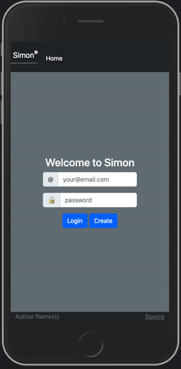

## Authorization UI

The `public/index.html`, `public/login.js`, and `public/login.css` files provide all the login UI. Bootstrap provides the styling for the controls.

When `index.html` is loaded an anonymous function in `login.js` determines if the user is already authenticated and uses that state to hide or show the login controls.

When a user logs in, logs out, or creates credentials the service endpoints are called.

## Authorization cookie

The application service uses a secure cookie to store the authorization token for an authenticated user.

```js
function setAuthCookie(res, authToken) {
  res.cookie(authCookieName, authToken, {
    secure: true,
    httpOnly: true,
    sameSite: 'strict',
  });
}
```

Note the use of secure, httpOnly, and sameSite. Make sure you are familiar with what each of these mean.

When a user is logged in, the cookie is added. When a user makes a secure request, the cookie is checked. When the user logs out, the cookie is removed.

## Application service endpoints

The service endpoints are contained in `index.js`. The endpoints include `authCreate`, `authLogin`, `authLogout`, and `userGet`. These all work with the database to store and get credentials and update the authorization cookie.

A new Express router, `secureApiRouter` wraps the existing router to add a middleware function that verifies that the authorization cookie is valid before passing the request to endpoints that require authorization. That makes it easy to create secure endpoints by just registering them with `secureApiRouter`.

## Study this code

Get familiar with what this code teaches.

- Clone the repository to your development environment.
  ```sh
  git clone https://github.com/webprogramming260/simon-login.git
  ```
- Set up your environment variables with your Atlas credentials.
- Review the code and get comfortable with everything it represents.
- View the code in your browser by hosting it from a VS Code debug session.
- See how data is populated in the database by viewing the contents of the database using the MongoDB Atlas console.
- Make modifications to the code as desired. Experiment and see what happens.

## Deploy to production

- Deploy to your production environment using a copy of the `deployService.sh` script found in the [example class application](https://github.com/webprogramming260/simon-login/blob/main/deployService.sh). Take some time to understand how it works.

  ```sh
  ./deployService.sh -k <yourpemkey> -h <yourdomain> -s simon
  ```

  For example,

  ```sh
  ./deployService.sh -k ~/keys/production.pem -h yourdomain.click -s simon
  ```

- Update your `start up` repository README.md to record and reflect on what you learned.
- Make sure your project is visible from your production environment (e.g. https://simon.yourdomain.click).
- Submit the URL to your production environment for grading using the Canvas assignment page.

## Grading Rubric

- 50% - Simon Login deployed to your production environment
- 50% - Notes in your start up repository README.md about what you have learned


# WebSocket


HTTP is based on a client server architecture. A client always initiates the request and the server responds. This is great if you are building a global document library connected by hyperlinks, but for many other use cases it just doesn't work. Applications for notifications, distributed task processing, peer to peer communication, or asynchronous events need communication that is initiated by two or more connected devices.

For years, web developers created hacks to work around the limitation of the client/server model. This included solutions like having the client frequently pinging the server to see if the server had anything to say, or keeping client initiated connections open for a very long time as the client waited for some event to happen on the server. Needless to say, none of these solutions were elegant or efficient.

Finally, in 2011 the communication protocol WebSocket was created to solve this problem. The core feature of WebSocket is that it is fully duplexed. Meaning that after the initial connection is made from a client, using vanilla HTTP, and then upgraded by the server to a WebSocket connection, the relationship changes to a peer to peer connection where either party can efficiently send data at any time.


WebSocket connections are still only between two parties. So if you want to facilitate a conversation between a group of users the server must act as the intermediary. Each peer first connects to the server, and then the server forwards messages amongst the peers.

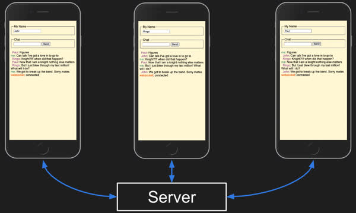

## Creating a WebSocket conversation

JavaScript running on a browser can initiate a websocket connection with the browser's WebSocket API. First you create a WebSocket object by specifying the port you want to communicate on.

You can then send messages with the `send` function, and register a callback using the `onmessage` function to receive messages.

```js
const socket = new WebSocket('ws://localhost:9900');

socket.onmessage = (event) => {
  console.log('received: ', event.data);
};

socket.send('I am listening');
```

The server uses the `ws` package to create a WebSocketServer that is listening on the same port the browser is using. By specifying a port when you create the WebSocketServer you are telling the server to listen for HTTP connections on that port and to automatically upgrade them to a WebSocket connection if the request has a `connection: Upgrade` header.

When a connection is detected it calls the server's `on connection` callback. The server can then send messages with the `send` function, and register a callback using the `on message` function to receive messages.

```js
const { WebSocketServer } = require('ws');

const wss = new WebSocketServer({ port: 9900 });

wss.on('connection', (ws) => {
  ws.on('message', (data) => {
    const msg = String.fromCharCode(...data);
    console.log('received: %s', msg);

    ws.send(`I heard you say "${msg}"`);
  });

  ws.send('Hello webSocket');
});
```

In later instruction we will show you how to run and debug this example.


# Debugging WebSocket

You can debug both sides of the WebSocket communication with VS Code to debug the server, and Chrome to debug the client. When you do this you will notice that Chrome's debugger has support specifically for working with WebSocket communication.


## Debugging the server

1. Create a directory named `testWebSocket` and change to that directory.
1. Run `npm init -y`.
1. Run `npm install ws`.
1. Open VS Code and create a file named `main.js`. Paste the following code.

   ```js
   const { WebSocketServer } = require('ws');

   const wss = new WebSocketServer({ port: 9900 });

   wss.on('connection', (ws) => {
     ws.on('message', (data) => {
       const msg = String.fromCharCode(...data);
       console.log('received: %s', msg);

       ws.send(`I heard you say "${msg}"`);
     });

     ws.send('Hello webSocket');
   });
   ```

1. Set breakpoints on the `ws.send` lines so you can inspect the code executing.
1. Start debugging by pressing `F5`. The first time you may need to choose Node.js as the debugger.

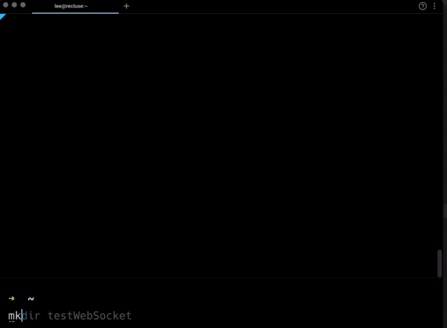

## Debugging the client

1. Open the Chrome debugger by pressing `F12`.
1. Paste this code into the debugger console window and press enter to execute it. Executing this code will immediately hit the server breakpoint. Take a look at what is going on and then remove the breakpoint from the server.

   ```js
   const socket = new WebSocket('ws://localhost:9900');

   socket.onmessage = (event) => {
     console.log('received: ', event.data);
   };
   ```

1. Select the `Network` tab and then select the HTTP message that was generated by the execution of the above client code.
1. With the HTTP message selected, you then click the `Messages` tab to view the WebSocket messages
1. Send a message to the server by executing the following in the debugger console window. This will cause the second server breakpoint to hit. Explore and then remove the breakpoint from the server.
   ```js
   socket.send('I am listening');
   ```
1. You should see the messages in the `Messages` debugger window.
1. Send some more messages and observe the communication back and forth without stopping on the breakpoints.


# WebSocket chat

With the understanding of what WebSockets are, the basics of using them from Node and the browser, and the ability to debug the communication, it is time to use WebSocket to build a simple chat application.


In this example we will create an HTML page that uses WebSockets and displays the resulting chat. The server will forward the WebSocket communication from the different clients.

## Chat client

The HTML for the client provides an input for the user's name, an input for creating messages, and an element to display the messages that are sent and received.

```html
<!DOCTYPE html>
<html lang="en">
  <head>
    <meta charset="UTF-8" />
    <meta name="viewport" content="width=device-width, initial-scale=1.0" />
    <title>WebSocket Chat</title>
    <link rel="stylesheet" href="main.css" />
  </head>
  <body>
    <div class="name">
      <fieldset id="name-controls">
        <legend>My Name</legend>
        <input id="my-name" type="text" />
      </fieldset>
    </div>

    <fieldset id="chat-controls" disabled>
      <legend>Chat</legend>
      <input id="new-msg" type="text" />
      <button onclick="sendMessage()">Send</button>
    </fieldset>
    <div id="chat-text"></div>
  </body>
  <script src="chatClient.js"></script>
</html>
```

The JavaScript for the application provides the interaction with the DOM for creating and displaying messages, and manages the WebSockets in order to connect, send, and receive messages.

### DOM interaction

We do not want to be able to send messages if the user has not specified a name. So we add an event listener on the name input and disable the chat controls if the name ever is empty.

```js
const chatControls = document.querySelector('#chat-controls');
const myName = document.querySelector('#my-name');
myName.addEventListener('keyup', (e) => {
  chatControls.disabled = myName.value === '';
});
```

We then create a function that will update the displayed messages by selecting the element with the `chat-text` ID and appending the new message to its HTML. Security minded developers will realize that manipulating the DOM in this way will allow any chat user execute code in the context of the application. After you get everything working, if you are interested, see if you can exploit this weakness.

```js
function appendMsg(cls, from, msg) {
  const chatText = document.querySelector('#chat-text');
  chatText.innerHTML = `<div><span class="${cls}">${from}</span>: ${msg}</div>` + chatText.innerHTML;
}
```

When a user presses the enter key in the message input we want to send the message over the socket. We do this by selecting the DOM element with the `new-msg` ID and adding a listener that watches for the `Enter` keystroke.

```js
const input = document.querySelector('#new-msg');
input.addEventListener('keydown', (e) => {
  if (e.key === 'Enter') {
    sendMessage();
  }
});
```

When Enter is pressed the sendMessage function is called. This selects the text out of the `new-msg` element and the name out of the `my-name` element and sends that over the WebSocket. The value of the message element is then cleared so that it is ready for the next message.

```js
function sendMessage() {
  const msgEl = document.querySelector('#new-msg');
  const msg = msgEl.value;
  if (!!msg) {
    appendMsg('me', 'me', msg);
    const name = document.querySelector('#my-name').value;
    socket.send(`{"name":"${name}", "msg":"${msg}"}`);
    msgEl.value = '';
  }
}
```

### WebSocket connection

Now we can set up our WebSocket. We want to be able to support both secure and non-secure WebSocket connections. To do this we look at the protocol that is currently being used as represented by the `window.location.protocol` variable. If it is non-secure HTTP then we set our WebSocket protocol to be non-secure WebSocket (`ws`). Otherwise we use secure WebSocket (`wss`). We use that to then connect the WebSocket to the same location that we loaded the HTML from by referencing the `window.location.host` variable.

We can notify the user that chat is ready to go by listening to the `onopen` event and appending some text to the display using the `appendMsg` function we created earlier.

```js
// Adjust the webSocket protocol to what is being used for HTTP
const protocol = window.location.protocol === 'http:' ? 'ws' : 'wss';
const socket = new WebSocket(`${protocol}://${window.location.host}/ws`);

// Display that we have opened the webSocket
socket.onopen = (event) => {
  appendMsg('system', 'websocket', 'connected');
};
```

When the WebSocket receives a message from a peer it displays it using the `appendMsg` function.

```js
socket.onmessage = async (event) => {
  const text = await event.data.text();
  const chat = JSON.parse(text);
  appendMsg('friend', chat.name, chat.msg);
};
```

And if the WebSocket closes for any reason we also display that to the user and disable the controls.

```js
socket.onclose = (event) => {
  appendMsg('system', 'websocket', 'disconnected');
  document.querySelector('#name-controls').disabled = true;
  document.querySelector('#chat-controls').disabled = true;
};
```

## Chat server

The chat server runs the web service, serves up the client code, manages the WebSocket connections, and forwards messages from the peers.

### Web service

The web service is established using a simple Express application. Note that we serve up our client HTML, CSS, and JavaScript files using the `static` middleware.

```js
const { WebSocketServer } = require('ws');
const express = require('express');
const app = express();

// Serve up our webSocket client HTML
app.use(express.static('./public'));

const port = process.argv.length > 2 ? process.argv[2] : 3000;
server = app.listen(port, () => {
  console.log(`Listening on ${port}`);
});
```

### WebSocket server

When we create our WebSocket we do things a little differently than we did with the simple connection example. Instead of letting the WebSocketServer control both the HTTP connection and the upgrading to WebSocket, we want to use the HTTP connection that Express is providing and handle the upgrade to WebSocket ourselves. This is done by specifying the `noServer` option when creating the WebSocketServer and then handling the `upgrade` notification that occurs when a client requests the upgrade of the protocol from HTTP to WebSocket.

```js
// Create a websocket object
const wss = new WebSocketServer({ noServer: true });

// Handle the protocol upgrade from HTTP to WebSocket
server.on('upgrade', (request, socket, head) => {
  wss.handleUpgrade(request, socket, head, function done(ws) {
    wss.emit('connection', ws, request);
  });
});
```

### Forwarding messages

With the WebSocket server we can use the `connection`, `message`, and `close` events to forward messages between peers. On connection we insert an object representing the connection into a list of all connections from the chat peers. Then when a message is received we loop through the peer connections and forward it on to everyone except the peer who initiated the request. Finally we remove a connection from the peer connection list when it is closed.

```js
// Keep track of all the connections so we can forward messages
let connections = [];

wss.on('connection', (ws) => {
  const connection = { id: connections.length + 1, alive: true, ws: ws };
  connections.push(connection);

  // Forward messages to everyone except the sender
  ws.on('message', function message(data) {
    connections.forEach((c) => {
      if (c.id !== connection.id) {
        c.ws.send(data);
      }
    });
  });

  // Remove the closed connection so we don't try to forward anymore
  ws.on('close', () => {
    connections.findIndex((o, i) => {
      if (o.id === connection.id) {
        connections.splice(i, 1);
        return true;
      }
    });
  });
});
```

### Keeping connections alive

A WebSocket connection will eventually close automatically if no data is sent across it. In order to prevent that from happening the WebSocket protocol supports the ability to send a `ping` message to see if the peer is still there and receive `pong` responses to indicate the affirmative.

It make this work we use `setInterval` to send out a ping every 10 seconds to each of our peer connections and clean up any connections that did not response to our previous ping.

```js
setInterval(() => {
  connections.forEach((c) => {
    // Kill any connection that didn't respond to the ping last time
    if (!c.alive) {
      c.ws.terminate();
    } else {
      c.alive = false;
      c.ws.ping();
    }
  });
}, 10000);
```

In our `connection` handler we listen for the `pong` response and mark the connection as alive.

```js
// Respond to pong messages by marking the connection alive
ws.on('pong', () => {
  connection.alive = true;
});
```

Any connection that did not response will remain in the not alive state and get cleaned up on the next pass.

# Experiment

You can find the complete example described above in this [GitHub repository](https://github.com/webprogramming260/websocket-chat).

1. Clone the repository.
1. Run `npm install` from a console window in the example directory.
1. Open up the code in VS Code and review what it is doing.
1. Run and debug the example by pressing `F5`. You may need to select node.js as the debugger the first time you run.
1. Open multiple browser windows and point them to http://localhost:3000 and start chatting.
1. Use the browser's debugger to view the WebSocket communication.


# simon-websocket


This deliverable demonstrates peer to peer communication using WebSocket. The functionality that Simon provides for peer communication is intentionally limited to display notifications between users. This was done so that the application would clearly demonstrate how WebSocket works rather than clutter the application with functionality that uses WebSockets.

You can view this application running here: [Example Simon WebSocket](https://simon-websocket.cs260.click)

## Handling WebSocket requests

After installing the `ws` NPM package the next step is to attach a WebSocket listener to the HTTP server that was created in an earlier deliverable. This work is all done in the PeerProxy class implemented in the `peerProxy.js` file. The PeerProxy class contains the protocol upgrade from HTTP to WebSocket, tracks new WebSocket connections, passes (or proxies) requests between connections, and implements ping/pong to keep connections alive.

## Displaying and generating WebSocket messages

The `public/play.js` file contains the functions for connecting, broadcasting, receiving, and displaying events using WebSocket.

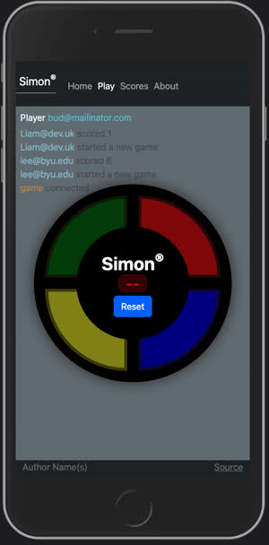

Leveraging the concepts demonstrated in this deliverable, you can implement addition functionality that uses peer to peer interactions. For example, you could make it so each connected peer has to complete one of the Simon patterns in turn.

## Study this code

Get familiar with what this code teaches.

- Clone the repository to your development environment.
  ```sh
  git clone https://github.com/webprogramming260/simon-websocket.git
  ```
- Review the code and get comfortable with everything it represents.
- View the code in your browser by hosting it from a VS Code debug session.
- Use the browser's dev tools to set breakpoints in the code and step through it each line.
- Make modifications to the code as desired. Experiment and see what happens.

## Deploy to production

- Deploy to your production environment using a copy of the `deployService.sh` script found in the [example class application](https://github.com/webprogramming260/simon-websocket/blob/main/deployService.sh). Take some time to understand how it works.

  ```sh
  ./deployService.sh -k <yourpemkey> -h <yourdomain> -s simon
  ```

  For example,

  ```sh
  ./deployService.sh -k ~/keys/production.pem -h yourdomain.click -s simon
  ```

- Update your `start up` repository README.md to record and reflect on what you learned.
- Make sure your project is visible from your production environment (e.g. https://simon.yourdomain.click).
- Submit the URL to your production environment for grading using the Canvas assignment page.

## Grading Rubric

- 50% - Simon WebSocket deployed to your production environment
- 50% - Notes in your start up repository README.md about what you have learned


# Start up deliverable - Service

Now that you have learned how to use and create services, it is time to add significant functionality to your start up application. The main things you should focus on in this deliverable include calling third party services, providing your own service endpoints, persistently storing data using MongoDB as a data service, securely authenticating a user and storing their credentials, and enabling peer to peer communication using webSockets. This is a big upgrade to your previous deliverable and it will take a significant amount of time to provide all of this functionality.

You must use the same start up GitHub repository that you created in the earlier instruction. Update the README.md file with things that you learn as you work on your start up. As you make changes to your HTML, CSS, and JavaScript commit those changes and push them to GitHub. You will need at least four commits to get full credit, but in reality you should have many more than that.

Remember to use the browser's debugger window to debug your front end HTML, CSS and JavaScript. You can also debug your back end service JavaScript running on Node.js using the built in VS Code debugger.

Once you have developed your application to where you want it, you need to release it to your production environment. **Replace** your previous start up deployment script with a copy of the `deployService.sh` script from the [Simon Service repository](https://github.com/webprogramming260/simon-service/blob/main/deployService.sh) and use `startup` for the service parameter (`-s`).

```sh
./deployService.sh -k <yourpemkey> -h <yourdomain> -s startup
```

For example,

```sh
./deployService.sh -k ~/keys/production.pem -h yourdomain.click -s startup
```

Doing this will make this deliverable of your start up available from `https://startup.yourdomainname`.

### Update your website's home page

You should also update your website's home page with a link to your project so that you can access everything you have done for this class from the home page. This will make a great portfolio of all your work in this class. You can easily do this by modifying the index.html file that is part of the website-html repository, that you created in the earlier instruction, and deploying it using the script found in that repository. Make sure you run this script from a console in the website-html repository and not your start up repository.

```sh
./deployWebsite.sh  -k <yourpemkey> -h <yourdomain>
```

## ☑ Assignment

1. Convert your start up application into a web service.
1. Provide endpoints for your service.
1. Call third party endpoints from your service. This can be as simple as displaying a quote like Simon does.
1. Persist data in MongoDB. Data is updated and displayed by manipulating the DOM.
1. Authenticate and create users. Login data is stored in MongoDB.
1. Use WebSockets to receive data from your service and render it in the DOM.
1. Make sure all authors of the code are attributed in the application and that there is a link to your GitHub repository.
1. Periodically commit and push your code to GitHub.
1. Periodically update your start up repository's README.md file to reflect what you have learned and want to remember.
1. Push your final version of your project to GitHub.
1. Deploy your start up application to your production environment (your server).
1. Make sure your application is available from your production environment.
1. Upload the URL to your start up application to the Canvas assignment.

## Grading Rubric

- 10% - Calls third party service endpoints
- 20% - Provides service endpoints running under Node.js
- 20% - Stores data in MongoDB
- 20% - Provides authenticated login with securely stored credentials in MongoDB
- 10% - Peer communication using webSockets
- 10% - Multiple Git commits with meaningful comments.
- 10% - Notes in your start up Git repository README.md file documenting what you have learned using services, node.js, mongodb, authentication, and webSockets.

## Go celebrate

You did it! This is a significant milestone. Time to grab some friends, show them what you did, and celebrate by watching a movie with popcorn ðŸ¿.


# Web frameworks

📖 **Deeper dive reading**: [MDN Introduction to client-side frameworks](https://developer.mozilla.org/en-US/docs/Learn/Tools_and_testing/Client-side_JavaScript_frameworks/Introduction)

Web frameworks seek to make the job of writing web applications easier by providing tools for completing common application tasks. This includes things like modularizing code, creating single page applications, simplifying reactivity, and supporting diverse hardware devices.

Some frameworks take things beyond the standard web technologies (HTML, CSS, JavaScript) and create new hybrid file formats that combine things like HTML and JavaScript into a single file. Examples of this include React JSX, Vue SFC, and Svelte files. Abstracting away the core web file formats puts the focus on functional components rather than files.

There are lots of web frameworks to choose from and they evolve all the time. You can view the latest popularity poll at [StateOfJS](https://stateofjs.com).

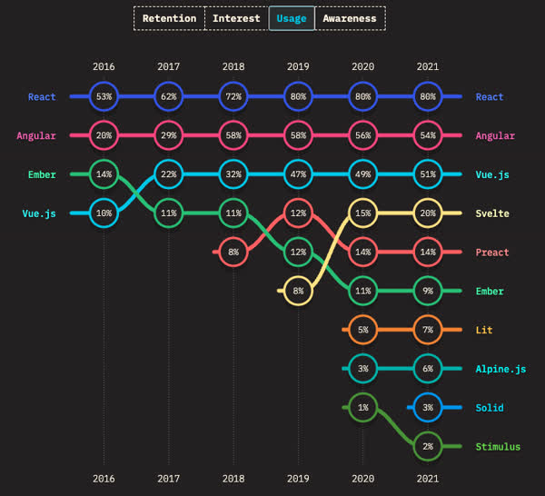

\- **Source**: _StateOfJS web framework poll_

Each framework has advantages and disadvantages. Some are very perscriptive (opinionated) about how to do things, some have major institutional backing, others have a strong open source community. Other factors you want to consider include how easy it is to learn, how it impacts productivity, how performant it is, how long it takes to build, and how actively the framework is evolving.

## Hello world examples

For our classwork we will use the web framework React. However, before we dig into React let's look at how the major frameworks would render a simple hello world application.

### Vue

[Vue](https://vuejs.org/) combines HTML, CSS, and JavaScript into a single file. HTML is represented by a `template` element that can be aggregated into other templates.

**SFC**

```html
<script>
  export default {
    data() {
      return {
        name: 'world',
      };
    },
  };
</script>

<style>
  p {
    color: green;
  }
</style>

<template>
  <p>Hello {{ name }}!</p>
</template>
```

### Svelte

Like Vue, [Svelte](https://svelte.dev/) combines HTML, CSS, and JavaScript into a single file. The difference here is that Svelte requires a transpiler to generate browser ready code, instead of a runtime virtual DOM.

**Svelte file**

```html
<script>
  let name = 'world';
</script>

<style>
  p {
    color: green;
  }
</style>

<p>Hello {name}!</p>
```

### React

React combines JavaScript and HTML into its component format. CSS must be declared outside of the JSX file. The component itself highly leverages the functionality of JavaScript and can be represented as a function or class.

**JSX**

```jsx
import 'hello.css';

const Hello = () => {
  let name = 'world';

  return <p>Hello {name}</p>;
};
```

**CSS**

```css
p {
  color: green;
}
```

### Angular component

An Angular component defines what JavaScript, HTML, and CSS are combined together. This keeps a fairly strong separation of files what are usually grouped together in a directory rather than using the single file representation.

**JS**

```js
@Component({
  selector: 'app-hello-world',
  templateUrl: './hello-world.component.html',
  styleUrls: ['./hello-world.component.css'],
})
export class HelloWorldComponent {
  name: string;
  constructor() {
    this.name = 'world';
  }
}
```

**HTML**

```html
<p>hello {{name}}</p>
```

**CSS**

```css
p {
  color: green;
}
```


# React

📖 **Recommended reading**:

- [MDN React Introduction Tutorial](https://developer.mozilla.org/en-US/docs/Learn/Tools_and_testing/Client-side_JavaScript_frameworks/React_getting_started)
- [React Quick Start](https://react.dev/learn#components)


React, and its associated projects, provide a powerful web programming framework. The name React comes from its focus on making reactive web page components that automatically update based on user interactions or changes in the underlying data.


> “The best drug is getting little things done that have been weighing on you. Instant high.â€
>
> — Jordan Walke (_Source_: [Twitter](https://twitter.com/jordwalke/status/1554625863089418243?cxt=HHwWhsCjgYv_kZMrAAAA))

React was created by Jordan Walke for use at FaceBook in 2011. It was first used with FaceBook's news feed and then as the main framework for Instagram. Shortly thereafter, FaceBook open sourced the framework and it was quickly adopted by many popular web applications.

React abstracts HTML into a JavaScript variate called [JSX](https://reactjs.org/docs/introducing-jsx.html). JSX is converted into valid HTML and JavaScript using a preprocessor called [Babel](https://babeljs.io/). For example, the following is a JSX file. Notice that it mixes both HTML and JavaScript into a single representation.

```jsx
const i = 3;
const list = (
  <ol class='big'>
    <li>Item {i}</li>
    <li>Item {3 + i}</li>
  </ol>
);
```

Babel will convert that into valid JavaScript:

```js
const i = 3;
const list = React.createElement(
  'ol',
  { class: 'big' },
  React.createElement('li', null, 'Item ', i),
  React.createElement('li', null, 'Item ', 3 + i)
);
```

The `React.createElement` function will then generate DOM elements and monitor the data they represent for changes. When a change is discovered React will trigger dependent changes.


# Components

📖 **Recommended reading**: [React.dev - Your First Component](https://react.dev/learn/your-first-component)

React components allow you to modularize the functionality of your application. This allows the underlying code to directly represent the components that a user interacts with. It also enables code reuse as common application component often show up repeatedly.

## The render function

One of the primary purposes of a component is to generate user interface. This is done with the components `render` function. Whatever is returned from the render function is inserted into the component HTML element.

As a simple example, a JSX file containing a React component element named `Demo` would cause React to load the `Demo` component, call the render function, and insert the result into the place of the `Demo` element.

**JSX**

```jsx
<div>
  Component: <Demo />
</div>
```

Notice that `Demo` is not a valid HTML element. The transpiler will replace this tag with the resulting rendered HTML.

**React component**

```js
function Demo() {
  const who = 'world';
  return <b>Hello {who}</b>;
}
```

**Resulting HTML**

```html
<div>Component: <b>Hello world</b></p>
```

## Properties

React components also allow you to pass information to them in the form of element properties. The component receives the properties in its constructor and then can display them when it renders.

**JSX**

```jsx
<div>Component: <Demo who="Walke" /><div>
```

**React component**

```jsx
function Demo(props) {
  return <b>Hello {props.who}</b>;
}
```

**Resulting HTML**

```html
<div>Component: <b>Hello Walke</b></div>
```

## State

In addition to properties, a component can have internal state. Component state is created by calling the `React.useState` hook function. The useState function returns a variable that contains the current state and a function to update the state. The following example creates a state variable called `clicked` and toggles the click state in the `updateClicked` function that gets called when the paragraph text is clicked.

```jsx
const Clicker = () => {
  const [clicked, updateClicked] = React.useState(false);

  const onClicked = (e) => {
    updateClicked(!clicked);
  };

  return <p onClick={(e) => onClicked(e)}>clicked: {`${clicked}`}</p>;
};

const root = ReactDOM.createRoot(document.getElementById('root'));
root.render(<Clicker />);
```

You should note that you can use JSX even without a function. A simple variable representing JSX will work anyplace you would otherwise provide a component.

```jsx
const hello = <div>Hello</div>;

ReactDOM.render(hello, document.getElementById('root'));
```

## Class style components

In addition to the preferred `function style` components demonstrated above, React also supports `class style` components. However, you should note that the React team is moving away from the class style representation, and for that reason you should probably not use it. With that said, you are likely to see class style components and so you should be aware of the syntax. Below is the equivalent class style component for the Clicker component that we created above.

The major difference is that properties are loaded on the constructor and state is set using a `setState` function on the component object.

```jsx
class Clicker extends React.Component {
  constructor(props) {
    super(props);
    this.state = {
      clicked: false,
    };
  }
  onClicked() {
    this.setState({
      clicked: !this.state.clicked,
    });
  }
  render() {
    return <p onClick={(e) => this.onClicked(e)}>clicked: {`${this.state.clicked}`}</p>;
  }
}

const root = ReactDOM.createRoot(document.getElementById('root'));
root.render(<Clicker />);
```

## Reactivity

A component's properties and state are used by the React framework to determine the reactivity of the interface. Reactivity controls how a component reacts to actions taken by the user or events that happen within the application. Whenever a component's state or properties change, the render function for the component and all of its dependent component render functions are called.

## ☑ Assignment

Create a fork of this [CodePen](https://codepen.io/leesjensen/pen/Yzvaver) and experiment.

Try the following:

1. Add a new property to the Demo component that provides the background color for the component.
2. Add another state variable that changes the color on a mouse over event.

When you are done submit your CodePen URL, along with a comment about something you found interesting, to the Canvas assignment.

### 🧧 Possible solution (spoilers!)

If you get stuck here is a possible solution.

```jsx
function App() {
  return (
    <div>
      Function Style Component: <Demo who='function' color='yellow' />
    </div>
  );
}

const Demo = ({ who, initialColor }) => {
  const [color, setColor] = React.useState(initialColor);
  const [outlook, setOutlook] = React.useState('beautiful');

  function changeOutlook() {
    setOutlook(outlook === 'exciting' ? 'beautiful' : 'exciting');
  }

  function changeColor() {
    var randomColor = Math.floor(Math.random() * 16777215).toString(16);
    setColor('#' + randomColor);
  }

  return (
    <div className='component' onMouseOver={changeColor} style={{ background: color }}>
      <p>
        Hello {outlook} {who}
      </p>
      <button onClick={changeOutlook}>change</button>
    </div>
  );
};
```


# Reactivity

Making the UI react to changes in user input or data, is one of the architectural foundations of React. React enables reactivity with three major pieces of a React component: `props`, `state`, and `render`.

When a component's JSX is rendered, React parses the JSX and creates a list of any references to the component's `state` or `prop` objects. React then monitors those objects and if it detects that they have changed it will call the component's `render` function so that the impact of the change is visualized.

The following example contains two components. A parent Survey component and a child Question component. The Survey has a state named `color`. The Question has a property named `color`. The Survey passes its `color` state to the Question as a property. This means that any change to the Survey's color will also be reflected in the Question's color. This is a powerful means for a parent to control a child's functionality.

The Question component also has a state named `answer`. The value of answer is displayed as part of the Question's content. The user can interact with this state through HTML radio input elements. When one of the inputs is changed the Question's `onChange` function is called and the answer state is updated to reflect the user's choice. This automatically causes the display of the answer to be updated.

Be careful about your assumptions of when state is updated. Just because you called `updateState` does not mean that you can access the updated state on the next line of code. The update happens asynchronously, and therefore you never really know when it is going to happen, you only know that it will eventually happen.

```jsx
// The Survey component
const Survey = () => {
  const [color, updateColor] = React.useState('#737AB0');

  // When the color changes update the state
  const onChange = (e) => {
    updateColor(e.target.value);
  };
  return (
    <div>
      <h1>Survey</h1>
      {/* Pass the Survey color state as a property to the Question.
          When to color changes the Question property will also be updated and rendered. */}
      <Question color={color} />

      <p>
        <span>Pick a color: </span>
        {/* Pass the Survey color state as a property to the input element.
            When to color changes, the input property will also be updated and rendered. */}
        <input type='color' onChange={(e) => onChange(e)} value={color} />
      </p>
    </div>
  );
};

// The Question component
const Question = ({ color }) => {
  const [answer, updateAnswer] = React.useState('pending...');

  function onChange({ target }) {
    updateAnswer(target.value);
  }

  return (
    <div>
      <span>Do you like this</span>
      {/* Color rerendered whenever the property changes */}
      <span style={{ color: color }}> color</span>?
      <label>
        <input type='radio' name='answer' value='yes' onChange={(e) => onChange(e)} />
        Yes
      </label>
      <label>
        <input type='radio' name='answer' value='no' onChange={(e) => onChange(e)} />
        No
      </label>
      {/* Answer rerendered whenever the state changes */}
      <p>Your answer: {answer}</p>
    </div>
  );
};

ReactDOM.render(<Survey />, document.getElementById('root'));
```

## ☑ Assignment

Create a fork of this [codePen](https://codepen.io/leesjensen/pen/NWzYzXE) and experiment. Try changing the input from using the color and radio button, to using an edit box that reactively displays the text as you type.

When you are done submit your CodePen URL, along with a comment about something you found interesting, to the Canvas assignment.

Don't forget to update your GitHub start up repository README.md with all of the things you learned and want to remember.

### 🧧 Possible solution (spoilers!)

If you get stuck here is a possible solution.

```jsx
// The Survey component
const Survey = () => {
  const [text, updateText] = React.useState('');

  const onChange = (e) => {
    updateText(e.target.value);
  };
  return (
    <div>
      <h1>Survey</h1>
      <Question text={text} />

      <p>
        <span>Type some text: </span>
        <input type='text' onChange={(e) => onChange(e)} placeholder='type here' />
      </p>
    </div>
  );
};

// The Question component
const Question = ({ text }) => {
  return (
    <div>
      <p>You typed: {text}</p>
    </div>
  );
};
```


# Tic-Tac-Toe tutorial

The tic-tac-toe tutorial provided on the React website is a good way to get familiar with the basics of React. The tutorial starts out simple and then introduces different concepts until you have built a fully functional application.

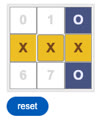

## ☑ Assignment

Complete the [tic-tac-toe tutorial](https://react.dev/learn/tutorial-tic-tac-toe). Note that the tutorial uses `codesandbox.io` instead of CodePen. You will need to create an account there in order to save your fork of the project. Don't worry about following the tutorial exactly. Feel free to take things in whatever direction interests you. The point is to experiment and have fun.

When you are done submit your CodeSandbox URL, along with a comment about something you found interesting, to the Canvas assignment.


# React hooks

📖 **Recommended reading**: [Reactjs.org - Hooks Overview](https://reactjs.org/docs/hooks-overview.html)

React hooks allow React function style components to be able to do everything that a class style component can do and more. Additionally, as new features are added to React they are including them as hooks. This makes function style components the preferred way of doing things in React. You have already see one use of hooks to declare and update state in a function component with the `useState` hook.

```jsx
function Clicker({ initialCount }) {
  const [count, updateCount] = React.useState(initialCount);
  return <div onClick={() => updateCount(count + 1)}>Click count: {count}</div>;
}

ReactDOM.render(<Clicker initialCount={3} />, document.getElementById('root'));
```

## useEffect hook

The `useEffect` hook allows you to represent lifecycle events. For example, if you want to run a function every time the component completes rendering, you could do the following.

```jsx
function UseEffectHookDemo() {
  React.useEffect(() => {
    console.log('rendered');
  });

  return <div>useEffectExample</div>;
}

ReactDOM.render(<UseEffectHookDemo />, document.getElementById('root'));
```

You can also take action when the component cleans up by returning a cleanup function from the function registered with `useEffect`. In the following example, every time the component is clicked the state changes and so the component is rerendered. This causes both the cleanup function to be called in addition to the hook function. If the function was not rerendered then only the cleanup function would be called.

```jsx
function UseEffectHookDemo() {
  const [count, updateCount] = React.useState(0);
  React.useEffect(() => {
    console.log('rendered');

    return function cleanup() {
      console.log('cleanup');
    };
  });

  return <div onClick={() => updateCount(count + 1)}>useEffectExample {count}</div>;
}

ReactDOM.render(<UseEffectHookDemo />, document.getElementById('root'));
```

This is useful when you want to create side effects for things such as tracking when a component is displayed or hidden, or creating and disposing of resources.

## Hook dependencies

You can control what triggers a `useEffect` hook by specifying its dependencies. In the following example we have two state variables, but we only want the `useEffect` hook to be called when the component is initially called and when the first variable is clicked. To accomplish this you pass an array of dependencies as a second parameter to the `useEffect` call.

```jsx
function UseEffectHookDemo() {
  const [count1, updateCount1] = React.useState(0);
  const [count2, updateCount2] = React.useState(0);

  React.useEffect(() => {
    console.log(`count1 effect triggered ${count1}`);
  }, [count1]);

  return (
    <ol>
      <li onClick={() => updateCount1(count1 + 1)}>Item 1 - {count1}</li>
      <li onClick={() => updateCount2(count2 + 1)}>Item 2 - {count2}</li>
    </ol>
  );
}

ReactDOM.render(<UseEffectHookDemo />, document.getElementById('root'));
```

If you specify and empty array `[]` as the hook dependency then it is only called when the component is first rendered.

Note that hooks can only be used in function style components and must be called at the top scope of the function. That means a hook cannot be called inside of a loop or conditional. This restriction ensures that hooks are always called in the same order when a component is rendered.


# Toolchains

As web programming becomes more and more complex it became necessary to abstract away some of that complexity with a series of tools. Some common functional pieces in a web application chain include:

- **Code repository** - Stores code in a shared, versioned, location.
- **Linter** - Removes, or warns, of non-idiomatic code usage.
- **Prettier** - Formats code according to a shared standard.
- **Transpiler** - Compiles code into a different format. For example, from JSX to JavaScript.
- **Polyfill** - Generates backward compatible code for supporting old browser versions that do not support the latest standards.
- **Bundler** - Packages code into bundles for delivery to the browser. This enables compatibility (for example with ES6 module support), or performance (with lazy loading).
- **Minifier** - Removes whitespace and renames variables in order to make code smaller and more efficient to deploy.
- **Testing** - Automated tests at multiple levels to ensure correctness.
- **Deployment** - Automated packaging and delivery of code from the development environment to the production environment.

The toolchain that we use for our React project consists of [GitHub](https://github.com/) as the code repository, [Babel](https://babeljs.io/docs/en/) for transpiling, [WebPack](https://webpack.js.org/) for polyfill, bundling, and minifying, and finally a simple bash script (deployReact.sh) for deployment.

You don't have to fully understand what each of these pieces in the chain are accomplishing, but the more you know about them the more you can optimize your development efforts.


# React CLI

🔑 **Required reading**: [Create React App Getting Started](https://create-react-app.dev/docs/getting-started)

Now that we have covered the basics of React, we want to extend our usage to include a full web framework toolchain that allows us to use JSX, minification, polyfills, and bundling for our Simon and start up applications. One common way for configuring your project to take advantage of these technologies is to use a Command Line Interface (CLI) to initially set up a React based project.

A CLI is a program that runs from the console and usually provides an assortment of commands related to some specific purpose. For example, the [AWS CLI](https://aws.amazon.com/cli/) allows you to interact with all of its services. This saves you the time of having to bring up the AWS website interface when you want to use an AWS service. Instead of opening a browser, logging in, navigating to a service, and walking through a bunch of UI dialogs, you simply open your console window and use the AWS CLI to execute a single command.

To set up our React toolchain we will use the `create-react-app` CLI. This CLI will create and configure a template React application that you can use as a starting place for your application. `create-react-app` is an NPM package that works as a console program. Previously you used npm packages to add code libraries to your applications, but you can also run NPM packages as if they were a console program, if they are [configured](https://blog.npmjs.org/post/118810260230/building-a-simple-command-line-tool-with-npm.html) to do so.

The common way to run CLI NPM programs is to use the `NPX` program that was included when you installed NPM. NPX will temporarily download the desired package from NPM and then execute it using Node. Basically, NPX is just a short cut for `NPM install` and `NPM start`. It also has the advantage of not actually persistently installing the package and so it doesn't leave any clutter behind in your development environment.

When you run `create-react-app` with NPX, it creates a brand new React application project based on a standard template. You can see how this works by running the following from your console window. Make sure you are in a directory where you keep your coding projects. For example, `cd ~/src/byu/cs260`.

```sh
npx create-react-app test-react
```

When this runs it will create a project directory named `test-react`, create a bunch of project template files, and install the NPM packages necessary to use React and the associated toolchain. You can examine the project it created by changing into the `test-react` directory and opening VS Code.

```sh
cd test-react
code .
```

Before we look at what the generated project contains, let's run the application and see what it does. From the `test-react` directory run `npm start`.

```sh
➜  npm start

Compiled successfully!

You can now view test-react in the browser.

  Local:            http://localhost:3000
```

This should automatically launch the application and open your browser to display the application running on port 3000.

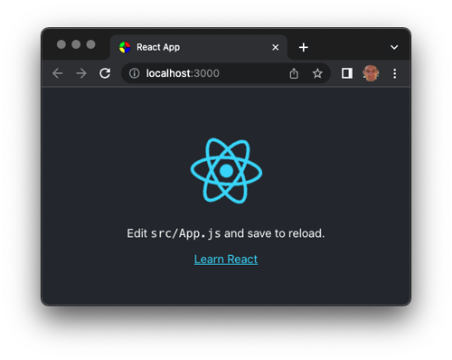

To stop the application, use the `CTRL-C` (kill) keystroke in the console window where you started it.

Congratulations you have just used a CLI to create a React based web application. Time for cookies.

## Generated project

Let's examine the file and directory structure that `create-react-app` created.

| Directory | File               | Purpose                                                      |
| --------- | ------------------ | ------------------------------------------------------------ |
| ./        | .gitignore         | Specifies files to not include in your Git commits           |
|           | package-json       | NPM definition for included packages and script commands     |
|           | package-lock.json  | Version constraints for included packages (do not edit this) |
|           | README.md          | GitHub readme for the project                                |
| ./public  | index.html         | Primary page for the application                             |
|           | favicon.ico        | Primary application icon                                     |
|           | logo\*.png         | Icons used for mobile devices                                |
|           | manifest.json      | Configuration for use on mobile devices (PWA support)        |
|           | robots.txt         | Directives for search engine crawlers like Google            |
| ./src     | index.js           | Entry point for code execution                               |
|           | index.css          | CSS for top level component                                  |
|           | App.css            | CSS for the main application component                       |
|           | App.js             | JavaScript for the main application component                |
|           | App.test.js        | Automated tests for the main application component           |
|           | logo.svg           | Image displayed in the main application component            |
|           | reportWebVitals.js | Configuration for reporting application performance          |
|           | setupTests.js      | Set up for automated tests                                   |

At a high level `create-react-app` did the following:

1. Updated `./package-json` to include the necessary NPM packages for running and testing a React application.
1. Created `./public/index.html` as the entry point for the browser to load your application
1. Created `./src/index.js` to initialize the React application
1. Created `./src/app.js` to provide the top level React component

All the other files provide styling, use on mobile devices, testing, and performance monitoring.

## Digging into the generated code

When the browser requests to load your application it gets `index.html` by default. `index.html` contains the basic metadata for the application, but the actual content is injected into the HTML, at runtime, based upon the code contained in `index.js`. This happens because React by default will look for a file named `index.js` and execute it. The `index.js` file contains code that looks for a `div` element named `root` and renders the App component into that div. This causes the `App` component to be loaded from `App.js` which finally provides the content that you see visualized in the browser.


From this basic template code, you can build your application by replacing the App component, adding new React child components to the App component, and introducing a React router.

## What the toolchain is doing

When you run `npm start` it executes the `start` script found in `package.json`.

```json
  "scripts": {
    "start": "react-scripts start",
    "build": "react-scripts build",
  }
```

This runs another NPM CLI package called `react-scripts` and tells it to build the application from the code and launch it with a development HTTP server similar to the Live Server extension you have been using in VS Code. `react-scripts` then launches your browser and points it to `localhost:3000` where you can see the application rendering. Note that the development HTTP server will monitor changes to the application source and automatically rebuild it. Try this out by starting the application, editing the `App.js` file to contain something different, saving it, and looking at the browser window displaying the application.

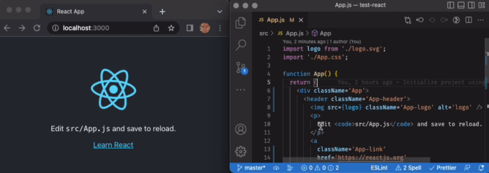

When `react-scripts` builds the application it converts the React JSX files to valid JavaScript and populates the `index.html` file with references to the generated files. If you look at `index.html` in your project, you will see that it contains a fairly bare bones HTML page.

**Template version of index.html**

```html
<html lang="en">
  <head>
    <meta charset="utf-8" />
    <link rel="icon" href="%PUBLIC_URL%/favicon.ico" />
    <meta name="viewport" content="width=device-width, initial-scale=1" />
    <meta name="theme-color" content="#000000" />
    <meta name="description" content="Web site created using create-react-app" />
    <link rel="apple-touch-icon" href="%PUBLIC_URL%/logo192.png" />
    <link rel="manifest" href="%PUBLIC_URL%/manifest.json" />
    <title>React App</title>
  </head>
  <body>
    <div id="root"></div>
  </body>
</html>
```

If you start the application, and use the browser's debugger to look at the actual HTML loaded into the DOM you will see the result of the toolchain manipulation and bundling. (Note that this code has been abbreviated for clarity of the example.) Our `index.html` file now has injected file paths, JavaScript for running the React web framework in the browser, CSS elements for the currently rendered components, and the transpiled component HTML from the React components.

**DOM version of index.html**

```html
<html lang="en">
  <head>
    <meta charset="utf-8" />
    <!-- path for public files in injected -->
    <link rel="icon" href="/favicon.ico" />
    <meta name="viewport" content="width=device-width, initial-scale=1" />
    <meta name="theme-color" content="#000000" />
    <meta name="description" content="Web site created using create-react-app" />
    <link rel="apple-touch-icon" href="/logo192.png" />
    <link rel="manifest" href="/manifest.json" />
    <title>React App</title>
    <!-- The minified JavaScript for using React as the web framework -->
    <script defer="" src="/static/js/bundle.js"></script>
    <!-- CSS styles are inserted from the component CSS. -->
    <style>
      body {
        margin: 0;
        font-family: 'Roboto', 'Oxygen', 'Ubuntu', sans-serif;
      }
      .App {
        text-align: center;
      }
    </style>
  </head>
  <body>
    <!-- Root application JSX transpiled and inserted -->
    <div id="root">
      <!-- Application component JSX transpiled and inserted -->
      <div class="App">
        <header class="App-header">
          
          <p>Edit <code>src/App.js</code> and save to reload.</p>
          <a class="App-link" href="https://reactjs.org" target="_blank" rel="noopener noreferrer">Learn React</a>
        </header>
      </div>
    </div>
  </body>
</html>
```

## Modifying the generated project

There is nothing that `create-react-app` does that you should consider off limits for change or improvement. If you take the time to understand what it is doing and why, then you should feel free to customize the application to how you would like it to work. At a basic level you should always do the following:

1. Replace the icon files with your own icons
1. Modify the manifest.json and package.json to contain your application name
1. Modify the README.md to describe your application
1. Modify index.html to contain a proper title and description metadata.

### Removing testing and performance monitoring

As an example of more extension modifications, we can remove the testing and performance packages that `create-react-app` included in the template. You might do this because you are trying to simplify the project for demonstration purposes, or because you want to replace it with a different testing framework such as Playwright.

To make this change, we first use NPM to **uninstall** the `@testing-library` packages. This removes the packages from `package.json` so that they are no longer installed in `node_modules` when you run `npm install`.

```sh
npm uninstall @testing-library/jest-dom @testing-library/react @testing-library/user-event
```

Next delete the test JavaScript files `setupTest.js` and `App.test.js`. With the testing packages gone, nothing will call this code and so we can simply delete it.

```sh
rm src/setupTests.js src/App.test.js
```

We can also remove the performance reporting package and code in order to simplify our application even further.

```sh
npm uninstall web-vitals
rm src/reportWebVitals.js
```

Finally, we remove the references to `reportWebVitals` from `index.js` since that package is no longer available.

**index.js**

```js
import React from 'react';
import ReactDOM from 'react-dom/client';
import './index.css';
import App from './App';
// -> Delete
// import reportWebVitals from './reportWebVitals';

const root = ReactDOM.createRoot(document.getElementById('root'));
root.render(
  <React.StrictMode>
    <App />
  </React.StrictMode>
);

// -> Delete
// reportWebVitals();
```

If we run `npm start` again the application will run the same as before, but without testing or performance monitoring support. You can now insert a different package for these vital functions if you so desire.

If you want to strip the project down even more, you can also delete the robots.txt, manifest.json, and the logo\*.png files.

Temporarily deleting code is sometimes a good strategy to use when trying to learn how the code works. If everything is committed to Git then you can easily do experiments like this.

### JSX vs JS

The `create-react-app` CLI uses the `.js` (JavaScript) extension for JSX files instead of `.jsx`. The Babel transpiler will work with either one, but some editor tools will work differently based upon the extension. For this reason, you might consider renaming the `.js` files that actually contain JSX to use `.jsx` instead. The developers at AirBNB had an interesting [conversation](https://github.com/airbnb/javascript/pull/985) on this topic that you might browse if you would like to consider the differing opinions on this subject.

## Building a production release

Now that you have your React application the way that you like you need to build a production ready release. You do this by running `npm run build`. The executes the `build` script found in your `package.json`. The `build` script transpiles, minifies, and injects the proper JavaScript, and then outputs everything to a deployment ready version contained in a subdirectory named `build`.

```sh
➜  npm run build

Creating an optimized production build...
Compiled successfully.
```

The deployment scripts for Simon React creates a distribution package by calling `npm run build` and then copying the `build` directory out to your production server.

## Other React project generators

The `create-react-app` CLI is not the only tool that you can use to generate a templated React project. For example, there is also `nano-react-app`, that uses [Vite](https://vitejs.dev/) instead of [webpack](https://webpack.js.org/), and results in a very minimal collection of template files. If you are comfortable with what `create-react-app` is doing, then you might experiment with some of the other CLI alternatives. Otherwise, just stick with `create-react-app` for now.

## ☑ Assignment

Experiment with `create-react-app` by creating a test application named `test-react-cli`. Run the application using `npm start`. Then alter the code by changing the content, deleting functionality, and adding a simple component. Finally, build a production deployment version of the application with `npm run build`. When you are done submit a comment about something you found interesting, to the Canvas assignment.

Don't forget to update your GitHub start up repository README.md with all of the things you learned and want to remember.


# Router

🔑 **Required reading**: [React Router DOM Tutorial](https://blog.webdevsimplified.com/2022-07/react-router/)

A web framework router provides essential functionality for single page applications. With a multiple web page application the headers, footers, navigation, and common components must be either duplicated in each HTML page, or injected before the server sends the page to the browser. With a single page application the browser only loads one HTML page and then JavaScript is used to manipulate the DOM and give it the appearance of multiple pages. The router defines the routes a user can take through the application, and automatically manipulates the DOM to display the appropriate framework components.

React does not have a standard router package, and there are many that you can choose from. We will use [react-router-dom](https://www.npmjs.com/package/react-router-dom) Version 6. The simplified routing functionality of React-router-dom derives from the project [react-router](https://www.npmjs.com/package/react-router) for its core functionality. Do not confuse the two, or versions of react-router-dom before version 6, when reading tutorials and documentation.

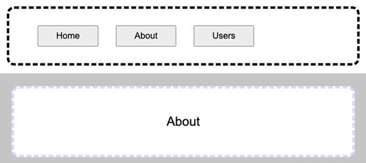

A basic implementation of the router consists of a `BrowserRouter` component that encapsulates the entire application and controls the routing action. The `Link` component captures user navigation events and modifies what is rendered by the `Routes` component by matching up the `to` and `path` attributes.

```jsx
// Inject the router into the application root DOM element
const root = ReactDOM.createRoot(document.getElementById('root'));
root.render(
  // BrowserRouter component that controls what is rendered
  // NavLink component captures user navigation requests
  // Routes component defines what component is routed to
  <BrowserRouter>
    <div className='app'>
      <nav>
        <NavLink to='/'>Home</Link>
        <NavLink to='/about'>About</Link>
        <NavLink to='/users'>Users</Link>
      </nav>

      <main>
        <Routes>
          <Route path='/' element={<Home />} exact />
          <Route path='/about' element={<About />} />
          <Route path='/users' element={<Users />} />
          <Route path='*' element={<Navigate to='/' replace />} />
        </Routes>
      </main>
    </div>
  </BrowserRouter>
);
```

## ☑ Assignment

Create a fork of this [codePen](https://codepen.io/leesjensen/pen/poKLKaX) and experiment.

When you are done submit your CodePen URL, along with a comment about something you found interesting, to the Canvas assignment.

Don't forget to update your GitHub start up repository README.md with all of the things you learned and want to remember.


# Simon React


This deliverable demonstrates using React as a web framework. When your application starts getting more and more complex, it becomes necessary to use a web framework that helps with tasks such as building modular components, providing reactive UI elements, supporting sessions, lazy loading, and reducing (minifying) the size of your application.

Some frameworks take the additional step of abstracting parts of HTML and CSS to make authoring components easier. When this happens the project must be pre-processed in order to turn it into HTML and CSS that the browser can execute. This process requires a toolchain that executes to produce a browser ready bundle.

The introduction of React converts our application from a **multi-page application** to a **single page application**. In a single page application, the browser only loads a single HTML file (index.html), and then we use JavaScript to interactively change the rendered content and components. This is a significant architectural shift to the application and will require you to reorganize your code to fit the single page, component driven, model.

For this deliverable, we use the [React](README/https://reactjs.org/) framework and the associated `create-react-app` package to convert Simon into a React based application.

# Steps to convert Simon to React

The following section discusses the general steps taken to convert the Simon application from a simple HTML/CSS/JavaScript application to a React application. You will need to take similar steps for your start up project and so it is important to understand what is happening at each step conversion process. You don't necessarily have to go through this process with the Simon demonstration application, but it is a safe place to try since you have both the starting version (simon-websocket) and the ending version (simon-react) to reference.

The first step uses `create-react-app` to create a React template application that is moved into the Simon code repository. The HTML, CSS, and JavaScript is then reworked into React components. The React components are then refactored to take advantage of functionality that React provides including function style components, modularization, and a React representation of Bootstrap.

Here is a complete list of all the steps involved to convert Simon to a React application. Steps with a â­ prefix are detailed below in order to help clarify some of the more complicated parts.

1. â­ **Reorganize Simon**
1. **Commit**: Commit this version in Git as the starting place for the conversion to React. It won't run, but by committing at this point can revert if necessary, instead of starting over. Make sure you keep testing and committing throughout this process.
1. **Create template React application**. Run `npx create-react-app template-react`. This creates a new directory named `template-react` that contains the basic configuration and template React application code.
1. **Clean up template code**
   1. Uninstall and NPM packages you won't use (e.g. stats, test)
   1. Delete the unnecessary create-react-app files (e.g. images)
   1. Rename `js` JSX files have `jsx` extension
   1. Replace the `favicon.ico` with the Simon icon
   1. Update `manifest.json` to represent Simon
   1. Clean up the `index.html` file to have the proper fields for Simon
1. â­ **Move template files to Simon**
1. â­ **Convert to React Bootstrap**
1. â­ **Populate App.jsx**
1. â­ **Create view components**
1. â­ **Create the router**
1. â­ **Convert to React components**
1. â­ **Set up to debug**
1. Refactor play.jsx into simonGame.jsx, simonButton.jsx, and players.jsx
1. Refactor components to take advantage of React specific functionality and to create sub-components
1. Move webSocket code from play.jsx to gameNotifier.js

The final Simon project structure look like the following.

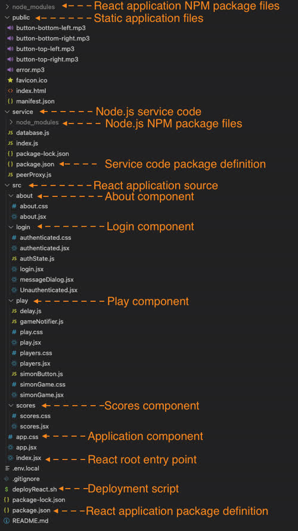

## Reorganize Simon

Because we are hosting both the Simon React application and the Simon service web service in the same project we need to put them each in separate directories. We want the service code in a `service` directory and the React code in the `src` directory. To accomplish this, first delete the `node_modules` directory from the `simon` directory. Then move the service code (`package.json`, `package-lock.json`, `index.js`, `database.js`, and `peerProxy.js`) into a subdirectory named `service`. Then run `npm install` in the `service` directory in order to get the NPM packages for the service.

Once you move the service to the `service` directory, you can test that the service is still working by running `node index.js` from a console window in the `service` directory. Try it out and make sure you can hit the service endpoints using Curl.

```sh
➜  curl 'localhost:3000/api/user/joe'

{"msg":"Unknown"}
```

Next, we want to put the existing UI code in a temporary place where we can then copy from as we move it to the React componentized version contained in the React `src` directory. To do this we rename the `public` directory to `old-public`. Once we have moved all the code over, we can delete the `old-public` directory.

## Move template files to Simon

Copy over the generated files from the `template-react` directory to the `simon` repository directory. You can now delete the template `template-react` directory. All steps from this point on are done in the `simon` repository directory. Run `npm install` in the root of the `simon` directory to get all of the NPM packages that React uses.

## Convert to React Bootstrap

There is an NPM package called [React Bootstrap](https://react-bootstrap.github.io/) that wraps the Bootstrap CSS framework in React components. This allows you to treat the Bootstrap widgets such as Button and Modal as a React component instead of just imported CSS and JavaScript.

To use the React version of Bootstrap import the NPM package.

```sh
npm install bootstrap react-bootstrap
```

Now, in the components where you want to refer to the Bootstrap styles, you can import the css from the
imported NPM package just like you would other CSS files.

```jsx
import 'bootstrap/dist/css/bootstrap.min.css';
```

For example, you can add that import to the `app.jsx` component in order to enable bootstrap.

For Simon we converted the modal dialog and button implementations to use the React Bootstrap components.

## Populate App.jsx

One of the big advantages of React is the ability to represent your web application as a modular single page application instead of a set of interconnected redundant HTML pages. Instead of an HTML page for each functional piece, you now have a React component for each functional piece. The `app.jsx` file represents the application component that is the parent of all our other components. To make `app.jsx` the Simon application component, we first move the header and footer HTML into the render function for the app. Since, this is now JSX instead of HTML we rename the `class` attribute to be `className` so that it doesn't conflict with the JavaScript `class` keyword.

```jsx
function App() {
  return (
    <div className='body bg-dark text-light'>
      <header className='container-fluid'>
        <nav className='navbar fixed-top navbar-dark'>
          <div className='navbar-brand'>
            Simon<sup>&reg;</sup>
          </div>
          <menu className='navbar-nav'>
            <li className='nav-item'>
              <a className='nav-link active' href='index.html'>
                Home
              </a>
            </li>
            <li className='nav-item'>
              <a className='nav-link' href='play.html'>
                Play
              </a>
            </li>
            <li className='nav-item'>
              <a className='nav-link' href='scores.html'>
                Scores
              </a>
            </li>
            <li className='nav-item'>
              <a className='nav-link' href='about.html'>
                About
              </a>
            </li>
          </menu>
        </nav>
      </header>

      <footer className='bg-dark text-dark text-muted'>
        <div className='container-fluid'>
          <span className='text-reset'>Author Name(s)</span>
          <a className='text-reset' href='https://github.com/webprogramming260/simon-react'>
            Source
          </a>
        </div>
      </footer>
    </div>
  );
}
```

In order for the styling to show up, move the `main.css` content into a file named `app.css` and import the CSS file into the app.jsx file.

```jsx
import `./app.css`
```

### Checking the authentication state

Next, we want to disable the ability to access the play and scores if the user is not authenticated. We do this with a React `useEffect` hook that will run whenever the user name changes. The hook will call out to the simon `getUser` endpoint and set a state variable based on the result. The state is then used to show or hide the play and scores NavLinks.

```jsx
const [userName, setUserName] = React.useState(localStorage.getItem('userName') || '');

// Asynchronously determine if the user is authenticated by calling the service
const [authState, setAuthState] = React.useState(AuthState.Unknown);
React.useEffect(() => {
  if (userName) {
    fetch(`/api/user/${userName}`)
      .then((response) => {
        if (response.status === 200) {
          return response.json();
        }
      })
      .then((user) => {
        const state = user?.authenticated ? AuthState.Authenticated : AuthState.Unauthenticated;
        setAuthState(state);
      });
  } else {
    setAuthState(AuthState.Unauthenticated);
  }
}, [userName]);
```

### Showing or hiding the navigation elements based on the authentication state

```jsx
{
  authState === AuthState.Authenticated && (
    <li className='nav-item'>
      <a className='nav-link' href='play.html'>
        Play
      </a>
    </li>
  );
}
```

## Create view components

We now create React component files `login.jsx`, `play.jsx`, `scores.jsx`, and `about.jsx` to represent each of the application views. To begin with these are just stubs that we will populate as we move functionality from the old `js` files into the `jsx` components. We place each of the stubbed components in a separate directory (e.g. `src/login/login.jsx) so that we can keep all of the component files together.

Here is the `login.jsx` stub before any code is converted over. The other components would be similar.

```jsx
import React from 'react';

export function Login() {
  return (
    <main className='container-fluid bg-secondary text-center'>
      <div>login displayed here</div>
    </main>
  );
}
```

## Create the router

With `app.jsx` containing the header and footer and all the application view component stubs created, we can now create the router that will display each component as the navigation UI requests it.

This is done by inserting the `react-router-dom` package into the project. First, install the package with `npm install react-router-dom` and then include the router component in the `index.jsx` and `app.jsx` files.

### index.jsx

The router controls the whole application by determining what component to display based upon what navigation the user chooses. In order for the router to be able to do this the `BrowserRouter` component element must have the `App` element as a child.

```jsx
const root = ReactDOM.createRoot(document.getElementById('root'));
root.render(
  <BrowserRouter>
    <App />
  </BrowserRouter>
);
```

### app.jsx

In the App component, we replace `a` elements with the router's `NavLink` component. The `href` attribute is replaced with the router's `to` attribute. The NavLink component prevents the browser's default navigation functionality and instead handles it by replacing the currently display component.

```jsx
<a className="nav-link" href="play.html">Play</a>

// to

<NavLink className='nav-link' to='play'>Play</NavLink>
```

The nav bar now looks like the following.

```jsx
<nav className='navbar fixed-top navbar-dark'>
  <div className='navbar-brand'>
    Simon<sup>&reg;</sup>
  </div>
  <menu className='navbar-nav'>
    <li className='nav-item'>
      <NavLink className='nav-link' to=''>
        Login
      </NavLink>
    </li>
    {authState === AuthState.Authenticated && (
      <li className='nav-item'>
        <NavLink className='nav-link' to='play'>
          Play
        </NavLink>
      </li>
    )}
    {authState === AuthState.Authenticated && (
      <li className='nav-item'>
        <NavLink className='nav-link' to='scores'>
          Scores
        </NavLink>
      </li>
    )}
    <li className='nav-item'>
      <NavLink className='nav-link' to='about'>
        About
      </NavLink>
    </li>
  </menu>
</nav>
```

The router definitions are then inserted so that the router knows what component to display for a given path.

```jsx
<Routes>
  <Route path='/' element={<Login />} exact />
  <Route path='/play' element={<Play />} />
  <Route path='/scores' element={<Scores />} />
  <Route path='/about' element={<About />} />
  <Route path='*' element={<NotFound />} />
</Routes>
```

Notice that the `*` (default matcher) was added to handle the case where an unknown path is requested. A simple `NotFound` component is added to the `app.jsx` file to handle the default.

```jsx
function NotFound() {
  return <main className='container-fluid bg-secondary text-center'>404: Return to sender. Address unknown.</main>;
}
```

At this point the React application should run. You can test this.

## Converting to React components

Each of the HTML pages in the original code needs to be converted to a component represented by a corresponding `jsx` file. Each of the components is a bit different, and so you want to inspect them to see what they look like as a React component.

The basic steps for converting the component include the following.

- Copy the HTML over and put it in the return value of the component.
- The `class` attribute is renamed to `className` so that it doesn't conflict with the JavaScript keyword `class`.

- Delete the header and footer HTML since they are now represented in `app.jsx`.
- Copy the JavaScript over and turn the functions into inner functions of the React component.
- Create a file for the CSS and use an import statement in the component `jsx` file.
- Create React state variables for each of the stateful objects in the component.
- Replaced DOM query selectors with React state variables.
- Move state up to parent components as necessary. For example, authentication state, or user name state.
- Create child components as necessary. For example, a SimonGame and SimonButton component.

## Setup to debug

When running in production, the Simon web service running under Node.js on port 3000 serves up the Simon React application code when the browser requests `index.html`. This is the same as we did with previous Simon deliverables. The service pulls those files from the application's static HTML, CSS, and JavaScript files located in the `public` directory that we set up when we build the production distribution package.


However, when the application is running in debug mode on your development environment we actually need two HTTP servers running. One for the Node.js web service, so that we can debug the service endpoints, and one for the React client HTTP debugger, so that we can develop and debug the React application code.

To make this work when doing development debugging, we configure the React debugger HTTP server to listen on port 3001 and leave the Node.js server to listen on port 3000.

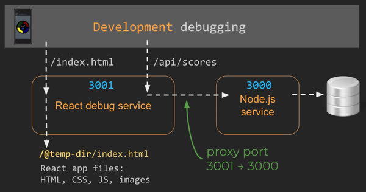

To configure the React HTTP debugger to listen on port 3001 when running in our local development environment, we create a file named `.env.local` in the root of the project, and insert the following text.

```
PORT=3001
```

Next, we modify the `package.json` file to include the field `"proxy": "http://localhost:3000"`. This tells the React HTTP debugger that if a request is made for a service endpoint, it forwards it to port 3000, where our Node.js service is listening.

```json
{
  "name": "simon-react",
  // ...
  "proxy": "http://localhost:3000"
}
```

We also need to change the front-end WebSocket initialization found in the `gameNotifier.js` constructor to explicitly use the service port (3000) instead of the React HTTP debugger port (3001). Without this the front-end will send the webSocket messages to the React debug HTTP server listening on port 3001 and unlike HTTP traffic, it will not forward them onto port 3000 automatically. To explicitly send webSocket requests to port 3000 we use the dynamically injected process environment variable that is set when webpack creates the application bundle.

```js
let port = window.location.port;
if (process.env.NODE_ENV !== 'production') {
  port = 3000;
}
```

This is a bit of annoying configuration, but without it you won't be able to debug your entire application in your development environment.

## Test as you go

That was a lot of changes and it is easy to make a mistake during the process. When you do this with your start up application you will find it easier if you start with the working app that `create-react-app` builds and then test that it runs (using `npm run start`) without error. Then make sure you understand everything it is doing before it gets more complex. After that, make a small change, and test that it still works. If it does, commit that change to Git. That way you can see where things get broken before it gets out of hand.

## Study this code

Get familiar with what the example code teaches.

- Clone the repository to your development environment.

  ```sh
  git clone https://github.com/webprogramming260/simon-react.git
  ```

- Review the code and get comfortable with everything it represents.
- View the code in your browser by hosting it from a VS Code debug session.
- Make modifications to the code as desired. Experiment and see what happens.

## Deploy to production

- Deploy to your production environment using a copy of the `deployReact.sh` script found in the [example class application](https://github.com/webprogramming260/simon-react/blob/main/deployReact.sh). Take some time to understand how it works.

  ```sh
  ./deployReact.sh -k <yourpemkey> -h <yourdomain> -s simon
  ```

  For example,

  ```sh
  ./deployReact.sh -k ~/keys/production.pem -h yourdomain.click -s simon
  ```

  âš  **NOTE** - The deployment script for this project is different than pervious deployment scripts since it includes the bundling of your React application.

- Update your `start up` repository README.md to record and reflect on what you learned.
- Make sure your project is visible from your production environment (e.g. https://simon.yourdomain.click).
- Submit the URL to your production environment for grading using the Canvas assignment page.

## Grading Rubric

- 50% - Simon React deployed to your production environment
- 50% - Notes in your start up repository README.md about what you have learned

## Celebrate

Wow! That is the last Simon deliverable. We hope that you were able to discover and master a lot of new technology by developing this game. You definitely deserve to reward yourself for all the work you have done here. I'm thinking maybe donuts. ðŸ©


# Start up deliverable - Final

It is time to create the final version of your start up application. This deliverable converts your application to use the web application framework, React.

You must use the same start up GitHub repository that you created in the earlier instruction. Update the README.md file with things that you learn as you work on your start up. As you make changes to your application, commit those changes and push them to GitHub. You will need at least four commits to get full credit, but in reality you should have many more than that.

Remember to use the the browser's debugger window to debug your CSS and JavaScript. You can also debug your service JavaScript running on Node.js using the built in VS Code debugger.

Once you have developed your application to where you want it, you need to release it to your production environment. **Replace** your previous start up deployment script with a copy of the `deployReact.sh` script from the [Simon React repository](https://github.com/webprogramming260/simon-react/blob/main/deployReact.sh) and use `startup` for the service parameter (`-s`).

```sh
./deployReact.sh -k <yourpemkey> -h <yourdomain> -s startup
```

For example,

```sh
./deployReact.sh -k ~/keys/production.pem -h yourdomain.click -s startup
```

Doing this will make this deliverable of your start up available from `https://startup.yourdomainname`.

### Update your website's home page

You should also update your website's home page with a link to your project so that you can access everything you have done for this class from the home page. This will make a great portfolio of all your work in this class. You can easily do this by modifying the index.html file that is part of the website-html repository, that you created in the earlier instruction, and deploying it using the script found in that repository. Make sure you run this script from a console in the website-html repository and not your start up repository.

```sh
./deployWebsite.sh  -k <yourpemkey> -h <yourdomain>
```

## ☑ Assignment

1. Convert your start up application to use React.
1. Make sure all authors of the code are attributed in the application and that there is a link to your GitHub repository.
1. Periodically commit and push your code to GitHub.
1. Periodically update your start up repository's README.md file to reflect what you have learned and want to remember.
1. Push your final version of your project to GitHub.
1. Deploy your start up application to your production environment (your server).
1. Make sure your application is available from your production environment.
1. Upload the URL to your start up application to the Canvas assignment.

## Grading Rubric

- Convert your application to use React
  - 30% Multiple react components
  - 20% React router
  - 20% React hooks
  - 10% Bundled using Babel
- 10% - Multiple Git commits with meaningful comments.
- 10% - Notes in your start up Git repository README.md file documenting what you have learned using React.

## Go celebrate

With the completion of your application you have become a Start Up Founder. Way to go! Time to grab some friends, recruit them to market your soon to be viral application, and celebrate by going out to lunch. I'm thinking tacos. 🌮


# Security overview

📖 **Deeper dive reading**:

- [Database of publicized software vulnerabilities](https://cve.mitre.org/)
- [SQL Injection](https://portswigger.net/web-security/sql-injection)

The internet allows us to socially connect, conduct financial transactions, and provide access to sensitive individual, corporate, and government data. It is also accessible from every corner of the planet. This positions the internet as a tool that can make the world a much better place, but it also makes a very attractive target for those who would seek to do harm. Preventing that potential for harm needs to be in the forefront of you mind whenever you create or use a web application.

You can see bad actors at work on your very own server by using `ssh` to open a console to your server and reviewing the authorization log. The authorization log captures all of the attempts to create a session on your server.

```sh
sudo less +G /var/log/auth.log
```

The last entry in the log will be from your connection to the server.

```sh
Feb 23 16:26:54 sshd[319071]: pam_unix(sshd:session): session opened for user ubuntu(uid=1000) by (uid=0)
Feb 23 16:26:54 systemd-logind[480]: New session 1350 of user ubuntu.
Feb 23 16:26:54 systemd: pam_unix(systemd-user:session): session opened for user ubuntu(uid=1000) by (uid=0)
```

However, you will see lots of other attempts with specific user names associated with common exploits. These all should be failing to connect, but if your server is not configured properly then an unauthorized access is possible. The sample of attempts below show the IP addresses of the attacker, as well as the user name that they used. Using the `whois` utility we can see that these attacks are originating from servers at DLive.kr in Korea, and DigitalOcean.com in the USA.

```sh
Feb 19 02:34:28 sshd[298185]: Invalid user developer from 27.1.253.142
Feb 19 02:37:12 sshd[298193]: Invalid user minecraft1 from 27.1.253.142
Feb 23 14:26:19 sshd[318868]: Invalid user siteadmin 174.138.72.191
Feb 23 14:22:18 sshd[318845]: Invalid user tester 174.138.72.191
```

As an experiment, one of our TAs created a test server with a user named `admin` with password `password`. Within 15 minutes, an attacker had logged in, bypassed all the restrictions that were in place, and started using the server to attack other servers on the internet.

Even if you don't think your application is valuable enough to require security, you need to consider that you might be creating a security problem for your users on other systems. For example, think about a simple game application where a user is required to provides a username and password in order to play the game. If the application's data is then compromised, then an attacker could use the password, used for the game application, to gain access to other websites where the user might have used the same password. For example, their social networking sites, work account, or financial institution.

## Security terminology

Web application security, sometimes called AppSec, is a subset of cybersecurity that specifically focuses on preventing security vulnerabilities within end-user applications. Web application security involves securing the front end code running on the user's device and also the back end code running on the web server.

Here is a list of common phrases used by the security community that you should be familiar with.

- **Hacking** - The process of making a system do something it's not supposed to do.
- **Exploit** - Code or input that takes advantage of a programming or configuration flaw.
- **Attack Vector** - The method that a hacker employs to penetrate and exploit a system.
- **Attack Surface** - The exposed parts of a system that an attacker can access. For example, open ports (22, 443, 80), service endpoints, or user accounts.
- **Attack Payload** - The actual code, or data, that a hacker delivers to a system in order to exploit it.
- **Input sanitization** - "Cleaning" any input of potentially malicious data.
- **Black box testing** - Testing an application without knowledge of the internals of the application.
- **White box testing** - Testing an application by **with** knowledge of the source code and internal infrastructure.
- **Penetration Testing** - Attempting to gain access to, or exploit, a system in ways that are not anticipated by the developers.
- **Mitigation** - The action taken to remove, or reduce, a threat.

## Motivation for attackers

The following lists some common motivations at drives a system attack.

- **Disruption** - By overloading a system, encrypting essential data, or deleting critical infrastructure, an attacker can destroy normal business operations. This may be an attempt at extortion, or simply be an attempt to punish a business that that attacker does not agree with.
- **Data exfiltration** - By privately extracting, or publicly exposing, a system's data, an attacker can embarrass the company, exploit insider information, sell the information to competitors, or leverage the information for additional attacks.
- **Resource consumption** - By taking control of a company's computing resources an attacker can use it for other purposes such as mining cryptocurrency, gathering customer information, or attacking other systems.

## Examples of security failures

Security should always be a primary objective of any application. Building a web application that looks good and performs well, is a lot less important than building an application that is secure.

Here are a few examples where companies failed to properly prevent attacks to their systems.

- [$100 million dollars stolen through insider trading using SQL injection vulnerability](https://www.theverge.com/2018/8/22/17716622/sec-business-wire-hack-stolen-press-release-fraud-ukraine)
- [Log4Shell remote code execution vulnerability, 93% of cloud vulnerable at time of discovery, dubbed "the most severe vulnerability ever"](https://en.wikipedia.org/wiki/Log4Shell)
- [Russian hackers install backdoor on 18,000 government and Fortune 500 computers](https://www.npr.org/2021/04/16/985439655/a-worst-nightmare-cyberattack-the-untold-story-of-the-solarwinds-hack)
- [Hackers Hold Computers of 23 Texas Towns For Ransom](https://www.usnews.com/news/national-news/articles/2019-08-20/hackers-hold-computers-of-23-texas-towns-for-ransom)

## Common hacking techniques

There are a few common exploitation techniques that you should be aware of. These include the following.

- **Injection**: When an application interacts with a database on the backend, a programmer will often take user input and concatenate it directly into a search query. This allows a hacker can use a specially crafted query to make the database reveal hidden information or even delete the database.

- **Cross-Site Scripting (XSS)**: A category of attacks where an attacker can make malicious code execute on a different user's browser. If successful, an attacker can turn a website that a user trusts, into one that can steal passwords and hijack a user's account.

- **Denial of Service**: This includes any attack where the main goal is to render any service inaccessible. This can be done by deleting a database using an SQL injection, by sending unexpected data to a service endpoint that causes the program to crash, or by simply making more requests than a server can handle.

- **Credential Stuffing**: People have a tendency to reuse passwords or variations of passwords on different websites. If a hacker has a user's credentials from a previous website attack, then there is a good chance that they can successfully use those credentials on a different website. A hacker can also try to brute force attack a system by trying every possible combination of password.

- **Social engineering** - Appealing to a human's desire to help, in order to gain unauthorized access or information.

## What can I do about it?

Taking the time to learn the techniques a hacker uses to attack a system is the first step in preventing them from exploiting your systems. From there, develop a security mindset, where you always assume any attack surface will be used against you. Make security a consistent part of your application design and feature discussions. Here is a list of common security practices you should include in your applications.

- **Sanitize input data** - Always assume that any data you receive from outside your system will be used to exploit your system. Consider if the input data can be turned into an executable expression, or can overload computing, bandwidth, or storage resources.
- **Logging** - It is not possible to think of every way that your system can be exploited, but you can create an immutable log of requests that will expose when a system is being exploited. You can then trigger alerts, and periodically review the logs for unexpected activity.
- **Traps** - Create what appears to be valuable information and then trigger alarms when the data is accessed.
- **Educate** - Teach yourself, your users, and everyone you work with, to be security minded. Anyone who has access to your system should understand how to prevent physical, social, and software attacks.
- **Reduce attack surfaces** - Do not open access anymore than is necessary to properly provide your application. This includes what network ports are open, what account privileges are allowed, where you can access the system from, and what endpoints are available.
- **Layered security** - Do not assume that one safeguard is enough. Create multiple layers of security that each take different approaches. For example, secure your physical environment, secure your network, secure your server, secure your public network traffic, secure your private network traffic, encrypt your storage, separate your production systems from your development systems, put your payment information in a separate environment from your application environment. Do not allow data from one layer to move to other layers. For example, do not allow an employee to take data out of the production system.
- **Least required access policy** - Do not give any one user all the credentials necessary to control the entire system. Only give a user what access they need to do the work they are required to do.
- **Safeguard credentials** - Do not store credentials in accessible locations such as a public GitHub repository or a sticky note taped to a monitor. Automatically rotate credentials in order to limit the impact of an exposure. Only award credentials that are necessary to do a specific task.
- **Public review** - Do not rely on obscurity to keep your system safe. Assume instead that an attacker knows everything about your system and then make it difficult for anyone to exploit the system. If you can attack your system, then a hacker will be able to also. By soliciting public review and the work of external penetration testers, you will be able to discover and remove potential exploits.


# OWASP


📖 **Deeper dive reading**: [OWASP 2021](https://owasp.org/www-project-top-ten/)

The Open Web Application Security Project (OWASP) is a non-profit research entity that manages the _Top Ten_ list of the most important web application security risks. Understanding, and periodically reviewing, this list will help to keep your web applications secure.

The following is a discussion of each of the entries in the top ten list, along with examples, and suggested mitigations.

## A01 Broken Access Control

📖 **Deeper dive reading**: [snyk Learn broken access control](https://learn.snyk.io/lessons/broken-access-control/javascript/)

Broken access control occurs when the application doesn't properly enforce permissions on users. This could mean that a non-admin user can do things that only an admin should be able to do, or admin accounts are improperly secured. While browser application code can restrict access by disabling UI for navigating to sensitive functionality, the ultimate responsibility for enforcing access control rests upon the application service.

As an example of broken access control, consider an application where the UI only provides a navigation to the administrator application settings if the user is an administrator. However, the attacker can simply change the URL to point to the application settings URL and gain access. Additionally, unless the service endpoints reject requests to obtain, and update, the application settings, any restrictions that the UI provides are meaningless.

Mitigations include:

- Strict access enforcement at the service level
- Clearly defined roles and elevation paths

## A02 Cryptographic Failures

Cryptographic failures occur when sensitive data is accessible either without encryption, with weak encryption protocols, or when cryptographic protections are ignored.

Sending any unencrypted data over a public network connection allows an attacker to capture the data. Even private, internal, network connections, or data that is store without encryption, is susceptibly to exploitation once an attacker gains access to the internal system.

Examples of ineffective cryptographic methods include hashing algorithms like MD5 and SHA-1 that are trivial to crack with modern hardware and tools.

Another cryptographic failure happens when applications do not validate the provided web certificate when establishing a network connection. This is a case of falsely assuming that if the protocol is secure then the entity represented by the protocol is acceptable.

Mitigations include:

- Use strong encryption for all data. This includes external, internal, in transit, and at rest data.
- Updating encryption algorithms as older algorithms become compromised.
- Properly using cryptographic safeguards.

## A03 Injection

📖 **Deeper dive reading**: [Snyk Learn SQL injection](https://learn.snyk.io/lessons/sql-injection/javascript/)

Injection exploits occur when an attacker is allowed to supply data that is then injected into a context where it violates the expected use of the user input. For example, consider an input field that is only expected to contain a user's password. Instead the attacker supplies a SQL database command in the password input.

**Supplied password**

```js
`p@ssword!'; DROP TABLE db; --`;
```

The application then uses a template SQL query to validate the user's password.

**Template query**

```js
`SELECT user FROM db WHERE password='${password}' LIMIT 1`;
```

When the supplied input is injected into the template an unintended query results. Notice that this query will delete the entire database table.

**Resulting query**

```sql
SELECT user FROM db WHERE password='p@ssword!'; DROP TABLE db; -- ` LIMIT 1
```

Mitigations include:

- Sanitizing input
- Use database prepared statements
- Restricting execution rights
- Limit output

## A04 Insecure Design

📖 **Deeper dive reading**: [Snyk Learn insecure design](https://learn.snyk.io/lessons/insecure-design/javascript/)

Insecure design broadly refers to architectural flaws that are unique for individual systems, rather than implementation errors. This happens when the application team doesn't focus on security when designing a system, or doesn't continuously reevaluate the application's security.

Insecure design exploits are based upon unexpected uses of the business logic that controls the functionality of the application. For example, if the application allows for trial accounts to be easily created, then an attacker could create a denial of service attack by creating millions of accounts and utilizing the maximum allowable usage.

Mitigations include:

- Integration testing
- Strict access control
- Security education
- Security design pattern usages
- Scenario reviews

## A05 Security Misconfiguration

Security misconfiguration attacks exploit the configuration of an application. Some examples include using default passwords, not updating software, exposing configuration settings, or enabling unsecured remote configuration.

For example, some third party utilities, such as a logging system, will expose a public administration interface that has a default user name and password. Unless that configuration is changed, an attacker will be able to access all of the critical logging information for your application.

Mitigations include:

- Configuration reviews
- Setting defaults to disable all access
- Automated configuration audits
- Requiring multiple layers of access for remote configuration

## A06 Vulnerable and Outdated Components

📖 **Deeper dive reading**: [Snyk Learn vulnerable and outdate components](https://learn.snyk.io/lessons/vulnerable-and-outdated-components/javascript/)

The longer an application has been deployed, the more likely it is that the attack surface, and corresponding exploits, of the application will increase. This is primarily due to the cost of maintaining an application and keeping it up to date in order to mitigate newly discovered exploits.

Outdated components often accumulate as third party packages are used by the application. Over time the packages are updated in order to address security concerns, or somethings the packages stop being supported. When this happens your application becomes vulnerable. Consider what happens when a request to install NPM packages displays the following warning:

```sh
➜  npm install

up to date, audited 1421 packages in 3s

7 high severity vulnerabilities

To address all issues (including breaking changes), run:
  npm audit fix --force

Run `npm audit` for details.
```

The application developer is warned that the components are vulnerable, but when faced choice of taking the time to update packages, and potentially break the application, or meeting deliverable deadlines, the developer is tempted to ignore the warning and continue without addressing the possible problem.

Mitigations include:

- Keeping a manifest of your software stack including versions
- Reviewing security bulletins
- Regularly updating software
- Required components to be up to date
- Replacing unsupported software

## A07 Identification and Authentication Failures

Identification and authentication failures include any situation where a user's identity can be impersonated or assumed by an attacker. For example, if an attacker can repeatedly attempt to guess a user's password, then eventually they will be successful. Additionally, if passwords are exposed outside of the application, or are stored inside the application, with weak cryptographic protection, then they are susceptible to attack.

Another example of an identification failure would be a weak password recovery process that doesn't properly verify the user. Common practices such as asking for well known security questions (e.g. mother's maiden name) from a user fall into this category.

Mitigations include:

- Rate limiting requests
- Properly managing credentials
- Multifactor authentication
- Authentication recovery

## A08 Software and Data Integrity Failure

Software and data integrity failures represent attacks that allow external software, processes, or data to compromise your application. Modern web applications extensively use open source and commercially produced packages to provide key functionality. Using these packages without conducting a security audit, gives them an unknown amount of control over your application. Likewise, using a third party processing workflow, or blindly accessing external data, opens you up to attacks.

Consider the use of a third party continuous delivery (CD) pipeline for deploying your application to a cloud provider. If the CD provider is penetrated by an attacker then they also gain access to your production cloud environment.

Another example is the use of an NPM package that is controlled by an attacker. Once the package has gained general acceptance, the attacker can subtly change the package to capture and deliver sensitive information.

Mitigations include:

- Only using trusted package repositories
- Using your own private vetted repository
- Audit all updates to third party packages and data sources

## A09 Security Logging and Monitoring Failures

📖 **Deeper dive reading**: [Snyk Learn logging vulnerabilities](https://learn.snyk.io/lessons/logging-vulnerabilities/javascript/)

Proper system monitoring, logging, and alerting is critical to increasing security. One of the first things an attacker will do after penetrating your application is delete or alter any logs that might reveal the attacker's presence. A secure system will store logs that are accessible, immutable, and contain adequate information to detect an intrusion, and conduct post-mortem analysis.

An attacker might also try to create a smoke screen in the monitoring system in order to hide a true attack. This might consist of a barrage of periodic ineffective attacks that hide the insertion of a slightly different effective one.

Mitigations include:

- Real time log processing
- Automated alerts for metric threshold violations
- Periodic log reviews
- Visual dashboards for key indicators

## A10 Server Side Request Forgery (SSRF)

📖 **Deeper dive reading**: [Snyk Learn SSRF](https://learn.snyk.io/lessons/ssrf-server-side-request-forgery/javascript/)

This category of attack causes the application service to make unintended internal requests, that utilized the service's elevated privileges, in order to expose internal data or services.

For example, if your service exposed an endpoint that let a user retrieve an external profile image based upon a supplied URL, an attacker could change the URL to point to a location that is normally only available to the service internally.

The following command would theoretically return the internal AWS service metadata that includes the administrative access token.

```sh
curl https://yourdomain.click/user/image?imgUrl=http://169.254.169.254/latest/meta-data/iam/security-credentials/Admin-Role
```

Mitigations include:

- Sanitizing returned data
- Not returning data
- Whitelisting accessible domains
- Rejecting HTTP redirects


# Security practice

You will not really internalize how security exploits work until you get some practice with them. One way to do this is to use a practice security web applications. There are lots of practice applications but we will discuss two of them, Gruyere and Juice Shop.

## Gruyere

[Gruyere](https://google-gruyere.appspot.com) provides tutorials and practice with things like Cross-site scripting (XSS), Denial of Service (DoS), SQL injection, and elevation of privilege attacks.

Gruyere runs on Google AppEngine and so it is easy to start, play with, and reset when you want to start over.

You can learn about how to use Gruyere by reading the set up [page](https://google-gruyere.appspot.com/part1). Make sure you notice the **Table of Contents** located on the right side of the page in order to learn about the different attacks and how to exploit them.

You start the practice environment by following this [link](https://google-gruyere.appspot.com/start). This will display a page that looks like the following.

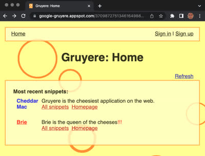

For the purposes of this instruction we are only going to talk about Cross-Site Scripting (XSS) attacks. Feel free to explore everything provided by Gruyere as your time and interest allows.

### Cross-Site Scripting (XSS)

Open the [Gruyere Instruction](https://google-gruyere.appspot.com/part2) on XSS. Take some time to read the description of XSS attacks and then open up the practice instance of Gruyere that you created above.

Using what we have learned from the tasks, hints, and examples described in the Gruyere instruction, we will create our own XSS attack.

1. Create an account in the Gruyere application using some bogus user name and password.
1. Navigate back to the home page.
1. Select the `New Snippets` option in order to create a snippet that will show on the home screen for all users of the application.

   The Gruyere developers assumed the snippet functionality would be used to share information about cheese, but you will use it to execute a XSS attack on anyone who views your snippet.

1. Paste the following into the snippet input box and press submit.
   ```html
   
   ```
   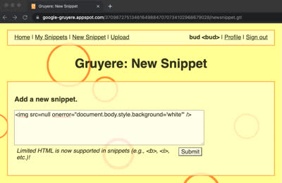

Now, whenever any user of Gruyere goes to their home page they will see your snippet, and it will execute the JavaScript XSS attack and turn their body background color white.

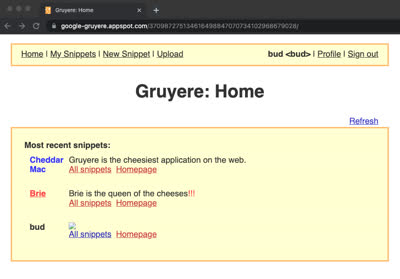

If you logout of Gruyere and create a new user account, you will see that your attack works on all users.

Changing the background color isn't very much of an attack, but it does visually demonstrate that you are have taken control of the application. You could just have easily grabbed the user's cookie and sent it to a service endpoint where you could start collecting information on Gruyere customers.

```html

```

If you create another snippet with the above example, open up the network tab in the browser's dev tools, and navigate to the Gruyere home page, you will see the browser attempting to send the user's cookie to `hkz.click`.

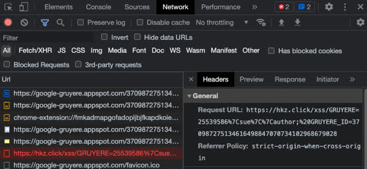

## Juice Shop


OWASP provides a security training application called [Juice Shop](https://github.com/juice-shop/juice-shop#-owasp-juice-shop). Unlike Gruyere, You need to download the code for Juice Shop and run it from your own computer, but the advantage is that you have complete control over Juice Shop and it is a really good practice application.

If you are at all interested in improving your security skills, you should take the time to install and explore Juice Shop. Otherwise what you have done with Gruyere should be enough to give you a feel for what security practice applications have to offer.

### Installing Juice Shop

1. Clone the Juice Shop repository to your development environment and install the required NPM packages.

   ```sh
   git clone https://github.com/juice-shop/juice-shop.git --depth 1

   cd juice-shop

   npm install
   ```

1. Run the application. This should start Juice Shop on port 3000.
   ```sh
   npm start
   ```
1. You can now open your browser to `localhost:3000`. This will display the Juice Shop application.

   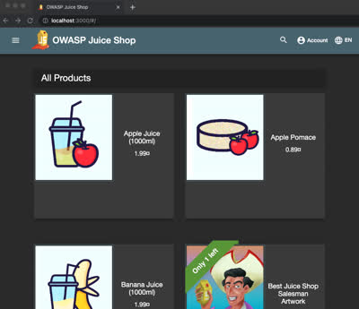

The idea with Juice Shop is that you are suppose to learn by digging in and experimenting. For a person that is new to security hacking this can be a bit daunting, and so here is a hint to get you started.

You can solve the first hacking challenge by discovering the hidden score board view that shows you all of the possible challenges to solve, and exposes the available tutorials. You can discover where the score board is by examining the contents of the `main.js` file in Dev Tools and seeing that it references a path named `score-board`. So if you change the url to be `localhost:3000/#/score-board` you will see the following view.

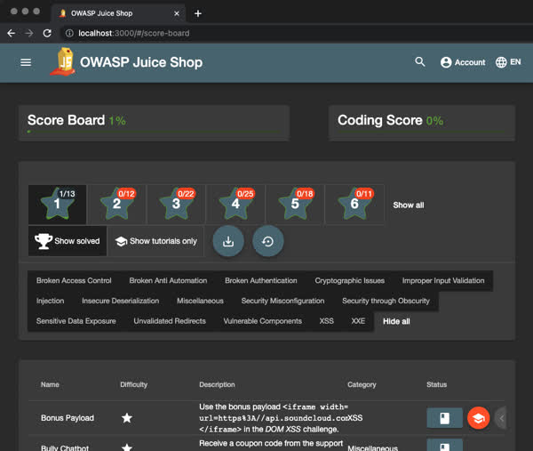

You can then find a challenge that looks interesting and try to solve it. Challenges that have a tutorial icon will step you through the challenge and explain how it works. You can then use that knowledge to solve challenges that don't have a tutorial.

To begin, it is suggested that you do the `DOM XSS` tutorial. This will show you how to do a XSS attack using the application search input.


# TypeScript

📖 **Deeper dive reading**: [Typescript in 5 minutes](https://www.typescriptlang.org/docs/handbook/typescript-in-5-minutes.html)

TypeScript adds static type checking to JavaScript. This provides type checking while you are writing the code to prevent mistakes like using a string when a number is expected. Consider the following simplistic JavaScript code example.

```js
function increment(value) {
  return value + 1;
}

let count = 'one';
console.log(increment(count));
```

When this code executes the console will log `one1` because the count variable was accidentally initialized with a string instead of a number.

With TypeScript you explicitly define the types, and as the JavaScript is transpiled (with something like Babel) an error will be generate long before the code is seen by a user. To provide type safety for our increment function, it would look like this:

```ts
function increment(value: number) {
  return value + 1;
}

let count: number = 'one';
console.log(increment(count));
```

With TypeScript enabled, VS Code will analyze the code and give you an error about the invalid type conversion.

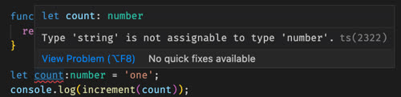

In addition to defining types for function parameters, you can define the types of object properties. For example, when defining the state for a React class style component, you can specify the types of all the state and property values.

```ts
export class About extends React.Component {
  state: {
    imageUrl: string;
    quote: string;
    price: number;
  };

  constructor(props: { price: number }) {
    super(props);

    this.state = {
      imageUrl: '',
      quote: 'loading...',
      price: props.price,
    };
  }
}
```

You can likewise specify the type of a React function style component's properties with an inline object definition.

```ts
function Clicker(props: { initialCount: number }) {
  const [count, updateCount] = React.useState(props.initialCount);

  return <div onClick={() => updateCount(1 + count)}>Click count: {count}</div>;
}
```

## Interfaces

Because it is so common to define object property types, TypeScript introduced the use of the `interface` keyword to define a collection of parameters and types that an object must contain in order to satisfy the interface type. For example, a Book interface might look like the following.

```ts
interface Book {
  title: string;
  id: number;
}
```

You can then create an object and pass it to a function that requires the interface.

```ts
function catalog(book: Book) {
  console.log(`Cataloging ${book.title} with ID ${book.id}`);
}

const myBook = { title: 'Essentials', id: 2938 };
catalog(myBook);
```

## Beyond type checking

TypeScript also provides other benefits, such as warning you of potential uses of an uninitialized variable. Here is an example of when a function may return null, but the code fails to check for this case.

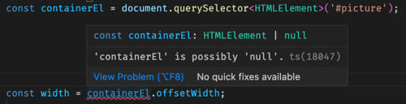

You can correct this problem with a simple `if` block.

```ts
const containerEl = document.querySelector<HTMLElement>('#picture');
if (containerEl) {
  const width = containerEl.offsetWidth;
}
```

Notice that in the above example, the return type is coerced for the `querySelector` call. This is required because the assumed return type for that function is the base class `Element`, but we know that our query will return the subclass `HTMLElement` and so we need to cast that to the subclass with the `querySelector<HTMLElement>()` syntax.

### Unions

TypeScript introduces the ability to define the possible values for a new type. This is useful for doing things like defining an enumerable.

With plain JavaScript you might create an enumerable with a class.

```js
export class AuthState {
  static Unknown = new AuthState('unknown');
  static Authenticated = new AuthState('authenticated');
  static Unauthenticated = new AuthState('unauthenticated');

  constructor(name) {
    this.name = name;
  }
}
```

With TypeScript you can define this by declaring a new type and defining what its possible values are.

```ts
type AuthState = 'unknown' | 'authenticated' | 'unauthenticated';

let auth: AuthState = 'authenticated';
```

You can also use unions to specify all of the possible types that a variable can represent.

```ts
function square(n: number | string) {
  if (typeof n === 'string') {
    console.log(`{$n}^2`);
  } else {
    console.log(n * n);
  }
}
```

## Using TypeScript

If you would like to experiment with TypeScript you can use [CodePen](https://codepen.io), or the official [TypeScript playground](https://www.typescriptlang.org/play). The TypeScript playground has the advantage of showing you inline errors and what the resulting JavaScript will be.

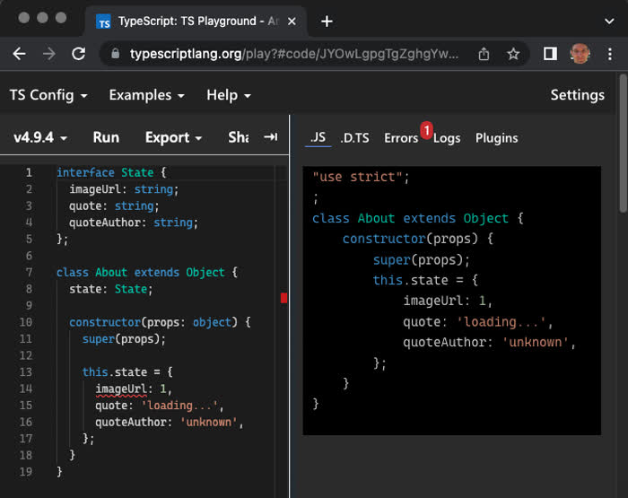

To use TypeScript in your web application you can create your project using the `create-react-app` CLI and specifying the `--template typescript` switch. This will configure the template application to use TypeScript.

```sh
npx create-react-app my-app --template typescript
```

If you want to convert an existing application, then install the NPM `typescript` package to your development dependencies.

```sh
npm install --save-dev typescript
```

This will only include typescript package when you are developing and will not distribute it with a production bundle.

Once you have TypeScript installed for your project, you then configure how you want TypeScript to interact with your code by creating a `tsconfig.json` file.

If your project structure is configured to have your source code in a directory named `src`, and you want to output to a directory named `build` then you would use the following TS configuration file.

```js
{
  "compilerOptions": {
    "rootDir": "src",
    "outDir": "build",
    "target": "es5",
    "lib": [
      "dom",
      "dom.iterable",
      "esnext"
    ],
    "allowJs": true,
    "skipLibCheck": true,
    "esModuleInterop": true,
    "allowSyntheticDefaultImports": true,
    "strict": true,
    "forceConsistentCasingInFileNames": true,
    "noFallthroughCasesInSwitch": true,
    "module": "esnext",
    "moduleResolution": "node",
    "resolveJsonModule": true,
    "isolatedModules": true,
    "noEmit": true,
    "jsx": "react-jsx"
  },
  "include": [
    "./src/**/*"
  ]
}
```

To learn what all of the tsconfig.json options do, refer to [What is a tsconfig.json](https://www.typescriptlang.org/docs/handbook/tsconfig-json.html).


# Performance monitoring

The performance of your application plays a huge role in determining user satisfaction. The following statistics show the impact that just one second of delay can make.

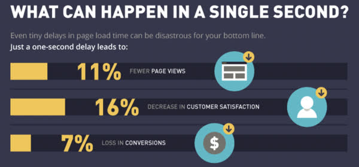

> **Source**: WPEngine

In order to prevent losing users, you want your application to load in about one second. That means you need consistently measure and improve the responsiveness of your application. The main things you want to monitor include:

1. Browser application latency
1. Network latency
1. Service endpoint latency

For the context of this discussion, latency is defined as the delay that your user experiences before a request is satisfied.

Let's look at each of these performance areas, and then we can suggest some tools for measuring and improving the results.

## Browser application latency

Browser application latency is impacted by the speed of the user's device, the amount of data that needs to be processed, and the time complexity of the processing algorithm.

When a user requests your application in a browser, the browser will request your `index.html` page first. This is followed by requests for any files that `index.html` links, such as JavaScript, CSS, video, and image files. Once your JavaScript is loaded, it will start making requests to services. This includes any endpoints that your provide as well as ones provided by third parties. Each of those requests takes time for the browser to load and render. A page with lots of large images and lots of service calls, will take longer than a page that only loads simple text from a single HTML file.

Likewise, if your JavaScript does significant processing while a page is loading, then your user will notice the resulting latency. You want to make application processing as asynchronous as possible so that it is done in the background without impacting the user experience.

You can reduces the impact of file size, and HTTP requests in general, by doing one or more of the following:

1. Use compression when transferring files over HTTP.
1. Reduce the quality of images and video to the lowest acceptable level.
1. Minify JavaScript and CSS. This removes all whitespace and creates smaller variable names.
1. Use HTTP/2 or HTTP/3 so that your HTTP headers are compressed and the communication protocol is more efficient.

You can also reduce the number of requests you make by combining the responses from multiple endpoint requests into a single request. This eliminates duplicated fields, but also decreases the overhead associated with each request.

## Network latency

You pay a latency price for every network request that you make. For this reason, you want to avoid making unnecessary or large requests.

Network latency is impacted by the amount of data that you send, the amount of data a user can receive per second (this is called bandwidth), and the distance the data has to travel.

If the user has a low bandwidth connection that can only receive data at rates lower than 1 megabit per second, then you need to be very careful to reduce the number of bytes that you send to that user. Global latency is also a problem for users. If your application is hosted in a data center located in San Francisco, and used by someone living in Nairobi, then there will be a additional latency of 100 to 400 milliseconds for each request.

You can mitigate the impact of global latency by hosting your application files in data centers that are close to the users you are trying to serve. Applications that are seeking to reach a global audience will often host their application from dozens of places around the world.

## Service endpoint latency

Service endpoint latency is impacted by the number of request that are made and the amount of time that it takes to process each request.

When a web application makes a request to a service endpoint there is usually some functionality in the application that is blocked until the endpoint returns. For example, if a user requests the scores for a game, the application will delay rendering until those scores are returned.

You want to reduce the latency of your endpoints as much as possible. Ideally you want to keep the endpoint latency to less than 10 milliseconds (ms). This may seem like a very short time, but commonly, an application will make dozens of endpoint requests to render a component. If each of those endpoints take 10 ms, then you are looking at 100 to 200 ms. When you add network latency to the time it takes for the application to process the response, and then add the time it takes for the browser to render, you can easily exceed the desired 1 second load time.

## Performance tools

📖 **Deeper dive reading**: [Chrome performance tools](https://developer.chrome.com/docs/devtools/performance/)

### Chrome network tab

You can see the network requests made by your application and the time necessary for each request, by using the browser's debugging tools. This will show you what files and endpoints are requested and how long they are taking. If you sort by `time` or `size`, it will be clearer what areas need your attention. Make sure you clear your cache before running tests so that you can see what the real latency is and not just the time it takes to load from the browser's cache.


### Simulating real users

The network tools in the Chrome debugger also allows you to simulate low bandwidth connections by throttling your network. For example, you can simulate a 3G network connection that you would find on a low end mobile phone.

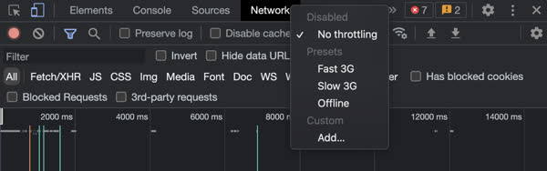

Throttling while testing is really useful since web developers often have high end computers and significant network bandwidth. That means you are not having the same experience as your users, and you will be surprised when they don't use your application because it is so slow.

### Chrome Lighthouse

You can also use the Chrome debugging Lighthouse tool to run an analysis of your application. This will give you an average performance rating based upon the initial load time, longest content paint, and time before the user can interact with the page.


### Chrome performance tab

When you are ready to dig into your application's front end performance make sure you experiment with the Chrome debugger's performance tab. This breaks down the details of your application based upon discrete intervals of time so that you can isolate where things are running slow.

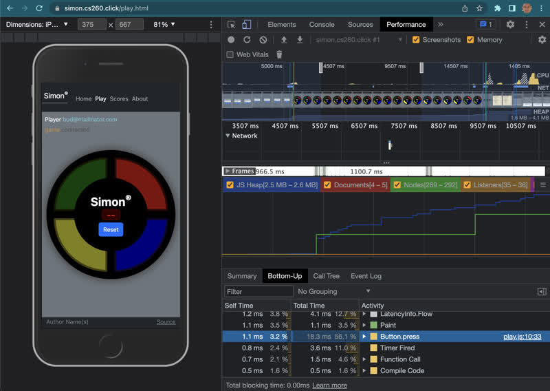

You start profiling the performance by pressing the record button and then interacting with your application. Chrome will record memory usage, screenshots, and timing information. You can then press the stop recording button and review the collected data. For example, the performance data represented in the image above, shows that 56% of the execution time was used in the `button.press` function. If you drill in on the source code for the function you will see exactly which lines of the function were consuming the processing time.

### Global speed tests

You also want to test your application from different locations around the world. There are many online providers that will run these test for you. Here are the results for running a test using [Pingdom.com](https://tools.pingdom.com).

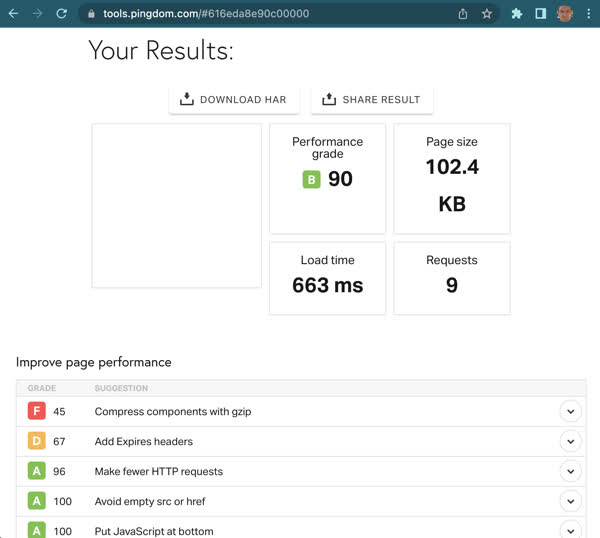

You can see that it is correctly suggesting that we enable gz compression on our transmitted data in order to increase performance, and to add headers that will enable caching on the browser.

This tool provided by [DotComTools](https://www.dotcom-tools.com) allows you to run tests from multiple locations at once.


Here you can see we perform acceptably from the United States and Europe, but are struggling in Asia. That makes sense considering that our server is located in North Virginia. In order to correct this, we need to use a Content Delivery Network (CDN) with an additional location closer to our target users in China.


# Search engine optimization

📖 **Deeper dive reading**: [Google Search Central](https://developers.google.com/search)

Once Google became the de facto search engine for the internet, a new industry was created to help websites get the top search result spots. Modifying your application for search results is called search engine optimization (SEO). While SEO has nothing to do with the functionality of your application, it has everything to do with its success. You can save millions of dollars in marketing if your application appears in the top search ranking for common user searches.

There are several factors that are major contributors to your search rank. These include:

1. Content
1. Authoritative links
1. Structure and organization
1. Metadata
1. Performance and usability

Let's take a closer look at each of these.

## Content

Search engines pay a lot of attention to the value an application provides. One of the ways you can provide significant value is to host interesting, current, easily accessible content. For example, if your application is about the game Simon, then you should include a history of the game, strategies for playing the game, current news about competitions, and biographies of the world's best players. The key is that there is lots of interesting content and that it is kept current.

You want to make sure that you provide both textual and video content. Also make sure that the content is available without authentication or payment.

## Authoritative links

The success of the Google Page Rank algorithm is founded on determining how authoritative an application is. The more websites that point to your application the higher its search ranking will be. If you can get an influencer to link to your content, or get links from other authoritative applications you will see a significant bump in your ranking.

You also want to be an authority to yourself. This includes links from other applications that you own, and internal application links. Making sure that you have multiple paths to key content from within your application will help the Google crawler find the content and value its authority.

## Structure and organization

You need to properly use HTML elements to correctly define and organize your application. The Google search crawler is an automated bot. That means it will not spend a lot of effort trying to guess what you meant with the `div` or `span` element, when they actually represent a `title` or `a` element. Leveraging the semantic meaning of HTML will help the crawler navigate your content.

You want to make sure that your content is not hidden behind JavaScript interactions. When the crawler hits a URL, the important content should be rendered. The crawler should not have to interact with the application before the content is injected.

Key HTML elements include the `title` and `heading` elements. The title and heading elements should contain text that clearly defines the value of your content, and include keywords that you want in the search index.

## Metadata

HTML defines several elements and attributes that search crawlers specifically target. This includes the `description`, `robots`, social media open graph (`og`), and image alt attributes.

If you were creating a description for Simon, you would include something like the following description meta element on the home page of your application.

```html
<meta name="description" content="Game play, news, rankings, tips, and instruction for Simon." />
```

The robots meta element instructs the crawler how to specifically index a given page. The image alt attribute tells the crawler the keywords for a given image.

The open graph (`og`) meta tags are used by social media websites to give a preview of your application. Crawlers consider information like this as a reflection that the application is modern and more interesting to users.

```html
<meta property="og:title" content="Play Simon online" />
<meta property="og:description" content="News, rankings, instruction, and competitive online play for Simon." />
<meta property="og:image" content="https://simon.cs260.click/simon.png" />
```

### Sitemap

A sitemap is a textual file that you distribute with your application. It describes the major content pieces of your application and aids in search crawler navigation. If you have a small application then a sitemap is probably not necessary. If you have hundreds, or thousands, of content pages then you definitely want to build a sitemap and submit it to the Google Search Console.

Here is an example of a simple sitemap file with a single entry.

```xml
<?xml version="1.0" encoding="UTF-8"?>
<urlset xmlns="http://www.sitemaps.org/schemas/sitemap/0.9">
  <url>
    <loc>https://simon.cs260.click/news/2022-world-champion.html</loc>
    <lastmod>2023-01-17</lastmod>
  </url>
</urlset>
```

### Robots.txt

The `robots.txt` file tells the crawler what parts of your application is off limits. Here is an example robots.txt file:

```yaml
# cs260.com/robots.txt
# Tell Google not to crawl the game play path,
# because it won't be useful in Google Search results.
User-agent: googlebot
Disallow: /play/
```

To include a robots.txt file for your application you simply create the file with the specific name `robots.txt` and serve it from the root of your domain.

## Performance and usability

In addition to authority, Google wants to rank results by quality. That means it will check how performant your application is and how good the user experience (UX) is. This includes measurements such as the time it takes for the first byte to load, how long it takes to render the page, and how well your application works on mobile devices.

## Tools

### Google search

You want to frequently do a Google search for your application's domain to see how much of it is being indexed. You can do this by querying Google with your domain name prefixed with `site:`. For example, here is the current result for `site:simon.cs260.click`.

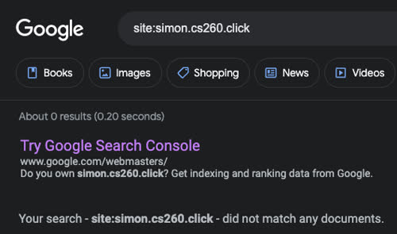

This shows that Google is not indexing any pages from the domain. It looks like we have some SEO work to do. Probably some authoritative links will help.

### PageSpeed Insights

PageSpeed Insights is similar to the Chrome browser debugging tool Lighthouse, but it allows you to run it from a webpage. Using a tool like Insights is helpful because performance and usability are key factors in determining your search ranking. The better the rating you get from PageSpeed Insights, the better your search ranking will be.

Here is the result of examining `simon.cs260.click`. This shows that it is performing well, but that it is not optimal for SEO.

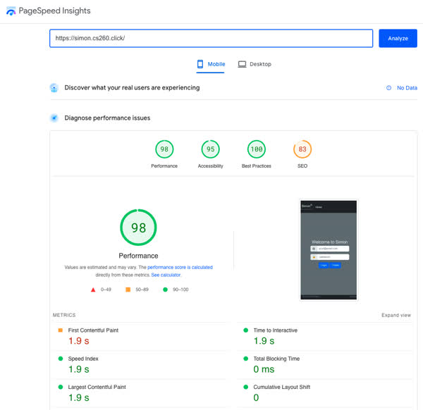

If we dig into the SEO section of the report we see that there is no Robots.txt file and the description meta element is missing.

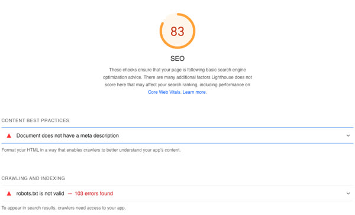

### Google Search Console

The [Google Search Console](https://search.google.com/search-console/about) contains many tools to help you understand how your application is being indexed and why. This includes information about your website's performance, what pages are indexed, your mobile usability, and information about the site's overall user experience.

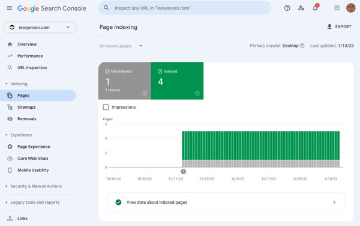

To get started with the Google Search Console, you need to add a DNS `TXT` record to your application's domain DNS information. This is similar to when you added an `A` or `CNAME` record when you first set up your DNS information with the AWS Route 53 service.

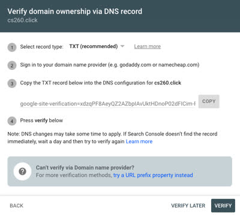

Once your ownership of the domain name is verified, the Google Search Console will start tracking statistics for your domain. Check back often to gain insight on how you can improve your search ranking.


# Device APIs

Every year browsers mature and increase the features that they provide. Sometimes these features are exposed as APIs (Application programming interfaces) that allow a web application to interact with the user through browser, operating system, or device features. For example, your application could take advantage of location services that tell you where your user is physically located, or read a user's contacts in order to allow them to share information with their peers. As these APIs become standard across all browsers they enable web applications to behave more and more like historical native device applications.

## Respecting privacy

Most device APIs require the user to consent to your application's use of the API, but as long as your application is providing value and not just trying to invade the user's privacy, that usually isn't a problem. For example, a good use of location services, would be a restaurant finder application that suggests nearby venues. A bad example of using locations services, would be a Sudoku game that sold your home address to advertisers. In some governmental jurisdictions such uses would be considered illegal.

## Location API

📖 **Deeper dive reading**: [MDN Location API](https://developer.mozilla.org/en-US/docs/Web/API/Geolocation_API/Using_the_Geolocation_API)

The location API provides the GPS location of the device. Like the notification API, the user will be prompted for permission to access their location. After permission is granted then the `navigator.geolocation` API will return the user's location.

The following React component will display the user's location once it loads.

```jsx
import React from 'react';

export function Location() {
  const [position, updatePosition] = React.useState({ lat: 0, long: 0 });

  React.useEffect(() => {
    console.log('updating pos');
    navigator.geolocation.getCurrentPosition((p) => {
      updatePosition({ lat: p.coords.latitude, long: p.coords.longitude });
    });
  }, []);

  return (
    <div>
      {position.lat !== 0 && (
        <div>
          <h1>Your location</h1>
          <div>Latitude: {position.lat}</div>
          <div>Longitude: {position.long}</div>
          <div>
            <iframe
              title='map'
              width='600'
              height='300'
              src={`https://www.openstreetmap.org/export/embed.html?bbox=${position.long + 0.001},${
                position.lat + 0.001
              },${position.long - 0.001},${position.lat - 0.001}&amp;layer=mapnik`}
            ></iframe>
          </div>
        </div>
      )}
      {position.lat === 0 && <div>Location unknown</div>}
    </div>
  );
}
```

You can try this out by creating a simple React app and adding a new component file named `location.js` that contains the above code. Then include Location component in the `App.js` file.

```jsx
import { Location } from './location';

function App() {
  return (
    <div className='App'>
      <header className='App-header'>
        <Location></Location>
      </header>
    </div>
  );
}
```

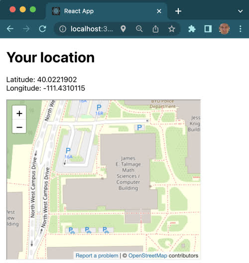

## Notification API

📖 **Deeper dive reading**: [MDN Notification API](https://developer.mozilla.org/en-US/docs/Web/API/Notifications_API)

As an example of integrating your web application with the device, let's look at the Notification API.

The following React code has a function to register the user's permission to display notifications, and a function to send notifications. The state representing a user's permission is initialized with the Notification API `permission` property. The state of the property can be `default` (not set), `granted`, or `denied`. If a user grants permission then the `Notification` class may be used to actually display a notification.

The rest of the code controls the UI for the display state, buttons, and message input.

```jsx
function Notifier() {
  const [acceptanceState, updateAcceptanceState] = React.useState(Notification.permission);
  const [msg, updateMsg] = React.useState('');

  function register() {
    Notification.requestPermission().then((response) => {
      updateAcceptanceState(response);
    });
  }

  function notify() {
    new Notification('You are notified', {
      body: msg,
    });
    updateMsg('');
  }

  return (
    <div className='component'>
      <p>User's acceptance of notifications: {acceptanceState}</p>
      {acceptanceState === 'default' && <button onClick={() => register()}>Register</button>}
      {acceptanceState === 'granted' && (
        <div>
          <input type='text' value={msg} onChange={(e) => updateMsg(e.target.value)} placeholder='msg here'></input>
          <button disabled={msg === ''} onClick={() => notify()}>
            Notify
          </button>
        </div>
      )}
    </div>
  );
}
```

Here is what the code looks like in action.

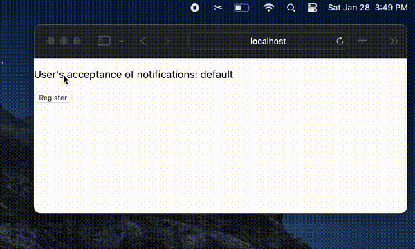

## Other APIs

Other interesting device APIs include the [Contact Picker](https://developer.mozilla.org/en-US/docs/Web/API/Contact_Picker_API), [Bluetooth](https://developer.mozilla.org/en-US/docs/Web/API/Bluetooth/requestDevice), and [File System](https://developer.mozilla.org/en-US/docs/Web/API/File_System_Access_API).

Before you get too excited about using any device API make sure you check the current browser support for the API so that you can make sure you properly serve your target market. If a specific device is not supported on some device or browser, you can always hide that functionality for those users while still providing it for others.


# Progressive web application

âš  The information provided here is meant as extended course content. It will not be covered in class or appear on any test.

📖 **Deeper dive reading**:

- [MDN PWA](https://developer.mozilla.org/en-US/docs/Web/Progressive_web_apps)
- [web.dev PWA](https://web.dev/learn/pwa/)

The idea of creating a single application that works both on desktop and mobile devices is not a new concept. You can trace its origins to Microsoft's introduction of the XMLHttpRequest (XHR) in 1999. XHR allowed web pages to make HTTP requests directly from JavaScript. This evolved into the idea of a web application that could run on any device that supported a web browser. Steve Jobs actually championed the idea of a universal web application when he introduced the iPhone in 2007.

> "you can write amazing Web 2.0 and Ajax apps that look exactly and behave exactly like apps on the iPhone. And these apps can integrate perfectly with iPhone services. And guess what?
> There’s no SDK that you need! You’ve got everything you need if you know how to write apps using the most modern web standards to write amazing apps for the iPhone today.
> So developers, we think we’ve got a very sweet story for you. You can begin building your iPhone apps today"
>
> — Steve Jobs, (**Source**: [2007 MacWorld keynote](https://youtu.be/VQKMoT-6XSg))

Unfortunately for the world, Apple quickly realized the incredibly lucrative market that existed if they created a closed application space that they controlled. And so in the same year that the iPhone was released, the Apple App Store was born, and software companies were forced to pay Apple 30% of all transactions made on the iPhone.

While the tax on app store participation was unfortunate, the focus on device native applications was even worse. Native apps moved the software industry away from the idea of a universal application platform, to one where developers are forced to create completely different design, functionality, and code for each device. One for iPhone, one for Android, one for each game console, one for each TV vendor, one for the desktop, and so forth. While this is great for the employability of software engineers, it is terrible for software companies and users in general.

When companies, such as Microsoft and Google realized the negative impact that native applications were having on the industry, they began to evangelize a return to standard web technologies that would work on any device. They introduced browser APIs, defined standards, and created frameworks that made it easy to build universal web applications. This technology was eventually branded as `Progressive Web Application` or PWA.

## Advantages of PWA

While PWA builds on the standard core of HTML, CSS, and JavaScript, along with the delivery of content and software updates over HTTP, it takes web applications to the next level, by providing the following benefits.

1. **Works offline** - Using the browser's Service Worker API, a PWA can control the caching of files locally on browser and make it so that the application can run when completely disconnected from the internet. This means that your app will still work when networks are spotty, such as while riding the subway, or when your user is rappelling down a back country slot canyon.
1. **Fast mobile installation to home screen** - A user no longer has to navigate an app store to find and download a native application. Instead they click on a single button on their device and the PWA will instantly be placed on their home screen. If the app is designed to function offline, it can incrementally cache the necessary files while the user is actually using the application.
1. **No app store tax** - As companies like [Epic](https://en.wikipedia.org/wiki/Epic_Games_v._Apple) learned through expensive litigation, you must pay if you want to play, in the app store. App stores also use a heavy hand in the submission, approval, and update process. For those companies that are [denied inclusion](https://www.theverge.com/2020/6/16/21293419/hey-apple-rejection-ios-app-store-dhh-gangsters-antitrust) in the app store, there is no recourse. They simply are excluded from that marketplace. PWA technology removes the app store broker from the equation, and allows the software company to deal directly with the consumer.
1. **Instant updates** - When a PWA needs to push out security fixes, or feature updates, it does not need the app store's approval. The user is also relieved from the complicated and annoying process of keeping dozens of app store installed applications updated. Instead they software provider just update by pushing a new version into production. The next time the user accesses the application they will see the changes.
1. **Performance** - Because the PWA completely controls the level of browser caching, it can provide high levels of performance that is not dependent on network connectivity constraints. The application instantly reloads on subsequent visits and all the vital resources are already on the user's device.
1. **Same code base for all devices** - Freed from the overhead of developing and maintaining multiple platforms, software companies can now redeploy their resources to providing functionality that actually benefits the user.
1. **Better SEO score** - Starting in 2018 Google announced that mobile friendly applications, with PWAs specifically recognized, will have a significantly higher placement is Google search results. If your web application is a native app, then its content is completely excluded from search results. This means that if your application is not a PWA, then you will need to spend more on marketing in order to catch up with competitors.

Finally, PWA technology enables small software companies to successfully compete in the mobile market. According to research provided by Statista (2022), mobile devices generate almost 60% of internet traffic. Those numbers are even higher for Africa (75%) and Asia (69%).

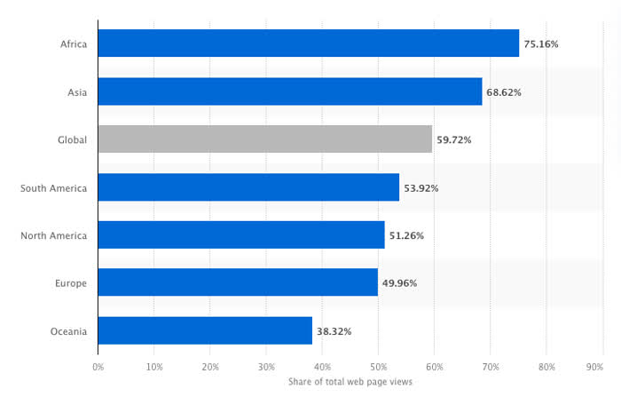

> Source: _[statista](https://www.statista.com/statistics/306528/share-of-mobile-internet-traffic-in-global-regions/)_

With a PWA, a small software company can easily reach mobile device customers, and even provide offline web applications where network coverage is spotty or only sometimes available. This is important even for mature markets, such as the United States, where there are still significant portions of the population that do not have reliable broadband access.


> Source _[US Census Bureau](https://www.census.gov/library/visualizations/2018/comm/broadband.html?cid=embedded_infographic)_

## Where PWAs don't make sense

With all of the advantages of PWAs, there are some situations where a native application is necessary.

1. **Apple incompatibility** - While much of PWA technology works fine with iOS and Safari, Apple is slow to give up their strategic economic advantages. Therefore, some technologies do not yet work as well on the iPhone as they do on other devices. For example, iOS does not support standard push notifications. Additionally, you must use Safari in order to install a PWA to the home screen when using an iPhone. Hopefully, in the near future, Apple will give in to increasing community pressure and enable a better experience for their customers by removing these inconvenient incompatibilities.
1. **Advanced device features** - A PWA can access a device's location, storage, haptic feedback, contacts, camera, battery, shortcuts, device orientation, fingerprint sensor, and even Bluetooth through [browser supported APIs](https://developer.mozilla.org/en-US/docs/Web/API). However, if an application requires the use of specific device features such as the flashlight or an atmospheric pressure sensor then you might be forced to build a device native application.

## Example PWAs

There are lots of [examples](https://www.simicart.com/blog/progressive-web-apps-examples/) of companies deploying PWAs. This includes brands such as Uber, Pinterest, Rakuten 24, Debenhams, Spotify, Google, BMW, Starbucks, and Flipboard.

### BMW

The results for moving to PWA are impressive. For example, BMW reported the following results after moving to a PWA:

> - 4X increase in people clicking from BMW.com to a BMW sales site
> - Up to 4X faster site load times
> - 50% growth in mobile users
> - 49% more site visits from search engines
>
> **Source** - [Think With Google](https://www.thinkwithgoogle.com/intl/en-gb/marketing-strategies/app-and-mobile/bmws-journey-fast-smooth-and-reliable-mobile-website/)


### Spotify

Spotify decided to move to a PWA in order to avoid Apple's 30% commission. However, they soon discovered additional benefits from their PWA.

> - Free-to-paid conversions increased 26.6% in 2015, 46% in 2019, and 58.4% in 2021
> - 30% increase of monthly active users
> - The number of desktop users rose by 45%
> - 40% increase of average listening hours per month
> - UX research reported a more visually appealing, responsive, and adaptable application

When you visit Spotify on a mobile device you are immediately invited to install the PWA to your home screen.

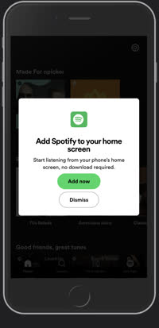

Once added to the home screen, the PWA acts just like a native device application.

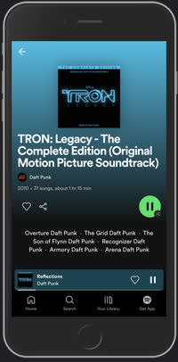

Additionally, the PWA makes it so that desktop users can install, and have a native application experience. Here is an example of Spotify installed on a MacBook. Notice the lack of the browser's interface, and the inclusion of Spotify's branding in the operating system's controls.


# Steps to make a PWA

One of the best things about PWA technology is that it doesn't require a significant amount of overhead to make your application a PWA. If you have built your application using responsive design techniques (@media, viewport meta, flex, grid, ...) and you have fallback functionality when disconnected, then you only have to take two additional steps. First, you need to provide a manifest that defines the details for displaying your application. Next, you need to write some JavaScript that implements the service worker API in order to cache files for performance and offline ability.

## Manifest and icons

📖 **Deeper dive reading**: [MDN Web app manifests](https://developer.mozilla.org/en-US/docs/Web/Manifest)

A PWA manifest is a JSON file that by convention is usually named `manifest.json`. You link the manifest to your application by including a reference in your `index.html` file. When the browser sees the manifest link, it recognizes the application as a PWA.

```html
<link rel="manifest" href="manifest.json" />
```

There are a lot of possible settings you can specify in the manifest. This includes properties such as the application's functional categorize (e.g. education, entertainment, travel), how to display the application (e.g. fullscreen, standalone, minimal-ui), scope (where to load the application from), icons, colors, descriptions, and screenshots for installation.

A minimal manifest might look like the following.

```json
{
  "short_name": "Simon",
  "name": "Simon",
  "start_url": ".",
  "display": "standalone",
  "theme_color": "#000000",
  "background_color": "#ffffff",
  "icons": [
    {
      "src": "favicon.ico",
      "sizes": "64x64 32x32 24x24 16x16",
      "type": "image/x-icon"
    },
    {
      "src": "/android-chrome-512x512.png",
      "sizes": "512x512",
      "type": "image/png"
    },
    {
      "src": "/maskable_icon.png",
      "sizes": "192x192",
      "type": "image/png",
      "purpose": "any maskable"
    }
  ]
}
```

This manifest specifies some basic branding information that tells the browser how to display the application when creating a home screen icon, and what splash screen to generate as the application starts up.

The icons section contains a variety of icons that the device will select from depending upon the context that the application is used in. In order to get full support for icons on iOS devices you also need to include a `apple-touch-icon` link in your `index.html`.

```html
<link rel="apple-touch-icon" sizes="180x180" href="/apple-touch-icon.png" />
```

## Service workers

📖 **Deeper dive reading**: [MDN Service worker API](https://developer.mozilla.org/en-US/docs/Web/API/Service_Worker_API)

The final step for converting your application into a progressive web application involves creating a service working by using the [Service Worker API](https://developer.mozilla.org/en-US/docs/Web/API/Service_Worker_API). Services workers, while not specific to PWAs, allow a web application to do background processing that is not directly associated with the rendering and interaction of a web application. One of the most common uses for a Service Worker is to enabling the browser caching of files for performance reasons. This also makes it so that the PWA keeps working even when it is disconnected from the internet.

To register a service worker, you call the `navigator.serviceWorker` API with the URL to a JavaScript file containing your service worker code.

```js
navigator.serviceWorker.register('service-worker.js');
```

The browser will then load and execute the service worker JavaScript. This gives the service worker a chance to register for event handling and specify what files the browser should cache for the application.

You can view the state of your application's service worker using the Chrome dev tools and selecting the `Application` tab.

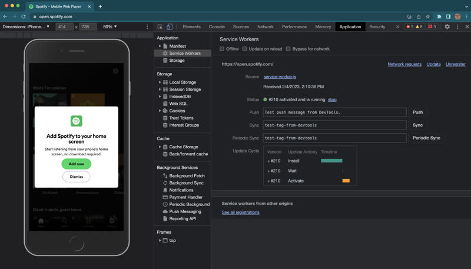

The `Application` tab allows you to remove the service worker, install a new version, generate events, and view cached files.

### The service worker lifecycle

When a service worker is first registered, the browser will immediately load it. This causes your application to be cached on the browser so that it can run offline and not have to load over the network on the user's next use. Since the application is served from the browser's cache, a user will not immediately see new application versions as they are deployed. Instead, they are loaded and put in a waiting state. The service worker remains in the waiting state until all of the browser tabs displaying the application are closed. Then, the next time the user opens the application, they will experience the new version.

You can use the Service Worker settings on the `Application` dev tools tab to skip the waiting period and force the new application version to load immediately.

Your application can also detect that a new version is available and then ask the user if they would like to automatically upgrade to the new version. The browser does that by simply refreshing the browser window.

## Experimenting with PWA

If you would like to see a simple PWA in action, you can use `create-react-app` to generate an template PWA application. From your console window run:

```sh
npx create-react-app testpwa --template cra-template-pwa
```

Then open the resulting project found in the `testpwa` directory and modify `index.js` to change `serviceWorkerRegistration.unregister` to `serviceWorkerRegistration.register`. Then build the application with `npm run build` and host the resulting bundled app located in the `build` directory with the VS Code Live Server extension in order to see a minimal working PWA.

## Workbox

📖 **Deeper dive reading**: [Chrome workbox](https://developer.chrome.com/docs/workbox/)

Workbox is an NPM package created by Google for using services workers. The template PWA created `create-react-app`, and the Simon demonstration project, both use workbox to simplify some of the registration, routing, and caching service worker complexities.


# Simon Progressive Web Application

âš  Note that this deliverable is optional and ungraded. The information provided here is meant as extended course content.


This deliverable demonstrates using Progressive Web Application (PWA) technology to integrate with mobile devices.

To covert the last Simon deliverable to a PWA we need to make three modifications.

1. Update the manifest and icons.
1. Implement and register a service worker. This includes caching the files necessary to run offline.
1. Implement fallback functionality so the application still works when offline.

## Manifest and icons

We want to make sure that Simon has all the necessary icons required by all major devices. To do this we took the original Simon icon and used [Favicon.io](https://favicon.io/favicon-converter/) to create a complete set of icons. We also created a maskable icon using [Maskable.app](https://maskable.app/editor) for devices that manipulate your icon for display with different shapes and sizes. These icons were then added to the `/public` directory, and references were added to both the `index.html` link elements and the `manifest.json` file.

**index.html**

```html
<link rel="apple-touch-icon" sizes="180x180" href="/apple-touch-icon.png" />
<link rel="icon" type="image/png" sizes="32x32" href="/favicon-32x32.png" />
<link rel="icon" type="image/png" sizes="16x16" href="/favicon-16x16.png" />
```

**manifest.json**

```js
{
  "short_name": "Simon",
  "name": "Simon",
  "start_url": ".",
  "display": "standalone",
  "theme_color": "#000000",
  "background_color": "#ffffff",
  "icons": [
    {
      "src": "favicon.ico",
      "sizes": "64x64 32x32 24x24 16x16",
      "type": "image/x-icon"
    },
    {
      "src": "/android-chrome-192x192.png",
      "sizes": "192x192",
      "type": "image/png"
    },
    {
      "src": "/android-chrome-512x512.png",
      "sizes": "512x512",
      "type": "image/png"
    },
    {
      "src": "/maskable_icon.png",
      "sizes": "192x192",
      "type": "image/png",
      "purpose": "any maskable"
    }
  ]
}
```

## Service worker

In order to get a reasonable service worker implementation we ran `create-react-app` with the `cra-template-pwa` template, and then copied over the `service-worker.js` and `serviceWorkerRegistration.js` files to our Simon project. The registration and service worker code was then stripped down and the necessary Workbox NPM packages installed as follows.

```sh
npm install workbox-core workbox-expiration workbox-precaching workbox-routing workbox-strategies
```

The caching implemented in `service-worker.js` first caches the React generated files, and then explicitly caches the sound and icon files used by Simon. This makes it so that all application files are cached on the browser and available for offline use.

The service worker was then set to register with the browser by calling the register function at the end of the `index.jsx` file.

```js
serviceWorkerRegistration.register();
```

## Offline fallbacks

Previous deliverables of Simon actually implemented fallback functionality for storing the current user and highest scores. However, we needed to make it so that a previously authenticated user could still play when disconnected from the internet. We also needed a default quote to use if we couldn't reach the third party quote endpoint.

### Authentication

To support remembering the previously authenticated user we removed the code found in `app.jsx` that tried to verify authentication on start up. Instead we simply use the presence of a user name in local storage to designate authentication.

When then modified `authenticated.jsx` to remove the user name from local storage when a user logs out.

```jsx
function logout() {
  fetch(`/api/auth/logout`, {
    method: 'delete',
  }).then(() => {
    localStorage.removeItem('userName');
    props.onLogout();
  });
}
```

The server will still check to make sure we have an authenticated user when an attempt to update the latest high score, but these changes make it so you can still play Simon when disconnected if you were previously authenticated.

Finally we disable login and account creation if we are not connected, and display an error instead.

```jsx
async function loginOrCreate(endpoint) {
  try {
    const response = await fetch(endpoint, {
      method: 'post',
      //...
    });
    //...
  } catch {
    setDisplayError(
      `âš  It appears that you are currently offline. You can play Simon offline, but you must be initially online to create or login to your account.`
    );
  }
}
```

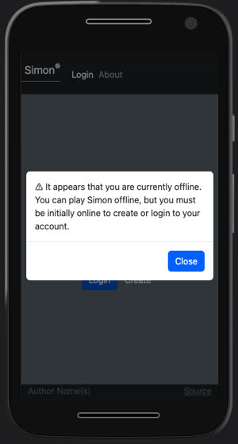

### Default quote

In `about.jsx` we return a default quote if we cannot connect to the third party quote endpoint.

```jsx
fetch('https://api.quotable.io/random')
  .then((response) => response.json())
  .then((data) => {
    this.setState({ quote: data.content, quoteAuthor: data.author });
  })
  .catch(() => {
    // Use offline fallback classic quote
    this.setState({
      quote: `Always bet on JavaScript`,
      quoteAuthor: `Brendan Eich`,
    });
  });
```

These changes, combined with the browser caching of all the Simon files, makes the application work reasonably when offline.

## Deployment and testing

During your examination of `serviceWorkerRegistration.js` you might have noticed that it does not register the service worker unless the application has been built in production mode (e.g. with `npm run build`). That means we need to run a production version of the application in order to see if everything is working correctly. The easiest way to do this is to use `deployReact.sh` to push the application to production.

Once you have the application in production you can use the Chrome debug tools to see that the application is registered and running without error. You can turn off the network for the application by selecting the `Offline` option. You can also see all the files that are cached in the `Cache/Storage/Cached Storage` view. To delete the service worker and all cached files associated with the application use the `Application/Storage/Clear Site Data` option.

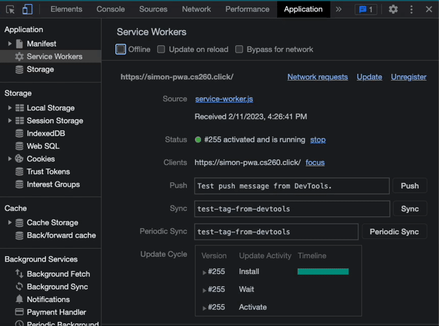

When you are confident about how the PWA is working you can run the `Lighthouse` tool found in the Chrome Dev Tools and see if everything is working up to specification. If it displays all `green` then your application should work well on all devices and should be properly search engine optimized (SEOed)).

**Lighthouse report**

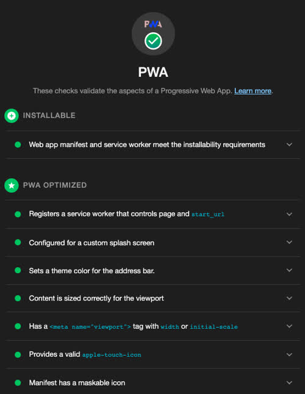

### Device testing

As a final test you should manually examine the application using the different responsive views that the Dev Tools provide with the Chrome, Safari, and Firefox browsers. Here is what Simon looks like on the Safari browser emulating an iPhone 6. As you can see it is not rendering properly on a small screen.

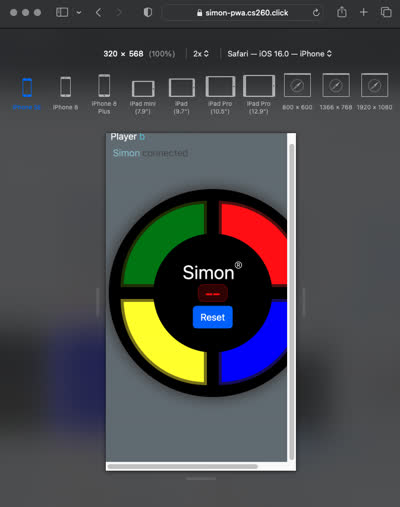

## Study this code

Get familiar with what the example code teaches.

- Clone the repository to your development environment.

  ```sh
  git clone https://github.com/webprogramming260/simon-pwa.git
  ```

- Review the code and get comfortable with everything it represents.
- View the code in your browser by hosting from your production server. You will later replace this with your version of Simon.
- Make modifications to the code as desired. Experiment and see what happens.


# Demo Day

## ☑ Assignment - Optional

On the last day of class we will celebrate your amazing work as part of a demo day party where you have the opportunity to showcase your start up application. If you wish to participate then submit the URL of your start up application to the Canvas assignment.

From the submitted applications we will pick the top 10. If your application is selected, and you present it on Demo Day, you will receive an extra 45 points for your start up application. The audience will vote on their favorites and the top 3 will receive the coveted Ghirardelli prize and a letter of recommendation from the Instructor.


# Wrap up

We hope that you have enjoyed learning how to build web application. The concepts you have mastered from this instruction are the same ones that professional software engineers use on a daily basis to change the world.

Always remember to continually invest in your tech, art, social, and discovery skills as you make the world a better place.

## ☑ Assignment - Optional

Please take the time to provide us with honest feedback by taking the university provided course survey. We carefully review your feedback and use it to improve the instruction and the methods for enabling learning.

As a way of showing our appreciation for helping make the course better, you will receive 5 bonus points towards your exam results. This will be awarded once we receive confirmation of your submission.

When you have completed the survey, mark that you submitted it in Canvas so that we can award you the bonus points.


# Website+WebApp notes:


## Main:

### HTML:

```html
<!DOCTYPE html>
<html lang="en">
  <head>
    <meta charset="UTF-8" />
    <meta http-equiv="X-UA-Compatible" content="IE=edge" />
    <meta name="viewport" content="width=device-width, initial-scale=1.0" />
    <!-- This is a placeholder for when you start using CSS -->
    <link rel="stylesheet" href="index.css" />
    <title>Calvin's CS260</title>
  </head>
  <body>
    <header>
      <h1>Calvin</h1>
      
    </header>
    <main>
      <section>
        <h2>About me</h2>
        <p>
          I'm just a dude trying to make dreams come true.
        </p>
        <p>
          Like seriously, I want to bring your favorite characters to life.
        </p>
        <p>
          Also it would be pretty awesome if we could all fly.
        </p>
      </section>
      <section>
        <h2>Start up project</h2>
        <p>
          <a href="https://startup.lightbikebattle.click/">LightbikeBattle</a>
        </p>
      </section>
      <section>
        <h2>Simon project</h2>
        <p>
          <a href="https://simon.lightbikebattle.click/">SimonGame</a>
        </p>
      </section>
      <section>
        <h2>Web programming assignments</h2>
        <h3>HTML</h3>
        <ul>
          <li>
            <a href="https://codepen.io/C4LV1NPU6/pen/bGjOxEJ">Introduction</a>
          </li>
          <li>
            <a href="https://codepen.io/C4LV1NPU6/pen/KKBbxaw">Structure</a>
          </li>
          <li>
            <a href="https://codepen.io/C4LV1NPU6/pen/dyjwqRe">Input</a>
          </li>
          <li>
            <a href="https://codepen.io/C4LV1NPU6/pen/KKBbxyd">Media</a>
          </li>
        </ul>
	<h3>CSS</h3>
        <ul>
          <li>
            <a href="https://codepen.io/C4LV1NPU6/pen/WNKVodL">Practice</a>
          </li>
          <li>
            <a href="https://codepen.io/C4LV1NPU6/pen/dyqbwwB">Flex</a>
          </li>
          <li>
            <a href="https://codepen.io/C4LV1NPU6/details/QWVWJdz">Frameworks</a>
          </li>
        </ul>
      </section>
    </main>
  </body>
</html>
```

### CSS:


```css
* {
  font-family: Arial, Helvetica, sans-serif;
  box-sizing: border-box;
}
```


## Startup:

### database.js:

```js
const { MongoClient } = require('mongodb');
const bcrypt = require('bcrypt');
const uuid = require('uuid');

const userName = process.env.MONGOUSER;
const password = process.env.MONGOPASSWORD;
const hostname = process.env.MONGOHOSTNAME;

if (!userName) {
  throw Error('Database not configured. Set environment variables');
}

const url = `mongodb+srv://${userName}:${password}@${hostname}`;

const client = new MongoClient(url);
const userCollection = client.db('lightbikebattle').collection('user');

function getUser(username) {
  return userCollection.findOne({ username: username });
}

function getUserByToken(token) {
  return userCollection.findOne({ token: token });
}

function getLobbyCount(game) {
  return userCollection.count({ game: game });
}

async function createUser(username, password) {
  // Hash the password before we insert it into the database
  const passwordHash = await bcrypt.hash(password, 10);

  const user = {
    username: username,
    password: passwordHash,
    token: uuid.v4(),
    wins: 0,
    losses: 0,
    game: "",
  };
  await userCollection.insertOne(user);

  return user;
}

async function updateUser(username, wins, losses, game) {
  const user0 = await getUser(username);

  if (wins === null) {
    wins = user0.wins;
  }
  if (losses === null) {
    losses = user0.losses;
  }
  if (game === null) {
    game = user0.game;
  }

  const user = {
    username: user0.username,
    password: user0.password,
    token: user0.token,
    wins: wins,
    losses: losses,
    game: game,
  };
  await userCollection.findOneAndReplace({username: user.username}, user);

  return user;
}

module.exports = {
  getUser,
  getUserByToken,
  getLobbyCount,
  createUser,
  updateUser,
};
```

### index.js:

```js
const cookieParser = require('cookie-parser');
const bcrypt = require('bcrypt');
const express = require('express');
const app = express();
const DB = require('./database.js');
const { PeerProxy } = require('./peerProxy.js');

const authCookieName = 'token';

// The service port may be set on the command line
const port = process.argv.length > 2 ? process.argv[2] : 4000;

// JSON body parsing using built-in middleware
app.use(express.json());

// Use the cookie parser middleware for tracking authentication tokens
app.use(cookieParser());

// Serve up the applications static content
app.use(express.static('public'));

// Router for service endpoints
var apiRouter = express.Router();
app.use(`/api`, apiRouter);

// CreateAuth token for a new user
apiRouter.post('/auth/create', async (req, res) => {
  if (await DB.getUser(req.body.username)) {
    res.status(409).send({ msg: 'Existing user' });
  } else {
    const user = await DB.createUser(req.body.username, req.body.password);

    // Set the cookie
    setAuthCookie(res, user.token);

    res.send({
      id: user._id,
    });
  }
});

// GetAuth token for the provided credentials
apiRouter.post('/auth/login', async (req, res) => {
  const user = await DB.getUser(req.body.username);
  if (user) {
    if (await bcrypt.compare(req.body.password, user.password)) {
      setAuthCookie(res, user.token);
      res.send({ id: user._id });
      return;
    }
  }
  res.status(401).send({ msg: 'Unauthorized' });
});

// DeleteAuth token if stored in cookie
apiRouter.delete('/auth/logout/:username', (_req, res) => {
  res.clearCookie(authCookieName);
  res.status(204).end();
});

apiRouter.delete('/auth/exit/:username', async (_req, res) => {
  const user = await DB.updateUser(_req.params.username, null, null, "");
  res.status(204).end();
});

// GetUser returns information about a user
apiRouter.get('/user/:username', async (req, res) => {
  const user = await DB.getUser(req.params.username);
  if (user) {
    const token = req?.cookies.token;
    res.send({ username: user.username, authenticated: token === user.token, 
      wins: user.wins, losses: user.losses, game: user.game});
    return;
  }
  res.status(404).send({ msg: 'Unknown' });
});

apiRouter.get('/lobbycount/:game', async (req, res) => {
  const count = await DB.getLobbyCount(req.params.game);
  if (count >= 0) {
    res.send({ lobbyCount: count });
    return;
  }
  res.status(404).send({ msg: 'Unknown' });
});

apiRouter.post('/auth/join', async (req, res) => {
  const host = await DB.getUser(req.body.host);
  if (host) {
    if (host.game === host.username) {
      const user = await DB.updateUser(req.body.username, null, null, req.body.host);
      res.send({ id: host._id });
      return;
    }
  }
  res.status(401).send({ msg: 'Not hosting' });
});

apiRouter.post('/auth/host', async (req, res) => {
  const user = await DB.updateUser(req.body.username, null, null, req.body.host);
  res.send({ id: user._id });
  return;
});

// secureApiRouter verifies credentials for endpoints
var secureApiRouter = express.Router();
apiRouter.use(secureApiRouter);

secureApiRouter.use(async (req, res, next) => {
  const authToken = req.cookies[authCookieName];
  const user = await DB.getUserByToken(authToken);
  if (user) {
    next();
  } else {
    res.status(401).send({ msg: 'Unauthorized' });
  }
});

// Default error handler
app.use(function (err, req, res, next) {
  res.status(500).send({ type: err.name, message: err.message });
});

// Return the application's default page if the path is unknown
app.use((_req, res) => {
  res.sendFile('logreg.html', { root: 'public' });
});

// setAuthCookie in the HTTP response
function setAuthCookie(res, authToken) {
  res.cookie(authCookieName, authToken, {
    secure: true,
    httpOnly: true,
    sameSite: 'strict',
  });
}

const httpService = app.listen(port, () => {
  console.log(`Listening on port ${port}`);
});

new PeerProxy(httpService);
```

### peerProxy.js:

```js
const { WebSocketServer } = require('ws');
const uuid = require('uuid');

class PeerProxy {
  constructor(httpServer) {
    // Create a websocket object
    const wss = new WebSocketServer({ noServer: true });

    // Handle the protocol upgrade from HTTP to WebSocket
    httpServer.on('upgrade', (request, socket, head) => {
      wss.handleUpgrade(request, socket, head, function done(ws) {
        wss.emit('connection', ws, request);
      });
    });

    // Keep track of all the connections so we can forward messages
    let connections = [];

    wss.on('connection', (ws, game) => {
      const connection = { id: uuid.v4(), alive: true, ws: ws, game: game.url };
      connections.push(connection);

      // Forward messages to everyone except the sender
      ws.on('message', function message(data) {
        connections.forEach((c) => {
          if (c.game === connection.game && c.id !== connection.id) {
            c.ws.send(data);
          }
        });
      });

      // Remove the closed connection so we don't try to forward anymore
      ws.on('close', () => {
        connections.findIndex((o, i) => {
          if (o.id === connection.id) {
            connections.splice(i, 1);
            return true;
          }
        });
      });

      // Respond to pong messages by marking the connection alive
      ws.on('pong', () => {
        connection.alive = true;
      });
    });

    // Keep active connections alive
    setInterval(() => {
      connections.forEach((c) => {
        // Kill any connection that didn't respond to the ping last time
        if (!c.alive) {
          c.ws.terminate();
        } else {
          c.alive = false;
          c.ws.ping();
        }
      });
    }, 10000);
  }
}

module.exports = { PeerProxy };
```

### public:

### logreg.html:

```html
<!DOCTYPE html>
<html lang="en">

<head>
  <meta name="viewport" content="width=device-width, initial-scale=1" />
  <link rel="stylesheet" href="all.css" />
  <link href="https://cdn.jsdelivr.net/npm/bootstrap@5.2.3/dist/css/bootstrap.min.css" rel="monospace" integrity="sha384-rbsA2VBKQhggwzxH7pPCaAqO46MgnOM80zW1RWuH61DGLwZJEdK2Kadq2F9CUG65" crossorigin="anonymous" />
</head>

<body>
  <header>
    <h1 class="text" style="--tn: 2.5s; --sn: 19; --en: 6; --wn: 13em;">Welcome to the Grid</h1>
  </header>

  <main>
    <section id="logreg">
      <div class="form-floating">
        <input type="username" class="form-control" id="username" placeholder="Username">
      </div>
      <div class="form-floating">
        <input type="password" class="form-control" id="password" placeholder="Password">
      </div>
      <button type="button" class="btn btn-primary" onclick="loginUser()">Login</button>
      <button type="button" class="btn btn-primary" onclick="createUser()">Register</button>
    </section>
  </main>

  <footer>
    <h2 class="text" style="--tn: 2.5s; --sn: 14; --en: 3; --wn: 9.6em;">From C4LV1NPU6</h2>
    <a class="text" href="https://github.com/C4LV1NPU6/byu-cs260/tree/main/startup">Source</a>
  </footer>

  <!-- <script src="https://cdn.jsdelivr.net/npm/bootstrap@5.2.3/dist/js/bootstrap.bundle.min.js" integrity="sha384-kenU1KFdBIe4zVF0s0G1M5b4hcpxyD9F7jL+jjXkk+Q2h455rYXK/7HAuoJl+0I4" crossorigin="anonymous">
  </script> -->

  <script src="logreg.js"></script>
</body>

</html>
```

### menu.html:

```html
<!DOCTYPE html>
<html lang="en">

<head>
  <meta name="viewport" content="width=device-width, initial-scale=1" />
  <link rel="stylesheet" href="all.css" />
  <link href="https://cdn.jsdelivr.net/npm/bootstrap@5.2.3/dist/css/bootstrap.min.css" rel="monospace" integrity="sha384-rbsA2VBKQhggwzxH7pPCaAqO46MgnOM80zW1RWuH61DGLwZJEdK2Kadq2F9CUG65" crossorigin="anonymous" />
</head>

<body>
  <header>
    <h1 class="text" style="--tn: 2.5s; --sn: 19; --en: 6; --wn: 13em;">Welcome to the Grid</h1>
  </header>

  <main>
    <section id="lobby">
      <div class="form-floating">
        <input type="host" class="form-control" id="host" placeholder="Host's Username">
      </div>
      <button type="button" class="btn btn-primary" onclick="joinLobby()">Join</button>
      <button type="button" class="btn btn-primary" onclick="hostLobby()">Host</button>
      <div class="form-floating">
        <button type="button" class="btn btn-primary" onclick="logout()">Logout</button>
      </div>
    </section>
  </main>

  <footer>
    <h2 class="text" style="--tn: 2.5s; --sn: 14; --en: 3; --wn: 9.6em;">From C4LV1NPU6</h2>
    <a class="text" href="https://github.com/C4LV1NPU6/byu-cs260/tree/main/startup">Source</a>
  </footer>

  <!-- <script src="https://cdn.jsdelivr.net/npm/bootstrap@5.2.3/dist/js/bootstrap.bundle.min.js" integrity="sha384-kenU1KFdBIe4zVF0s0G1M5b4hcpxyD9F7jL+jjXkk+Q2h455rYXK/7HAuoJl+0I4" crossorigin="anonymous">
  </script> -->

  <script src="menu.js"></script>
</body>

</html>
```

### game.html:

```html
<!DOCTYPE html>
<html lang="en">

<head>
  <meta name="viewport" content="width=device-width, initial-scale=1" />
  <link rel="stylesheet" href="all.css" />
  <link href="https://cdn.jsdelivr.net/npm/bootstrap@5.2.3/dist/css/bootstrap.min.css" rel="monospace" integrity="sha384-rbsA2VBKQhggwzxH7pPCaAqO46MgnOM80zW1RWuH61DGLwZJEdK2Kadq2F9CUG65" crossorigin="anonymous" />
</head>

<body>
  <header>
    <h1 class="text" style="--tn: 2.5s; --sn: 19; --en: 6; --wn: 13em;">Welcome to the Grid</h1>
  </header>

  <main>
    <section id="stats">
      <h2 class="text" style="--tn: 1s; --sn: 5; --en: 3; --wn: 3.4em;">Stats</h2>
      <h2 class="text" id="wins" style="--tn: 1s; --sn: 5; --en: 3; --wn: 3.4em;">Wins: </h2>
      <h2 class="text" id="losses" style="--tn: 1s; --sn: 5; --en: 3; --wn: 3.4em;">Losses: </h2>
    </section>
    <section id="game">
      <div class="form-floating">
        <h2 class="text" id="userName"></h2>
      </div>
      <div class="form-floating">
        <canvas id="arena" width="800" height="800">
      </div>
      <div class="form-floating" id="controls">
        <h2 class="text">W,A,S,D: direction.</h2>
        <h2 class="text">Enter: (re)start game.</h2>
        <h2 class="text">Shift: pause/resume game.</h2>
      </div>
      <div class="form-floating" id="exit">
        <button type="button" class="btn btn-primary" onclick="exit()">Exit</button>
      </div>
    </section>
    <section id="chat">
      <h2 class="text" style="--tn: 1s; --sn: 4; --en: 3; --wn: 2.7em;">Chat</h2>
      <div class="form-floating">
        <input type="chat" class="form-control" id="chatbox" placeholder="Chat">
      </div>
      <button type="button" class="btn btn-primary" onclick="sendMsg()">Send</button>
    </section>
  </main>

  <footer>
    <h2 class="text" style="--tn: 2.5s; --sn: 14; --en: 3; --wn: 9.6em;">From C4LV1NPU6</h2>
    <a class="text" href="https://github.com/C4LV1NPU6/byu-cs260/tree/main/startup">Source</a>
  </footer>

  <!-- <script src="https://cdn.jsdelivr.net/npm/bootstrap@5.2.3/dist/js/bootstrap.bundle.min.js" integrity="sha384-kenU1KFdBIe4zVF0s0G1M5b4hcpxyD9F7jL+jjXkk+Q2h455rYXK/7HAuoJl+0I4" crossorigin="anonymous">
  </script> -->

  <script src="game.js"></script>
</body>

</html>
```

### all.css:

```css
* {
  text-align: center;
  font-family: monospace;
  color: #fff;
  box-sizing: border-box;
}

body {
  background: #000;
  display: flex;
  justify-content: center;
  margin: 0;
  flex-direction: column;
  height: 100vh;
}

header {
  padding-top: 2em;
  padding-bottom: 2em;
  flex: 0 80px;
}

footer {
  padding-top: 1em;
  flex: 0 50px;
}

main {
  flex: 1;
  display: flex;
  flex-direction: row;
}

section:nth-child(1) {
  flex: 1;
  background-color: #222;
}
section:nth-child(2) {
  flex: 4;
  background-color: #222;
}
section:nth-child(3) {
  flex: 1;
  background-color: #222;
}

#userName {
  background-color: #333;
}

#arena {
  background-color: #000;
  margin-top: auto;
  margin-bottom: auto;
  margin-left: auto;
  margin-right: auto;
}

#controls {
  background-color: #333;
}

input {
  background: #000;
  font-size: 18px;
}
button {
  background: #000;
  font-size: 18px;
}

@media (orientation: portrait) {
  main {
    flex-direction: column;
  }
}

@media (max-height: 700px) {
  header {
    display: none;
  }
  footer {
    display: none;
  }
}

.text {
  overflow: hidden;
  border-right: 0.15em solid #fff;
  white-space: nowrap;
  margin: 0 auto;
  letter-spacing: 0.15em;
  animation: typing var(--tn) steps(var(--sn), end),
    blink-caret 0.5s step-end var(--en);
  border-color: transparent;
}

@keyframes typing {
  from {
    width: 0;
  }
  to {
    width: var(--wn);
  }
}

@keyframes blink-caret {
  from,
  to {
    border-color: transparent;
  }
  50% {
    border-color: #fff;
  }
}
```

### logreg.js:

```js
(async () => {
  let authenticated = false;
  const userName = localStorage.getItem('userName');
  if (userName) {
    const nameEl = document.querySelector('#username');
    nameEl.value = userName;
    const user = await getUser(nameEl.value);
    authenticated = user?.authenticated;
  }

  if (authenticated) {
    window.location.href = 'menu.html';
  }
})();

async function loginUser() {
  loginOrCreate(`/api/auth/login`);
}

async function createUser() {
  loginOrCreate(`/api/auth/create`);
}

async function loginOrCreate(endpoint) {
  const userName = document.querySelector('#username')?.value;
  const password = document.querySelector('#password')?.value;
  if (userName === "" || password === "") {
    return;
  }
  const response = await fetch(endpoint, {
    method: 'post',
    body: JSON.stringify({ username: userName, password: password }),
    headers: {
      'Content-type': 'application/json; charset=UTF-8',
    },
  });
  const body = await response.json();

  if (response?.status === 200) {
    localStorage.setItem('userName', userName);
    window.location.href = 'menu.html';
  }
}

async function getUser(username) {
  // See if we have a user with the given username.
  const response = await fetch(`/api/user/${username}`);
  if (response.status === 200) {
    return response.json();
  }
  return null;
}
```

### menu.js:

```js
async function joinLobby() {
  if (localStorage.getItem('userName') === document.querySelector('#host')?.value) {
    return;
  }
  joinOrHost(`/api/auth/join`);
}

async function hostLobby() {
  if (localStorage.getItem('userName') !== document.querySelector('#host')?.value) {
    return;
  }
  joinOrHost(`/api/auth/host`);
}

async function joinOrHost(endpoint) {
  const host = document.querySelector('#host')?.value;
  if (host === "") {
    return;
  }

  const response0 = await fetch(`/api/lobbycount/${host}`);
  const body0 = await response0.json();
  if (body0.lobbyCount >= 2) {
    return;
  }

  const response = await fetch(endpoint, {
    method: 'post',
    body: JSON.stringify({ username: localStorage.getItem('userName'), host: host }),
    headers: {
      'Content-type': 'application/json; charset=UTF-8',
    },
  });
  const body = await response.json();

  if (response?.status === 200) {
    window.location.href = 'game.html';
  }
}

function logout() {
  fetch(`/api/auth/logout/${localStorage.getItem('userName')}`, {
    method: 'delete',
  }).then(() => (window.location.href = '/'));
}

function displayPicture(data) {
  const containerEl = document.querySelector("#lobby");

  const width = containerEl.offsetWidth;
  const height = containerEl.offsetHeight;

  const imgUrl = `https://api.qrserver.com/v1/create-qr-code/?size=${width}x${height}&data=${data.url}`;
  const imgEl = document.createElement("img");
  imgEl.setAttribute("src", imgUrl);
  containerEl.appendChild(imgEl);
}
  
function callService(url, displayCallback) {
  fetch(url)
    .then((response) => response)
    .then((data) => {
      displayCallback(data);
    });
}

const random = Math.floor(Math.random() * 1000);
callService(`https://api.qrserver.com/v1/create-qr-code/?size=150x150&data=${localStorage.getItem('userName')}`, displayPicture);
```

### game.js:

```js
const keys = {
  'Enter': 'start_game',
  'ShiftRight': 'pause_game',
  'KeyW': 'up',
  'KeyS': 'down',
  'KeyA': 'left',
  'KeyD': 'right',
};

class Cycle {
  blue;
  red;

  constructor () {
    this.blue = {
      type: "blue",
      width: 8,
      height: 8,
      color: "#00F",
      history: [],
      current_direction: null
    };
    
    this.red = {
      type: "red",
      width: 8,
      height: 8,
      color: "#F00",
      history: [],
      current_direction: null
    };
  }
  
  resetBlue () {
    this.blue.x = game.canvas.width - (game.canvas.width / (this.blue.width / 2) + 4);
    this.blue.y = game.canvas.height / 2 + this.blue.height / 2;
    this.blue.color = "#00E0FF";
    this.blue.history = [];
    this.blue.current_direction = "left";
  }

  resetRed () {
    this.red.x = game.canvas.width / (this.red.width / 2) - 4;
    this.red.y = game.canvas.height / 2 + this.red.height / 2;
    this.red.color = "#FF8000";
    this.red.history = [];
    this.red.current_direction = "right";
  }

  move (cycle, opponent, u, d, l, r) {
    switch (cycle.current_direction) {
      case u:
        cycle.y -= cycle.height;
        break;
      case d:
        cycle.y += cycle.height;
        break;
      case r:
        cycle.x += cycle.width;
        break;
      case l:
        cycle.x -= cycle.width;
        break;
    }
    if (this.checkCollision(cycle, opponent)) {
      game.end(cycle, opponent);
    }
    const coords = this.generateCoords(cycle);
    cycle.history.push(coords);
  }

  checkCollision (cycle, opponent) {
    if (
      cycle.x < cycle.width / 2 ||
      cycle.x > game.canvas.width - cycle.width / 2 ||
      cycle.y < cycle.height / 2 ||
      cycle.y > game.canvas.height - cycle.height / 2 ||
      cycle.history.indexOf(this.generateCoords(cycle)) >= 0 ||
      opponent.history.indexOf(this.generateCoords(cycle)) >= 0
    ) {
      return true;
    }
  }

  isCollision (x, y) {
    coords = x + "," + y;
    if (
      x < this.red.width / 2 ||
      x > game.canvas.width - this.red.width / 2 ||
      y < this.red.height / 2 ||
      y > game.canvas.height - this.red.height / 2 ||
      this.red.history.indexOf(coords) >= 0 ||
      this.blue.history.indexOf(coords) >= 0
    ) {
      return true;
    }
  }

  generateCoords (cycle) {
    return cycle.x + "," + cycle.y;
  }

  draw (cycle) {
    game.context.fillStyle = cycle.color;
    game.context.beginPath();
    game.context.moveTo(cycle.x - cycle.width / 2, cycle.y - cycle.height / 2);
    game.context.lineTo(cycle.x + cycle.width / 2, cycle.y - cycle.height / 2);
    game.context.lineTo(cycle.x + cycle.width / 2, cycle.y + cycle.height / 2);
    game.context.lineTo(cycle.x - cycle.width / 2, cycle.y + cycle.height / 2);
    game.context.closePath();
    game.context.fill();
  }
}

class Game {
  stopped;
  over;
  user;
  cycle;
  player;
  canvas;
  context;
  lastKey;

  constructor () {
    this.initialize();
  }

  initialize = async () => {
    const user = await this.getUser(localStorage.getItem('userName'));
    if (user.game === '') {
      window.location.href = 'menu.html';
    }
    this.user = user;
  
    document.querySelector('#userName').textContent = this.user.username;
    document.querySelector('#wins').textContent = "Wins: " + this.user.wins;
    document.querySelector('#losses').textContent = "Losses: " + this.user.losses;

    this.canvas = document.getElementById("arena");
    this.context = this.canvas.getContext("2d");

    this.stopped = false;
    this.over = true;

    this.cycle = new Cycle();
    
    if (this.user.username === this.user.game) {
      this.player = 'blue';
    } else {
      this.player = 'red';
    }
  
    this.configureWebSocket();

    this.lastKey = null;
    addEventListener(
      "keydown",
      function (e) {
        game.lastKey = keys[e.code];
        if (['start_game'].indexOf(game.lastKey) >= 0 && game.stopped) {
          game.broadcastEvent(game.user.username, game.user.game, 'start_game', null);
          game.start();
        }
        if (['pause_game'].indexOf(game.lastKey) >= 0) {
          game.broadcastEvent(game.user.username, game.user.game, 'pause_game', null);
          game.pause();
        }
        if (game.player === 'blue' && ['up', 'down', 'left', 'right'].indexOf(game.lastKey) >= 0 && game.lastKey != game.inverseDirection(game.cycle.blue, 'up', 'down', 'left', 'right')) {
          game.cycle.blue.current_direction = game.lastKey;
        }
        if (game.player === 'red' && ['up', 'down', 'left', 'right'].indexOf(game.lastKey) >= 0 && game.lastKey != game.inverseDirection(game.cycle.red, 'up', 'down', 'left', 'right')) {
          game.cycle.red.current_direction = game.lastKey;
        }
      },
      false
    );

    setInterval(this.loop, 100);

    this.pause();
  }
    
  async getUser(username) {
    // See if we have a user with the given username.
    const response = await fetch(`/api/user/${username}`);
    if (response.status === 200) {
      return response.json();
    }
    return null;
  }
  
  inverseDirection(cycle, u, d, l, r) {
    switch (cycle.current_direction) {
      case u:
        return d;
      case d:
        return u;
      case r:
        return l;
      case l:
        return r;
    }
  }

  loop() {
    if (game.stopped === false) {
      if (game.player === 'blue') {
        game.broadcastEvent(game.user.username, game.user.game, 'blue_move', game.cycle.blue.current_direction);
        game.cycle.move(game.cycle.blue, game.cycle.red, 'up', 'down', 'left', 'right');
        game.cycle.draw(game.cycle.blue);
      } else if (game.player === 'red') {
        game.broadcastEvent(game.user.username, game.user.game, 'red_move', game.cycle.red.current_direction);
        game.cycle.move(game.cycle.red, game.cycle.blue, 'up', 'down', 'left', 'right');
        game.cycle.draw(game.cycle.red);
      }
    }
  }

  start () {
    game.cycle.resetBlue();
    game.cycle.resetRed();
    game.stopped = false;
    game.over = false;
    game.resetCanvas();
  }

  pause () {
    if (game.stopped === true && game.over === false) {
      game.stopped = false;
    } else {
      game.stopped = true;
    }
  }

  end (cycle, opponent) {
    game.stopped = true;
    game.over = true;
    game.context.fillStyle = "#FFF";
    game.context.font = game.canvas.height / 18 + "px sans-serif";
    game.context.textAlign = "center";
    game.context.fillText(
      "GAME OVER - " + opponent.type.toUpperCase() + " WINS",
      game.canvas.width / 2,
      game.canvas.height / 2
    );
    cycle.color = "#FFF";

    if (game.player === opponent.type) {
      game.user.wins += 1;
    } else {
      game.user.losses += 1;
    }
    document.querySelector('#wins').textContent = "Wins: " + this.user.wins;
    document.querySelector('#losses').textContent = "Losses: " + this.user.losses;
    //OPTIONAL: Update scores in database. Requires head-on collision sync.
  }

  newLevel () {
    game.cycle.resetBlue();
    game.cycle.resetRed();
    game.resetCanvas();
  }

  resetCanvas () {
    game.context.clearRect(0, 0, game.canvas.width, game.canvas.height);
  }

  // Functionality for peer communication using WebSocket

  configureWebSocket() {
    const protocol = window.location.protocol === 'http:' ? 'ws' : 'wss';
    this.socket = new WebSocket(`${protocol}://${window.location.host}/ws/${this.user.game}`);
    this.socket.onopen = (event) => {
      //displayMsg('system', 'game', 'connected');
    };
    this.socket.onclose = (event) => {
      //displayMsg('system', 'game', 'disconnected');
    };
    this.socket.onmessage = async (event) => {
      const msg = JSON.parse(await event.data.text());
      if (msg.type === 'start_game') {
        this.start();
      } else if (msg.type === 'pause_game') {
        this.pause();
      } else if (msg.type === 'red_move') {
        this.cycle.red.current_direction = msg.value;
        game.cycle.move(game.cycle.red, game.cycle.blue, 'up', 'down', 'left', 'right');
        game.cycle.draw(game.cycle.red);
      } else if (msg.type === 'blue_move') {
        this.cycle.blue.current_direction = msg.value;
        game.cycle.move(game.cycle.blue, game.cycle.red, 'up', 'down', 'left', 'right');
        game.cycle.draw(game.cycle.blue);
      } else if (msg.type === 'post_chat') {
        document.getElementById("chat").innerHTML += "<h3>" + msg.from + ": " + msg.value + "</h3>";
      } else if (msg.type === 'exit') {
        exit();
      }
    };
  }

  broadcastEvent(from, to, type, value) {
    const event = {
      from: from,
      to: to,
      type: type,
      value: value,
    };
    this.socket.send(JSON.stringify(event));
  }
}

function sendMsg() {
  const message = document.querySelector('#chatbox')?.value;
  document.getElementById("chat").innerHTML += "<h3>" + game.user.username + ": " + message + "</h3>";
  game.broadcastEvent(game.user.username, game.user.game, 'post_chat', message);
}

function exit() {
  game.broadcastEvent(game.user.username, game.user.game, 'exit', null);
  fetch(`/api/auth/exit/${game.user.username}`, {
    method: 'delete',
  }).then(() => (window.location.href = 'menu.html'));
}

window.onbeforeunload = function(){
  exit();
}

const game = new Game();
```


## Simon:

### public:

### index.html:

```html
<!DOCTYPE html>
<html lang="en">
  <head>
    <meta charset="utf-8" />
    <link rel="icon" href="%PUBLIC_URL%/favicon.ico" />
    <meta name="viewport" content="width=device-width, initial-scale=1" />
    <meta name="theme-color" content="#000000" />

    <link rel="manifest" href="%PUBLIC_URL%/manifest.json" />
    <title>Simon</title>
  </head>
  <body>
    <noscript>You need to enable JavaScript to run this app.</noscript>
    <div id="root"></div>
  </body>
</html>
```

### manifest.json:

```json
{
  "short_name": "Simon",
  "name": "Simon",
  "icons": [
    {
      "src": "favicon.ico",
      "sizes": "64x64 32x32 24x24 16x16",
      "type": "image/x-icon"
    }
  ],
  "start_url": ".",
  "display": "standalone",
  "theme_color": "#000000",
  "background_color": "#ffffff"
}
```

### service:

### database.js:

```js
const { MongoClient } = require('mongodb');
const bcrypt = require('bcrypt');
const uuid = require('uuid');

const userName = process.env.MONGOUSER;
const password = process.env.MONGOPASSWORD;
const hostname = process.env.MONGOHOSTNAME;

if (!userName) {
  throw Error('Database not configured. Set environment variables');
}

const url = `mongodb+srv://${userName}:${password}@${hostname}`;

const client = new MongoClient(url);
const userCollection = client.db('simon').collection('user');
const scoreCollection = client.db('simon').collection('score');

function getUser(email) {
  return userCollection.findOne({ email: email });
}

function getUserByToken(token) {
  return userCollection.findOne({ token: token });
}

async function createUser(email, password) {
  // Hash the password before we insert it into the database
  const passwordHash = await bcrypt.hash(password, 10);

  const user = {
    email: email,
    password: passwordHash,
    token: uuid.v4(),
  };
  await userCollection.insertOne(user);

  return user;
}

function addScore(score) {
  scoreCollection.insertOne(score);
}

function getHighScores() {
  const query = {};
  const options = {
    sort: { score: -1 },
    limit: 10,
  };
  const cursor = scoreCollection.find(query, options);
  return cursor.toArray();
}

module.exports = {
  getUser,
  getUserByToken,
  createUser,
  addScore,
  getHighScores,
};
```

### index.js:

```js
const cookieParser = require('cookie-parser');
const bcrypt = require('bcrypt');
const express = require('express');
const app = express();
const DB = require('./database.js');
const { peerProxy } = require('./peerProxy.js');

const authCookieName = 'token';

// The service port may be set on the command line
const port = process.argv.length > 2 ? process.argv[2] : 3000;

// JSON body parsing using built-in middleware
app.use(express.json());

// Use the cookie parser middleware for tracking authentication tokens
app.use(cookieParser());

// Serve up the applications static content
app.use(express.static('public'));

// Router for service endpoints
const apiRouter = express.Router();
app.use(`/api`, apiRouter);

// CreateAuth token for a new user
apiRouter.post('/auth/create', async (req, res) => {
  if (await DB.getUser(req.body.email)) {
    res.status(409).send({ msg: 'Existing user' });
  } else {
    const user = await DB.createUser(req.body.email, req.body.password);

    // Set the cookie
    setAuthCookie(res, user.token);

    res.send({
      id: user._id,
    });
  }
});

// GetAuth token for the provided credentials
apiRouter.post('/auth/login', async (req, res) => {
  const user = await DB.getUser(req.body.email);
  if (user) {
    if (await bcrypt.compare(req.body.password, user.password)) {
      setAuthCookie(res, user.token);
      res.send({ id: user._id });
      return;
    }
  }
  res.status(401).send({ msg: 'Unauthorized' });
});

// DeleteAuth token if stored in cookie
apiRouter.delete('/auth/logout', (_req, res) => {
  res.clearCookie(authCookieName);
  res.status(204).end();
});

// GetUser returns information about a user
apiRouter.get('/user/:email', async (req, res) => {
  const user = await DB.getUser(req.params.email);
  if (user) {
    const token = req?.cookies.token;
    res.send({ email: user.email, authenticated: token === user.token });
    return;
  }
  res.status(404).send({ msg: 'Unknown' });
});

// secureApiRouter verifies credentials for endpoints
const secureApiRouter = express.Router();
apiRouter.use(secureApiRouter);

secureApiRouter.use(async (req, res, next) => {
  const authToken = req.cookies[authCookieName];
  const user = await DB.getUserByToken(authToken);
  if (user) {
    next();
  } else {
    res.status(401).send({ msg: 'Unauthorized' });
  }
});

// GetScores
secureApiRouter.get('/scores', async (req, res) => {
  const scores = await DB.getHighScores();
  res.send(scores);
});

// SubmitScore
secureApiRouter.post('/score', async (req, res) => {
  await DB.addScore(req.body);
  const scores = await DB.getHighScores();
  res.send(scores);
});

// Default error handler
app.use(function (err, req, res, next) {
  res.status(500).send({ type: err.name, message: err.message });
});

// Return the application's default page if the path is unknown
app.use((_req, res) => {
  res.sendFile('index.html', { root: 'public' });
});

// setAuthCookie in the HTTP response
function setAuthCookie(res, authToken) {
  res.cookie(authCookieName, authToken, {
    secure: true,
    httpOnly: true,
    sameSite: 'strict',
  });
}

const httpService = app.listen(port, () => {
  console.log(`Listening on port ${port}`);
});

peerProxy(httpService);
```

### peerProxy.js:

```js
const { WebSocketServer } = require('ws');
const uuid = require('uuid');

function peerProxy(httpServer) {
  // Create a websocket object
  const wss = new WebSocketServer({ noServer: true });

  // Handle the protocol upgrade from HTTP to WebSocket
  httpServer.on('upgrade', (request, socket, head) => {
    wss.handleUpgrade(request, socket, head, function done(ws) {
      wss.emit('connection', ws, request);
    });
  });

  // Keep track of all the connections so we can forward messages
  let connections = [];

  wss.on('connection', (ws) => {
    const connection = { id: uuid.v4(), alive: true, ws: ws };
    connections.push(connection);

    // Forward messages to everyone except the sender
    ws.on('message', function message(data) {
      connections.forEach((c) => {
        if (c.id !== connection.id) {
          c.ws.send(data);
        }
      });
    });

    // Remove the closed connection so we don't try to forward anymore
    ws.on('close', () => {
      connections.findIndex((o, i) => {
        if (o.id === connection.id) {
          connections.splice(i, 1);
          return true;
        }
        return false;
      });
    });

    // Respond to pong messages by marking the connection alive
    ws.on('pong', () => {
      connection.alive = true;
    });
  });

  // Keep active connections alive
  setInterval(() => {
    connections.forEach((c) => {
      // Kill any connection that didn't respond to the ping last time
      if (!c.alive) {
        c.ws.terminate();
      } else {
        c.alive = false;
        c.ws.ping();
      }
    });
  }, 10000);
}

module.exports = { peerProxy };
```

### package.json:

```json
{
  "name": "simon-service",
  "version": "1.0.0",
  "description": "This demonstrates a service for a web application.",
  "main": "index.js",
  "scripts": {
    "start": "node index.js"
  },
  "author": "",
  "license": "MIT",
  "dependencies": {
    "bcrypt": "^5.1.0",
    "cookie-parser": "^1.4.6",
    "express": "^4.18.2",
    "mongodb": "^4.12.0",
    "uuid": "^9.0.0",
    "ws": "^8.12.0"
  }
}
```

### src:

### app.css:

```css
.body {
  display: flex;
  flex-direction: column;
  min-width: 375px;
}

header {
  flex: 0 80px;
}

main {
  flex: 1 calc(100vh - 110px);
  display: flex;
  flex-direction: column;
  align-items: center;
  justify-content: space-around;
}

footer {
  flex: 0 30px;
}

menu {
  flex: 1;
  display: flex;
  /*  overwrite Bootstrap so the menu does not wrap */
  flex-direction: row !important;
  list-style: none;
}

.navbar-brand {
  padding-left: 0.3em;
  border-bottom: solid rgb(182, 182, 182) thin;
}

menu .nav-item {
  padding: 0 0.3em;
}

footer a {
  float: right;
}

@media (max-height: 600px) {
  header {
    display: none;
  }
  footer {
    display: none;
  }
  main {
    flex: 1 100vh;
  }
}
```

### app.jsx:

```jsx
import React from 'react';

import { NavLink, Route, Routes } from 'react-router-dom';
import { Login } from './login/login';
import { Play } from './play/play';
import { Scores } from './scores/scores';
import { About } from './about/about';
import { AuthState } from './login/authState';
import 'bootstrap/dist/css/bootstrap.min.css';
import './app.css';

function App() {
  const [userName, setUserName] = React.useState(localStorage.getItem('userName') || '');

  // Asynchronously determine if the user is authenticated by calling the service
  const [authState, setAuthState] = React.useState(AuthState.Unknown);
  React.useEffect(() => {
    if (userName) {
      fetch(`/api/user/${userName}`)
        .then((response) => {
          if (response.status === 200) {
            return response.json();
          }
        })
        .then((user) => {
          const state = user?.authenticated ? AuthState.Authenticated : AuthState.Unauthenticated;
          setAuthState(state);
        });
    } else {
      setAuthState(AuthState.Unauthenticated);
    }
  }, [userName]);

  return (
    <div className='body bg-dark text-light'>
      <header className='container-fluid'>
        <nav className='navbar fixed-top navbar-dark'>
          <div className='navbar-brand'>
            Simon<sup>&reg;</sup>
          </div>
          <menu className='navbar-nav'>
            <li className='nav-item'>
              <NavLink className='nav-link' to=''>
                Login
              </NavLink>
            </li>
            {authState === AuthState.Authenticated && (
              <li className='nav-item'>
                <NavLink className='nav-link' to='play'>
                  Play
                </NavLink>
              </li>
            )}
            {authState === AuthState.Authenticated && (
              <li className='nav-item'>
                <NavLink className='nav-link' to='scores'>
                  Scores
                </NavLink>
              </li>
            )}
            <li className='nav-item'>
              <NavLink className='nav-link' to='about'>
                About
              </NavLink>
            </li>
          </menu>
        </nav>
      </header>

      <Routes>
        <Route
          path='/'
          element={
            <Login
              userName={userName}
              authState={authState}
              onAuthChange={(userName, authState) => {
                setAuthState(authState);
                setUserName(userName);
              }}
            />
          }
          exact
        />
        <Route path='/play' element={<Play userName={userName} />} />
        <Route path='/scores' element={<Scores />} />
        <Route path='/about' element={<About />} />
        <Route path='*' element={<NotFound />} />
      </Routes>

      <footer className='bg-dark text-dark text-muted'>
        <div className='container-fluid'>
          <span className='text-reset'>C4LV1NPU6</span>
          <a className='text-reset' href='https://github.com/C4LV1NPU6/byu-cs260/tree/main/simon'>
            Source
          </a>
        </div>
      </footer>
    </div>
  );
}

function NotFound() {
  return <main className='container-fluid bg-secondary text-center'>404: Return to sender. Address unknown.</main>;
}

export default App;
```

### index.jsx:

```jsx
import React from 'react';
import ReactDOM from 'react-dom/client';
import { BrowserRouter } from 'react-router-dom';
import App from './app';

const root = ReactDOM.createRoot(document.getElementById('root'));
root.render(
  <BrowserRouter>
    <App />
  </BrowserRouter>
);
```

#### about:

#### about.css:

```css
.picture-box {
  height: calc(100px + 1em);
  margin-bottom: 1em;
  padding: 0.5em;
  background: rgb(86, 89, 93);
  border-radius: 5px;
}

.quote-box {
  margin-top: 1em;
  padding: 0.5em;
  border-radius: 5px;
}

.quote {
  font-style: italic;
}

.author {
  font-weight: bold;
  text-align: right;
}

.author::before {
  content: " - ";
}

#picture img {
  width: 100%;
  height: 100%;
}
```

#### about.jsx:

```jsx
import React from 'react';
import './about.css';

export function About(props) {
  const [imageUrl, setImageUrl] = React.useState('');
  const [quote, setQuote] = React.useState('Loading...');
  const [quoteAuthor, setQuoteAuthor] = React.useState('unknown');

  // We only want this to render the first time the component is created and so we provide an empty dependency list.
  React.useEffect(() => {
    const random = Math.floor(Math.random() * 1000);
    fetch(`https://picsum.photos/v2/list?page=${random}&limit=1`)
      .then((response) => response.json())
      .then((data) => {
        const containerEl = document.querySelector('#picture');

        const width = containerEl.offsetWidth;
        const height = containerEl.offsetHeight;
        const apiUrl = `https://picsum.photos/id/${data[0].id}/${width}/${height}?grayscale`;
        setImageUrl(apiUrl);
      })
      .catch();

    fetch('https://api.quotable.io/random')
      .then((response) => response.json())
      .then((data) => {
        setQuote(data.content);
        setQuoteAuthor(data.author);
      })
      .catch();
  }, []);

  let imgEl = '';

  if (imageUrl) {
    imgEl = ;
  }

  return (
    <main className='container-fluid bg-secondary text-center'>
      <div>
        <div id='picture' className='picture-box'>
          {imgEl}
        </div>

        <p>
          Simon is a repetitive memory game where you follow the demonstrated color sequence until you make a mistake.
          The longer the sequence you repeat, the greater your score.
        </p>

        <p>
          The name Simon is a registered trademark of Milton-Bradley. Our use of the name and the game is for non-profit
          educational use only. No part of this code or application may be used outside of that definition.
        </p>

        <div className='quote-box bg-light text-dark'>
          <p className='quote'>{quote}</p>
          <p className='author'>{quoteAuthor}</p>
        </div>
      </div>
    </main>
  );
}
```

#### login:

#### authenticated.css:

```css
.playerName {
  color: rgb(118, 190, 210);
  font-size: 1.5em;
  padding: 0.5em;
}
```

#### authState.js:

```js
export class AuthState {
  static Unknown = new AuthState('unknown');
  static Authenticated = new AuthState('authenticated');
  static Unauthenticated = new AuthState('unauthenticated');

  constructor(name) {
    this.name = name;
  }
}
```

#### login.jsx:

```jsx
import React from 'react';

import { Unauthenticated } from './Unauthenticated';
import { Authenticated } from './authenticated';
import { AuthState } from './authState';

export function Login({ userName, authState, onAuthChange }) {
  return (
    <main className='container-fluid bg-secondary text-center'>
      <div>
        {authState !== AuthState.Unknown && <h1>Welcome to Simon</h1>}
        {authState === AuthState.Authenticated && (
          <Authenticated userName={userName} onLogout={() => onAuthChange(userName, AuthState.Unauthenticated)} />
        )}
        {authState === AuthState.Unauthenticated && (
          <Unauthenticated
            userName={userName}
            onLogin={(loginUserName) => {
              onAuthChange(loginUserName, AuthState.Authenticated);
            }}
          />
        )}
      </div>
    </main>
  );
}
```

#### authenticated.jsx:

```jsx
import React from 'react';
import { useNavigate } from 'react-router-dom';

import Button from 'react-bootstrap/Button';

import './authenticated.css';

export function Authenticated(props) {
  const navigate = useNavigate();

  function logout() {
    fetch(`/api/auth/logout`, {
      method: 'delete',
    }).then(() => props.onLogout());
  }

  return (
    <div>
      <div className='playerName'>{props.userName}</div>
      <Button variant='primary' onClick={() => navigate('/play')}>
        Play
      </Button>
      <Button variant='secondary' onClick={() => logout()}>
        Logout
      </Button>
    </div>
  );
}
```

#### Unauthenticated.jsx:

```jsx
import { useState } from 'react';

import Button from 'react-bootstrap/Button';
import { MessageDialog } from './messageDialog';

export function Unauthenticated(props) {
  const [userName, setUserName] = useState(props.userName);
  const [password, setPassword] = useState('');
  const [displayError, setDisplayError] = useState(null);

  async function loginUser() {
    loginOrCreate(`/api/auth/login`);
  }

  async function createUser() {
    loginOrCreate(`/api/auth/create`);
  }

  async function loginOrCreate(endpoint) {
    const response = await fetch(endpoint, {
      method: 'post',
      body: JSON.stringify({ email: userName, password: password }),
      headers: {
        'Content-type': 'application/json; charset=UTF-8',
      },
    });
    if (response?.status === 200) {
      localStorage.setItem('userName', userName);
      props.onLogin(userName);
    } else {
      const body = await response.json();
      setDisplayError(`âš  Error: ${body.msg}`);
    }
  }

  return (
    <>
      <div>
        <div className='input-group mb-3'>
          <span className='input-group-text'>@</span>
          <input
            className='form-control'
            type='text'
            value={userName}
            onChange={(e) => setUserName(e.target.value)}
            placeholder='your@email.com'
          />
        </div>
        <div className='input-group mb-3'>
          <span className='input-group-text'>🔒</span>
          <input
            className='form-control'
            type='password'
            onChange={(e) => setPassword(e.target.value)}
            placeholder='password'
          />
        </div>
        <Button variant='primary' onClick={() => loginUser()}>
          Login
        </Button>
        <Button variant='secondary' onClick={() => createUser()}>
          Create
        </Button>
      </div>

      <MessageDialog message={displayError} onHide={() => setDisplayError(null)} />
    </>
  );
}
```

#### messageDialog.jsx:

```jsx
import React from 'react';

import Button from 'react-bootstrap/Button';
import Modal from 'react-bootstrap/Modal';

export function MessageDialog(props) {
  return (
    <Modal {...props} show={props.message} centered>
      <Modal.Body>{props.message}</Modal.Body>
      <Modal.Footer>
        <Button onClick={props.onHide}>Close</Button>
      </Modal.Footer>
    </Modal>
  );
}
```

#### play:

#### simonGame.css:

```css
#count {
  color: rgb(246, 239, 158);
}

.game {
  background: rgb(0, 0, 0);
  border-radius: 50%;
  box-shadow: 0 0 20px 5px rgb(69, 69, 69);
  width: 80vw;
  height: 80vw;
  position: absolute;
  min-width: 300px;
  min-height: 300px;
  max-width: min(80vmin, 1000px);
  max-height: min(80vmin, 1000px);
}

.button-container {
  width: 100%;
  height: 100%;
  display: grid;
  grid-template-columns: 1fr 1fr;
  gap: 20px;
}

.game-button {
  filter: brightness(50%);
}

.button-top-left {
  border-radius: 100% 0 0 0;
  margin: 20px 0 0 20px;
  background-color: green;
  border: thick solid rgb(36, 53, 0);
}

.button-top-right {
  border-radius: 0 100% 0 0;
  margin: 20px 20px 0 0;
  background-color: red;
  border: thick solid rgb(83, 12, 12);
}

.button-bottom-left {
  border-radius: 0 0 0 100%;
  margin: 0 0 20px 20px;
  background-color: yellow;
  border: thick solid rgb(94, 90, 10);
}

.button-bottom-right {
  border-radius: 0 0 100% 0;
  margin: 0 20px 20px 0;
  background-color: blue;
  border: thick solid rgb(27, 14, 100);
}

.light-on {
  filter: brightness(100%);
}

.controls {
  position: absolute;
  border-radius: 50%;
  width: 200px;
  height: 200px;
  background-color: black;
  padding: 2em;
  display: flex;
  align-items: center;
  justify-content: space-around;
  flex-direction: column;
}

.game-name {
  font-size: 2em;
  font-weight: normal;
  margin-bottom: 0.5em;
}

.game-name sup {
  font-weight: 100;
}

.score {
  position: absolute;
  text-align: center;
  font-size: 20px;
  font-family: monospace;
  font-weight: bold;
  color: red;
  cursor: default;
  width: 50px;
  height: 30px;
  border-radius: 10px;
  border: solid thin rgb(117, 0, 0);
  background-color: #300;
}

.center {
  top: 50%;
  left: 50%;
  transform: translateX(-50%) translateY(-50%);
}
```

#### simonGame.jsx:

```jsx
import React from 'react';

import { Button } from 'react-bootstrap';
import { SimonButton } from './simonButton';
import { delay } from './delay';
import { GameEvent, GameNotifier } from './gameNotifier';
import './simonGame.css';

export function SimonGame(props) {
  const userName = props.userName;
  const buttons = new Map();
  const mistakeSound = new Audio(`/error.mp3`);

  const [allowPlayer, setAllowPlayer] = React.useState(false);
  const [sequence, setSequence] = React.useState([]);
  const [playbackPos, setPlaybackPos] = React.useState(0);

  async function onPressed(buttonPosition) {
    if (allowPlayer) {
      setAllowPlayer(false);
      await buttons.get(buttonPosition).ref.current.press();

      if (sequence[playbackPos].position === buttonPosition) {
        if (playbackPos + 1 === sequence.length) {
          setPlaybackPos(0);
          increaseSequence(sequence);
        } else {
          setPlaybackPos(playbackPos + 1);
          setAllowPlayer(true);
        }
      } else {
        saveScore(sequence.length - 1);
        mistakeSound.play();
        await buttonDance();
      }
    }
  }

  async function reset() {
    setAllowPlayer(false);
    setPlaybackPos(0);
    await buttonDance(1);
    increaseSequence([]);

    // Let other players know a new game has started
    GameNotifier.broadcastEvent(userName, GameEvent.Start, {});
  }

  function increaseSequence(previousSequence) {
    const newSequence = [...previousSequence, getRandomButton()];
    setSequence(newSequence);
  }

  // Demonstrates updating state objects based on changes to other state.
  // All setState calls are asynchronous and so you need to wait until
  // that state is updated before you can update dependent functionality.
  React.useEffect(() => {
    if (sequence.length > 0) {
      const playSequence = async () => {
        await delay(500);
        for (const btn of sequence) {
          await btn.ref.current.press();
        }
        setAllowPlayer(true);
      };
      playSequence();
    }
  }, [sequence]);

  async function buttonDance(laps = 5) {
    for (let step = 0; step < laps; step++) {
      for (const btn of buttons.values()) {
        await btn.ref.current.press(100, false);
      }
    }
  }

  function getRandomButton() {
    let b = Array.from(buttons.values());
    return b[Math.floor(Math.random() * b.length)];
  }

  async function saveScore(score) {
    const date = new Date().toLocaleDateString();
    const newScore = { name: userName, score: score, date: date };

    try {
      const response = await fetch('/api/score', {
        method: 'POST',
        headers: { 'content-type': 'application/json' },
        body: JSON.stringify(newScore),
      });

      // Let other players know the game has concluded
      GameNotifier.broadcastEvent(userName, GameEvent.End, newScore);

      // Store what the service gave us as the high scores
      const scores = await response.json();
      localStorage.setItem('scores', JSON.stringify(scores));
    } catch {
      // If there was an error then just track scores locally
      updateScoresLocal(newScore);
    }
  }

  function updateScoresLocal(newScore) {
    let scores = [];
    const scoresText = localStorage.getItem('scores');
    if (scoresText) {
      scores = JSON.parse(scoresText);
    }

    let found = false;
    for (const [i, prevScore] of scores.entries()) {
      if (newScore > prevScore.score) {
        scores.splice(i, 0, newScore);
        found = true;
        break;
      }
    }

    if (!found) {
      scores.push(newScore);
    }

    if (scores.length > 10) {
      scores.length = 10;
    }

    localStorage.setItem('scores', JSON.stringify(scores));
  }

  // We use React refs so the game can drive button press events
  buttons.set('button-top-left', { position: 'button-top-left', ref: React.useRef() });
  buttons.set('button-top-right', { position: 'button-top-right', ref: React.useRef() });
  buttons.set('button-bottom-left', { position: 'button-bottom-left', ref: React.useRef() });
  buttons.set('button-bottom-right', { position: 'button-bottom-right', ref: React.useRef() });

  const buttonArray = Array.from(buttons, ([key, value]) => {
    return <SimonButton key={key} ref={value.ref} position={key} onPressed={() => onPressed(key)}></SimonButton>;
  });

  return (
    <div className='game'>
      <div className='button-container'>
        <>{buttonArray}</>
        <div className='controls center'>
          <div className='game-name'>
            Simon<sup>&reg;</sup>
          </div>
          <div className='score center'>{sequence.length === 0 ? '--' : sequence.length - 1}</div>
          <Button variant='primary' onClick={() => reset()}>
            Reset
          </Button>
        </div>
      </div>
    </div>
  );
}
```

#### players.css:

```css
.players {
  flex: 1;
  width: 100%;
  padding: 0.5em;
}

.player-name {
  color: rgb(118, 190, 210);
  margin: 0 0.25em;
}

#player-messages {
  padding-top: 0.25em;
  opacity: 0.7;
}

.event {
  color: rgb(69, 69, 69);
}

.player-event {
  color: rgb(165, 220, 235);
  margin: 0 0.25em;
}

.system-event {
  color: rgb(221, 148, 40);
  margin: 0 0.25em;
}
```

#### players.jsx:

```jsx
import React from 'react';

import { GameEvent, GameNotifier } from './gameNotifier';
import './players.css';

export function Players(props) {
  const userName = props.userName;

  const [events, setEvent] = React.useState([]);

  React.useEffect(() => {
    GameNotifier.addHandler(handleGameEvent);

    return () => {
      GameNotifier.removeHandler(handleGameEvent);
    };
  });

  function handleGameEvent(event) {
    setEvent([...events, event]);
  }

  function createMessageArray() {
    const messageArray = [];
    for (const [i, event] of events.entries()) {
      let message = 'unknown';
      if (event.type === GameEvent.End) {
        message = `scored ${event.value.score}`;
      } else if (event.type === GameEvent.Start) {
        message = `started a new game`;
      } else if (event.type === GameEvent.System) {
        message = event.value.msg;
      }

      messageArray.push(
        <div key={i} className='event'>
          <span className={'player-event'}>{event.from.split('@')[0]}</span>
          {message}
        </div>
      );
    }
    return messageArray;
  }

  return (
    <div className='players'>
      Player
      <span className='player-name'>{userName}</span>
      <div id='player-messages'>{createMessageArray()}</div>
    </div>
  );
}
```

#### play.jsx:

```jsx
import React from 'react';

import { Players } from './players';
import { SimonGame } from './simonGame';

export function Play(props) {
  return (
    <main className='bg-secondary'>
      <Players userName={props.userName} />
      <SimonGame userName={props.userName} />
    </main>
  );
}
```

#### simonButton.js:

```js
import React from 'react';
import { delay } from './delay';

export const SimonButton = React.forwardRef(({ position, onPressed }, ref) => {
  const [lightOn, setLightOn] = React.useState(true);
  const sound = new Audio(`/${position}.mp3`);

  // Use "React Refs" to allow the parent to reach into the button component
  // and simulate a button press. This is necessary to play the sequence that
  // the player must copy.
  React.useImperativeHandle(ref, () => ({
    async press(delayMs = 500, playSound = true) {
      setLightOn(false);
      if (playSound) {
        sound.play();
      }
      await delay(delayMs);
      setLightOn(true);
      await delay(100);
    },
  }));

  return (
    <button
      id={position}
      className={`game-button ${position} ${lightOn ? 'light-on' : ''}`}
      onClick={() => onPressed(position)}
    ></button>
  );
});
```

#### gameNotifier.js:

```js
const GameEvent = {
  System: 'system',
  End: 'gameEnd',
  Start: 'gameStart',
};

class EventMessage {
  constructor(from, type, value) {
    this.from = from;
    this.type = type;
    this.value = value;
  }
}

class GameEventNotifier {
  events = [];
  handlers = [];

  constructor() {
    // When dev debugging we need to talk to the service and not the React debugger
    let port = window.location.port;
    if (process.env.NODE_ENV !== 'production') {
      port = 3000;
    }

    const protocol = window.location.protocol === 'http:' ? 'ws' : 'wss';
    this.socket = new WebSocket(`${protocol}://${window.location.hostname}:${port}/ws`);
    this.socket.onopen = (event) => {
      this.receiveEvent(new EventMessage('Simon', GameEvent.System, { msg: 'connected' }));
    };
    this.socket.onclose = (event) => {
      this.receiveEvent(new EventMessage('Simon', GameEvent.System, { msg: 'disconnected' }));
    };
    this.socket.onmessage = async (msg) => {
      try {
        const event = JSON.parse(await msg.data.text());
        this.receiveEvent(event);
      } catch {}
    };
  }

  broadcastEvent(from, type, value) {
    const event = new EventMessage(from, type, value);
    this.socket.send(JSON.stringify(event));
  }

  addHandler(handler) {
    this.handlers.push(handler);
  }

  removeHandler(handler) {
    this.handlers.filter((h) => h !== handler);
  }

  receiveEvent(event) {
    this.events.push(event);

    this.events.forEach((e) => {
      this.handlers.forEach((handler) => {
        handler(e);
      });
    });
  }
}

const GameNotifier = new GameEventNotifier();
export { GameEvent, GameNotifier };
```

#### delay.js:

```js
export function delay(milliseconds) {
  return new Promise((resolve) => {
    setTimeout(resolve, milliseconds);
  });
}
```

#### scores:

#### scores.css:

```css
td {
  max-width: 40vw;
  overflow: hidden;
  white-space: nowrap;
  text-overflow: ellipsis;
}
```

#### scores.jsx:

```jsx
import React from 'react';

import './scores.css';

export function Scores() {
  const [scores, setScores] = React.useState([]);

  // Demonstrates calling a service asynchronously so that
  // React can properly update state objects with the results.
  React.useEffect(() => {
    fetch('/api/scores')
      .then((response) => response.json())
      .then((scores) => {
        setScores(scores);
        localStorage.setItem('scores', JSON.stringify(scores));
      })
      .catch(() => {
        const scoresText = localStorage.getItem('scores');
        if (scoresText) {
          setScores(JSON.parse(scoresText));
        }
      });
  }, []);

  // Demonstrates rendering an array with React
  const scoreRows = [];
  if (scores.length) {
    for (const [i, score] of scores.entries()) {
      scoreRows.push(
        <tr key={i}>
          <td>{i}</td>
          <td>{score.name.split('@')[0]}</td>
          <td>{score.score}</td>
          <td>{score.date}</td>
        </tr>
      );
    }
  } else {
    scoreRows.push(
      <tr key='0'>
        <td colSpan='4'>Be the first to score</td>
      </tr>
    );
  }

  return (
    <main className='container-fluid bg-secondary text-center'>
      <table className='table table-warning table-striped-columns'>
        <thead className='table-dark'>
          <tr>
            <th>#</th>
            <th>Name</th>
            <th>Score</th>
            <th>Date</th>
          </tr>
        </thead>
        <tbody id='scores'>{scoreRows}</tbody>
      </table>
    </main>
  );
}
```


## Webserver Node.js:

### main.js:

```js
const http = require('http');
const server = http.createServer(function (req, res) {
  res.writeHead(200, { 'Content-Type': 'text/html' });
  res.write('<h1>You\'re too late Tron, I\'m already forklift certified!</h1>');
  res.end();
});

server.listen(8080, () => {
  console.log(`Web service listening on port 8080`);
});
```

### package.json:

```json
{
  "name": "webservice",
  "version": "1.0.0",
  "description": "",
  "main": "index.js",
  "scripts": {
    "test": "echo \"Error: no test specified\" && exit 1"
  },
  "keywords": [],
  "author": "",
  "license": "ISC",
  "dependencies": {
    "http": "^0.0.1-security"
  }
}
```


## Webserver Express:

### index.js:

```js
const express = require('express');
const cookieParser = require('cookie-parser');
const app = express();

// Third party middleware - Cookies
app.use(cookieParser());

app.post('/cookie/:name/:value', (req, res, next) => {
  res.cookie(req.params.name, req.params.value);
  res.send({ cookie: `${req.params.name}:${req.params.value}` });
});

app.get('/cookie', (req, res, next) => {
  res.send({ cookie: req.cookies });
});

// Creating your own middleware - logging
app.use((req, res, next) => {
  console.log(req.originalUrl);
  next();
});

// Built in middleware - Static file hosting
app.use(express.static('public'));

// Routing middleware
app.get('/store/:storeName', (req, res) => {
  res.send({ name: req.params.storeName });
});

app.put('/st*/:storeName', (req, res) => res.send({ update: req.params.storeName }));

app.delete(/\/store\/(.+)/, (req, res) => res.send({ delete: req.params[0] }));

// Error middleware
app.get('/error', (req, res, next) => {
  throw new Error('Trouble in river city');
});

app.use(function (err, req, res, next) {
  res.status(500).send({ type: err.name, message: err.message });
});

// Listening to a network port
const port = 8080;
app.listen(port, function () {
  console.log(`Listening on port ${port}`);
});
```

### package.json:

```json
{
  "name": "express",
  "version": "1.0.0",
  "description": "",
  "main": "index.js",
  "scripts": {
    "test": "echo \"Error: no test specified\" && exit 1"
  },
  "keywords": [],
  "author": "",
  "license": "ISC",
  "dependencies": {
    "cookie-parser": "^1.4.6",
    "express": "^4.18.2"
  }
}
```

### public:

#### index.html:

```html
Unable to initialize device PRN
```


## MongoDB:

### main.js:

```js
const { MongoClient } = require('mongodb');

// Read the credentials from environment variables so that you do not accidentally check in your credentials
const userName = process.env.MONGOUSER;
const password = process.env.MONGOPASSWORD;
const hostname = process.env.MONGOHOSTNAME;

if (!userName) {
  throw Error("Database not configured. Set environment variables");
}

async function main() {
  // Connect to the database cluster
  const url = `mongodb+srv://${userName}:${password}@${hostname}`;
  const client = new MongoClient(url);
  const collection = client.db('rental').collection('house');

  // Insert a document
  const house = {
    name: 'Beachfront views',
    summary: 'From your bedroom to the beach, no shoes required',
    property_type: 'Condo',
    beds: 1,
  };
  await collection.insertOne(house);

  // Query the documents
  const query = { property_type: 'Condo', beds: { $lt: 2 } };
  const options = {
    sort: { score: -1 },
    limit: 10,
  };

  const cursor = collection.find(query, options);
  const rentals = await cursor.toArray();
  rentals.forEach((i) => console.log(i));
}

main().catch(console.error);
```

### package.json:

```json
{
  "name": "mongodb",
  "version": "1.0.0",
  "main": "main.js",
  "scripts": {
    "test": "echo \"Error: no test specified\" && exit 1"
  },
  "keywords": [],
  "author": "",
  "license": "ISC",
  "dependencies": {
    "mongodb": "^5.1.0"
  },
  "description": ""
}
```


## React-CLI:

### package.json:

```json
{
  "name": "react-cli",
  "version": "0.1.0",
  "private": true,
  "dependencies": {
    "@testing-library/jest-dom": "^5.16.5",
    "@testing-library/react": "^13.4.0",
    "@testing-library/user-event": "^13.5.0",
    "react": "^18.2.0",
    "react-dom": "^18.2.0",
    "react-scripts": "5.0.1",
    "web-vitals": "^2.1.4"
  },
  "scripts": {
    "start": "react-scripts start",
    "build": "react-scripts build",
    "test": "react-scripts test",
    "eject": "react-scripts eject"
  },
  "eslintConfig": {
    "extends": [
      "react-app",
      "react-app/jest"
    ]
  },
  "browserslist": {
    "production": [
      ">0.2%",
      "not dead",
      "not op_mini all"
    ],
    "development": [
      "last 1 chrome version",
      "last 1 firefox version",
      "last 1 safari version"
    ]
  }
}
```

### public:

### index.html:

```html
<!DOCTYPE html>
<html lang="en">
  <head>
    <meta charset="utf-8" />
    <link rel="icon" href="%PUBLIC_URL%/favicon.ico" />
    <meta name="viewport" content="width=device-width, initial-scale=1" />
    <meta name="theme-color" content="#000000" />
    <meta
      name="description"
      content="Web site created using create-react-app"
    />
    <link rel="apple-touch-icon" href="%PUBLIC_URL%/logo192.png" />
    <!--
      manifest.json provides metadata used when your web app is installed on a
      user's mobile device or desktop. See https://developers.google.com/web/fundamentals/web-app-manifest/
    -->
    <link rel="manifest" href="%PUBLIC_URL%/manifest.json" />
    <!--
      Notice the use of %PUBLIC_URL% in the tags above.
      It will be replaced with the URL of the `public` folder during the build.
      Only files inside the `public` folder can be referenced from the HTML.

      Unlike "/favicon.ico" or "favicon.ico", "%PUBLIC_URL%/favicon.ico" will
      work correctly both with client-side routing and a non-root public URL.
      Learn how to configure a non-root public URL by running `npm run build`.
    -->
    <title>React App</title>
  </head>
  <body>
    <noscript>You need to enable JavaScript to run this app.</noscript>
    <div id="root"></div>
    <!--
      This HTML file is a template.
      If you open it directly in the browser, you will see an empty page.

      You can add webfonts, meta tags, or analytics to this file.
      The build step will place the bundled scripts into the <body> tag.

      To begin the development, run `npm start` or `yarn start`.
      To create a production bundle, use `npm run build` or `yarn build`.
    -->
  </body>
</html>
```

### manifest.json:

```json
{
  "short_name": "React App",
  "name": "Create React App Sample",
  "icons": [
    {
      "src": "favicon.ico",
      "sizes": "64x64 32x32 24x24 16x16",
      "type": "image/x-icon"
    },
    {
      "src": "logo192.png",
      "type": "image/png",
      "sizes": "192x192"
    },
    {
      "src": "logo512.png",
      "type": "image/png",
      "sizes": "512x512"
    }
  ],
  "start_url": ".",
  "display": "standalone",
  "theme_color": "#000000",
  "background_color": "#ffffff"
}
```

### robots.txt:

```txt
# https://www.robotstxt.org/robotstxt.html
User-agent: *
Disallow:
```

### src:

### App.css:

```css
.App {
  text-align: center;
}

.App-logo {
  height: 40vmin;
  pointer-events: none;
}

@media (prefers-reduced-motion: no-preference) {
  .App-logo {
    animation: App-logo-spin infinite 20s linear;
  }
}

.App-header {
  background-color: #282c34;
  min-height: 100vh;
  display: flex;
  flex-direction: column;
  align-items: center;
  justify-content: center;
  font-size: calc(10px + 2vmin);
  color: white;
}

.App-link {
  color: #61dafb;
}

@keyframes App-logo-spin {
  from {
    transform: rotate(0deg);
  }
  to {
    transform: rotate(360deg);
  }
}
```

### App.js:

```js
import logo from './logo.svg';
import './App.css';

function App() {
  return (
    <div className="App">
      <header className="App-header">
        
        <p>
          Edit <code>src/App.js</code> and save to reload.
        </p>
        <a
          className="App-link"
          href="https://reactjs.org"
          target="_blank"
          rel="noopener noreferrer"
        >
          Learn React
        </a>
      </header>
    </div>
  );
}

export default App;
```

### index.css:

```css
body {
  margin: 0;
  font-family: -apple-system, BlinkMacSystemFont, 'Segoe UI', 'Roboto', 'Oxygen',
    'Ubuntu', 'Cantarell', 'Fira Sans', 'Droid Sans', 'Helvetica Neue',
    sans-serif;
  -webkit-font-smoothing: antialiased;
  -moz-osx-font-smoothing: grayscale;
}

code {
  font-family: source-code-pro, Menlo, Monaco, Consolas, 'Courier New',
    monospace;
}
```

### index.js:

```js
import React from 'react';
import ReactDOM from 'react-dom/client';
import './index.css';
import App from './App';
import reportWebVitals from './reportWebVitals';

const root = ReactDOM.createRoot(document.getElementById('root'));
root.render(
  <React.StrictMode>
    <App />
  </React.StrictMode>
);

// If you want to start measuring performance in your app, pass a function
// to log results (for example: reportWebVitals(console.log))
// or send to an analytics endpoint. Learn more: https://bit.ly/CRA-vitals
reportWebVitals();
```

### App.test.js:

```js
import { render, screen } from '@testing-library/react';
import App from './App';

test('renders learn react link', () => {
  render(<App />);
  const linkElement = screen.getByText(/learn react/i);
  expect(linkElement).toBeInTheDocument();
});
```

### setupTests.js:

```js
// jest-dom adds custom jest matchers for asserting on DOM nodes.
// allows you to do things like:
// expect(element).toHaveTextContent(/react/i)
// learn more: https://github.com/testing-library/jest-dom
import '@testing-library/jest-dom';
```

### reportWebVitals.js:

```js
const reportWebVitals = onPerfEntry => {
  if (onPerfEntry && onPerfEntry instanceof Function) {
    import('web-vitals').then(({ getCLS, getFID, getFCP, getLCP, getTTFB }) => {
      getCLS(onPerfEntry);
      getFID(onPerfEntry);
      getFCP(onPerfEntry);
      getLCP(onPerfEntry);
      getTTFB(onPerfEntry);
    });
  }
};

export default reportWebVitals;
```


# CodePen notes:


## html: Introduction:

### HTML:
```html
<body>
  <main>
    <h1>Sith Legends</h1>
    <p class="introduction">
      Have you ever heard of
      <span class="topic">the tragedy of Darth Plagueis the Wise</span>?
    </p>
    <p class="question">Explore the story:</p>
    <p class="assignment">Learn more <a href="https://www.youtube.com/watch?v=05dT34hGRdg">here</a>.</p>
  </main>
</body>
```


## html: Structure:

### HTML:
```html
<body>
  <p>Body</p>
  <header>
    <p>Header - <span>Span</span></p>
    <nav>Navigation
      <div>Div</div>
      <div>Div</div>
    </nav>
  </header>

  <main>
    <section>
      <p>Section</p>
      <ul>
        <li>List</li>
        <li>List</li>
        <li>List</li>
      </ul>
    </section>
    <section>
      <p>Section</p>
      <table>
        <tr>
          <th>Table</th>
          <th>Table</th>
          <th>Table</th>
        </tr>
        <tr>
          <td>table</td>
          <td>table</td>
          <td>table</td>
        </tr>
      </table>
    </section>
    <aside>
      <p>Aside</p>
    </aside>
  </main>

  <footer>
    <div>Footer - <span>Span</span></div>
  </footer>
</body>
```

### CSS:
```css
* {
  font-family: Arial;
  border: medium dashed #e3d5c2;
  padding: 0.25em;
  margin: 0.25em;
}

html {
  border: none;
}

p {
  border: none;
}

span {
  border: medium dashed #b3a592;
  margin: 0.25em;
}

```


## html: Input:

### HTML:
```html
<h1>Example inputs</h1 <ul>
<li>
  <!-- Includes validation-->
  <label for="text">Text: </label>
  <input type="text" id="text" name="varText" placeholder="text here" spellcheck required pattern="[Aa].*" />
</li>
<li>
  <label for="password">Password: </label>
  <input type="password" id="password" name="varPassword" />
</li>
<li>
  <label for="email">Email: </label>
  <input type="email" id="email" name="varEmail" />
</li>
<li>
  <label for="textarea">TextArea: </label>
  <textarea id="textarea" name="varTextarea"></textarea>
</li>
<li>
  <label for="select">Select: </label>
  <select id="select" name="varSelect">
    <option>option1</option>
    <option selected>option2</option>
    <option>option3</option>
  </select>
</li>
<li>
  <label for="optgroup">OptGroup: </label>
  <select id="optgroup" name="varOptGroup">
    <optgroup label="group1">
      <option>option1</option>
      <option selected>option2</option>
    </optgroup>
    <optgroup label="group1">
      <option>option3</option>
      <option>option4</option>
    </optgroup>
  </select>
</li>
<li>
  <fieldset>
    <legend>checkbox</legend>
    <label for="checkbox1">checkbox1</label>
    <input type="checkbox" id="checkbox1" name="varCheckbox" value="checkbox1" checked />
    <label for="checkbox2">checkbox2</label>
    <input type="checkbox" id="checkbox2" name="varCheckbox" value="checkbox2" />
    <label for="checkbox3">checkbox3</label>
    <input type="checkbox" id="checkbox3" name="varCheckbox" value="checkbox3" />
  </fieldset>
</li>
<li>
  <fieldset>
    <legend>radio</legend>
    <label for="radio1">radio1</label>
    <input type="radio" id="radio1" name="varRadio" value="radio1" checked />
    <label for="radio2">radio2</label>
    <input type="radio" id="radio2" name="varRadio" value="radio2" />
    <label for="radio3">radio3</label>
    <input type="radio" id="radio3" name="varRadio" value="radio3" />
  </fieldset>
</li>
<li>
  <!-- Submit form with POST method and enctype="multipart/form-data" to send file contents. -->
  <label for="file">File: </label>
  <input type="file" id="file" name="varFile" accept="image/*" multiple />
</li>
<li>
  <label for="search">Search: </label>
  <input type="search" id="search" name="varSearch" />
</li>
<li>
  <label for="tel">Tel: </label>
  <input type="tel" id="tel" name="varTel" />
</li>
<li>
  <label for="url">URL: </label>
  <input type="url" id="url" name="varUrl" />
</li>
<li>
  <label for="number">Number: </label>
  <input type="number" name="varNumber" id="number" min="1" max="10" step="1" />
</li>
<li>
  <label for="range">Range: </label>
  <input type="range" name="varRange" id="range" min="0" max="100" step="1" value="0" />
  <output id="rangeOutput" for="range">0</output>
  <!-- Range requires some JavaScript in order to make it work. Ignore this for now. -->
  <script>
    const range = document.querySelector('#range');
    const rangeOutput = document.querySelector('#rangeOutput');
    range.addEventListener('input', function() {
      rangeOutput.textContent = range.value;
    });
  </script>
</li>
<li>
  <label for="progress">Progress: </label>
  <progress id="progress" max="100" value="75"></progress>
</li>
<li>
  <label for="meter">Meter: </label>
  <meter id="meter" min="0" max="100" value="50" low="33" high="66" optimum="50"></meter>
</li>
<li>
  <label for="datetime">DateTime: </label>
  <input type="datetime-local" name="varDatetime" id="datetime" />
</li>
<li>
  <label for="time">Time: </label>
  <input type="time" name="varTime" id="time" />
</li>
<li>
  <label for="month">Month: </label>
  <input type="month" name="varMonth" id="month" />
</li>
<li>
  <label for="week">Week: </label>
  <input type="week" name="varWeek" id="week" />
</li>
<li>
  <label for="colore">Color: </label>
  <input type="color" name="varColor" id="color" />
</li>
</ul>
<!-- This doesn't show up to the user, but allows the form to send associated data. -->
<input type="hidden" id="secretData" name="varSecretData" value="1989 - the web was born" />

<h1>Example Form</h1>
<form action="submission.html" method="post">
  <label for="ta">TextArea: </label>
  <textarea id="ta" name="ta-id">Some text
  </textarea>
  <button type="submit">Submit</button>
</form>
```

### CSS:
```css
* {
  font-family: Arial;
}
li {
  list-style-type: none;
  padding: 0.25em 0;
}
```


## html: Media:

### HTML:
```html
<h2>Image</h2>


<h2>Audio</h2>
<audio controls src="https://www.myinstants.com/media/sounds/fart-with-reverb.mp3"></audio>

<h2>Video</h2>
<video controls width="300" <source src="https://commondatastorage.googleapis.com/gtv-videos-bucket/sample/BigBuckBunny.mp4" />
</video>
</section>

<h2>Canvas</h2>
<canvas id="canvasDemo" width="300" height="200" style="border: 1px solid #000000"></canvas>
<script>
  const ctx = document.getElementById('canvasDemo').getContext('2d');
  ctx.beginPath();
  ctx.arc(150, 100, 50, 0, 2 * Math.PI);
  ctx.fillStyle = 'red';
  ctx.strokeStyle = 'red';
  ctx.fill();
  ctx.stroke();
</script>

<h2>SVG</h2>
<svg viewBox="0 0 300 200" xmlns="http://www.w3.org/2000/svg" stroke="red" fill="red" style="border: 1px solid #000000">
  <circle cx="150" cy="100" r="50" />
</svg>
```

### CSS:
```css
* {
  font-family: Arial;
}
```


## css: Selectors:

### HTML:
```html
<body>
  <h1>Departments</h1>
  <p>welcome message<p>
  <section id="physics">
    <h2>Physics</h2>
    <p class="introduction">Introduction</p>
    <p>Text</p>
    <p class="summary">Summary</p>
  </section>
  <section id="chemistry">
    <h2>Chemistry</h2>
    <p class="introduction">Introduction</p>
    <p>Text</p>
    <p class="summary">Summary</p>
  </section>
</body>
```

### CSS:
```css
body {
  font-family: sans-serif;
}

h1 {
  border-bottom: thin black solid;
}

section {
  background: #eeeeee;
  padding: 0.25em;
  margin-bottom: 0.5em;
  border-left: solid 1em #eeeeee;  
}

section h2 {
  color: #004400;
}


h2 ~ p {
  padding-left: 0.5em;
}


p.summary {
  font-weight: bold;
}


section:hover {
  border-left: solid 1em purple;
}
```


## css: Declarations:

### HTML:
```html
<body>

  <p>Lorem ipsum dolor sit amet, consectetur adipiscing elit, sed do eiusmod tempor incididunt ut labore et dolore magna aliqua. Ut enim ad minim veniam, quis nostrud exercitation ullamco laboris nisi ut aliquip ex ea commodo consequat. Duis aute irure dolor in reprehenderit in voluptate velit esse cillum dolore eu fugiat nulla pariatur. Excepteur sint occaecat cupidatat non proident, sunt in culpa qui officia deserunt mollit anim id est laborum.</p>
  <div>
  </div>
  

</body>
```

### CSS:
```css
body {
  display: flex;
  flex-direction: column;
  align-items: center;
}

p {
  color: #3f3f76;
  columns: 3;
  column-rule: solid thin black;
  background: hsl(180, 0%, 90%);
  box-shadow: 5px 5px 5px gray;
  font: 1.1em sans-serif;
  margin: 10px 0;
  max-width: 7in;
  padding: 1em 1em;
  text-align: justify;
}

div {
  background: linear-gradient(to bottom, gray, hsl(225deg 100% 50%));
  width: 2in;
  height: 2in;
  border-radius: 50%;
  opacity: 30%;
  position: absolute;
  top: 1in;
  left: 25vw;
  z-index: 1000;
  transform: rotate(0.15turn);
}

img {
  filter: grayscale(50%);
  cursor: grab;
  width: 4in;
}
```


## css: Fonts:

### HTML:
```html
<body>
  <p>Lorem ipsum dolor sit amet, consectetur adipiscing elit, sed do eiusmod tempor incididunt ut labore et dolore magna aliqua. Ut enim ad minim veniam, quis nostrud exercitation ullamco laboris nisi ut aliquip ex ea commodo consequat.</p>
  <p>Lorem ipsum dolor sit amet, consectetur adipiscing elit, sed do eiusmod tempor incididunt ut labore et dolore magna aliqua. Ut enim ad minim veniam, quis nostrud exercitation ullamco laboris nisi ut aliquip ex ea commodo consequat.</p>
</body>
```

### CSS:
```css
@import url("https://fonts.googleapis.com/css2?family=Rubik Microbe&display=swap");

p:nth-child(1) {
  font-family: "Rubik Microbe";
}

@font-face {
  font-family: "Quicksand";
  src: url("https://cs260.click/fonts/quicksand.woff2");
}

p:nth-child(2) {
  font-family: Quicksand;
}
```


## css: Animation:

### HTML:
```html
<p>Animate</p>
```

### CSS:
```css
p {
  text-align: center;
  font-size: 20vh;

  animation-name: demo;
  animation-duration: 3s;
}

@keyframes demo {
  from {
    font-size: 0vh;
  }

  95% {
    font-size: 21vh;
  }

  to {
    font-size: 20vh;
  }
}
```


## demo: CSS animation clouds:

### HTML:
```html
<div id="background-wrap">
    <div class="x1">
        <div class="cloud"></div>
    </div>

    <div class="x2">
        <div class="cloud"></div>
    </div>

    <div class="x3">
        <div class="cloud"></div>
    </div>

    <div class="x4">
        <div class="cloud"></div>
    </div>

    <div class="x5">
        <div class="cloud"></div>
    </div>
</div>
```

### CSS:
```css
body {
	background: #00b4ff;
	color: #333;
	font: 100% Arial, Sans Serif;
	height: 100vh;
	margin: 0;
	padding: 0;
	overflow-x: hidden;
}

#background-wrap {
    bottom: 0;
	left: 0;
	padding-top: 50px;
	position: fixed;
	right: 0;
	top: 0;
	z-index: -1;
}

/* KEYFRAMES */

@-webkit-keyframes animateCloud {
    0% {
        margin-left: -1000px;
    }
    100% {
        margin-left: 100%;
    }
}

@-moz-keyframes animateCloud {
    0% {
        margin-left: -1000px;
    }
    100% {
        margin-left: 100%;
    }
}

@keyframes animateCloud {
    0% {
        margin-left: -1000px;
    }
    100% {
        margin-left: 100%;
    }
}

/* ANIMATIONS */

.x1 {
	-webkit-animation: animateCloud 35s linear infinite;
	-moz-animation: animateCloud 35s linear infinite;
	animation: animateCloud 35s linear infinite;
	
	-webkit-transform: scale(0.65);
	-moz-transform: scale(0.65);
	transform: scale(0.65);
}

.x2 {
	-webkit-animation: animateCloud 20s linear infinite;
	-moz-animation: animateCloud 20s linear infinite;
	animation: animateCloud 20s linear infinite;
	
	-webkit-transform: scale(0.3);
	-moz-transform: scale(0.3);
	transform: scale(0.3);
}

.x3 {
	-webkit-animation: animateCloud 30s linear infinite;
	-moz-animation: animateCloud 30s linear infinite;
	animation: animateCloud 30s linear infinite;
	
	-webkit-transform: scale(0.5);
	-moz-transform: scale(0.5);
	transform: scale(0.5);
}

.x4 {
	-webkit-animation: animateCloud 18s linear infinite;
	-moz-animation: animateCloud 18s linear infinite;
	animation: animateCloud 18s linear infinite;
	
	-webkit-transform: scale(0.4);
	-moz-transform: scale(0.4);
	transform: scale(0.4);
}

.x5 {
	-webkit-animation: animateCloud 25s linear infinite;
	-moz-animation: animateCloud 25s linear infinite;
	animation: animateCloud 25s linear infinite;
	
	-webkit-transform: scale(0.55);
	-moz-transform: scale(0.55);
	transform: scale(0.55);
}

/* OBJECTS */

.cloud {
	background: #fff;
	background: -moz-linear-gradient(top,  #fff 5%, #f1f1f1 100%);
	background: -webkit-gradient(linear, left top, left bottom, color-stop(5%,#fff), color-stop(100%,#f1f1f1));
	background: -webkit-linear-gradient(top,  #fff 5%,#f1f1f1 100%);
	background: -o-linear-gradient(top,  #fff 5%,#f1f1f1 100%);
	background: -ms-linear-gradient(top,  #fff 5%,#f1f1f1 100%);
	background: linear-gradient(top,  #fff 5%,#f1f1f1 100%);
	filter: progid:DXImageTransform.Microsoft.gradient( startColorstr='#fff', endColorstr='#f1f1f1',GradientType=0 );
	
	-webkit-border-radius: 100px;
	-moz-border-radius: 100px;
	border-radius: 100px;
	
	-webkit-box-shadow: 0 8px 5px rgba(0, 0, 0, 0.1);
	-moz-box-shadow: 0 8px 5px rgba(0, 0, 0, 0.1);
	box-shadow: 0 8px 5px rgba(0, 0, 0, 0.1);

	height: 120px;
	position: relative;
	width: 350px;
}

.cloud:after, .cloud:before {
    background: #fff;
	content: '';
	position: absolute;
	z-indeX: -1;
}

.cloud:after {
	-webkit-border-radius: 100px;
	-moz-border-radius: 100px;
	border-radius: 100px;

	height: 100px;
	left: 50px;
	top: -50px;
	width: 100px;
}

.cloud:before {
	-webkit-border-radius: 200px;
	-moz-border-radius: 200px;
	border-radius: 200px;

	width: 180px;
	height: 180px;
	right: 50px;
	top: -90px;
}
```


## demo: CSS bouncing ball:

### HTML:
```html
      <div class="bouncing-ball">
        <div id="ball"></div>
        <div id="ground"></div>
        <div id="shadow"></div>
      </div>
```

### CSS:
```css
.bouncing-ball {
  position: absolute;
  top: calc(100vh - 300px);
  left: 0;
  right: 0;
  bottom: 0;
}

#ground {
  position: absolute;
  background: radial-gradient(#656565, #272727);
  top: 75%;
  left: 0;
  right: 0;
  bottom: 0;
  z-index: 0;
}

#shadow {
  position: absolute;
  top: 85%;
  left: 50%;
  margin-left: -1em;
  width: 2em;
  height: 1em;
  background: #333;
  border-radius: 50%;
  animation: pulse 0.5s infinite alternate;
}

@keyframes pulse {
  0% {
    width: 2em;
    margin-left: -1em;
  }
  75% {
    width: 2.5em;
    margin-left: -1.25em;
  }
  100% {
    width: 3em;
    margin-left: -1.5em;
  }
}

#ball {
  position: relative;
  background: linear-gradient(#b10000, 50%, #520000);
  top: 3em;
  width: 3em;
  height: 3em;
  border-radius: 50%;
  margin: 0 auto;
  z-index: 2;
  animation: bounce 0.5s cubic-bezier(0.63, 0.09, 0.75, 0.46) infinite alternate;
}

@keyframes bounce {
  0%,
  10% {
    top: 15%;
    height: 3em;
    width: 3em;
  }
  15% {
    height: 3.15em;
    width: 2.9em;
  }
  35% {
    height: 4em;
    width: 2.5em;
  }
  75% {
    height: 4em;
    width: 2.5em;
  }
  95% {
    height: 2em;
    width: 3.5em;
  }
  100% {
    top: 85%;
    height: 1em;
    width: 3em;
  }
}

```


## css: Display:

### HTML:
```html
<head>
  <meta name="viewport" content="width=device-width,initial-scale=1" />
</head>

<div class="none">None</div>
<div class="block">Block</div>
<div class="inline">Inline1</div>
<div class="inline">Inline2</div>
<div class="flex">
  <div>FlexA</div>
  <div>FlexB</div>
  <div>FlexC</div>
  <div>FlexD</div>
</div>
<div class="grid">
  <div>GridA</div>
  <div>GridB</div>
  <div>GridC</div>
  <div>GridD</div>
</div>
```

### CSS:
```css
* {
  border: black solid thin;
  margin: 0.5em;
  text-align: center;
}

.none {
  display: none;
}

.block {
  display: block;
  color: green;
}

.inline {
  display: inline;
  color: blue;
}

.flex {
  display: flex;
  flex-direction: row;
  color: orange;
}

.grid {
  display: grid;
  grid-template-columns: 1fr 1fr;
  color: purple;
}
```


## css: float:

### HTML:
```html
<head>
  <meta name="viewport" content="width=device-width,initial-scale=1" />
</head>

<body>
  <aside>Aside</aside>
  <p>Lorem ipsum dolor sit amet, consectetur adipiscing elit, sed do eiusmod tempor incididunt ut labore et dolore magna aliqua. Ut enim ad minim veniam, quis nostrud exercitation ullamco laboris nisi ut aliquip ex ea commodo consequat. Duis aute irure dolor in reprehenderit in voluptate velit esse cillum dolore eu fugiat nulla pariatur. Excepteur sint occaecat cupidatat non proident, sunt in culpa qui officia deserunt mollit anim id est laborum. Lorem ipsum dolor sit amet, consectetur adipiscing elit, sed do eiusmod tempor incididunt ut labore et dolore magna aliqua. Ut enim ad minim veniam, quis nostrud exercitation ullamco laboris nisi ut aliquip ex ea commodo consequat. Duis aute irure dolor in reprehenderit in voluptate velit esse cillum dolore eu fugiat nulla pariatur. Excepteur sint occaecat cupidatat non proident, sunt in culpa qui officia deserunt mollit anim id est laborum.</p>
</body>
```

### CSS:
```css
aside {
  padding: 3em;
  margin: 0.5em;
  border: black solid thin;
  float: right;
}
```


## css: Media orientation:

### HTML:
```html
<body>
  <div>⬆ï¸</div>
</body>
```

### CSS:
```css
html {
  height: 100%;
}
body {
  display: flex;
  align-items: center;
  justify-content: center;
  height: 100%;
}

div {
  font-size: 50vh;
}

@media (orientation: portrait) {
  div {
    transform: rotate(270deg);
  }
}
```


## css: Media disappear:

### HTML:
```html
<head>
  <meta name="viewport" content="width=device-width, initial-scale=1.0" />
</head>

<body>
  <section>
    <p>Main content</p>
  </section>
  <aside>
    <p>Aside</p>
  </aside>
</body>
```

### CSS:
```css
* {
  box-sizing: border-box;
  font-family: sans-serif;
  margin: 0;
}
body {
  display: flex;
  flex-direction: row;
  height: 100vh;
}
section {
  flex: 2;
  background: #444;
  color: white;
  height: 100%;
  width: 100%;
}

aside {
  background: #cbc;
  flex: 1;
  height: 100%;
  width: 100%;
}

p {
  display: flex;
  align-items: center;
  justify-content: center;
  font-size: 30px;
}

@media (orientation: portrait) {
  body {
    flex-direction: column;
  }
}

@media ((orientation: portrait) and (max-height: 500px)) {
  aside {
    display: none;
  }
}
```


## css: grid:

### HTML:
```html
<div class="container">
  <div class="card"></div>
  <div class="card"></div>
  <div class="card"></div>
  <div class="card"></div>
  <div class="card"></div>
  <div class="card"></div>
  <div class="card"></div>
  <div class="card"></div>
  <div class="card"></div>
</div>
```

### CSS:
```css
.container {
  height: 100%;
  display: grid;
  grid-template-columns: repeat(auto-fill, minmax(200px, 1fr));
  grid-auto-rows: 200px;
  grid-gap: 1em;
}
.card {
  border: #333 solid thick;
  border-radius: 1em;
}

.card:nth-child(odd) {
  background: hsl(220, 25%, 70%);
}

.card:nth-child(even) {
  background: hsl(420, 25%, 70%);
}
```


## css: Flex & media query:

### HTML:
```html
<head>
  <meta name="viewport" content="width=device-width, initial-scale=1.0">
</head>

<body>
  <header>
    <h1>CSS flex &amp; media query</h1>
  </header>
  <main>
    <section>
      <h2>Controls</h2>
    </section>
    <section>
      <h2>Content</h2>
    </section>
  </main>
  <footer>
    <h2>Footer</h2>
  </footer>

</body>
```

### CSS:
```css
* {
  text-align: center;
  font-family: sans-serif;
  color: white;
  box-sizing: border-box;
}

body {
  margin: 0;
  display: flex;
  flex-direction: column;
  height: 100vh;
}

header {
  flex: 0 80px;
  background: hsl(223, 57%, 38%);
}

footer {
  flex: 0 30px;
  background: hsl(180, 10%, 10%);
}

main {
  flex: 1;
  display: flex;
  flex-direction: row;
}

section h2 {
  color: black;
}

section:nth-child(1) {
  flex: 1;
  background-color: hsl(180, 10%, 80%);
}
section:nth-child(2) {
  flex: 3;
  background-color: white;
}

@media (orientation: portrait) {
  main {
    flex-direction: column;
  }
}

@media (max-height: 700px) {
  header {
    display: none;
  }
  footer {
    display: none;
  }
}
```


## css: Bootstrap:

### HTML:
```html
<head>
  <meta charset="utf-8">
  <meta name="viewport" content="width=device-width, initial-scale=1">
  <title>Bootstrap demo</title>
  <link href="https://cdn.jsdelivr.net/npm/bootstrap@5.2.3/dist/css/bootstrap.min.css" rel="stylesheet" integrity="sha384-rbsA2VBKQhggwzxH7pPCaAqO46MgnOM80zW1RWuH61DGLwZJEdK2Kadq2F9CUG65" crossorigin="anonymous">
  <link href="https://getbootstrap.com/docs/5.1/assets/css/docs.css" rel="stylesheet">
</head>

<body>
  <header class="sticky-top">
    <nav class="navbar navbar-expand-lg bg-light">
      <div class="container-fluid">
        <a class="navbar-brand" href="https://getbootstrap.com/">
          <h1>Bootstap</h1>
        </a>
        <button class="navbar-toggler" type="button" data-bs-toggle="collapse" data-bs-target="#navbarSupportedContent">
          <span class="navbar-toggler-icon"></span>
        </button>
        <div class="collapse navbar-collapse" id="navbarSupportedContent">
          <ul class="navbar-nav me-auto mb-2 mb-lg-0">
            <li class="nav-item">
              <a class="nav-link" href="#">Home</a>
            </li>
            <li class="nav-item">
              <a class="nav-link" href="#btn">Button</a>
            </li>
            <li class="nav-item">
              <a class="nav-link" href="#card">Card</a>
            </li>
            <li class="nav-item">
              <a class="nav-link" href="#typography">Typography</a>
            </li>
          </ul>
          <form class="d-flex" role="search">
            <input class="form-control me-2" type="search" placeholder="Search" <button class="btn btn-outline-success" type="submit">Search</button>
          </form>
        </div>
      </div>
    </nav>
  </header>

  <main class="container-fluid">

    <div id="btn" class="demo-box">
      <h2>Button</h2>
      <button type="button" class="btn btn-primary">Primary</button>
      <button type="button" class="btn btn-danger" disabled>Danger</button>
      <button type="button" class="btn btn-outline-dark">Outline</button>
      <button type="button" class="btn btn-success" data-bs-toggle="button">Toggle button</button>
      <a class="btn btn-warning" href="#typography" role="button">Link</a>
    </div>

    <div id="card" class="demo-box">
      <h2>Card</h2>
      <div class="card" style="width:300px">
        

        <div class="card-body">
          <h5 class="card-title">Card title <span class="badge bg-secondary">New</span></h5>
          <p class="card-text">Lorem ipsum dolor sit amet, consec adipiscing elit</p>
          <a href="#" class="btn btn-primary">Details</a>
        </div>
      </div>
    </div>

    <div id="typography" class="demo-box">
      <div class="container-fluid">
        <h2>Typography</h2>
        <p class="lead">Lorem ipsum dolor sit amet, consectetur adipiscing elit, sed do eiusmod tempor incididunt ut labore et dolore magna aliqua. In eu mi bibendum neque egestas. Elit eget gravida cum sociis natoque penatibus et magnis dis.</p>

        <p>In arcu cursus euismod quis viverra nibh cras. Sem nulla pharetra diam sit amet nisl suscipit adipiscing. Urna duis convallis convallis tellus id interdum velit laoreet id. Pulvinar elementum integer enim neque volutpat ac tincidunt vitae semper. Nec sagittis aliquam malesuada bibendum arcu vitae elementum. Sit amet purus gravida quis blandit turpis. Justo donec enim diam vulputate ut pharetra sit amet. Volutpat blandit aliquam etiam erat. Nec tincidunt praesent semper feugiat nibh sed pulvinar proin gravida. Varius morbi enim nunc faucibus. Amet purus gravida quis blandit turpis.</p>

        <p>Sit amet justo donec enim diam. Nec dui nunc mattis enim ut tellus elementum. Sed enim ut sem viverra aliquet eget sit amet tellus. Ullamcorper velit sed ullamcorper morbi tincidunt ornare massa. Malesuada fames ac turpis egestas integer eget aliquet nibh praesent. Nec ullamcorper sit amet risus. Semper quis lectus nulla at volutpat diam. Sed felis eget velit aliquet. Purus viverra accumsan in nisl nisi scelerisque eu ultrices. Id interdum velit laoreet id donec ultrices tincidunt. Bibendum neque egestas congue quisque egestas diam in arcu cursus. Et ligula ullamcorper malesuada proin libero nunc consequat. Quam lacus suspendisse faucibus interdum posuere lorem ipsum dolor sit. Id porta nibh venenatis cras sed felis eget. Nam libero justo laoreet sit amet. Convallis posuere morbi leo urna molestie. Tincidunt ornare massa eget egestas purus viverra accumsan in nisl. Ipsum suspendisse ultrices gravida dictum fusce ut placerat. Eget duis at tellus at urna condimentum.</p>

        <figure class="text-center">
          <blockquote class="blockquote">
            <p>Always bet on JavaScript</p>
          </blockquote>
          <figcaption class="blockquote-footer">
            Brandon Eich (<cite title="Source Title">brendaneich.github.io</cite>)
          </figcaption>
        </figure>

        <p>Urna porttitor rhoncus dolor purus non enim praesent. Tempor commodo ullamcorper a lacus vestibulum. Sed turpis tincidunt id aliquet. Eu volutpat odio facilisis mauris sit. Lacus sed turpis tincidunt id aliquet risus feugiat in ante. Velit sed ullamcorper morbi tincidunt ornare massa eget egestas purus. Purus in mollis nunc sed id semper. Vehicula ipsum a arcu cursus vitae congue mauris rhoncus. Sit amet cursus sit amet dictum sit amet justo donec. Integer vitae justo eget magna fermentum iaculis eu. Odio morbi quis commodo odio aenean sed adipiscing. Mauris in aliquam sem fringilla ut. Aliquam faucibus purus in massa tempor nec feugiat nisl pretium. Eget nulla facilisi etiam dignissim diam quis enim. Odio tempor orci dapibus ultrices in iaculis. Elit at imperdiet dui accumsan sit amet nulla facilisi. Ultrices eros in cursus turpis massa tincidunt dui ut ornare. Porta nibh venenatis cras sed felis. Aliquet porttitor lacus luctus accumsan tortor posuere ac ut.</p>

        <p class="text-warning">Vulputate eu scelerisque felis imperdiet proin fermentum. Netus et malesuada fames ac turpis egestas. Neque laoreet suspendisse interdum consectetur. Malesuada proin libero nunc consequat interdum. Suspendisse in est ante in nibh mauris cursus mattis molestie. Mauris commodo quis imperdiet massa tincidunt nunc. Libero volutpat sed cras ornare arcu. Egestas quis ipsum suspendisse ultrices gravida. Accumsan lacus vel facilisis volutpat est velit egestas dui. Sit amet consectetur adipiscing elit pellentesque habitant morbi tristique. Sed cras ornare arcu dui. In mollis nunc sed id semper risus in. Lacus viverra vitae congue eu consequat ac felis donec. Massa tempor nec feugiat nisl.</p>

        <p class="text-dark" style="--bs-text-opacity: .5;">Volutpat commodo sed egestas egestas fringilla phasellus faucibus scelerisque. Ac turpis egestas maecenas pharetra convallis. Parturient montes nascetur ridiculus mus. Dignissim sodales ut eu sem. Tortor dignissim convallis aenean et tortor at. Aliquet bibendum enim facilisis gravida neque convallis a. Suspendisse interdum consectetur libero id faucibus nisl tincidunt eget. Feugiat nisl pretium fusce id velit ut. Adipiscing elit ut aliquam purus sit amet luctus venenatis lectus. Malesuada fames ac turpis egestas. Pulvinar proin gravida hendrerit lectus a. Sed blandit libero volutpat sed cras ornare. Eu augue ut lectus arcu. Suscipit tellus mauris a diam maecenas. Suscipit adipiscing bibendum est ultricies integer quis auctor elit. Nunc congue nisi vitae suscipit tellus mauris a. Aenean sed adipiscing diam donec adipiscing. Convallis convallis tellus id interdum velit laoreet. Venenatis lectus magna fringilla urna porttitor rhoncus dolor purus non. Sed felis eget velit aliquet sagittis.</p>
      </div>
    </div>

  </main>

  <footer class="sticky-bottom">
    <nav class="navbar bg-light">
      <div class="container-fluid ">
        <p class="text-muted">&copy; 2035 - Web Programming 260</p>
      </div>
  </footer>

  <script src="https://cdn.jsdelivr.net/npm/bootstrap@5.2.3/dist/js/bootstrap.bundle.min.js" integrity="sha384-kenU1KFdBIe4zVF0s0G1M5b4hcpxyD9F7jL+jjXkk+Q2h455rYXK/7HAuoJl+0I4" crossorigin="anonymous"></script>
</body>
```

### CSS:
```css
* {
  box-sizing: border-box;
}

html {
  margin: 2rem;
}

.demo-box {
  margin: 1rem 0;
  border: thin solid #dee2e6;
  border-radius: 0.25rem;
  padding: 1rem;
}

.card > img {
  height: 200px;
  background: gray;
}
```


## JS: Functions:

### JS:
```js
function hello1(who1) {
  return 'hello ' + who1;
}

console.log(hello1('world'));
// OUTPUT: hello world
////////////////////////////////////////////////////////
function hello2(who2) {
  who2.count++;
  console.log('hello ' + who2.name);
}

hello2({ name: 'world', count: 0 });
// OUTPUT: hello world
////////////////////////////////////////////////////////
function labeler3(value3, title3 = 'title') {
  console.log(`${title3}=${value3}`);
}

labeler3();
// OUTPUT: title=undefined

labeler3('fish');
// OUTPUT: title=fish

labeler3('fish', 'animal');
// OUTPUT: animal=fish
////////////////////////////////////////////////////////
// Function that takes a function as a parameter
function doMath4(operation4, a4, b4) {
  return operation4(a4, b4);
}

// Anonymous function assigned to a variable
const add4 = function (a4, b4) {
  return a4 + b4;
};

console.log(doMath4(add4, 5, 3));
// OUTPUT: 8

// Anonymous function assigned to a parameter
console.log(
  doMath4(
    function (a4, b4) {
      return a4 - b4;
    },
    5,
    3
  )
);
// OUTPUT: 2
////////////////////////////////////////////////////////
// Anonymous declaration of the function that is later assigned to a variable
const add5 = function (a5, b5) {
  return a5 + b5;
};

// Function that logs as a side effect of its execution
function labeler5(label5, value5) {
  console.log(label5 + '=' + value5);
}

// Function that takes a function as a parameter and then executes the function as a side effect
function addAndLabel5(labeler5, label5, adder5, a5, b5) {
  labeler5(label5, adder5(a5, b5));
}

// Passing a function to a function
addAndLabel5(labeler5, 'a+b', add5, 1, 3);
// OUTPUT: a+b=4

// Function that returns a function
function labelMaker5(label5) {
  return function (value5) {
    console.log(label5 + '=' + value5);
  };
}

// Assign a function from the return value of the function
const nameLabeler5 = labelMaker5('name');

// Calling the returned function
nameLabeler5('value');
// OUTPUT: name=value
////////////////////////////////////////////////////////
function labeler6(value6) {
  function stringLabeler6(value6) {
    console.log('string=' + value6);
  }
  function numberLabeler6(value6) {
    console.log('number=' + value6);
  }

  if (typeof value6 == 'string') {
    stringLabeler6(value6);
  } else if (typeof value6 == 'number') {
    numberLabeler6(value6);
  }
}

labeler6(5);
// OUTPUT: number=5

labeler6('fish');
// OUTPUT: string=fish
```


## JS: Arrow Functions:

### JS:
```js
const a1 = [1, 2, 3, 4];

// standard function syntax
a1.sort(function (a1, b1) {
  return a1 - b1;
});

// arrow function syntax
a1.sort((a1, b1) => a1 - b1);
////////////////////////////////////////
() => 3;
// RETURNS: 3

() => {
  3;
};
// RETURNS: undefined

() => {
  return 3;
};
// RETURNS: 3
////////////////////////////////////////
function makeClosure3(a3) {
  a3 = 'a2';
  const b3 = 'b2';
  return () => [a3, b3];
}

const a3 = 'a';
const b3 = 'b';

const closure3 = makeClosure3(a3);

console.log(closure3());
// OUTPUT: ['a2', 'b2']

console.log(a3, b3);
// OUTPUT: 'a' 'b'
```


## JS: Objects and Classes:

### JS:
```js
const obj1 = new Object();

obj1.c1 = [1, 2, 3];
obj1.hello1 = function () {
  console.log('hello');
};
///////////////////////////////////////////////////////
const obj2 = {
  a2: 3,
  b2: 'fish',
};

console.log(Object.entries(obj2));
// OUTPUT: [['a', 3], ['b', 'fish']]
console.log(Object.keys(obj2));
// OUTPUT: ['a', 'b']
console.log(Object.values(obj2));
// OUTPUT: [3, 'fish']
///////////////////////////////////////////////////////
function Person3(name3) {
  return {
    name3: name3,
    log3: function () {
      console.log('My name is ' + this.name3);
    },
  };
}

const p3 = new Person3('Eich');
p3.log3();
// OUTPUT: My name is Eich
///////////////////////////////////////////////////////
class Person4 {
  name4;
  
  constructor(name4) {
    this.name4 = name4;
  }

  print4() {
    return 'My name is ' + this.name4;
  }
}

class Employee4 extends Person4 {
  position4;
  
  constructor(name4, position4) {
    super(name4);
    this.position4 = position4;
  }

  print4() {
    return super.print4() + '. I am a ' + this.position4;
  }
}

const p4 = new Person4('Eich');
console.log(p4.print4());
// OUTPUT: My name is Eich
const e4 = new Employee4('Eich', 'programmer');
console.log(e4.print4());
// OUTPUT: My name is Eich. I am a programmer
```


## JS: Regular Expressions:

### JS:
```js
const objRegex = new RegExp('ab*', 'i');
const literalRegex = /ab*/i;
////////////////////////////////////////////////////////////
const petRegex = /(dog)|(cat)|(bird)/gim;
const text = 'Both cats and dogs are pets, but not rocks.';

matches = text.match(petRegex);
console.log(matches);
// RETURNS: ['cat', 'dog']

newtext = text.replace(petRegex, 'animal');
console.log(newtext);
// RETURNS: Both animals and animals are pets, but not rocks.

test = petRegex.test(text);
console.log(test);
// RETURNS: true
```


## JS: Rest and Spread:

### JS:
```js
function hasNumber1(test1, numbers1) {
  return numbers1.some((i) => i === test1);
}

const a1 = [1, 2, 3];
result1 = hasNumber1(2, a1);
console.log(result1);
// RETURNS: true
/////////////////////////////////////////////
function hasTwo2(a2, b2, c2) {
  return hasNumber1(2, [a2, b2, c2]);
}

result2 = hasTwo2(1, 2, 3);
console.log(result2);
// RETURNS: true
/////////////////////////////////////////////
function hasNumber3(test3, ...numbers3) {
  return numbers3.some((i) => i === test3);
}

result3 = hasNumber3(2, 1, 2, 3);
console.log(result3);
// RETURNS: true
//////////////////////////////////////////////
function person4(firstName4, lastName4) {
  return { first: firstName4, last: lastName4 };
}

const p = person4(...['Ryan', 'Dahl']);
console.log(p);
// OUTPUT: {first: 'Ryan', last: 'Dahl'}
```


## JS: Destructuring:

### JS:
```js
const a1 = [1, 2, 4, 5];

const [b1, c1] = a1;

console.log(b1, c1);
// OUTPUT: 1, 2
///////////////////////////////////////////////////////////
const [b2, c2, ...others2] = a1;

console.log(b2, c2, others2);
// OUTPUT: 1, 2, [4,5]
///////////////////////////////////////////////////////////
const o3 = { a3: 1, b3: 'animals', c3: ['fish', 'cats'] };

const { a3, c3 } = o3;

console.log(a3, c3);
// OUTPUT 1, ['fish', 'cats']
///////////////////////////////////////////////////////////
const o4 = { a4: 1, b4: 'animals', c4: ['fish', 'cats'] };

const { a4: count4, b4: type4 } = o4;

console.log(count4, type4);
// OUTPUT 1, animals
///////////////////////////////////////////////////////////
const { a5, b5 = 22 } = {};
const [c5 = 44] = [];

console.log(a5, b5, c5);
// OUTPUT: undefined, 22, 44
///////////////////////////////////////////////////////////
let a6 = 22;

[a6] = [1, 2, 3];

console.log(a6);
// OUTPUT: 1
```


## JavaScript: DOM:

### HTML:
```html
<body>
  <h1>JavaScript DOM Table</h1>
  <p>This demonstrates generating an HTML table completely from JavaScript.</p>

  <ul>
    <li><button onclick="table()">Seven Summits</button></li>
    <li>
      <button onclick="table(UtahCountySevenPeaks)">Seven Peaks</button>
    </li>
    <li>
      <button onclick="table(JazzMusic)">Jazz Music</button>
    </li>
  </ul>
  <div id="output">Welcome to ECMAScript (ES6)</div>

  <script src="table.js"></script>
</body>
```

### CSS:
```css
body {
  font-family: Arial, Helvetica, sans-serif;
}

#output {
  font-family: "Courier New", Courier, monospace;
  color: rgb(185, 185, 185);
  background: rgb(0, 0, 0);
  padding: 1em;
  min-height: 10em;
}

th {
  cursor: pointer;
}

td {
  min-width: 200px;
}

ul {
  padding: 0;
}

li {
  list-style: none;
  margin: 0.5em;
}

li button {
  width: 200px;
  text-align: left;
}

button {
  margin: 0.5em 0;
  background-color: #0a66c2;
  border: 0;
  border-radius: 100px;
  color: #ffffff;
  cursor: pointer;
  font-size: 16px;
  min-height: 35px;
  padding: 0 20px;
  text-align: center;
}

button:active {
  background: #09223b;
  color: rgb(255, 255, 255, 0.7);
}
```

### JS:
```js
"use strict";

const SevenSummits = [
  { name: "Everest", height: 8848, place: "Nepal" },
  { name: "Aconcagua", height: 6961, place: "Argentina" },
  { name: "Denali", height: 6194, place: "United States" },
  { name: "Kilimanjaro", height: 5895, place: "Tanzania" },
  { name: "Elbrus", height: 5642, place: "Russia" },
  { name: "Vinson", height: 4892, place: "Antarctica" },
  { name: "Puncak Jaya", height: 4884, place: "Indonesia" }
];

const UtahCountySevenPeaks = [
  { name: "Timpanogos", height: 11750, stars: 4.8 },
  { name: "Santaquin", height: 10687, stars: 3.8 },
  { name: "Lone Peak", height: 11253, stars: 5 },
  { name: "Provo Peak", height: 11068, stars: 4.1 },
  { name: "Cascade", height: 10908, stars: 3.2 },
  { name: "Nebo", height: 11928, stars: 4.8 },
  { name: "Spanish Fork", height: 10192, stars: 3.4 }
];

const JazzMusic = [
  { title: "Take Five", artist: "Dave Brubeck", stars: 4.8 },
  { title: "So What", artist: "Miles Davis", stars: 3.8 },
  { title: "Take The A Train", artist: "Duke Ellington", stars: 4.2 },
  { title: "Round Midnight", artist: "Thelonious Monk", stars: 3.1 },
  { title: "My Favorite Things", artist: "John Coltrane", stars: 3.0 }
];

let currentData = SevenSummits;
let sortDirection = 1;

function table(data = SevenSummits) {
  if (!!data && data.length > 1) {
    currentData = data;
    const headers = parseHeader(data);
    const tableElement = generateTable(headers, data);

    const output = document.getElementById("output");

    removeAllChildNodes(output);
    output.appendChild(tableElement);
  } else {
    outputData("invalid input", data);
  }
}

function parseHeader(data) {
  let headers = [];
  for (const [key, value] of Object.entries(data[0])) {
    headers.push({ name: key, type: typeof value });
  }
  return headers;
}

function generateTable(headers, data) {
  const tableElement = document.createElement("table");
  tableElement.classList.add("a");

  addTableStyles(headers);

  generateHeader(headers, tableElement);
  generateRows(data, tableElement);

  return tableElement;
}

function generateHeader(headers, tableElement) {
  const rowElement = document.createElement("tr");
  tableElement.appendChild(rowElement);

  headers.forEach((header) => {
    const cellElement = document.createElement("th");
    rowElement.appendChild(cellElement);
    cellElement.setAttribute("onclick", `sortColumn(this)`);
    const textNode = document.createTextNode(header.name);
    cellElement.appendChild(textNode);
  });
}

function generateRows(data, tableElement) {
  data.forEach((dataRow) => {
    const rowElement = document.createElement("tr");
    tableElement.appendChild(rowElement);
    for (const [, value] of Object.entries(dataRow)) {
      const cellElement = document.createElement("td");
      rowElement.appendChild(cellElement);
      const textNode = document.createTextNode(value);
      cellElement.appendChild(textNode);
    }
  });
}

function addTableStyles(headers) {
  insertRule("#output table {border-collapse: collapse;}");
  insertRule("#output th,td {border: solid white thin;padding:.25em;}");
  insertRule(".selected {background: white; color:black;}");
  headers.forEach((header, index) => {
    if (header.type === "number") {
      insertRule(`#output tr td:nth-child(${index + 1}) {text-align:right;}`);
    }
  });
}

function insertRule(rule) {
  var sheet = window.document.styleSheets[0];
  sheet.insertRule(rule, sheet.cssRules.length);
}

function sortColumn(column) {
  sortDirection *= -1;
  const sortBy = column.innerText;
  const sortedData = currentData.sort(
    (a, b) => sortDirection * (a[sortBy] > b[sortBy] ? 1 : -1)
  );
  table(sortedData);
}

function removeAllChildNodes(parent) {
  while (parent.firstChild) {
    parent.removeChild(parent.firstChild);
  }
}

function outputData(title, data) {
  const output = document.getElementById("output");
  output.innerHTML = `<h3>${title}</h3><pre>${JSON.stringify(
    data,
    null,
    2
  )}</pre>`;
}
```


## javaScript: Pizza promise:

### HTML:
```html
<body>
  <h1>Promises</h1>
  <p>This demonstrates the use of promises to order pizzas.</p>

  <button onclick="pickupPizza()">Pickup Pizza</button>

  <h2>Orders</h2>
  <ol id="orders"></ol>
</body>
```

### CSS:
```css
body {
  font-family: Arial, Helvetica, sans-serif;
}

h1 {
  border-bottom: solid thin black;
}

li i {
  color: rgb(2, 0, 148);
}

li b {
  color: green;
}

.failure {
  color: rgb(128, 0, 0);
}

button {
  margin: 0.5em 0;
  background-color: #0a66c2;
  border: 0;
  border-radius: 100px;
  color: #ffffff;
  cursor: pointer;
  font-size: 16px;
  min-height: 35px;
  padding: 0 20px;
  text-align: center;
}

button:active {
  background: #09223b;
  color: rgb(255, 255, 255, 0.7);
}
```

### JS:
```js
function pickupPizza() {
  const order = createOrder();

  // Promise
  placeOrder(order)
    .then((order) => makePizza(order))
    .then((order) => serveOrder(order))
    .catch((order) => {
      orderFailure(order);
    });
}

function createOrder() {
  // Make the order and associate it with a new HTML element
  const id = Math.floor(Math.random() * 10000);
  const orderElement = document.createElement("li");
  const order = { element: orderElement, id: id };

  // Insert the order into the HTML list
  orderElement.innerHTML = `<span>[${order.id}] &#128523; <i>Waiting</i> ...</span>`;
  const orders = document.getElementById("orders");
  orders.appendChild(orderElement);

  return order;
}

function placeOrder(order) {
  return new Promise((resolve, reject) => {
    doWork(order, 1000, 3000, resolve, reject, `cashier too busy`);
  });
}

function makePizza(order) {
  return new Promise((resolve, reject) => {
    doWork(order, 2000, 5000, resolve, reject, `cook burnt pizza`);
  });
}

function doWork(order, min, max, resolve, reject, errMsg) {
  let workTime = Math.random() * (max - min) + min;
  setTimeout(() => {
    workTime = Math.round(workTime);
    if (workTime < max * 0.85) {
      resolve(order);
    } else {
      order.error = errMsg;
      reject(order);
    }
  }, workTime);
}

function serveOrder(order) {
  order.element.innerHTML = `<span>[${order.id}] &#127829; <b>Served</b>!</span>`;
}

function orderFailure(order) {
  order.element.innerHTML = `<span> [${order.id}] &#128544; <b class='failure'>Failure</b>! ${order.error}</span>`;
}
```


## JavaScript: Pizza async/await:

### HTML:
```html
<body>
  <h1>Async/Await</h1>
  <p>This demonstrates the use of async/await to order pizzas.</p>

  <button onclick="pickupPizza()">Pickup Pizza</button>

  <h2>Orders</h2>
  <ol id="orders"></ol>
</body>
```

### CSS:
```css
body {
  font-family: Arial, Helvetica, sans-serif;
}

h1 {
  border-bottom: solid thin black;
}

li i {
  color: rgb(2, 0, 148);
}

li b {
  color: green;
}

.failure {
  color: rgb(128, 0, 0);
}

button {
  margin: 0.5em 0;
  background-color: #0a66c2;
  border: 0;
  border-radius: 100px;
  color: #ffffff;
  cursor: pointer;
  font-size: 16px;
  min-height: 35px;
  padding: 0 20px;
  text-align: center;
}

button:active {
  background: #09223b;
  color: rgb(255, 255, 255, 0.7);
}
```

### JS:
```js
async function pickupPizza() {
  const order = createOrder();

  // async/await
  try {
    await placeOrder(order);
    await makePizza(order);
    serveOrder(order);
  } catch (order) {
    orderFailure(order);
  }
}

function createOrder() {
  // Make the order and associate it with a new HTML element
  const id = Math.floor(Math.random() * 10000);
  const orderElement = document.createElement("li");
  const order = { element: orderElement, id: id };

  // Insert the order into the HTML list
  orderElement.innerHTML = `<span>[${order.id}] &#128523; <i>Waiting</i> ...</span>`;
  const orders = document.getElementById("orders");
  orders.appendChild(orderElement);

  return order;
}

function placeOrder(order) {
  return new Promise((resolve, reject) => {
    doWork(order, 1000, 3000, resolve, reject, `cashier too busy`);
  });
}

function makePizza(order) {
  return new Promise((resolve, reject) => {
    doWork(order, 2000, 5000, resolve, reject, `cook burnt pizza`);
  });
}

function doWork(order, min, max, resolve, reject, errMsg) {
  let workTime = Math.random() * (max - min) + min;
  setTimeout(() => {
    workTime = Math.round(workTime);
    if (workTime < max * 0.85) {
      resolve(order);
    } else {
      order.error = errMsg;
      reject(order);
    }
  }, workTime);
}

function serveOrder(order) {
  order.element.innerHTML = `<span>[${order.id}] &#127829; <b>Served</b>!</span>`;
}

function orderFailure(order) {
  order.element.innerHTML = `<span> [${order.id}] &#128544; <b class='failure'>Failure</b>! ${order.error}</span>`;
}
```


## webServices: Fetch:

### HTML:
```html
<pre></pre>
```

### CSS:
```css
pre {
  font-size: 2em;
}
```

### JS:
```js
const url = "https://api.quotable.io/random";
fetch(url)
  .then((x) => x.json())
  .then((response) => {
    document.querySelector("pre").textContent = JSON.stringify(response, null, "  ");
  });
```


## WebServices Node.js:

### JS:
```js
const http = require('http');
const server = http.createServer(function (req, res) {
  res.writeHead(200, { 'Content-Type': 'text/html' });
  res.write('<h1>You\'re too late Tron, I\'m already forklift certified!</h1>');
  res.end();
});

server.listen(8080, () => {
  console.log(`Web service listening on port 8080`);
});
```


## react: Components:

### HTML:
```html
<div id="root"></div>
```

### CSS:
```css
* {
  font-family: Arial;
  padding: 0.5em;
}

.component {
  border: solid thick #888;
  margin: 0.5em 0;
  width: 500px;
}
```

### JS:
```js
import React from "https://cdn.skypack.dev/react";
import ReactDOM from "https://cdn.skypack.dev/react-dom";

// Top level component that contains child components
function App() {
  return (
    <div>
      Function Style Component: <FunctionDemo who="function" color="yellow" />
    </div>
  );
}

// Function style component
const FunctionDemo = ({ who, initialColor }) => {
  const [color, setColor] = React.useState(initialColor);
  const [outlook, setOutlook] = React.useState("beautiful");

  function changeOutlook() {
    setOutlook(outlook === "exciting" ? "beautiful" : "exciting");
  }

  function changeColor() {
    var randomColor = Math.floor(Math.random() * 16777215).toString(16);
    setColor("#" + randomColor);
  }

  return (
    <div
      className="component"
      onMouseOver={changeColor}
      style={{ background: color }}
    >
      <p>
        Hello {outlook} {who}
      </p>
      <button onClick={changeOutlook}>change</button>
    </div>
  );
};

// ========================================

ReactDOM.render(<App />, document.getElementById("root"));
```


## react: Reactivity:

### HTML:
```html
<div id="root"></div>
```

### CSS:
```css
* {
  font-family: Arial;
  background-color: #222;
  color: white;
}
```

### JS:
```js
import React from "https://cdn.skypack.dev/react";
import ReactDOM from "https://cdn.skypack.dev/react-dom";

// The Survey component
const Survey = () => {
  const [text, updateText] = React.useState("");

  const onChange = (e) => {
    updateText(e.target.value);
  };
  return (
    <div>
      <h1>Survey</h1>
      <Question text={text} />

      <p>
        <span>Type some text: </span>
        <input
          type="text"
          onChange={(e) => onChange(e)}
          placeholder="type here"
        />
      </p>
    </div>
  );
};

// The Question component
const Question = ({ text }) => {
  return (
    <div>
      <p>You typed: {text}</p>
    </div>
  );
};

ReactDOM.render(<Survey />, document.getElementById("root"));
```


## React Tic-Tac-Toe:

### styles.css:
```css
* {
  box-sizing: border-box;
}

body {
  font-family: sans-serif;
  margin: 20px;
  padding: 0;
}

h1 {
  margin-top: 0;
  font-size: 22px;
}

h2 {
  margin-top: 0;
  font-size: 20px;
}

h3 {
  margin-top: 0;
  font-size: 18px;
}

h4 {
  margin-top: 0;
  font-size: 16px;
}

h5 {
  margin-top: 0;
  font-size: 14px;
}

h6 {
  margin-top: 0;
  font-size: 12px;
}

code {
  font-size: 1.2em;
}

ul {
  padding-left: 20px;
}

* {
  box-sizing: border-box;
}

body {
  font-family: sans-serif;
  margin: 20px;
  padding: 0;
}

.square {
  background: #fff;
  border: 1px solid #999;
  float: left;
  font-size: 24px;
  font-weight: bold;
  line-height: 34px;
  height: 34px;
  margin-right: -1px;
  margin-top: -1px;
  padding: 0;
  text-align: center;
  width: 34px;
}

.board-row:after {
  clear: both;
  content: '';
  display: table;
}

.status {
  margin-bottom: 10px;
}
.game {
  display: flex;
  flex-direction: row;
}

.game-info {
  margin-left: 20px;
}
```

### App.js:
```js
import { useState } from 'react';

function Square({ value, onSquareClick }) {
  return (
    <button className="square" onClick={onSquareClick}>
      {value}
    </button>
  );
}

function Board({ xIsNext, squares, onPlay }) {
  function handleClick(i) {
    if (calculateWinner(squares) || squares[i]) {
      return;
    }
    const nextSquares = squares.slice();
    if (xIsNext) {
      nextSquares[i] = 'X';
    } else {
      nextSquares[i] = 'O';
    }
    onPlay(nextSquares);
  }

  const winner = calculateWinner(squares);
  let status;
  if (winner) {
    status = 'Winner: ' + winner;
  } else {
    status = 'Next player: ' + (xIsNext ? 'X' : 'O');
  }

  return (
    <>
      <div className="status">{status}</div>
      <div className="board-row">
        <Square value={squares[0]} onSquareClick={() => handleClick(0)} />
        <Square value={squares[1]} onSquareClick={() => handleClick(1)} />
        <Square value={squares[2]} onSquareClick={() => handleClick(2)} />
      </div>
      <div className="board-row">
        <Square value={squares[3]} onSquareClick={() => handleClick(3)} />
        <Square value={squares[4]} onSquareClick={() => handleClick(4)} />
        <Square value={squares[5]} onSquareClick={() => handleClick(5)} />
      </div>
      <div className="board-row">
        <Square value={squares[6]} onSquareClick={() => handleClick(6)} />
        <Square value={squares[7]} onSquareClick={() => handleClick(7)} />
        <Square value={squares[8]} onSquareClick={() => handleClick(8)} />
      </div>
    </>
  );
}

export default function Game() {
  const [history, setHistory] = useState([Array(9).fill(null)]);
  const [currentMove, setCurrentMove] = useState(0);
  const xIsNext = currentMove % 2 === 0;
  const currentSquares = history[currentMove];

  function handlePlay(nextSquares) {
    const nextHistory = [...history.slice(0, currentMove + 1), nextSquares];
    setHistory(nextHistory);
    setCurrentMove(nextHistory.length - 1);
  }

  function jumpTo(nextMove) {
    setCurrentMove(nextMove);
  }

  const moves = history.map((squares, move) => {
    let description;
    if (move > 0) {
      description = 'Go to move #' + move;
    } else {
      description = 'Go to game start';
    }
    return (
      <li key={move}>
        <button onClick={() => jumpTo(move)}>{description}</button>
      </li>
    );
  });

  return (
    <div className="game">
      <div className="game-board">
        <Board xIsNext={xIsNext} squares={currentSquares} onPlay={handlePlay} />
      </div>
      <div className="game-info">
        <ol>{moves}</ol>
      </div>
    </div>
  );
}

function calculateWinner(squares) {
  const lines = [
    [0, 1, 2],
    [3, 4, 5],
    [6, 7, 8],
    [0, 3, 6],
    [1, 4, 7],
    [2, 5, 8],
    [0, 4, 8],
    [2, 4, 6],
  ];
  for (let i = 0; i < lines.length; i++) {
    const [a, b, c] = lines[i];
    if (squares[a] && squares[a] === squares[b] && squares[a] === squares[c]) {
      return squares[a];
    }
  }
  return null;
}
```

### index.js:
```js
import React, { StrictMode } from "react";
import { createRoot } from "react-dom/client";
import "./styles.css";

import App from "./App";

const root = createRoot(document.getElementById("root"));
root.render(
  <StrictMode>
    <App />
  </StrictMode>
);
```

### package.json:
```json
{
  "dependencies": {
    "react": "*18.0.0"
    "react-dom": "*18.0.0"
    "react-scripts": "*4.0.0"
  },
  "main": "/index.js",
  "devDependencies": {},
  "keywords": [],
  "name": "react-tic-tac-toe",
  "description": ""
}
```

### public:

### index.html:
```html
<!DOCTYPE html>
<html lang="en">
  <head>
    <meta charset="UTF-8">
    <meta name="viewport" content="width=device-width, initial-scale=1.8">
    <title>Document</title>
  </head>
  <body>
    <div id="root"></div>
  </body>
</html>
```


## react: React-router-dom v6:

### HTML:
```html
<div id="root"></div>
```

### CSS:
```css
.app {
  background: white;
  display: flex;
  flex-direction: column;
  font-family: Arial;
}

nav {
  flex: 0;
  background: #ddd;
  margin: 1em;
  text: white;
}

main {
  flex: 1;
}

a {
  display: inline-block;
  text-decoration: none;
  color: black;
  margin: 0.5em;
  padding: 0.5em;
  font-size: 18px;
}

a.active {
  color: green;
}

.comp {
  display: flex;
  align-items: center;
  justify-content: center;
  border: thick dashed black;
  border-radius: 15px;
  margin: 1em;
  padding: 2em;
  font-size: 26px;
}

.home {
  border-color: #4f4;
  background-color: #dfd;
}

.users {
  border-color: #f44;
  background-color: #fdd;
}

.about {
  border-color: #44f;
  background-color: #ddf;
}
```

### Babel/js:
```js
import React from "https://cdn.skypack.dev/react";
import ReactDOM from "https://cdn.skypack.dev/react-dom";
import {
  BrowserRouter,
  NavLink,
  Routes,
  Navigate,
  Route
} from "https://cdn.skypack.dev/react-router-dom";

function App() {
  return (
    <BrowserRouter>
      <div className="app">
        <nav>
          <NavLink to="/">Home</NavLink>
          <NavLink to="/users">Users</NavLink>
          <NavLink to="/about">About</NavLink>
        </nav>

        <main>
          <Routes>
            <Route path="/" element={<Home />} exact />
            <Route path="/about" element={<About />} />
            <Route path="/users" element={<Users />} />
            <Route path="*" element={<Navigate to="/" replace />} />
          </Routes>
        </main>
      </div>
    </BrowserRouter>
  );
}

function Home() {
  return (
    <div index className="home comp">
      Home Component
    </div>
  );
}

function About() {
  return <div className="about comp">About Component</div>;
}

function Users() {
  return <div className="users comp">Users Component</div>;
}

ReactDOM.render(<App />, document.getElementById("root"));
```


## :

### HTML:
```html

```

### CSS:
```css

```

### JS:
```js

```


# Kahoot notes:


## Midterm:

### 1. You can use this CSS to load fonts from Google

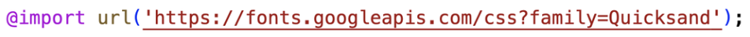

v True

x False

### 2. How will the "hello world" text be oriented?

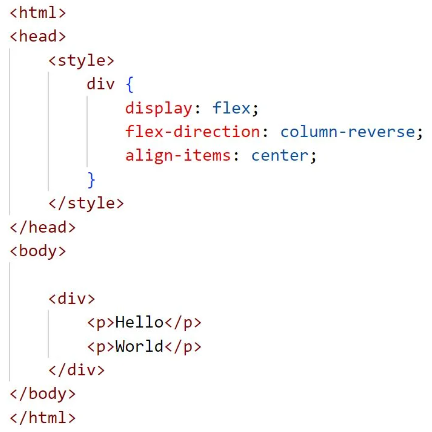

x One line saying Hello World

x Two lines, with the first line saying Hello and the second saying World

v Two lines, with the first line saying World and the second saying Hello

x One line saying World Hello

### 3. The CSS property padding:

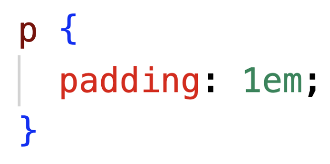

v Puts space around the content of selected elements

x Puts space around the border of selected elements

x Puts space around the margin of selected elements

x Puts space around the HTML document

### 4. Executing the following will output:

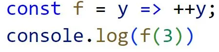

x 3

v 4

x undefined

x 2

### 5. In HTML, what does ``` <div> ``` do?

v Creates a division element

x Creates a dividend element

x Creates a divider element

x Creates a divinity element

### 6. What is the order of the CSS box model, starting from the outside going in?

x border, padding, margin, content

x content, margin, border, padding

x padding, margin, border, content

v margin, border, padding, content

### 7. What does the following code output?

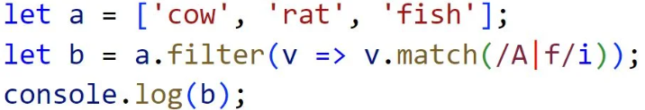

x ['cow', 'rat', fish']

x ['fish']

x ['cow', 'fish']

v ['rat', 'fish']

### 8. What does the following code output?

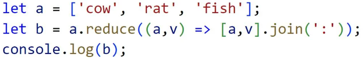

x cowratfish

x cow,rat,fish

v ```cow:rat:fish```

x ['cow', 'rat', 'fish']

### 9. What does the following code output?

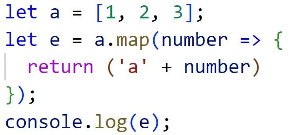

x [1, 2, 3]

x ['1', '2', '3']

v ['a1', 'a2', 'a3']

x [66, 67, 68]

### 10. What does the following code do?

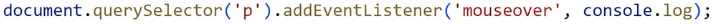

v Adds a mouseover event listener to a p element

x Adds a mouseover event listener to all p elements

x Adds a mouseover event listener to console.log events on a p element

x Adds p.mouseover events to the console.log

### 11. What is the HTML tag for an unordered list?

x ``` <ol> ```

v ``` <ul> ```

x ``` <dt> ```

x ``` <li> ```

### 12. Which of the following is not a valid JavaScript function?

v function f(x) = {}

x const f = (x) => {}

x function f(x) {}

x const f = function(x) {}

### 13. Which of the following is not a valid way to include JavaScript in HTML?

x ``` <script>1+1</script> ```

x ``` <script src='main.js' /> ```

x ``` <div onclick='1+1' /> ```

v ``` <javascript>1+1</javascript> ```

### 14. Which of the following is a valid JavaScript object?

v { n:1 }

x { n=1 }

x { "n"=1 }

x { "n"="1" }

### 15. What does the DOM textContent property do?

x Sets the Child HTML for an element

v Sets the child text for the an element

x Sets the content spacing for the element

x Sets the text content for the entire DOM

### 16. Which HTML will create a valid hyperlink?

x ``` <a src='https://c.com'>x</a> ```

x ``` <link src='https://c.com'>x</link> ```

v ``` <a href='https://c.com'>x</a> ```

x ``` <link href='https://c.com'>x</link> ```

### 17. Using CSS, how would you turn only the BYU text blue?

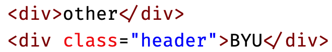

x div { color: blue; }

v div.header { color: blue; }

x div#header { color: blue; }

x header { color: blue; }

### 18. Which of the following is valid JSON?

x {'x':3}

x {"x":undefined}

x {x:3}

v {"x":3}

### 19. The following console command makes a script executable:

v chmod +x deploy.sh

x ls -la deploy.sh

x ssh deploy.sh

x sudo deploy.sh

### 20. Which of the following is a DNS subdomain?

x byu.edu

x edu

y c260.cs.byu.edu

x byu

### 21. To point to another DNS record, you should use the following DNS record type:

x A

v CNAME

x SOA

x TXT

### 22. What will the following output?


x taco burger shake salad noodles fries

v buger fries taco shake noodles

x burger fires taco shake salad noodles

x taco burger shake salad noodles salad fries

### 23. What will the following output?


x A D B C

y A D B

x A B D

x A B D C


## Final:

### 1. Port 80 is reserved for?

v HTTP

x HTTPS

x FTP

x SSH

### 2. HTTP status codes in the 300 range are for?

x Server errors

x Client errors

v Content redirects or caching

x Success

### 3. Which is NOT a standard HTTP header?

x Content-Type

x Host

x Cookie

v Language

### 4. Cookies allow:

v A server to store data on the client

x A client to store data on the server

x A client or server to store data on either

x For cache control

### 5. For the request [GET] /fav/george what is logged?

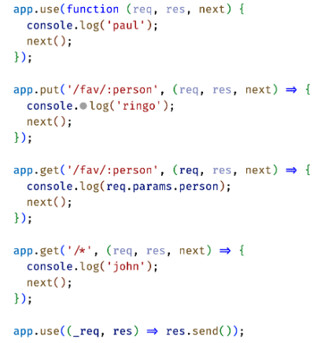

x paul ringo george john

x paul john

x paul ringo john

v paul george john

### 6. Which Express middleware will match this fetch request?

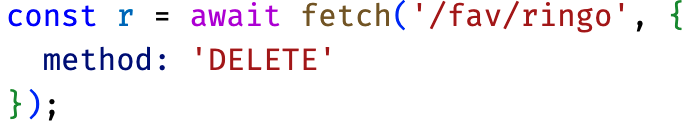

x app.get('/fav/:id', () => {})

x app.delete('/favorite/:id', () => {})

v app.delete(/fav\/(.*)/, () => {})

x app.get('/ringo', () => {})

### 7. What document matches this MongoDB query?

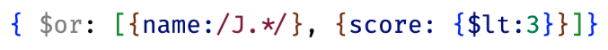

x { name: "harry", score: 5 }

x { name: "bud", score:3 }

x { name: john, score: 337 }

v { name: "Walke", score: -55 }

### 8. Why is hashing stored passwords important?

x It improves performance

x It makes it so a use can retrieve their password

v It improves security by making the password unreadable

x It validates how good the password is

### 9. Given the following code what will console.log print?

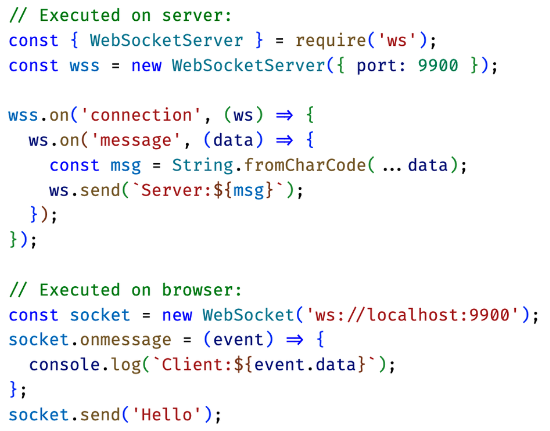

v Client:Server:Hello

x Hello:Client:Server

x Hello:Server:Client

x Server:Client:Hello

### 10. What value does WebSocket add to HTTP?

v It is peer to peer instead of client to server

x It runs using Token Ring

x It uses proof of work to demonstrate security

x It removes the need keep a connection open

### 11. What is NOT a purpose of JSX?

v To combine CSS, HTML, and JavaScript

x To inject your HTML into your JavaScript

x To componentize your HTML

x To allow for composability of your HTML

### 12. What will component A initially display?

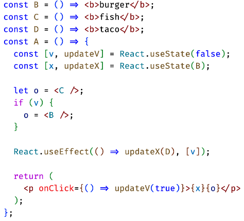

x burgerfish

v tacofish

x burgerburger

x tacoburger

### 13. What component will the URL `/burger` render?

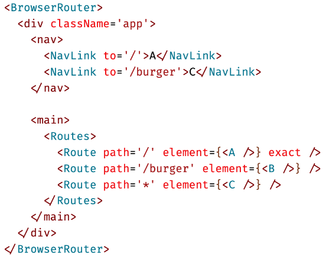

x A

v B

x C

x D

### 14. What does the command "NPM install ws" NOT do?

x Locks the version of the websocket package for your application

x Adds the websocket source code to the node_modules directory

v Adds template code for websockets to your JavaScript

x Adds a dependency to your package.json file

### 15. You can use fetch in front-end and back-end code.

v True

x False

### 16. Which of the following is NOT true about a Linux daemon?

x Executes independent of a user

x Starts when the computer is rebooted

x PM2 is an example of a daemon

v Cannot fork other processes`