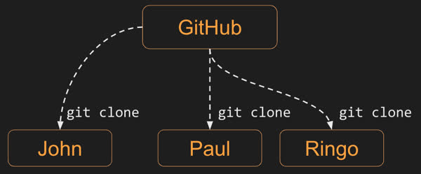
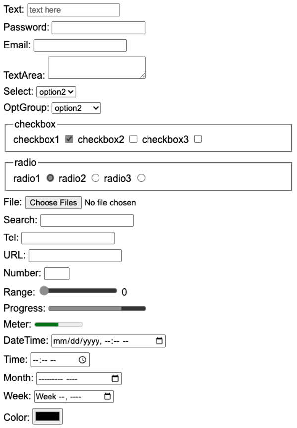
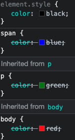
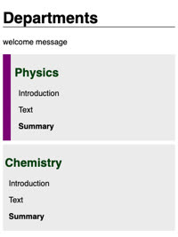
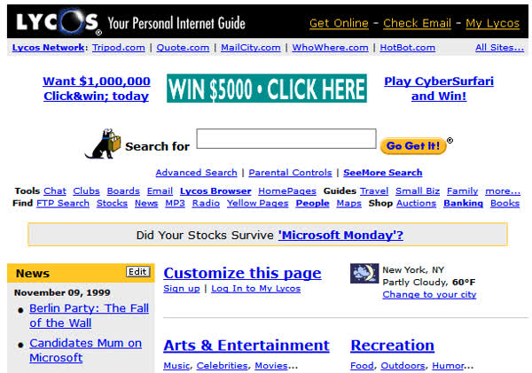
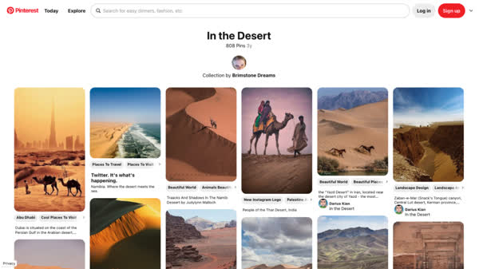
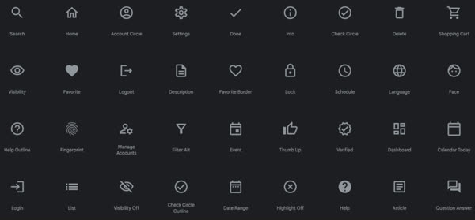
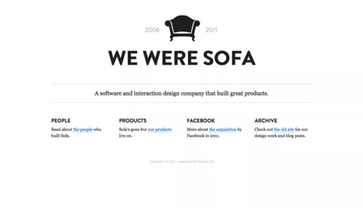
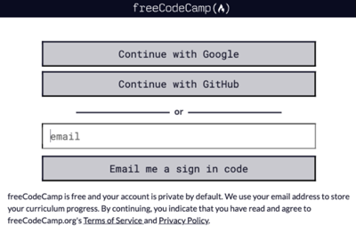

# README for Startup Web Application assignment, made by pair programmers Calvin Pugmire (C4LV1NPU6) and Tachiinii Ranger (rokketranger):


# Introduction to web programming


Web programming skills are among the most valuable ones that you can learn within the field of computer science. With web programming you can construct applications that are accessible on phones, tablets, desktops, kiosks, car dashboards, and even refrigerators. You can provide data and services to the entire planet. Every business and industry needs what web programming provides. Taking the time to acquire these skills, no matter what career you eventually pursue, will open doors to you that otherwise would be inaccessible.

Web programming skills evolve very quickly. There are some fundamental concepts that serve as a foundation for understanding, but the details of building modern web applications change constantly. For that reason, you should approach the subject of web programming, not to learn a specific technology, because that will already be out of date by the time you finish this instruction, but to learn how to learn web programming.

## Learning philosophy

The key to learning how to be an exceptional web programmer rests in you ability to continually improve in four areas.


1. **`Technology`** - You need to know the technology. The better you know it the better you will be able to leverage its abilities and apply it correctly. Knowing who the experts are, and discerning between meaningful technology and fads, driven by marketeers, allows you quickly find the valuable and avoid the distractions. Knowing technology will enable you to find the right tool for the job, maximize its performance, and automate its execution.
1. **`Art`** - Making a visually attractive web application requires artistic skills. However, there is just as much art in making them usable, efficient, and maintainable. Knowing how to organize and sculpt your code is incredibly artistic. Well designed systems are often referred to as beautiful or elegant, and a reflection of the creativity of their authors.
1. **`Social`** - Web applications are rarely created and used by one person. Usually you build an application for a large group of customers, and they almost always are created by a team of contributors with different backgrounds and roles. The ability for that team to work together and interact with customers is essential. These are social skills. The more skilled you are at talking, writing, reading, presenting, expressing body language, projecting a good appearance, and most importantly, listening, the more successful you will be.
1. **`Discovery`** - Having a mind that is always questioning will make all the difference. Simply doing the job is not enough. Wanting to know why the job is useful, searching for alternative directions, digging into the inner workings of a black box, and questioning accepted facts are all where progress is made. Cultivating a love for life long learning will take you from adequate to exceptional.

> “When hiring we look for the ability to collaborate, creativity, curiosity, and expertise”
>
> — Tim Cook, ([source](https://appleinsider.com/articles/22/10/03/if-you-want-to-work-for-apple-you-need-these-four-traits))

## Making mistakes

Making mistakes is a key component for learning. Recognizing and embracing the power of making mistakes will help you learn faster, and at a deeper level. Just decide that you are going to make mistakes and that is fine, even preferable. Many of the most important discoveries of all time were a result of making and understanding mistakes. No one learns to walk without falling down. With that said, you should acquire a framework where you can make mistakes while minimizing their ability to slow your progress. Things such as version repositories, notebooks, simulations, working with peers, automation, and reproducibility are all useful for safely making mistakes.

Whenever you approach something new, approach it with the attitude that you will learn by making mistakes. This will keep them from being a barrier to your progress.

> “To make no mistakes is not in the power of man; but from their errors and mistakes the wise and good learn wisdom for the future.”
>
> — Plutarch

## Welcome to `Start Up 260`!

The class should have the energy of a start up. We are on the cutting edge of technology. We are building applications to change the world. We even have no funding and will work long hours. Sounds like a start up to me. I will do my best to bring all my energy to our time together, and hope you will do likewise. Together, as a team, we are going to have a lot of fun.


# Demonstration

Before we start digging into creating web servers and talking about protocols let's give you a taste of what web programming technologies can do. In this example we display a card with a rotating border. When you click on the card the text changes.


You don't need to worry about the detail about how this all works. The point of this demonstration is just to give you a taste of the amazing things you can do with very little code. However, there are three technologies that make this work: HTML, CSS, and JavaScript.

The HTML looks like the following and basically has a simple card with text in it.

```html
<body>
  <div class="card" onclick="titleClick()">Click Here</div>
</body>
```

The JavaScript handles when you click on the card and changes the text.

```js
function titleClick() {
  document.querySelector('.card').textContent = 'Wow! Magic!';
}
```

The CSS is a bit more complex to cover in detail, but it basically handles the styling and animation. For example, the CSS for the card specifies the width and height, where it is positioned, what font to use, and what color it should be.

```css
.card {
  background: #191c29;
  width: var(--card-width);
  height: var(--card-height);
  padding: 3px;
  position: relative;
  border-radius: 6px;
  justify-content: center;
  align-items: center;
  text-align: center;
  display: flex;
  font-size: 3em;
  color: #7383d7;
  font-family: cursive;
  cursor: pointer;
}
```

The rotating border is animated with the following CSS that tells what colors to use and how to infinitely animate it between 0 and 360 degrees over 2.5 seconds.

```css
.card::before {
  background-image: linear-gradient(
    var(--rotate),
    #5ddcff,
    #3c67e3 43%,
    #4e00c2
  );
  animation: spin 2.5s linear infinite;
}

@keyframes spin {
  0% {
    --rotate: 0deg;
  }
  100% {
    --rotate: 360deg;
  }
}
```

If you would like to see the complete code listing and play with the code you can do this on [CodePen](https://codepen.io/leesjensen/pen/KKBwYKR). We will talk a lot about how this code like this works and what CodePen is later in the instruction.


# A brief history of web programming

Having a basic knowledge of the history of web programming helps you to understand why we have the assortment of technologies that you will be working with. There has been three distinct phases that make up this history.

1. The formation of the internet that supports the communication of web applications
1. The creation of HTML and HTTP that made it possible to shared hyperlinked documents (Web 1.0).
1. The creation of CSS and JavaScript that enabled interactive web applications (Web 2.0).

## The Internet

The essential first step to enabling what we now call web programming was the formation of a global communications network that was reliable and publicly available. This was made possible when the United States Department of Defense created the ARPANET as a means of sharing information between universities doing defense related research.


— ARPANET access points in the 1970s (**Source**: _Wikipedia_)

ARPANET was defined with the goal of withstanding a nuclear attack. This led to the implementation of a redundantly connected graph of computing devices. Within that network, two computers communicate by dynamically discovering a path to each other without the help of a single central authority.

In the 1980s the National Science Foundation continued the expansion of the network, and commercial enterprises began to make significant contributions. This eventually led to the Internet as we know it today, as the world went online as part of a massive explosion of consumer participation in the early 1990s. This was followed by another exponential increase in the 2000s as smart phones and appliances became common.

The management of the Internet is controlled by two major organizations. The Internet Engineering Task Force (IETF) defines the technical standards that specify how the physical network communicates. The Internet Corporation for Assigned Names and Numbers (ICANN) oversees both the Internet Protocol ([IP](https://en.wikipedia.org/wiki/Internet_Protocol)) address space, and the Domain Name System ([DNS](https://en.wikipedia.org/wiki/Domain_Name_System)). These two databases form the address book of the Internet. When the United States government transitioned control of these governing bodies to a global community of non-profit stake holders in 2016, the Internet became a worldwide asset free from any specific political control.

## Hypertext Markup Language (HTML)


> “I just had to take the hypertext idea and connect it to the TCP and DNS ideas and—ta-da!—the World Wide Web.”
>
> — Tim Berners-Lee, (**Source**: _Answers for Young People_)

Starting in 1980, Tim Berners-Lee was working at the research laboratory Cern. He was tasked with building a system that would allow researchers to share documents between remote academic institutions. Realizing that the ARPANET provided the necessary connectivity, he defined the protocols for document sharing that formed the underpinning of what would be termed the World Wide Web. Berners-Lee named the document format the HyperText Markup Language ([HTML](https://en.wikipedia.org/wiki/HTML)) based on inspiration from the digital publishing industry's Standard Generalized Markup Language (SGML). One of the key innovations of HTML was the idea that documents could be interconnected with what he termed hyperlinks to allow immediate access to related documents. In 1990 he put all the pieces together and built the world's first web server on his desktop NeXT computer. You can visit a reproduction of the first web site at [info.cern.ch](http://info.cern.ch/).


— First web server (**Source**: _Cern_)

Originally, HTML contained only 18 elements, or tags. The latest version of HTML has now grown to over 100. The initial explosion of elements was caused in part by browser vendors racing to create differentiating functionality in order to gain market share. Since 1996 the HTML specification has been controlled by the [W3C](https://www.w3.org/). The following is an example of a simple HTML document.

```html
<html>
  <body>
    <p>Hello world!</p>
  </body>
</html>
```

## HTTP and URL

While HTML was an incredible step forward, Berners-Lee also made other significant contributions. This included the definition of the HyperText Transfer Protocol ([HTTP](https://en.wikipedia.org/wiki/Hypertext_Transfer_Protocol)) and the Uniform Resource Locator ([URL](https://en.wikipedia.org/wiki/URL)). These two definitions specify how web documents are addressed and transmitted across the Internet. The following gives an example of a URL and HTTP request.

```http
http://info.cern.ch/hypertext/WWW/Helping.html
```

```http
GET /hypertext/WWW/Helping.html HTTP/1.1
Host: info.cern.ch
Accept: text/html
```

## Cascading Style Sheets (CSS)

Cascading Style Sheets ([CSS](https://en.wikipedia.org/wiki/CSS)) was first proposed in 1994 by Håkon Wium Lie, a contemporary of Berners-Lee at CERN, in order to give HTML documents visual styling independent of the content's structure. Before the introduction of CSS, HTML was going down the path of hard coding the visual appearance of the content with HTML elements. This would have resulted in a single visual style for the entire web that was completely defined by the browser vendors.


> “If we hadn’t developed CSS, we could have ended up with the web being a giant fax machine”
>
> — Håkon Wium Lie (**Source**: _Medium.com_)

By 1996 CSS became a standard and all the major browsers began to implement the functionality. Unfortunately, for the first years of CSS the same proprietary wars that plagued HTML also affected CSS. Much of the work on version 2.1 was to remove error and make all the features of CSS compatible. Here is a simple example of CSS that defines the white spacing, color, and shadowing of paragraph text.

```css
p {
  margin: 0;
  padding: 20px 0;
  color: #00539f;
  text-shadow: 3px 3px 1px black;
}
```

The ability of CSS to style a web page has increased significantly from its original implementation. With modern CSS a web programmer can import fonts, animate HTML elements, respond to user actions, and dynamically alter the entire layout of the page based on the size of a device and its orientation.

## JavaScript

In 1995 Netscape (the maker of the popular browser Navigator) decided to add the ability to script web pages. The initial implementation was led by Brendan Eich and given the name JavaScript. JavaScript turned the previously static web into an interactive experience where a web page could dynamically change based upon a user's interaction.


> “Always bet on JS”
>
> — Brendan Eich (**Source**: _brendaneich.github.io_)

In 1996 Netscape turned control of JavaScript over to ECMA International in an attempt to standardize the definition of the language. At that point JavaScript officially became know as ECMAScript, although it is still commonly referred to as JavaScript.

Here is an example of a simple JavaScript program that combines variables and prints out the result.

```js
const join = (...a) => {
  return a.reduce((accumulator, currentValue) => accumulator + currentValue);
};

console.log(join(1, 2));
console.log(join('hello', ' ', 'world', '!'));
```

The first decade of JavaScript was turbulent as each of the major browser vendors attempted to introduce new proprietary features in order to gain market share. Eventually in 2009 the major vendors agreed on the ECMAScript 5 standard and in 2015 ECMAScript 6 was released as the last major feature upgrade. Since then minor releases have taken the year of their release as their version number.

### JavaScript outside the browser

In 2009 Ryan Dahl created Node.js as the first successful application for deploying JavaScript outside of a browser. This changed the mindset of JavaScript as purely a browser technology to one that is leveraged across an entire technology stack.

Other important milestones in the history of JavaScript include the 2013 standardization of the common object notation JSON, a typed variant named TypeScript in 2012, and the introduction of numerous transpilers for converting other languages into compatible ECMAScript.

## What's next?

Looking forward, there are many exciting opportunities, as well as problems to solve. This includes addressing topics like application complexity, device diversity, internationalization, security, privacy, data ownership, environmental impact, global authorization identity, performance, and accessibility.

The only thing certain is that you have an opportunity to be a big part of it. One important lesson you can learn from these early pioneers, is that with web programming, a single person can change the world. I hope to see your face on this history page one day.


# Asking questions

📖 **Required reading**: [Stack Overflow - How to ask a good question](https://stackoverflow.com/help/how-to-ask)

## Contact information

- Use this [invitation link](https://discord.gg/x2WMN8y5XQ) to join class Discord server
- Consult this [document](https://docs.google.com/spreadsheets/d/1g1AMtgvyfSwMgp85QcwHuy0mVR-nN3bIGI6XNEJWB1U/edit?usp=sharing) to view the TA schedule
- In-person TAs are located in 1066 TMCB cube #4
- Professor Jensen office hours: 2264 TMCB, MWF 2:00-2:45 PM

| Who        | How                 | Where                  | When                            |
| ---------- | ------------------- | ---------------------- | ------------------------------- |
| TA         | Online or in person | Discord, TA Office     | TA Schedule                     |
| Instructor | Online or in person | Discord, Class, Office | Office Hours, Class Times       |
| Peers      | Online or in person | Discord, Class         | Depends on how friendly you are |

## Who to ask questions

You have a lot of resources to help you find answers. Here is the order that you should use them.

1. **Yourself** - You will learn more and find great satisfaction in answering your own question. When you feel like you need help with a question the first thing you should do is stop, take a breath, and think. Can you think of a way that you can answer this yourself? Can you break apart the problem into smaller pieces and find the answer by solving just a part of the question? Can you simplify the problem by ruling everything out except one variable and then answering that? You will be surprised how often, and quickly, you will find the answer.
1. **The Oracle** - Google is your friend. Think like a web page and use search terms that are unique to the web page you are hoping to find. Avoid terms that are common or used by different industries. With web programming, especially the technologies in this instruction, it will be very rare that you cannot find your answer with Google. The trick will be to make sure that the answer is credible, and that it is relevant. Answers for older, or newer, version of a technology will send you down a rabbit hole.
1. **Peers** - You have a whole class full of friends. We are all in this together. Get on Discord or talk to someone in class. More than likely there is someone with the same question as you. However, you should also **assume** that the question has already been asked. Use the search functionality of Discord. Make sure you are in the right channel. Look up at the previous discussions to see if the answer is already there. If all that fails then ask the question.
1. **TA** - These are smart people who have been where you are and want to help you succeed. Check the TA hours and contact them on Discord or in person. Respect their time by researching the question and come prepared to ask a clear question.
1. **Instructor** - The instructor is there for **you**. Asking for help in class, after class, or during office hours has a good chance of helping you find an answer. This is especially true if you have already tried the other methods. If the instructor can't help you then at least you will get to know each other better.

## How to ask questions

Learning how to ask questions might be the most important thing you learn. The better your question, the better your answer will be. Otherwise you end up with an answer like 42, and you do not even know what you were asking.

1. Clearly define and phrase your question. Sometimes this alone will give you an answer.
1. Use the clearly defined question to research for more information.
1. Give ample background. Assume the person you are asking is not looking at your computer, doesn't know what you are working on, and doesn't know what you know. Because they don't. Saying "It doesn't work" provides no value. It isn't even a question. Instead give the background in as much detail as possible. Explain what you tried already and what the result was.
1. Screen shots and captured output is helpful.
1. Give a reproduction path.
1. Use proper grammar and proof read your question.
1. Respond to feedback.
1. Give thanks even if you didn't find the help you were hoping for.

Here is a good template to follow when asking a question:

> When working on assignment `A`, I was successfully able to do `1`, `2`, and `3`, but then I did `B`, as instructed by `C`, and got the result `D`, with an error of `E`. I was expecting `F`. I thought maybe `G` or `H` might be the problem, but I saw that `J` already tried that without success as discussed here on `K`. Any help is greatly appreciated.

## Pay it forward

Always remember how it felt to receive help. Actively look for opportunities to help others in a kind respectful way. After all, that is the Gospel of Jesus Christ at its core. We are a team. We are better together.


# Discord

Peer learning provides a great opportunity to build social, team building, skills. Take advantage of any chance you get to work with other learners, in and out of, class. By discussing with your peers you learn more as you ask, and answer questions. Nothing completes the learning cycle better than teaching someone else.

We use the peer chat service [Discord](https://discord.com/) to ask and answer questions, as well as get online help from the TAs and Instructor.

Use the following invite to join our discussion server:

> [https://discord.gg/x2WMN8y5XQ](https://discord.gg/x2WMN8y5XQ)

From a desktop computer you can use Discord from your browser. From your phone you will need to install the application from the app store.

If you have never used Discord before you will need to create a free account. Take a minute to also set up your avatar.

## A brief tour

Discord is organized by servers and channels. If you used the above invite link you should already be subscribed to our server. Discord supports text (with the ability to share images) and video chat. You can also share your screen so that you can walk through problems with others.


### Questions

Our server contains the following channels for asking and answering questions.

- caddy
- github
- html
- css
- javascript
- node and express
- react
- mongo
- general

You should use the channel that is most appropriate for your discussion. Do not ask questions in multiple channels. Only use `general` if it really is not specific to another channel.

⚠ Make sure you review the instruction on [asking questions](../askingQuestions/askingQuestions.md) before you start asking questions.

### Online TAs

Under the voice channels you will see the TA chat rooms. When a TA is working (check the schedule for hours) you will see them here. Start by joining the `TA Help Queue`. When a TA becomes available they will move you into one of the breakout rooms.

## ☑ Assignment

Get on the Discord server. Pick a channel that sounds interesting and read through some discussions. Find a good web programming related meme add it to `text channels > memes`. When you are done submit what you found interesting with Discord and make a suggestion about how we could use it better to the Canvas assignment.


# Start up application

The focus of this course is to help you understand the technologies necessary to launch a web application start up. Towards this goal you will build your very own `start up` application. The actual application you build is entirely up to you, but it must successfully demonstrate the technologies we focus on.

The course is divided into distinct milestones. At each milestone you will evolve your start up application to take on more and more functionality. You start with a conceptual design document and then build a structural shell for the application using HTML. Next comes styling with CSS, interactivity with JavaScript, using third party web services, hosting your own web service, database connectivity for persistent storage, converting to a web framework with React, peer to peer communication with WebSockets, and finally a full mobile application using Progressing Web Application (PWA).

The Simon application is meant to give you an example for how to build your start up application. Use Simon as a chance to experiment with things you are considering doing with your start up application.

Immediately start thinking about what you would like to build. What you do for your start up application is completely up to you. So make it something that is interesting to you. It doesn't have to be complex. In fact **simple is usually better**. Dream big, but pick a very small minimal viable product for your start up application.

## Deliverables

You will turn in five deliverable versions of your start up application.

1. Design
1. HTML and CSS
1. JavaScript
1. Web service with database support
1. WebSocket and PWA

Grab a class peer and join forces using pair programming techniques. Your creative energy will help motivate each other when the nights get long.

You can change your project as the class progresses, but each milestone submission must includes all the functionality defined by the previous milestones. For that reason, it is suggested that you do not change your project, and carefully consider your project from the beginning, as the longer you go, the more expensive it will be to repeat your previous work.

## Ideas

Some ideas for possible projects include:

- Simple game like connect four or chess
- Peer chat
- Photo sharing
- Shared story authoring
- Book reviews
- Geo-location sharing
- News sharing
- Favorite website sharing
- Group voting
- Group calendaring
- Fitness tracking

Creativity is usually more important than complexity, and basic implementations of each of the course technologies is sufficient to demonstrate your mastery.

## Example

Here is an [example startup application](https://startup.cs260.click) that demonstrates the level of complexity that your application should represent.


## Demo day

At the end of class we will conduct a demo day for the best projects. Those selected for the demo day will be awarded additional credit for the exceptional work. The top presenters will be given the coveted Ghirardelli award.


# Let's play Simon


In 1978 Milton-Bradley, now Hasbro, released an electronic game named [Simon](<https://en.wikipedia.org/wiki/Simon_(game)>). It was cutting edge at the time since there were so few electronic games, and all the cool kids had one. I did not. So now I get my revenge.

We are going to build a peer to peer multiplayer web application modeled after Simon. We will build it together by adding new functionality every time we learn a new technology. The example version of code and production deployment for each iteration will be available to you. Your job will be to review the example and then build your version. If it looks very much like the example that is fine. Just make sure you are learning how it works. The less you copy/paste, and the more you write it yourself, the more you will learn. This is true, even if you are just looking at the example and typing most of what you see. The goal is to make you think about every line of code. Ask, "why is it done this way?" and "Is there a better way?". You will be surprised with the detailed understanding you will get. If your version looks very different than the example that the is also fine. Just make sure the major technology is represented.

Using what you learn from Simon you should be able to apply the same technologies to your start up application.

You can play the example production release [here](https://simon.cs260.click).

The following are the different technologies we are going to demonstrate with our Simon iterations.

| Iteration                         | Code                                                                 | Production release                              |
| --------------------------------- | -------------------------------------------------------------------- | ----------------------------------------------- |
| Simon HTML                        | [code](https://github.com/webprogramming260/simon-html#readme)       | [example](https://simon-html.cs260.click)       |
| Simon CSS                         | [code](https://github.com/webprogramming260/simon-css#readme)        | [example](https://simon-css.cs260.click)        |
| Simon JavaScript                  | [code](https://github.com/webprogramming260/simon-javascript#readme) | [example](https://simon-javascript.cs260.click) |
| Simon Service                     | [code](https://github.com/webprogramming260/simon-service#readme)    | [example](https://simon-service.cs260.click)    |
| Simon DB                          | [code](https://github.com/webprogramming260/simon-db#readme)         | [example](https://simon-db.cs260.click)         |
| Simon Login                       | [code](https://github.com/webprogramming260/simon-login#readme)      | [example](https://simon-login.cs260.click)      |
| Simon WebSocket                   | [code](https://github.com/webprogramming260/simon-websocket#readme)  | [example](https://simon-websocket.cs260.click)  |
| Simon React                       | [code](https://github.com/webprogramming260/simon-react#readme)      | [example](https://simon-react.cs260.click)      |
| Simon Progressive Web Application | [code](https://github.com/webprogramming260/simon-pwa#readme)        | [example](https://simon-pwa.cs260.click)        |


# Pair Programming

📖 **Required reading**: [MartinFowler.com](https://martinfowler.com/articles/on-pair-programming.html)

One of the objectives of this course is to improve your social skills. Working with peers is a great way to do that. You are encouraged to work on your start up application with a classmate as you practice what is known as `pair programming`. Pair programming gained popularity over twenty years ago and is commonly practiced in the industry.

> “for a … cost of about 15%, pair programming improves design quality, reduces defects, reduces staffing risk, enhances technical skills, improves team communications and is considered more enjoyable at statistically significant levels.”
>
> — Alistair Cockburn

It is important to understand that pair programming is not simply working together, and it is **definitely not** division of labour. It is not a time saving technique. Both parties must be present whenever work is done. Pair programming follows a very specific process where one member of the pair is the driver and the other is the navigator. The Navigator researches and outlines the overall design. The driver handles the keyboard and controls the tactical implementation details. After a reasonable milestone is achieved, or time period (~30 minutes) is exceeded, the driver and navigator switch. It is also important to celebrate milestones together. Cookies work great as motivational rewards.

If done correctly the pair will learn from each other and produce a much better result. If you want to try pair programming (and you are highly encourage to do so) then introduce yourself to others in the class and see if they are interested. You can also use the `pair-programming` channel on Discord to reach out and find a partner.

Once you find a partner read the [MartinFolwer.com article](https://martinfowler.com/articles/on-pair-programming.html) together so that you both have the same understanding and expectations.

⚠ Note: when you turn in an project that you build together as a pair, make sure you include all parties in your application footer. Your GitHub commit history should also represent commits from everyone associated with the creation of the assignment. That means you may need to change who is logged in if you are sharing a computer when you do your commits.


# Technology stack

The collection of technologies that you use to create or deliver you web application is called a technology stack. it is a stack because they usually layer one on top of each other. Generally at the top of the stack is your web framework. This includes possibilities such as Angular, React, Vue, or Svelte. The web framework then communicates with one or more web services to provide authentication, business, data, and persistent storage. The web service then uses backend services such as caching, database, logging, and monitoring.

Here is what our stack looks like. React for the web framework, talking to Caddy as the web server hosted on AWS, running web services with Node.js, and MongoDB as the database hosted on MongoDB Atlas.


The key with a tech stack is the realization that there is no one answer, and the answer continually evolves. Usually you will use what the company you work for has invested in. Migrating to a new stack is very expensive and error prone. So learning how to maximize your effectiveness, regardless of the technology, will make you very valuable. Being discontent because the latest new toy is not being used, will usually cause an unnecessary disruption to the team. However, if you can validate that a change in the tech stack with produce significant monetary, performance, or security gains, then you will greatly benefit your team.

## Complex technology stack

He is an example of a tech stack from a small web application company. You can see that there are dozens of technologies used to make the application work. When you build a commercial stack you want to be very careful about the pieces you choose. Dependability, support, scalability, performance, and security are all important factors. You also want to consider development productivity factors such as documentation, ease of use, common acceptance, community support, build times, and testing integration.


# The Console

📖 **Required reading**: [MDN Command line crash course](https://developer.mozilla.org/en-US/docs/Learn/Tools_and_testing/Understanding_client-side_tools/Command_line)

Before the creation of graphical user interfaces, all computing systems were simple console environments consisting as of a prompt for inputting a command and the display of the command output. All of the original programming tools ran as console application. The console tradition is still actively used by professional developers and most programming tools execute within a console window.

Also know as the command line, shell, or terminal, the console window is an essential web development tool. The console provides access to the file system and allows for the execution of command line applications.

There are many console applications that you can chose from. All operating systems come with a default console, but you will probably want to install one in order to get the best experience. Here is an example of [Warp](https://www.warp.dev/) running on a Mac.


## Make sure you have a console application

In order for you to successfully use the console for web programming it must be [POSIX](https://en.wikipedia.org/wiki/POSIX) compliant. POSIX compliance means that it supports a standard set of console commands. Both Mac and Linix support POSIX. That means any necessary console commands will work on those operating systems. On Microsoft Windows, you can get a reasonable approximation of a POSIX compliant console by installing [Git Bash](https://git-scm.com/download/win).

⚠ If you are using Windows and do not already have a POSIX compliant console application installed, then install [Git Bash](https://git-scm.com/download/win) before continuing. When installing use all the default settings.

Open your console application and make sure you can run a simple POSIX compliant command such as `printf hello`. If this displays hello then you are on the right track.

## Viewing the file system

One of the primary purposes of a console application is to view the files on the computer. The files on a computer are organized into a tree structure of nodes called directories. At any given point in time your console is located at one of the directories in the file system. You can see which directory you are in with the `pwd` (present working directory) command.

```sh
➜  pwd

/Users/student/byu//webprogramming260
```

You can list all of the files in the directory with `ls` (list files). Most command line applications take parameters that are specified after you type the application name. For example, `ls` can list all files (even hidden ones) in a long format if you provide the parameter `-la`.

```sh
➜ ls -la

total 16
-rw-r--r--  1 lee  staff   1.0K Nov 19 08:47 LICENSE
-rw-r--r--  1 lee  staff    82B Nov 19 08:47 README.md
drwxr-xr-x  4 lee  staff   128B Nov 19 08:48 profile
drwxr-xr-x  4 lee  staff   128B Nov 19 08:47 react
```

## Executing commands

The other primary purpose of the console is to execute commands. You already did this in the previous section when you executed commands for working with the file system. However, console commands can perform many different operations. Here are some basic commands that you show experiment with.

- **echo** - Output the parameters of the command
- **cd** - Change directory
- **mkdir** - Make directory
- **rmdir** - Remove directory
- **rm** - Remove file(s)
- **mv** - Move file(s)
- **cp** - Copy files
- **ls** - List files
- **curl** - Command line client URL browser
- **grep** - Regular expression search
- **find** - Find files
- **top** - View running processes with CPU and memory usage
- **df** - View disk statistics
- **cat** - Output the contents of a file
- **less** - Interactively output the contents of a file
- **wc** - Count the words in a file
- **ps** - View the currently running processes
- **kill** - Kill a currently running process
- **sudo** - Execute a command as a super user (admin)
- **ssh** - Create a secure shell on a remote computer
- **scp** - Securely copy files to a remote computer
- **history** - Show the history of commands
- **ping** - Check if a website is up
- **tracert** - Trace the connections to a website
- **dig** - Show the DNS information for a domain
- **man** - Look up a command in the manual

You can also chain the input and output of commands using special characters

- `|` - Take the output from the command on the left and _pipe_, or pass, it to the command on the right
- `>` - Redirect output to a file. Appends if the file exists
- `>>` - Redirect output to a file. Overwrites the file if it exists

For example, you can list the files in a directory, pipe it into `grep` to search for files created in Nov, and then pipe that into `wc` to count the number of files found with a date of Nov.

```
ls -l | grep ' Nov ' | wc -l
```

There are also keystrokes that have special meaning in the console.

- `CTRL-R` - Use type ahead to find previous commands
- `CTRL-C` - Kill the currently running command

## ☑ Assignment

Experiment with console commands. Open a console window and create a junk directory that you can play with by executing the command `mkdir junk` (make directory). Then execute the command `cd junk` to change into that directory. Try the following sequence of commands:

```sh
mkdir junk
cd junk
pwd
ls
ls -la
ls ../
echo "hello world" > test.txt
ls -l
cat test.txt
cp test.txt other.txt
ls
cat test.txt >> other.txt
less other.txt # press `q` to exit less
rm test.txt
ls
cd ..
ls
rm -rf junk
ls
```

The better you get at working with the console the more efficient your programming will be. When you are done experimenting, submit a description of something you found interesting to the Canvas assignment.


# Editors

The code editor is the workspace of a web application developer. Deeply learning an editor that makes you efficient and flexible will pay significant dividends in your ability to deliver quality work and greatly reduce frustration. A good editor should feel like a friend. If you are constantly arguing with your editor, then perhaps you need a relationship adjustment.

For your work with this instruction I would highly suggest you use two editors. The first one, Visual Studio Code, is your main editor for daily coding activities. The second one, is VI. You will use VI when you are shelled into your production environment and need a simple, but powerful, console based editor for quickly editing text files.

## Visual Studio Code


**Website**: [VS Code](https://code.visualstudio.com/)

Created by Microsoft, Visual Studio Code (VS Code), is free and supported by a large community of open source developers. The [2021 Stack Overflow](https://insights.stackoverflow.com/survey/2021#section-most-popular-technologies-integrated-development-environment) developer survey put VS Code as the number one choice for 71% of professional developers.


VS Code is both simple to use, incredibly flexible, and powerful. At its most basic level it represents files in a given directory on the left and a space on the right for editing files. VS Code then adds excellent git support, auto-formatting, auto-suggestions, and debugging support for JavaScript right out of the box. You can easily install a language server extension most major programming languages that provide coding, building, and debugging support. From there you have your choice of thousands of extensions to add whatever functionality you would like. This includes extensions such as an auto-reloading HTTP server for hosting your project code locally in a browser, an image editor, a spell checker, hex editor, testing frameworks, linters, code prettier, or even docker container management to compartmentalize your development of different projects.


So unless you are already a master of some other development environment, it is highly suggested you go and [install VS Code right now](https://code.visualstudio.com/).

### Live Server extension

The VS Code Live Server extension is great for building web applications. You are going to build a lot of HTML, CSS, and JavaScript. You can do much of this on CodePen, but for your projects you are going to be working in your development environment. This means you will have a GitHub repository cloned to your personal development computer. When you open VS Code to the directory where your repository is located you can start creating HTML, CSS, and JavaScript, but when you want to see your code working you need to actually run a web server to deliver your files to the browser. That is where the Live Server extension comes in handy. With the press of the `Go Live` button on the bottom right status bar, your entire project directory is served up through your browser. Additionally, if you make any changes to a file the browser will automatically be updated.

To install the Live Server extension, open up VS Code and follow these three steps.


Congratulations! You have joined the 28 million other users already enjoying this extension. You can test it by opening VS Code, creating a new file named `index.html` and pasting `<h1>hello<h1>` into the file. Then save the file and press the `Go Live` button. This will launch your browser and display the rendered `index.html` file. If you make changes to your file and save it, the browser will automatically be updated to display your changes.

### GitLens

The basic support that VS Code offers for working with `git` is sufficient for most tasks, but if you really want to unleash the power of git, consider installing the `GitLens` extension. It makes reviewing the commit history, stashing, merging, and comparing so much easier. With over 18 million users, you might enjoy joining the party.

## VI


VI, or technically vim, is one of the oldest console editors. It is extremely powerful and some incredibly talented software engineers use it as their sole development environment. The reason why you should learn VI is that it is available on every Linux server and can do anything that you will need. With that said it has a bit of an initial learning curve. However, once you have memorized a few basic commands you will be able to get around easily. If you take some time to really learn VI, you might find a new essential tool.

There are lots of tutorials for VI here are a few based on how you like to learn.

- [Textual](https://www.linuxfoundation.org/blog/blog/classic-sysadmin-vim-101-a-beginners-guide-to-vim)
- [Video](https://youtu.be/RZ4p-saaQkc)
- [Interactive](https://www.openvim.com/)
- [Game](https://vim-adventures.com/)
- `Console` - Type `vimtutor` in your console

Additionally, the following instruction walk you through the basics and give you a few important commands to get started.

To use VI, open your console and change directory to one that holds some code you want to work on. For example, if you wanted to edit `index.html` you would type type:

```sh
vi index.html
```


What you will immediately notice is that there is no menu bar or navigation aids. Instead, VI works entirely by keyboard commands. There are two modes in VI, command mode and insert mode. When you open VI, you are in command mode and all of the command keystrokes will work. To edit a document, use the command `i` to enter insert mode. Now your keystrokes will modify the document. To exit insert mode and type commands again, press `ESC`.

The following short list of commands should allow you to do most of what you will ever want to do.

| keystroke | meaning                                                                                                                                        |
| --------- | ---------------------------------------------------------------------------------------------------------------------------------------------- |
| `:h`      | help                                                                                                                                           |
| `i`       | enter insert mode. This will allow you to type and delete text. Use ESC to exit insert mode. No other commands will work while in insert mode. |
| `u`       | undo                                                                                                                                           |
| `CTRL-r`  | redo                                                                                                                                           |
| `gg`      | go to beginning of file                                                                                                                        |
| `G`       | go to end of file                                                                                                                              |
| `/`       | search for text that you type after /                                                                                                          |
| `n`       | next search match                                                                                                                              |
| `N`       | previous search match                                                                                                                          |
| `v`       | visually select text                                                                                                                           |
| `y`       | yank or copy selected text to clipboard                                                                                                        |
| `p`       | paste clipboard                                                                                                                                |
| `CTRL-wv` | Split window vertically                                                                                                                        |
| `CTRL-ww` | Toggle windows                                                                                                                                 |
| `CTRL-wq` | Close current window                                                                                                                           |
| `:e`      | Open a file. Type ahead available. If you open a directory you can navigate it in the window                                                   |
| `:w`      | write file (save)                                                                                                                              |
| `:q`      | quit. Use `:q!` to exit without saving                                                                                                         |

The great thing about learning these commands is that you will find that they work with a lot of the POSIX console programs. For example, with the file viewing utility `less` you can use `G` and `gg` to jump to the top and bottom of a file. Here is a [cheat sheet](https://vim.rtorr.com/) if you want to see all the commands.

### VI humor

> How do you generate a random string?
>
> Put a web developer in front of VI and tell them to save & exit.


# Git


Incredibly [Linus Torvalds](https://en.wikipedia.org/wiki/Linus_Torvalds), the creator of Linux, was fed up with the proprietary version control software that he was using to track the code for the Linux kernel and so over a weekend he built Git, the world's most popular version control system.


> “Talk is cheap. Show me the code.”
>
> — Linus Torvalds

## Installing Git

Before we can talk about Git you need to make sure it is installed in your development environment. Open a console and type `git --version`.

```sh
➜  git --version
git version 2.32.0 (Apple Git-132)
```

If you do not see something like that, then you need to follow these [instructions](https://git-scm.com/book/en/v2/Getting-Started-Installing-Git) to install Git.

## What is Git?

Git provides two valuable functions. First, it allows you to track versions of files in a directory. Second, it allows you to clone all of those versions to a different location, usually to a different computer. We are going to focus on tracking versions in this instruction and cover cloning repositories when we talk later about GitHub.

You can track file versions of any files in a directory by initializing Git for that directory. You can do this right now by creating a new directory in a console window and initializing it as a Git repository.

```sh
➜  mkdir playingWithGit
➜  cd playingWithGit
➜  git init
```

If you list all files in the directory you will see that you now have a hidden directory named `.git`.

```sh
➜  ls -la
total 0
drwxr-xr-x   3 lee  staff    96 Dec  1 22:59 .
drwxr-xr-x+ 54 lee  staff  1728 Dec  1 23:00 ..
drwxr-xr-x   9 lee  staff   288 Dec  1 22:59 .git
```

The `.git` directory is where all of the versions get stored. Now use the `echo` command to create a file so that we can see how versioning works. After creating the new file, use `git status` to tell you what git is doing.

```sh
➜ echo hello world > hello.txt
➜ git status

On branch master
No commits yet
Untracked files:
  (use "git add <file>..." to include in what will be committed)
	hello.txt

nothing added to commit but untracked files present (use "git add" to track)
```

Git status tells you that it detects a new file named `hello.txt`, but it isn't currently tracking versions for that file. To begin tracking versions you need to add it. Usually you track all files in a repository directory and so you can tell Git to track everything that it doesn't know about with `git add .`. Follow this with another call to `git status`.

```sh
➜  git add .
➜  git status

On branch master
No commits yet
Changes to be committed:
  (use "git rm --cached <file>..." to unstage)
	new file:   hello.txt
```

Now Git tells us that it has `staged` the file `hello.txt` and it is ready to be committed as a version in the repository. We commit a version with the `commit` command. We always want to have a meaningful comment about the version we are committing and so we use the `-m` parameter to provide a message that will live with the version. Follow this with another call to `git status`.

```sh
➜  git commit -m "initial draft"
[master (root-commit) d43b07b] initial draft
 1 file changed, 1 insertion(+)
 create mode 100644 hello.txt

➜  git status
On branch master
nothing to commit, working tree clean
```

Congratulations! You have just committed your first file to a Git repository. It is important to note that we were only working with a single file in this example. However, a commit can represent multiple files. You just need to add them all before you execute the commit. Also, note that the point of the stage (add) step, is so that you can commit some files while still leaving other modified file out of the commit.

Let's make an edit to our file and commit it again. This time we will tell Git that we want to add all the tracked modified files to our commit by including the `-a` parameter along with our message parameter.

```sh
➜  echo goodbye world > hello.txt

➜  git commit -am "changed greeting to reflect the present mood"

[master e65f983] changed greeting to reflect the present mood
 1 file changed, 1 insertion(+), 1 deletion(-)
```

Now that we have a couple versions in our repository we can view the versions with the `git log` command.

```sh
➜  git log

commit e65f9833ca8ee366d0d9c1676a91b1a977dab441 (HEAD -> master)
Author: Lee
Date:   Thu Dec 1 23:32:22 2022 -0700

    changed greeting to reflect the present mood

commit d43b07b8890f52defb31507211ba78785bf6dccf
Author: Lee
Date:   Thu Dec 1 23:29:11 2022 -0700

    initial draft
```

This shows both commits with the associated comments.

## Commit SHA

Every commit has a unique identifier that is generated by hashing the file along with the timestamp using the SHA hashing algorithm. You can always refer to a specific commit in your version history by using its SHA. For example, if we want to temporarily switch back to a previous version to see what it contains we can use the `checkout` command. You only need to provide the first few characters of the SHA.

```sh
➜  git checkout d43b07b8890f

Note: switching to 'd43b07b8890f'.
HEAD is now at d43b07b initial draft

➜  cat hello.txt
hello world
```

The above output omits a big message saying that you are no longer looking at the latest version, but the important thing is that you can see that we are now looking at our old version. To get back to the top of the version chain, use the `checkout` command and reference the branch name, which is by default `master`.

```sh
➜  git checkout master
Previous HEAD position was d43b07b initial draft
Switched to branch 'master'

➜  cat hello.txt
goodbye world
```

Now we are back to our latest version.

The following diagram shows how your commits move from your working directory, to staging them for a commit, and then committing them to a repository.


A commit is a full snapshot of what was staged from your directory at the time of the commit. That means all of the files contained in the commit were reverted when you executed the checkout command. Since we only had one file in our commit, it looks like we are only flipping that file around, but basically you can think of it as a time machine for the entire directory.

## Diff

Most of the time you don't want to reverse back to an earlier commit. Instead you just want to compare the differences between commits. We can do that with the `diff` command. You can specify two SHAs that you would like to compare, or you can use the HEAD variable which points to the top of the commit change. To refer to earlier commits you just add `~` and the numerical distance from head that you want to reference. In this case we will compare HEAD and HEAD~1.

```sh
➜  git diff HEAD HEAD~1
```

```diff
diff --git a/hello.txt b/hello.txt
index 3b18e51..eeee2af 100644
--- a/hello.txt
+++ b/hello.txt
@@ -1 +1 @@
-hello world
+goodbye world
```

You can see that we made a change to `hello.txt` by removing `hello world` and adding `goodbye world`.

## Branches

Git supports the ability to branch your code. This allows you to work on variations of the code while still allowing progress on the main branch. For example, if you wanted to work on a new feature named `A` without interrupting work on the master branch, you would use the `git branch A` command and start working on the `A` branch with the `git checkout A` command. Now commits can be down to both the master and the `A` branch. When you want to combine the work done on both branches you us checkout the master branch and execute `git merge A`. If you decide you want to abandon the new feature then you just don't ever merge it back into the master branch.

Here is a demonstration of this working on the visualization tool provided by [git-school.github.io](https://git-school.github.io/visualizing-git/).


## Commit often

You will be required to have at least 4 commits for each project that you submit in order to get full credit. Commonly, this will be an initial commit that contains empty project files, followed by commits at each functional milestone, and then a final commit for the working project. Committing your code often is an important practice for you to develop. It protects you from losing your work, allows access from anywhere, makes it so you can quickly share changes, reduces conflicts with your peers, and enables you to efficiently explore different possibilities. This also enables others to review the progression of your development efforts in order to prove the originality of your work.

Remember to make meaningful commit messages that describe the **what** and **why** of the changes made. Here is a [good post](https://www.freecodecamp.org/news/how-to-write-better-git-commit-messages/) on how make meaningful commit messages.

## Binary files

You can store any type of file in Git, but be aware that if you store large binary files, such as images or videos, you are storing a copy of that file each time you make a change to it. For example, suppose you use Git to track the changes you make to a video production project. Every time you save a change to your 10 GB video file you store a complete copy of the file. That means 10 commits of the video file will store 100 GB of data in your repository.

## VS Code and Git

Knowing how to use Git from the console is a very valuable skill. Git offers a wide variety of functionality such as creating branches of the repository, temporarily stashing changes, and cloning repositories to other machines.

However, by using a tool like VS Code you can hide all of the complexity of the command line and use a visual interface instead.

Here we see VS Code, with the GitLens extension installed, looking at the directory we have been working in. On the left you see all the commits we have previously created. We can edit our `hello.txt` file and VS Code will automatically detect the change and set it up for us to commit. VS Code will even put a marking on the left side of the edited text to show us what line we have changed. We can click on the staged file, in the commit area, and see the differences before we commit. Since they look good, we add a comment, and press commit. The new commit immediately shows up in our list of commits. We can use the visual diff again to click through all of the previous versions.


Underneath the covers, the GitLens extension is running Git commands just like we did on the command line, but using a visual tool makes working with versions much easier. Take some time and play with adding files, modifying them, committing, and diffing. You want to get to the point where this is second nature so that you can easily experiment and make mistakes, knowing that with Git, you can always easily recover.


# GitHub


📖 **Required reading**:

- [GitHub create a repo](https://docs.github.com/en/get-started/quickstart/create-a-repo)
- [GitHub cloning a repo](https://docs.github.com/en/repositories/creating-and-managing-repositories/cloning-a-repository)
- [GitHub personal access tokens](https://docs.github.com/en/authentication/keeping-your-account-and-data-secure/creating-a-personal-access-token)

When we introduced `Git`, we said that Git provides two things, 1) Version tracking in a repository, and 2) the ability to clone a copy of the repository to a different location. You can clone repositories between computers used by your development team, but the management of cloning repositories is much easier when you use a cloud based service such as `GitHub`.

GitHub was launched in 2008 by a small group of developers that wanted to make code collaboration easy. GitHub was acquired by Microsoft in 2018 for $7.5 billion. Since its beginning as a simple web application for cloning and storing Git repositories, GitHub has added functionality for hosting websites, supporting community pull requests, tracking issues, hosting codespaces, running continuous deployment processes, managing projects, and even AI driven code generation.

We are going to use GitHub for three things.

1. Hosting all of this instruction. Because it is hosted on GitHub you can generate pull requests when you see things that need improvement.
1. Publicly hosting your project repositories. This creates a backup copy of your code, demonstrates your progress with your commit history, allows for reviews of your code, and makes it so you can collaborate with your peers.
1. Keeping notes about what you have learned and things you want to remember.

## Creating a GitHub account

If you do not already have a GitHub account then go and [create one now](https://github.com). GitHub provides a free version of their services that will more than cover your usage in this class. Chances are that once you start using GitHub you will use this account for many years to come, both for personal and professional projects.

## Creating and cloning a repository

While you can create a repository in your development environment using `git init` and then connect it to an upstream repository on GitHub, it is always easier to create your repository first on GitHub and then clone it to your development environment. That way your repositories are automatically linked to each other.

To create a repository in GitHub, log into your account, select the `Repositories` tab, and press `New repository`. You then specify a unique repository name, give a description, indicate that you want it to be public, add a default README.md file, and choose a license.


Every repository in GitHub has a unique URL assigned to it. Assuming the repository is public, anyone with the URL can clone it to their development environment. A repository clone is an exact copy of the repository including all of the commits, comments, and SHAs. It also configures the clone to know what the remote source is so that you can use Git commands to keep them in sync as changes are made.



You clone a repository by providing the GitHub repository's URL as a parameter to the `git clone` command from in a console window. You can get a copy of the URL from the repository's GitHub page and clicking on the green `Code` button, and then clicking on the copy button next to the HTTPS url.


When you clone a repository it is placed in a subdirectory named with the name of the repository. So make sure you are in the directory where you keep all of your source repositories before you run the command.

```sh
➜  git clone https://github.com/webprogramming260/startup-example.git

Cloning into 'startup-example'...
remote: Total 4 (delta 0), reused 0 (delta 0), pack-reused 0
Receiving objects: 100% (4/4), done.

➜  cd startup-example
```

## Making changes

You can now make changes to the files in the repository and commit those changes. As you create new commits you want to push those changes back up to the GitHub clone of the repository so that the repositories are are in sync with each other. This is done with the `push` Git command. Once you have pushed the new commits then your peers who have cloned the repository can pull the commits down using the `pull` Git command.


The following demonstrates console commands for making a change to the README.md file, committing it, and then pushing it up to GitHub. Of course you can also do this using the Git interface of VS Code.

```sh
➜  printf "\nChange from my development environment!\n" >> README.md

➜  git commit -am "update(notes) thoughts about start up applications"

➜  git push
```

This is the pattern that you want to make a reflexive part of your development process.

1. Pull the repository's latest changes from GitHub (`git pull`)
1. Make changes to the code
1. Commit the changes (`git commit`)
1. Push the changes to GitHub (`git push`)

⚠ Note: The first time you make a push request to a repository Git will ask you how you want to identify yourself and what credential (e.g. password) to use in order to authenticate with GitHub. You will need to create a [Personal Access Token](https://docs.github.com/en/authentication/keeping-your-account-and-data-secure/creating-a-personal-access-token) and provide that as your password.

After pushing changes GitHub, you then view the changes on GitHub with your browser. In the example above, you would see the changes to the `README.md` file. You can also edit and commit changes directly from GitHub. When looking at a repository file on GitHub you will see a little pencil in the top right hand corner of the file. If you press that you will enter edit mode. You use that to modify the file and then commit the changes with an appropriate comment.


Now that there is a commit that GitHub has that you do not have in your development environment. If we run the `fetch` Git command, you will get the latest information about the changes on GitHub without actually changing your local repository. We then run the `status` Git command to see the differences between the clones and see that we are missing a commit. You can pull it down using the `pull` Git command. You can also use the Git functionality in VS Code to view the status and sync up your repository.

```sh
➜  git fetch
➜  git status
Your branch is behind 'origin/main' by 1 commit, and can be fast-forwarded.
  (use "git pull" to update your local branch)

➜  git pull
Updating d13a9ce..cafe81a
Fast-forward
 README.md | 4 +++-
 1 file changed, 3 insertions(+), 1 deletion(-)
```

After running the pull command, your development clone and the GitHub clone are now the same.

## Handling merge conflicts

By pushing and pulling often, everyone keeps an up to date copy of the repository. This is important so that you don't run into merging problems caused by two peers modifying the exact same code. Merging only becomes something you have to deal with when two people modify the exact same line of code. However, when you have two peers working together you are always going to have a merge conflict at some point in time and so let's discuss how to handle this.

We can simulate a merge conflict by editing a line in a file and committing the file in your development environment, and before pushing that change, modifying the same line using GitHub. Now, run `fetch` and `status` again in your console.

```sh
➜  git fetch
➜  git status
Your branch and 'origin/main' have diverged,
and have 1 and 1 different commits each, respectively.
  (use "git pull" to merge the remote branch into yours)
```

This shows that the cloned repositories have diverged from each other. Normally this is fine and we can just push and pull the different commits, but if we do that this time we will get an error because the exact same line was changed in the two different commits.

```sh
➜  git pull

Auto-merging README.md
CONFLICT (content): Merge conflict in README.md
Automatic merge failed; fix conflicts and then commit the result.
```

We now need to resolve the merge conflict that it says has happened with our `README.md` file. If you are using VS Code with the GitLens extension installed it will visually walk you through this process. However, so you can understand what is going on, we will do this using the console. The first step is to open up `README.md` in an editor. You will see that git has injected lines that highlight where the conflict is. Both your local change and the change made on GitHub are included.

```diff
An example start up application

Change from my development environment!

Change from GitHub

<<<<<<< HEAD
Conflict change made in development environment
=======
Conflict change made in GitHub
>>>>>>> b9f4c53c91eff509993d7291e60148f903827de0
```

We resolve the conflict by modifying the file to remove the textual conflict delimiters and modifying the file to keep the changes we want. When we are done editing, our file contains what we want from both commits.

```md
# startup-example

An example start up application

Change from my development environment and from GitHub
```

Now that the conflict is resolved we commit our resolution and push up the result.

```sh
➜  git commit -am "merge(notes) combined both edits"
➜  git push
```

If you go look at the file again on GitHub you will see the additional commit in the history and the result of our merge in the file content.

## Keeping notes

Keeping notes of what you have learned and things that you want to remember is an essential step for accelerating your web programming skills. GitHub supports the inclusion of a file with the special name `README.md` in the root of your repository. This file uses `Markdown` syntax. If you have not used Markdown before, then take some time to [learn how to use it](https://docs.github.com/en/get-started/writing-on-github/getting-started-with-writing-and-formatting-on-github/basic-writing-and-formatting-syntax). For this course you will use your start up application's README.md file and your website's README.md to keep notes.

## Pull requests

GitHub allows you to create a fork of any repository on GitHub. You just push the `fork` button from the repository's GitHub page. This will copy the repository to your GitHub account. This is similar to cloning a repository to your development environment, but it clones to GitHub instead. You can then make modifications to the repository and push the changes as a pull request. This notifies the original repository's owner that a request is being made to enhance the original repository. The owner can review your changes and if appropriate commit the changes into the original. This is how open source communities manage development from a volunteer group of global developers.

In this class, if you notice something in the instruction that needs to be enhanced, feel free to fork the repo, and make a pull request. This will give you experience with this practice and improve the instruction for others at the same time. Plus your name will be include as a contributor. How cool is that!

# ☑ Assignment

Do the following steps to set up your `Start up application repository` in GitHub and clone it to your development environment.

1. Create a GitHub account if you do not already have one.
1. Create a repository, named `startup`, for your start up application. Your project must be public. Select the option for a default README.md file. This is where you will also keep all of your notes for things that you learn and want to remember.
1. Clone the repository to your development environment, by getting the repository's URL, and using `git clone`.
1. Open up the repository directory in VS Code and modify the README.md file.
1. Use the Git functionality of VS Code to commit your changes and push them to GitHub.
1. In GitHub modify your README.md file and commit the changes.
1. In VS Code pull down and review the changes.
1. Make another change to the README.md file on GitHub and commit the change.
1. Before you pull the changes to your development environment, change the same line in the README.md file and commit the change.
1. Attempt to pull the GitHub changes to your development environment. Note and resolve the merge conflict. Commit the merged changes. Push the merge commit.
1. On GitHub observe the resolved merge.
1. Make your first notes in your README.md file about what you learned from this assignment. Commit and push your notes to GitHub.

When you are done, provide the URL of your GitHub start up repository, along with a comment about something you found interesting, to the Canvas assignment.


# 1/23/23 (C4LV1NPU6):

This is the directory for the startup web application.

Access in VS code has been achieved.
Access in GitHub has been achieved.
Merge change part #1.
Merge change part #2.

GitHub notes: GitHub is a great way to backup my code. Pulling and pushing changes seem to be limited to the console on my computer. The console seems to be the best way for me to deal with the backup/syncing aspect of coding in this class.


# Development and production environments

When working on a commercial web application, it is critical to separate where you `develop` your application, from where the `production` release of your application is made publicly available. Often times there are more environments than this, such as staging, internal testing, and external testing environments. If your company is seeking third party security certification (such as SOC2 compliance) they will require that these environments are strictly separated from each other. A developer will not have access to the production environment in order to prevent a developer from nefariously manipulating an entire company asset. Instead automated integration processes, called continuously integration (`CI`) processes, checkout the application code, lint it, build it, test it, stage it, test it more, and then finally, if everything checks out, pushes the application to the production environment, and notifies the different departments in the company of the release.


For our work, you will use and manage both your `development` (your personal computer) and `production` (your AWS server) environments. However, you should never consider your production environment as a place to develop, or experiment with, your application. You may shell into the production environment to configure your server or to debug a production problem, but the deployment of your application should happen using an automated CI process. For our CI process, we will use a very simple console shell script.


## Deployment

The advantage of using an automated deployment process is that it is reproducible. You don't delete a file, or misconfigure something with an accidental keystroke. Also, having a automated script encourages you to iterate quickly because it is so much easier to deploy your code. You can add a small feature, deploy it out to production, and get feedback within minutes from your users.

Our deployment scripts change with each new technology that we have to deploy. Initially, they just copy up a directory of HTML files, but soon they include the ability modify the configuration of your web server, run transpiler tools, and bundle your code into a deployable package.

You run a deployment script from a console window in your development environment with a command like the following.

```sh
./deploy.sh -k ~/prod.pem -h yourdomain.click -s simon
```

The `-k` parameter provide the credential file necessary to access your production environment. The `-h` parameter is the domain name of your production environment. The `-s` parameter represents the name of the application you are deploying (either `simon` or `startup`).

This will make more sense as we gradually build up our technologies but we can discuss our simon-service deployment script as an example of what they will do. You can view the [entire file here](https://github.com/webprogramming260/simon-service/blob/main/deployService.sh), but we will explain each step below. It isn't critical that you deeply understand everything in the script, but the more you do understand the easier it will be for you to track down and fix problems when they arise.

The first part of the script simply parses the command line parameters so that we can pass in the production environment's security key (or PEM key), the hostname of your domain, and the name of the service you are deploying.

```sh
while getopts k:h:s: flag
do
    case "${flag}" in
        k) key=${OPTARG};;
        h) hostname=${OPTARG};;
        s) service=${OPTARG};;
    esac
done

if [[ -z "$key" || -z "$hostname" || -z "$service" ]]; then
    printf "\nMissing required parameter.\n"
    printf "  syntax: deployService.sh -k <pem key file> -h <hostname> -s <service>\n\n"
    exit 1
fi

printf "\n----> Deploying $service to $hostname with $key\n"
```

Next the script copies all of the applicable source files into a distribution directory (`dist`) in preparation for copying that directory to your production server.

```sh
# Step 1
printf "\n----> Build the distribution package\n"
rm -rf dist
mkdir dist
cp -r application dist
cp *.js dist
cp package* dist
```

The target directory on your production environment is deleted so that the new one can replace it. This is done by executing commands remotely using the secure shell program (`ssh`).

```sh
# Step 2
printf "\n----> Clearing out previous distribution on the target\n"
ssh -i $key ubuntu@$hostname << ENDSSH
rm -rf services/${service}
mkdir -p services/${service}
ENDSSH
```

The distribution directory is then copied to the production environment using the secure copy program (`scp`).

```sh
# Step 3
printf "\n----> Copy the distribution package to the target\n"
scp -r -i $key dist/* ubuntu@$hostname:services/$service
```

We then use `ssh` again to execute some commands on the production environment. This installs the node packages with `npm install` and restarts the service daemon (`PM2`) that runs our web application in the production environment.

```sh
# Step 4
printf "\n----> Deploy the service on the target\n"
ssh -i $key ubuntu@$hostname << ENDSSH
cd services/${service}
npm install
pm2 restart ${service}
ENDSSH
```

Finally we clean up our development environment by deleting the distribution package.

```sh
# Step 5
printf "\n----> Removing local copy of the distribution package\n"
rm -rf dist
```

Can you imagine if you had to do all of that by hand every time? You would dread deploying and would most likely make several time consuming mistakes during the process.

A deployment script exist for each of the Simon projects and you can use them, as is, for your start up application as long as you are doing similar type of deployment actions.

If you want to learn more about shell scripting you can [read this tutorial](https://ryanstutorials.net/bash-scripting-tutorial/bash-script.php). Shell scripting is a powerful tool for automating common development tasks and is well worth adding to your bucket of skills.


# CodePen

This course makes extensive use of the coding sandbox website [CodePen](https://codepen.io). ⚠ You must create a free account on CodePen if you do not already have one. With your account you can experiment with HTML, CSS, JavaScript, and React. These experiments are saved in a "pen". Every pen has a unique URL.

The power of CodePen is that it immediately renders your code in the preview window. This makes it so you can reduce a problem to something small, quickly iterate ideas, and immediately see what the impact is. CodePen also serves as a portfolio of what you have learned so that you can review it later or share it with others.

When working with assignment that use CodePen to submit your work, you will do the following steps:

1. Either create a new pen, or fork an existing example pen.
1. Conduct the experiment as defined by the assignment.
1. Save your assignment periodically so that you don't loose any work. In order to keep your CodePen account organized you should consider using pen collections for different technologies.
1. Submit the pen's URL in Canvas along with a description on some interesting thing that you learned.


In addition to using CodePen to complete assignments, it is a great place to find coding examples. Browsing CodePen will expose you to new ideas from their large community of contributors. You might consider making a daily habit of finding and reviewing a pen. If you find a really interesting pen then share it with others on Discord.

## ☑ Assignment

Find an interesting pen that someone else has created. Fork the pen and make a minor change. Save the pen. Submit your CodePen URL, along with a description of what you found interesting, to the Canvas assignment.


# Start up deliverable - specification

Your start up application demonstrates your mastery of the instruction presented by this course. Make sure you put significant effort into coming up with a simple yet interesting idea. Your application needs to demonstrate the use of HTML, CSS, JavaScript, calling web services, providing web services, authentication, storing data persistently, using web sockets for peer to peer communication, and running as a progressive web application.

Create an elevator pitch for your application. Something that would excite an investment firm if you happen to catch a ride up the elevator with one of their representatives. Or maybe just sound cool to your friends if they are your target audience. This should be no more than a paragraph in length.

Then sketch out what the application looks like. You can use a tool like [NinjaMock.com](https://ninjamock.com/) to quickly produce a rough layout, or Google docs, or plain old paper works fine too (just take pictures for your submission).


Here is an [example design](https://github.com/webprogramming260/startup-example/blob/main/README.md).

## ☑ Assignment

Update the README.md file for your start up GitHub repository that you created in the earlier instruction to include your elevator pitch. Include the pitch paragraph, key features, and images.

Make sure you push your changes to the file so that it can be reviewed.

Submit the URL for your GitHub start up repository to the Canvas assignment.

## Grading Rubric

- 10% - Notes in your start up Git repository README.md that include your elevator pitch and key features
- 45% - A concise, compelling, elevator pitch
- 45% - One or more rough sketches of your application


# 1/26/23 (C4LV1NPU6+rokketranger):

Start up deliverable - specification:

Have you ever wanted to take part in a lightbike battle from the hit movie "Tron: Legacy", or wondered which of your friends you could beat in a head-to-head? The Tron Lightbike Battle application makes it so you and your friends can live out your Grid dreams. Any player can fight any other player in decisive 1v1s. Additionally, each player can easily keep track of their wins, losses, and position on the world-wide scoreboard!


Key features:
-Secure login over HTTPS.
-Ability to play the Tron Lightbike Battle game with any other user.
-Ability to see personal match history and number of wins and losses.
-Ability to see total wins and losses from all users displayed in realtime on a world-wide scoreboard.
-Personal match history, wins, and losses for all users are persistently stored.


# The internet

📖 **Suggested reading**:

- [MDN How does the Internet work?](https://developer.mozilla.org/en-US/docs/Learn/Common_questions/How_does_the_Internet_work)
- [YouTube The Internet in 5 Minutes](https://youtu.be/7_LPdttKXPc)

The internet globally connects independent networks and computing devices using the TCP/IP model. Understanding the basics of how the internet works provides you with a mental model for effectively creating web applications. At the top of the TCP/IP protocol is the application layer. It represents user functionality, such as the web (HTTP), mail (SMTP), files (FTP), remote shell (SSH), and chat (IRC). Underneath that is the transport layer which breaks the application layer's information into small chunks and sends the data. The actual connection is made using the internet layer. This finds the device you want to talk to and keeps the connection alive. Finally, at the bottom of the model is the link layer which deals with the physical connections and hardware.

### [TCP/IP](https://en.wikipedia.org/wiki/Internet_protocol_suite) layers

| Layer       | Example         | Purpose                               |
| ----------- | --------------- | ------------------------------------- |
| Application | HTTP            | Functionality like web browsing       |
| Transport   | TCP             | Moving connection information packets |
| Internet    | IP              | Establishing connections              |
| Link        | Fiber, hardware | Physical connections                  |

## Connections

When one device what to talk to another it must have an IP address. For example, `128.187.16.184` is BYU's address. Usually, human users prefer a symbolic name over an IP address. The symbolic name is called a domain name. Domain names are converted to IP address by doing a lookup in the Domain Name System (DNS). You can look up the IP address for any domain name using the `dig` console utility.

```sh
➜  dig byu.edu

byu.edu.		5755	IN	A	128.187.16.184
```

With the IP address you connect to the device it represents by first asking for a connection route to the device. A connection route consists of many hops across the network until the destination is dynamically discovered and the connection established. With the connection the transport and application layers start exchanging data.

You can determine the hops in a connection using the `traceroute` console utility. In the following example, we trace the route between a home computer and BYU. In the result you see the first address `192.168.1.1`. This is the address of the network router the home computer is connected to. From there it goes through a couple devices that do not identify themselves and then hits the Google Fiber gateway. Google Fiber is the internet service provider, or ISP, for the requesting device. Then we jump through a few more unidentified devices before finally arriving at BYU (`128.187.16.184`).

**Traceroute**

```sh
➜  traceroute byu.edu

traceroute to byu.edu (128.187.16.184), 64 hops max, 52 byte packets
 1  192.168.1.1 (192.168.1.1)  10.942 ms  4.055 ms  4.694 ms
 2  * * *
 3  * * *
 4  192-119-18-212.mci.googlefiber.net (192.119.18.212)  5.369 ms  5.576 ms  6.456 ms
 5  216.21.171.197 (216.21.171.197)  6.283 ms  6.767 ms  5.532 ms
 6  * * *
 7  * * *
 8  * * *
 9  byu.com (128.187.16.184)  7.544 ms !X *  40.231 ms !X

```

If I run traceroute again I might see a slightly different route since every connection through the internet is dynamically calculated. The ability to discover a route makes the internet resilient when network devices fail or disappear from the network.


# Web servers

A web server is a computing device that is hosting a web service that knows how to accept incoming internet connections and speak the HTTP application protocol.

## Monolithic web servers

In the early days of web programming, you would buy a massive, complex, expensive, software program that spoke HTTP and installed on a hardware server. The package of server and software was considered the web server because the web service software was the only thing running on the server.

When Berners-Lee wrote his first web server it only served up static HTML files. This soon advanced so that they allowed dynamic functionality, including the ability to generate all the HTML on demand in response to a users interaction. That facilitated what we now know as modern web applications.

## Combining web and application services

Today, most modern programming languages include libraries that provide the ability to make connections and serve up HTTP. For example, here is a simple Go language program that is a fully functioning web service.

```go
package main

import (
	"net/http"
)

func main() {
	// Serve up files found in the public_html directory
	fs := http.FileServer(http.Dir("./public_html"))
	http.Handle("/", fs)

	// Listen for HTTP requests
	http.ListenAndServe(":3000", nil)
}
```

Being able to easily create web services makes it easy to completely drop the monolithic web server concept and just build web services right into your web application. With our simple `go` example we can add a function that responds with the current time, when the `/api/time` resource is requested.

```go
package main

import (
	"fmt"
	"io"
	"net/http"
	"time"
)

func getTime(w http.ResponseWriter, r *http.Request) {
	io.WriteString(w, time.Now().String())
}

func main() {
	// Serve up files found in the public_html directory
	fs := http.FileServer(http.Dir("./public_html"))
	http.Handle("/", fs)

	// Dynamically provide data
	http.HandleFunc("/api/time", getTime)

	// Listen for HTTP requests
	fmt.Println(http.ListenAndServe(":3000", nil))
}
```

We can run that web service code, and use the console application `Curl` to make an HTTP request and see the time response.

```sh
➜  curl localhost:3000/api/time

2022-12-03 09:50:37.391983 -0700
```

## Web service gateways

Since it is so easy to build web services it is common to find multiple web services running on the same computing device. The trick is exposing the multiple services in a way that a connection can be made to each of them. Every network device allows for separate network connections by referring to a unique port number. Each service on the device starts up on a different port. In the example above, the `go` web service was using port 80. So you could just have a user access each service by referring to the port it was launched on. However, this makes it difficult for the user of the services to remember what port matches to which service. To resolve this we introduce a service gateway, or sometimes called a reverse proxy, that is itself a simple web service that listens on the common HTTP port 443. The gateway then looks at the request and maps it to the other services running on a different ports.


Our web server will use the application `Caddy` as the gateway to our services. The details of how Caddy works will be given later.

## Microservices

Web services that provide a single functional purpose are referred to as microservices. By partitioning functionality into small logical chucks, you can develop and manage them independently from other functionality in a larger system. They can also handle large fluctuations in user demand by simply running more and more stateless copies of the microservice from multiple virtual servers hosted in a dynamic cloud environment. For example, one microservice for generating your genealogical family tree might be able to handle 1,000 users concurrently. So in order to support 1 million users, you just deploy 1,000 instances of the service running on scalable virtual hardware.

## Serverless

The idea of microservices naturally evolved into the world of `serverless` functionality where the server is conceptually removed from the architecture and you just write a function that speaks HTTP. That function is loaded through an gateway that maps a web request to the function. The gateway automatically scales the hardware needed to host the serverless function based on demand. This reduces what the web application developer needs to think about down to a single independent function.


# Amazon Web Services - EC2

Now that you know all about web servers, it is time for you to rent your own. In theory you could contact your ISP and lease an IP address that you would then associate with your laptop. This would make your laptop into a web server, but this has the downside of requiring your laptop to always be available, have enough bandwidth to support your millions of fans, and creates a significant security risk for your laptop. Instead we want to use a cloud provider that can give you an inexpensive small computer that you can experiment with and throw away any time that you would like. This is actually exactly what many web companies do with their core business and so it should work fine for you.

We are going to use Amazon Web Services (AWS) for your work with in this course. There are lots of other great vendors out there, but AWS is by far the leader in the space and so it is good for you to get experience with them. This will require you to have an [account with AWS](https://aws.amazon.com/premiumsupport/knowledge-center/create-and-activate-aws-account/). When you create your account make sure you remember your account ID so that you can use it when you log in to the AWS browser console.

## What is this going to cost you?

There is no cost to create an account with AWS, you only pay for what you use, and in many cases they will give you a significant starting credit, and [some services are free](https://aws.amazon.com/free) for a short period of time or monthly usage. The services we are going to use include the following:

| Service        | Purpose                              | Estimated Cost (subject to change)                                                                                     |
| -------------- | ------------------------------------ | ---------------------------------------------------------------------------------------------------------------------- |
| EC2            | Server                               | t3.nano $0.0052 an hour ($3.50/month), t3.micro $0.0104 an hour ($7.00/month), t3.small $0.0208 an hour ($14.00/month) |
| EC2 Elastic IP | Keep your IP address between reboots | First one is free if you keep it associated with a running server. $0.0052 an hour otherwise.                          |
| Route 53       | Domain name                          | $3/year for `click` TLD. More for others                                                                               |
| Route 53       | DNS records                          | $0.50 a month for each root domain                                                                                     |
|                |                                      | Estimated total: `$15` - `$50` for the course. Much cheaper than a textbook.                                           |

As mentioned before, there are lots of ways to get free usage of services. For example, as of when this was written, you can get a 750 hours a month, for the first 12 months, of a Linux t3.micro server instance.

## AWS Credit Grants and AWS Educate Starter Account

AWS has a couple of programs to help students try out their services. If you don't want to supply a credit card you can enroll in a 3rd party administrated program called AWS Educate Starter Account. This program allows you to create an account that comes with a $75 credit and doesn't require a credit card. Alternatively, if you already have an AWS account or want to just get a regular account without the hassle of involving a 3rd party, you can apply for a $100 grant from AWS and apply it to your account.

Refer to [this article](https://it.newschool.edu/services/learning-resources/aws-amazon-web-services/claim-your-aws-educate-grant) for the details on these programs.

## Creating an AWS server instance

Once you have an AWS account it is time to create your web server.

⚠ Note that the AWS interface changes all of the time and so the images given below may not match what you see. However, the concepts they represent should all be there in some shape or form.

1. Open the AWS console in your browser and log in.
1. Navigate to the EC2 service.
1. Select the option to `Launch instance`.
1. Give your instance a meaningful name. Perhaps use a convention such as [owner]-[purpose]-[version].

   

1. We have created an Amazon Machine Image (AMI) for you to use as the base for your server. It has Ubuntu, Node.js, Caddy Server, and PM2 built right in so that you do not have to install them. Paste this AMI ID (`ami-0809a0cb9b76bf010`) into the search box and press enter.

   

   This should display the information about the class AMI. If the AMI ID matches `ami-0809a0cb9b76bf010` select it.

   

1. Select t3.nano or t3.micro for the instance type. You can always change this later if your server is running slow and needs more power.

   

1. Create a new key pair. Make sure you save the key pair to your development environment. This needs to be safe in a place that is not publicly accessible and that you won't accidentally delete or commit to a GitHub repository. You will need this every time you secure shell (ssh) into this server (production environment). Note that you don't have to create a new key pair every time you launch an instance. You can use one that you created previously so that all of the servers you create can be accessed with the same key file.

   

1. For the network settings, make sure the `auto-assign public IP` address is enabled. For the `Firewall (security group)` select the option to `Create security group` if this is the first server that you are creating. Allow SSH, HTTP, and HTTPS traffic from anywhere. If you have created a server before then you already have a security group that you can use and you should not clutter up your account with additional ones. In that case use the option to `Select existing security group` and select the name of the exiting security group.

   A security group represents the rules for allowing access to your servers. Security group rules specify both the port that is accessible on your server, and the source IP address that requests are allowed from. For example, you could allow only port 443 (the secure HTTPS port) from your development environment's IP address. However, doing so would mean that your web application would not be available from any other computer. You can learn more about security groups from the [AWS documentation](https://docs.aws.amazon.com/vpc/latest/userguide/VPC_SecurityGroups.html).

   

1. In the `Advanced details` change the `Credit specification` to `Unlimited`. This allows your `T class` (throttled class) server to keep using CPU even though it has exceeded its current credit limit. You do incur a minimal charge for when this happens, but the alternative is to always spend more for a larger instance, or to have your server lock up when it hits the limit. For the minimal use that your server will see, you should not normally exceed your limit, but it is nice to not have your server die if you do. Even if you do temporarily exceed the limit the charges will be mere pennies per hour.

   

1. Select the option to `Launch instance`.

It will take a couple minutes for the instance to start up, but once it is marked as `running` it is close to being ready. Look at the properties for the instance and copy the public IP address.

Open your browser and paste the public IP address for your server in the location bar along with the prefix `http://`. For example:

```sh
http://3.22.63.37
```

If the server has started up then you should see the following. Otherwise wait a little bit and refresh your browser again. If the server is marked as running and it has been longer than 5 minutes then there is a problem.


If that is what you see then congratulations. You are now running your very own web server that the whole world can see! Time to celebrate with cookies.

## SSH into your server

New let's remote shell into your server and see what is under the hood. Go to your console window and use SSH to shell into the server. You will need to supply the public IP address (copied from the EC2 instance details) and the location of your key pair file that you created/used when you launched your instance. Hopefully you saved that off to a safe location in your development environment, otherwise you will need to terminate your instance and create a new one, with a new key.

```sh
➜  ssh -i [key pair file] ubuntu@[ip address]
```

For example,

```sh
➜  ssh -i ~/keys/production.pem ubuntu@53.104.2.123
```

⚠ You may get a warning that your key pair file permissions are too open. If so then you can restrict the permissions on your file so that they are not accessible to all uses by running the `chmod` console command:

```sh
 `chmod  600 [key pair file]`
```

⚠ As it connects to the server it might will warn you that it hasn't seen this server before. You can confidently say yes since you are sure of the identity of this server.

Once it has connected you are now looking at a console window for the web server that you just launched and you should be in the ubuntu user's home directory. If you run `ls -l` you should see the following.

```sh
➜  ls -l

total 4
lrwxrwxrwx 1 ubuntu ubuntu   20 Nov 17 23:03 Caddyfile -> /etc/caddy/Caddyfile
lrwxrwxrwx 1 ubuntu ubuntu   16 Nov 17 03:42 public_html -> /usr/share/caddy
drwxrwxr-x 6 ubuntu ubuntu 4096 Nov 30 22:42 services
```

The `Caddyfile` is the configuration file for your web service gateway. The `public_html` directory contains all of the static files that your are serving up directly through Caddy when using it as a web service. We will cover Caddy configuration in a later instruction. The `services` directory is the place where you are going to install all of your web services once you build them.

Once you are done poking around on your server you can exit the remote shell by running the `exit` command. That is everything. You will only change a few configuration settings on your server in the future. Usually changes to the server are always done using an automated continuous integration process.

## Keeping the same public IP address

You can stop your server at any time. Don't confuse this with terminating your server which completely destroys it. Stopping your server just powers down the device. This is nice because you don't have to pay for it while it is stopped. However, every time you stop and start your server it we will be assigned a new public IP address. It is important to keep the same public IP address so that you, and others, can always browse to the same place, and more importantly so that when you create your domain name you can assign it to an address that never changes.

You have two choices in order to keep the same public IP address.

1. Never stop your server.
2. Assign an elastic IP address to your server so that it keeps the same address even if you stop it.

Your first elastic IP address is free. However, the catch is that it is only free while the server instance it is assigned to is running. While your server is not running you are charged $0.005/hr. This is the same cost for running a t3.nano server instance. So if you assign an elastic IP address, you don't save any money unless you running a more powerful instance, and are stopping your instance when you, or the TAs, don't need it.

We would suggest that you do both options. Keep your server running and associate an elastic IP. That way if you do need to reboot it for some reason, you will still keep the same IP address and it doesn't cost you anything more either way.

Here is how you [assign an elastic IP address](https://docs.aws.amazon.com/AWSEC2/latest/UserGuide/elastic-ip-addresses-eip.html0) to your server instance.

1. Open the AWS console in your browser and log in.
1. Navigate to the EC2 service.
1. From the menu on the left select `Network & Security|Elastic IPs`.
1. Press the `Allocate Elastic IP address` button.
1. Press the `Allocate` button.
1. Select the newly displayed allocated address and press the `Actions` button.
1. Select the `Associate Elastic IP address` option.

   

1. Click on the `Instance` box and select your server instance.
1. Press `Associate`.

Assigning an elastic IP address will change the IP address for your server, but it will not change again until you release the elastic IP address. You do terminate your server and create a new one you can again associate the same elastic IP address with your new server.

Note that your elastic IP address is allocated until your release it, not until you terminate your instance. So make sure you release it when you no longer need it. Otherwise you will get a nasty $3 bill every month.

## What size of server should you use?

The `t3.nano` instance size has just enough memory and CPU to meet the requirements of this course if you are careful. However, if you find that your server is running slowly or erratically, you should consider upgrading to a larger instance size. If you have an elastic IP address you can change your instance size whenever you would like and you won't loose your public IP address. You can even stop your server when no one is using it. This is useful because you don't get charged for your server when it is stopped.

## ☑ Assignment

1. Create your AWS account.
1. Create an EC2 instance using the class AMI (`ami-0809a0cb9b76bf010`).
1. Assign an elastic IP address (highly suggested).
1. Test that you can see the default class web page from a browser using the server's public IP address.

Submit a URL using your web server's public IP address, along with a comment about something you found interesting, to the Canvas assignment.

Don't forget to update your GitHub start up repository README.md with all of the things you learned and want to remember. This might include the IP address of your server and the command to remote shell into your server. Do not include the contents of your PEM file, passwords, or keys in your notes.


# 1/27/23 (C4LV1NPU6):

Set up a web server with AWS.

I found it interesting that it costs you the same amount regardless of whether your server is running or not running (at least when using an elastic IP address).

Browser address: http://3.15.70.3

Remote shell command: ssh -i ~/Desktop/finish.delete.Open\ Tabs/,schoolwork/CS\ 260/production.pem ubuntu@3.15.70.3


# Domain names

📖 **Suggested reading**: [MDN What is a Domain Name](https://developer.mozilla.org/en-US/docs/Learn/Common_questions/What_is_a_domain_name)

In the instruction about the internet we showed how an IP address can be referenced by a domain name. You can get the IP address for any domain using the `dig` console utility. Notice that in the following example there are actually multiple IP addresses associated with the domain name `amazon.com`. This allows for redundancy in case one of the IP addresses fails to successfully resolve to a valid connection because the server listening at that IP address is not responding.

```sh
➜  dig amazon.com

amazon.com.		126	IN	A	205.251.242.103
amazon.com.		126	IN	A	52.94.236.248
amazon.com.		126	IN	A	54.239.28.85
```

A domain name is simply a text string that follows a specific naming convention and is listed in a special database called the domain name registry.

Domain names are broken up into a root domain, with one or more possible subdomain prefixes. The root domain is represented by a secondary level domain and a top level domain. The top level domain (TLD) represent things like `com`, `edu`, or `click`. So a root domain would look something like `byu.edu`, `google.com`, or `cs260.click`. The [possible list of TLDs](https://www.icann.org/resources/pages/tlds-2012-02-25-en) is controlled by ICANN, one of the governing boards of the internet.

The owner of a root domain can create any number of subdomains off the root domain. Each subdomain may resolve to a different IP address. So the owner of `cs260.click` can have subdomains for travel (`travel.cs260.click`), finance (`finance.cs260.click`), or a blog (`blog.cs260.click`).

You can get information about a domain name from the domain name registry using the `whois` console utility.

```yaml
➜  whois byu.edu

Domain Name: BYU.EDU

Registrant:
	Brigham Young University
	3009 ITB
	2027 ITB
	Provo, UT 84602
	USA

Administrative Contact:
	Mark Longhurst
	Brigham Young University
	Office of Information Technology
	1208 ITB
	Provo, UT 84602
	USA
	+1.8014220488
	markl@byu.edu

Technical Contact:
	Brent Goodman
	Brigham Young University
	Office of Information Technology
	1203J ITB
	Provo, UT 84602
	USA
	+1.8014227782
	dnsmaster@byu.edu

Domain record activated:    19-Jan-1987
Domain record last updated: 11-Jul-2022
Domain expires:             31-Jul-2025
```

This provides information such as a technical contact to talk to if there is a problem with the domain, and an administrative contact to talk to if you want to buy the domain. Maybe we should talk to Mark and see if he is willing to sell.

## DNS

Once a domain name is in the registry it can be listed with a domain name system (DNS) server and associated with an IP address. Of course you must also lease the IP address before you can use it to uniquely identify a device on the internet, but that is a topic for another time. Every DNS server in the world references a few special DNS servers that are considered the `authoritative name servers` for associating a domain name with an IP address.

The DNS database records that facilitate the mapping of domain names to IP addresses come in several flavors. The main ones we are concerned with are the `address` (`A`) and the `canonical name` (`CNAME`) records. An `A` record is a straight mapping from domain name to IP address. A `CNAME` record maps one domain name to another domain name. This acts as a domain name alias. You would use a CNAME to do things like map `byu.com` to the same IP address as `byu.edu` so that either one could be used.

When you enter a domain name into a browser, the browser first checks to see if it has the name already in its cache of names. If it does not, it contacts a DNS server and gets the IP address. The DNS server also keeps a cache of names. If the domain name is not in the cache, it will request the name from an `authoritative name server`. If the authority does not know the name then you get an unknown domain name error. If the process does resolve, then the browser makes the HTTP connection to the associated IP address.

As you can see, there is a lot of levels of name caching. This is done for performance reasons, but it also can be frustrating when you are trying to update the information associated with your domain name. This is where the `time to live` (`TTL`) setting for a domain record comes into play. You can set this to be something short like 5 minutes or as long as several days. The different caching layers should then honor the TTL and clear their cache after the requested period has passed.

## Buying a domain name

You can pay to lease an unused domain name for a specific period of time. Before the lease expires, you have the right to extend the lease for an additional amount of time. The cost to buy the domain varies from something like $e to $200 a year. Buying, or sub-leasing, an existing domain name from a private party can be very expensive, and so you are better off buying something obscure like `idigfor.gold` (currently available for only $101). This is one reason why companies have such strange names these days.


# Amazon Web Services - Route 53

Referring to a web server by its IP address, is fine for development, but it is not going to work for most users. Additionally, you want to create a secure (HTTPS) connection to your application, and that is not possible with just an IP address. Instead you want to use a domain name to represent your web application. That way you can make it easy to remember and also secure. In order for you to do this you need to buy a domain name, and then create DNS records with a DNS (Domain Name System) server.

`Route 53` is the AWS service that handles everything DNS related. With Route 53 you can buy a domain name, host your domain on their DNS servers, and create DNS records.

⚠ You should already have an account with AWS from your work to rent a EC2 server instance. If you haven't done that work then go and create your account and server following the previous instruction.

## Purchasing a domain name

AWS provides extensive documentation for all their services. You can find the documentation for [Registering a new domain](https://docs.aws.amazon.com/Route53/latest/DeveloperGuide/domain-register.html) on their website. However, you may find the simplified directions below easier to follow, but if you run into trouble, or have additional questions, refer to the official documentation. Remember that you are leasing a domain name for a year, and so make sure it is a name that you would like. Also note that AWS credits do not apply to purchase of domain names.

1. Open the AWS console in your browser and log in.
1. Navigate to the `Route 53` service.
1. Select the `Domains > Registered domains` option from the menu on the left.
1. Push the `Register Domain` option.
1. Select the TLD that you want. AWS currently offers the `.click` TLD for $3 and `.link` for $5.
1. Put your desired root domain into the search box and press the `Check` button to see if it is available. Common one or two word phrases are almost always taken. For example, `260.click` is taken, but `webprogramming260.click` is not. Keep searching until you find one you like.
1. Press `Add to cart`.

   

1. Fill out the contact details. This information is sent to the authorized DNS registrar and is what shows up to the world for your domain name. Once registration is complete you can see this information using the console program `whois`. Make sure you fill in this information correctly. If you are using new contact information that a registry has never seen before it will require you to verify the email address. Follow the steps to verify your address.
1. Press `Continue`.
1. Review everything and press `Complete Order`

It may take a while before your purchase is completed, but when it is the Route 53 service dashboard will show that you have a `hosted zone` for your domain name.

## Manage your DNS records

Now that you own a domain name you can use it to create DNS records that will map domain names to IP addresses (A records) or other domain names (CNAME records). For the purposes of this class, you want your root domain name, and any subdomain of your root domain, to map to the IP address of the web server you created previously.

You will need the public IP address for your server. You can get the public IP address by opening the AWS browser console and viewing the details of your server on the EC2 service page.

⚠ Note that the AWS browser console interface changes all of the time and so the directions below may not match exactly, but similar functionality should be there in some shape or form.

1. Open the AWS console in your browser and log in.
1. Navigate to the `Route 53` service.
1. Select the `Hosted zones` option from the menu on the left.
1. You should see your domain name listed here. If it doesn't then the registration did not complete, or it is still pending. In that case go review the information found under `Domains > Pending requests`.
1. Click on your domain name to view the details. This should display existing DNS records with types such as `NS`, and `SOA`.
1. First we will create our root domain DNS record. This will associate your domain name with your server's IP address and make it so you can use your domain name in the browser to navigate to your server.
   1. Press the `Create record` button.
   1. In the Value box enter the public IP address of your server.
   1. Press `Create records`
   1. A new `A` type record should appear in your list of records that represents the root domain name and your server's public IP address.
1. Next we will create a DNS record that will map to your server for any subdomain of your root domain name. This is made possible because DNS allows you to specify wildcards for a DNS record.
   1. Press the `Create record` button.
   1. In the `Record name` box enter the text `*`. This wildcard represents that any subdomain, that is not explicitly defined by another DNS record, will match this record.
   1. In the `Value` box enter the public IP address of your server.
   1. Press `Create records`
   1. A new `A` type record should appear in your list of records that represents the wildcard subdomain name and your server's public IP address.

Your DNS records should look similar to the following when you are done.


By defining both a record for your root domain and a wildcard record for any subdomain of your root domain you can now navigate to your server with either your domain name or a subdomain. For example, if you purchased the domain name `myfunkychickens.click` you could reach your server by navigating your browser to `myfunkychickens.click`, `simon.myfunkychickens.click`, or `startup.myfunkychickens.click`.

Open your browser and paste your domain in the location bar along with the prefix `http://`. For example:

```sh
http://myfunkychickens.click
```

This should show your web server's default page just like it did when you used the IP address.


Note that your browser will warn you that the website is not secure. We will resolve that in future instruction when we configure Caddy to generate you a website certificate.

## Other record types

The additional `NS` and `SOA` type records that were listed for your domain name are important for working with DNS. These records were created automatically for you when you registered your domain name. The name server (`NS`) record contains the names of the authoritative name servers that authorize you to place DNS records in this DNS server. Those same authoritative name servers are listed with the registrar that you leased your domain name from. That way the authoritative name server can verify that the DNS records and the DNS registration match and are authorized to represent the domain name when defining DNS records. Otherwise a hacker could just add DNS records and take over your domain name.

The start of authority (`SOA`) record provides contact information about the owner of this domain name.

## ☑ Assignment

1. Open the AWS browser console and log in.
1. Use Route 53 to purchase a domain name.
1. Set up your DNS records using Route 53. Make sure you have a record representing your root domain name, and a wild card subdomain.
1. Test that you can access your server using your domain name and any subdomain name.

Submit a URL for web server's domain name, along with a comment about something you found interesting, to the Canvas assignment.

Don't forget to update your GitHub start up repository README.md with all of the things you learned and want to remember.


# 1/30/23 (C4LV1NPU6):

Set up domain name with AWS.

I found it interesting that my preferred domain name wasn't taken yet.

Domain name: http://startup.lightbikebattle.click/


# Caddy


Caddy is a web service that listens for incoming HTTP requests. Caddy then either serves up the requested static files or routes the request to another web service. This ability to route requests is called a `gateway`, or `reverse proxy`, and allows you to expose multiple web services (i.e. your project services) as a single external web service (i.e. Caddy).

For this course, we use Caddy for the following reasons.

- Caddy handles all of the creation and rotation of web certificates. This allows us to easily support HTTPS.
- Caddy serves up all of your static HTML, CSS, and JavaScript files. All of your early application work will be hosted as static files.
- Caddy acts as a gateway for subdomain requests to your Simon and start up application services. For example, when a request is made to `simon.yourdomain` Caddy will proxy the request to the Simon application running with node.js as an internal web service.


Caddy is preinstalled and configured on your server and so you do not need to do anything specifically with it other than configure your root domain name.

## Important Caddy files

As part of the installation of Caddy we created two links in the Ubuntu user's home directory that point to the key Caddy configuration files. There links were created in the home directory so that you do not have to hunt around your server looking for these files.

- **Configuration file**: `~/Caddyfile`

  Contains the definitions for routing HTTP requests that Caddy receives. This is used to determine the location where static HTML files are loaded from, and also to proxy requests into the services you will create later. Except for when you configure the domain name of your server, you should never have to modify this file manually. However, it is good to know how it works in case things go wrong. You can read about this in the [Caddy Server documentation](https://caddyserver.com/docs/caddyfile).

- **HTML files**: `~/public_html`

  This is the directory of files that Caddy servers up when requests are made to the root or your web server. This is configured in the Caddyfile discussed above. If you actually look at the Caddyfile you will see that the static file server is mapped to `/usr/share/caddy`. That is the location that the file link in the Ubuntu user's home directory, `~/public_html`, is pointing to.

  ```
  :80 {
        root * /usr/share/caddy
        file_server
  }
  ```

  Therefore, according to this configuration, whenever Caddy receives an HTTP request for any domain name on port 80 it will use the path of the request to find a corresponding file in this directory. For example, a request for `http://yourdomainname/index.html` will look for a file named `index.html` in the `public_html` directory.


# Caddy Install


Caddy is preinstalled and configured on your server and so you do not need to do anything specifically with it.

However, if you are interested here in the information about how it was installed and configured.

## Install

In order to install Caddy,

1. Use ssh to get a console window on your server
1. Install Caddy using the following commands.

   ```
   sudo apt update -y && apt upgrade -y

   sudo apt install -y debian-keyring debian-archive-keyring apt-transport-https

   sudo curl -1sLf 'https://dl.cloudsmith.io/public/caddy/stable/gpg.key' | sudo gpg --dearmor -o /usr/share/keyrings/caddy-stable-archive-keyring.gpg

   sudo curl -1sLf 'https://dl.cloudsmith.io/public/caddy/stable/debian.deb.txt' | sudo tee /etc/apt/sources.list.d/caddy-stable.list

   sudo apt update

   sudo apt install caddy
   ```

[Tutorial on installing Caddy](https://www.hostnextra.com/kb/how-to-install-caddy-on-ubuntu-20-04/)

## Important Caddy file locations

In your ssh console window to your server view the contents of the following locations so you can be familiar with how Caddy installed.

- **Caddy HTML files**: /usr/share/caddy
- **Caddy program**: /usr/bin/caddy
- **Caddy website configuration file**: /etc/caddy/`Caddyfile`

## Make it easy to know where your files are

We want to make it easy to get to the files we need to configure Caddy and so we are going to create some linux symbolic links in our user directory so that we can easily find them.

In your ssh console window to your server make sure you are in your home directory (`cd ~`) and then create a link to the `Caddyfile`.

```
ln -s /etc/caddy/Caddyfile Caddyfile
```

Give your user rights to the directory that Caddy uses to host HTML files and then create a link in your user directory for easy access.

```
sudo chown ubuntu /usr/share/caddy /usr/share/caddy/index.html

ln -s /usr/share/caddy public_html
```

## Modify the Caddyfile

The `Caddyfile` contains all of the information for controlling how Caddy hosts information.

We want to change the hostname in the `Caddyfile` so that Caddy will generate a certificate and handle HTTPS requests. You must have a DNS record pointing to your server before this change is made otherwise Caddy cannot verify that you own the server.

```
sudo vi ~/Caddyfile
```

Replace `:80` with your domain name.

```
:80 {
        root * /usr/share/caddy

        file_server
}
```

After saving the Caddy file restart Caddy

```
sudo service caddy restart
```


# HTTPS, TLS, and web certificates

To this point you have been accessing your web server using HTTP. If you notice your browser has been yelling at you that your connection is `⚠ Not Secure` from the location bar.


During the first couple decades of the web, it was pretty common for websites to simply use HTTP (non-secure hypertext transport protocol) since it was difficult, non-performant, and expensive to secure the connection. Additionally, most websites just provided access to documents and so it didn't need to protect user's information. Usually, only websites that were doing commerce needed a secure connection. That all changed when computers got faster and the web moved from simple document servers (Web 1.0) to full on web applications (Web 2.0) that accepted information from users and displayed that information within the application. Without a secure connection anyone that had access to the network traffic, at any point, from the user's computer to the server handling the request could easily capture all the data sent in either direction. Remember when we used the console program `traceroute` to show you how many computers your connection goes through. You definitely do not want those computers to have access to your user's sensitive information.

## HTTPS and TLS

The secure version of HTTP is called Secure Hypertext Transport Protocol (`HTTPS`). This is basically HTTP with a negotiated secure connection that happens before any data is exchanged. Having a secure connection means that all the data is encrypted using the [TLS protocol](https://developer.mozilla.org/en-US/docs/Web/Security/Transport_Layer_Security). TLS is sometimes referred to by a now unsecure predecessor protocol named SSL. TLS works by negotiating a shared secret that is then used to encrypt data. You can see the actual negotiation that happens by using the console browser based application `curl`, along with the `-v` parameter to see the verbose output of the HTTPS exchange. The `> /dev/null` redirection throws away the actual HTTP response, since we only care about the negotiation, by redirecting the output to the null device.

```sh
➜  curl -v -s https://byu.edu > /dev/null

*   Trying 128.187.16.184:443...
* Connected to byu.edu (128.187.16.184) port 443 (#0)
* ALPN: offers h2
* ALPN: offers http/1.1
*  CAfile: /etc/ssl/cert.pem
*  CApath: none
* (304) (OUT), TLS handshake, Client hello (1):
} [312 bytes data]
* (304) (IN), TLS handshake, Server hello (2):
{ [122 bytes data]
* (304) (IN), TLS handshake, Unknown (8):
{ [25 bytes data]
* (304) (IN), TLS handshake, Certificate (11):
{ [3211 bytes data]
* (304) (IN), TLS handshake, CERT verify (15):
{ [520 bytes data]
* (304) (IN), TLS handshake, Finished (20):
{ [52 bytes data]
* (304) (OUT), TLS handshake, Finished (20):
} [52 bytes data]
* SSL connection using TLSv1.3 / AEAD-AES256-GCM-SHA384
* ALPN: server accepted http/1.1
* Server certificate:
*  subject: C=US; ST=Utah; L=Provo; O=Brigham Young University; CN=*.byu.edu
*  start date: Jan 24 00:00:00 2022 GMT
*  expire date: Jan 24 23:59:59 2023 GMT
*  subjectAltName: host "byu.edu" matched cert's "byu.edu"
*  issuer: C=US; O=DigiCert Inc; CN=DigiCert TLS RSA SHA256 2020 CA1
*  SSL certificate verify ok.
```

You can see that the negotiation is fairly complex as it involves multiple steps in the handshake. A core piece of the handshake is the exchange of a web certificate that identifies the domain name of the server creating the secure connection. The browser will compare the certificate domain name to the one represented in the URL and if they don't match, or the certificate is invalid or out of date, it will display a massive warning.

In the example above we asked for `byu.edu` and got a valid certificate for byu.edu and so everything looks great.

## Web certificates

Web certificates are generated by a trusted 3rd party using public/private key encryption. The certificate issuer is responsible for verifying that the certificate owner actually owns the domain name represented by the certificate. Once you have a certificate for your domain name, you can serve the certificate from your web server and then the browser can validate the certificate by using the public keys of the certificate issuer.

Until about 2014 it would cost you hundreds of dollars a year to get a web certificate, and you needed a certificate for every domain and subdomain that you owned. That would cost, even a small company, thousands of dollars a year because the certificates needed to be renewed in order to ensure that it still represented the owner of the domain name and to limit the impact of a stolen certificate.

That all changed when two Mozilla employees created a non-profit called `Let's Encrypt` with the goal of creating trusted web certificates for free. This effectively broke the monopoly that the trusted web certificate issuers had on the industry.

Now using a service like `Let's Encrypt`, and the IETF standard [ACME protocol](https://en.wikipedia.org/wiki/Automatic_Certificate_Management_Environment) that they pioneered, anyone who owns a domain name, can dynamically generate and renew a certificate for free. This incredible contribution of critical web technology has made the web safer, and more reliable, for everyone.

## Enabling HTTPS

Modern browsers now expect web servers to exclusively use HTTPS for all communication. In fact, the next version of HTTP (v3) only supports secure connections. For this reason, you should always support HTTPS for any web application that you build.

You can obtain, and renew, a web certificate by enabling the ACME protocol for your web server and communicating with Let's Encrypt to generate the needed certificates. This is not difficult to do and may languages such as Rust, Node.js, or Go support this functionality by simply including an additional library.

### Caddy

For our work we are using the web service Caddy to act as a gateway to our different services and to host our static web application files. Caddy has ACME support built into it by default, and so all you need to do is configure Caddy with the domain name for your web server. Here are the steps to take.

⚠ Note that this is one of the few modification that you will manually make to your web server. Most other production changes are completed with automated continuous integration processes.

1. Open a console window.
1. Use the `ssh` console program to shell into your production environment server.

   ```sh
   ➜  ssh -i [key pair file] ubuntu@[yourdomainnamehere]
   ```

   for example,

   ```sh
   ➜  ssh -i ~/keys/production.pem ubuntu@myfunkychickens.click
   ```

1. Edit Caddy's configuration (`Caddyfile`) file found in the ubuntu user's home directory. Note that since this file is owned by the root user you need to use `sudo` to elevate your user to have the rights to change the file.

   ```sh
   ➜  cd ~
   ➜  sudo vi Caddyfile
   ```

1. Modify the Caddy rule for handling requests to port 80 (HTTP), to instead handle request for your domain name. By not specifying a port the rule will serve up files using port 443 (HTTPS), and any request to port 80 will automatically redirect the browser to port 443. Replace `:80` with your domain name (e.g. `myfunkychickens.click`).

1. Modify the Caddy rules that route the traffic for the two web applications that we will build. To do this replace the two places where `yourdomain` appears with your domain name (e.g. `myfunkychickens.click`).

1. Review the Caddyfile to make sure it looks right. If your domain name was `myfunkychickens.click` it would look like the following.

   ```sh
   myfunkychickens.click {
      root * /usr/share/caddy
      file_server
      header Cache-Control no-store
      header -etag
      header -server
      }


   startup.myfunkychickens.click {
      reverse_proxy * localhost:4000
      header Cache-Control no-store
      header -server
      header -etag
      header Access-Control-Allow-Origin *
   }

   simon.myfunkychickens.click {
      reverse_proxy * localhost:3000
      header Cache-Control no-store
      header -server
      header -etag
      header Access-Control-Allow-Origin *
   }
   ```

1. Save the file and exit VI (`:wq`)

1. Restart Caddy so that your changes take effect.

   ```sh
   sudo service caddy restart
   ```

If you open your browser and navigate to your domain name you will now see that the browser is displaying a lock icon, using HTTPS, and your certificate has been automatically requested by Caddy and issued by Let's Encrypt.


## ☑ Assignment

Secure your web server communication by configuring Caddy to request a certificate from Let's Encrypt for you domain name.

Submit a URL for web server's hostname, along with a comment about something you found interesting, to the Canvas assignment.

Don't forget to update your GitHub start up repository README.md with all of the things you learned and want to remember.


# 2/2/23 (C4LV1NPU6):

Secured web server communication by configuring Caddy to request a certificate from Let's Encrypt for the domain name.

I found it interesting that we didn't start with https.

Host name: https://startup.lightbikebattle.click/


# Hypertext Markup Language


📖 **Suggested reading**:

- [MDN HTML](https://developer.mozilla.org/en-US/docs/Web/HTML)
- [W3C specification](https://html.spec.whatwg.org/multipage/) - This official specification is only for reference

HyperText Markup Language (HTML) provides the foundational content structure that all web applications build on. HTML was originally designed to be a publishing format for web documents, or pages. From that original definition web programmers have morphed the `web page` concept into a `web application` where a page now represents either a `single page application` (SPA) or a large group of hyperlinked pages that form a `multi-page application` (MPA). By itself HTML is amazing, but to create a full web application we will need other technologies to style (CSS) our pages and make them interactive (JavaScript). For now, we will focus on creating the content structure with HTML.

Here is an example of a simple HTML document.

```html
Hello world
```

The first thing you noticed is that this looks like a simple text document. That is because text is valid HTML. In order to provide structure to our text we need to introduce the concept of `elements` and their associated `tag` representation.

## Elements and tags

HTML `elements` are represented with enclosing `tags` that may enclose other elements or text. For example, the paragraph element, and its associated tag (`p`), designate that the text is a structural paragraph of text. When we talk about tags we are referring to a delimited textual name that we use to designate the start and end of an HTML element as it appears in an HTML document. Tags are delimited with the less than (`<`) and greater than (`>`) symbols. A closing tag will also have a backslash (`/`) before its name.

```html
<p>Hello world</p>
```

We can continue adding structure to the page with additional elements. Each of these elements may contain other elements that provide the structure of our web page. The `html` element represents the top level page structure. The `head` element contains metadata about the page and the page title. The `body` element represents the content structure. The `main` element represents the main content structure, as opposed to things like headers, footers, asides, and navigation content. These additional elements result in the following HTML page.

```html
<html>
  <head>
    <title>My First Page</title>
  </head>
  <body>
    <main>
      <p>Hello world</p>
    </main>
  </body>
</html>
```

However, when we `render` the HTML in a browser it would look exactly the same as our original simple text example. The reason for that is that HTML is almost completely about structure. The visual appearance of the web page won't really change until we start styling the page with CSS.


## Attributes

Every HTML element may have attributes. Attributes describe the specific details of the element. For example, the `id` attribute gives a unique ID to the element so that you can distinguish it from other elements. The `class` attribute is another common element attribute that designates the element as being classified into a named group of elements. Attributes are written inside the element tag with a name followed by an optional value. You can use either single quotes (`'`) or double quotes (`"`) to delimit attribute values.

```html
<p id="hello" class="greeting">Hello world</p>
```

## Hyperlinks

One of the core features that made the web so successful was the ability to create hyperlinks that take you from one page to another another with a simple click. A hyperlink in HTML is represented with an anchor (`a`) element that has an attribute containing the address of the hyperlink reference (`href`). A hyperlink to BYU's home page looks like this:

```html
<a href="https://byu.edu">Go to the Y</a>
```

## Complete example

HTML defines a header (`<!DOCTYPE html>`) that tells the browser the type and version of the document. You should always include this at the top of the HTML file. We can now add the header, some attributes, and more content to our document for a full example.

```html
<!DOCTYPE html>
<html lang="en">
  <body>
    <main>
      <h1>Hello world</h1>
      <p class="introduction">
        HTML welcomes you to the amazing world of
        <span class="topic">web programming</span>.
      </p>
      <p class="question">What will this mean to you?</p>
      <p class="assignment">Learn more <a href="instruction.html">here</a>.</p>
    </main>
  </body>
</html>
```


Notice that the rendered document has almost no styling. That is because the entire purpose of HTML is to provide content and structure. The layout of the content is left almost entirely up to Cascading Stylesheets (CSS). When styling was introduced with CSS, all of the HTML elements that defined style such as font, strike, and plaintext were deprecated.

## Common elements

Modern HTML contains over 100 different elements. Here is a short list of HTML elements that you will commonly see.

| element   | meaning                                                                |
| --------- | ---------------------------------------------------------------------- |
| `html`    | The page container                                                     |
| `head`    | Header information                                                     |
| `title`   | Title of the page                                                      |
| `meta`    | Metadata for the page such as character set or viewport settings       |
| `script`  | JavaScript reference. Either a external reference, or inline           |
| `include` | External content reference                                             |
| `body`    | The entire content body of the page                                    |
| `header`  | Header of the main content                                             |
| `footer`  | Footer of the main content                                             |
| `nav`     | Navigational inputs                                                    |
| `main`    | Main content of the page                                               |
| `section` | A section of the main content                                          |
| `aside`   | Aside content from the main content                                    |
| `div`     | A block division of content                                            |
| `span`    | An inline span of content                                              |
| `h<1-9>`  | Text heading. From h1, the highest level, down to h9, the lowest level |
| `p`       | A paragraph of text                                                    |
| `b`       | Bring attention                                                        |
| `table`   | Table                                                                  |
| `tr`      | Table row                                                              |
| `th`      | Table header                                                           |
| `td`      | Table data                                                             |
| `ol,ul`   | Ordered or unordered list                                              |
| `li`      | List item                                                              |
| `a`       | Anchor the text to a hyperlink                                         |
| `img`     | Graphical image reference                                              |
| `dialog`  | Interactive component such as a confirmation                           |
| `form`    | A collection of user input                                             |
| `input`   | User input field                                                       |
| `audio`   | Audio content                                                          |
| `video`   | Video content                                                          |
| `svg`     | Scalable vector graphic content                                        |
| `iframe`  | Inline frame of another HTML page                                      |

## Comments

You can include comments in your HTML files by starting the comment with `<!--` and ending it with `-->`. Any text withing a comment block will be completely ignored when the browser renders it.

```html
<!-- commented text -->
```

## Special characters

HTML uses several reserved characters for defining its file format. If you want to use those characters in your content then you need to escape them using the `entity` syntax. For example, to display a less than symbol (`<`) you would instead use the less than entity (`&lt;`). You can also use the entity syntax to represent any unicode character.

| Character | Entity        |
| --------- | ------------- |
| &amp;     | &amp;amp;     |
| <         | &amp;lt;      |
| >         | &amp;gt;      |
| "         | &quot;        |
| '         | &apos;        |
| &#128512; | &amp;#128512; |

## HTML Versions

Understanding when different HTML features were introduced helps you know what has been around for a long time and probably supported by all browsers, and what is new and may not work everywhere. HTML is pretty stable, but it is still good to check a website like [MDN](https://developer.mozilla.org/en-US/docs/Web/HTML/Element/p#browser_compatibility) or [canIUse](https://caniuse.com/mdn-html_elements_p) to make sure.

| Year | Version | Features                                  |
| ---- | ------- | ----------------------------------------- |
| 1990 | HTML1   | format tags                               |
| 1995 | HTML2   | tables, internationalization              |
| 1997 | HTML3   | MathML, CSS, frame tags                   |
| 1999 | HTML4   | external CSS                              |
| 2014 | HTML5   | email, password, media, and semantic tags |

## Rendering HTML

You can save any HTML file to your computer's disk and then open the file using your browser. You can also open the HTML file in VS Code and use the Live Server extension to display the HTML. Another way to easily play with HTML is to use a sandbox like [CodePen](https://codepen.io). However, when you use CodePen it is not necessary to supply the HTML DocType header or the root `html` element since CodePen already assumes you are providing HTML. Here is our example HTML document rendered in CodePen.


## ☑ Assignment

Create a fork of this [codePen](https://codepen.io/leesjensen/pen/abKYRqN) and experiment.

When you are done submit your CodePen URL, along with a comment about something you found interesting, to the Canvas assignment.

Don't forget to update your GitHub start up repository README.md with all of the things you learned and want to remember.


# HTML structure elements

The two major purposes of HTML is to provide structure and content to your web application. Some of the common HTML structural elements include `body`, `header`, `footer`, `main`, `section` `aside`, `p`, `table`, `ol/ul`, `div`, and `span`. We demonstrate the use of each element with the following HTML document. It starts with the top level content `body`. The body has three children, a `header`, `main`, and `footer`. Each of the body children then contains other structural content.

The `header` contains a `p`aragraph with a `span`, and a `nav`igation containing multiple `div`isions of sub-content.

The `main` contains multiple `section`s that contain either an unordered list (`ul`) or a `table`. Main also contains an `aside` for content that does not fit the content flow of the sections.

The `footer` has a content division with a single span.

```html
<body>
  <p>Body</p>
  <header>
    <p>Header - <span>Span</span></p>
    <nav>
      Navigation
      <div>Div</div>
      <div>Div</div>
    </nav>
  </header>

  <main>
    <section>
      <p>Section</p>
      <ul>
        <li>List</li>
        <li>List</li>
        <li>List</li>
      </ul>
    </section>
    <section>
      <p>Section</p>
      <table>
        <tr>
          <th>Table</th>
          <th>Table</th>
          <th>Table</th>
        </tr>
        <tr>
          <td>table</td>
          <td>table</td>
          <td>table</td>
        </tr>
      </table>
    </section>
    <aside>
      <p>Aside</p>
    </aside>
  </main>

  <footer>
    <div>Footer - <span>Span</span></div>
  </footer>
</body>
```

If we rendered this HTML, and added just a bit of styling, so we can see how they related to each other, we would see the following.


Properly representing the page structure using the elements is important not only so it makes logical sense to a programmer, but also so that automated tools like search indexing crawlers and accessibility screen readers can correctly interpret the document.

## Block and inline

There is a distinction between structure elements that are block vs inline. A block element is meant to be a distinct block in the flow of the content structure. An inline element is meant to be inline with the content flow of a block element. In other words, inline elements do not disrupt the flow of a block element's content. For example, the block element `div` (division) could have an inline element `b` in order to bring attention to a portion of its sub-text. Likewise a `p` (paragraph) element could have a `span` to mark the paragraph's sub-text as a person's name.

```html
<div>He said <b>don't</b> cross the beams.</div>

<p>
  Authors such as <span>ee cummings</span> often used unconventional structure.
</p>
```

## ☑ Assignment

Create a fork of this [CodePen](https://codepen.io/leesjensen/pen/GRGBqbw) and experiment.

When you are done submit your CodePen URL, along with a comment about something you found interesting, to the Canvas assignment.


# HTML input elements

📖 **Suggested reading**: [MDN Input element](https://developer.mozilla.org/en-US/docs/Web/HTML/Element/input)

From the very early days of HTML it contained elements for accepting the input of user data. These elements include the following:

| Element    | Meaning                          | Example                                        |
| ---------- | -------------------------------- | ---------------------------------------------- |
| `form`     | Input container and submission   | `<form action="form.html" method="post">`      |
| `fieldset` | Labeled input grouping           | `<fieldset> ... </fieldset>`                   |
| `input`    | Multiple types of user input     | `<input type="" />`                            |
| `select`   | Selection dropdown               | `<select><option>1</option></select>`          |
| `optgroup` | Grouped selection dropdown       | `<optgroup><option>1</option></optgroup>`      |
| `option`   | Selection option                 | `<option selected>option2</option>`            |
| `textarea` | Multiline text input             | `<textarea></textarea>`                        |
| `label`    | Individual input label           | `<label for="range">Range: </label>`           |
| `output`   | Output of input                  | `<output for="range">0</output>`               |
| `meter`    | Display value with a known range | `<meter min="0" max="100" value="50"></meter>` |

## Form element

The main purpose of the `form` element is to submit the values of the inputs it contains. Before JavaScript was introduced the `form` container element was essential because it was the only way for the browser to send the input data to a web server as part of a request to process the input and generate a new web page displaying the result of the input. With JavaScript we have much more control over input data and what is done with it. For example, in a single page application the JavaScript will dynamically rebuild the HTML elements to reflect the results of the user interaction. With this ability the data may not even be sent to the server. This greatly reduces the necessity of the `form` element, but it is often still used simply as a container. Just remember that you are not required to have a form element to use input elements.

Here is an example of a simple form that submits the value of a `textarea` element.

```html
<form action="submission.html" method="post">
  <label for="ta">TextArea: </label>
  <textarea id="ta" name="ta-id">
Some text
  </textarea>
  <button type="submit">Submit</button>
</form>
```

Pressing the submit button sends the following data to the web server. The browser generates the data by combining the textarea's `name` attribute with the current value of the textarea.

```
ta-id=Some+text
```

## Input element

The input element represents many different input types. You set the type of input with the `type` attribute. There are several different types to choose from. This includes different flavors of textual, numeric, date, and color inputs.

| Type           | Meaning                           |
| -------------- | --------------------------------- |
| text           | Single line textual value         |
| password       | Obscured password                 |
| email          | Email address                     |
| tel            | Telephone number                  |
| url            | URL address                       |
| number         | Numerical value                   |
| checkbox       | Inclusive selection               |
| radio          | Exclusive selection               |
| range          | Range limited number              |
| date           | Year, month, day                  |
| datetime-local | Date and time                     |
| month          | Year, month                       |
| week           | Week of year                      |
| color          | Color                             |
| file           | Local file                        |
| submit         | button to trigger form submission |

In order to create an input you specify the desired `type` attribute along with any other attribute associated with that specific input. Here is an example of a checked radio button and its associated label.

```html
<label for="checkbox1">Check me</label>
<input type="checkbox" name="varCheckbox" value="checkbox1" checked />
```

Most input elements share some common attributes. These include the following.

| Attribute | Meaning                                                                             |
| --------- | ----------------------------------------------------------------------------------- |
| name      | The name of the input. This is submitted as the name of the input if used in a form |
| disabled  | Disables the ability for the user to interact with the input                        |
| value     | The initial value of the input                                                      |
| required  | Signifies that a value is required in order to be valid                             |

The following shows what the inputs look like when rendered. Don't worry about how clunky they look right out of the box. We will fix that when we start styling things with CSS.



## Validating input

Several of the input elements have validation built into them. This means that they will not accept a value that is not for example, a number, a URL, outside of a range, or an email address. You can also specify the `required` attribute on an input element to mark it as requiring a value before it can be submitted. The `pattern` attribute exists on `text`, `search`, `url`, `tel`, `email`, and `password` inputs. When present, the pattern attribute provides a regular expression that must match for the input to be considered as valid.

You should also have validation built into your JavaScript that checks input data to ensures everything is valid before it is submitted. All of the input elements support functions for determining their validation state. Additionally, there are CSS style selectors for visualizing the validity of the input. In order to have a good user experience, it is critical that you provide sufficient user feedback early in the input process. A good design will give feedback as, or before, the user begins to input. A poor design will keep the user guessing as to why the data is not being accepted, or even if it was accepted.

## ☑ Assignment

This [CodePen](https://codepen.io/leesjensen/pen/dyVdNej) demonstrates all of the major input elements. Fork the pen and experiment.

When you are done submit your CodePen URL, along with a comment about something you found interesting, to the Canvas assignment.


# HTML media elements

The HTML elements that represent media include `img`, `audio`, `video`, `svg`, and `canvas`. The `img`, `audio`, and `video` elements are all simple references to an external file, but `svg` and `canvas` both contain the code for render a visual image that can even be animated.

## External media

The media tags that reference external media all take a URL as an attribute. The path represented by the URL can either be a relative path or full path. A full path includes the protocol, domain name, and path to the file.

```html
https://images.pexels.com/photos/164170/pexels-photo-164170.jpeg
```

A relative path references a file that is served from the same location as the HTML page rendering the element. You want to make the path is as relative as possible so that you can move your code around without having to actually adjust all of the external page references. For example, if your HTML page is located in a directory with a subdirectory named `images` that contains a file named `photo.jpg` you would use a relative path as follows.

```html
images/photo.jpg
```

### Image

To include an image in your content you use the `img` element and specify the `src` attribute with the URL to the source image.
In order to support accessibility, you should also include an `alt` attribute that describes the image. A full img element would look like the following.

```html

```


### Audio

To include an audio file in your content you use the `audio` element and specify the `src` attribute with the URL to the source image. You can include the `controls` attribute if you want the user to be able to control the audio playback. If you do not display the controls then there is no visual representation of the audio in the rendered page. The `autoplay` attribute starts the audio playing as soon as the audio file is loaded, and the `loop` attribute keeps it playing over and over.

⚠ Note that automatically playing audio is strongly discouraged unless you provide a way for the user to opt-in to that behavior.

```html
<audio controls src="testAudio.mp3"></audio>
```


### Video

To include a video in your content you use the `video` element and specify the `src` attribute with the URL to the source video. Like the audio element you can include the `controls` or `autoplay` attributes

⚠ Note that you may need to include the `crossorigin="anonymous"` attribute if you are requesting files from a different domain than the one serving your content.

```html
<video controls width="300" crossorigin="anonymous">
  <source
    src="https://commondatastorage.googleapis.com/gtv-videos-bucket/sample/BigBuckBunny.mp4"
  />
</video>
```


## Internal media

The internal media elements `svg` and `canvas` allow you to actually create images directly within your HTML.

### Scalable Vector Graphics (SVG)

SVG is an extremely powerful and widely supported way to render graphics inline in your HTML. An example SVG graphic that draws a black border and a red circle looks like this:

```html
<svg
  viewBox="0 0 300 200"
  xmlns="http://www.w3.org/2000/svg"
  stroke="red"
  fill="red"
  style="border: 1px solid #000000"
>
  <circle cx="150" cy="100" r="50" />
</svg>
```


When combined with JavaScript and CSS you can produce some amazing visualizations. Checkout this [CodePen](https://codepen.io/leesjensen/pen/mdKjMLY) for an example.

Consult the [MDN documentation](https://developer.mozilla.org/en-US/docs/Web/SVG) if you are interested in learning more about SVG.

### Canvas

The `canvas` element was introduced to HTML in order to facilitate 2D drawing and animation. The HTML for the canvas element is fairly simple, but actually drawing on the canvas requires JavaScript support. Here again, is our simple red dot example.

```html
<canvas
  id="canvasDemo"
  width="300"
  height="200"
  style="border: 1px solid #000000"
></canvas>
<script>
  const ctx = document.getElementById('canvasDemo').getContext('2d');
  ctx.beginPath();
  ctx.arc(150, 100, 50, 0, 2 * Math.PI);
  ctx.fillStyle = 'red';
  ctx.strokeStyle = 'red';
  ctx.fill();
  ctx.stroke();
</script>
```

If you would like to see some examples of complex canvas renderings check out these examples on CodePen.

- [Neon Hexagon](https://codepen.io/leesjensen/pen/QWxBMrE)
- [Particles](https://codepen.io/leesjensen/pen/vYraJRP)
- [Ribbons 2](https://codepen.io/leesjensen/pen/wvXxqja)

## ☑ Assignment

This [CodePen](https://codepen.io/leesjensen/pen/OJEwgBa) demonstrates the different media elements. Fork the pen and experiment.

When you are done submit your CodePen URL, along with a comment about something you found interesting, to the Canvas assignment.


# HTML website

Now that you know how HTML works it is time to put it to use and create your first website. When you are done you will have created the home page for all of the work that you do in this class. To get started take the following steps.

1. Verify that you server is still running and that the default web programming 260 page is being displayed. If it is not then you need to complete, or review, the steps for setting your server.

   

   ⚠ Do not continue until this works.

1. [Fork this repository](https://github.com/webprogramming260/website-html/fork) and clone it to your development environment. For information about how to fork a GitHub repository read [this documentation](https://docs.github.com/en/get-started/quickstart/fork-a-repo). For information about cloning a repository refer back to the instruction on GitHub.
1. The repository contains four important files, `index.html`, `index.css`, `profile.png` and `deployWebsite.sh`. `index.html` contains a template HTML document. `deployWebsite.sh` contains a console shell script for deploying a new home page to your website. `index.css` and `profile.png` are files that will be utilized by `index.html` to enhance the look of the home page with styling and an image. Open up your fork of the repository and review these files.
1. Modify `index.html` to personalize it to yourself. Don't worry about making it look pretty at this point. You are only trying to get the content and structure right. You can come back later and style it with CSS and make it interactive with JavaScript.
1. Give a brief profile description about yourself.
1. Include links to the CodePens for your assignments.
1. Replace the `profile.png` image with an image of yourself. Make sure the image is small (< 100 KB) so that you don't eat up your production server's limited hard drive space. If the file is not a PNG then make sure you change the file name and the `src` attribute in the `img` element.
1. Review the contents of `deployWebsite.sh` and make sure you understand what it is doing. The bulk of the script is just to read the parameters that are passed to it. The only thing it actually does is call `scp` (secure copy) to copy all files from the current directory to your server's `public_html` directory. The `public_html` directory is the location where Caddy (your web server) looks for static pages to host.
1. In a console window, change directory to your project directory, run the `deployWebsite.sh` script to push your changes to your deployment environment. This script takes two parameters, the PEM file to allow secure access to your server, and your server's domain name.

   ```sh
   ./deployWebsite.sh  -k <yourpemkey> -h <yourdomain>
   ```

   For example,

   ```sh
   ./deployWebsite.sh  -k ~/keys/production.pem -h funkychickens.click
   ```

   ⚠ Make sure you run the script in the project directory where the script resides.

1. Open a browser window and verify that your new home page is showing up for your domain. The following is an example of what your website might look like.

   

1. Submit the URL for your website to the Canvas assignment along with something you found interesting about this assignment.

Now, whenever you add a new project to your website you can just update the files contained in this repository and run the deployment script again. This way you can keep your website up to date with your progress through the instruction. If you do this throughout the class you will end up with a great portfolio that you can demonstrate to others.


# 2/6/23 (C4LV1NPU6):

Set up official HTML website.

I found it interesting that I had to change my startup URL from cs260game.lightbikebattle.click to startup.lightbikebattle.click.

Site name: https://lightbikebattle.click/

Website deploy command: ./deployWebsite.sh -k ~/Desktop/finish.delete.Open\ Tabs/,schoolwork/CS\ 260/production.pem -h lightbikebattle.click


# Simon HTML


This deliverable demonstrates the use of basic HTML elements for structure, basic formatting, input, output, links, and drawing.

Because we are not using any CSS for styling we are limited on how visually pleasing our application is. Do not worry about that. At this point we are simply trying to provide structure and content that we will later style and make interactive.

The application has a login (home), game play, high scores, and about page. Each page contains a header that provides navigation between the pages, and a footer that references the source repository.

You can view this application running here: [Example Simon HTML](https://simon-html.cs260.click)


## Study this code

Get familiar with what the example code teaches.

- Clone the repository to your development environment.

  ```sh
  git clone https://github.com/webprogramming260/simon-html.git
  ```

- Review the code and get comfortable with everything it represents.
- View the code in your browser by hosting it using the VS Code Live Server extension.
- Make modifications to the code as desired. Experiment and see what happens.

## Make your own version

Now it is time to start creating your own version of Simon. The main purpose of this work is to get familiar with building applications using the technology discussed in the course. With that knowledge you can then create something original in your start up project. It is not important for you to spend time exploring alternative designs and architectures for the Simon project, although you are welcome to do so if you would like. The only requirement is that you understand the concepts and reproduce as reasonable copy of Simon. You will do all of your work in a single GitHub repository named `simon`. With each technology you will add more code to your Simon repository. When you are done your Git history should show the entire evolution of your work on your Simon application.

- Create a new repository named `simon` in your GitHub account.
- Clone the repository to your development environment.
- In your `simon` directory create your own version of the application. Refer to the example class application repository for guidance. Remember that you do not create an originaloriginal work. Just focus on learning the concepts that the example project provides. However, you will learn more if you type everything out, and not just copy and paste the code.
- Set the footer link to point to your code repository. (e.g. https://github.com/youraccount/simon)
- Periodically commit and push your code to your repository as you hit different milestones. (4 commits are required for full credit.)
- Periodically deploy to your production environment using a copy of the `deployFiles.sh` script found in the [example class application](https://github.com/webprogramming260/simon-html/blob/main/deployFiles.sh). Take some time to understand how the script works. The script does three things. Deletes any previous deployment for simon, copies up all of the files found in the project directory, and makes sure Caddy is hosting the files under the `simon` subdomain of your domain (e.g. simon.yourdomain.click).

  ```sh
  ./deployFiles.sh -k <yourpemkey> -h <yourdomain> -s simon
  ```

  For example,

  ```sh
  ./deployFiles.sh -k ~/keys/production.pem -h yourdomain.click -s simon
  ```

  ⚠ Make sure you run `deployFiles.sh` from the console in your project directory.

- Update your `start up` repository README.md to record and reflect on what you learned.
- When you have completed your version. Do a final push of your code and deploy to your production environment using the `deployFiles.sh` script.
- Make sure your project is visible from your production environment (e.g. https://simon.yourdomain.click).
- Submit the URL to your production environment for grading using the Canvas assignment page.

## Grading Rubric

- 40% - Multiple HTML pages connected with hyperlinks
- 40% - Proper use of HTML structural elements, header elements, and doctype
- 10% - At least four Git commits for the project (Initial, milestone, ..., milestone, final)
- 10% - Notes in your `start up` repository README.md about what you have learned


# 2/6/23 (C4LV1NPU6):

Set up Simon HTML sub-website.

I learned how to implement the Simon Game web application using only HTML. This included the layout and functions for the about, home, play, and scores pages. It was a lot of information but I studied it and copied it perfectly.

Sub-site name: https://simon.lightbikebattle.click/

Sub-site deploy command: ./deployFiles.sh -k ~/Desktop/finish.delete.Open\ Tabs/,schoolwork/CS\ 260/production.pem -h lightbikebattle.click -s simon


# Cascading Style Sheets


📖 **Suggested reading**: [MDN CSS](https://developer.mozilla.org/en-US/docs/Web/CSS)

Cascading Style Sheets (CSS) converts the structure and content of HTML into a vibrant, responsive, experience. The initial objective of CSS was to simply style the HTML based upon the desires of the user, developer, and browser. In modern web applications CSS styling focuses more on helping the developer create complex renderings of dynamic content that is responsive to the actions of the user and the device the application is render on. With CSS a web programmer can animate the page, deploy custom fonts, respond to user actions, and dynamically alter the entire layout of the page based on the size of a device and its orientation.

Functionally, CSS is primarily concerned with defining `rulesets`, or simply a `rules`. A rule is comprised of a `selector` that selects the elements to apply the rule to, and one or more `declarations` that represent the `property` to style with the given `property value`.

For example, consider the following rule.

```css
p {
  font-family: sans-serif;
  font-size: 2em;
  color: navy;
  text-shadow: 3px 3px 1px #cccccc;
}
```

The selector `p` selects all paragraph elements in the HTML document. The four specified declarations then: 1) change the font to use a san-serif font, 2) increase the font size to be twice as big as the default font, 3) change the text color to be navy, and 4) create a gray shadow for the text. The result looks like this.


## Associating CSS with HTML

There are three ways that you can associate CSS with HTML. The first way is to use the `style` attribute of an HTML element and explicitly assign one or more declarations.

```html
<p style="color:green">CSS</p>
```

The next way to associate CSS is to use the HTML `style` element to define CSS rules within the HTML document. The `style` element should appear in the `head` element of the document so that the rules apply to all elements of the document.

```html
<head>
  <style>
    p {
      color: green;
    }
  </style>
</head>
<body>
  <p>CSS</p>
</body>
```

The final way to associate CSS is to use the HTML `link` element to create a hyperlink reference to an external file containing CSS rules. The `link` element must appear in the `head` element of the document.

```html
<link rel="stylesheet" href="styles.css" />
```

**styles.css**

```css
p {
  color: green;
}
```

All of the above examples are equivalent, but using the `link` element usually is the preferred way to define CSS.

## Cascading styles

Because elements inherit the rules applied to their parents you often end up with the same declaration property applied to a single element multiple times. For example, we might set color property for all `body` elements to be red, and then `paragraph` elements to be green, and then `span` elements to be blue, and finally use a style element on a specific `span` to be black.

```html
<body>
  <p><span style="color:black">CSS</span></p>
</body>
```

```css
body {
  color: red;
}
p {
  color: green;
}
span {
  color: blue;
}
```

In this case, the rules cascade down from the highest nodes in the DOM tree to the lowest level. Any declaration property defined at a lower level will override the higher declaration. You can see this happening if you use the browser's debugger. In Chrome right click on the element and select `inspect`. You can then click on each element in the debugger and see what the value of the color property is. For the case defined above you will see that each of the higher level declarations is crossed out until you get to the style explicitly defined on the element.



## The box model

CSS defines everything as boxes. When you apply styles, you are applying them to a region of the display that is a rectangular box. Within an element's box there are several internal boxes. The innermost box holds the element's content. This is where things like the text or image of an element is displayed. Next comes the padding. The padding will inherit things like the background color. After padding is the border, which has properties like color, thickness and line style. The final box is the margin. The margin is considered external to the actual styling of the box and therefore only represents whitespace. It is important to understand each of these boxes so that you can achieve the desired visual result by applying the proper CSS declaration.


By default, the width and height of an element is defined by the width and height of the content box. You can change the `box-sizing` CSS property from the default value of `content-box` to `border-box` in order to redefine the width and height to also include the padding and the border. This often makes it easier to style elements when their visual size matches their actual size.

## CSS Versions

As with HTML, CSS has evolved significantly over the years. The following version table gives you an idea of when certain features were added and therefore how stable the support for them are.

| Year      | Version | Features                                                                                   |
| --------- | ------- | ------------------------------------------------------------------------------------------ |
| 1996      | CSS1    | selectors, font, color, background, alignment, margin, border, padding                     |
| 1998      | CSS2    | positioning, z-index, bidirectional text, shadows                                          |
| 2011      | CSS2.1  | removed incompatible features                                                              |
| 1999-2021 | CSS3    | enhancements for media, box, background, borders, color, template, multi-column, selectors |

Beginning with CSS3 the specification was divided into modules so that they could be implemented at different levels of maturity. Whether these modules will culminate in a CSS4 specification has not yet been decided.


# CSS Selectors

📖 **Suggested reading**: [MDN CSS selectors](https://developer.mozilla.org/en-US/docs/Web/CSS/CSS_Selectors)

The first step in understanding CSS is mastering how to select the elements that a CSS rule applies to. The CSS rule selector can take many forms. In order to explain the most common selectors we need some demonstration HTML. Let's image a simple document describing the departments in a university. In our case we have a physics and a chemistry department. The information provided is very sparse, but the structure provided by the HTML is enough to work with.

```html
<body>
  <h1>Departments</h1>
  <p>welcome message</p>
  <section id="physics">
    <h2>Physics</h2>
    <p class="introduction">Introduction</p>
    <p>Text</p>
    <p class="summary">Summary</p>
  </section>
  <section id="chemistry">
    <h2>Chemistry</h2>
    <p class="introduction">Introduction</p>
    <p>Text</p>
    <p class="summary">Summary</p>
  </section>
</body>
```

By default every browser defines a base set of styles that it applies to all HTML. This varies slightly from browser to browser, but for the most part our document would render like this using the base browser styles.


We would like to style our document so that it looks like this when we are done.



## Element type selector

To start things off, we want to make all elements in the document use a sans-serif font. We can do this by using an element name selector. By selecting the `body` element we will cascade our declaration down to all the children of the body, which is the whole document.

```css
body {
  font-family: sans-serif;
}
```

Note that we could also use the wildcard element name selector (`*`) to select all elements, but for our needs the `body` element will work just fine.

We can also use element name selectors to give a bottom border to the top level heading (`h1`), as well as modify the section elements to pop out with a gray background and some white space in the padding and margins.

```css
h1 {
  border-bottom: thin black solid;
}

section {
  background: #eeeeee;
  padding: 0.25em;
  margin-bottom: 0.5em;
}
```

## Combinators

Next we want to change the color of the second level headings (`h2`), but we only want to do that within the sections for each department. To make that happen we can provide a `descendant combinator` that is defined with a space delimited list of values where each item in the list is a descendant of the previous item. So our selector would be all `h2` elements that are descendants of `section` elements.

```css
section h2 {
  color: #004400;
}
```

There are other types of combinators that you can use. These include the following.

| Combinator       | Meaning                    | Example        | Description                                |
| ---------------- | -------------------------- | -------------- | ------------------------------------------ |
| Descendant       | A list of descendants      | `body section` | Any section that is a descendant of a body |
| Child            | A list of direct children  | `section > p`  | Any p that is a direct child of a section  |
| General sibling  | A list of siblings         | `p ~ div`      | Any p that has a div sibling               |
| Adjacent sibling | A list of adjacent sibling | `p + div`      | Any p that has an adjacent div sibling     |

We can use the general sibling combinator to increase the whitespace padding on the left of paragraphs that are siblings of a level two heading.

```css
h2 ~ p {
  padding-left: 0.5em;
}
```

## Class selector

The next selector we will use is the class selector. Remember that any element can have zero or more classification applied to it. For example, our document has a class of `introduction` applied to the first paragraph, and a class of `summary` applied to the final paragraph of each section. If we want to bold the summary paragraphs we would supply the class name summary prefixed with a period (`.summary`).

```css
.summary {
  font-weight: bold;
}
```

You can also combine the element name and class selectors to select all paragraphs with a class of summary.

```css
p.summary {
  font-weight: bold;
}
```

## ID selector

ID selectors reference the ID of an element. All IDs should be unique within an HTML document and so this select targets a specific element. To use the ID selector you prefix the ID with the hash symbol (`#`). We would like to showcase our physics department by putting a thin purple border along the left side of the physics section.

```css
#physics {
  border-left: solid 1em purple;
}
```

## Attribute selector

Attribute selectors allow you to select elements based upon their attributes. You use an attribute selector to select any element with a given attribute (`a[href]`). You can also specify a required value for an attribute (`a[href="./fish.png"]`) in order for the selector to match. Attribute selectors also support wildcards such as the ability to select attribute values containing specific text (`p[href*="https://"]).

```css
p[class='summary'] {
  color: red;
}
```

For a full description of attribute selections refer to [MDN](https://developer.mozilla.org/en-US/docs/Web/CSS/Attribute_selectors).

## Pseudo selector

CSS also defines a significant list of pseudo selectors which select based on positional relationships, mouse interactions, hyperlink visitation states, and attributes. We will give just one example. Suppose we what our purple highlight bar to appear only when the mouse hovers over the text. To accomplish this we can change our ID selector to select whenever a section is hovered over.

```css
section:hover {
  border-left: solid 1em purple;
}
```

You can find out more about pseudo selectors on [MDN](https://developer.mozilla.org/en-US/docs/Web/CSS/Pseudo-classes).

## Example source

The example HTML and CSS for this instruction is available on [CodePen](https://codepen.io/leesjensen/pen/NWzByav). You are encouraged to fork and experiment with it.


# CSS Declarations

📖 **Suggested reading**: [MDN reference section on properties](https://developer.mozilla.org/en-US/docs/Web/CSS/Reference)

CSS rule declarations specify a property and value to assign when the rule selector matches one or more elements. There are legions of possible properties defined for modifying the style of an HTML document. For our purposes we will discuss just a few of the more commonly used ones so that you can get a feel for wide variety of functionality they represent.

| Property           | Value                              | Example             | Discussion                                                                     |
| ------------------ | ---------------------------------- | ------------------- | ------------------------------------------------------------------------------ |
| background-color   | color                              | `red`               | Fill the background color                                                      |
| border             | color width style                  | `#fad solid medium` | Sets the border using shorthand where any or all of the values may be provided |
| border-radius      | unit                               | `50%`               | The size of the border radius                                                  |
| box-shadow         | x-offset y-offset blu-radius color | `2px 2px 2px gray`  | Creates a shadow                                                               |
| columns            | number                             | `3`                 | Number of textual columns                                                      |
| column-rule        | color width style                  | `solid thin black`  | Sets the border used between columns using border shorthand                    |
| color              | color                              | `rgb(128, 0, 0)`    | Sets the text color                                                            |
| cursor             | type                               | `grab`              | Sets the cursor to display when hovering over the element                      |
| display            | type                               | `none`              | Defines how to display the element and its children                            |
| filter             | filter-function                    | `grayscale(30%)`    | Applies a visual filter                                                        |
| float              | direction                          | `right`             | Places the element to the left or right in the flow                            |
| flex               |                                    |                     | Flex layout. Used for responsive design                                        |
| font               | family size style                  | `Arial 1.2em bold`  | Defines the text font using shorthand                                          |
| grid               |                                    |                     | Grid layout. Used for responsive design                                        |
| height             | unit                               | `.25em`             | Sets the height of the box                                                     |
| margin             | unit                               | `5px 5px 0 0`       | Sets the margin spacing                                                        |
| max-[width/height] | unit                               | `20%`               | Restricts the width or height to no more than the unit                         |
| min-[width/height] | unit                               | `10vh`              | Restricts the width or height to no less than the unit                         |
| opacity            | number                             | `.9`                | Sets how opaque the element is                                                 |
| overflow           | [visible/hidden/scroll/auto]       | `scroll`            | Defines what happens when the content does not fix in its box                  |
| position           | [static/relative/absolute/sticky]  | `absolute`          | Defines how the element is positioned in the document                          |
| padding            | unit                               | `1em 2em`           | Sets the padding spacing                                                       |
| left               | unit                               | `10rem`             | The horizontal value of a positioned element                                   |
| text-align         | [start/end/center/justify]         | `end`               | Defines how the text is aligned in the element                                 |
| top                | unit                               | `50px`              | The vertical value of a positioned element                                     |
| transform          | transform-function                 | `rotate(0.5turn)`   | Applies a transformation to the element                                        |
| width              | unit                               | `25vmin`            | Sets the width of the box                                                      |
| z-index            | number                             | `100`               | Controls the positioning of the element on the z axis                          |

This [CodePen](https://codepen.io/leesjensen/pen/rNKrgKQ) demonstrates the use of many of the above declarations.

## Units

📖 **Suggested reading**: [MDN Values and units](https://developer.mozilla.org/en-US/docs/Learn/CSS/Building_blocks/Values_and_units)

You can use a variety of units when defining the size of a CSS property. For example, a the width of an element can be defined using absolute units such as the number of pixels (`px`) or inches (`in`). You can also use relative units such as a percentage of the parent element (`50%`), a percentage of a minimum viewport dimension (`25vmin`), or a multiplier of the size of the letter m (`1.5rem`) as defined by the root element.

```css
p {
  width: 25%;
  height: 30vh;
}
```

Here is a list of the most commonly used units. All of the units are prefixed with a number when used as a property value.

| Unit | Description                                                      |
| ---- | ---------------------------------------------------------------- |
| px   | The number of pixels                                             |
| pt   | The number of points (1/72 of an inch)                           |
| in   | The number of inches                                             |
| cm   | The number of centimeters                                        |
| %    | A percentage of the parent element                               |
| em   | A multiplier of the width of the letter `m` in the parent's font |
| rem  | A multiplier of the width of the letter `m` in the root's font   |
| ex   | A multiplier of the height of the element's font                 |
| vw   | A percentage of the viewport's width                             |
| vh   | A percentage of the viewport's height                            |
| vmin | A percentage of the viewport's smaller dimension                 |
| vmax | A percentage of the viewport's larger dimension                  |

## Color

📖 **Suggested reading**: [MDN Applying color](https://developer.mozilla.org/en-US/docs/Web/CSS/CSS_Colors/Applying_color)

CSS defines multiple ways to describe color, ranging from representations familiar to programmers and ones familiar to layout designers and artists.

| Method       | Example                   | Description                                                                                                                                                                                                       |
| ------------ | ------------------------- | ----------------------------------------------------------------------------------------------------------------------------------------------------------------------------------------------------------------- |
| keyword      | `red`                     | A set of predefined colors (e.g. white, cornflowerblue, darkslateblue)                                                                                                                                            |
| RGB hex      | `#00FFAA22` or `#0FA2`    | Red, green, and blue as a hexadecimal number, with an optional alpha opacity                                                                                                                                      |
| RGB function | `rbg(50%, 255, 128, 0.5)` | Red, green, and blue as a percentage or number between 0 and 255, with an optional alpha opacity percentage                                                                                                       |
| HSL          | `hsl(180, 30%, 90%, 0.5)` | Hue, saturation, and light, with an optional opacity percentage. Hue is the position on the 365 degree color wheel (red is 0 and 255). Saturation is how gray the color is, and light is how bright the color is. |


# CSS Fonts

📖 **Suggested reading**: [MDN Web fonts](https://developer.mozilla.org/en-US/docs/Learn/CSS/Styling_text/Web_fonts)

Choosing appropriate fonts is a key web application design characteristic. A beautiful modern font will make your application enjoyable to use. Picking a hard to read font, an overused font, or using too many fonts will turn users away.

The CSS `font-family` property defines what fonts should be used. The property value represents an ordered list of fonts. The first font in the list that is available will be used. This ability to select from a list of fonts is important because different operating systems have different default fonts and your first choice may not be available.

## Font families

There are four major families of fonts: `Serif`, `san-serif`, `fixed`, and `symbol`. A serif is a small stroke attached to the ends of a character's major strokes. Serif fonts have the extra strokes, san-serif fonts do not. Fixed fonts characters all are the same size. This is useful for lining up text when doing things like coding or display tabular data. Symbol fonts represent non-language characters such as arrows or emojis.

## Importing fonts

In addition to referencing standard fonts found on the user's computer you can specify a font that you provide with your application. That way your application is guaranteed to always look the same. In order to have the browser load a font you use the `@font-face` rule and provide the font name and source location.

```css
@font-face {
  font-family: 'Quicksand';
  src: url('https://cs260.click/fonts/quicksand.woff2');
}

p {
  font-family: Quicksand;
}
```

If you do not want to host font files on your server, then you can load them from a font provider. For example, Google provides a large selection of [open source fonts](https://fonts.google.com/) that you can use without paying any royalties. The easiest way to use Google fonts is to use a CSS import statement to reference the Google Font Service. This will automatically generate the CSS for importing the font.

```css
@import url('https://fonts.googleapis.com/css2?family=Rubik Microbe&display=swap');

p {
  font-family: 'Rubik Microbe';
}
```

This [CodePen](https://codepen.io/leesjensen/pen/zYaLgVW) provides an example of importing fonts.


# CSS Animation

📖 **Suggested reading**: [MDN Animation](https://developer.mozilla.org/en-US/docs/Web/CSS/CSS_Animations/Using_CSS_animations)

Using CSS to animate your components is an easy way to make your application feel alive and interactive. You create CSS animations using the `animation` properties and defining `keyframes` for what the element should look like a different times in the animation. Let's walk through an example.

We have a paragraph of centered text and we want it to zoom in until its size is 20% of the view height.

```css
p {
  text-align: center;
  font-size: 20vh;
}
```

To make this happen we specify that we are animating the selected elements by adding the `animation-name` property with a value of demo. This name refers to the name of the `keyframes` that we will specify in a minute. The keyframes tell what CSS properites should be applied at different key points in the animation sequence. We also add an `animation-duration` property in order to specify that the animation should last for three seconds.

```css
p {
  text-align: center;
  font-size: 20vh;

  animation-name: demo;
  animation-duration: 3s;
}
```

Now we are ready to create the keyframes. We don't have to define what happens at every millisecond of the animation. Instead we only need to define the key points and CSS will generate a smooth transition to move from one keyframe to another. In our case we simply want to start with text that is invisible and have it zoom into the full final size. We can do this with two frames that are designated with the keywords `from` and `to`.

```css
@keyframes demo {
  from {
    font-size: 0vh;
  }

  to {
    font-size: 20vh;
  }
}
```

That's every thing we need to do. However, let's made one more addition. It would look better if towards the end, the paragraph bounce out a little bigger than its final size. We can accommodate that by adding another key frame that happens 95 percent through the animation.

```css
@keyframes demo {
  from {
    font-size: 0vh;
  }

  95% {
    font-size: 21vh;
  }

  to {
    font-size: 20vh;
  }
}
```


You can see this animation working with this [CodePen](https://codepen.io/leesjensen/pen/LYrJEwX).

Animation is not just for pushing buttons or making text float around. Here is an example of [animating a watch](https://codepen.io/leesjensen/pen/MWBjXNq) using only HTML and CSS.


CodePen has a lot of CSS animation examples that you can experiment with. Here is a simple one with [floating clouds](https://codepen.io/leesjensen/pen/wvXEaRq) that I found interesting. If you find an interesting one share it with us on Discord.


# CSS Practice

Now that you know how to create CSS rules using selectors to apply declarations to HTML elements, it's time to experiment and see what you can come up with. Create a CodePen that uses multiple CSS rules to style an HTML page. Include some sort of simple animation.

If you are looking for inspiration then here is one of my [favorite animations](https://codepen.io/leesjensen/pen/gOXZwEZ), this [animated burger menu](https://codepen.io/leesjensen/pen/bGKxVEv) is pretty incredible, and here is a [home page](https://codepen.io/leesjensen/pen/jOKvbrv) that is pure HTML and CSS. Don't feel like you need to build anything this complex but try and take things a little beyond your current abilities.

## ☑ Assignment

When you are done upload the URL of your CodePen with a description of what you found interesting to the Canvas assignment.

Don't forget to update your GitHub start up repository README.md with all of the things you learned and want to remember.


# 2/10/23 (C4LV1NPU6):

Made CSS Practice project. Can be used in Startup App's website.

I found the typing animation interesting.

CSSP CodePen URL: https://codepen.io/C4LV1NPU6/pen/WNKVodL


# Responsive design

📖 **Suggested reading**: [MDN Responsive design](https://developer.mozilla.org/en-US/docs/Learn/CSS/CSS_layout/Responsive_Design)

Modern web applications are expected to run well on a large variety of computing devices. This includes everything from desktops, to mobile phones, to shopping kiosks, to car dashboards. This ability to reconfigure the interface so the application accommodates and takes advantage of the screen's size and orientation is called `responsive design`.

Much of HTML and CSS is already fluid due to the fact that it responds to the browser window being resized. For example a paragraph element will resize when the browser window is resized. However, the following features can completely change the layout of the application based on the device's size and orientation.

## Viewport meta tag

When smart mobile devices started gaining popularity they began to be used to view websites. However, the websites were optimized for desktop displays and not little tiny mobile screens. To solve this mobile browsers automatically started scaling the website so that it looked better on a small screen. Unfortunately, as web applications started being responsive to the screen size, the mobile browser's scaling got in the way. The solution is to include a meta tag in the `head` element of all your HTML pages. This tells the browser to not scale the page.

```html
<meta name="viewport" content="width=device-width,initial-scale=1" />
```

## Media queries

One of the main CSS features for creating responsive applications is the `@media` selector. This selector dynamically detects the size and orientation of the device and applies CSS rules to represent the structure of the HTML in a way that accommodates the change.

We can use the `@media` selector to tell us which side of the screen (technically the viewport) is the longest. A media query takes one or more predicates separated by boolean operators. In our case we simply want to know if the screen is oriented in portrait mode (short side on top) or not. If it is then we transform all of our div elements by rotating them 270 degrees.

```css
@media (orientation: portrait) {
  div {
    transform: rotate(270deg);
  }
}
```

We can demonstrate the result of applying the media selector by using the browser's debugger and switching into phone and responsive mode. You can also use this [CodePen](https://codepen.io/leesjensen/pen/rNKZOva) and play with it yourself by simply resizing the browser's window.


You can also use media queries to make entire pieces of your application disappear, or move to a different location. For example, if we had an aside that was helpful when the screen is wide, but took up too much room when the screen got narrow, we could use the following media query to make it disappear.

```css
@media (orientation: portrait) {
  aside {
    display: none;
  }
}
```


Here is the [CodePen](https://codepen.io/leesjensen/pen/NWzLGmJ) for this example.

## Grid and Flexbox

The final two responsive technologies that we want to discuss are Grid and Flexbox. These are both CSS display modes that automatically respond to screen sizes to position and resize their child elements. We will discuss each of these in detail in the following instruction.


# CSS Grid

**Recommend reading**: [MDN Grid](https://developer.mozilla.org/en-US/docs/Web/CSS/CSS_Grid_Layout/Basic_Concepts_of_Grid_Layout)

The `grid` display layout is useful when you want to display a group of child elements in a responsive grid. We start with a container element that has a bunch of child elements.

```html
<div class="container">
  <div class="card"></div>
  <div class="card"></div>
  <div class="card"></div>
  <div class="card"></div>
  <div class="card"></div>
  <div class="card"></div>
  <div class="card"></div>
  <div class="card"></div>
  <div class="card"></div>
</div>
```

We turn this into a responsive grid by including a CSS `display` property with the value of `grid` on the container element. This tells the browser that all of the children of this element are to be displayed in a grid flow. The next property, `grid-template-columns`, specifies that the layout of the grid columns. In this example we say that we want to repeatedly define each column to auto-fill the parent element's width with children that are resized to a minimum of 300 pixels and a maximum of one equal fractional unit (`1fr`) of the grid width. A fractional unit is dynamically computed by splitting up the parent element's width into equal parts for each of the children.

We finish off the grid configuration by saying that we want all rows to be exactly 300 pixels high with the `grid-auto-rows` property and the use the `grid-gap` property to say that we want at least a 1 em gap between our grid items.

```css
.container {
  display: grid;
  grid-template-columns: repeat(auto-fill, minmax(300px, 1fr));
  grid-auto-rows: 300px;
  grid-gap: 1em;
}
```

Here is what the finished product looks like.


You can experiment with the source on [CodePen](https://codepen.io/leesjensen/pen/GRGXoWP).


# CSS Flexbox

**Recommend reading**: [MDN Flexbox](https://developer.mozilla.org/en-US/docs/Web/CSS/CSS_Flexible_Box_Layout/Basic_Concepts_of_Flexbox)

The `flex` display layout is useful when you want to partition your application into areas that responsively move around as the window resizes or the orientation changes. In order to demonstrate the power of flex we will build an application that has a header, footer, and a main content area that is split into two sections, with controls of the left and content on the right.

So we can visualize our design by quickly sketching it out.


Next we build our structural HTML to match our design.

```html
<body>
  <header>
    <h1>CSS flex &amp; media query</h1>
  </header>
  <main>
    <section>
      <h2>Controls</h2>
    </section>
    <section>
      <h2>Content</h2>
    </section>
  </main>
  <footer>
    <h2>Footer</h2>
  </footer>
</body>
```

Now we can use Flexbox to make it all come alive. We make the body element into a responsive flexbox by including the CSS `display` property with the value of `flex`. This tells the browser that all of the children of this element are to be displayed in a flex flow. We want our top level flexbox children to be column oriented and so we add the `flex-direction` property with a value of `column`. We then add some simple other declarations to zero out the margin and fill the entire viewport with our application frame.

```css
body {
  display: flex;
  flex-direction: column;
  margin: 0;
  height: 100vh;
}
```

To get the division of space for the flexbox children correct we add the following flex properties to each of the children.

- **header** - `flex: 0 80px` - Zero means it will not grow and 80px means it has a starting basis height of 80 pixels. This creates a fixed size box.
- **footer** - `flex: 0 30px` - Like the header it will not grow and has a height of 30 pixels.
- **main** - `flex: 1` - One means it will get one fractional unit of growth, and since it is the only child with a non-zero growth value, it will get all the remaining space. Main also gets some additional properties because with want it to also be a flexbox container for the controls and content area. So we set its display to be `flex` and specify the `flex-direction` to be row so that the children are oriented side by side.

```css
header {
  flex: 0 80px;
  background: hsl(223, 57%, 38%);
}

footer {
  flex: 0 30px;
  background: hsl(180, 10%, 10%);
}

main {
  flex: 1;
  display: flex;
  flex-direction: row;
}
```

Now we just need to add CSS to the control and content areas represented by the two child section elements. We want the controls to have 25% of the space and the content to have the remaining. So we set the `flex` property value to 1 and 3 respectively. That means that the controls get one unit of space and the content gets three units of space. No matter how we resize things this ratio will responsively remain.

```css
section:nth-child(1) {
  flex: 1;
  background-color: hsl(180, 10%, 80%);
}
section:nth-child(2) {
  flex: 3;
  background-color: white;
}
```

## Media Query

That completes our original design, but we also want to handle small screen sizes. To do this, we add some media queries that drop the header and footer if the viewport gets too short, and orients the main sections as rows if it gets too narrow.

To support the narrow screen (portrait mode), we include a media query that detects when we are in portrait orientation and sets the `flex-direction` of the main element to be column instead of row. This causes the children to be stacked on top of each other instead of side by side.

To handle making our header and footer disappear when the screen is to short to display them, we use a media query that triggers when our viewport height has a maximum value of 700 pixels. When that is true we change the `display` property for both the header and the footer to `none` so that they will be hidden. When that happens the main element becomes the only child and since it has a flex value of 1, it takes over everything.

```css
@media (orientation: portrait) {
  main {
    flex-direction: column;
  }
}

@media (max-height: 700px) {
  header {
    display: none;
  }
  footer {
    display: none;
  }
}
```

Here is what the finished application looks like.


You can experiment with this on [CodePen](https://codepen.io/leesjensen/pen/MWOVYpZ).

## ☑ Assignment

Now it is your turn to build a fully responsive application. You can use Grid and/or Flexbox along with media queries to build something that stretches you. After you are done experimenting with the above example, take some time to sketch out your design. Once you are done coding, submit your CodePen URL, along with a comment about something you found interesting, to the Canvas assignment.

Don't forget to update your GitHub start up repository README.md with all of the things you learned and want to remember.


# 2/13/23 (C4LV1NPU6):

Made CSS Flex project. Can be used in Startup App's website.

I found it interesting how HTML passes variables to CSS.

CSSF CodePen URL: https://codepen.io/C4LV1NPU6/pen/dyqbwwB


# Debugging CSS

📖 **Suggested reading**: [MDN Debugging CSS](https://developer.mozilla.org/en-US/docs/Learn/CSS/Building_blocks/Debugging_CSS)

CSS is extremely powerful, but sometimes is can be very frustrating to figure out why your page is not rendering the way that you expect. To help you understand why things are rendering the way that are you can use the browser's developer tool to inspect the CSS properties and visualize the HTML layout. Using the Google Chrome debugger you can access the developer tools by right click on the HTML page element that you want to debug and select the `inspect` option. We will demonstrate this by creating a directory that contains HTML (`index.html`) with a paragraph of text, and a CSS file (`index.css`) that uses flex to center the text in the CSS.

```html
<!DOCTYPE html>
<html lang="en">
  <head>
    <meta name="viewport" content="width=device-width, initial-scale=1.0" />
    <link rel="stylesheet" type="text/css" href="index.css" />
  </head>
  <body>
    <p>Center text in centered element</p>
  </body>
</html>
```

```css
* {
  border: thick solid blue;
  box-sizing: border-box;
  padding: 0.2em;
  margin: 0;
  font-size: 24px;
  font-family: Arial;
}

html {
  height: 100%;
}

body {
  display: flex;
  align-items: center;
  justify-content: center;
  height: 100%;
  overflow: hidden;
}

p {
  width: 50%;
  height: 50%;
  display: flex;
  align-items: center;
  text-align: center;
}
```

Open the directory with VS Code and use the Live Server extension to view the HTML in the Chrome browser. In the browser, right click on the text and select `inspect`. This will open the debugger window and display the `Elements` tab. As you move your cursor over the the different elements you will visually see what the padding, borders, and margins are set to. The `Styles` pane shows all of the CSS properties applied to the currently selected element. If you scroll down the the bottom of the styles pane you will see the CSS box. By moving the cursor over the different parts of the CSS box it will highlight the different box parts in the browser window.


You can change any of the CSS properties, and even add new properties, directly in the debugger. This allows you to see what each property is contributing and change them to see how that impacts the rendering. This is a great way to figure out what CSS works best without having to continually change the CSS file and refresh the browser.

This example has a small problem. Each element has with a blue border and some padding. But the body element does not render any padding at the bottom. Inspecting the body element and looking at the CSS box reveals that the default margin for the elements is pushing the body element down so that the padding overflows into its parent element. We can fix this by setting the margin for elements to be zero.


Experiment with debugging and altering the CSS. Note that you can open up any website and use the debugger to see how they implemented their design and even do temporary alterations to the CSS properties to see how that impacts the display. Debugging other people's code is a great way to learn how to improve your CSS skills.


# CSS Frameworks

CSS frameworks provide functions and components that commonly appear in web applications. As web developers built more and more web applications they began to use the same patterns over and over. They combined these patterns into a shared package of code and contributed it to the world as open source repositories. This helped not only decrease the time to develop an application, but created a common user experience for the web in general.

Today, there are lots of different open source CSS frameworks available to choose from. Many of them contain the same types of functionality, but they all bring something a little different to the table.


\- **Source**: [_StateOfCSS CSS framework poll_](https://2021.stateofcss.com/en-US/technologies/css-frameworks)

## Tailwind

A new rising contender in the CSS framework space is [Tailwind CSS](https://tailwindcss.com/) and its associated component library [Tailwind UI](https://tailwindui.com/). In the last StateOfCSS poll, Tailwind gained an impressive 40% general usage ranking, all within the last three years. Tailwind takes a different approach than traditional CSS frameworks. Instead of using large, rich, CSS rulesets to compartmentalize styling and functionality, it uses smaller definitions that are applied specifically to individual HTML elements. This moves much of the CSS representation out of the CSS file and directly into the HTML.

```html
<div class="pt-6 md:p-8 text-center md:text-left space-y-4">
  
  <p class="text-lg font-medium">“Tailwind CSS”</p>
</div>
```

## Bootstrap

📖 **Required reading**: [Getting started with Bootstrap](https://getbootstrap.com/docs/5.2/getting-started/introduction/)

The reigning champion for CSS frameworks is [Bootstrap](https://getbootstrap.com/). Bootstrap has been supported by an active and vibrant community for over a decade and contains many lessons learned from real world applications. The major downside of Bootstrap is its own success. Because it is so popular, Bootstrap defines the de facto look and feel of websites. This is great for user experience continuity, but it makes it difficult for a website to grab the attention of new users.

### Getting bootstrap

You can integrate Bootstrap into your web applications simply by referencing the Bootstrap CSS files from their [content delivery network](https://getbootstrap.com/docs/5.2/getting-started/introduction/#cdn-links) (CDN). You then add the HTML link elements to your head element like this.

```html
<!DOCTYPE html>
<html lang="en">
  <head>
    <meta name="viewport" content="width=device-width, initial-scale=1" />
    <link
      href="https://cdn.jsdelivr.net/npm/bootstrap@5.2.3/dist/css/bootstrap.min.css"
      rel="stylesheet"
      integrity="sha384-rbsA2VBKQhggwzxH7pPCaAqO46MgnOM80zW1RWuH61DGLwZJEdK2Kadq2F9CUG65"
      crossorigin="anonymous"
    />
  </head>
  <body>
    ...
  </body>
</html>
```

If you are going to use Bootstrap components that require JavaScript (carousel, buttons, and more), you will also need to include Bootstrap's JavaScript module. You add this by putting the following at the end of your HTML body element.

```html
<body>
  ...

  <script
    src="https://cdn.jsdelivr.net/npm/bootstrap@5.2.3/dist/js/bootstrap.bundle.min.js"
    integrity="sha384-kenU1KFdBIe4zVF0s0G1M5b4hcpxyD9F7jL+jjXkk+Q2h455rYXK/7HAuoJl+0I4"
    crossorigin="anonymous"
  ></script>
</body>
```

Later on, when we introduce the idea of bundling your application, you will want to use the Node Package Manager (NPM) to download Bootstrap and include it in your source code so that you don't have to rely on someone else's server to provide you with a vital piece of your application. To include Bootstrap in your application using NPM you would run the following from your console.

```sh
npm install bootstrap@5.2.3
```

⚠ Note that those links are version specific (version 5 in this case). You will want to get the latest version links when you begin building your application.

### Using bootstrap

Once you have Bootstrap linked in your HTML files you can begin using the components it provides. Let's start with a simple button. When we use the Bootstrap `btn` CSS class, the button gets a nice looking rounded appearance. The Bootstrap `btn-primary` CSS class shades the button with the current primary color for the application, which by default is blue. The following demonstrates the difference between a Bootstrap style button and a plain vanilla button. Functionally they both work exactly the same. The Bootstrap button is just a lot easier on the eyes.

```html
<button type="button" class="btn btn-primary">Bootstrap</button>
<button type="button">Plain</button>
```


This [CodePen](https://codepen.io/leesjensen/pen/JjZavjW) demonstrates the use of all the major Bootstrap components. Notice the rich diversity of functionality it provides and that it is fully responsive to changes in the viewport size. The image below only captures a few of the components.


## ☑ Assignment

Now that you have experience with Bootstrap you can build a simple home page using Bootstrap components. Fork this [CodePen](https://codepen.io/leesjensen/pen/wvXEmVQ) and experiment with it. Remove the components it demonstrates and replace it with some other Bootstrap components. When you are done upload the URL of your CodePen with a description of what you found interesting to the Canvas assignment.


# Simon CSS


This application deliverable demonstrates the use of basic CSS for styling and a responsive design.

The addition of CSS makes our application visually appealing and adds intuitive user interface elements, but it is still not functional due to the lack of interactivity. We will add that in the next deliverable when we introduce JavaScript.

This deliverable adds a single CSS file (`main.css`) that contains the CSS for the entire application. Each of the HTML files references the CSS file using the `link` element.

```html
<link rel="stylesheet" href="main.css" />
```

As the application gets more complicated we will break up the CSS into individual files that correspond to the component they style.

You can view this application running here: [Example Simon CSS](https://simon-css.cs260.click)


## Study this code

Get familiar with what the example code teaches.

- Clone the repository to your development environment.

  ```sh
  git clone https://github.com/webprogramming260/simon-css.git
  ```

- Review the code and get comfortable with everything it represents.
- View the code in your browser by hosting it using the VS Code Live Server extension.
- Make modifications to the code as desired. Experiment and see what happens.

## Make your own version

- Using VS Code, open the `simon` directory for the repository you used for the last Simon assignment.
- Modify the project to use CSS and the Bootstrap CSS framework. Refer to the example class application repository for guidance. Remember that you do not need to create an original work. Just focus on learning the concepts that the example project provides. However, you will learn more if you type everything out, and not just copy and paste the code.
- Set the footer link to point to your code repository. (e.g. https://github.com/youraccount/simon)
- Periodically commit and push your code to your repository as you hit different milestones. (4 commits are required for full credit.)
- Periodically deploy to your production environment using a copy of the `deployFiles.sh` script found in the [example class application](https://github.com/webprogramming260/simon-css/blob/main/deployFiles.sh). Take some time to understand how it works. This is the same script that you used for the Simon HTML version.

  ```sh
  ./deployFiles.sh -k <yourpemkey> -h <yourdomain> -s simon
  ```

  For example,

  ```sh
  ./deployFiles.sh -k ~/keys/production.pem -h yourdomain.click -s simon
  ```

- Update your `start up` repository README.md to record and reflect on what you learned.
- When you have completed your version. Do a final push of your code and deploy to your production environment using the `deployFiles.sh` script.
- Make sure your project is visible from your production environment (e.g. https://simon.yourdomain.click).
- Submit the URL to your production environment for grading using the Canvas assignment page.

## Grading Rubric

- 40% - Extensive use of CSS selectors and declarations
- 30% - Visually appealing interface
- 10% - Use of the CSS framework Bootstrap
- 10% - At least four Git commits for the project (Initial, milestone, ..., milestone, final)
- 10% - Notes in your `start up` repository README.md about what you have learned


# 2/15/23 (C4LV1NPU6):

Set up Simon CSS sub-website.

I learned how to implement the Simon Game web application using HTML and CSS. This included the layout and appearances for the about, home, play, and scores pages. It was a lot of information but I studied it and copied it perfectly.

Sub-site name: https://simon.lightbikebattle.click/

Sub-site deploy command: ./deployFiles.sh -k ~/Desktop/finish.delete.Open\ Tabs/,schoolwork/CS\ 260/production.pem -h lightbikebattle.click -s simon


# UX design

Properly considering the user experience (UX) of your application will make all the difference in your success. Focusing first on technology, cost, or revenue tends to lead to an unsatisfying user experience. Instead you want to consider why someone is using your application, how they want to interact, how visually appealing it is, and how easy it is to get something done.

## Design as a story

It is often useful to think of user experience as a story. Consider the background plot, the user entering the stage, interacting with other actors, and getting the audience to applaud. At first this may sound a bit strange, but applications are not used in a vacuum. There is always a reason someone is using your application. If you can clearly define that background plot, then the experience will better match the user's expectation. Likewise, if you know what results in a satisfied audience, then you build the application experience around delivering that result.

Consider the tourism application for the city of Philadelphia. They know a user visits the site because they want to have an experience in Philadelphia. The application immediately provides a time relevant proposal for that experience. All the navigation options for having a successful experience (events, food, deals, and trip planning) are immediately accessible. Just looking at the initial imagery conveys the excitement of engaging in the application.


> Source: [visitphilly](https://www.visitphilly.com/)

## Simplicity

Google broke all the rules for web application design when they released their homepage in 1998.


> Source: Google.com 2022

Previous to that, it was common for app designers to pile everything they could into the initial view of the application. This includes multiple advertisements, navigation options, lots of hyperlinks, and color choices. Here is an example from a competitor around the same time period.



> Source: Lycos.com 1999

The key point of this example, is that simplicity attracts user's attention and engages them in the application experience. Building off of Google's positive reaction, other major applications immediately followed their example. Here is the initial experience when visiting facebook's application for the first time. Notice that it simply states the purpose of the application and invites the user to create an account.


> Source: facebook.com

Simplicity doesn't requires a blank page. Simplicity can also be visually stimulating with beautiful imagery and simple navigation options.


> Source: [Nomadic Tribe](https://nomadictribe.com/)

You can also include significant amounts of content. You just need to keep things focused on a single purpose. For example, creating an account, viewing images, or beginning your travel experience. Below is the Pinterest application landing page. Even though the viewport is cluttered with images, they are all working towards the same purpose of demonstrating the value of the application.



## Consistency

There is a tension that exists with web applications between being consistent with how other applications work and being unique so that your experience stands out. What you want to avoid is being so different that a user has to think hard in order to use your application. This is usually avoided by using the standard conventions that a user expects to find on a web application. The following image describes the `standard layout` and navigation controls of an application.


What a `standard layout` is defined to be will migrate over time as new trends in application fashion seek to make things look fresh. However, if you follow current trends, your users are more likely to engage in your application.

One easy way to build an application that uses current design trends is to use a web framework that provides standard layouts, colors, and iconography. Here is an example of a template application built using a web framework with just a few minutes of work.


## Navigation

A user should never get lost while using your application. To help orient your user you want to carefully design the flow of the application and provide the proper navigational controls.

| Navigation Controls | Description                                           |
| ------------------- | ----------------------------------------------------- |
| App controls        | User settings, payment, and help controls             |
| Device controls     | Device specific controls such as back, next, and home |
| Breadcrumb          | A path of the user's walk through the application     |
| Common actions      | Direct links to locations based on the current view   |

### Application map

The first step in building your application should be to design an application map that has all the views that you will present to the user. This helps clarify the functional pieces of the application and their relationship to each other. For example, if you were building a music player you might start with a landing page that displays some marketing information and allows the user to create an account or login. If the user is already logged in, then they start with a dashboard that shows recent or suggested songs. From there they can either search the music catalog, navigate to a collection of songs based on a playlist, album, or artist, or go to an individual song.


If your application map starts looking like a governmental bureaucracy then you probably want to reconsider the interrelation of functionality. A convoluted application map is a strong indicator that the user experience with be likewise convoluted.

### Device controls

With a concise application map in place, you can design navigational controls that allow the user to successfully use the application. To begin with, you want to make sure the navigational controls provided by the device are completely supported. When your application is hosted in a browser the previous and next buttons should take the user through the stack of visited views. If your application is hosted on a mobile device then the conventions of that device should work properly. For example, on an Android device swiping left and right should navigate the application views backward or forwards.

### Breadcrumb

You always want to indicate where the user is, where they came from, and where they can go. You can do this with a `breadcrumb` control that lists the path the user took to get to where they are.

`Dashboard > Beatles > Abbey Road > Come Together`

A breadcrumb quickly orients the user and also allows them to jump up the navigational path.

### Common actions

You also want to anticipate where a user would commonly want to go based upon the view that they are in. For example, if they are playing a song by one artist, it is common that they will want to view related artists. Therefore you want to provide a navigational link that will take them to a search view with a prepopulated query for related artists.

Commonly accessed views should always be accessible from a standard location. For example, the user settings should always be on the top right, and the breadcrumb should always be on the top left. (Those locations get switched if using a Right-To-Left language.)

You want to partition a large application into functional areas and place links for each area in the navigation bar at the top of the application. For example, if we added the ability to create music to our music application, you would want links that switched between listening to and creating music.

## Colors

One of the first things you should consider as you design your application is the color scheme that you will employ. This usually involves picking a a primary, secondary, and focus color.


> Source: paletton.com

There are lots of tools out there that help you create a color scheme. These will let you chose monochromatic, adjacent, or triadic color schemes. You can then spin and adjust a color wheel until you get what you are looking for. With your scheme selected you can export the colors directly to CSS rulesets.

Some free tools you should explore include [Paletton](https://paletton.com/) and [Adobe](https://color.adobe.com/create/color-wheel).


> Source: paletton.com

With your core colors selected, you can use different shades of the colors to reduce the starkness of the limited number of colors without turning your application into a rainbow.


Just make sure you stick with your color scheme and even consider it when selecting font colors and images.

## Typography

A great font will make your application easy on your user's eyes and increase their attention span. Since fonts have been around since the Gutenberg Press, there is some serious history to them. The following shows the different attributes of a font.


> Source: material.io

You can classify fonts into the following groups.

| Font Class  | Example                                        | Meaning                             |
| ----------- | ---------------------------------------------- | ----------------------------------- |
| San Serif   |       | Only major strokes                  |
| Serif       |              | Minor strokes off the major strokes |
| Monospace   |      | All letters have the same size      |
| Handwriting |  | Cursive strokes                     |

> Source: material.io

When picking fonts you usually want to restrict the number of fonts to three or less. You also want to use them consistently. For example, it is common to use a San Serif font for buttons, navigation links, and body text. Serif fonts are used for paragraph headings. Monospaced fonts are for coding examples or text than need alignment.

If you are looking for royalty free fonts that you can use in your application, you should checkout [Google's open collection](https://fonts.google.com/about) of fonts.


## Iconography

Because users will recognize standard icons, you can decrease the learning curve for your application if you use standard web icons to identify common functionality. For example, most users will immediately identify the following three icons as the menu, sharing, and close actions.


Icons not only exploit user recognition, but they also save limited display space, and provide a visually pleasing alternative to text. The important thing is that you pick a set that includes standard icons and that you use them for their intended purpose. Icons become an anti-pattern when they are used to represent something that is contrary to their common usage.



> Source: material.io

There are lots of standard icon packages that you can choose from. This includes packages such as [Font Awesome](https://fontawesome.com/), [Bootstrap Icons](https://icons.getbootstrap.com/), [Material Icons](http://google.github.io/material-design-icons/), Flat [Color Icons](https://github.com/icons8/flat-color-icons), and [Ant Design Icons](https://github.com/ant-design/ant-design-icons)

## Text

You want to be consistent in the size of the text that you use as well as the number of characters displayed on a line. Commonly there are five different catagories of text sizes used by an application. These include the following.

| Purpose        | Size     |
| -------------- | -------- |
| Page title     | 96 px    |
| Titles         | 48-20 px |
| Text           | 16 px    |
| Secondary text | 14 px    |
| Input          | 16 px    |

These sizes are just suggestions but they serve as a good place to start. If you are using an application framework then they will have default text sizes defined. The important thing is that you are consistent with the sizing. Titles should not be one size for a particular view and a different size on another one. Inconsistency confuses the user and makes the application feel haphazardly designed.

### Limiting line length

Limiting the number of characters displayed on a line makes it easier to read paragraphs of text. The browser will automatically wrap text based on the viewport width, but having a line spread across a 4K monitor that is hundreds of characters long will make your application look clunky and drive the user crazy as they try and find the start of the next line in a long paragraph.

Instead you want to specify a maximum width for your paragraphs. Usually a width of 60 to 80 characters is optimal. You can set this with the `max-width` property set to something like `35em`. The `em` unit is the approximately the width of the `m` character in the font and so about half of an 'm' is about the average character width.

The following shows the visual and cognitive impact of different line lengths.


## Internationalization

Designing a global international application requires careful consideration from the beginning. Attempting to internationalize a complex, mature application after it has a domestic presence is very difficult.

One of the most important aspects to consider is the translation of textual content and the ability of the user to select their desired language.


Successful translation also requires the text to be rendered properly. For example, several languages are read from right to left. Therefore the content, and the application itself, must be displayed in that orientation.


Likewise the format for displaying dates, times, numbers, and currency varies greatly between nationalities. This includes country specific currency symbols (¥, $, €, or ฿), the order of date fields (MM/DD/YY or DD/MM/YY), and numerical separators (1,000.50 or 1.000,50).

Iconography can also be a concern. An owl in the United States represents wisdom, but in some Asian countries it symbolizes stupidity. Icons that carry religious representations can be even more disruptive.

Proper international design requires thought across the full technology stack. If data is not properly passed, stored, and rendered at every level of the stack it will fail to properly work globally. For example, dates and times should always be stored in a format that properly represents time zones (e.g. ISO 8601) and rendered based upon the user's location. That way when users do things like global calendering or traveling between countries their data is not corrupted.

## Space

Introducing space around your application content helps to create focus and lessing the effort a user has to exert in order to interpret the presented information.


Consider the following example, where whitespace is used to create focus on the brand, imagery, and call to action.


> Source: Prototypr.org

Here is another example where whitespace brings the user's attention to specific text that teases the user and leads them down to the explanatory text, followed by actions the user can take to learn more.



> Source: MadeBySofa.com

Consider the same content with all of the whitespace removed. This is of course extreme, but it demonstrates the power that whitespace has.


## Interaction

Making your application interactive is a powerful way to engage the user and increase retention. Interaction can be as simple as gathering and displaying the user's name or avatar, or as complex as letting the user completely drive the application based on the choices they make.

Here is an example of purchasing a car where the user can interactively see what their car will look like based upon their desires.


> Source: bmw.com

Interaction makes the application come alive and invests the user in the result of their efforts.

## Images

It is often said that a picture can save a thousand words. Including images in your application can convey deeper understanding, make it more visually appealing, and draw a user into the application. The following example, helps the user know exactly what a product looks like and what it might look like when they use it. The contrast of colors in the image helps the product to pop and further suggest its value.


> Source: Burberry.com

Avoid using images that are only used as space fillers. Display space is too limited to waste on an image that doesn't add significant value. For example, the following image dominates the display of a technical article about CORS. However, it was only chosen because it matched the color scheme of the application and the title contains the work `talk` in it, but two people talking trough a tin can has nothing to do with CORS. Now the user has to scroll past the distracting image to get to the content. Instead, either omit the image, or include one that serves to clarify the purpose of CORS. That way your images are visually appealing, and provides information that furthers the story you are trying to tell.


> Source: medium.com

## Animation

Animation can help make your application come alive, but it also helps confirm choices, demonstrate progress, and focus attention.


However, too much animation can physically make your users sick. Here is an example


> Source: fireart.studio

## Decision fatigue

You need to consider the impact of the choices that you present to a user. [Hick's Law](https://en.wikipedia.org/wiki/Hick%27s_law) states that the time necessary to make a decision increases logarithmically with the number of choices presented. That doesn't mean that you should not provide options to the user, but that you should limit the number of choices given at any point in time.

For example, the process of building a pizza involves many steps. First you must pick the location you want to order from, then the pizza size, cheese, meats, and veggies. Finally you need to provide payment. Each of those choices require a lot of input from the user, and so limiting the number of choices displayed at one time will help reduce decision fatigue and you will have better odds of them completing the ordering process.


> Source: Papa Johns

## Device aware

Modern devices allow a web application to interact in many sophisticated ways. This includes abilities such as installing to the devices desktop, determining the devices geographical location, displaying notifications, detecting the acceleration of the device, using the camera, and accessing the user's contacts. The more seamless the application is integrated with the device the more intuitive and useful the application will be.

The following shows an application suggesting that the user add the application to the device's home screen. This makes it so a user can access the application without having to navigate to the application's URL.


## Device size and orientation

Properly reorienting and altering the functionality of the application interface based upon the size and orientation of the display is especially important on mobile devices. The following shows an application that provides a course on how to tie knots. The default view for the course shows the video on the left and an interactive transcript on the right.


When the device is rotated the application automatically orients itself and moves the interactive transcript below the video in order to maximize the available space. The user can also display the table of contents on the left or the peer chat on the right. Because the device's display is large enough to show the content, even in portrait orientation, the table of contents or chat panes can also occupy a portion of the display. This allows the instructional content to still be visible while the functionality of the other panes are utilized.


On a smaller device, such as a mobile phone, the table of contents or chat panes completely replace the content. The user can then click on the `X` icon to return to the instructional content. That ability to restrict the focus to a single functional purpose, maximizes the use of the limited space without losing the context of the content the user is viewing.


THe following website demonstrates what happens when an application fails to properly adapt to the orientation of the device. When viewed in portrait mode the application only uses a small portion of the display to show a health warning, but when rotated, the warning completely occupies the display. This creates a confusing experience where the original context of the application is obscured, and leaves the user wondering what should be done next.


## Performance

📖 **Suggesting reading**:

- [Google site performance](https://www.youtube.com/watch?v=OpMfx_Zie2g)
- [MDN Performance](https://developer.mozilla.org/en-US/docs/Web/Performance)

Application performance is an important aspect of your design that often gets overlooked until it is too late. Your application can be visually stunning, have intuitive navigation, and amazing interactivity, but if it takes minutes to load or react the a user's actions, it will completely fail. Many studies have analyzed the relationship between performance and user retention. One [study](https://www.thinkwithgoogle.com/marketing-strategies/app-and-mobile/mobile-page-speed-new-industry-benchmarks/) showed that as load times increase from one second to five seconds it causes 90% of the users to bounce, or leave, the application.


> Source: thinkwithgoogle.com

You need to set performance goals for your application and consistently monitor how your application is doing. Generally you want your application to load in under a second. However, with modern single page web applications it can take several seconds to do the initial load. You can mitigate the appearance of a slow application by giving the impression of progress, by partially loading some content or displaying a loading animation.

The Chrome debugging tools provide a lot of help for diagnosing your application performance. The network tab will show you the size of your application files and the amount of time it takes to transfer them.


You can use the Chrome debugging Lighthouse tool to run an analysis of your application. This will give you an average performance rating based upon the initial load time, longest content paint, and time before the user can interact with the page.


## Short circuit

Sometimes factors such as network latency will impact the performance of your application or make it partially unavailable. You want to consider how you can create a meaningful experience for your users even when you cannot provide full functionality. For example, your application might relay on a third party service for processing payment before they can access the application. Rather than deny the user access when the payment service is down, you could collect the payment information and attempt to process it later. In the meantime the user is allowed to continue working. If later, the payment processing fails, then you handle the problem just as if their credit card was cancelled after accepting payment.

This ability to provide an alternative path, is sometimes called short circuit or fallback functionality. This removes barriers from your application that otherwise would turn away customers, and they are usually are not difficult to implement. You just need to consider each functional piece of your application and provide an alternative if that functionality is not available.

## Accessibility

📖 **Suggesting reading**: [MDN Accessibility](https://developer.mozilla.org/en-US/docs/Web/Accessibility)

Your application needs to appeal to a diverse population of users. This means that you need to design for users with different accessibility needs, including users with visual, physical, and audible impairments.

You can help users with visual impairments by considering color blindness when selecting your color scheme, providing high contrast themes, and supporting screen readers. Video and audio transcripts, along with visual animation helps users that need audio assistance. Providing keyboard shortcuts and making sure input elements are accessible in the proper order will help users with different physical abilities.

| Ability  | Application features                                    |
| -------- | ------------------------------------------------------- |
| Visual   | High contrast themes, color selection, screen readers   |
| Audio    | Closed captions, textual alternatives, visual animation |
| Physical | Keyboard navigation, element ordering                   |

Many of the accessibility tools that users employ require that your HTML is well structured and has attributes that support [WAI-ARIA](https://developer.mozilla.org/en-US/docs/Learn/Accessibility/WAI-ARIA_basics) standards. Make sure you understand the proper use of elements and aria when you design a production application.

## Legal

Like it or not, applications must consider applicable regulation and the possibility of legal action. For example, by violating GDPR [Amazon was fined $887](https://www.cnbc.com/2021/07/30/amazon-hit-with-fine-by-eu-privacy-watchdog-.html) million in 2021 for violating the privacy of its customers. In another case [Domino's Pizza](https://www.cnbc.com/2019/10/07/dominos-supreme-court.html) was found to be violating the American's with Disabilities Act (ADA) because a blind man could not order a pizza by using a screen reader.

Central to the core of many legal codes is the concept of Personally Identifiable Information (PII). While the strict interpretation of what PII is differs by industry, it generally relates to any data that can be directly ascribed to an identifiably individual.

Every industry and local has different legal constraints. You should be aware of the major legislation that impacts your application. Here are some laws that impact applications within the jurisdiction of the United States of America.

### HIPA

The Health Insurance Portability and Accountability Act (HIPAA) stipulates the management of medical records. It includes provisions that give control to the individual with regard to access and sharing of records. Specifically it restricts how relatives, courts, and insurance companies may obtain medical records.

### FERPA

The Family Educational Rights and Privacy Act (FERPA) defines how student data can be stored, shared, and accessed. FERPA defines the concept of an `education record` and then specifies who can view and contribute to that record.

### ADA

The Americans with Disabilities Act (ADA) seeks to prohibit discrimination against individuals with diverse accessibility needs. The act was originally intended to cover physical environments, but recent case law has extended the interpretation of the law to cover electronic access.

### GDPR

The General Data Protection Regulation (GDPR) impacts all applications that are used by members of the European Union. The main purpose of GDPR is intended to protect the privacy of users. Among other things, GDPR requires applications to get approval from the user before their data can be stored or shared. It also requires the application to provide the ability to delete all of the users data and to be able to transfer their data to competing applications.

## Walls

There are many types of walls that hinder a user's experience with an application. Some walls are caused by poor design or business decisions, and others are a result of unavoidable external pressures such as governmental regulation or security concerns.

If you can learn to recognize user experience walls then there is a good change that you can remove them or decrease their negative impact.

### Complexity

As applications mature it is common for them to grow in complexity as more and more features are introduced.

> A primary cause of complexity is that software vendors uncritically adopt almost any feature that users want.
>
> — Niklaus Wirth

The following image is from GitHub. An important action that a developer needs to do is create a Personal Access Token in order to work with repositories. However, GitHub has buried the UI for creating the token somewhere in their setting (account, user, and repository) pages. Assuming you are able to find the right setting page, you are then confronted with dozens of setting categories. After clicking through all of these options a user will wonder why such an important activity is buried so deeply in the application.


### Payment

Some walls, such as receiving payment, are unavoidable for the success of the application. However, consideration should be made to move the wall to the point where it is required. Before a user hits a payment wall they should have the opportunity to see the value of what they are purchasing. Even better, is if the user is able to invest significant effort and content to the application before payment is required. For example, the application may allow the user to create a limited number of documents before they have to enter payment information.


> Source: sitepoint.com

Once payment is required, the process for entering payment information needs to be as effortless as possible. The best option is to have them not enter information at all, and instead use an associated credential like Apple Pay or Google Wallet to authorize payment based on the already authenticated user. Beyond that, a single text box that accepts, and authorizes, a credit card number is better than dozens of text boxes that must be completed before payment is made. You also want to remember payment information so that you don't need to repeatedly as the user for input. This enables you to provide your application as a subscription service, or to execute single click purchases for future payments.

### Application Failure

Application failure is a reality that any good application design needs to address. An application that has a reputation of repeatedly presenting the user with a failure wall will have a hard time retaining users. The most basic solution to handling a failure is to present a message to the user apologizing for what went wrong. The user will be slightly less annoyed if you can explain what went wrong, provide a possible remedy, or explain the expected duration of the failure.


Alternative solutions for handling failure include providing fallback functionality, automatically notifying the user when the failure has been resolved, or providing a status page where the user can go to see what is being done about the problem.

Proactive solutions include designing an application that has multiple redundant regional deployments that automatically failover when one region experiences problems, or designing the application so that it can run offline with cached data.

### Security

Security walls occur when you have to interact with the user in order to authenticate them. The security walls you present should be proportional to the value of the resource you are trying to secure. Banking application should have strong security walls that provide actual protection for the user's data. An application that gives away free kitten videos should have a minimal security wall if any.

You need to consider both the frequency and complexity of your security wall. If the user feels that the security wall is too onerous for the value that the application is providing, they will find another solution. Likewise if the user feels that there is not enough security then they will not trust you with their data.

Here is an example of an application for learning how to code. They need a user's email so that they can store course progress, but they don't even ask for a password because the email address is enough to uniquely identify the user. Authentication occurs when the user provides the security code that is emailed to the address that they provided. From then on the application remembers the email address. If the user accesses the application on a different device then the user just needs to do another once-per-device authentication.



> Source: freecodecamp.com

This a much lower wall than an application that requires you to log in repeatedly every 30 minutes.


A [CAPTCHA](https://en.wikipedia.org/wiki/CAPTCHA) is a common way to verify that a user is a human. While this may be necessary for the success of your application, it is an example of a wall that provides no value to the user and will always lessen the application experience. This is especially true for a difficult CAPTCHA such as typing in unreadable text, or entering the number of mosquitos displayed in a jungle picture.


### Legal

Legal walls usually only protect the application vendor and provide little or no value to the user. GDPR inspired cookie notifications are one example of this.


Another common example of a legal wall is an application that requires the acceptance of terms and conditions before you can use the application. You want to minimize the impact of legal walls as much as possible since they lessen the user's experience and encourages the user to question why a legal consent is required in the first place.

## ☑ Assignment

Keep a look out for web applications that demonstrate good and bad design. When you find one that is particularly interesting, submit the URL of the application, along with a comment about what you found interesting, to the Canvas assignment.


# Start up deliverable - HTML and CSS

Now that you have learned the basics of HTML and CSS, is time to create the initial version of your startup application. The main things you should focus on in this deliverable include creating the right HTML structure, and the correct styling with CSS. The application doesn't have to do anything. This will happen when you add JavaScript in the next deliverable.

You must use the same start up GitHub repository that you created in the earlier instruction. Update the README.md file with things that you learn as you work on your start up. As you make changes to your HTML and CSS commit those changes and push them to GitHub. You will need at least four commits to get full credit, but in reality you should have many more than that. If you are using pair programming then your commit history should reflect contributions from all contributing peers.

Remember to use the `Live Server VS Code extension` to see what your code looks like in the browser. Also use the browser's debugger window to debug your CSS.

Once you have developed your application to where you want it, you need to release it to your production environment. **Copy** the `deployFiles.sh` script from the [Simon CSS repository](https://github.com/webprogramming260/simon-css/blob/main/deployFiles.sh) to your start up repository and use `startup` for the service parameter (`-s`)

```sh
./deployFiles.sh -k <yourpemkey> -h <yourdomain> -s startup
```

For example,

```sh
./deployFiles.sh -k ~/keys/production.pem -h yourdomain.click -s startup
```

Doing this will make this deliverable of your start up available from `https://startup.yourdomainname`.

### Update your website's home page

You should also update your website's home page with a link to your project so that you can access everything you have done for this class from the home page. This will make a great portfolio of all your work in this class. You can easily do this by modifying the index.html file that is part of the website-html repository that you created in the earlier instruction and deploying it using the script found in that repository. Make sure you run this script from a console where your working directory is the website-html repository and not your start up repository.

```sh
./deployWebsite.sh  -k <yourpemkey> -h <yourdomain>
```

## ☑ Assignment

1. Create the HTML and CSS deliverable of your start up application. Make sure all authors of the code are attributed in the application and that there is a link to your GitHub repository.
1. Periodically commit and push your code to GitHub.
1. Periodically update your start up repository's README.md file to reflect what you have learned and want to remember.
1. Push your final version of your project to GitHub.
1. Deploy your start up application to your production environment (your server).
1. Make sure your application is available from your production environment.
1. Upload the URL to your start up application to the Canvas assignment.

## Grading Rubric

- 30% - Properly structured HTML.
- 30% - Properly styled CSS.
- 20% - Your start up application is hosted on your web server and is accessible using a subdomain of your domain name over HTTPS.
- 10% - Multiple Git commits with meaningful comments.
- 10% - Notes in your start up Git repository README.md file documenting what you have learned using HTML and CSS.

## Go celebrate

You did it! This is a significant milestone. Time to grab some friends, show them what you did, and celebrate with cookies.


# 2/20/23 (C4LV1NPU6+rokketranger):

Set up Startup HTML+CSS sub-website.

I learned how to implement the Startup web application using HTML and CSS. This included the layout and appearances for the main game page. It was a lot of information but I used my Codepen prototype so it didn't take super long.

Sub-site name: https://startup.lightbikebattle.click/

Sub-site deploy command: ./deployFiles.sh -k ~/Desktop/finish.delete.Open\ Tabs/,schoolwork/CS\ 260/,Access\ Info/production.pem -h lightbikebattle.click -s startup

Website deploy command: ./deployWebsite.sh -k ~/Desktop/finish.delete.Open\ Tabs/,schoolwork/CS\ 260/,Access\ Info/production.pem -h lightbikebattle.click

Sub-site deploy command: ./deployFiles.sh -k ~/Desktop/finish.delete.Open\ Tabs/,schoolwork/CS\ 260/,Access\ Info/production.pem -h lightbikebattle.click -s simon


# JavaScript introduction


📖 **Suggested reading**:

- [MDN JavaScript](https://developer.mozilla.org/en-US/docs/Web/JavaScript)
- [ECMA specification](https://tc39.es/ecma262/) - This official specification is only for reference

Officially known as ECMAScript, JavaScript is a weakly typed language based upon concepts found in C, Java, and Scheme. It is by far the most used programming language in the world. It runs on every web browser, is commonly used as a web server language, and for creating serverless functions. In this instruction we will cover the basic parts of the language necessary to create a reasonable website. There are many features of the language that will not be discussed and you should take time to dig into the corners of the language as time allows. The more effectively you understand JavaScript, the better web programmer you will be.

Typically JavaScript is executed using an interpreter at runtime instead of compiling it into a machine specific binary at build time. This has the advantage of making JavaScript very portable, but also allows for many errors, such as using an undefined variable. These types of errors commonly only get discovered when the program crashes during execution.

## JavaScript Versions

The following table describes the version history of JavaScript. You don't need to worry too much about versions right now, but this is important to be aware of since browser compatibility is always an issue when developing a web application. When considering the use of a JavaScript feature you should consult websites like [MDN](https://developer.mozilla.org/en-US/docs/Mozilla/Add-ons/WebExtensions/Browser_support_for_JavaScript_APIs) or [CanIUse](https://caniuse.com/) to see how well the feature is supported.

| Year | Version | Features                                                                                                                  |
| ---- | ------- | ------------------------------------------------------------------------------------------------------------------------- |
| 1997 | ES1     | types, functions                                                                                                          |
| 1999 | ES3     | regex, exceptions, switch                                                                                                 |
| 2009 | ES5     | json, array iteration                                                                                                     |
| 2015 | ES6     | let/const, default params, classes, template literals, destructuring, generators, promises, modules, internationalization |
| 2016 | ES2016  | array.includes                                                                                                            |
| 2017 | ES2017  | async/await                                                                                                               |
| 2018 | ES2018  | rest/spread, promise.finally                                                                                              |
| 2019 | ES2019  | string.trim                                                                                                               |
| 2020 | ES2020  | ?? operator                                                                                                               |

## Getting started

Let's start with a basic example. The following JavaScript will concatenate three strings together and then throw away the result. Not very useful, but JavaScript doesn't complain much.

```js
'Hello' + ' ' + 'world';
```

Only slightly more complex is to call a function with the result of our concatenated string. In this case we call the JavaScript runtime's built in function `console.log` to output the string to the debugger console.

```js
console.log('Hello' + ' ' + 'world');
// OUTPUT: Hello world
```

You can also write your own functions.

```js
function join(a, b) {
  return a + ' ' + b;
}

console.log(join('Hello', 'world'));
// OUTPUT: Hello world
```

## Comments

You can comment your JavaScript with either line or block comments.

```js
// Line comment

/*
Block comment
*/
```

## Code delimiters

While not technically required in most cases, it is considered good form to end JavaScript statements with a semicolon (`;`). Code blocks, and their resulting scope, are defined with curly braces (`{ }`).

## Playgrounds

Before we go any further we need a way for you to write and run JavaScript yourself. There are two easy ways to do this.

1. Use an online sandbox like [CodePen](https://codepen.io). With CodePen you can write whatever JavaScript you would like and immediately see the results. Make sure you display the CodePen's Console window if your JavaScript is using the console.log function.

   

1. Use your browser's debugger. For example, if you open Chrome and press `F12` the debugger will display. Select the `Console` menu option. This will display a JavaScript interpreter where you can write and execute your code.

   
   
## Examples

You can see an example of all the JavaScript we talk about in this instruction with this [HTML page](https://htmlpreview.github.io/?https://github.com/webprogramming260/.github/blob/main/profile/javascript/introduction/introduction.html).


# JavaScript console

📖 **Suggested reading**: [MDN JavaScript Console](https://developer.mozilla.org/en-US/docs/Web/API/console)

The JavaScript console object provides interaction with the JavaScript runtime's debugger console. This usage of console should not be confused with your operating system's console (AKA terminal or command line). The console object provides functionality for outputting the value of text and objects, running timers, and counting iterations. These are useful debugging tools when you can actually execute your code in an interactive debugger (such as VS Code).

## Log

The basic usage of the console object is to output a log message.

```js
console.log('hello');
// OUTPUT: hello
```

You can create formatted messages in the log parameter.

```js
console.log('hello %s', 'world');
// OUTPUT: hello world
```

You can even specify CSS declarations in order to style the log output.

```js
console.log('%c JavaScript Demo', 'font-size:1.5em; color:green;');
// OUTPUT: JavaScript Demo //in large green text
```

## Timers

If you are trying to see how long a piece of code is running you can wrap it with `time` and `timeEnd` calls and it will output the duration between the `time` and `timeEnd` calls.

```js
console.time('demo time');
// ... some code that takes a long time.
console.timeEnd('demo time');
// OUTPUT: demo time: 9762.74 ms
```

## Count

To see how many times a block of code is called you can use the `count` function.

```js
console.count('a');
// OUTPUT: a: 1
console.count('a');
// OUTPUT: a: 2
console.count('b');
// OUTPUT: b: 1
```


# Adding JavaScript to HTML

You can insert JavaScript into HTML either by directly including it in the HTML within the content of a `<script>` element, or using by the `src` attribute of the script element to reference an external JavaScript file.

**index.js**

```js
function sayHello() {
  console.log('hello');
}
```

**index.html**

```html
<head>
  <script src="javascript.js"></script>
</head>
<body>
  <button onclick="sayHello()">Say Hello</button>
  <button onclick="sayGoodbye()">Say Goodbye</button>
  <script>
    function sayGoodbye() {
      alert('Goodbye');
    }
  </script>
</body>
```

Notice that we call the `sayHello` and `sayGoodbye` JavaScript functions from the HTML in the `onclick` attribute of the button element. Special attributes like `onclick` automatically create event listeners for different DOM events that call the code contained in the attribute's value. The code specified by the attribute value can be a simple call to a function or any JavaScript code.

```html
<button onClick="let i=1;i++;console.log(i)">press me</button>
<!-- OUTPUT: 2 -->
```


# JavaScript type and construct

📖 **Suggested reading**: [MDN Data types and structures](https://developer.mozilla.org/en-US/docs/Web/JavaScript/Data_structures)

## Declaring variables

Variables are declared using either the `let` or `const` keyword. `let` allows you to change the value of the variable while `const` will cause an error if you attempt to change it.

```js
let x = 1;

const y = 2;
```

⚠ Originally JavaScript used the keyword `var` to define variables. This has been deprecated because they cause hard to detect errors in code related to the scope of the variable. You should avoid `var` and always declare your variables either with `let` or `const`.

## Type

JavaScript defines several primitives types.

| Type        | Meaning                                                    |
| ----------- | ---------------------------------------------------------- |
| `Null`      | The type of a variable that has not been assigned a value. |
| `Undefined` | The type of a variable that has not been defined.          |
| `Boolean`   | true or false.                                             |
| `Number`    | A 64 bit signed number.                                    |
| `BigInt`    | A number of arbitrary magnitude.                           |
| `String`    | A textual sequence of characters.                          |
| `Symbol`    | A unique value.                                            |

Of these types Boolean, Number, and String are the types commonly thought of when creating variables. However, variables may commonly refer to the Null or Undefined primitive. Because JavaScript does not enforce the declaration of a variable before you use it, it is entirely possible for a variable to have the type of undefined.

In addition to the above primitives, JavaScript defines several object types. Some of the more commonly used objects include the following.

| Type       | Use                                                                                    | Example                  |
| ---------- | -------------------------------------------------------------------------------------- | ------------------------ |
| `Object`   | A collection of properties represented by name value pairs. Values can be of any type. | `{a:3, b:'fish'}`        |
| `Function` | An object that has the ability to be called.                                           | `function a() {}`        |
| `Date`     | Calendar dates and times.                                                              | `new Date('1995-12-17')` |
| `Array`    | An ordered sequence of any type.                                                       | `[3, 'fish']`            |
| `Map`      | A collection of key value pairs that support efficient lookups.                        | `new Map()`              |
| `JSON`     | A lightweight data-interchange format used to share information across programs.       | `{"a":3, "b":"fish"}`    |

## Common operators

When dealing with a number variable, JavaScript supports standard mathematical operators like `+` (add), `-` (subtract), `*` (multiply), `/` (divide), and `===` (equality). For string variables, JavaScript support `+` (concatenation) and `===` (equality).

## Type conversions

JavaScript is a weakly typed language. That means that a variable always has a type, but the variable can change type when it is assigned a new value, or that types can be automatically converted based upon the context that they are used in. Sometime the results of automatic conversions can be unexpected from programmers who are use to strongly typed languages. Consider the following examples.

```js
2 + '3';
// OUTPUT: '23'
2 * '3';
// OUTPUT: 6
[2] + [3];
// OUTPUT: '23'
true + null;
// OUTPUT: 1
true + undefined;
// OUTPUT: NaN
```

Getting unexpected results is especially common when dealing with the [equality](https://developer.mozilla.org/en-US/docs/Web/JavaScript/Equality_comparisons_and_sameness) operator.

```js
1 == '1';
// OUTPUT: true
null == undefined;
// OUTPUT: true
'' == false;
// OUTPUT: true
```

⚠ The unexpected results happen in JavaScript because it uses [complex rules](https://developer.mozilla.org/en-US/docs/Web/JavaScript/Equality_comparisons_and_sameness#strict_equality_using) for defining equality that depend upon the conversion of a type to a boolean value. You will sometimes hear this referred to as [falsy](https://developer.mozilla.org/en-US/docs/Glossary/Falsy) and truthy evaluations. To remove this confusion, JavaScript introduced the strict equality (===) and inequality (!==) operators. The strict operators skip the type conversion when computing equality. This results in the following.

```js
1 === '1';
// OUTPUT: false
null === undefined;
// OUTPUT: false
'' === false;
// OUTPUT: false
```

Because strict equality is considered more intuitive, it is almost always preferred and should be used in your code.

## Conditionals

JavaScript support many common programming language conditional constructs. This includes `if`, `else`, and `if else`. Here are some examples.

```js
if (a === 1) {
  //...
} else if (b === 2) {
  //...
} else {
  //...
}
```

You can also use the ternary operator. This provides a compact `if else` representation.

```js
a === 1 ? console.log(1) : console.log('not 1');
```

You can use boolean operations in the expression to create complex predicates. Common boolean operators include `&&` (and), `||` (or), and `!` (not).

```js
if (true && (!false || true)) {
  //...
}
```

### Loops

JavaScript support many common programming language looping constructs. This includes `for`, `for in`, `for of`, `while`, `do while`, and `switch`. Here are some examples.

### for

Note the introduction of the common post increment operation (`i++`) for adding one to a number.

```js
for (let i = 0; i < 2; i++) {
  console.log(i);
}
// OUTPUT: 0 1
```

### do while

```js
let i = 0;
do {
  console.log(i);
  i++;
} while (i < 2);
// OUTPUT: 0 1
```

### while

```js
let i = 0;
while (i < 2) {
  console.log(i);
  i++;
}
// OUTPUT: 0 1
```

### for in

The `for in` statement iterates over an object's property names.

```js
const obj = { a: 1, b: 'fish' };
for (const name in obj) {
  console.log(name);
}
// OUTPUT: a
// OUTPUT: b
```

For arrays the object's name is the array index.

```js
const arr = ['a', 'b'];
for (const name in arr) {
  console.log(name);
}
// OUTPUT: 0
// OUTPUT: 1
```

### for of

The `for of` statement iterates over an iterable's (Array, Map, Set, ...) property values.

```js
const arr = ['a', 'b'];
for (const val of arr) {
  console.log(val);
}
// OUTPUT: 'a'
// OUTPUT: 'b'
```

### Break and continue

All of the looping constructs demonstrated above allow for either a `break` or `continue` statement to abort or advance the loop.

```js
let i = 0;
while (true) {
  console.log(i);
  if (i === 0) {
    i++;
    continue;
  } else {
    break;
  }
}
// OUTPUT: 0 1
```

## ☑ Assignment

Create a CodePen that uses conditional and loop statements.

When you are done submit your CodePen URL, along with a comment about something you found interesting, to the Canvas assignment.


# JavaScript string

📖 **Suggested reading**: [MDN String](https://developer.mozilla.org/en-US/docs/Web/JavaScript/Reference/Global_Objects/String)

Strings are a primitive type in JavaScript. A string variable is specified by surround a sequence of characters with single quotes (`'`), double quotes (`"`), or backticks (\`). The meaning of single or double quotes are equivalent, but the backtick defines a string literal that may contain JavaScript that is evaluated in place and concatenated into the string. A string literal replacement specifier is declared with a dollar sign followed by a curly brace pair. Anything inside the curly braces is evaluated as JavaScript. You can also use backticks to create multiline strings without having to explicitly escape the newline characters using `\n`.

```js
'single quotes text';
'double quotes text';

const l = 'literal';
console.log(`string ${l + (1 + 1)} text`);
// OUTPUT: string literal2 text
```

## Unicode support

JavaScript supports Unicode by defining a string as a 16-bit unsigned integer that represents UTF-16 strings. Unicode support allows JavaScript to represent most languages spoken on the planet. This includes those that are read from right to left.

> حجر
>
> أقول لهذا الحجر: أنا أنت. فيقول: لستَ مرناً الى هذا الحدّ. أقول: قلبي مثلك؟ فيقول:

However, there are several important steps you must take in order to make your web application fully internationalized. This includes handling of currency, time, dates, iconography, units of measure, keyboard layouts, and respecting local customs. Read this [article on the W3C website](https://www.w3.org/standards/webdesign/i18n) to learn more about internationalization.

## String functions

The string object has several interesting functions associated with it. Here are some of the commonly used ones.

| Function    | Meaning                                                      |
| ----------- | ------------------------------------------------------------ |
| length      | The number of characters in the string                       |
| indexOf     | The starting index of a given substring                      |
| split       | Split the string into an array on the given delimiter string |
| startsWith  | True if the string has a given prefix                        |
| endsWith    | True if the string has a given suffix                        |
| toLowerCase | Converts all characters to lowercase                         |

```js
const s = 'Example:조선글';

console.log(s.length);
// OUTPUT: 11
console.log(s.indexOf('조선글'));
// OUTPUT: 8
console.log(s.split(':'));
// OUTPUT: ['Example', '조선글']
console.log(s.startsWith('Ex'));
// OUTPUT: true
console.log(s.endsWith('조선글'));
// OUTPUT: false
console.log(s.toLowerCase());
// OUTPUT: example:조선글
```


# Functions

📖 **Suggested reading**: [MDN Functions](https://developer.mozilla.org/en-US/docs/Web/JavaScript/Reference/Functions)

In JavaScript functions are first class objects. That means that they can be assigned a name, passed as a parameter, returned as a result, and referenced from an object or array just like any other variable.

The basic syntax of a function begins with the `function` keyword followed by zero or more parameters and a body that may contain zero or more return statements. The return statement my return a single value. Note that there are no type declarations, as the type is always inferred by the assignment of the value to the parameter.

```js
function hello(who) {
  return 'hello ' + who;
}

console.log(hello('world'));
// OUTPUT: hello world
```

A function without a return value usually exists to produce some side effect like modifying a parameter or interacting with an external program. In the following example the side effect of the function is to output text to the debugger console.

```js
function hello(who) {
  who.count++;
  console.log('hello ' + who.name);
}

hello({ name: 'world', count: 0 });
// OUTPUT: hello world
```

## Function parameters

When a function is called, the caller may choose what parameters to provide. If a parameter is not provided then the value of the parameter is `undefined` when the function executes.

In addition to explicitly passing the value of a parameter to a function, the function can define a default value. This is done by assigning a value to the parameter in the function declaration.

```js
function labeler(value, title = 'title') {
  console.log(`${title}=${value}`);
}

labeler();
// OUTPUT: title=undefined

labeler('fish');
// OUTPUT: title=fish

labeler('fish', 'animal');
// OUTPUT: animal=fish
```

## Anonymous functions

Functions in JavaScript are commonly assigned to a variable so that they can be passed as a parameter to some other function or stored as an object property. To easily support this common use you can define a function anonymously and assign it to a variable.

```js
// Function that takes a function as a parameter
function doMath(operation, a, b) {
  return operation(a, b);
}

// Anonymous function assigned to a variable
const add = function (a, b) {
  return a + b;
};

console.log(doMath(add, 5, 3));
// OUTPUT: 8

// Anonymous function assigned to a parameter
console.log(
  doMath(
    function (a, b) {
      return a - b;
    },
    5,
    3
  )
);
// OUTPUT: 2
```

## Creating, passing, and returning functions

Here are examples of assigning functions to variables, as well as using functions as parameters and return values.

```js
// Anonymous declaration of the function that is later assigned to a variable
const add = function (a, b) {
  return a + b;
};

// Function that logs as a side effect of its execution
function labeler(label, value) {
  console.log(label + '=' + value);
}

// Function that takes a function as a parameter and then executes the function as a side effect
function addAndLabel(labeler, label, adder, a, b) {
  labeler(label, adder(a, b));
}

// Passing a function to a function
addAndLabel(labeler, 'a+b', add, 1, 3);
// OUTPUT: a+b=4

// Function that returns a function
function labelMaker(label) {
  return function (value) {
    console.log(label + '=' + value);
  };
}

// Assign a function from the return value of the function
const nameLabeler = labelMaker('name');

// Calling the returned function
nameLabeler('value');
// OUTPUT: name=value
```

## Inner functions

Functions can also be declared inside other functions. This allows you to modularize your code without always exposing private details.

```js
function labeler(value) {
  function stringLabeler(value) {
    console.log('string=' + value);
  }
  function numberLabeler(value) {
    console.log('number=' + value);
  }

  if (typeof value == 'string') {
    stringLabeler(value);
  } else if (typeof value == 'number') {
    numberLabeler(value);
  }
}

labeler(5);
// OUTPUT: number=5

labeler('fish');
// OUTPUT: string=fish
```

## ☑ Assignment

Create a CodePen that uses all of the concepts related to functions. This includes writing standard, inner, and anonymous functions, as well as passing parameters and returning values.

When you are done submit your CodePen URL, along with a comment about something you found interesting, to the Canvas assignment.


# JavaScript arrow function

Because functions are first order objects in JavaScript they can be declared anywhere and passed as parameters. This results in code with lots of anonymous functions cluttering things up. To make the code more compact the `arrow` syntax was created. This syntax replaces the need for the `function` keyword with the symbols `=>` placed after the parameter declaration. The enclosing curly braces are also optional.

This is a function in arrow syntax that takes no parameters and always returns 3.

```js
() => 3;
```

The following two invocations of sort are equivalent.

```js
const a = [1, 2, 3, 4];

// standard function syntax
a.sort(function (a, b) {
  return a - b;
});

// arrow function syntax
a.sort((a, b) => a - b);
```

Besides being compact, the `arrow` function syntax has some important semantic differences from the standard function syntax. This includes restrictions that arrow functions cannot be used for constructors or iterator generators.

## Return values

Arrow functions also have special rules for the `return` keyword. The return keyword is optional if no curly braces are provided for the function and it contains a single expression. In that case the result of the expression is automatically returned. If curly braces are provided then the arrow function behaves just like a standard function.

```js
() => 3;
// RETURNS: 3

() => {
  3;
};
// RETURNS: undefined

() => {
  return 3;
};
// RETURNS: 3
```

## This pointer

Next, arrow functions inherit the `this` pointer from the scope of where it is created. This makes what is know as a `closure`. A closure allows a function to continue referencing its creation scope, even after it has passed out of that scope. This can be tricky to wrap your head around, and we discuss it in detail when we later talk about JavaScript `scope`. For now consider the following example.

The function `makeClosure` returns an anonymous function using the arrow syntax. Notice that the `a` parameter is overridden, a new `b` variable is created, and both `a` and `b` are referenced in the arrow function. Because of that reference, they are both part of the closure for the returned function.

```js
function makeClosure(a) {
  a = 'a2';
  const b = 'b2';
  return () => [a, b];
}
```

Next, we declare the variables `a` and `b` at the top level scope, and call `makeClosure` with `a`.

```js
const a = 'a';
const b = 'b';

const closure = makeClosure(a);
```

Now, when we call `closure` function it will output the values contained in scope where it was created instead of the current values of the variables.

```js
console.log(closure());
// OUTPUT: ['a2', 'b2']

console.log(a, b);
// OUTPUT: 'a' 'b'
```

Closures provide a valuable property when we do things like execute JavaScript within the scope of an HTML page, because it can remember the values of variables when the function was created instead of what they are when they are executed.

## ☑ Assignment

Create a CodePen that uses the arrow function.

When you are done submit your CodePen URL, along with a comment about something you found interesting, to the Canvas assignment.


# JavaScript array

📖 **Suggested reading**: [MDN Array](https://developer.mozilla.org/en-US/docs/Web/JavaScript/Reference/Global_Objects/Array)

JavaScript array objects represent a sequence of other objects and primitives. You can reference the members of the array using a zero based index. You can create an array with the Array constructor or using the array literal notation shown below.

```js
const a = [1, 2, 3];
console.log(a[1]);
// OUTPUT: 2

console.log(a.length);
// OUTPUT: 3
```

## Object functions

The Array object has several interesting static functions associated with it. Here are some of the interesting ones.

| Function | Meaning                                                   | Example                       |
| -------- | --------------------------------------------------------- | ----------------------------- |
| push     | Add an item to the end of the array                       | `a.push(4)`                   |
| pop      | Remove an item from the end of the array                  | `x = a.pop`                   |
| slice    | Return a sub-array                                        | `a.slice(1,-1)`               |
| sort     | Run a function sort an array in place                     | `a.sort((a,b) => b-a)`        |
| values   | Creates an iterator for use with a `for of` loop          | `for (i of a.values()) {...}` |
| find     | Find the first item satisfied by a test function          | `a.find(i => i < 2)`          |
| forEach  | Run a function on each array item                         | `a.forEach(console.log)`      |
| reduce   | Run a function to reduce each array item to a single item | `a.reduce((a, c) => a + c)`   |
| map      | Run a function to map an array to a new array             | `a.map(i => i+i)`             |
| filter   | Run a function to remove items                            | `a.filter(i => i%2)`          |
| every    | Run a function to test if all items match                 | `a.every(i => i < 3)`         |
| some     | Run a function to test if any items match                 | `a.some(i => 1 < 1)`          |

```js
const a = [1, 2, 3];

console.log(a.map((i) => i + i));
// OUTPUT: [2,4,6]
console.log(a.reduce((a, c) => a + c));
// OUTPUT: 6
console.log(a.sort((a, b) => b - a));
// OUTPUT: [3,2,1]

a.push(4);
console.log(a.length);
// OUTPUT: 4
```

## ☑ Assignment

Create a CodePen that uses arrays.

When you are done submit your CodePen URL, along with a comment about something you found interesting, to the Canvas assignment.


# JavaScript object and classes

📖 **Suggested reading**: [MDN Classes in JavaScript](https://developer.mozilla.org/en-US/docs/Learn/JavaScript/Objects/Classes_in_JavaScript)

A JavaScript object represents a collection of name value pairs referred to as properties. The property name must be of type String or Symbol, but the value can be of any type. Objects also have common object-oriented functionality such as constructors, a this pointer, static properties and functions, and inheritance.

Objects can be created with the new operator. This causes the object's constructor to be called. Once declared you can add properties to the object by simply referencing the property name in an assignment. Any type of variable can be assigned to a property. This includes a sub-object, array, or function. The properties of an object can be referenced either with dot (`obj.prop`) or bracket notation (`obj['prop']`).

```js
const obj = new Object();

obj.c = [1, 2, 3];
obj.hello = function () {
  console.log('hello');
};

console.log(obj);
// OUTPUT: {a: 3, b: 'fish', c: [1,2,3], hello: func}
```

The ability to dynamically modify an object is incredibly useful when manipulating data with an indeterminate structure.

⚠ Note the different uses of the term `object`. Object can refer to the standard JavaScript objects (e.g. `Promise, Map, Object, Function, Date, ...`), or it can refer specifically to the JavaScript Object object (i.e. `new Object()`), or it can refer to any JavaScript object you create (e.g. `{a:'a', b:2}` ). This overloaded usage can be a bit confusing.

## Object-literals

You can also declare a variable of object type with the `object-literal` syntax. This syntax allows you to provide the initial composition of the object.

```js
const obj = {
  a: 3,
  b: 'fish',
};
```

## Object functions

Object has several interesting static functions associated with it. Here are some of the commonly used ones.

| Function | Meaning                             |
| -------- | ----------------------------------- |
| entries  | Returns an array of key value pairs |
| keys     | Returns an array of keys            |
| values   | Returns an array of values          |

```js
const obj = {
  a: 3,
  b: 'fish',
};

console.log(Object.entries(obj));
// OUTPUT: [['a', 3], ['b', 'fish']]
console.log(Object.keys(obj));
// OUTPUT: ['a', 'b']
console.log(Object.values(obj));
// OUTPUT: [3, 'fish']
```

## Constructor

Any function that returns an object is considered a `constructor` and can be invoked with the `new` operator.

```js
function Person(name) {
  return {
    name: name,
  };
}

const p = new Person('Eich');
console.log(p);
// OUTPUT: {name: 'Eich'}
```

Because objects can have any type of property value you can create methods on the object as part of its encapsulation.

```js
function Person(name) {
  return {
    name: name,
    log: function () {
      console.log('My name is ' + this.name);
    },
  };
}

const p = new Person('Eich');
p.log();
// OUTPUT: My name is Eich
```

## This pointer

Notice in the last example the use of the keyword `this` when we referred to the name property (`this.name`). The meaning of `this` depends upon the scope of where it is used, but in the context of an object it refers to a pointer to the object. We will talk more about the `this` pointer in the instruction on scope.

## Classes

You can use classes to define objects. Using a class clarifies the intent to create a reusable component rather than a one off object. Class declarations looks similar to declaring an object, but classes have an explicit constructor and assumed function declarations. The person object from above would look like the following when converted to a class.

```js
class Person {
  constructor(name) {
    this.name = name;
  }

  log() {
    console.log('My name is ' + this.name);
  }
}

const p = new Person('Eich');
p.log();
// OUTPUT: My name is Eich
```

You can make properties and functions of classes private by prefixing them with a `#`.

```js
class Person {
  #name;

  constructor(name) {
    this.#name = name;
  }
}

const p = new Person('Eich');
p.#name = 'Lie';
// OUTPUT: Uncaught SyntaxError: Private field '#name' must be declared in an enclosing class
```

## Inheritance

Classes can be extended by using the `extends` keyword to define inheritance. Parameters that need to be passed to the parent class are delivered using the `super` function. Any functions defined on the child that have the same name as the parent override the parent's implementation. A parent's function can be explicitly accessed using the `super` keyword.

```js
class Person {
  constructor(name) {
    this.name = name;
  }

  print() {
    return 'My name is ' + this.name;
  }
}

class Employee extends Person {
  constructor(name, position) {
    super(name);
    this.position = position;
  }

  print() {
    return super.print() + '. I am a ' + this.position;
  }
}

const e = new Employee('Eich', 'programmer');
console.log(e.print());
// OUTPUT: My name is Eich. I am a programmer
```

## ☑ Assignment

Create a CodePen that uses objects and classes.

When you are done submit your CodePen URL, along with a comment about something you found interesting, to the Canvas assignment.

Don't forget to update your GitHub start up repository README.md with all of the things you learned and want to remember.


# 2/22/23 (C4LV1NPU6):

Made JavaScript Functions+Arrows+Arrays+Objects+Classes projects. Arrays can be used in Startup App's website.

I found it interesting that you can pass functions as parameters. I found it interesting that the writers of JS decided to let functions be first order objects, especially since not many other languages do it. I found the syntax for arrays in JS interesting, I expected it to be more like how it is in Java. I found it interesting how objects are a lot like dictionaries in Python.

JavaScript Arrays(+Loops+Conditionals) CodePen URL: https://codepen.io/C4LV1NPU6/pen/VwGaNqP


# JSON

📖 **Suggested reading**:

- (MDN JSON)[https://developer.mozilla.org/en-US/docs/Web/JavaScript/Reference/Global_Objects/JSON]
- (Douglas Crockford: The JSON Saga)[https://www.youtube.com/watch?v=-C-JoyNuQJs]

JavaScript Object Notation (JSON) was conceived by Douglas Crockford in 2001 while working at Yahoo! JSON, pronounced like the name Jason, received official standardization in 2013 and 2017 (ECMA-404, [RFC 8259](https://datatracker.ietf.org/doc/html/rfc8259)).

JSON provides a simple, and yet effective way, to share and store data. By design JSON is easily convertible to, and from, JavaScript objects. This make it a very convenient data format when working with web technologies. Because of its simplicity, standardization, and compatibility with JavaScript, JSON has become one of the world's most popular data formats.

## Format

A JSON document contains one of the following data types:

| Type    | Example                 |
| ------- | ----------------------- |
| string  | "crockford"             |
| number  | 42                      |
| boolean | true                    |
| array   | [null,42,"crockford"]   |
| object  | {"a":1,"b":"crockford"} |
| null    | null                    |

Most commonly, a JSON document contains an object. Objects contain zero or more key value pairs. The key is always a string, and the value must be one of the valid JSON data types. Key value pairs are delimited with commas. Curly braces delimit an object, square braces and commas delimit arrays, and strings are always delimited with double quotes.

Here is an example of a JSON document.

```json
{
  "class": {
    "title": "web programming",
    "description": "Amazing"
  },
  "enrollment": ["Marco", "Jana", "فَاطِمَة"],
  "start": "2025-02-01",
  "end": null
}
```

JSON is always encoded with [UTF-8](https://en.wikipedia.org/wiki/UTF-8). This allows for the representation of global data.

## Converting to JavaScript

You can convert JSON to, and from, JavaScript using the `JSON.parse` and `JSON.stringify` functions.

```js
const obj = { a: 2, b: 'crockford', c: undefined };
const json = JSON.stringify(obj);
const objFromJson = JSON.parse(json);

console.log(obj, json, objFromJson);

// OUTPUT:
// {a: 2, b: 'crockford', c: undefined}
// {"a":2, "b":"crockford"}
// {a: 2, b: 'crockford'}
```

Note that in this example, JSON cannot represent the JavaScript `undefined` object and so it gets dropped when converting from JavaScript to JSON.


# JavaScript regular expressions

📖 **Suggested reading**: [MDN Regular expressions](https://developer.mozilla.org/en-US/docs/Web/JavaScript/Guide/Regular_Expressions)

Regular expression support is built right into JavaScript. If you are not familiar with regular expressions, you can think of them as textual pattern matchers. You use a regular expression to find text in a string so that you can replace it, or simply to know that it exists.

You can create a regular expression using the class constructor or a regular expression literal.

```js
const objRegex = new RegExp('ab*', 'i');
const literalRegex = /ab*/i;
```

The `string` class has several functions that accept regular expressions. This includes `match`, `replace`, `search`, and `split`. For a quick test to see if there is a match you can use the regular expression object's `test` function.

```js
const petRegex = /(dog)|(cat)|(bird)/gim;
const text = 'Both cats and dogs are pets, but not rocks.';

text.match(petRegex);
// RETURNS: ['cat', 'dog']

text.replace(petRegex, 'animal');
// RETURNS: Both animals and animals are pets, but not rocks.

petRegex.test(text);
// RETURNS: true
```

## ☑ Assignment

Create a CodePen that uses regular expressions.

When you are done submit your CodePen URL, along with a comment about something you found interesting, to the Canvas assignment.


# JavaScript rest and spread

📖 **Suggested reading**:

- [MDN Rest](https://developer.mozilla.org/en-US/docs/Web/JavaScript/Reference/Functions/rest_parameters)
- [MDN Spread](https://developer.mozilla.org/en-US/docs/Web/JavaScript/Reference/Operators/Spread_syntax)

## Rest

Sometimes you want a function to take an unknown number of parameters. For example, if you wanted to write a function that checks to see if some number in a list is equal to a given number. You could write this using an array.

```js
function hasNumber(test, numbers) {
  return numbers.some((i) => i === test);
}

const a = [1, 2, 3];
hasNumber(2, a);
// RETURNS: true
```

However sometimes you don't have an array to work with. In this case you could create one on the fly.

```js
function hasTwo(a, b, c) {
  return hasNumber(2, [a, b, c]);
}
```

But JavaScript provides the `rest` syntax to make this easier. Think of it as a parameter that contains the `rest` of the parameters. To turn the last parameter of any function into a `rest` parameter you prefix it with three periods. You can then you can call it with any number of parameters and they are all automatically combined into an array.

```js
function hasNumber(test, ...numbers) {
  return numbers.some((i) => i === test);
}

hasNumber(2, 1, 2, 3);
// RETURNS: true
```

Note that you can only make the last parameter a `rest` parameter. Otherwise JavaScript would not know which parameters to combine into the array.

Technically speaking, `rest` allows JavaScript to provide what is called variadic functions.

## Spread

Spread does the opposite of rest. It take an object that is iterable (e.g. array or string) and expands it into a function's parameters. Consider the following.

```js
function person(firstName, lastName) {
  return { first: firstName, last: lastName };
}

const p = person(...['Ryan', 'Dahl']);
console.log(p);
// OUTPUT: {first: 'Ryan', last: 'Dahl'}
```

## ☑ Assignment

Create a CodePen that uses both rest and spread.

When you are done submit your CodePen URL, along with a comment about something you found interesting, to the Canvas assignment.


# JavaScript destructuring

📖 **Suggested reading**: [MDN Destructuring](https://developer.mozilla.org/en-US/docs/Web/JavaScript/Reference/Operators/Destructuring_assignment)

Destructuring, not to be confused with destructing, is the process of pulling individual items out of an existing one, or removing structure. You can do this with either arrays or objects. This is helpful when you only care about a few items in the original structure.

An example of destructuring arrays looks like the following.

```js
const a = [1, 2, 4, 5];

// destructure the first two items from a, into the new variables b and c
const [b, c] = a;

console.log(b, c);
// OUTPUT: 1, 2
```

Note that even though it looks like you are declaring an array with the syntax on the left side of the expression, it is only specifying that you want to destructure those values out of the array.

You can also combine multiple items from the original object using rest syntax.

```js
const [b, c, ...others] = a;

console.log(b, c, others);
// OUTPUT: 1, 2, [4,5]
```

This works in a similar manner for objects. Except with arrays, the assignment of the associated value was assumed by the positions in the two arrays. When object destructuring, you explicitly specify the properties you want to pull from the source object.

```js
const o = { a: 1, b: 'animals', c: ['fish', 'cats'] };

const { a, c } = o;

console.log(a, c);
// OUTPUT 1, ['fish', 'cats']
```

You can also map the names to new variables instead of just using the original property names.

```js
const o = { a: 1, b: 'animals', c: ['fish', 'cats'] };

const { a: count, b: type } = o;

console.log(count, type);
// OUTPUT 1, animals
```

Default values may also be provided for missing ones.

```js
const { a, b = 22 } = {};
const [c = 44] = [];

console.log(a, b, c);
// OUTPUT: undefined, 22, 44
```

Note that all of the above examples created new constant variables, but you can also use destructuring to reassign existing variables.

```js
let a = 22;

[a] = [1, 2, 3];

console.log(a);
// OUTPUT: a
```

## ☑ Assignment

Create a CodePen that uses both array and object destructuring.

When you are done submit your CodePen URL, along with a comment about something you found interesting, to the Canvas assignment.

Don't forget to update your GitHub start up repository README.md with all of the things you learned and want to remember.


# JavaScript exceptions

📖 **Suggested reading**: [MDN try...catch](https://developer.mozilla.org/en-US/docs/Web/JavaScript/Reference/Statements/try...catch)

JavaStript supports exception handling using the `try catch` and `throw` syntax. An exception can be triggered whenever your code generates an exception using the `throw` keyword, or whenever an exception is generated by the JavaScript runtime. For example, when an undefined variable is used.

To catch a thrown exception, you wrap a code block with the `try` keyword, and follow the try block with a `catch` block. If within the try block, including any functions that block calls, an exception is thrown then all of the code after the throw is ignored, the call stack is unwound, and the catch block is called.

In addition to a catch block, you can specify a `finally` block that is always called whenever the `try` block is exited regardless if an exception was ever thrown.

The basic syntax looks like the following.

```js
try {
  // normal execution code
} catch (err) {
  // exception handling code
} finally {
  // always called code
}
```

For example:

```js
function connectDatabase() {
  throw new Error('connection error');
}

try {
  connectDatabase();
  console.log('never executed');
} catch (err) {
  console.log(err);
} finally {
  console.log('always executed');
}

// OUTPUT: Error: connection error
//         always executed
```

⚠ When first using exception handling it is tempting to use it as way to handle normal flows of execution. For example, throwing a `file not found` exception when it is common for users to request nonexistent files. Throwing exceptions should only happen when something truly exceptional occurs. For example, a `file not found` exception when the file is required for your code to run, such as a required configuration file. You code will be easier to debug, and your logs more meaningful if you restrict exceptions to truly exceptional situations.

## Fallbacks

The fallback pattern is commonly implemented using exception handling. To implement the fallback pattern you put the normal feature path in a try block and then provide a fallback implementation in the catch block. For example, normally you would get the high scores for a game by making a network request, but if the network is not available then a locally cached version of the last available scores is used. By providing a fallback, you can always return something, even if the desired feature is temporarily unavailable.

```js
function getScores() {
  try {
    const scores = scoringService.getScores();
    // store the scores so that we can use them later if the network is not available
    window.localStorage.setItem('scores', scores);
    return scores;
  } catch {
    return window.localStorage.getItem('scores');
  }
}
```

## ☑ Assignment

Create a CodePen that uses exception handling.

When you are done submit your CodePen URL, along with a comment about something you found interesting, to the Canvas assignment.


# 2/25/23 (C4LV1NPU6):

Made JavaScript Expressions+Rest+Spread+Destructuring+Exceptions projects. Exceptions can be used in Startup App's website.

I found it interesting that an easier way of doing regular expression operations hasn't been made in JavaScript like how it has in other programming languages. I found it interesting (and nice) that JavaScript has a shorthand for doing rest+spread operations. I find it interesting (and handy) that you can use destructuring with rest. I found it interesting (and helpful) that throwing an exception skips the rest of your code so you don't have to do it yourself with an unwieldy set of nested if/else statements.

JavaScript Exceptions CodePen URL: https://codepen.io/C4LV1NPU6/pen/LYJRawg


# Scope

📖 **Suggested reading**:

- [MDN Scope](https://developer.mozilla.org/en-US/docs/Glossary/Scope)
- [MDN this](https://developer.mozilla.org/en-US/docs/Web/JavaScript/Reference/Operators/this)
- [MDN Closures](https://developer.mozilla.org/en-US/docs/Web/JavaScript/Closures)

Understanding JavaScript scope is essential for making your programs run as you expect. Scope is defined as the variables that are visible in the current context of execution. JavaScript has four different types of scope:

1. **Gobal** - Visible to all code
1. **Module** - Visible to all code running in a module
1. **Function** - Visible within a function
1. **Block** - Visible within a block of code delimited by curly braces

## Var

Initially JavaScript used the keyword `var` to declare a variable. The problem with var, unlike `const` or `let`, is that it ignores block scope. Variables declared with `var` are always logically hoisted to the top of the function. For example, the following code shows the same variable name being used within different enclosing scopes. However, because var ignores block scope the for loop is simply assigning a new value to `x` rather than declaring a new variable that has the same name.

```js
var x = 10;
console.log('start', x);

for (var x = 0; x < 1; x++) {
  console.log('middle', x);
}

console.log('end', x);

// OUTPUT: start 10
//         middle 0
//         end 1
```

⚠ There are few cases where it makes sense to use `var`. It is strongly suggested that you only use `const` and `let` unless you fully are understand why you are using `var`.

## This

The keyword `this` represents a variable that points to an object that contains the context within the scope of the currently executing line of code. The `this` variable is automatically declared and you can reference `this` anywhere in a JavaScript program. Because the value of `this` depends upon the context in which it is referenced, there are three different context that this can refer to:

1. **Global** - When `this` is referenced outside a function or object it refers to the `globalThis` object. The globalThis object represents the context for runtime environment. For example, when running in a browser, globalThis refers to the browser's window object.
1. **Function** - When `this` is referenced in a function it refers to the object that owns the function. That is either an object you defined or globalThis if the function is defined outside of an object. Note that when running is JavaScript strict mode, a global function's this variable is undefined instead of globalThis.
1. **Object** - When `this` is referenced in a object it refers to the object.

```js
'use strict';

// global scope
console.log('global:', this);
console.log('globalThis:', globalThis);

// function scope for a global function
function globalFunc() {
  console.log('globalFunctionThis:', this);
}
globalFunc();

// object scope
class ScopeTest {
  constructor() {
    console.log('objectThis:', this);
  }

  // function scope for an object function
  objectFunc() {
    console.log('objectFunctionThis:', this);
  }
}

new ScopeTest().objectFunc();
```

Running the above code in a browser results in the following.

```
global: Window
globalThis: Window
globalFunctionThis: undefined
objectThis: ScopeTest
objectFunctionThis: ScopeTest
```

Note that if we were not using JavaScript strict mode then globalFunctionThis would refer to Window.

## Closure

A closure is defined as a function and its surrounding state. That means whatever variables are accessible when a function is created are available inside of that function. This holds true even if you pass the function outside of the scope of its original creation.

Here is an example of a function that is created as part of an object. That means that function has access to the object's this pointer.

```js
globalThis.x = 'global';

const obj = {
  x: 'object',
  f: function () {
    console.log(this.x);
  },
};

obj.f();
// OUTPUT: object
```

Arrow functions are a bit different because they inherit the this pointer of their creation context. So if we change our previous example to return an arrow function, then this pointer at the time of creation will be globalThis.

```js
globalThis.x = 'global';

const obj = {
  x: 'object',
  f: () => console.log(this.x),
};

obj.f();
// OUTPUT: global
```

However, if we make function in our object that **returns** an arrow function, then the this pointer will be the object's this pointer since that was the active context at the time the arrow function was created.

```js
globalThis.x = 'global';

const obj = {
  x: 'object',
  make: function () {
    return () => console.log(this.x);
  },
};

const f = obj.make();
f();
// OUTPUT: object
```


# JavaScript modules

📖 **Suggested reading**: [MDN JavaScript modules](https://developer.mozilla.org/en-US/docs/Web/JavaScript/Guide/Modules)

JavaScript modules allow for the partitioning and sharing of code. Initially JavaScript had no support for modules. Node.js, a server side JavaScript execution application, introduced the concept of modules in order to support the importing of packages of JavaScript from third party providers.

JavaScript got full module support with ES6, and they have become the standard module representation as [browser support](https://caniuse.com/es6-module-dynamic-import) for JavaScript modules is now almost universal.

In order to differentiate the two implementations, Node.js modules are called CommonJS modules and JavaScript modules are called ES modules.

Because of the complex history of modules they can be a confusing topic, but it is well worth the time to understand how they work as they are a core piece of a web programmer's toolkit.


# Document Object Model

📖 **Suggested reading**:

- [MDN Introduction to the DOM](https://developer.mozilla.org/en-US/docs/Web/API/Document_Object_Model/Introduction)
- [W3C DOM specification](https://www.w3.org/TR/REC-DOM-Level-1/level-one-core.html) - This official specification is only for reference

The Document Object Model (DOM) is an object representation of the HTML elements that the browser uses to render the display. The browser also exposes the DOM to external code so that you can write programs that dynamically manipulate the HTML.

The browser provides access to the DOM through a global variable name `document` that points to the root element of the DOM. If you open the browser's debugger console window and type the variable name `document` you will see the DOM for the document the browser is currently rendering.

```html
> document

<!DOCTYPE html>
<html lang="en">
  <head>
    ...
  </head>
  <body>
    ...
  </body>
</html>
```

For everything in an HTML document there is a node in the DOM. This includes elements, attributes, text, comments, and whitespace. All of these nodes form a big tree, with the document node at the top.


## Accessing the DOM

Every element in an HTML document implements the DOM Element interface, which is derived from the DOM Node interface. The [DOM Element Interface](https://developer.mozilla.org/en-US/docs/Web/API/Element) provides the means for iterating child elements, accessing the parent element, and manipulating the element's attributes. From your JavaScript code, you can start with the `document` variable and walk through the every element in the tree.

```js
function displayElement(el) {
  console.log(el.tagName);
  for (const child of el.children) {
    displayElement(child);
  }
}

displayElement(document);
```

You can provide a CSS selector to the `querySelectorAll` function in order to select elements from the document. The `textContent` property contains all of the element's text. You can even access a textual representation of an element's HTML content with the `innerHTML` property.

```js
const listElements = document.querySelectorAll('p');
for (const el of listElements) {
  console.log(el.textContent);
}
```

## Modifying the DOM

The DOM supports the ability insert, modify, or delete the elements in the DOM. To create a new element you first create the element on the DOM document. You then insert the new element into the DOM tree by appending it to an existing element in the tree.

```js
function insertChild(parentSelector, text) {
  const newChild = document.createElement('div');
  newChild.textContent = text;

  const parentElement = document.querySelector(parentSelector);
  parentElement.appendChild(newChild);
}

insertChild('#courses', 'new course');
```

To delete elements call the `removeChild` function on the parent element.

```js
function deleteChild(parentSelector) {
  const el = document.querySelector(parentSelector);
  el.parentElement.removeChild(el);
}

deleteChild('#courses div');
```

## Injecting HTML

The DOM also allows you to inject entire blocks of HTML into an element. The following code finds the first `div` element in the DOM and replaces all the HTML it contains.

```js
const el = document.querySelector('div');
el.innerHTML = '<div class="injected"><b>Hello</b>!</div>';
```

However, directly injecting HTML as a block of text is a common attack vector for hackers. If an untrusted party can inject JavaScript anywhere in your application then that JavaScript can represent itself as the current user of the application. The attacker can then make requests for sensitive data, monitor activity, and steal credentials. The example below shows how the img element can be used to launch an attack as soon as the page is loaded.

```html

```

Make sure that if you are injected HTML that it cannot be manipulated by a user. Common injection paths include HTML input controls, URL parameters, and HTTP headers. Either sanitize any HTML that contains variables, or simply use DOM manipulation functions instead of using `innerHTML`.

## Event Listeners

All DOM elements support the ability to attach a function that gets called when an event occurs on the element. These functions are called [event listeners](https://developer.mozilla.org/en-US/docs/Web/API/EventTarget/addEventListener). Here is an example of an event listener that gets called when an element gets clicked.

```js
const submitDataEl = document.querySelector('#submitData');
submitDataEl.addEventListener('click', function (event) {
  console.log(event.type);
});
```

There are lots of possible events that you can add a listener to. This includes things like mouse, keyboard, scrolling, animation, video, audio, WebSocket, and clipboard events. You can see the full list on [MDN](https://developer.mozilla.org/en-US/docs/Web/Events).

## ☑ Assignment

This [CodePen](https://codepen.io/leesjensen/pen/RwJJZBb) dynamically manipulates the DOM using JavaScript. Create a fork of the pen and take some time to experiment with it. Then make your own codePen that manipulates the DOM.

When you are done submit your CodePen URL, along with a comment about something you found interesting, to the Canvas assignment.

Don't forget to update your GitHub start up repository README.md with all of the things you learned and want to remember.


# 2/26/23 (C4LV1NPU6):

Made JavaScript DOM project. Can be used in Startup App's website.

I found it interesting that there was no direct reference to using setHTML() for safely injecting HTML.

JavaScript DOM CodePen URL: https://codepen.io/C4LV1NPU6/pen/bGxBgJN


# Promises

📖 **Suggested reading**:

- [MDN Using Promises](https://developer.mozilla.org/en-US/docs/Web/JavaScript/Guide/Using_promises)
- [MDN Promise](https://developer.mozilla.org/en-US/docs/Web/JavaScript/Reference/Global_Objects/Promise)

JavaScript executes as a single threaded application. That means there is only ever one piece of code executing at the same time. However, the fact that it does not execute concurrently does not mean that it does not execute in parallel. You can asynchronously execute code with the use of a JavaScript `Promise`. Because the execution is asynchronous the promise object can be in one of three states at any given point in time.

1. **pending** - Currently running asynchronously
1. **fulfilled** - Completed successfully
1. **rejected** - Failed to complete

You create a promise by calling the Promise object constructor and passing it an executor function that runs the asynchronous operation. Executing asynchronously means that promise constructor may return before the promise executor function runs.

We can demonstrate asynchronous execution by using the standard JavaScript `setTimeout` function to create a delay in the execution of the code. The setTimeout function takes the number of milliseconds to wait and a function to call after that amount of time has expired. We call the delay function in a for loop in the promise executor and also a for loop outside the promise so that both code blocks are running in parallel.

```js
const delay = (msg, wait) => {
  setTimeout(() => {
    console.log(msg, wait);
  }, 1000 * wait);
};

new Promise((resolve, reject) => {
  // Code executing in the promise
  for (let i = 0; i < 3; i++) {
    delay('In promise', i);
  }
});

// Code executing after the promise
for (let i = 0; i < 3; i++) {
  delay('After promise', i);
}

// OUTPUT:
//   In promise 0
//   After promise 0
//   In promise 1
//   After promise 1
//   In promise 2
//   After promise 2
```

## Resolving and rejecting

Now that we know how to use a promise to execute asynchronously, we need to be able to set the state to `fulfilled` when things complete correctly, or to `rejected` when an error happens. The promise executor function takes two functions as parameters, `resolve` and `reject`. Calling `resolve` sets the promise to the `fulfilled` state, and calling `reject` sets the promise to the `rejected` state.

Consider the following "coin toss" promise that waits ten seconds and then has a fifty percent chance of resolving or rejecting.

```js
const coinToss = new Promise((resolve, reject) => {
  setTimeout(() => {
    if (Math.random() > 0.5) {
      resolve('success');
    } else {
      reject('error');
    }
  }, 10000);
});
```

If you log the coinToss promise object to the console immediately after calling the constructor, it will display that it is in the `pending` state.

```js
console.log(coinToss);
// OUTPUT: Promise {<pending>}
```

If you then wait ten seconds and the log the coinToss promise object again, the state will either show as `fulfilled` or `rejected` depending upon the way the coin landed.

```js
console.log(coinToss);
// OUTPUT: Promise {<fulfilled>}
```

## Then, catch, finally

With the ability to asynchronously execute and set the resulting state, we now need a way to generically do something with the result of a promise after it resolves. This is done with functionality similar to exception handling. The promise object has three functions: `then`, `catch`, and `finally`. The `then` function is called if the promise is fulfilled, `catch` is called if the promise is `rejected`, and `finally` is always called after all the processing is completed.

We can rework our coinToss example and make it so 10 percent of the time the coin falls off the table and resolves to the rejected state. Otherwise the promise resolves to fulfilled with a result of either `heads` or `tails`.

```js
const coinToss = new Promise((resolve, reject) => {
  setTimeout(() => {
    if (Math.random() > 0.1) {
      resolve(Math.random() > 0.5 ? 'heads' : 'tails');
    } else {
      reject('fell off table');
    }
  }, 10000);
});
```

We then chain the `then`, `catch` and `finally` functions to the coinToss object in order to handle each of the possible results.

```js
coinToss
  .then((result) => console.log(`Coin toss result: ${result}`))
  .catch((err) => console.log(`Error: ${result}`))
  .finally(() => console.log('Toss completed'));

// OUTPUT:
//    Coin toss result: tails
//    Toss completed
```

## The observer pattern

Promises are the standard way to do asynchronous processing in JavaScript, but they are not the only way. The `Observer` pattern, popularized by web programming frameworks such as `Angular`, use a model called `Observer`. The major difference between Observers and Promises is that Promises immediately begin to execute when the Promise is created, but Observers form a pipeline that you then pass an execution object into. This allows Observers to be reused, and the result of executing an Observable to be saved as a history of a particular execution.

## ☑ Assignment

This [CodePen](https://codepen.io/leesjensen/pen/RwJJKwj) uses promises to order pizzas. Create a fork of the pen and take some time to experiment with it. Then create your own example of using promises.

When you are done submit your CodePen URL, along with a comment about something you found interesting, to the Canvas assignment.


# JavaScript Async/await

📖 **Suggested reading**: [MDN async function](https://developer.mozilla.org/en-US/docs/Web/JavaScript/Reference/Statements/async_function)

JavaScript Promise objects are great for asynchronous execution, but as developers began build large systems with promises they started wanting a more concise representation. This was provided with the introduction of the `async/await` syntax. The `await` keyword wraps the execution of a promise and removed the need to chain functions. The `await` expression will block until the promise state moves to `fulfilled`, or throws an exception if the state moves to `rejected`. For example, if we have a function that returns a coin toss promise.

```js
const tossCoin = () => {
  return new Promise((resolve, reject) => {
    setTimeout(() => {
      if (Math.random() > 0.1) {
        resolve(Math.random() > 0.5 ? 'heads' : 'tails');
      } else {
        reject('fell off table');
      }
    }, 1000);
  });
};
```

We can create equivalent executions with either a promise `then/catch` chain, or an `await` with a `try/catch` block.

**then/catch chain version**

```js
tossCoin()
  .then((result) => {
    console.log(result);
  })
  .catch(() => {
    console.error('failure');
  });
```

**async, try/catch version**

```js
try {
  const result = await tossCoin();
  console.log(result);
} catch {
  console.error('failure');
}
```

## Async

One important restriction for working with `await` is that you cannot call await unless it is called at the top level of the JavaScript, or is in a function that is defined with the `async` keyword. Applying the `async` keyword transforms the function so that it returns a promise that will resolve to the value that was previously returned by the function. Basically this turns any function into an asynchronous function, so that it can in turn make asynchronous requests.

This can be demonstrated with a function that makes animal noises. Notice that the return value is a simple string.

```js
function cow() {
  return 'moo';
}
console.log(cow());
// OUTPUT: moo
```

If we designate the function to be asynchronous then the return value becomes a promise that is immediately resolved and have a value that is the return value of the function.

```js
async function cow() {
  return 'moo';
}
console.log(cow());
// OUTPUT: Promise {<fulfilled>: 'moo'}
```

We then change the cow function to explicitly create a promise instead of using the automatically resolved promise that the await keyword generates if the return value of the function is not already a promise.

```js
async function cow() {
  return new Promise((resolve) => {
    resolve('moo');
  });
}
console.log(cow());
// OUTPUT: Promise {<pending>}
```

You can see that the promise is in the pending state because the promise's execution function has not yet resolved.

## ☑ Assignment

This [CodePen](https://codepen.io/leesjensen/pen/KKeevVg) uses async/await to order pizzas. Create a fork of the pen and take some time to experiment with it. Then copy the codePen you created for promises and transform it to use async/await.

When you are done submit your CodePen URL, along with a comment about something you found interesting, to the Canvas assignment.


# Debugging JavaScript

📖 **Suggested reading**: [MDN Console](https://developer.mozilla.org/en-US/docs/Learn/Common_questions/What_are_browser_developer_tools)

It is inevitable that your code is going to have problems, or bugs, at some point. That may be while you are originally authoring it, working on other code that changes assumed dependencies, or while enhancing the code with new functionality.

Learning how to quickly discover, and resolve, bugs will greatly increase your value as a web developer. Additionally, debugging skills can also be used during the development process. By following a pattern of writing a block of code and then stepping through, or debugging, the block gives you confidence that the block is working as desired before moving onto the next block.

## Console debugging

📖 **Suggested reading**: [MDN Console](https://developer.mozilla.org/en-US/docs/Web/API/console)

One of the simplest ways to debug your JavaScript code is to insert `console.log` functions that output the state of the code as it executes. For example, we can create a simple web application that has an HTML and JavaScript file that demonstrates the difference between `let` and `var`. By inserting `console.log` statements into the code, we can see what the value of each variable is as the code executes.

**index.html**

```html
<body>
  <h1>Debugging</h1>
  <script src="index.js"></script>
</body>
```

**index.js**

```js
var varCount = 20;
let letCount = 20;

console.log('Initial - var: %d, let: %d', varCount, letCount);

for (var varCount = 1; varCount < 2; varCount++) {
  for (let letCount = 1; letCount < 2; letCount++) {
    console.log('Loop - var: %d, let: %d', varCount, letCount);
  }
}

const h1El = document.querySelector('h1');
h1El.textContent = `Result - var:${varCount}, let:${letCount}`;
console.log('Final - var: %d, let: %d', varCount, letCount);
```

Take the following steps to see the result of console debugging.

1. Create the above files in a test directory named testConsole
1. Open the testConsole directory in VS Code
1. Run index.html using the VS Code Live Server extension
1. Open the Chrome browser debugger (press `F12`)
1. Select the `Console` tab
1. Refresh the browser

You should see the following result.


You can use the debugger console window to inspect variables without using the console.log function from your code. For example, if you type varCount in the console window it will print out the current value of varCount. You can also execute JavaScript directly in the console window. For example, if you type `varCount = 50` and press `Enter` it will change the current value of varCount.


## Browser debugging

Console.log debugging is great for times when you just need to quickly see what is going on in your code, but to really understand the code as it executes you want to use the full capabilities of the browser's debugger.

Using the same setup we used for console.log debugging, open up Chrome's browser debugger, but this time select the source tab. This will display the source files that comprise the currently rendered content.


You can either select `index.js` from the source view on the left, or press `CTRL-P` (on Windows) or `⌘-P` (on Mac) and then select `index.js` from the list that pops up. Then set a breakpoint on line 4 by clicking on the line number on the left of the displayed source code. This makes it so that the execution of code will pause whenever that line is executed. Refreshing the browser window will cause `index.js` to reload and pause on the breakpoint.


With the browser paused in the debugger you can move your mouse cursor over a variable to see its value, see what variables are in scope, set watches on variables, or use the console to interact with the code.

This gives you complete control to inspect what the JavaScript code is doing and experiment with possible alternative directions for the code. Take some time to poke around in the debugger. Learning how to exploit its functionality will make you a much better web developer.


# Simon JavaScript


This deliverable demonstrates the use of basic JavaScript for interactivity. This addition makes the application completely functional. The application has a login (home), game play, high scores, and about page. Each page contains a header that provides navigation between the pages, and a footer that references the source repository.

## Adding JavaScript

The major changes to the application include the introduction of `login.js`, `play.js`, and `scores.js`. When a user enters their login name, `login.js` puts that name in the browser's local storage so that it is available the next time they use the application. `play.js` controls all the game interactions and stores the resulting score in the browser's local storage. `scores.js` retrieves the high scores from local storage so that they can be displayed.

You can view this application running here: [Example Simon JavaScript](https://simon-javascript.cs260.click)


## Study this code

Get familiar with what the example code teaches.

- Clone the repository to your development environment.

  ```sh
  git clone https://github.com/webprogramming260/simon-javascript.git
  ```

- Review the code and get comfortable with everything it represents.
- View the code in your browser by hosting it using the VS Code Live Server extension.
- Make modifications to the code as desired. Experiment and see what happens.

## Make your own version

- Using VS Code, open the `simon` directory for the repository you used for the last Simon assignment.
- Modify the project to use JavaScript. Refer to the example class application repository for guidance. Remember that you do not need to create an original work. Just focus on learning the concepts that the example project provides. However, you will learn more if you type everything out, and not just copy and paste the code.
- Set the footer link to point to your code repository. (e.g. https://github.com/yourname/simon)
- Periodically commit and push your code to your repository as you hit different milestones. (4 commits are required for full credit.)
- Periodically deploy to your production environment using a copy of the `deployFiles.sh` script found in the [example class application](https://github.com/webprogramming260/simon-javascript/blob/main/deployFiles.sh). Take some time to understand how it works.

  ```sh
  ./deployFiles.sh -k <yourpemkey> -h <yourdomain> -s simon
  ```

  For example,

  ```sh
  ./deployFiles.sh -k ~/keys/production.pem -h yourdomain.click -s simon
  ```

- Update your `start up` repository README.md to record and reflect on what you learned.
- When you have completed your version. Do a final push of your code and deploy to your production environment using the `deployFiles.sh` script.
- Make sure your project is visible from your production environment (e.g. https://simon.yourdomain.click).
- Submit the URL to your production environment for grading using the Canvas assignment page.

## Grading Rubric

- 60% - Valid game play
- 20% - Capture and store username in scores
- 10% - At least four Git commits for the project (Initial, milestone, ..., milestone, final)
- 10% - Notes in your `start up` repository README.md about what you have learned


# Start up deliverable - JavaScript

Now that you have learned how to make an application interactive, it is time to add some JavaScript to your start up application. The main thing you should focus on in this deliverable is making your application minimally viable. The application doesn't have to do everything it will do once you are done, but it should be completely usable to some extent at this point.

You must use the same start up GitHub repository that you created with your earlier start up deliverables. Update the README.md file with things that you learn as you work on your start up. As you make changes to your HTML, CSS, and JavaScript commit those changes and push them to GitHub. You will need at least four commits to get full credit, but in reality you should have many more than that. If you are using pair programming then your commit history should reflect contributions from all contributing peers.

Remember to use the `VS Code Live Server` extension to see what your code looks like in the browser. Also use the browser's debugger window to debug your CSS and JavaScript.

Once you have developed your application to where you want it, you need to release it to your production environment. **Replace** your previous start up deployment script with a copy of the `deployService.sh` script from the [Simon JavaScript repository](https://github.com/webprogramming260/simon-javascript/blob/main/deployFiles.sh) and use `startup` for the service parameter (`-s`)

```sh
./deployService.sh -k <yourpemkey> -h <yourdomain> -s startup
```

For example,

```sh
./deployService.sh -k ~/keys/production.pem -h yourdomain.click -s startup
```

Doing this will make this deliverable of your start up available from `https://startup.yourdomainname`.

## ☑ Assignment

1. Add significant use of JavaScript to your start up application. Make sure all authors of the code are attributed in the application and that there is a link to your GitHub repository.
1. Periodically commit and push your code to GitHub.
1. Periodically update your start up repository's README.md file to reflect what you have learned and want to remember.
1. Push your final version of your project to GitHub.
1. Deploy your start up application to your production environment (your server).
1. Make sure your application is available from your production environment.
1. Upload the URL to your start up application to the Canvas assignment.

## Grading Rubric

- 60% - Significant use of JavaScript to create a minimally viable working application.
- 20% - Your start up application is hosted on your web server and is accessible using a subdomain of your domain name using HTTPS.
- 10% - Multiple Git commits with meaningful comments.
- 10% - Notes in your start up Git repository README.md file documenting what you have learned using JavaScript.

## Go celebrate

You did it! This is a significant milestone. Time to grab some friends, show them what you did, and celebrate with ice cream.
